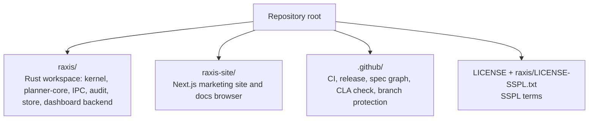

# RAXIS

> **R**untime **A**ttestation e**X**change for **I**ntelligent **S**ystems
> — Structural confinement kernel for autonomous AI agents.

Twelve non-negotiable invariants enforce that intelligence can't do
anything authority didn't structurally permit. Isolated microVMs,
cryptographic audit chains, credential proxies, fail-closed intent
admission. See [`raxis/specs/invariants.md`](raxis/specs/invariants.md)
for the full invariant catalogue and [`raxis/README.md`](raxis/README.md)
for a project-level overview.

## Repository layout



`raxis/` is a self-contained Cargo workspace; `raxis-site/` is a
self-contained Next.js project that mirrors `raxis/specs/` /
`raxis/guides/` for the public docs site at <https://raxis.io>.

## Documentation map

| Need | Start here |
|---|---|
| Build and run a local kernel | [`raxis/guides/SETUP.md`](raxis/guides/SETUP.md) |
| Learn by running one initiative | [`raxis/guides/getting-started/`](raxis/guides/getting-started/) |
| Find a focused operator recipe | [`raxis/guides/recipes/`](raxis/guides/recipes/) |
| Understand the security model | [`raxis/guides/security/raxis-security-model.md`](raxis/guides/security/raxis-security-model.md) |
| Check invariants and specs | [`raxis/specs/README.md`](raxis/specs/README.md) and [`raxis/specs/invariants.md`](raxis/specs/invariants.md) |

## Building

```sh
# Rust workspace
cd raxis
cargo build --workspace --locked

# Dashboard frontend
cd dashboard-fe
npm install
npm run build

# Marketing/docs site
cd ../../raxis-site
npm install
npm run dev
```

For a complete from-source kernel install, including host
requirements, guest image baking, trust-anchor embedding, and macOS
code signing, use [`raxis/guides/SETUP.md`](raxis/guides/SETUP.md)
and [`raxis/specs/v2/system-requirements.md §9`](raxis/specs/v2/system-requirements.md#9-building-from-source).

The `.github/workflows/` jobs run from the repository root with
`working-directory: raxis` for Rust steps and from `raxis-site/`
for the site build — no path rewriting needed.

## License

SSPL-1.0. See [`LICENSE`](LICENSE) (the SSPL header) and
[`raxis/LICENSE-SSPL.txt`](raxis/LICENSE-SSPL.txt) (the full SSPL text).

Contributions require sign-off via the project CLA: see
[`raxis/CLA.md`](raxis/CLA.md). Every pull request opens with the
[`.github/PULL_REQUEST_TEMPLATE.md`](.github/PULL_REQUEST_TEMPLATE.md)
which contains a CLA-agreement checkbox; the `cla-check` workflow
verifies the box is ticked and is a required status check on `main`
(see [`.github/scripts/protect-main.sh`](.github/scripts/protect-main.sh)).

## Provenance

This repository was split out of `chika5105/aegis-ai` on
2026-05-14 to give RAXIS its own independent repository identity.
The `raxis/` and `.github/` history was migrated verbatim with
`git filter-repo` (preserving the `main` branch only); `raxis-site/`
was joined as a `git subtree` so its 28 commits are fully reachable
under that prefix. The original `chika5105/aegis-ai` repository
remains in place as a read-only fallback.
