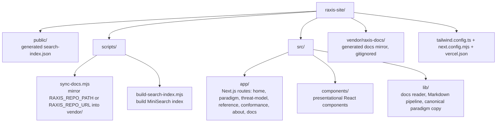

# raxis-site

Marketing site and live documentation browser for the **RAXIS** paradigm — *Runtime Attestation eXchange for Intelligent Systems*. Built with Next.js 15 (App Router), TypeScript, Tailwind, and a build-time Markdown pipeline that pulls every documentation file straight out of the public [`raxis`](https://github.com/) repository.

> **One-line positioning:** AI agents — authorized actions only, fully audited.

## What this repo is

- **Marketing pages** at `/`, `/paradigm`, `/threat-model`, `/reference`, `/conformance`, `/about`. Copy is calibrated to executives, security leaders, and engineers in equal measure.
- **A live documentation browser** at `/docs` and `/docs/[...slug]`. Every `*.md` file in the source raxis repository is automatically indexed, categorized, rendered with syntax-highlighted code blocks, and linked into a sidebar that follows the source directory structure.
- **A client-side full-text search** at `/docs/search`. Built on [MiniSearch](https://lucaong.github.io/minisearch/). The serialized index ships as `public/search-index.json`; queries run entirely in the browser. No telemetry. No remote requests.

The site is a static Next.js app and deploys cleanly to Vercel.

## How the docs loader works

At `prebuild` time, two Node scripts run in order:

1. **`scripts/sync-docs.mjs`** — mirrors every Markdown file from your raxis source into `vendor/raxis-docs/`. Resolution order:
   1. `RAXIS_REPO_PATH=/abs/or/relative/path` — copy from a local checkout.
   2. `RAXIS_REPO_URL=https://...git` — shallow-clone the repo into `vendor/_raxis-clone/` and copy from there. Set `RAXIS_REPO_SUBDIR=raxis` when cloning the public monorepo. (Used by Vercel.)
   3. Existing `vendor/raxis-docs/` — reuse the last good mirror.
   4. Nothing — emit a placeholder so the site still builds.
2. **`scripts/build-search-index.mjs`** — walks the mirrored tree, extracts titles, headings, and plain-text bodies, builds a MiniSearch index, and writes it to `public/search-index.json`.

At runtime, `src/lib/docs.ts` reads from `vendor/raxis-docs/` by default. In production, you may instead set `RAXIS_GITHUB_REPO` to read the public repository through anonymous GitHub API calls. There is no GitHub auth flow and no GitHub token path.

## Getting started

```bash
# 1. Install
npm install

# 2. Point at your raxis checkout
cp .env.example .env
# edit .env and set RAXIS_REPO_PATH=../raxis (or wherever your checkout lives)

# 3. Run dev server
npm run dev

# 4. Build for production
npm run build && npm start
```

The dev server triggers `predev` which runs the docs sync + search index build. After the first run you can edit raxis docs and re-run `npm run sync-docs` to refresh.

## Deploying to Vercel

The site deploys without any custom configuration. The recommended setup:

1. Push this repo to GitHub (or your git host of choice).
2. Import it in the Vercel dashboard.
3. Set production environment variables: **`RAXIS_REPO_URL`** = the public git URL of the raxis repository (e.g. `https://github.com/chika5105/raxis.git`) and **`RAXIS_REPO_SUBDIR=raxis`**. No GitHub token is required.
4. Trigger a build. The `prebuild` step shallow-clones raxis, mirrors every `.md` into `vendor/raxis-docs/`, and the rest of the build works normally.

For live docs that refresh from the public repository without a redeploy, set:

```bash
RAXIS_GITHUB_REPO=chika5105/raxis
RAXIS_GITHUB_BRANCH=main
RAXIS_GITHUB_PREFIX=raxis
```

Those runtime requests are anonymous GitHub API/raw-content requests. Do not configure a GitHub token for the public site.

To trigger an automatic redeploy whenever raxis is updated, add a deploy hook to the raxis repo's CI: `curl -X POST $VERCEL_DEPLOY_HOOK_URL`.

## Project structure



## Editorial source-of-truth rules

- The **paradigm spec** ([`raxis/specs/paradigm.md`](../raxis/specs/paradigm.md)) wins over any wording on the website. Copy in `src/lib/paradigm.ts` is downstream and must be updated whenever the spec changes.
- **Honesty about gaps.** The site says explicitly where the current reference implementation falls short — Tier 3 not yet claimed, no hardware root of trust, no model identity attestation, no semantic effect verification. Match the source docs (`perspectives/raxis-concept.md`, `perspectives/case-against-raxis.md`).
- **No "Docker for agents," no "AI safety platform," no vague verbs.** The spec rejects these framings explicitly; the site follows.

## License

This site repository is released under the same terms as the rest of the RAXIS organization's marketing assets. The reference implementation it documents is released under SSPL.

## Credits

RAXIS was developed by **Chika Jinanwa**. Sibling project: [Aegis](https://tryaegis.io) — EDR for AI workloads.
