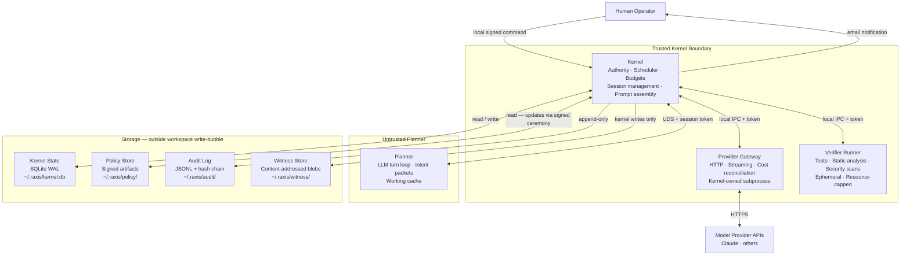
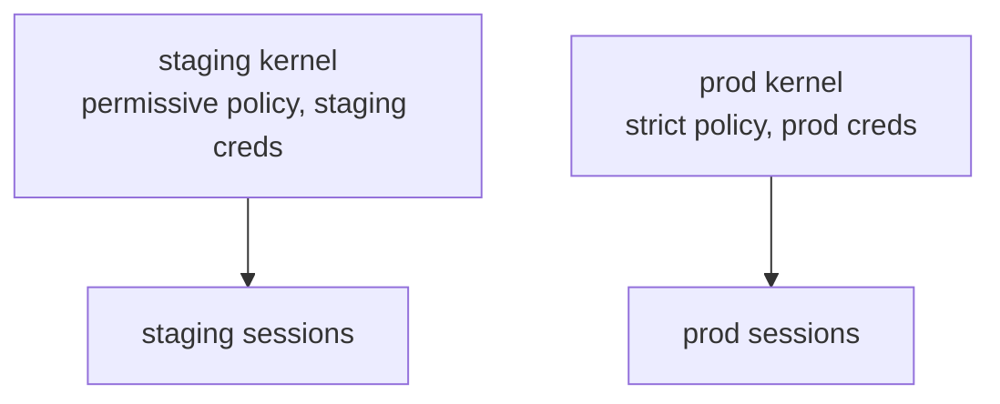

# RAXIS

**Runtime Attestation eXchange for Intelligent Systems**

RAXIS is a protocol paradigm for enforcing accountable autonomous action. It defines how an intelligent system — an LLM-backed agent, a planner, an autonomous executor — must interact with its environment: every action is preceded by an explicit, structured claim; that claim is verified against independent ground truth by a separate authority before any side effect is admitted; and every admission or rejection is recorded in a tamper-evident ledger that can be audited independently of the agent that produced it.

The core principle: **intelligence and authority must be separated.** The component that decides what to do is never the same component that enforces what is allowed. This boundary is enforced by design — by process isolation, typed IPC, and cryptographic attestation — not by convention, prompt engineering, or model alignment alone.

RAXIS answers the question: *how do you trust an AI agent's actions in a system where the cost of being wrong is real?* Not by training the model to be trustworthy. By verifying — independently, at runtime, before admission — that what the agent claims to have done is what actually happened, and that it was authorized to do it.

> **This repository is the v1 + v2 reference implementation of RAXIS for autonomous software engineering.** RAXIS itself is a paradigm — twelve structural invariants ([`specs/paradigm.md`](specs/paradigm.md)) any conformant implementation must satisfy. The Rust workspace here applies that paradigm to one domain (planner agents reading and writing code, integrating changes into a main git repository). Other reference implementations could exist for other domains — autonomous customer support, autonomous trading, autonomous robotics — sharing the same R-invariants but different domain-specific authority operations. See [`POSITIONING.md`](POSITIONING.md) for how RAXIS positions against existing categories (alignment, agent frameworks, sandbox runtimes, policy engines, AIOS, MCP) and [`specs/paradigm.md`](specs/paradigm.md) for the formal paradigm definition. For background on how this project arrived at the paradigm and how far the current implementation is from the full vision, see [`perspectives/naming-rationale.md`](perspectives/naming-rationale.md), and for a deliberate steel-man critique with structured defense see [`perspectives/case-against-raxis.md`](perspectives/case-against-raxis.md) and [`perspectives/raxis-defense.md`](perspectives/raxis-defense.md) (indexed from [`perspectives/README.md`](perspectives/README.md)).

---

## RAXIS as a Paradigm

RAXIS is a paradigm for autonomous-system safety; this repository is one implementation of it. Treating the two layers separately is essential to understanding both what RAXIS *is* and what this codebase *does*.

### The two layers

| Layer | Definition | Source of truth |
|---|---|---|
| **The paradigm** | Twelve structural invariants any RAXIS implementation must satisfy. Domain-agnostic. Implementation-language-agnostic. Isolation-primitive-agnostic. | [`specs/paradigm.md`](specs/paradigm.md) |
| **This reference implementation** | A Rust workspace realizing the paradigm for autonomous software engineering. Concrete tech choices: microVMs (Firecracker / Apple Virtualization.framework), Ed25519-signed TOML policy artifacts, hash-chained JSONL audit log (Merkle-tree in V3), git-shaped intent kinds (`IntegrationMerge`, `CompleteTask`, `SubmitReview`, …). | [`README.md`](README.md), [`specs/v1/`](specs/v1/), [`specs/v2/`](specs/v2/) |

When prospects ask "is RAXIS [X]?", the answer depends on which layer they mean:

- *"Is RAXIS Rust?"* — Paradigm: no. This implementation: yes.
- *"Does RAXIS use git?"* — Paradigm: no. This implementation: yes (the domain is software engineering).
- *"Does RAXIS run on Windows?"* — Paradigm: agnostic. This implementation: not yet (Linux + macOS only — see [`specs/v2/system-requirements.md`](specs/v2/system-requirements.md)).
- *"Is RAXIS for coding agents?"* — Paradigm: applicable to any autonomous-action domain. This implementation: yes, coding is the domain.

### The twelve paradigm invariants

Every RAXIS implementation, in every domain, on any tech stack, satisfies these. Full statements with rationale and verification methods are in [`specs/paradigm.md`](specs/paradigm.md) §3.

**Structural separation:**

- **R-1 Domain Separation** — Intelligence and authority run in distinct execution domains; no shared mutable state.
- **R-2 Mediated I/O** — All credential, network, storage, and peer-intelligence access mediated by authority through typed intents.

**Authority model:**

- **R-3 Signed Capability Declaration** — Every capability declared in a cryptographically signed policy artifact attributable to a human principal.
- **R-4 Authority Derivation Hierarchy** — Sub-artifacts (plans, sub-policies, delegated sessions) may only narrow parent authority, never expand it.
- **R-5 Bounded Capabilities** — Every granted capability carries explicit numerical bounds (count, rate, value, time).
- **R-6 Fail-Closed Default** — Ambiguity, missing policy, evaluation failure, and system failure all resolve to deny.

**Accountability:**

- **R-7 Cryptographic Audit Chain** — Audit modifications detectable by an independent verifier holding only the log and public keys.
- **R-8 Auditable Decisions** — Authority decisions reproducible from recorded inputs; ambient state recorded.
- **R-9 Attributable Intent** — Every intent traces to a verified intelligence identity.
- **R-10 Opaque Rejection** — Agent-facing rejections reveal no specific rule; internal policy structure is not leaked.

**Coordination and recovery:**

- **R-11 Mediated Coordination** — Multi-agent communication passes through authority subject to admission checks.
- **R-12 Out-of-Band Escalation** — Authority widening requires human approval via a channel intelligence cannot reach.

A system claiming to be RAXIS satisfies all twelve. Anything less is not RAXIS — it may be useful, well-engineered, even safer than alternatives, but the paradigm is the conjunction of all twelve invariants and none can be dropped without losing the property the paradigm provides.

The reference implementation in this repository enforces each R-invariant through specific INV-* mechanisms; the mapping is in [`specs/paradigm.md`](specs/paradigm.md) §6.

### What it means to be RAXIS-Verified

To prevent "RAXIS-Verified" from becoming meaningless marketing, conformance has three tiers with progressively stronger evidentiary requirements ([`specs/paradigm.md`](specs/paradigm.md) §4 has the full contract).

| Tier | Name | Evidence required | Verification |
|---|---|---|---|
| **Tier 1** | **RAXIS-Aligned** | Public conformance statement mapping each R-invariant to its enforcement mechanism, with architectural diagram of the intelligence/authority boundary | Self-attested |
| **Tier 2** | **RAXIS-Tested** | Tier 1 + canonical RAXIS conformance test suite passes (positive and adversarial cases for every R-invariant) | Self-tested with open-source reproducible test suite |
| **Tier 3** | **RAXIS-Verified** | Tier 2 + independent third-party audit by a qualified verifier; covers source-code audit of the authority layer, isolation soundness review, audit format conformance, credential-isolation pen-test, policy artifact format conformance; annual re-audit | Independent third-party audit |

The unqualified term **"RAXIS-Verified"** refers to Tier 3 only. Lower tiers must be qualified ("RAXIS-Aligned" or "RAXIS-Tested").

Qualified verifiers must satisfy independence (no financial relationship beyond audit fee), methodology transparency (published audit methodology open to community review), reproducibility (findings reproducible by a second independent verifier), conflict disclosure, and certification by the RAXIS specification body. This mirrors the model used by FIPS 140 cryptographic module validation labs and Common Criteria evaluation labs.

**Status of this reference implementation:** Tier 1 — RAXIS-Aligned (architectural mechanisms for all twelve R-invariants are present and documented). Partial Tier 2 — extensive INV-* test coverage in this codebase, but the canonical paradigm conformance test suite is V3 GA scope. Tier 3 is not currently claimed and would require both the canonical conformance suite to be adopted and a qualified verifier engagement.

---

## This Repository

What you have checked out is the **RAXIS** codebase: a **Rust workspace** meant to be built and run with **this directory as the root** (`cargo build`, `cargo test`, paths in the specs). That stays true if you clone the repo by itself or park it inside a larger monorepo for a while.

Do not confuse the workspace root with **where the kernel keeps live state**. Databases, sockets, audit log segments, witness blobs, and the policy cache live under **`$RAXIS_DATA_DIR`**, which defaults to **`~/.raxis/`**. That location is fixed by environment variable, not by where the Git tree sits on disk.

For operator actions (genesis, plan approval, escalations,
audit-chain verification, and the rest), the spec names one binary:
**`raxis`**. Details are in Part 4
([`specs/v1/cli-ceremony.md`](specs/v1/cli-ceremony.md)). The Cargo
crate that produces this binary is `raxis-cli` (the crate name remains
stable because it is referenced from workspace dependencies); the
produced binary is plain `raxis` so operator commands read naturally
(`raxis genesis`, `raxis policy sign policy.toml --key operator.key`,
etc.).

---

## Quick Start

The maintained operator runbook is [`guides/SETUP.md`](guides/SETUP.md).
Use it for a clean machine. This section is the orientation-level
version so the top-level README does not become a second stale setup
manual.

### 1. Build and Install from Source

RAXIS is written in Rust. The full requirements are in
[`guides/getting-started/01-prereqs.md`](guides/getting-started/01-prereqs.md)
and [`specs/v2/system-requirements.md §9`](specs/v2/system-requirements.md#9-building-from-source).
Run the platform prerequisite command first:

```bash
# From the raxis/ workspace root
# macOS:
cargo xtask dev-prereqs --install

# Linux:
cargo xtask linux-prereqs
```

Then prove the workspace builds with the checked-in lockfile and
build the host binaries:

```bash
cargo build --workspace --locked
cargo build --release --locked \
  -p raxis-cli \
  -p raxis-kernel \
  -p raxis-gateway \
  -p raxis-otel-pusher \
  -p raxis-supervisor
```

Bake images:

```bash
# Guest image bundle; pass your staged guest kernel + config.
cargo xtask images bake \
  --kernel-from-file /path/to/vmlinux \
  --kernel-config /path/to/vmlinux.config
```

Finally build and verify the kernel trust anchor:

```bash
RAXIS_KERNEL_SIGNING_KEY_HEX="$(cat .git/info/raxis-signing-key/pk.hex)" \
  cargo build --release --locked -p raxis-kernel
cargo xtask images verify-trust-anchor --kernel target/release/raxis-kernel
```

Dashboard frontend:

```bash
cd dashboard-fe
npm install
npm run build
cd ..
```

Install the operator-facing tools if you want them on `$PATH`:

```bash
cargo install --path cli --locked --force
cargo install --path gateway --locked --force
cargo install --path pusher --locked --force
cargo install --path crates/supervisor --bin raxis-supervisor --locked --force
```

Ensure `~/.cargo/bin` is in your `$PATH`.

### 2. Set Up Your Operator Identity

Setting up RAXIS requires you to create your secure operator identity. Because of the strict trust boundary, the operator private key is never generated by or stored in the RAXIS kernel.

RAXIS expects **Ed25519 PEM** keys compatible with **OpenSSL 3**’s `genpkey` / `pkey`. On **macOS**, the default **`/usr/bin/openssl`** is usually **LibreSSL**, which often reports **`Algorithm ed25519 not found`** (or accepts no Ed25519 implementation for `genpkey`). Use **Homebrew OpenSSL 3** for this step.

1. **Use OpenSSL 3 on the `PATH` for the two commands below**

   - **macOS (Homebrew):** `brew install openssl@3`, then for the current shell pick one:
     - Apple Silicon: `export PATH="/opt/homebrew/opt/openssl@3/bin:$PATH"`
     - Intel: `export PATH="/usr/local/opt/openssl@3/bin:$PATH"`
     - Or invoke by full path: `$(brew --prefix openssl@3)/bin/openssl …`

   - **Linux:** Your distro’s **`openssl` package is typically OpenSSL 3; ensure `openssl version` shows **OpenSSL 3**, not LibreSSL.

2. **Generate your operator private key** (keep it secure; in production, do not keep it on the same machine as the kernel):
   ```bash
   openssl genpkey -algorithm ED25519 -out operator_private.pem
   ```

3. **Extract your public key**:
   ```bash
   openssl pkey -in operator_private.pem -pubout -out operator_public.pem
   ```

#### Troubleshooting operator keys

| Symptom | Cause | Fix |
|---------|--------|-----|
| **`Algorithm ed25519 not found`** (or similar) on `genpkey` | Default `openssl` is **LibreSSL** (common on macOS) | Install **`openssl@3`** via Homebrew and use that binary (see step 1 above). |
| **`unable to load key`** / **No such file** on `pkey` | First command failed, so `operator_private.pem` was never created | Fix `genpkey` with OpenSSL 3, then re-run both commands in order. |
| **`unknown flag --operator-pubkey`** on `genesis` | Cert-mandatory release removed the bare-pubkey flag (INV-CERT-01) — every operator entry MUST ship a self-signed cert. | Use **`raxis genesis --operator-cert <path>`** (air-gapped: pre-mint a cert with `raxis cert mint` on the offline machine that holds the private key) **or** **`raxis genesis --operator-key <path> --operator-name <display>`** (convenience: in-process minting; the private key is read into memory only and is **never persisted** under `<data_dir>`). |
| Unsure which binary runs | — | Run `openssl version`. You want **OpenSSL 3.x**, not LibreSSL, for generating these keys. |

### 3. Bootstrap and Run

1. **Run the Genesis Ceremony**. RAXIS is **cert-mandatory** (INV-CERT-01): every operator entry in `policy.toml` carries a self-signed `OperatorCert`. There is no bare-pubkey path. Pick one of two flows:

   **Convenience (single-machine / development).** Hand the CLI your operator private key; it mints the cert in-process and embeds it in the freshly emitted `policy.toml`. The private key is read into memory only — it is **NEVER persisted** under `<data_dir>`. The CLI tests assert this with a recursive seed-leakage scan.
   ```bash
   raxis genesis --operator-key operator_private.pem --operator-name "Chika"
   ```

   **Air-gapped (recommended for production / tighter security).** Mint the cert on a separate machine that holds the operator private key (see §5 below for `raxis cert mint`), copy the resulting `*.cert.toml` to the kernel host, and embed it without ever exposing the private key to the host running the kernel:
   ```bash
   raxis genesis --operator-cert chika.cert.toml
   ```

2. **Start the Kernel**:
   ```bash
   target/release/raxis-kernel
   ```
   *(Note: You do not need to run `raxis-gateway` manually. The kernel will automatically spawn and supervise the gateway subprocess for you.)*

### 4. Planner worktree and session bootstrap

In v1 the kernel **does not** create Git worktrees. The operator or an orchestrator script creates an isolated checkout, then binds that path when minting the planner session (see [`specs/v1/kernel-core.md`](specs/v1/kernel-core.md) — operator contract and [`specs/v1/cli-ceremony.md`](specs/v1/cli-ceremony.md) §`session create`).

That separation is deliberate: branching layout, naming (`agents/…`), and cleanup stay in **your** automation; RAXIS stays agnostic beyond **`worktree_root` must resolve to a real Git worktree** and **`git -C "$wt" …` succeeds** whenever the kernel runs VCS helpers. Ensure the worktree directory’s canonical path is covered by **`[sessions] allowed_worktree_roots`** in the signed policy (see [`specs/v1/cli-ceremony.md`](specs/v1/cli-ceremony.md) and Session create in Part 4).

For most setups this is trivial to script. A short wrapper covers the common case: pick a lineage id (UUID), add a dedicated worktree and branch under your main repo path, open a planner session with a pinned tracking ref for integration semantics:

```bash
# Example inputs: REPO="$HOME/src/myproject" lineage_id="$(uuidgen | tr '[:upper:]' '[:lower:]')"
# RAXIS_WORK=a directory Policy allows under allowed_worktree_roots (see policy.toml).

wt="$RAXIS_WORK/$lineage_id"
git -C "$REPO" worktree add "$wt" -b "agents/$lineage_id"
raxis session create --role planner --worktree-root "$wt" \
  --base-tracking-ref refs/heads/main --lineage-id "$lineage_id"
```

Adjust `refs/heads/main` if your pinned integration base differs. After editing policy, plans, or this repo’s code, commit and push according to your org’s workflow; the snippet above does not substitute for normal version control hygiene.

### 5. Operator Certificates (mandatory — INV-CERT-01)

`raxis cert mint` issues an operator certificate that binds together
`(display_name, pubkey, validity window, permitted_ops)` and is
self-signed by the operator's Ed25519 key. Standard certs follow a
four-zone expiry model (Active / Expiring / Grace / Expired) so
expired keys fail closed automatically; `mint-emergency` produces a
pinned `EmergencyRecovery` cert that never expires and can only
perform `RotateEpoch` (the break-glass key).

Operator certs are **mandatory** in v1: every `[[operators.entries]]`
block in `policy.toml` carries a self-signed `[operators.entries.cert]`
sub-table, and the policy loader rejects any entry without one with a
serde `missing field "cert"` error. The convenience genesis flow
(§3.1 above) mints this cert for you in-process; the air-gapped flow
expects you to pre-mint it offline:

```bash
# Mint a 1-year cert with the default 30-day warn window and
# 7-day grace period (run on the offline machine that holds the
# operator private key).
raxis cert mint \
  --display-name "Chika"  \
  --key          operator_private.pem \
  --ops          "CreateInitiative,ApprovePlan,RotateEpoch,QuarantineInitiative,QuarantinePlansBy" \
  --out          chika.cert.toml

# Air-gapped genesis — embed the pre-minted cert without ever
# exposing the operator private key to the kernel host.
raxis genesis --operator-cert chika.cert.toml

# Cert rotation (INV-CERT-04): replace an existing cert for the same
# operator pubkey. The new cert MUST have an identical pubkey_hex; a
# pubkey change is a different operator entirely and goes through
# `policy sign` + `epoch advance` instead.
raxis cert install --replace-for <old-fingerprint> \
                   --new-cert     chika-renewed.cert.toml \
                   --policy       "$RAXIS_DATA_DIR/policy/policy.toml"
raxis policy sign  "$RAXIS_DATA_DIR/policy/policy.toml" --key operator_private.pem
raxis epoch advance --policy "$RAXIS_DATA_DIR/policy/policy.toml" \
                    --sig    "$RAXIS_DATA_DIR/policy/policy.sig"
```

Rotations are auditable: `OperatorCertInstalled.previous_fingerprint`
records the prior cert fingerprint so a forensic auditor can
reconstruct the rotation chain end-to-end. Initial installs (no
prior cert for that pubkey) leave the field unset.

Inspect installed certs and their expiry zones with `raxis cert list`,
or run `raxis doctor` for a one-screen preflight that includes per-cert
status (warns on Expiring/Grace, fails on Expired/NotYetValid, and
fails loud on an empty `operator_certificates` table — INV-CERT-01).

### 6. Quarantine — the operator break-glass

If an operator key or initiative is suspected compromised, freeze it
immediately:

```bash
# Freeze a single initiative (in-flight tasks are NOT aborted —
# new IntentRequests are rejected with FAIL_INITIATIVE_QUARANTINED).
raxis initiative quarantine <initiative_id> --reason "leaked secret in #ops"

# Sweep every initiative whose plan was approved by a compromised
# operator. The kernel atomically inserts one quarantine row per
# initiative + emits one InitiativeQuarantined audit event per row
# plus a single OperatorQuarantineSwept rollup.
raxis operator quarantine-plans-by <target_fingerprint> \
                                   --reason "key suspected compromised"
```

Quarantine is the immediate containment primitive; the slower
`policy sign` + `epoch advance` ceremony then handles operator-key
rotation. Quarantine cannot be lifted in v1 — work that should
continue must move to a fresh initiative.

### 7. CLI ergonomics — typo suggestions

Like `git`, the `raxis` CLI proposes corrections when you mistype a
subcommand at any depth (top-level or under a parent like `cert`,
`plan`, `policy`, `initiative`, `operator`):

```bash
$ raxis stauts
error: usage: unknown subcommand: "stauts". Did you mean `status`?

$ raxis cert mintt
error: usage: unknown cert sub-command: "mintt". Did you mean `mint` or `mint-emergency`?

$ raxis ce
error: usage: unknown subcommand: "ce". Did you mean one of: `cert`, `epoch`, `escalation`?
```

Suggestions are Damerau–Levenshtein-ranked, prefix-matches surface
first, the threshold scales with input length (single-letter inputs
match prefixes only), and the line is capped at 5 candidates so it
stays scannable. The dispatcher and the suggestion catalogue are
drift-tested against each other so the suggestions can never lie
about which commands actually exist. Spec'd in
[`specs/v1/cli-ceremony.md`](specs/v1/cli-ceremony.md) §4.1
("Unknown-subcommand handling — \"did you mean ...?\"").

### Prompt assembly — “prompt engineering” in v1 (spec level)

Structural enforcement beats ad-hoc model steering. That said, **v1 does define prompt-related contracts**:

- **[`specs/v1/peripherals.md`](specs/v1/peripherals.md)** §3.1: the kernel’s **`prompt::assemble`** path builds a **system-prompt scaffold** from **kernel-owned** facts—policy epoch, session identity (including bounded **`worktree_root`**), delegation summary, initiative context—not from free‑form prose the planner chooses. Inference traffic still flows **planner → kernel → gateway** under **`INV-02A`**.

- **[`specs/v1/planner-api.md`](specs/v1/planner-api.md)**: operators (or tooling) **inject this file verbatim** into the planner system prompt as the machine-readable IPC contract—intent shapes, **`PlannerErrorCode`** remediation, escalation summary, budgets, and “must not” rules—so retries and failures stay aligned with **opaque kernel rejections** (see **`INV-08`** and the planner-feedback model in [`specs/v1/kernel-store.md`](specs/v1/kernel-store.md)).

So “prompt engineering” in RAXIS v1 means **curated scaffold + verbatim API spec**, not unstructured instructions that substitute for verifier-backed gates.

---

## The Problem

Modern coding agents can produce substantial software output, but they are not trustworthy as control-plane actors.
Current systems often let the same model process generate work, interpret policy, and validate outcomes, creating a shared-delusion loop where hallucinated facts can pass as verified truth.

The core gap is not "better prompting"; it is missing infrastructure: a local control plane that treats agent/planner output as untrusted, enforces authority boundaries mechanically, and evaluates promotion quality through evidence bound to specific commits, tasks, and verifier runs.

This requires separating non-negotiable authority controls (permissions, budgets, escalation, routing) from negotiable quality controls (design and code-health gates with explicit, signed exceptions), while preserving append-only auditability and deterministic recovery.

RAXIS exists to provide that missing layer between human intent and autonomous execution: a system where policy is not inferred from prose, outcomes are not accepted without witnesses, and every decision is reconstructable from kernel-owned records.

---

## The Technical Plan

### Overview

RAXIS is structured as a small cluster of processes — not a single application — where each process has a clearly defined role and trust level.
The central idea is that the component that makes authority decisions must be physically separate from the component that produces proposals. **In v1**, that separation is achieved by **running separate processes with typed IPC** so the kernel never executes planner code in-process; stronger host containment (separate OS identities, sandboxes, peer credential checks) is **not** fully delivered by v1 alone — see **Assumptions and Limits** and the **v2 Host isolation** row.

### The Kernel

> **Note on Terminology:** The "RAXIS Kernel" is an architectural metaphor. It is a standard user-space Rust daemon. It does not run in kernel-space (ring 0), nor does it require root privileges, eBPF, or custom OS kernel modules to operate.

The kernel is the authority core of the system.
It is a long-lived local process that owns everything with real consequences: it assigns identity to sessions, controls what each agent is allowed to do, manages the queue of work, enforces cost budgets, decides whether an escalation reaches a human, and records every decision into an append-only audit log.

Critically, the kernel never reads the text content of agent messages when making policy decisions.
It evaluates only structured envelope fields — session ID, role, capability flags, quota state — that were set by the kernel itself at session creation and cannot be overwritten by a model.
This means a sophisticated model output cannot argue its way into elevated authority: the kernel does not read arguments.

### The Planner

The planner is the agent loop.
It is explicitly treated as untrusted, even though it runs on your machine and is your own code, because it is the component most exposed to LLM outputs — which can hallucinate, be manipulated, or simply be wrong.
The planner reads task context, calls the AI model, and translates the model's response into structured "intent packets" — typed requests sent to the kernel over a local socket.
The kernel reads those requests at the metadata level: what kind of action is being requested, on which resource, by which session.
The prose content of the request is logged for audit purposes but does not drive the kernel's decision.

The planner holds a working cache of context needed for the current session — prompt packs, candidate plans, task summaries — but this cache is disposable: it can be wiped safely without affecting the authoritative record of what happened.

### The Provider Gateway

Every call to an external AI model (Claude or others) goes through the provider gateway, a separate process that the kernel spawns and controls.
The planner never has direct access to provider API keys.
When the planner needs a model response, it sends an inference request to the kernel over the local socket.
The kernel checks the budget, assembles the final prompt (injecting the static policy portion that the planner cannot modify), and hands the call to the gateway.
The gateway handles the HTTP connection, streaming, rate-limit backoff, and any provider-specific error handling, then returns a structured result to the kernel.
The kernel reconciles actual token usage against the approved budget before returning the result to the planner.

This design means the kernel can enforce a cost ceiling that is structurally impossible for the planner to bypass — direct API calls cannot happen because the planner does not hold the keys.

### The Verifier Runner

When a task is ready for promotion, the kernel spawns an ephemeral verifier process to run the quality gates: compiling the code, running tests, checking architecture boundary rules, performing security scans.
The verifier is a short-lived process with hard resource limits (wall-clock timeout, memory cap, process count cap).
It writes its results back to the kernel — not to a file the planner can read — and the kernel stores them in a witness store keyed by commit hash, task ID, gate type, and a kernel-issued run ID.

A test result is not accepted as evidence just because it exists.
The completion gate checks that a witness record for the specific commit under evaluation was generated by a kernel-issued verifier run — not a cached result from a previous version of the code, and not a file the planner wrote itself.

### The Storage Layer

Five stores hold the system's state, each with a different trust level and access model:

- **Kernel State Store** — the live runtime database. Sessions, delegations, task DAGs, lane queues, budget positions, escalation states. Only the kernel reads and writes this. Backed by a local SQLite database with WAL mode for crash safety.
- **Policy Store** — the rules the kernel enforces. Claim-requirement tables, role capability ceilings, signing key registries, override rules. Policy artifacts are signed; the SQLite index is a derived cache. Signed files are the ground truth.
- **Audit Log** — the unforgeable record. Every decision, denial, gate outcome, approval, and state transition lands here as an append-only JSONL entry, hash-chained across segments so tampering is detectable without a database.
- **Witness Store** — the evidence vault. Test results, static analysis outputs, diff fingerprints, and gate verdicts are stored as content-addressed blobs. The index records `evaluation_sha` (the commit identifier of the range intent the gate was evaluated against), task, and verifier run for each blob; `head_commit_sha` is the IPC/env alias used in some messages. See Part 2.3 for the canonical field name `evaluation_sha`.
- **Planner Working Cache** — the throwaway workspace. Context packs, candidate plans, and temporary summaries the planner needs to do its job. Aggressively TTL'd and can be wiped without consequence.

The four **trusted** stores (kernel state, policy, audit log, witness) live outside the repository workspace (under `~/.raxis/`), which reduces accidental access by agents operating inside the repository — see Assumptions and Limits for the full host-isolation caveat. The fifth bucket — the Planner Working Cache — is not a trusted store: it is disposable, aggressively TTL'd, and may live under `~/.raxis/planner-cache/` or any operator-configured path; wiping it has no effect on system correctness.

### Human Contact

The human operator communicates with the system through two deliberately separate channels.

**Email** is for notifications: progress updates on a configurable cadence, escalation alerts that need attention, completion summaries.
Email is outbound-only in the authority model — reading a notification and replying to it does not constitute an approval.

**A local signed command** is the only approval mechanism.
When an escalation requires a human decision, the operator reads the notification, assesses the request offline, and issues a cryptographically signed approval token through a local CLI tool.
The kernel validates the token by looking up the operator's public key from the loaded policy artifact (`policy.operator_entry(token.issued_by).public_key`), verifying the Ed25519 signature, checking the epoch matches the current policy epoch, and confirming the token's nonce has not been consumed. Authority cannot be granted by email reply, by prose in a chat window, or by any path that an agent can reach or forge.

### How a Piece of Work Flows Through the System

A typical initiative moves through the following stages:

1. The human submits a goal — a document, a spec, a set of requirements.
2. The planner produces a structured plan proposal: a task dependency graph, capability requirements per task, budget estimates, and machine-checkable success criteria.
3. The human reviews the structured plan, edits the terminal success criteria directly, and signs the artifact. The kernel accepts this and transitions the initiative from `draft` to `approved_plan`.
4. The kernel releases tasks to the admission queue in dependency order. The planner works on each task under the capabilities it has been granted.
5. When a task is complete, the verifier runner collects evidence. The kernel evaluates gates against submitted claims and witness blobs; terminal success for a task still requires an admitted **`IntentKind::CompleteTask`** (path checks, gate closure). Initiative-wide terminal moves (**`Executing` → `Completed` / `Failed` / `Blocked`**) run through **`lifecycle::evaluate_terminal_criteria`** after each **`transition_task`** — Part 2.4 §4.2 (*Terminal criteria and initiative state evaluation*) and §4.6 (`src/initiatives/lifecycle.rs`). Witness sufficiency alone does not complete a task.
6. When all tasks reach terminal success and the completion gate is satisfied, the initiative closes with a kernel-signed completion record.
7. Throughout, every decision — grants, denials, gate outcomes, escalations, amendments — is appended to the audit log.

> **This is a simplified flow.** The authoritative task lifecycle — including `GatesPending` (task admitted but witnesses still outstanding), sequential witness rechecks as each gate is satisfied, delegation staleness (`SufficientStale`, `warn_delegation_stale`), the distinction between `TaskState::Admitted` and schedulable-ready, and **`CompleteTask`** as the binding completion intent — is specified in Part 2.3 (`gates/mod.rs` `evaluate_claims`) and Part 2.4 (`handlers/intent.rs`). When in doubt, Part 2.3 + Part 2.4 amendment blocks are the contract; this narrative is orientation.

### Block Diagram



---

## Assumptions and Limits

RAXIS v1 is local-first and single-operator: it runs on one machine, owned and operated by one person, and makes no attempt to secure across a shared network boundary.
The kernel and planner run under the same OS user, so the host isolation guarantee is process-level and protocol-level, not OS-enforced; a process that fully escapes the IPC contract could reach kernel-adjacent paths.
Stronger host isolation — separate OS user, sandboxed execution environments — is explicitly planned for v2 and is a known, documented limitation of the v1 security model.

### Tightening isolation beyond “honest IPC clients” (design note)

The **authority story assumes each component behaves as specified**: the planner speaks only `raxis-ipc`, the gateway never impersonates the kernel, and agents operating inside the Git workspace do not compromise sibling processes. That holds when engineers preserve crate boundaries and configurations — but **it is not a kernel-enforced guarantee against a hostile or compromised agent running as the same POSIX user.**

**What “escaping the IPC protocol” means here**

Same-UID adversaries can, in principle: attach debuggers or inject code into the planner process; swap binaries or `LD_PRELOAD` shims; open **`$RAXIS_DATA_DIR`** files directly (SQLite, witness blobs, policy artifacts) instead of going through the kernel; bind competing listeners if paths were predictable and racing startup; or coerce a trusted helper process into acting outside its intended envelope. None of that is blocked by **typed messages alone** — it requires **OS-level containment**, operational discipline, or stronger deployment modes.

**Ideas worth fleshing out (not v1 contracts)**

Each item below needs threat modelling, platform choices, and usually a **dedicated gap spec** before implementation claims parity with the narrative:

1. **Separate OS identities** — kernel service account vs planner/gateway/verifier agents; filesystem ACLs / POSIX DAC so only the kernel user can read/write `kernel.db`, witness index paths, and append-only audit segment files; operator CLI runs via `sudo`-style elevation or a setgid helper with narrow surface.
2. **Sandboxed subprocesses** — per-role profiles (macOS Seatbelt, Linux `bubblewrap`/namespaces, minimal container images) with explicit allowlists for **only** the kernel socket path, temp dirs, and Git worktree; deny generic `$HOME` reads where feasible.
3. **Syscall and filesystem tightening** — seccomp-BPF / Landlock (Linux), AppArmor/SELinux profiles labeling `raxis-kernel` vs `raxis-planner`, restricting `ptrace`, `CLONE_*`, and unexpected `connect`.
4. **Socket hardening** — fixed paths under `0700` data dirs (already implied), optional abstract-namespace or Linux `SO_PEERCRED` / `getsockopt` peer UID checks so only the expected UID may connect to planner/gateway sockets.
5. **Supply chain** — reproducible builds, code signing or measured boot tie-ins for operator binaries in high-assurance deployments (pairs naturally with **FIDO2 operator auth** in the v3 roadmap).
6. **Verifier / tool isolation** — disposable VMs or per-task namespaces so malicious repo content cannot pivot into the kernel host even when gates execute attacker-controlled scripts.

These directions overlap the **v2 Host isolation** row below; they do not relax any v1 invariant — they describe **how much stronger than v1** a serious deployment would need to become once agents are treated as actively malicious rather than merely buggy.

---

## V1 vs V2

### v1 — Safe, Local, Minimal Viable Control Plane

The goal of v1 is to prove that the trust boundaries and correctness guarantees work before adding scale, convenience, or flexibility.

| Area | v1 Scope |
|---|---|
| **Process model** | Kernel, planner, provider gateway, verifier runner — four separate processes |
| **Authority enforcement** | Kernel owns permissions, budgets, queue admission, escalation state |
| **Planner trust** | Untrusted proposer only; planner prose never drives kernel decisions |
| **Providers** | One provider fully integrated (Claude); others stubbed in registry |
| **Roles / lanes** | One role, simple lane model; schema is fully defined for extension |
| **Plans** | Signed structured plan artifact; kernel-owned DAG execution |
| **Quality gates** | Witness-based gates bound to commit SHA + task ID + verifier run ID |
| **Storage** | Append-only audit log, witness store, kernel state store — all outside workspace |
| **Human approvals** | Local signed command only; email is notification-only |
| **Bootstrap** | Fail-closed genesis ceremony; basic break-glass with enumerated trigger classes |
| **Host isolation** | Same-user OS boundary — documented limitation (see **Assumptions and Limits** — tightening against IPC escape) |

### v2 — Scale, Precision, and Ergonomics

v2 extends the proven v1 foundation without weakening any of its guarantees.

| Area | v2 Additions |
|---|---|
| **Providers** | Multi-provider routing intelligence; richer typed registry with live capability tracking. Policy routing schema (which IntentKind or lane maps to which provider) and the model-selection field on InferenceRequest require a dedicated gap spec before they are implementable contracts. |
| **Scheduling** | Multi-lane fairness and priority sophistication beyond the v1 single-lane schema |
| **Policy precision** | Per-capability delegation staleness checks (impact-based, not any-epoch) |
| **Host isolation** | *(Exploratory — direction under consideration, not a finalized contract.)* Stronger isolation by default via **VM-based subprocess isolation**. The kernel spawns planner, verifier, and gateway subprocesses inside lightweight virtual machines rather than as same-UID host processes. Two platform-specific hypervisor backends: **(1) Linux: Firecracker microVMs** — the kernel talks directly to KVM via Firecracker's VMM API; sub-125ms boot, ~5MB overhead per VM, separate kernel per subprocess. **(2) macOS: Apple Virtualization.framework** — the kernel uses Apple's native hypervisor API (the same layer Lima uses internally, but without Lima as a dependency); ~200ms boot, native Apple Silicon performance, vsock + VirtioFS support. Each subprocess VM receives: a pre-built minimal rootfs image containing the statically-linked subprocess binary (`raxis-planner`, `raxis-verifier`) and nothing else (no shell, no package manager, no network tools); a VirtioFS mount scoped to the Git worktree (read-write for planner, read-only for verifier); a vsock channel back to the kernel for IPC; and no virtio-net device (enforcing `network_allowed=false` at the hypervisor level, not advisory). The kernel abstracts the hypervisor backend behind a `SpawnBackend` enum (`Firecracker`, `AppleVirtualization`, `Sandbox`, `Direct`) and selects the strongest available backend at startup, logging the active tier to the audit chain. **Fallback tiers:** on Linux without KVM → `bubblewrap`/namespace isolation; on macOS without Virtualization.framework → Seatbelt sandbox; anywhere else → v1 same-UID advisory model (`Direct`). The IPC transport layer swaps between UDS (v1, `Direct`/`Sandbox` tiers) and vsock (VM tiers) transparently — the message format (`raxis-ipc` bincode with 4-byte length prefix) is identical across all tiers. Gap spec must define: `SpawnBackend` enum and detection logic, rootfs image build pipeline (cross-compilation to `aarch64-unknown-linux-musl` / `x86_64-unknown-linux-musl`), VirtioFS mount policy (which paths, read-only vs read-write), vsock CID assignment, VM lifecycle management (spawn, health check, teardown, crash recovery), and the `VsockTransport` implementation of the `IpcTransport` trait. Rootfs image sizes: planner ~20-30MB, verifier ~50-100MB (includes compilers/test tools). Peer credential checks on UDS remain relevant for `Sandbox` and `Direct` tiers. |
| **Intake UX** | Richer plan amendment tooling and more ergonomic structured-plan review interface |
| **Quality analytics** | Advanced drift detection, anti-gaming signals, longitudinal complexity tracking |
| **Recovery** | More automated state recovery from audit replay; improved operator experience |
| **Multi-agent coordination** | Multiple kernel sessions running concurrently is **v1-compatible already**. v2's contribution is scheduling sophistication and the following kernel-mediated coordination primitives: (1) **kernel-mediated agent channels** — inter-agent messaging where the kernel is the relay and records the envelope of every message, preserving auditability and authority enforcement; (2) **hierarchical delegation** — orchestrator-spawns-sub-planner patterns where the orchestrator session delegates a bounded capability subset to a sub-session, with the kernel enforcing `sub-session-scope ⊆ orchestrator-scope` on every intent; (3) **kernel-push notifications** — kernel-initiated messages to active planner sessions (e.g. gate completion, epoch advance, quarantine events) without requiring the planner to poll; (4) **`session_agent_type` field** — kernel-visible principal type (e.g. Orchestrator, Executor, Reviewer) enabling type-specific enforcement rules. All four require dedicated gap specs with message types, capability scoping rules, and audit event shapes before implementation. |
| **Worktree concurrency & cross-session path safety** | When multiple planner sessions operate against the same repository, the kernel has no enforcement mechanism for worktree exclusivity or cross-session path conflict. This is safe in v1 (single session) but must be fully specified before v2 multi-session coordination can be considered an enforced invariant rather than a convention. Six gap specs are required: **(1) Worktree lock enforcement** — a `worktree_lock` table and admission predicate that prevents two sessions from having concurrent `Running` tasks against the same `worktree_root`; the current scheduler is entirely blind to the worktree dimension and `Admitted → Running` can race. **(2) Cross-session path overlap detection** — INV-TASK-PATH-01 enforces path allowlists per-session only; it does not detect when a session's `touched_paths` overlaps with an active `Running` task in any other session; cross-session conflict must be caught at intent admission time, not at `rev_parse_parent` failure. **(3) Shared-object-database isolation boundary** — `git worktree add` gives separate working trees and HEAD refs but shares the object database and packed-refs; a session can `cherry-pick` or `checkout` a commit SHA from another session's unmerged branch; the spec must define what the actual isolation guarantee is and what operations are and are not prevented across session boundaries. **(4) Lockfile and generated-artifact conflict policy** — repo-global files (`Cargo.lock`, `package-lock.json`, generated protobuf outputs, workspace `Cargo.toml`) are modified as side effects of operations in any session's path scope and cannot be owned by a single session's allowlist without blocking others; the kernel needs a typed policy for these cross-cutting artifacts (e.g., a `shared_artifacts` allowlist class with merge-time resolution semantics). **(5) `IntegrationMerge` gate semantics** — a merge commit has two parents; `SingleCommit`'s `parent(head) == base` invariant does not apply; the gap spec must define what evidence is required to admit a merge commit: whether gates re-run on the merged SHA, what `evaluation_sha` means for a merge, which session holds authority to submit the `IntegrationMerge`, and what `path_allowlist` scope that session must carry. **(6) Worktree lifecycle ownership** — the spec must define who creates and cleans up `git worktree` instances (kernel or operator), what the kernel does when a session terminates with an orphaned worktree, and how `BlockedRecoveryPending` recovery interacts with a worktree that may be in a partially-committed state. None of these are v1 concerns. All must be resolved before multi-session worktree coordination ships as an enforced property. |
| **Operator tool manifest** | Tool definitions live entirely in the signed policy artifact (`[[tools]]` blocks in `policy.toml`) — not in kernel code. The operator adds, updates, or removes tools by editing and re-signing the policy; no kernel release is required. Each `[[tools]]` entry carries a canonical `id`, description, input schema, per-provider name overrides (different providers may use different names for the same tool), and an `allowed_for` list of `session_agent_type` values. The kernel ships with an optional default tool library (data files, independently updatable, not compiled in) that operators may reference by `id` instead of writing schemas from scratch; custom tools not in the library can be defined inline. At `prompt/assemble` time, the kernel injects tool definitions for the session's agent type from the signed policy and nothing else — the agent has no mechanism to discover tools outside its assembled prompt. INV-TOOL-01: no tool definition reaches the agent that is not present in the operator-signed `[[tools]]` policy for that session's `session_agent_type`. Depends on `session_agent_type`. Requires a gap spec covering the `[[tools]]` policy schema, default tool library format, per-provider name resolution, and startup structural validation. |
| **Non-inference tool providers** | Kombai-class APIs and other non-inference tool providers — new provider class, typed adapter IPC, and witness semantics for non-inference outputs. Requires a dedicated gap spec. |
| **Planner architecture** | *(Exploratory — direction under consideration, not a finalized contract.)* The RAXIS-native planner (`raxis-planner`) is a purpose-built agent loop binary that runs inside the isolated subprocess environment (VM or sandbox, depending on `SpawnBackend` tier). It is statically linked, cross-compiled for the target rootfs architecture, and designed to run as PID 1 inside a microVM with no init system. **Agent loop structure:** the planner connects to the kernel over vsock (VM tiers) or UDS (sandbox/direct tiers), requests ready tasks via `NextReadyTasks`, picks up each task via `IntentKind::PickUpTask`, then enters a model-driven loop: (1) send `InferenceRequest` to kernel (kernel checks budget, assembles prompt with policy context the planner cannot modify, forwards to gateway); (2) parse model response into structured actions (file edits, tool calls, completion, failure); (3) apply file changes to worktree and commit; (4) submit `IntentKind::CommitRange` with `base_sha`/`head_sha` for kernel verification; (5) handle `Accepted` (continue) or `Rejected` (revert, adjust, retry); (6) submit `IntentKind::CompleteTask` or `IntentKind::ReportFailure` when done. The planner holds no API keys (INV-02A), has no network access, and does not select which model to use — all inference routing is kernel-controlled from policy. **Authentication:** the planner never authenticates with provider APIs; the gateway holds all provider credentials and the planner communicates exclusively with the kernel. The planner's session token is kernel-issued and presented on every IPC message. **Context management, tool-use parsing, retry heuristics, and multi-turn reasoning** are planner-internal concerns that do not require kernel coordination — only the structured intents cross the IPC boundary. Gap spec must define: the `raxis-planner` crate structure, the `InferenceRequest`/`InferenceResponse` message shapes on the planner→kernel path, context window management strategy, the model action parser interface, and integration test fixtures for the agent loop against a mock kernel. |

### v3 — Coordination, Flexibility, and Scale

> **Status:** Mixed. This table is the forward-looking coordination
> roadmap, not the full V3 implementation ledger. Several V3 slices
> already ship as implemented or active hardening work — dashboard
> session capture, task LLM capture, worktree snapshots, prompt
> caching, canonical-image trust anchors, OTel pusher plumbing, and
> live-e2e keep-alive. Use each spec header and
> [`specs/README.md`](specs/README.md) as the source of truth before
> treating any V3 item as future-only.

> **Rule:** An item moves from this section to a versioned additions table only when its gap spec is complete and reviewed.

| Area | v3 Additions |
|---|---|
| **Multi-planner coordination** | Cross-session path-conflict detection (`CrossSessionConflict` audit event), session-to-task pinning in signed plans (`task_session_assignment`), sub-initiative spawning with scoped plans and bounded capability sets, `cross_initiative_path_grants` table, `parent_initiative_id` on `initiatives`. Requires v2 `session_agent_type` and hierarchical delegation. |
| **Plan flexibility** | Incremental plan amendments (`PlanAmendment` signed delta, `parent_artifact_sha` linkage; add-only, never remove); operator-approved task retry (`raxis task retry <task_id>`, `retriable` flag, path accumulator reset-or-carry decision); cross-initiative dependencies (`initiative_dependencies` table, `next_ready_tasks` updated). |
| **Gate and enforcement evolution** | Composite gates (M-of-N quorum, `verifier_run_group`); conditional gates (path-pattern activation, `activation_pattern` field, vacuous-pass semantics); gate dependency ordering (gate-level DAG within a task); witness caching (`cacheable` flag, epoch-advance invalidation); gate-scoped break-glass with multi-operator co-signing (`BreakGlassScope::GateScoped`). |
| **Trust model expansion** | Planner-requested delegations (`DelegationRequest` IPC, `delegation_requests` table); delegation templates in policy artifact (`[[delegation_templates]]`, auto-approve on exact match); initiative-scoped delegations (`scope_type CHECK('Session','Initiative')`); multi-operator co-approval (`required_approvals`, `escalation_approval_votes`, `PartiallyApproved` FSM state). |
| **Hardware-presence operator auth** | Augment the v1 Ed25519 challenge-response with a mandatory hardware-presence second factor (FIDO2 / hardware security key tap) to make operator authentication agent-proof. An agent with OS-level access and software key files cannot authenticate without physical possession of the hardware token. Pure software mechanisms (CAPTCHA, TOTP on the same machine) are insufficient in a single-OS-user model. Requires a gap spec: FIDO2 assertion flow, hardware key registration ceremony, fallback policy (TOTP from a physically separate device), and kernel-side FIDO2 library integration. |
| **Observability and analytics** | Read-only audit query socket (`audit_index.db`); Prometheus `/metrics` endpoint with in-memory counters (`raxis-metrics` crate); planner-facing push event stream (uses v2 kernel-push, `Subscribe` IPC type); operator dashboard (`raxis dashboard`, reads audit query API and metrics, no kernel mutations). |
| **Distributed kernel** | Distributed state store (CockroachDB or etcd, behind `raxis-store` abstraction); shared nonce cache across instances (distributed UNIQUE on `(session_id, envelope_nonce)`); distributed budget enforcement (pessimistic lane lock or soft-limit reconciliation); audit log aggregation with cross-instance chain anchoring; session affinity with failover semantics. |
| **Plan portability** | Cross-deployment plan import (trusted-key registry in policy artifact, re-signing ceremony, `original_signature` field); plan replay mode for audit reconstruction (read-only kernel replay from audit log + signed plan). |

### Rule of Thumb

> v1 proves trust boundaries and correctness.
> v2 improves throughput, flexibility, and convenience without weakening v1 guarantees.
> v3 introduces coordination patterns, plan flexibility, and operational maturity at scale — each area gated behind a dedicated gap spec and a proven v2 baseline.

**On multi-agent execution:**

- **Sessions (v1):** Multiple concurrent agent sessions against one initiative DAG is v1-compatible; no v2 feature is required. v2 adds scheduling fairness and lane sophistication that makes concurrent sessions perform predictably under load — it does not introduce multi-session support as a new capability.
- **Model / provider selection (v2 target):** Routing inference calls to a specific model (e.g. Claude Sonnet for code edits) is directionally aligned with the v2 Providers row, but the policy routing schema and InferenceRequest model-hint field are not yet fully specified — treat as v2 intent requiring a gap spec, not a shipped contract. All model calls must remain planner → kernel → gateway under INV-02A regardless of which model is selected; the kernel selects from policy, the planner does not self-route.
- **Specialized tool providers / Kombai-class APIs (v2, requires gap spec):** Compatible with the trust model if kernel-gated, logged, and allowlisted. Requires a dedicated gap spec: new provider class, typed adapter IPC, and witness semantics for non-inference outputs. Committed v2 item.
- **Session-to-task assignment / environment labels like Cursor (v2 with `session_agent_type`):** The orchestrator or signed plan assigns tasks to sessions; the kernel validates that the assigned session holds the delegation for the task. `session_agent_type` is a committed v2 field that makes agent role (Orchestrator, Executor, Reviewer) kernel-visible, enabling type-specific enforcement rules. An orchestrator session cannot grant a sub-session capabilities beyond what the operator-signed policy allows.
- **No hidden optimization:** The kernel is a constraint-enforcer, not a talent broker. "Suitability" = declared preferences in the signed policy or signed plan. There is no learned optimization that discovers which agent is best for which work; encoding "use Kombai for frontend" means writing that constraint into policy or the orchestrator plan, not configuring a kernel preference engine.

---

## V1 Invariants — Quick Reference

Full invariant specifications (rationale, adversarial assertions, test cross-references) are in [`specs/v1/philosophy.md`](specs/v1/philosophy.md) §1.2.

| ID | Invariant |
|---|---|
| INV-01 | Planner cannot perform any authorized action without a valid kernel-issued session token |
| INV-02A | Planner has no provider credential access; all inference goes `InferenceRequest → kernel → gateway`; admission cost is kernel-computed, no planner-supplied field reaches `reserve_budget_in_tx` |
| INV-02B | Planner has no direct network egress; all fetches go `FetchRequest → kernel → gateway`; kernel logs every fetch before content is returned |
| INV-03 | A witness bound to commit SHA `A` cannot satisfy a gate check for commit SHA `B` |
| INV-04 | Any modification to the audit log is detectable by hash chain verification |
| INV-05 | Given the audit log and kernel state at crash time, kernel decisions are reproducible from stored records |
| INV-06 | An action requiring approval does not execute without a valid, scoped, unexpired approval token whose `ApprovalProof` is written to the kernel state store |
| INV-07 | A planner-submitted path manifest cannot influence which claim types are required; kernel derives required claims from VCS state independently |
| INV-08 | Rejection reason codes exposed to the planner do not reveal which specific policy rule fired |
| INV-TASK-PATH-01 | The kernel admits an intent if and only if every path in `touched_paths(intent)` is a member of `effective_allow(task_id)` at the time of admission; failing intents are rejected non-terminally |
| INV-TASK-PATH-02 | The kernel does not transition a task to `Completed` unless every path in the union of all intent ranges plus the trailing segment from `tasks.evaluation_sha` to `CompleteTask.head_sha` is a member of `effective_allow(task_id)` recomputed at completion time |

---

## Documentation Index

### Paradigm and positioning

| Document | Scope |
|---|---|
| [`specs/README.md`](specs/README.md) | Map of the specs tree — start here when deciding whether a contract lives in `invariants.md`, `v2/`, historical `v1/`, or forward-looking `v3/` |
| [`specs/paradigm.md`](specs/paradigm.md) | **The RAXIS paradigm** — formal definition, twelve R-invariants, RAXIS-Verified conformance contract, mapping from paradigm invariants to this implementation's INV-* invariants, acknowledged paradigm limitations. The authoritative source for what RAXIS *is* |
| [`POSITIONING.md`](POSITIONING.md) | **External positioning** — the one-line positioning, working taglines, why "Docker for agents" was rejected, where RAXIS sits in the stack, side-by-side comparison against alignment / agent frameworks / sandbox runtimes / policy engines / AIOS / MCP / coding-agent products / confidential computing, talking points and FAQ |

### Background

| Document | Scope |
|---|---|
| [`perspectives/need-for-cj-brain.md`](perspectives/need-for-cj-brain.md) | Why RAXIS exists — trust-model motivation and kernel-as-authority philosophy |
| [`perspectives/naming-rationale.md`](perspectives/naming-rationale.md) | Origin story, rename CJBrain → RAXIS, v1/v2 scope vs a full RAXIS vision |
| [`perspectives/README.md`](perspectives/README.md) | Index of perspective essays (origin, motivation, limits, pro/con) |
| [`perspectives/case-against-raxis.md`](perspectives/case-against-raxis.md) | Steel-man critique: why constraining models this way may be the wrong trade |
| [`perspectives/raxis-defense.md`](perspectives/raxis-defense.md) | Response: constraints on action, determinism, scaling, complements with better models |
| [`perspectives/raxis-concept.md`](perspectives/raxis-concept.md) | What “RAXIS” claims and where this repo stops short — earlier conceptual analysis that [`specs/paradigm.md`](specs/paradigm.md) formalizes |
| [`specs/design-decisions.md`](specs/design-decisions.md) | 20 design alternatives considered and rejected. Read before proposing a design change |

### Operator Guides

| Document | Scope |
|---|---|
| [`configuring-witnesses.md`](configuring-witnesses.md) | `[[gates]]` TOML schema, `VerifierSpawnEnvelope` env vars, exit codes, resource caps |
| [`kernel-feedback-flows.md`](kernel-feedback-flows.md) | Audit events, escalation notifications, gate outcomes, operator UDS socket protocol |

### Multi-Environment Deployments (Recommended)

> **Author's recommendation — Chika Jinanwa, RAXIS creator**

The recommended approach for environment isolation (staging, production,
etc.) is **one kernel per environment**:



Each kernel instance is fully self-contained via `--data-dir`: separate
SQLite store, separate credential directory, separate policy bundle,
separate audit chain, separate operator socket. A staging plan
**literally cannot access production credentials** because they do not
exist on that kernel's filesystem.

```bash
# Staging kernel — permissive policy, staging credentials
raxis-kernel --data-dir /var/lib/raxis/staging

# Production kernel — strict policy, production credentials
raxis-kernel --data-dir /var/lib/raxis/prod
```

Target a specific kernel from the CLI:

```bash
raxis --socket /var/lib/raxis/staging/sockets/operator.sock status
raxis --socket /var/lib/raxis/prod/sockets/operator.sock status
```

This requires **zero additional code** — every kernel resource (store,
credentials, sockets, audit segments, heartbeat, images) is scoped to
its data directory. Credential proxy ports are OS-assigned ephemeral
ports, so multiple kernels on the same host never conflict.

The one operational consideration is **host resource contention**: two
kernels don't know about each other's VM count. Size each kernel's
`max_concurrent_vms` policy to fit within the host's capacity, or run
staging and production on separate hosts.

**Note:** RAXIS fully supports managing multiple environments within a
single kernel instance — the `environment` field on credentials,
`[[environment_gates]]` in `policy.toml`, and admission-time coherence
checks are all specified and enforced per
[`environment-access-control.md`](specs/v2/environment-access-control.md).
The recommendation for separate kernels is not a technical limitation
but a **human-factors decision**: security failures in production
systems most often originate at the human and configuration layer — a
misnamed credential, a copy-pasted plan pointing at the wrong
environment, a policy update that accidentally widens a gate. Separating
concerns across kernel instances makes these mistakes structurally
impossible rather than relying on operators to always get the
configuration right under pressure.

**Why this model.** Environment isolation is a credential-boundary
problem: the strongest guarantee that staging code cannot touch
production data is that production credentials do not exist in staging's
trust domain. A separate kernel per environment achieves this through
filesystem separation — the same mechanism the OS already enforces —
rather than adding a new kernel-internal abstraction. The isolation
property is verifiable by inspection (`ls /var/lib/raxis/staging/credentials/`
shows no production files) and requires no kernel code changes, no
schema additions, and no new invariants.

**Alternatives considered and rejected:**

| Alternative | Why rejected |
|---|---|
| **Single kernel with `environment` field on credentials** (Option B in [`environment-access-control.md`](specs/v2/environment-access-control.md)) | The kernel would need to enforce credential-environment coherence at admission time — a new check that must be bug-free to prevent cross-environment credential leakage. A single misconfigured credential name or a validator regression silently exposes production. With separate kernels, the failure mode is "credential not found" (hard fail), not "wrong credential served" (silent data breach). Option B is supported for operators who accept the trade-off, but it relies on **naming convention discipline** rather than **structural isolation**. |
| **Namespace / tenant abstraction inside one kernel** | Adds a multi-tenant authority layer (tenant-scoped stores, per-tenant policy bundles, tenant-scoped audit chains) to a system whose security model assumes a single operator. The complexity cost is high: every store query gains a `WHERE tenant_id = ?` predicate, the audit chain must fork per tenant, and the policy bundle format needs a tenant hierarchy. All of this to avoid running a second process — which the OS already supports trivially. |
| **Container-per-environment (Docker / Kubernetes)** | Viable, but adds orchestration complexity that most RAXIS deployments don't need. A RAXIS kernel is a single statically-linked binary with a SQLite database — it runs as a systemd unit or launchd service without a container runtime. Containerization is useful for fleet management at scale (10+ environments), not for the typical 2–3 environment split. Operators who want container isolation can still use it — `raxis-kernel` runs cleanly in a container with `--data-dir` pointed at a mounted volume — but it is not the recommended default. |
| **Environment variable / runtime flag on a single kernel** (`raxis-kernel --env staging`) | Creates a false sense of isolation: the kernel process has access to all credential files on disk regardless of the `--env` flag, so a bug in the flag-checking code path silently exposes all environments. The `--data-dir` model is stronger because the kernel literally cannot `open()` a file that doesn't exist in its directory tree. |

For formal per-environment enforcement within a single kernel (credential
coherence checks, `[[environment_gates]]` in `policy.toml`), see
[`specs/v2/environment-access-control.md`](specs/v2/environment-access-control.md).

### v1 Implementation Specifications

> **Authority rule:** DDL in `kernel-store.md` wins over prose in `kernel-core.md` for representation details. FSM semantics in `kernel-core.md` win when `kernel-store.md` is silent. §2.5.8 in `kernel-store.md` supersedes any conflicting VCS prose in `kernel-core.md`.
>
> **Rule:** Section numbers in all `specs/v1/` files are stable after first publication — do not renumber.

| Spec | Contents | Status |
|---|---|---|
| [`specs/v1/philosophy.md`](specs/v1/philosophy.md) | Implementation philosophy · full INV table · v1 test matrix · release gates · workspace layout · shared crates · policy artifact format | ✅ Complete |
| [`specs/v1/kernel-core.md`](specs/v1/kernel-core.md) | Source tree · startup · IPC server · VCS subsystem · authority · scheduler/DAG · gates · provider routing · prompt · policy manager · break-glass · Initiative and Task FSMs | ✅ Complete |
| [`specs/v1/kernel-store.md`](specs/v1/kernel-store.md) | Store DDL (21 tables across migrations 1–3) · VCS path enforcement §2.5.8 · audit log §2.5.2 · plan signing §2.5.3 · key inventory §2.5.4 · operator auth §2.5.5 · gates schema §2.5.6 · INV amendments §2.5.7 · operator certificates §2.5.9 · initiative quarantine §2.5.10 | ✅ Complete |
| [`specs/v1/peripherals.md`](specs/v1/peripherals.md) | Planner IPC contract (§3.1) · gateway wire format (§3.2) · verifier subprocess contract (§3.3) | ✅ Complete |
| [`specs/v1/cli-ceremony.md`](specs/v1/cli-ceremony.md) | `raxis` (Cargo crate `raxis-cli`) subcommands (§4.1) · genesis ceremony (§4.2) · integration test fixtures (§4.3) | ✅ Complete |
| [`specs/v1/planner-api.md`](specs/v1/planner-api.md) | Machine-readable planner API — all error codes, remediation text, retry semantics. Injected verbatim into planner system prompt | ✅ Complete |
| [`fixtures/`](fixtures/) | Canonical integration test fixtures: `minimal_plan.toml`, `gated_plan.toml`, `dag_plan.toml`, `integration_plan.toml` | ✅ Complete |

---
