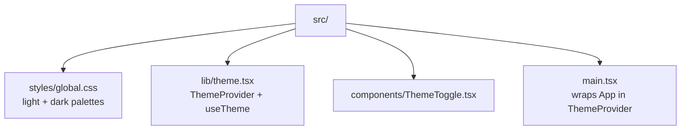
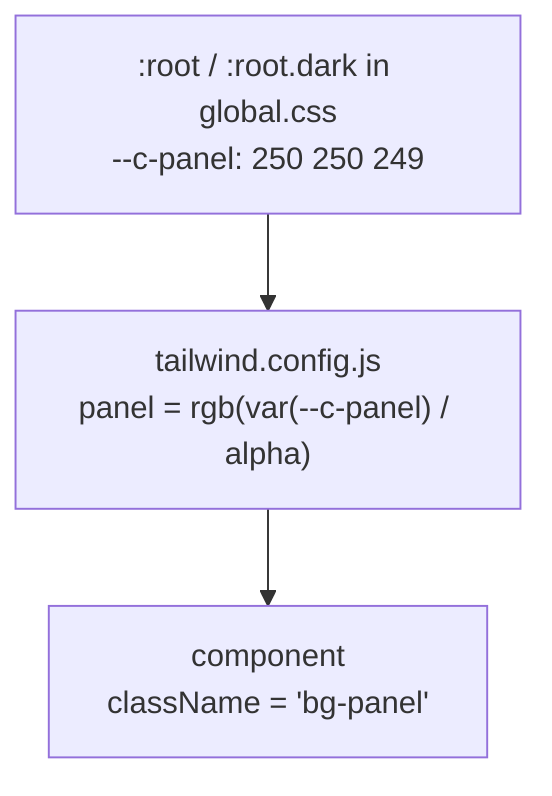

# Raxis Operator Dashboard — Frontend

Vite + React + TypeScript + Tailwind app. Talks to the RAXIS kernel
dashboard server over the HTTP/SSE API. The server-side contract is
described in [`specs/v2/dashboard-hardening.md`](../specs/v2/dashboard-hardening.md).
JWT auth via the challenge-response flow in `pages/Login.tsx`.

## Development

```sh
npm install
npm run dev          # vite dev server
npm run typecheck    # tsc --noEmit
npm run lint         # eslint
npm run test         # vitest
npm run build        # tsc -b && vite build
```

Path alias `@/*` resolves to `src/*` (configured in
`tsconfig.json` and `vite.config.ts`).

---

## Theme system

The dashboard ships with both light and dark modes. **Light is the
default**; dark is opt-in via a toggle in the top-bar chrome.

### Resolution order

On every page load the resolved theme is:

1. `localStorage.theme` ("dark" or "light"), if set explicitly by
   the operator via the toggle.
2. Light, if no preference is stored.

The dashboard intentionally does not follow the OS colour scheme on
first visit. Fresh operator sessions, shared demo machines, and
screenshots should open in the same readable light theme unless the
operator explicitly chose dark earlier.

A small inline bootstrap script in `index.html` runs the same
resolution before first paint to prevent a flash of unstyled
(wrong-themed) content. `<html>` ships with `class="light"` so
the worst-case render matches the product default.

Cross-tab toggles are mirrored through the `storage` event, so
flipping the theme in one operator window updates siblings on the
same machine.

### Architecture



Colors flow from CSS custom properties → Tailwind utility classes
→ components:



The `rgb(R G B) / <alpha-value>` triplet pattern means opacity
utilities like `bg-accent/30` still work — the alpha slot is
filled by Tailwind at compile time, the RGB channels by the
runtime variable.

### Semantic tokens

All design colors are addressed through their semantic name; the
underlying hex value flips with the theme.

| Token             | Light                  | Dark                   | Usage                                  |
| ----------------- | ---------------------- | ---------------------- | -------------------------------------- |
| `panel`           | `#fafaf9` warm canvas  | `#0d1117` near-black   | App background                         |
| `panel-raised`    | `#ffffff` pure white   | `#161b22` slate-1      | Cards, sidebar, header                 |
| `panel-high`      | `#f4f4f5` neutral-100  | `#1f2733` slate-2      | Hover row, active nav item             |
| `ink`             | `#171717` neutral-900  | `#e6e8eb` near-white   | Body text                              |
| `ink-muted`       | `#525252` neutral-600  | `#a8b1bc` slate-fg-2   | Secondary text                         |
| `ink-subtle`      | `#737373` neutral-500  | `#7d8892` slate-fg-3   | Tertiary text, breadcrumb dividers     |
| `edge`            | `#e5e5e5` neutral-200  | `#222a36` slate-rule-1 | Hairline borders                       |
| `edge-strong`     | `#d4d4d4` neutral-300  | `#2e3849` slate-rule-2 | Card / input borders                   |
| `accent`          | `#0a7289` aegis-cyan   | `#3a86ff` ops-blue     | Primary action, focus ring             |
| `accent-strong`   | `#075f73`              | `#1f6feb`              | Hover state of primary actions         |
| `ok`              | `#15803d` green-700    | `#2ea043`              | Completed / passing                    |
| `ok-muted`        | `#dcfce7` green-100    | `#1c5b2c`              | Tinted bg for ok badges                |
| `warn`            | `#a16207` amber-700    | `#d29922`              | Paused / reviewing                     |
| `warn-muted`      | `#fef3c7` amber-100    | `#6b4d10`              | Tinted bg for warn badges              |
| `bad`             | `#b91c1c` red-700      | `#f85149`              | Failed                                 |
| `bad-muted`       | `#fee2e2` red-100      | `#7d1d1d`              | Tinted bg for bad badges               |
| `info`            | `#1d4ed8` blue-700     | `#58a6ff`              | Running / active                       |
| `info-muted`      | `#dbeafe` blue-100     | `#1f4d80`              | Tinted bg for info badges              |
| `block`           | `#6d28d9` violet-700   | `#a371f7`              | Blocked                                |
| `block-muted`     | `#ede9fe` violet-100   | `#3a2762`              | Tinted bg for block badges             |

Both palettes meet WCAG AA contrast (≥4.5:1) for body text and
≥3:1 for UI elements over the matching `panel` background.

### Using tokens in a new component

Always reach for a semantic token; never write a raw hex value.

```tsx
// ✅ Themed automatically — no `dark:` branching needed.
<div className="bg-panel-raised border border-edge text-ink">
  <span className="text-ink-muted">Secondary</span>
</div>

// ❌ Hard-coded — will look wrong in one mode.
<div className="bg-[#161b22] text-[#e6e8eb]">…</div>

// ❌ Token survives but the literal hex doesn't.
<svg fill="#7d8892" />        // use `fill="currentColor"` and a
                              // text-ink-subtle wrapper instead
```

For status-driven elements, prefer `lib/state-color.ts`:

```tsx
import { stateTone, toneClasses } from "@/lib/state-color";

<span className={`badge ${toneClasses(stateTone(task.state))}`}>
  {task.state}
</span>
```

### Using the hook

```tsx
import { useTheme } from "@/lib/theme";

function MyComponent() {
  const { theme, setTheme, toggleTheme, hasExplicitPreference } =
    useTheme();
  // theme:    "dark" | "light"
  // setTheme: pin to a value, persists to localStorage
  // toggleTheme: flip, persists to localStorage
  // hasExplicitPreference: false until the operator clicks once
}
```

The hook throws if used outside `<ThemeProvider>`. Tests should
either wrap in the provider or stub it.

### Adding a new token

1. Add the RGB triplet to **both** `:root` and `:root.dark` in
   `src/styles/global.css`. Keep the same custom-property name
   prefixed with `--c-`.
2. Add the mapping to `tailwind.config.js` under `theme.extend.colors`
   using the `rgb(var(--c-X) / <alpha-value>)` pattern.
3. Verify AA contrast against `panel` in both modes (use
   [contrast-ratio.com](https://contrast-ratio.com) or any
   browser devtools).
4. Update the table above.

### Adding a non-color token (radius, shadow, etc.)

Same flow — declare a CSS variable in `:root` (and override under
`:root.dark` if it should change), then reference it in
`tailwind.config.js` or directly via `var(--…)`. Most of the
non-color tokens (font sizes, shadows, animations) don't need
theme-specific overrides and live as plain values in
`tailwind.config.js`.

### How the toggle works

`<ThemeToggle>` (`src/components/ThemeToggle.tsx`) is rendered
inside `<Shell>`'s top-bar. It calls `toggleTheme()`, which:

1. Computes the next theme.
2. Writes it to `localStorage.theme`.
3. Sets `hasExplicitPreference = true`.
4. Triggers the provider's effect that swaps the class on
   `<html>` and updates `<meta name="theme-color">`.

A consumer can also surface a "use default" affordance later by
calling `localStorage.removeItem("theme")` and reloading; the
context exposes `hasExplicitPreference` to support that UX if it
ever lands.
