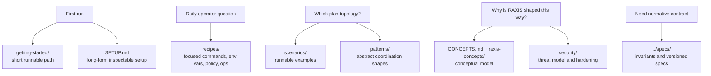

# RAXIS Guides

> **Audience.** Operators, developers, and demo-runners — anyone exercising
> RAXIS against a real repo, real provider, and real local kernel.

This is the **practical cookbook**. Each guide under
[`scenarios/`](scenarios/) is a self-contained folder with its own
`README.md`, a runnable `plan.toml`, a local-policy `policy.toml`, and a
`credential.toml` template. Every guide
is built to be plug-and-play: clone the folder, fill in the credential
placeholders, run the setup commands, and watch RAXIS drive the work.

> **Architecture rationale** (why RAXIS is shaped the way it is) lives in
> [`specs/README.md`](../specs/README.md),
> [`specs/design-decisions.md`](../specs/design-decisions.md), and
> [`specs/v2/v2-deep-spec.md`](../specs/v2/v2-deep-spec.md). The guides
> here are operationally-focused — they assume the architecture and show
> you how to drive it.

## How to read this catalogue

1. **First time on RAXIS?** Walk the five-page
   [`getting-started/`](getting-started/) cluster before anything
   here. Thirty minutes from `git clone` to "kernel ran my plan,
   audit chain verifies". It supersedes the older [`SETUP.md`](SETUP.md) long-form
   walkthrough, which remains as the inspect-every-step variant.
2. Returning to a machine that already ran genesis? Use the
   "Confirming an existing install" check at the bottom of
   [`SETUP.md`](SETUP.md), then jump straight into a scenario below.
3. Pick a scenario. Each guide is rated by complexity (⭐ – ⭐⭐⭐⭐⭐) and
   estimated wall-clock time.
4. `cd` into the scenario folder and follow that folder's `README.md`. The `plan.toml`
   in each folder has already passed `raxis plan validate`; you can re-run
   the validator at any time to confirm.
5. Iterate. Most scenarios end with a "Variations" section — knobs you can
   change to explore further.

---

## Docs Map



## Catalogue

### Tier 1 — First Contact (⭐ Beginner)

Run these in order. Each one introduces exactly one new concept.

| # | Scenario | What you learn |
|---|---|---|
| 01 | [`hello-world`](scenarios/01-hello-world/) | The smallest possible RAXIS plan: one Executor, no Reviewer, no merge. |
| 02 | [`single-executor-reviewer`](scenarios/02-single-executor-reviewer/) | Add a Reviewer. Learn `depends_on` and the review-rejection retry loop. |
| 03 | [`add-readme-section`](scenarios/03-add-readme-section/) | Touch a real file. Learn `path_allowlist` and the V2 entry-shape rules. |
| 04 | [`fix-typo-with-witness`](scenarios/04-fix-typo-with-witness/) | Add a `cargo build` mechanical witness so the merge gates on a green build. |
| 05 | [`bug-fix-regression-test`](scenarios/05-bug-fix-regression-test/) | Two-task plan: write the regression test first, then the fix. |

### Tier 2 — Real Topologies (⭐⭐ Intermediate)

| # | Scenario | What you learn |
|---|---|---|
| 06 | [`parallel-decomposition`](scenarios/06-parallel-decomposition/) | Two Executors writing non-overlapping paths in parallel. |
| 07 | [`panel-review`](scenarios/07-panel-review/) | One Executor, three Reviewers (correctness + style + security). |
| 08 | [`structured-debate`](scenarios/08-structured-debate/) | Two designers argue across rounds before an Executor implements. |
| 09 | [`sequential-refinement`](scenarios/09-sequential-refinement/) | Three Executors in a chain, each polishing the previous one's output. |
| 10 | [`api-contract-change`](scenarios/10-api-contract-change/) | Backend handler + matching test + matching docs in three coordinated tasks. |
| 11 | [`generate-docs-from-source`](scenarios/11-generate-docs-from-source/) | Read-only Executor reads source, writes docs/. |
| 12 | [`dependency-bump`](scenarios/12-dependency-bump/) | Bump a single dep, regenerate `Cargo.lock`, re-run tests. |

### Tier 3 — Production Shapes (⭐⭐⭐ Advanced)

| # | Scenario | What you learn |
|---|---|---|
| 13 | [`monorepo-frontend-backend`](scenarios/13-monorepo-frontend-backend/) | Real monorepo: TypeScript frontend + Rust backend; sparse clones for each. |
| 14 | [`db-migration-and-app-change`](scenarios/14-db-migration-and-app-change/) | Migration generator task + application code update; PostgreSQL credentials via the credential proxy. |
| 15 | [`http-api-and-curl-witness`](scenarios/15-http-api-and-curl-witness/) | Run a dev server inside the Executor's VM; agent tests its own surface with `curl`. |
| 16 | [`feature-flag-rollout`](scenarios/16-feature-flag-rollout/) | Add the feature behind a flag, gate it on a config witness. |
| 17 | [`security-headers-audit`](scenarios/17-security-headers-audit/) | Reviewer-only initiative: scan an existing repo for missing headers. |
| 18 | [`license-compliance-sweep`](scenarios/18-license-compliance-sweep/) | Crawl deps, emit a SPDX SBOM, fail if any license is in a denylist. |
| 19 | [`refactor-shared-utility`](scenarios/19-refactor-shared-utility/) | Refactor a function used in five places; verifiers catch the un-refactored callsites. |
| 20 | [`generate-openapi-from-handlers`](scenarios/20-generate-openapi-from-handlers/) | Source-of-truth source → generated OpenAPI YAML. |

### Tier 4 — Concurrency & Disagreement (⭐⭐⭐⭐ Expert)

| # | Scenario | What you learn |
|---|---|---|
| 21 | [`merge-conflict-semantic-resolution`](scenarios/21-merge-conflict-semantic-resolution/) | Two Executors touch the same file deliberately; the Orchestrator semantically resolves. |
| 22 | [`reviewer-rejection-then-pass`](scenarios/22-reviewer-rejection-then-pass/) | Watch the critique-prepended retry loop play out end-to-end. |
| 23 | [`escalation-flow`](scenarios/23-escalation-flow/) | Operator-assisted escalation when an agent gets stuck. |
| 24 | [`circular-revision-detection`](scenarios/24-circular-revision-detection/) | Force the FAIL_CIRCULAR_REVISION gate by writing a flip-flop Executor. |
| 25 | [`wall-clock-limit`](scenarios/25-wall-clock-limit/) | Hit FAIL_WALL_CLOCK_LIMIT_EXCEEDED on a deliberately-slow task. |
| 26 | [`abort-mid-flight`](scenarios/26-abort-mid-flight/) | Operator aborts a running initiative; observe forensic worktree retention. |

### Tier 5 — Verifiers & Witnesses (⭐⭐⭐⭐ Expert)

| # | Scenario | What you learn |
|---|---|---|
| 27 | [`cargo-test-verifier`](scenarios/27-cargo-test-verifier/) | Pin a Rust test verifier; merge blocks on red. |
| 28 | [`cargo-clippy-verifier`](scenarios/28-cargo-clippy-verifier/) | Lint-clean as a merge gate. |
| 29 | [`pytest-verifier`](scenarios/29-pytest-verifier/) | Python equivalent. |
| 30 | [`golangci-lint-verifier`](scenarios/30-golangci-lint-verifier/) | Go equivalent. |
| 31 | [`pre-merge-symbol-index`](scenarios/31-pre-merge-symbol-index/) | Auto-injected symbol-index verifier across the touched set. |
| 32 | [`load-test-witness`](scenarios/32-load-test-witness/) | Mechanical witness from a load-test (latency p99 below threshold). |
| 33 | [`coverage-witness`](scenarios/33-coverage-witness/) | Coverage delta witness; merge if Δ ≥ 0. |
| 34 | [`benchmark-witness`](scenarios/34-benchmark-witness/) | Criterion benchmarks as a regression gate. |

### Tier 6 — Egress, Credentials, and the Network Surface (⭐⭐⭐⭐⭐ Expert)

| # | Scenario | What you learn |
|---|---|---|
| 35 | [`http-egress-allowlist`](scenarios/35-http-egress-allowlist/) | Configure `allowed_egress`; observe the kernel admit-and-deny decisions. |
| 36 | [`postgres-credential-proxy`](scenarios/36-postgres-credential-proxy/) | Agent connects to a real local Postgres via the credential proxy. |
| 37 | [`s3-credential-proxy`](scenarios/37-s3-credential-proxy/) | HTTP-shaped credential proxy: agent uploads to S3 without ever seeing the key. |
| 38 | [`stripe-api-call`](scenarios/38-stripe-api-call/) | Outbound call to Stripe through the credential proxy; demo egress + auth injection. |
| 39 | [`internal-grpc-call`](scenarios/39-internal-grpc-call/) | Allowed egress to an internal gRPC service. |
| 40 | [`block-everything-by-default`](scenarios/40-block-everything-by-default/) | Demonstrate the deny-by-default posture; agent gets `EGRESS_DENIED`. |

### Tier 7 — Operations (⭐⭐⭐ Advanced)

| # | Scenario | What you learn |
|---|---|---|
| 41 | [`audit-chain-replay`](scenarios/41-audit-chain-replay/) | Run an initiative, then prove every decision from the chain alone. |
| 42 | [`operator-rotation`](scenarios/42-operator-rotation/) | Rotate an operator's signing key and re-sign in-flight policy. |
| 43 | [`policy-epoch-advance-live`](scenarios/43-policy-epoch-advance-live/) | Edit policy.toml without restarting the kernel; old in-flight requests honor the old epoch. |
| 44 | [`session-revocation`](scenarios/44-session-revocation/) | Revoke a misbehaving session; observe forensic retention + GC. |
| 45 | [`quarantine-a-bad-plan`](scenarios/45-quarantine-a-bad-plan/) | Operator quarantines a plan post-admission. |

### Tier 8 — Multi-Initiative & Long-Running (⭐⭐⭐⭐⭐ Expert)

| # | Scenario | What you learn |
|---|---|---|
| 46 | [`two-concurrent-initiatives`](scenarios/46-two-concurrent-initiatives/) | Two initiatives sharing one kernel; lane-budget isolation in practice. |
| 47 | [`crash-recovery-mid-merge`](scenarios/47-crash-recovery-mid-merge/) | Kill the kernel mid-merge; restart; observe Phase 2/3 recovery. |
| 48 | [`provider-failure-fallback`](scenarios/48-provider-failure-fallback/) | Primary provider returns 5xx; observe fallback to the secondary. |
| 49 | [`budget-exceeded-graceful-stop`](scenarios/49-budget-exceeded-graceful-stop/) | Lane budget exhausts mid-initiative; tasks transition cleanly. |
| 50 | [`end-to-end-feature-shipment`](scenarios/50-end-to-end-feature-shipment/) | The capstone: plan → 4 Executors → 2 Reviewers → semantic merge → witness-gated → main fast-forwarded. |

---

## Conceptual reference

The reading order in the previous version of this README has been promoted
to a dedicated [`CONCEPTS.md`](CONCEPTS.md) — a single page that introduces
path allowlists, clone strategies, lane budgets, agent types, dependency
rules, and inter-agent communication. New operators should read that page
(or the [`getting-started/`](getting-started/) cluster, which folds the
same material into a runnable end-to-end walk) before diving into the
scenarios.

## Pattern library

The `patterns/` subdirectory still hosts the pattern-level write-ups
(Single Executor + Reviewer, Parallel Decomposition, Structured Debate,
Panel Review, Sequential Refinement). Those are *abstract* — they document
the *shape* of a topology without committing to a specific repo. The
catalogue above is *concrete* — every scenario is a runnable plan against
a real repo with real expectations.

## Security reading

The deepest treatments of RAXIS' security posture live in
[`security/raxis-security-model.md`](security/raxis-security-model.md)
and [`security/compromised-agent-threat-model.md`](security/compromised-agent-threat-model.md).
If you are evaluating RAXIS for adversarial use cases, those two
documents (plus the audit-replay scenario at #41) are the canonical
read-order.

## Adding a new scenario

Use [`scenarios/_template/`](scenarios/_template/) as the starting
point. Copy the folder, rename it, edit its `README.md`, `plan.toml`,
`policy.toml`, and `credential.toml`, then run:

```bash
raxis plan validate scenarios/<your-scenario>/plan.toml
```

A scenario is "ready" when the validator exits 0 *and* the README has
exact reproduction commands that a fresh operator can run on a clean
machine.
