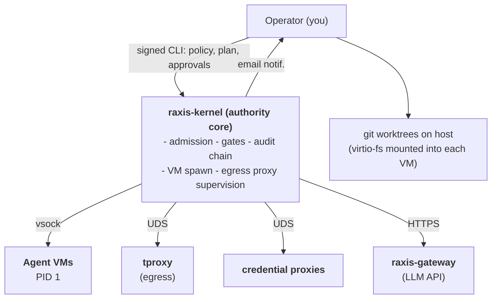

# 00 · What RAXIS Is (and Isn't)

> **Read this once.** It is the operator-facing mental model of RAXIS,
> grounded in concrete capabilities. No philosophy.

RAXIS is a local control plane that runs autonomous coding agents
inside isolated VMs against your repo, gated by a policy you signed.
Every action is recorded on a hash-chained audit log that an outside
party can verify with only the log and your public keys.

The contract:

- **You** write a `policy.toml` and sign it.
- **You** write a `plan.toml` for each initiative (the work to do) and
  sign it.
- **The kernel** admits, executes, gates, and merges. It never lets an
  agent widen scope beyond what you signed.
- **The audit chain** records every decision, accepted or rejected.

## What you get

| Capability                                                                                                                                                                                                                     | How it shows up                                                                                                      |
| ------------------------------------------------------------------------------------------------------------------------------------------------------------------------------------------------------------------------------ | -------------------------------------------------------------------------------------------------------------------- |
| **Signed authority.** Operator authority is an Ed25519 keypair plus a self-signed `OperatorCert`. No passwords, no shared secrets, no ambient credentials.                                                                     | `raxis genesis`, `raxis cert mint`, `raxis policy sign`                                                              |
| **Plans as signed bundles.** A plan is a TOML file whose canonical bytes are hashed and signed atomically by the CLI before the kernel sees them. Re-reading the plan from disk after admission is forbidden by `INV-INIT-06`. | `raxis submit plan <plan.toml> --no-dry-run`                                                                         |
| **VM-isolated agents.** Every Orchestrator, Executor, and Reviewer runs as PID 1 inside a microVM (Apple Virtualization on macOS, Firecracker on Linux). No virtio-net; the only IPC surface is vsock to the kernel.           | `[isolation_backend]` in policy; `raxis doctor` reports the active backend                                           |
| **Mediated egress.** Public-host fetches are SNI-allowlisted by `raxis-tproxy`. Authenticated egress (Postgres, S3, Stripe, …) goes through per-session credential proxies that never expose credential bytes to the agent.    | `allowed_egress` in plan; eleven proxy types in [`specs/v2/credential-proxy.md`](../../specs/v2/credential-proxy.md) |
| **Witness-gated merges.** A task's `evaluation_sha` is bound to the verifier run that emitted the witness; a witness for SHA `A` cannot satisfy a gate for SHA `B`.                                                            | `[[tasks.verifiers]]` in plan; `[[integration_merge_verifiers]]` in policy                                           |
| **Hash-chained audit log.** Every kernel decision lands in a tamper-evident JSONL log under `<data_dir>/audit/`. Independent verification with `raxis verify-chain`.                                                           | `raxis verify-chain`, `raxis log <initiative_id>`                                                                    |
| **Operator dashboard.** Local-only HTTP UI for the DAG, sessions, repo state, audit chain, escalations, policy editing. Same Ed25519 challenge-response auth as the CLI.                                                       | URL printed at kernel startup; default `http://127.0.0.1:9820`                                                       |

## The mental model in one diagram

- The **kernel** is the only process that holds operator-trusted
  state. It runs as your user (V2; V3 plans separate OS identities).
- **Agents** never touch network or credentials directly. Every fetch,
  every model call, every database query is mediated.
- The **audit log** is append-only; the kernel writes, never edits.

## What RAXIS isn't

- **Not a sandboxed shell.** Agents work inside microVMs, not chroots
  or seccomp profiles. The kernel never executes planner code
  in-process.
- **Not a prompt-engineering layer.** Authority is enforced by typed
  IPC and signed policy, not by instructing the model nicely.
- **Not a multi-tenant cloud service.** V2 is local-first,
  single-operator, one kernel per environment. See [the `Multi-Environment Deployments` section in the root README](../../README.md#multi-environment-deployments-recommended) for separate-kernel-per-env guidance.
- **Not a model trainer or finetuner.** RAXIS is the runtime layer; it
  routes inference requests through `raxis-gateway` to whatever
  provider you configured.
- **Not Windows-ready.** macOS 13+ (Apple Virtualization) and Linux
  5.10+ (Firecracker + KVM) are the supported substrates. See
  [`specs/v2/system-requirements.md`](../../specs/v2/system-requirements.md).

## Twelve paradigm invariants in one line

The full statements live in [`specs/paradigm.md`](../../specs/paradigm.md);
the implementation maps them onto the V1 `INV-*` family in
[`specs/v1/philosophy.md §1.2`](../../specs/v1/philosophy.md). The
short form an operator should keep in mind:

> Intelligence proposes; authority decides; every decision is
> recorded, reproducible, and attributable to a human-signed artifact.

Continue to [`01-prereqs.md`](01-prereqs.md) to install everything you
need.
