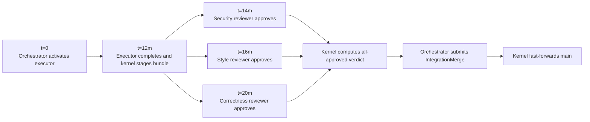

# Pattern: Panel Review

> **Complexity:** ⭐⭐ Intermediate | **Agents:** 1 Executor, N Reviewers, Orchestrator
>
> Multiple Reviewers with different evaluation criteria run concurrently against the same
> output. All Reviewers must approve before the work is accepted. Faster than sequential
> review because all perspectives evaluate in parallel.

> **Field-name note.** All TOML examples use the wire-correct
> `predecessors` field (verified against
> `kernel/src/initiatives/lifecycle.rs::parse_plan_tasks`). A
> previous version of this guide used `depends_on`, which is
> spec-prose only and silently ignored by the parser.

---

## When to Use

- You need multiple independent quality gates on the same output (security AND style AND correctness)
- Review criteria are orthogonal — each Reviewer is checking something different
- Wall-clock time matters — parallel is significantly faster than sequential review chains

## When Not to Use

- Reviewers need to build on each other's findings (use sequential Reviewers via `predecessors`)
- You want debate between Reviewers (they cannot communicate — use [Structured Debate](structured-debate.md))
- A single Reviewer with a comprehensive checklist would suffice — more Reviewers = more budget

---

## The Plan

```toml
[plan.initiative]
description = """
Implement the payment processing module and require independent security,
correctness, and style reviewers before merge.
"""

[workspace]
name    = "Implement payment processing module"
lane_id = "payments-work"
repository = "main"
target_ref = "refs/heads/main"

# ── Executor ──────────────────────────────────────────────────────────────────
[[tasks]]
task_name            = "payments_implementer"
session_agent_type = "Executor"
clone_strategy     = "sparse"
path_allowlist     = ["src/payments/"]
predecessors         = []
max_crash_retries     = 2
max_review_rejections = 1   # low tolerance: payment code quality must be high
description        = "Implement payments"
prompt             = """
  Implement the payment processing module in src/payments/.
  Requirements are in docs/specs/payments-spec.md (read-only, already in the repo).
  Include: charge(), refund(), webhook handler, and full test coverage.
"""

# ── Parallel Reviewers ────────────────────────────────────────────────────────
# All three activate simultaneously when the Executor submits CompleteTask.
# The Logical AND verdict applies: ALL must approve for the task to pass.

[[tasks]]
task_name            = "security_reviewer"
session_agent_type = "Reviewer"
clone_strategy     = "blobless"
path_allowlist     = ["src/payments/"]
predecessors         = ["payments_implementer"]    # same dependency → activates in parallel
description        = "Security review"
prompt             = """
  Review src/payments/ for security issues:
  - Is card data ever logged or written to disk?
  - Are webhook signatures verified before processing?
  - Is there any SQL/injection risk in the charge flow?
  - Are error messages safe to expose to clients?
  Approve only if the implementation is safe to run in production.
"""

[[tasks]]
task_name            = "correctness_reviewer"
session_agent_type = "Reviewer"
clone_strategy     = "blobless"
path_allowlist     = ["src/payments/"]
predecessors         = ["payments_implementer"]    # same dependency → also activates in parallel
description        = "Correctness review"
prompt             = """
  Review src/payments/ for functional correctness:
  - Does charge() handle declined cards correctly?
  - Does refund() correctly handle partial refunds?
  - Are the test cases complete? Check edge cases: zero amount, duplicate requests,
    network timeout during charge.
  Approve only if all three functions are correctly implemented and tested.
"""

[[tasks]]
task_name            = "style_reviewer"
session_agent_type = "Reviewer"
clone_strategy     = "blobless"
path_allowlist     = ["src/payments/"]
predecessors         = ["payments_implementer"]    # all three share the same predecessors
description        = "Style review"
prompt             = """
  Review src/payments/ for code quality:
  - Are public functions documented with rustdoc?
  - Is error handling using the project's Result<T, PaymentError> conventions?
  - Are there any unwrap() calls on payment-critical paths?
  Approve if the code is maintainable and follows project conventions.
"""

[orchestrator]
cross_cutting_artifacts = ["Cargo.lock"]
```

---

## How the Verdict Works

When the Executor submits `CompleteTask { head_sha: "abc123" }`, the Kernel:

1. Activates all three Reviewers simultaneously
2. Each Reviewer evaluates the same `evaluation_sha = "abc123"` independently
3. As each Reviewer submits, the Kernel checks: "are there any Reviewers still Active?"

```mermaid
sequenceDiagram
    participant S as security_reviewer
    participant Q as correctness_reviewer
    participant C as style_reviewer
    participant K as Kernel
    participant O as Orchestrator

    S->>K: SubmitReview(approved=true)
    C->>K: SubmitReview(approved=true)
    Q->>K: SubmitReview(approved=false, critique)
    K->>K: Last reviewer submitted; ANY rejected
    K->>K: Append rejecting critiques to tasks.last_critique
    K-->>O: KernelPush::ReviewFailed(executor_task_id)
```

`tasks.last_critique` stores the rejecting reviewer's critique:

```text
[correctness_reviewer]: refund() doesn't handle partial refunds
```

The Orchestrator retries the Executor. The retry VM's system prompt is prepended with
the aggregated critique. On the next round, all three Reviewers activate again.

---

## Execution Timeline



Total wall-clock is about 20 minutes. The sequential equivalent would
be roughly 38 minutes.

---

## Invariant Checklist

- [x] All Reviewers share the same `predecessors` — they activate in parallel
- [x] All Reviewers have the same `path_allowlist` as the Executor they review
- [x] Logical AND verdict enforced by Kernel — cannot be overridden by the Orchestrator
- [x] Critique aggregation: `tasks.last_critique` collects from all rejecting Reviewers
- [x] `evaluation_sha` is set from the Executor's `completed_sha` at activation time — immutable
- [x] Executor uses `sparse`; Reviewers use `blobless` (need full read access to review)

---

## Tuning: How Many Reviewers?

Each Reviewer is an active VM consuming budget from the shared lane. Budget scales linearly
with the number of Reviewers. Guidelines:

| Scenario | Recommended Reviewers |
|---|---|
| Standard feature, low risk | 1 (see [Single Executor + Reviewer](single-executor-reviewer.md)) |
| Security-sensitive path | 2 (security + correctness) |
| Payment or auth code | 3 (security + correctness + compliance) |
| More than 4 | Probably a code smell — consolidate criteria into fewer Reviewers |

## Tuning: Reviewer Criteria Should Be Orthogonal

Good panel composition: each Reviewer checks something the others don't. If two Reviewers
check "does it handle errors correctly", one of them is redundant budget spend.

Bad: `security_reviewer` and `correctness_reviewer` both check for `unwrap()` calls.
Good: `security_reviewer` checks for data leakage; `correctness_reviewer` checks business logic.

---

## Common Mistakes

**Mistake:** Reviewers with `predecessors` pointing to each other (serial Reviewers)
```toml
# WRONG — this makes them serial, not parallel
[[tasks]]
task_name    = "reviewer_b"
session_agent_type = "Reviewer"
clone_strategy     = "blobless"
description        = "Reviewer B"
prompt             = """Complete Reviewer B according to this plan's acceptance criteria."""
predecessors = ["reviewer_a"]   # ← defeats the purpose of a panel
```
For sequential review chains, this is valid — but it's not a panel anymore.

**Mistake:** Reviewer `path_allowlist` is narrower than the Executor's
```toml
# WRONG — Reviewer can't see all the files it needs to evaluate
path_allowlist = ["src/payments/charge.rs"]   # Executor wrote more than this
```
Reviewer's `path_allowlist` should match the Executor's exactly (they evaluate the same scope).
