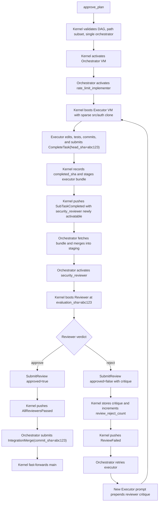

# Pattern: Single Executor + Reviewer

> **Complexity:** ⭐ Beginner | **Agents:** 3 (Orchestrator, 1 Executor, 1 Reviewer)
>
> The baseline RAXIS pattern. One agent implements a task; one agent reviews the output.
> Learn this pattern before any other — every more complex pattern is built on top of it.

> **Field-name note.** The plan-TOML field for "task A blocks task
> B until A completes" is **`predecessors`** (verified against
> `kernel/src/initiatives/lifecycle.rs::parse_plan_tasks`). Some
> spec prose uses `depends_on` as an informal synonym; the
> kernel parser only reads `predecessors`. All runnable plan
> snippets in this guide use the wire-correct name.

---

## When to Use

- A well-scoped task that fits in one context window
- You want a second set of eyes (automated code review, security check, style check)
- The review criteria are known upfront and can be encoded in the Reviewer's `context`

## When Not to Use

- The task is too large for a single Executor (use [Parallel Decomposition](parallel-decomposition.md))
- You need multiple independent review perspectives (use [Panel Review](panel-review.md))
- You need iterative design before implementation (use [Structured Debate](structured-debate.md))

---

## The Plan

```toml
[workspace]
name        = "Add rate limiting to the auth API"
lane_id     = "auth-work"
description = """
  Add IP-based rate limiting to POST /auth/login. Max 10 requests per minute per IP.
  Return 429 Too Many Requests with a Retry-After header when exceeded.
"""

# ── Orchestrator ──────────────────────────────────────────────────────────────
# Coordinates the initiative. Merges the Executor's commit after the Reviewer
# approves. Uses full clone because it must merge across the full tree.
[[tasks]]
task_id             = "orchestrator"
session_agent_type  = "Orchestrator"
clone_strategy      = "full"
path_allowlist      = ["src/auth/"]          # must be a superset of all sub-tasks
cross_cutting_artifacts = ["Cargo.lock"]     # files the Orchestrator may touch during merge

# ── Executor ──────────────────────────────────────────────────────────────────
# Implements the feature. Sparse clone: only downloads src/auth/ — fast for
# large monorepos. The Executor can only WRITE to src/auth/**; it can READ
# anything in the full sparse cone.
[[tasks]]
task_id             = "rate_limit_implementer"
session_agent_type  = "Executor"
clone_strategy      = "sparse"
path_allowlist      = ["src/auth/"]
predecessors        = []                     # starts immediately
max_crash_retries   = 2                      # VM crash budget (OOM, panic, etc.)
max_review_rejections = 2                    # quality rejection budget
context             = """
  Implement IP-based rate limiting on POST /auth/login.
  - 10 requests per minute per IP using a sliding window
  - Return 429 with Retry-After header when exceeded
  - Store rate limit state in Redis (the client is already initialised in src/auth/redis.rs)
  - Add unit tests in src/auth/rate_limit_test.rs
"""

# ── Reviewer ──────────────────────────────────────────────────────────────────
# Evaluates the Executor's output. Activates only AFTER the Executor submits
# CompleteTask — the kernel enforces this via the `predecessors` gate.
# The Reviewer receives the Executor's exact HEAD SHA in its system prompt.
[[tasks]]
task_id             = "security_reviewer"
session_agent_type  = "Reviewer"
clone_strategy      = "blobless"             # needs to read the full src/auth/ tree
path_allowlist      = ["src/auth/"]          # must match (or be subset of) the Executor's
predecessors        = ["rate_limit_implementer"]
context             = """
  Review the rate limiting implementation for:
  1. Correctness: does the sliding window logic match the spec?
  2. Security: could an attacker bypass the limit (X-Forwarded-For spoofing, etc.)?
  3. Test coverage: are the happy path and the 429 case both tested?
  Approve if all three criteria are met. Reject with a specific critique if not.
"""
```

---

## How It Executes



---

## Invariant Checklist

- [x] Path subset: `{"src/auth/"} ⊆ {"src/auth/"}` (Orchestrator allowlist covers all sub-tasks)
- [x] Orchestrator clone strategy: `full` (not `sparse`)
- [x] Single `lane_id` at `[workspace]` level; no sub-task overrides
- [x] Reviewer's `predecessors` lists the Executor (not the other way around)
- [x] No cycles in the DAG
- [x] `cross_cutting_artifacts` is an exact filename list (`Cargo.lock`), not a glob

---

## Tuning the Retry Budget

```toml
max_crash_retries     = 2   # environmental failures (OOM, VM panic, host eviction)
max_review_rejections = 2   # quality failures (Reviewer says "not good enough")
```

These are independent counters. An Executor can crash twice AND be rejected twice before the
task fails — giving it 4 activation attempts total across two different failure modes.

Set `max_review_rejections = 0` if you want a zero-tolerance quality gate: one rejection
fails the initiative immediately. Set it higher if you expect the LLM to need iterations.

---

## Common Mistakes

**Mistake:** Reviewer `predecessors = []` (forgets the dependency)
**Result:** `approve_plan` accepts it, but the Reviewer activates immediately with no
`evaluation_sha` — there is nothing to review. Always set `predecessors` to the Executor.

**Mistake:** Executor uses `sparse` clone, Reviewer uses `sparse` on its own path
**Result:** Reviewer's sparse cone only has its own allowlist path, not the Executor's
implementation files. Use `blobless` for Reviewers so they can read the full `src/auth/` tree.

**Mistake:** Setting `path_allowlist = ["src/"]` on the Executor (too broad)
**Result:** Works technically, but defeats the purpose of scoped isolation. Set the
allowlist to the minimum directory the Executor genuinely needs to write.
