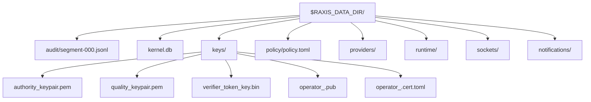

# `raxis genesis`

One-time initialization for a fresh `RAXIS_DATA_DIR`. It creates the
kernel key material, embeds the first operator cert into
`policy/policy.toml`, writes `kernel.db`, and anchors the audit chain
at `audit/segment-000.jsonl`.

Run it once per data dir.

## Same-Host Flow

```bash
export RAXIS_DATA_DIR="$HOME/.raxis-demo"
export RAXIS_OPERATOR_KEY="$HOME/raxis-keys/operator_private.pem"

raxis genesis --operator-name "$USER"
```

`RAXIS_OPERATOR_KEY` is the same as passing global
`--operator-key <path>`. You can also use the command-local form:

```bash
raxis genesis --operator-key "$RAXIS_OPERATOR_KEY" --operator-name "$USER"
```

The private key is read to mint the genesis `OperatorCert`; it is not
written under `RAXIS_DATA_DIR`.

## Air-Gapped Flow

On the machine that holds the private key:

```bash
raxis cert mint \
  --key operator_private.pem \
  --display-name alice \
  --ops "CreateInitiative,ApprovePlan,RejectPlan,CreateSession,RevokeSession,GrantDelegation,RetryTask,ResumeTask,AbortTask,AbortInitiative,ApproveEscalation,DenyEscalation,RotateEpoch,QuarantineInitiative,QuarantinePlansBy" \
  --out operator.cert.toml
```

Move only `operator.cert.toml` to the kernel host, then run:

```bash
raxis genesis --operator-cert operator.cert.toml
```

## Flags

| Flag | Meaning |
| --- | --- |
| `--operator-cert <path>` | Use a pre-minted cert. Mutually exclusive with `--operator-key`. |
| `--operator-key <path>` | Mint the cert in-process from this private key. |
| `--operator-name <name>` | Required with `--operator-key`; stored as the operator display name. |
| `--cert-validity-days <N>` | Validity window for the in-process cert. |
| `--admin` | Add `OperatorCertInstall` to the in-process cert's default authority set, which already includes `RotateEpoch`. Use only for the initial bootstrap operator that should hold dashboard `admin` and trust-root rotation authority. |
| `--force` | Recreate genesis artifacts in an existing data dir. Destructive. |
| `--force-misconfig` | Allow structurally unusual certs and record the bypass in policy. |

## Outputs



After genesis, sign the policy before first boot:

```bash
raxis policy sign "$RAXIS_DATA_DIR/policy/policy.toml" \
  --key "$RAXIS_DATA_DIR/keys/authority_keypair.pem"
```

`RAXIS_OPERATOR_KEY` is still the key you use for signed operator
requests. The policy artifact itself is signed by the authority key
generated under the data dir.

## Common Errors

| Symptom | Fix |
| --- | --- |
| `ERR_ALREADY_INITIALIZED` | You already ran genesis for this data dir. Use another dir, or pass `--force` only for a throwaway dev install. |
| `--operator-key requires --operator-name` | Add a display name or use `--operator-cert`. |
| cert self-signature failed | Re-mint or re-transfer the cert; the file was changed or does not match the key. |
| chmod / mode error | The data dir is on a filesystem that rejected secure permissions. Move it to a normal local filesystem and rerun. |
