# `RAXIS_DATA_DIR` — root of every kernel state file

> **Topic:** Environment variables | **Time to read:** ~2 min | **Complexity:** ⭐ Beginner

`RAXIS_DATA_DIR` is the single most important env var: it pins
**which install** every `raxis*` invocation talks to. Every
`raxis-kernel`, `raxis-cli`, and `raxis-gateway` process — and every
session VM the kernel spawns — reads this value to find its data
dir.

---

## Read by

- `raxis-kernel` at boot — reads `kernel.db`, `policy/`, `audit/`,
  `keys/`, `providers/`, `credentials/`, `worktrees/`, `runtime/`
  beneath this path.
- `raxis-cli` — connects to `<data-dir>/sockets/operator.sock`,
  reads `<data-dir>/runtime/heartbeat.json`, opens
  `<data-dir>/kernel.db` read-only for inspection commands.
- `raxis-gateway` — auto-spawned by the kernel; inherits the env.
- `raxis kernel install` — templates the value into the systemd /
  launchd unit file at install time.

---

## Default

```text
~/.raxis    # i.e., $HOME/.raxis
```

When `RAXIS_DATA_DIR` is unset, the CLI and kernel both fall back
to `<home>/.raxis`. The CLI resolves the env var first and then lets
the global `--data-dir <path>` flag override it for one invocation.
The kernel reads only the env var and otherwise uses `$HOME/.raxis`.

---

## Set

```bash
# In a shell:
export RAXIS_DATA_DIR="$HOME/.raxis-demo"
```

```bash
# In a systemd unit (raxis kernel install templates this):
[Service]
Environment=RAXIS_DATA_DIR=/var/lib/raxis
```

```bash
# In a launchd plist:
<key>EnvironmentVariables</key>
<dict>
    <key>RAXIS_DATA_DIR</key>
    <string>/var/lib/raxis</string>
</dict>
```

---

## Path constraints

- **Must be absolute.** `RAXIS_DATA_DIR=relative/path` resolves
  relative to whatever CWD the process started in, which is
  brittle. Always use `$HOME/.raxis-demo` or `/var/lib/raxis`.
- **Must be writable by the kernel process user.** Genesis writes
  the initial layout; the kernel writes audit segments, kernel.db
  WAL, runtime files. If the user can't write, the kernel exits
  with `BOOT_ERR_DATA_DIR_NOT_WRITABLE`.
- **Must be on a real filesystem** (not tmpfs unless intentional).
  The kernel `fsync()`s the audit chain on every append; tmpfs
  silently discards on reboot, breaking the chain's persistence
  invariant.

---

## What lives under `RAXIS_DATA_DIR`

```mermaid
flowchart TD
    root["$RAXIS_DATA_DIR/"]
    root --> db["kernel.db<br/>SQLite store: tasks, sessions, plan bundles"]
    root --> auth["auth/<br/>dashboard_jwt.secret when the dashboard is enabled"]
    root --> artifacts["artifacts/<br/>immutable content-addressed policy/plan/cert bytes"]
    root --> policy["policy/<br/>policy.toml + policy.sig"]
    root --> audit["audit/<br/>segment-000.jsonl and hash-linked later segments"]
    root --> keys["keys/<br/>authority, quality, verifier-token, and operator cert artifacts"]
    root --> oci["oci-cache/<br/>pre-populated canonical image cache"]
    root --> providers["providers/<br/>per-provider credentials, mode 0600"]
    root --> credentials["credentials/<br/>per-credential bytes, mode 0600"]
    root --> repositories["repositories/<br/>host-side main clone root"]
    root --> revocations["revocations/<br/>operator-cert revocation records, when present"]
    root --> runtime["runtime/<br/>heartbeat.json, gateway.log, credential-proxy logs"]
    root --> notifications["notifications/<br/>inbox.jsonl for shell notifications"]
    root --> sessions["session-capture/<br/>post-mortem session records"]
    root --> sockets["sockets/<br/>operator.sock and kernel.sock"]
    root --> streams["streams/<br/>per-session activity stream capture"]
    root --> transfer["transfer/<br/>worktree staging root"]
    root --> witness["witness/<br/>content-addressed witness blobs"]
    root --> snapshots["worktree-snapshots/<br/>content-addressed worktree snapshots"]
    root --> worktrees["worktrees/<br/>kernel-managed per-session checkouts"]
```



`kernel.db` is the **only** SQLite file. The kernel uses WAL mode
(`-wal`, `-shm` sidecars beside it).

---

## Common failure modes

| Symptom | Fix |
|---|---|
| `cannot connect to operator socket` | Two terminals have different `RAXIS_DATA_DIR`. `echo $RAXIS_DATA_DIR` in both; export the same value. |
| `BOOT_ERR_DATA_DIR_NOT_WRITABLE` | Process user can't write. `chown -R <user>:<group> "$RAXIS_DATA_DIR"`. |
| `BOOT_ERR_DATA_DIR_BUSY` | Two kernels pointing at the same dir. Stop one. |
| Genesis ran in the wrong place | `unset RAXIS_DATA_DIR` first, then re-export, then `rm -rf` the wrong dir, then re-genesis. |
| Audit chain "starts at segment 14" | The dir was previously another install's data; the chain is the prior install's. To start fresh, `rm -rf "$RAXIS_DATA_DIR"` and re-genesis. |

---

## Reference: related env vars

| Variable | Relationship |
|---|---|
| `RAXIS_OPERATOR_KEY` | Path to the operator PEM, used for signing. Independent of `RAXIS_DATA_DIR`. |
| `RAXIS_INSTALL_DIR` | Override the directory the systemd / launchd installer writes to. |
| `RAXIS_KERNEL_BINARY` | Path to the `raxis-kernel` binary; used by the installer. |
| `--data-dir <path>` (CLI flag) | When passed, OVERRIDES `RAXIS_DATA_DIR` for that invocation. |

---

## Variations

- **Per-shell switch.** Helper functions in your `~/.zshrc` /
  `~/.bashrc` that `export RAXIS_DATA_DIR=<path>` and
  `RAXIS_OPERATOR_KEY=<key>` together. See the
  *Run multiple RAXIS installs side by side* recipe.
- **Tmpfs for tests.** `RAXIS_DATA_DIR=/run/raxis-test` works for
  ephemeral integration tests where you don't care about persistence
  across reboots. Don't do this in production.
- **NFS / network filesystem.** Avoid: SQLite WAL on NFS is famously
  unreliable. Use a local SSD; replicate via backups instead.
