# Backup and restore the kernel data directory

> **Topic:** Operations | **Time to read:** ~4 min | **Complexity:** ⭐⭐ Intermediate

A self-contained backup/restore workflow. Captures the audit
chain, kernel database, signed policy, embedded operator certs,
and any worktrees in a state recoverable to "kernel running on a
new host with the same state". Restore is rehearsed periodically.

---

## What's in the data directory

```mermaid
flowchart TD
    root["$RAXIS_DATA_DIR/"]
    root --> db["kernel.db<br/>SQLite metadata store"]
    root --> wal["kernel.db-wal / kernel.db-shm<br/>transient SQLite sidecars"]
    root --> audit["audit/<br/>segment-NNN.jsonl tamper-evident chain"]
    root --> policy["policy/<br/>policy.toml + policy.sig"]
    root --> keys["keys/<br/>authority, quality, verifier-token keys"]
    root --> providers["providers/<br/>provider credential files"]
    root --> credentials["credentials/<br/>credential proxy backend files"]
    root --> auth["auth/<br/>dashboard JWT secret, when enabled"]
    root --> revocations["revocations/<br/>operator-cert revocations, when present"]
    root --> artifacts["artifacts/<br/>immutable policy/plan/cert byte store"]
    root --> witness["witness/<br/>content-addressed witness blobs"]
    root --> worktrees["worktrees/<br/>per-session checkouts, optional and large"]
    root --> runtime["runtime/<br/>heartbeat and runtime sidecars"]
    root --> streams["streams/ + session-capture/<br/>dashboard timeline/postmortem capture"]
    root --> cache["oci-cache/ + worktree-snapshots/<br/>rebuildable caches and snapshots"]
```



The **critical** state is `audit/`, `kernel.db`, `policy/`, `keys/`,
`providers/`, `credentials/`, `auth/` if the dashboard is enabled,
and `revocations/` if any certs have been revoked. Worktrees,
streams, session captures, image cache, and worktree snapshots are
useful for forensics and fast resume, but a production recovery can
usually proceed without them.

---

## Backup procedure

### 1. Quiesce the kernel briefly

Two options:

```bash
DATE=$(date -u +%Y%m%dT%H%M%SZ)
BACKUP_DIR=/tmp/raxis-backup-$DATE
mkdir -p "$BACKUP_DIR"

# Option A: Stop the kernel (a few seconds of downtime).
sudo systemctl stop raxis-kernel

# Option B: Use SQLite's online backup (no downtime).
sqlite3 "$RAXIS_DATA_DIR/kernel.db" \
  ".backup '$BACKUP_DIR/kernel.db'"
# Then copy the rest with the kernel running; audit segments are
# append-only, so a hot copy is consistent for forensic replay.
```

Option B is preferred for production; Option A is simpler for
sandbox.

### 2. Snapshot the data dir

```bash
sudo cp -a "$RAXIS_DATA_DIR/audit"       "$BACKUP_DIR/"
sudo cp -a "$RAXIS_DATA_DIR/kernel.db"   "$BACKUP_DIR/"    # if Option A
sudo cp -a "$RAXIS_DATA_DIR/policy"      "$BACKUP_DIR/"
sudo cp -a "$RAXIS_DATA_DIR/keys"        "$BACKUP_DIR/"
sudo cp -a "$RAXIS_DATA_DIR/providers"   "$BACKUP_DIR/"
sudo cp -a "$RAXIS_DATA_DIR/credentials" "$BACKUP_DIR/" 2>/dev/null || true
sudo cp -a "$RAXIS_DATA_DIR/auth"        "$BACKUP_DIR/" 2>/dev/null || true
sudo cp -a "$RAXIS_DATA_DIR/revocations" "$BACKUP_DIR/" 2>/dev/null || true
sudo cp -a "$RAXIS_DATA_DIR/artifacts"   "$BACKUP_DIR/" 2>/dev/null || true
sudo cp -a "$RAXIS_DATA_DIR/witness"     "$BACKUP_DIR/" 2>/dev/null || true

# Optional and often large:
sudo cp -a "$RAXIS_DATA_DIR/worktrees" "$BACKUP_DIR/" 2>/dev/null || true
sudo cp -a "$RAXIS_DATA_DIR/streams" "$BACKUP_DIR/" 2>/dev/null || true
sudo cp -a "$RAXIS_DATA_DIR/session-capture" "$BACKUP_DIR/" 2>/dev/null || true
sudo cp -a "$RAXIS_DATA_DIR/worktree-snapshots" "$BACKUP_DIR/" 2>/dev/null || true
```

### 3. Verify the backup

Before relying on it:

```bash
# Verify the audit chain in the backup.
raxis verify-chain --audit-dir "$BACKUP_DIR/audit"
# Expected: Chain integrity: OK

# Verify the SQLite db is consistent.
sqlite3 "$BACKUP_DIR/kernel.db" "PRAGMA integrity_check;"
# Expected: ok
```

### 4. Restart the kernel (if Option A)

```bash
sudo systemctl start raxis-kernel
raxis status
# Expected: kernel running, audit chain ok
```

### 5. Archive immutably

```bash
tar czf "$BACKUP_DIR.tar.gz" -C /tmp "raxis-backup-$DATE"
sha256sum "$BACKUP_DIR.tar.gz" > "$BACKUP_DIR.tar.gz.sha256"

# Upload to your immutable store; e.g.:
aws s3 cp "$BACKUP_DIR.tar.gz" \
  s3://my-raxis-backups/$DATE/ \
  --object-lock-mode COMPLIANCE \
  --object-lock-retain-until-date $(date -u -d '+1 year' --iso-8601=seconds)
```

---

## Restore procedure

### 1. Stop the kernel on the target host

```bash
sudo systemctl stop raxis-kernel
sudo rm -rf "$RAXIS_DATA_DIR"
sudo mkdir -p "$RAXIS_DATA_DIR"
sudo chown -R "$(id -un):$(id -gn)" "$RAXIS_DATA_DIR"
```

### 2. Extract the backup

```bash
tar xzf /tmp/raxis-backup-$DATE.tar.gz -C /tmp
sudo cp -a /tmp/raxis-backup-$DATE/. "$RAXIS_DATA_DIR/"
sudo chown -R "$(id -un):$(id -gn)" "$RAXIS_DATA_DIR"
```

### 3. Verify before starting

```bash
raxis verify-chain
sqlite3 "$RAXIS_DATA_DIR/kernel.db" "PRAGMA integrity_check;"
```

### 4. Start the kernel

```bash
sudo systemctl start raxis-kernel
raxis status
raxis doctor
```

`raxis doctor` should report `0 ok / 0 warn / 0 error` (or only
`warn` items unrelated to restoration).

### 5. Replay any in-flight work

The restore captures the kernel's last consistent state. Tasks
that were in `Active` at backup time may need a manual decision:

```bash
raxis initiative list --state Active
# For each: decide whether to abort and resubmit, or resume.
# If resume: raxis task resume <task_id> (only works for paused).
# If abort:  raxis initiative abort <id>
```

---

## Common errors

| Symptom | Fix |
|---|---|
| `verify-chain: FAIL after restore` | Backup was corrupted in transit. Verify the sha256 against the backup file before extraction. |
| `kernel.db: malformed` | SQLite WAL was not flushed cleanly at backup. Use `.backup` (Option B) instead of raw cp on a running kernel. |
| `policy: signer cert not chain-resolvable` | The policy in the backup references a cert that's been revoked since. Restore the policy plus revocation list together. |
| Worktrees missing after restore | Worktrees are optional; sessions for those will fail and you'll need to abort + resubmit those initiatives. |

---

## Reference

| Command | Purpose |
|---|---|
| `sqlite3 ... .backup` | Online SQLite backup (no kernel downtime). |
| `raxis verify-chain [--audit-dir <path>]` | Audit-chain integrity check. |
| `raxis doctor` | Diagnostic suite. |
| `raxis initiative show --bundle --to` | Per-initiative forensic export (alternative for selective restore). |

---

## Variations

- **Hourly snapshots.** Use SQLite `.backup` mode plus `cp -a audit`
  and `cp -a policy`; cheap and frequent.
- **Off-host backup.** Pipe the tarball directly to S3 / `rsync`
  to a remote host without writing locally.
- **Selective restore.** Use `raxis initiative show --bundle --to`
  to extract one initiative; replay it on the target by manual
  resubmission. Useful when only one initiative needs recovery.
- **DR drill.** Quarterly: take a backup, restore to a sandbox,
  verify `raxis doctor` is clean, run a smoke-test plan.
