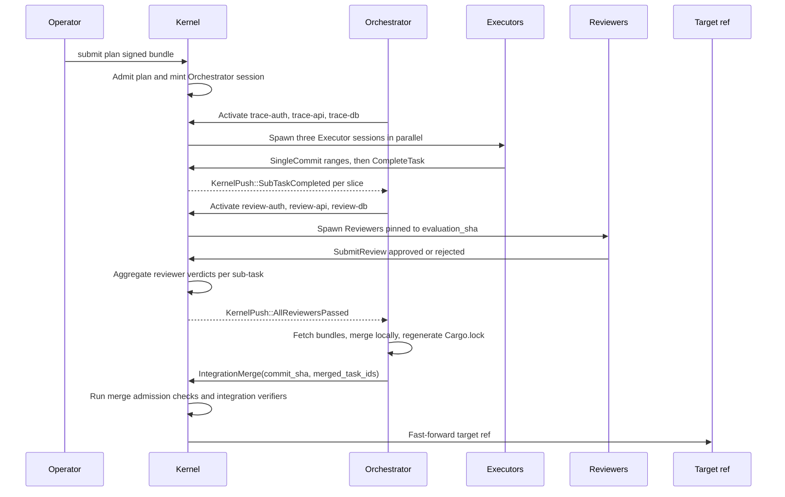

# Pattern: fan-out, then merge

> **Topic:** Plan patterns | **Time to read:** ~3 min | **Complexity:** ⭐⭐ Intermediate

A canonical V2 shape: split a refactor into parallel, disjoint
**Executor** tasks; let each finish independently; let one
**Reviewer per Executor** verdict the work; the kernel-managed
**Orchestrator** merges the approved commits via `IntegrationMerge`
once it receives `KernelPush::AllReviewersPassed`. Useful for
refactoring across N modules, lints across N files, or any
"embarrassingly-parallel + final serialization" workload.

---

## Role recap (do not violate)

The dispatch matrix
(`kernel/src/authority/dispatch_matrix.rs`) is exhaustive and
compile-checked:

| Intent | Orchestrator | Executor | Reviewer |
|---|---|---|---|
| `SingleCommit` | ❌ | ✅ | ❌ |
| `IntegrationMerge` | ✅ | ❌ | ❌ |
| `CompleteTask` | ✅ | ✅ | ❌ |
| `ReportFailure` | ✅ | ✅ | ❌ |
| `ActivateSubTask` / `RetrySubTask` | ✅ | ❌ | ❌ |
| `SubmitReview` | ❌ | ❌ | ✅ |

Concretely:

- **Reviewers never write code and never merge.** Their only
  authorized intent is `SubmitReview { approved, critique }`.
- **Only the Orchestrator submits `IntegrationMerge`.** It is the
  sole merger. Executors produce per-sub-task commits via
  `SingleCommit`; the Orchestrator advances the initiative's
  target ref via `IntegrationMerge`.
- **The Orchestrator is auto-spawned by the kernel.** Never
  declare a `session_agent_type = "Orchestrator"` task — admission
  rejects with `FAIL_ORCHESTRATOR_TASK_NOT_PERMITTED`.

---

## When this fits

- The work decomposes into N independent slices (e.g., one
  module per Executor).
- The slices don't write to each other's `path_allowlist`.
- One Reviewer per Executor is enough; if you need a panel per
  Executor, see [`02-reviewer-panel`](./02-reviewer-panel.md).

When this does NOT fit:

- Slices share files → conflict resolution belongs to the
  Orchestrator's merge step. Cross-cutting regenerated files (e.g.
  `Cargo.lock`) go in the `[orchestrator]` block via
  `cross_cutting_artifacts`.
- A pre-merge integration verifier (e.g. `cargo test --workspace`)
  is required → see
  [`03-merge-with-integration-verifiers`](./03-merge-with-integration-verifiers.md).

---

## Plan shape

```toml
[plan.initiative]
description = "Add tracing to N modules"

[workspace]
name        = "tracing-fanout"
lane_id     = "default"
repository  = "main"
target_ref  = "refs/heads/main"

# Fan-out: three independent Executors. Each writes only its own
# module. The kernel admits all three immediately (predecessors=[]).

[[tasks]]
task_name            = "trace-auth"
session_agent_type = "Executor"
clone_strategy     = "sparse"
path_allowlist     = ["src/auth/"]
predecessors       = []
description        = "Trace Auth"
prompt             = """Add OpenTelemetry tracing to src/auth/. Match the spans declared in spec/tracing.md."""

[[tasks]]
task_name            = "trace-api"
session_agent_type = "Executor"
clone_strategy     = "sparse"
path_allowlist     = ["src/api/"]
predecessors       = []
description        = "Trace Api"
prompt             = """Add OpenTelemetry tracing to src/api/."""

[[tasks]]
task_name            = "trace-db"
session_agent_type = "Executor"
clone_strategy     = "sparse"
path_allowlist     = ["src/db/"]
predecessors       = []
description        = "Trace Db"
prompt             = """Add OpenTelemetry tracing to src/db/."""

# One Reviewer per Executor. Each Reviewer's predecessors is the
# single Executor it reviews. The Reviewer has NO write authority
# and submits only `SubmitReview { approved, critique }`. The
# Reviewer's path_allowlist is the read scope used for its sparse
# worktree mount (Reviewer VMs are RO and have no network).

[[tasks]]
task_name            = "review-auth"
session_agent_type = "Reviewer"
clone_strategy     = "blobless"
path_allowlist     = ["src/auth/"]
predecessors       = ["trace-auth"]
description        = "Review Auth"
prompt             = """Verify span names and propagation match spec/tracing.md for src/auth/."""

[[tasks]]
task_name            = "review-api"
session_agent_type = "Reviewer"
clone_strategy     = "blobless"
path_allowlist     = ["src/api/"]
predecessors       = ["trace-api"]
description        = "Review Api"
prompt             = """Verify span names and propagation for src/api/."""

[[tasks]]
task_name            = "review-db"
session_agent_type = "Reviewer"
clone_strategy     = "blobless"
path_allowlist     = ["src/db/"]
predecessors       = ["trace-db"]
description        = "Review Db"
prompt             = """Verify span names and propagation for src/db/."""

# Cross-cutting artifacts the Orchestrator may touch during merge.
# This is the ONLY operator-tunable input the auto-spawned
# Orchestrator consumes from plan.toml.
[orchestrator]
cross_cutting_artifacts = ["Cargo.lock"]
```

Key points:

- The three Executors have **disjoint** `path_allowlist`. They
  cannot write into each other's slices.
- Each Reviewer reviews **one** Executor (`predecessors` is a
  single Executor `task_name`). The kernel rejects a Reviewer with no
  predecessor or with a non-Executor predecessor.
- There is **no "merge Reviewer".** The Orchestrator is the
  merger; you don't see it in `[[tasks]]`.
- The `[orchestrator]` block names the cross-cutting files the
  Orchestrator may touch when it regenerates state during the
  merge (e.g., `Cargo.lock` after dependency bumps).

---

## What happens when the plan runs



The Orchestrator is the **single merge serialization point**.
Reviewers never advance the target ref; they only emit verdicts.

---

## Lane budget considerations

Three concurrent Executors + their three Reviewers + the
auto-spawned Orchestrator = peak ~7 sessions. Make sure the lane
has:

- `max_concurrent_tasks ≥ 7` to avoid backpressure.
- Token caps in `[budget.token_caps]` covering 3 Executor + 3
  Reviewer + 1 Orchestrator.

If the lane is tight, reduce parallelism by chaining (e.g.,
`trace-api.predecessors = ["trace-auth"]`).

---

## Per-task verifiers

Each Executor can carry pre-review verifiers that run before the
Reviewer activates:

```toml
[[tasks.verifiers]]
name       = "rg_pre_commit"
image      = "raxis-verifier-starter"
command    = "rg --line-number --hidden --glob '!.git/*' TODO src/"
timeout    = "30s"
on_failure = "block_review"
```

These are mechanical checks (`cargo fmt --check`, `rg`), not
Reviewer judgment. They produce kernel-recorded witnesses.

For cross-cutting integration tests (e.g., `cargo test
--workspace` against the merged tree), use
`[[integration_merge_verifiers]]` in `policy.toml` — those run
inside the kernel as part of `IntegrationMerge` admission, not
inside a planner session. See
[`03-merge-with-integration-verifiers`](./03-merge-with-integration-verifiers.md).

---

## Common errors

| Symptom | Fix |
|---|---|
| `FAIL_ORCHESTRATOR_TASK_NOT_PERMITTED` | A `[[tasks]]` declared `session_agent_type = "Orchestrator"`. Remove it; the Orchestrator is auto-spawned. |
| `FAIL_REVIEWER_NO_PREDECESSOR` | A Reviewer's `predecessors = []`. Every Reviewer needs the Executor it reviews. |
| `FAIL_REVIEWER_PREDECESSOR_NOT_EXECUTOR` | A Reviewer's predecessor is another Reviewer. |
| Reviewer tries `SingleCommit` / `IntegrationMerge` / `WriteFile` | Rejected with `FAIL_POLICY_VIOLATION` (dispatch matrix). |
| Executor tries `IntegrationMerge` | Rejected with `FAIL_POLICY_VIOLATION`. Only the Orchestrator merges. |
| Reviewer blocked indefinitely | Its predecessor Executor is still running or `Aborted`. `raxis explain trace-auth`. |
| `LANE_CONCURRENCY` rejected at admission | Raise `max_concurrent_tasks` or chain the Executors. |
| Lockfile drift attributed to Executor | The Executor wrote `Cargo.lock`. Add `Cargo.lock` to `[orchestrator].cross_cutting_artifacts` and tell the Executor not to commit it. |

---

## Reference

| Concept | Recipe |
|---|---|
| `predecessors` (DAG) | [plan/07-predecessors](../plan/07-predecessors.md) |
| `path_allowlist` (Executor write scope; Reviewer read scope) | [plan/04-path-allowlist](../plan/04-path-allowlist.md) |
| `[orchestrator]` cross-cutting artifacts | [plan/10-orchestrator-block](../plan/10-orchestrator-block.md) |
| `session_agent_type` semantics | [plan/06-session-agent-type](../plan/06-session-agent-type.md) |
| Lane sizing | [ops/06-tune-lane-budget](../ops/06-tune-lane-budget.md) |
| Source of truth | `kernel/src/authority/dispatch_matrix.rs`, `specs/v2/v2-deep-spec.md` §Step 8, `specs/v2/integration-merge.md` |

---

## Variations

- **N Executors, 1 Reviewer per Executor + integration verifier.**
  See [03-merge-with-integration-verifiers](./03-merge-with-integration-verifiers.md).
- **N Executors, M Reviewers per Executor (panel).** See
  [02-reviewer-panel](./02-reviewer-panel.md).
- **Sequential then parallel.** A bootstrap Executor runs first
  (`predecessors = []`), then N Executors with
  `predecessors = ["bootstrap"]` run in parallel; each gets its
  Reviewer; the Orchestrator merges in dependency order.
- **Capped parallelism via fake predecessors.** With 30 slices but
  only 5 in flight, add throttling predecessors:
  `slice-6.predecessors = ["slice-1"]`,
  `slice-7.predecessors = ["slice-2"]`, etc. The Orchestrator
  still merges them all eventually.
- **Pure Executor plan (no Reviewer).** Drop Reviewer blocks; the
  Orchestrator merges immediately on each `CompleteTask`. Fast
  path for trivial fixes; lose the human-emulating verdict step.
