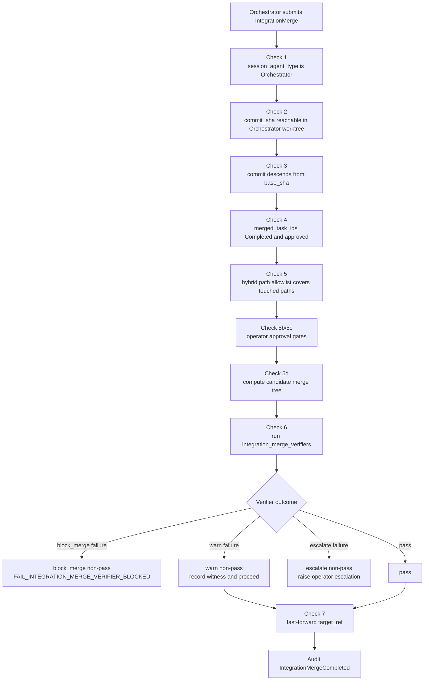

# Pattern: integration verifiers gating the merge

> **Topic:** Plan patterns | **Time to read:** ~3 min | **Complexity:** ⭐⭐ Intermediate

After a Reviewer approves and the Orchestrator submits
`IntegrationMerge`, the kernel can run a set of
**integration merge verifiers** against a candidate merge tree
before fast-forwarding the target ref. These are mechanical
checks declared either in `policy.toml` (operator-controlled,
global) or in `plan.toml` under `[[plan.integration_merge_verifiers]]`
(initiative-specific). Typical commands are `cargo test --workspace`,
`pytest`, or a build sanity check that exercises the union of
Executors' work. Failure blocks the merge without the merge ever
being visible to consumers of the target ref.

---

## Where these verifiers live (very different from `[[tasks.verifiers]]`)

There are three verifier surfaces. Don't mix them up.

| Surface | Declared in | Runs when | Authority |
|---|---|---|---|
| `[[tasks.verifiers]]` | `plan.toml`, per-task | After `CompleteTask`, before reviewer activation | **Plan-side**: one task's commit |
| `[[plan.integration_merge_verifiers]]` | `plan.toml`, per initiative | During `IntegrationMerge`, against the candidate merged tree | **Plan-side**: this initiative's merged result |
| `[[integration_merge_verifiers]]` | `policy.toml`, global | During `IntegrationMerge`, against the candidate merged tree | **Operator/policy-side**: every matching initiative under that policy is gated |

`[[integration_merge_verifiers]]` are NOT attached to a planner
session; they execute in a kernel-isolated verifier image and emit
witnesses straight to the audit chain. The Reviewer never sees
their output (Reviewer ran earlier, against the Executor's
evaluation_sha, not the merged tree).

---

## Role recap

- The **Reviewer** approves an Executor's commit (verdict only —
  no writes, no merge).
- The **Orchestrator** submits `IntegrationMerge { commit_sha,
  merged_task_ids, … }` after `KernelPush::AllReviewersPassed`.
- The **kernel** (admission pipeline, `intent.rs`):
  1. Computes a candidate merge tree (Check 5d in
     `specs/v2/integration-merge.md`).
  2. Runs each matching plan/policy integration verifier whose
     `on_failure = "block_merge"` against the candidate tree.
  3. On any block-merge failure: discards the candidate tree, does
     NOT advance the target ref, returns
     `FAIL_INTEGRATION_MERGE_VERIFIER_BLOCKED { verifier_names }`
     to the Orchestrator.
  4. On all-pass: persists the merge, fast-forwards the
     initiative's target ref, emits `IntegrationMergeCompleted`.

---

## When this fits

- Multi-module work where unit tests pass per-Executor but the
  merged tree may break integration.
- Compiled languages where the union must type-check.
- Migration plans where a final smoke test confirms new schema +
  new code together.
- Generated-artifact pipelines (e.g., regenerate `Cargo.lock` and
  ensure it matches the union of `Cargo.toml` changes).

When this does NOT fit:

- Documentation-only changes (no integration test relevant).
- Test suites too slow to gate every merge — set
  `on_failure = "warn_only"` for advisory-only behaviour on
  plan-side verifiers. Operator-side policy verifiers are expected
  to block.

---

## Plan side

The plan looks just like
[`01-fan-out-then-merge`](./01-fan-out-then-merge.md): per-Executor
slices + per-Executor Reviewer + an `[orchestrator]` block. If the
merged-result check is specific to this initiative, add
`[[plan.integration_merge_verifiers]]` to the same plan.

```toml
[plan.initiative]
description = "Refactor auth + api with shared session middleware"

[workspace]
name        = "session-middleware"
lane_id     = "default"
repository  = "main"
target_ref  = "refs/heads/main"

[[tasks]]
task_id            = "refactor-auth"
description        = "Refactor Auth"
prompt             = """Complete Refactor Auth according to this plan's acceptance criteria."""
session_agent_type = "Executor"
clone_strategy     = "sparse"
path_allowlist     = ["src/auth/", "tests/auth/"]
predecessors       = []

[[tasks]]
task_id            = "review-auth"
description        = "Review Auth"
prompt             = """Complete Review Auth according to this plan's acceptance criteria."""
session_agent_type = "Reviewer"
clone_strategy     = "blobless"
path_allowlist     = ["src/auth/", "tests/auth/"]
predecessors       = ["refactor-auth"]

[[tasks]]
task_id            = "refactor-api"
description        = "Refactor Api"
prompt             = """Complete Refactor Api according to this plan's acceptance criteria."""
session_agent_type = "Executor"
clone_strategy     = "sparse"
path_allowlist     = ["src/api/", "tests/api/"]
predecessors       = []

[[tasks]]
task_id            = "review-api"
description        = "Review Api"
prompt             = """Complete Review Api according to this plan's acceptance criteria."""
session_agent_type = "Reviewer"
clone_strategy     = "blobless"
path_allowlist     = ["src/api/", "tests/api/"]
predecessors       = ["refactor-api"]

[orchestrator]
cross_cutting_artifacts = []

[[plan.integration_merge_verifiers]]
name       = "candidate_e2e"
image      = "raxis-verifier-rust-starter"
command    = "cargo test --workspace --locked"
timeout    = "10m"
on_failure = "block_merge"
applies_to = "all"
```

---

## Policy side — `[[integration_merge_verifiers]]`

The integration verifier is declared once in `policy.toml`:

```toml
[[integration_merge_verifiers]]
name       = "cargo_test_workspace"
image      = "raxis-verifier-cargo-test"
command    = "cargo test --workspace"
on_failure = "block_merge"
timeout    = "10m"

[[integration_merge_verifiers]]
name       = "cargo_build_workspace"
image      = "raxis-verifier-cargo-build"
command    = "cargo build --workspace --locked"
on_failure = "block_merge"
timeout    = "5m"
```

| Field | Effect |
|---|---|
| `name` | Surfaces in `FAIL_INTEGRATION_MERGE_VERIFIER_BLOCKED { verifier_names }` and the witness audit row. |
| `image` | Resolves to a `[[vm_images]]` entry; the kernel runs `command` inside it. |
| `command` | Shell command run against the candidate merge tree mounted at the verifier's worktree path. |
| `on_failure` | `block_merge` discards the candidate merge on non-pass. Plan-side entries may use `warn_only` for audit-only checks. |
| `timeout` | Hard wall-clock duration; exceeding it counts as failure. |

The verifier image is operator-published (signed) — see
[`ops/09-publish-verifier-image`](../ops/09-publish-verifier-image.md).

---

## What the kernel does on `IntegrationMerge`



If any block-merge verifier rejects, the candidate tree is discarded,
the target ref is unchanged, and the Orchestrator gets a typed failure
code. The witness row is also attached to the synthetic integration
coordinator task (the task id is the initiative id) so the dashboard DAG,
task witness panel, and audit chain all show:

- whether the gate came from `plan.toml` or `policy.toml`;
- that it ran at the `integration_merge` hook;
- the verifier image/command/failure mode; and
- `Pass`, `Fail`, `Inconclusive`, or a verifier-run lifecycle failure
  such as `SpawnFailed`, `ProcessFailed`, or `Timeout`.

The standard Orchestrator response (per `agent-disagreement.md`) is to either:

- Issue `RetrySubTask` on the failing sub-task with the verifier's
  witness in the system prompt, or
- `ReportFailure` to surface the integration failure to the
  operator.

---

## Cost considerations

Integration verifiers run **once per merge admission**, against
the candidate union tree. A retry of one Executor produces a new
candidate (different commit_sha) and re-runs every verifier.

The kernel content-addresses verifier witnesses by:

- The verifier image sha.
- The candidate commit sha + worktree subset the verifier reads.
- The argv + relevant env subset.

Identical inputs → witness cache hit, no re-run. For deterministic
caching:

- Pin `target_ref` in the workspace to a sha (not a branch name).
- Make the verifier image deterministic (no timestamps in output;
  sorted file ordering; `RUST_LOG=warn` or similar).

---

## Common errors

| Symptom | Fix |
|---|---|
| `FAIL_INTEGRATION_MERGE_VERIFIER_BLOCKED { verifier_names }` | One verifier rejected. Pull its witness via `raxis log <init> --kind WitnessRecorded --json` and decide which Executor needs to revise. |
| `FAIL_PROTECTED_PATH_APPROVAL_REQUIRED` | The candidate touched a protected path (Check 5b) — operator escalation required, not a verifier failure. |
| Verifier timeout | Raise `timeout` or split into shorter verifiers. |
| Cache never hits despite identical inputs | The verifier image emits nondeterministic output. Harden it. |
| Reviewer approved but verifier rejected | Expected — the Reviewer evaluated the Executor's commit against base; the verifier evaluates the candidate merge tree (which may have introduced cross-module breakage). The merge correctly blocks. |
| Verifier appears to attach to a `[[tasks]]` block | Mixed-up surface. Use `[[tasks.verifiers]]` for one task, `[[plan.integration_merge_verifiers]]` for one initiative's merged result, and `[[integration_merge_verifiers]]` for policy-wide merged-result checks. |

---

## Reference

| Concept | Surface |
|---|---|
| `IntegrationMerge` admission pipeline | `specs/v2/integration-merge.md` (normative) |
| Verifier image lifecycle | [ops/09-publish-verifier-image](../ops/09-publish-verifier-image.md) |
| `[[tasks.verifiers]]` (plan-side) | [plan/11-task-verifiers](../plan/11-task-verifiers.md) |
| Existing scenario | `guides/scenarios/05-orchestrator-decides-merge-order/` |
| Witness inspection | [cli/28-witnesses-verifiers](../cli/28-witnesses-verifiers.md) |
| `[orchestrator].all_merges_require_approval` (companion gate) | [policy/15-notifications-section](../policy/15-notifications-section.md) and `policy-plan-authority.md §4` |

---

## Variations

- **Tiered verifiers.** Cheap per-Executor verifiers
  (`[[tasks.verifiers]] on_failure = "block_review"`) for `cargo fmt`,
  `rg` lints. Expensive `[[integration_merge_verifiers]]` for
  `cargo test --workspace`. Each gates a different scope.
- **Build-then-test.** Two integration verifiers in series:
  first `cargo build --workspace --locked` (fast, catches type
  errors and lockfile drift), then `cargo test --workspace`
  (slow). The build catches before paying for tests.
- **Advisory verifier.** `on_failure = "warn_only"` runs the verifier
  and records the witness, but doesn't block. Useful for
  soft-launching a new check.
- **Cross-language workspace.** Polyglot project with one
  integration verifier per language (Rust, Python, JS); all
  declared in policy with `on_failure = "block_merge"`.
- **Per-target-ref pinning.** Set `workspace.target_ref` to a
  sha (not a branch name) so the candidate-tree base is
  deterministic and the verifier cache hits across retries.
