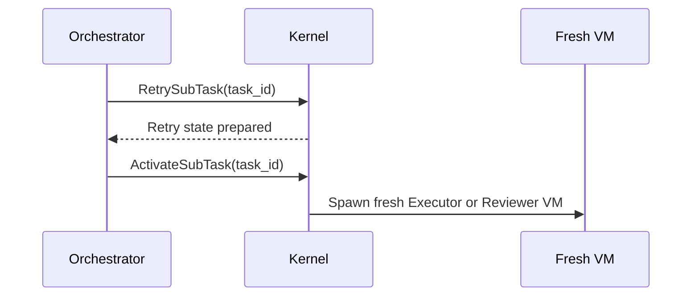
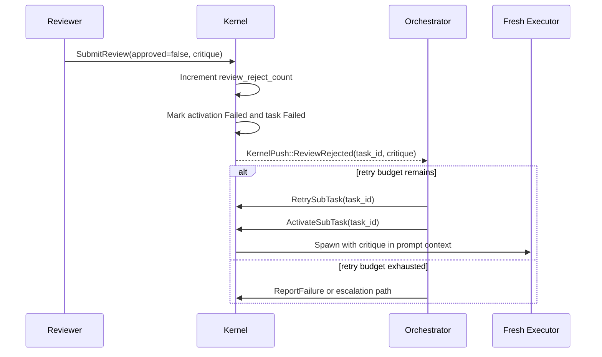

# Pattern: retry on failure (crash + review-rejection ceilings)

> **Topic:** Plan patterns | **Time to read:** ~4 min | **Complexity:** ⭐⭐ Intermediate

A sub-task's Executor VM can fail two distinct ways, and each is
counted under its **own ceiling**:

- **Crash-style failure.** The Executor VM exits non-zero, OOMs,
  panics, hits its `cumulative_max_seconds`, or otherwise dies
  before submitting a verdict. Tracked in
  `subtask_activations.crash_retry_count`, ceilinged by the plan's
  `max_crash_retries` (kernel default `3` if omitted).
- **Reviewer-rejection failure.** The Executor finished cleanly,
  its Reviewer (or any Reviewer in the panel) submitted
  `SubmitReview { approved = false, critique }`. Tracked in
  `subtask_activations.review_reject_count`, ceilinged by
  `max_review_rejections` (kernel default `2` if omitted).

The Orchestrator's recovery loop is **two intents in series**:
`RetrySubTask` (kernel cleanup + state preparation) followed by
`ActivateSubTask` (the actual VM re-spawn). Keeping the spawn out
of `RetrySubTask` preserves the single-spawn-point invariant —
`ActivateSubTask` remains the sole place a sub-task VM is born.

---

## Why two counters and not one

A task that bounces three times — twice from a flaky verifier
crash, once from a Reviewer correctly rejecting a regression —
should not be lumped under a single `retry_count = 3` budget.
The crash budget protects the operator's compute spend; the
review-rejection budget protects against an Executor that has
correctly produced bad code three times in a row, which usually
means the prompt is wrong, not the runtime.

Both ceilings are checked on every `RetrySubTask`. If **either**
counter has met its ceiling, the kernel rejects with
`FAIL_INVALID_REQUEST` and the Orchestrator must escalate or
`ReportFailure`.

---

## Plan side

```toml
[plan.initiative]
description = "Migrate auth module"

[workspace]
name        = "auth-migration"
lane_id     = "default"
repository  = "main"
target_ref  = "refs/heads/main"

[[tasks]]
task_id              = "migrate-auth"
session_agent_type   = "Executor"
clone_strategy       = "sparse"
path_allowlist       = ["src/auth/", "tests/auth/"]
predecessors         = []
description        = "Migrate Auth"
prompt             = """Port src/auth/ from session-cookie middleware to JWT."""

# Be explicit. Operator-declared ceilings document budget intent
# and override the kernel defaults (3 / 2). A flaky test suite
# may justify raising max_crash_retries; a touchy refactor may
# justify raising max_review_rejections.
max_crash_retries     = 5
max_review_rejections = 3

[[tasks]]
task_id              = "review-auth"
session_agent_type   = "Reviewer"
clone_strategy       = "blobless"
path_allowlist       = ["src/auth/", "tests/auth/"]
predecessors         = ["migrate-auth"]
description        = "Review Auth"
prompt             = """Verify the JWT migration preserves all session lifecycle invariants."""

[orchestrator]
cross_cutting_artifacts = []
```

| Field | Effect | Kernel default if omitted |
|---|---|---|
| `max_crash_retries` | Rejects `RetrySubTask` once `crash_retry_count` ≥ this value. Crashes are reported via `ReportFailure` carrying `failure_kind = ExecutorCrash`. | `3` |
| `max_review_rejections` | Rejects `RetrySubTask` once `review_reject_count` ≥ this value. Rejections are bumped via `SubmitReview { approved = false }`. | `2` |

Set either to `0` to opt out of retries entirely (one-shot tasks).
Set to `u32::MAX` only if you genuinely want unbounded retries —
practically equivalent to a runaway-budget bug.

---

## What `RetrySubTask` does (and does not) do

`RetrySubTask { task_id }` is **Orchestrator-only** (the
dispatch matrix authorises no other actor). The kernel handler
(`kernel/src/handlers/intent.rs::handle_retry_sub_task`) runs
this in a single SQLite transaction:

1. Look up the most recent `subtask_activations` row for
   `task_id`. The row **must be in `Failed`**. Anything else
   (`PendingActivation`, `Active`, `Completed`) rejects with
   `FAIL_INVALID_REQUEST` — there is nothing to retry against.
2. Resolve the effective ceilings. The plan registry stores the
   `Option<u32>` exactly as parsed; `effective_max_crash_retries`
   /  `effective_max_review_rejections` substitute the kernel
   defaults at admission time, never at parse time.
3. Reject if `crash_retry_count >= max_crash_retries` **or**
   `review_reject_count >= max_review_rejections`.
4. Atomic SQL:
   - `UPDATE sessions SET revoked = 1, revoked_at = ?` for the
     prior bound session (if any).
   - `INSERT INTO subtask_activations (...)` — a brand-new row
     in `PendingActivation`. Counters are **carried forward
     verbatim** from the prior row; this handler never bumps and
     never resets them. (Bumps happen at the failure event:
     `SubmitReview` rejection / SIGCHLD; resets never happen.)
   - `UPDATE tasks SET state = 'Admitted'` so the subsequent
     `ActivateSubTask` will pass the Phase A task-state gate.
5. Best-effort post-commit: ask the substrate to terminate the
   prior VM. Idempotent at the bridge — if the VM is already
   gone (the common case), the bridge surfaces
   `SpawnError::SessionNotActive` and the kernel logs + ignores.
6. Audit emit: `SessionRevoked { session_id, revoked_by,
   revoked_by_display_name }`.

**It does NOT spawn a new VM.** The Orchestrator's normal retry
workflow is the two-intent dance:



Having `ActivateSubTask` remain the single spawn point makes the
retry contract trivially auditable and keeps
`spawn_executor_for_task` the only function in the kernel that
can produce a Reviewer / Executor session.

---

## Reviewer-rejection retry: the typical loop



The new Executor's system prompt is re-assembled by the kernel
and **includes the prior Reviewer's critique** as task context
(see `kernel-system-prompts.md §4.3`). This is how the rejected
Executor learns what to fix without the Orchestrator having to
ferry the critique manually.

---

## Crash-style retry: kernel-pushed re-activation

For VM-crash failures, the kernel detects via SIGCHLD or the
`cumulative_max_seconds` timer. The handler bumps
`crash_retry_count`, transitions the activation to `Failed`, and
emits `KernelPush::ExecutorCrashed { task_id, exit_kind }` to the
Orchestrator. Same two-intent recovery loop, different counter.

```mermaid
sequenceDiagram
    participant K as Kernel
    participant O as Orchestrator

    K->>K: Detect VM crash
    K->>K: Active -> Failed; crash_retry_count += 1
    K-->>O: KernelPush::ExecutorCrashed(task_id, exit_kind)
    O->>K: RetrySubTask(task_id)
    O->>K: ActivateSubTask(task_id)
```

If `crash_retry_count >= max_crash_retries`, the kernel rejects
the `RetrySubTask` with `FAIL_INVALID_REQUEST`. The Orchestrator
must then escalate or fail the initiative.

---

## Reading the activation history

Each retry **inserts a new `subtask_activations` row**; rows are
never updated to "reuse" a prior activation. The kernel-store
migration (Migration 5, line 51-52) is explicit about this:
"One row per activation attempt — a retry inserts a NEW row,
never updates the prior one." This makes the audit trail trivial
to read:

```bash
raxis log <initiative-id> --kind SubtaskActivationCreated --json
```

returns one event per activation attempt, including the
`crash_retry_count` and `review_reject_count` snapshots at
creation time. The newest row's counters are always one greater
than (or equal to) the previous row's — counters are
monotonically non-decreasing.

To inspect the SQL directly:

```sql
SELECT activation_id, activation_state, crash_retry_count,
       review_reject_count, created_at, terminated_at
  FROM subtask_activations
 WHERE task_id = ?1
 ORDER BY created_at ASC;
```

---

## Common errors

| Symptom | Likely cause | Fix |
|---|---|---|
| `FAIL_INVALID_REQUEST` on `RetrySubTask` immediately | Either the prior activation is not in `Failed` (you sent `RetrySubTask` against a still-`Active` row), or a ceiling has been met. The kernel logs the reason via `eprintln!(\"event\":\"RetrySubTaskRejected*\")`. | Read the kernel log, then either wait for the activation to transition to `Failed`, or escalate. |
| `RetrySubTask` succeeded but no new VM appears | You forgot the second intent. `RetrySubTask` only prepares state; you must follow with `ActivateSubTask`. | Issue `ActivateSubTask { task_id }` after a successful `RetrySubTask`. |
| Counters appear to jump by 2 in a single retry | The activation row in `Active` was both rejected by review AND the kernel detected a hung VM. Both counters bump independently — that's the design. Check the audit chain to confirm both events fired. | Working as intended. |
| Plan parse error: `max_crash_retries: expected u32` | TOML has a non-integer, negative, or fractional value. | Use a non-negative integer. `0` opts out; omit the field for the kernel default. |
| Initiative looks "stuck" with `state = Failed` and no retry | Orchestrator decided the budget was exhausted and called `ReportFailure`. Inspect the `IntentSubmitted { kind = ReportFailure }` audit row for the reason. | Operator-side: either raise the ceiling and re-submit the plan, or accept the failure and abort the initiative. |

---

## Variations

- **One-shot task.** Set `max_crash_retries = 0` and
  `max_review_rejections = 0` for a task that must succeed on
  the first attempt — useful for migration steps that are
  irreversible if partially applied.
- **Retry-tolerant scaffolding.** Set `max_crash_retries = 10`
  for a task whose verifier image is known-flaky (e.g., a
  rate-limited integration verifier) while the suite stabilises.
  Pair with an audit-chain alarm so the operator notices if
  retries actually fire often.
- **No-review-budget hotfix.** Reviewer rejections often signal
  prompt drift; set `max_review_rejections = 1` to surface
  prompt issues to the operator quickly rather than burn budget
  on the same broken plan. Pair with an `[escalation]` rule that
  routes "review-rejection-budget-exhausted" to a human.
- **Asymmetric budgets in a panel.** If three Reviewers vote
  logical-AND, a single rejection bumps `review_reject_count`
  by 1 (not by the number of dissenting Reviewers). Tune
  `max_review_rejections` accordingly.

---

## Reference

| Surface | Where |
|---|---|
| Handler implementation | `kernel/src/handlers/intent.rs::handle_retry_sub_task` |
| Plan parser | `kernel/src/initiatives/lifecycle.rs::parse_plan_tasks` (`parse_optional_u32_field`) |
| Effective-ceiling resolution | `kernel/src/initiatives/plan_registry.rs::TaskPlanFields::effective_max_*` |
| Kernel default constants | `DEFAULT_MAX_CRASH_RETRIES = 3`, `DEFAULT_MAX_REVIEW_REJECTIONS = 2` |
| Spec — dual-counter retry | `specs/v2/v2-deep-spec.md §Step 12` |
| Spec — dispatch matrix | `specs/v2/v2-deep-spec.md §Step 20` (Orchestrator + RetrySubTask is the only Authorized cell) |
| Activation FSM | `crates/store/migrations/0005_v2_session_schema.sql` (line 50-52: "a retry inserts a NEW row") |
| Kernel-pushed events | [`KernelPush::ReviewRejected` / `ExecutorCrashed`](../../specs/v2/kernel-push-protocol.md) |
| Reviewer never merges | [`patterns/02-reviewer-panel`](./02-reviewer-panel.md) |
