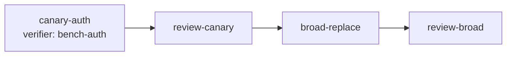

# Pattern: canary task before broad change

> **Topic:** Plan patterns | **Time to read:** ~3 min | **Complexity:** ⭐⭐ Intermediate

The change is risky enough that you want to apply it to one
small, representative slice first, observe the result, and only
then commit to the broader rollout. Two real-world shapes:

- **Library-call canary.** Update one call site of a deprecated
  API, ensure the codebase still builds + tests pass, then
  update the remaining sites.
- **Schema canary.** Add a new column on one low-traffic table
  first; if the migration is clean, do the rest.

Raxis composes this from primitives you already know:
`predecessors` (sequencing), `path_allowlist` (scope), and
`[[tasks.verifiers]]` (per-task gate witnesses). The "canary
gate" is just a Reviewer + a `pre_merge` verifier on the canary
task; the broader task is a downstream sub-task that admits only
after the canary's merge lands.

---

## Why this is its own pattern

Staged rollout (pattern 05) is "do A, then B, then C", each step
of similar size and risk. Canary is asymmetric: a *small,
diagnostic* task feeds confidence into a *much larger* task.
The plan-shape difference is:

- The canary's scope is narrow on purpose (single file or single
  module).
- The canary may have additional `[[tasks.verifiers]]` not run
  on the broad task — typically a `pre_merge` verifier that
  exercises the canary's specific failure mode (e.g., a perf
  benchmark, a schema-migration smoke test).
- The broad task's `predecessors` includes the canary's Reviewer,
  ensuring the canary has merged before the broad change starts.

---

## When this fits

- Deprecation-API rollouts: one call site → all call sites.
- Schema migrations: one table → all tables.
- Build-system changes: one package → workspace-wide.
- Cross-cutting refactors where you want production runtime
  signal (via the canary's witnesses) before committing.

When this does NOT fit:

- Changes where partial rollout is unsafe (e.g., a transaction
  protocol where half-old / half-new is broken).
- Truly identical changes across the codebase that can fan-out
  in parallel — see [`01-fan-out-then-merge`](./01-fan-out-then-merge.md).

---

## Plan shape

```toml
[plan.initiative]
description = "Migrate from deprecated `tracing::trace!` to `tracing::debug!`"

[workspace]
name        = "log-level-migration"
lane_id     = "default"

# CANARY: change exactly one call site, with a perf-benchmark
# verifier that catches a regression before merge.
[[tasks]]
task_id            = "canary-auth"
session_agent_type = "Executor"
clone_strategy     = "sparse"
path_allowlist     = ["src/auth/session.rs"]
predecessors       = []
description        = """Replace deprecated `trace!` with `debug!` in src/auth/session.rs ONLY. Verify with the `bench-auth` verifier."""

  [[tasks.verifiers]]
  name        = "bench-auth"
  image_alias = "raxis-verifier-bench-auth"
  command     = ["bench", "--filter", "session_create"]
  gate        = "pre_merge"
  on_failure  = "block"
  timeout_secs = 120

[[tasks]]
task_id            = "review-canary"
session_agent_type = "Reviewer"
clone_strategy     = "blobless"
path_allowlist     = ["src/auth/session.rs"]
predecessors       = ["canary-auth"]
description        = """Verify only one call site changed and the bench delta is in range."""

# BROAD: every other call site, only after the canary is merged
# AND the bench verifier produced a passing witness.
[[tasks]]
task_id            = "broad-replace"
session_agent_type = "Executor"
clone_strategy     = "sparse"
path_allowlist     = ["src/", "tests/"]
predecessors       = ["review-canary"]
description        = """Replace ALL remaining `trace!` call sites with `debug!`. Reuse the migration documented in canary-auth."""

[[tasks]]
task_id            = "review-broad"
session_agent_type = "Reviewer"
clone_strategy     = "blobless"
path_allowlist     = ["src/", "tests/"]
predecessors       = ["broad-replace"]
description        = """Sample-check that the broad replacement matches the canary's pattern, no `trace!` remains."""

[orchestrator]
cross_cutting_artifacts = []
```

The DAG:



---

## What `pre_merge` actually gates

`[[tasks.verifiers]] gate = "pre_merge"` runs **at the
Orchestrator's `IntegrationMerge` admission** for the canary's
sub-task. The kernel:

1. Computes the canary's candidate merge tree (just the canary's
   Executor commit on the workspace base).
2. Runs `bench-auth` against that tree (kernel-isolated verifier
   image, no planner mediation).
3. If `on_failure = "block"` and the verifier non-passes,
   admission rejects with
   `FAIL_TASK_VERIFIER_BLOCKED { name: "bench-auth" }`.
4. If pass, the witness is recorded in `WitnessRecorded` and the
   merge proceeds.

The crucial property: `broad-replace` cannot start until
`review-canary` reports `Completed`, which only happens after the
canary's `IntegrationMerge` succeeds — which requires the
`bench-auth` verifier to have passed. So the broad change is
**transitively** gated on the verifier's witness.

---

## Reading the canary's witnesses before authorising broad

The Orchestrator (auto-spawned) does this automatically — it
won't admit `broad-replace`'s `ActivateSubTask` until the
predecessor reports Completed. But operators can also manually
inspect the canary's witnesses before the broad task even
activates:

```bash
raxis log <initiative-id> --kind WitnessRecorded \
  --task canary-auth --json
```

returns JSON of every witness emitted while the canary task ran:
the Executor's pre-admission verifiers, the Reviewer's evaluation
witnesses, and the `bench-auth` pre-merge witness. If anything
looks off, the operator can `raxis initiative abort <id>` before
`broad-replace` activates.

---

## Cost model

The canary is cheap (one file). The broad task is the actual
spend. By spending the canary's verifier cost first, you've
guaranteed the broad task's verifier suite at least *probably*
passes — at the cost of one extra Executor + Reviewer activation.

| Step | Approximate cost |
|---|---|
| `canary-auth` Executor | ~1 unit (small commit) |
| `review-canary` Reviewer | ~0.5 unit |
| `bench-auth` verifier | ~0.5 unit |
| `broad-replace` Executor | ~10 units |
| `review-broad` Reviewer | ~3 units |

The canary "tax" is ~2 units for ~13 units of risky work — a
~15% overhead in exchange for an early-abort signal.

---

## Common errors

| Symptom | Cause | Fix |
|---|---|---|
| Broad task starts before canary witness available | Forgot `predecessors = ["review-canary"]` on `broad-replace`. | Add the predecessor edge. The kernel won't admit the broad task without it. |
| `FAIL_TASK_VERIFIER_BLOCKED` on canary `IntegrationMerge` | The verifier rejected the canary commit. | Inspect the witness: `raxis log <init> --kind WitnessRecorded --json | rg bench-auth`. The witness contains the verifier's stderr/stdout. Either revise the canary or raise the verifier's threshold. |
| Verifier passes but reviewer rejects | Two independent gates. The Reviewer evaluates the diff against the Executor's brief; the verifier evaluates a runtime property. Both must pass. | Address the Reviewer's critique; verifier already approved. |
| Want to skip the canary in production | Don't. The canary is the operator-side guarantee that the broad task's risk has been characterised. Removing it reverts to "broad change with no early-abort". | Live with the tax. |
| Verifier image not found | `image_alias` doesn't resolve in `policy.toml`'s `[[vm_images]]`. | Publish the image first — see [`ops/09-publish-verifier-image`](../ops/09-publish-verifier-image.md). |

---

## Variations

- **Multi-canary.** Two canaries, one per representative
  module, both gating `broad-replace` via
  `predecessors = ["review-canary-auth", "review-canary-db"]`.
  Costs more, catches more.
- **Canary with operator approval.** Add an `[escalation]`
  rule scoped to the canary's `IntegrationMerge` (or set
  `[orchestrator].all_merges_require_approval = true` and
  approve the canary's merge but not the broad task's). The
  operator gate becomes the "confidence checkpoint" before
  releasing the broad change.
- **Canary with structured-output reporting.** Have the canary
  Executor emit a `StructuredOutput { TaskSummary { commit_sha,
  notes } }` describing observations the broad task should
  honour (e.g., "this lint surfaced N false positives; suppress
  them in the broad task"). The kernel persists the
  StructuredOutput; the broad Executor's system prompt (via the
  task's `description` and propagated structured outputs)
  carries the lessons forward.
- **Canary feeding multiple broad tasks.** The DAG is not
  limited to one downstream branch — you can have
  `broad-replace-src` and `broad-replace-tests` both fan-in
  from `review-canary`, then merge in parallel.

---

## Reference

| Surface | Where |
|---|---|
| Predecessors | [`plan/07-predecessors`](../plan/07-predecessors.md) |
| Per-task verifiers | [`plan/11-task-verifiers`](../plan/11-task-verifiers.md) |
| Verifier images | [`ops/09-publish-verifier-image`](../ops/09-publish-verifier-image.md) |
| Witness inspection | [`cli/28-witnesses-verifiers`](../cli/28-witnesses-verifiers.md) |
| Companion: staged rollout | [`patterns/05-staged-rollout`](./05-staged-rollout.md) |
| Companion: integration verifiers | [`patterns/03-merge-with-integration-verifiers`](./03-merge-with-integration-verifiers.md) |
| Spec | `specs/v2/integration-merge.md` (verifier gate semantics) |
