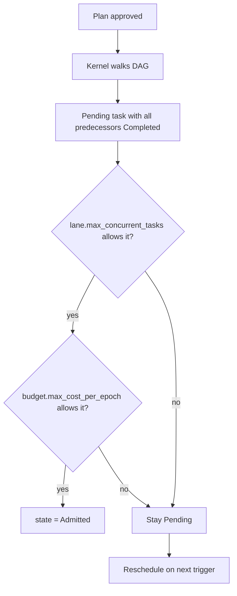

# Pattern: budget-bounded cohort (lane concurrency + cost ceilings)

> **Topic:** Plan patterns | **Time to read:** ~3 min | **Complexity:** ⭐⭐ Intermediate

You have twelve roughly-equivalent slices of work, all of which
*could* run in parallel — but you have a finite host (CPU, RAM,
disk I/O), and the operator wants a hard ceiling on how much
compute this initiative is allowed to consume per epoch. The
plan stays simple (twelve fan-out tasks); the throttling lives
in **policy**, on the lane the tasks share.

This is the operator's primary throttle for "many independent
tasks": `[[lanes]]` with `max_concurrent_tasks` (the
admission-gate ceiling) and `[[budget]]` keyed on
`scope = "lane"` with `max_cost_per_epoch` (the cost ceiling).

The plan stays the same as a fan-out plan. The constraint lives
in policy, signed by the operator, and applies uniformly to
every plan that picks the same `lane_id`.

---

## When this fits

- Bulk regeneration jobs (regenerate N protobuf bindings,
  reformat N modules, run N migrations).
- LLM-heavy initiatives where each task burns substantial cost.
- Shared-host environments where multiple operators submit plans
  to the same lane and the host must remain responsive.
- Anywhere you want "fan out, but at most K at a time".

When this does NOT fit:

- Truly serial work — see [`05-staged-rollout`](./05-staged-rollout.md).
- A single very expensive task — the cost ceiling won't help
  unless you split the work.
- One-off experiments — set the lane wider for these and
  budget-cap the experiment-class lane separately.

---

## Plan side (unchanged)

The plan looks like a normal fan-out: twelve Executors + twelve
Reviewers, all selecting `lane_id = "bulk-refactor"`.

```toml
[plan.initiative]
description = "Reformat all crates with the new rustfmt rules"

[workspace]
name        = "rustfmt-bulk"
lane_id     = "bulk-refactor"   # <-- the lane carries the constraint
repository  = "main"
target_ref  = "refs/heads/main"

# Twelve fan-out Executors — predecessor-free.
[[tasks]]
task_id            = "fmt-crate-a"
session_agent_type = "Executor"
clone_strategy     = "sparse"
path_allowlist     = ["crates/a/"]
predecessors       = []
description        = "Format crate a"
prompt             = """Apply the new rustfmt rules to crates/a/ and commit the result."""

# ... repeat for crates b through l ...

[[tasks]]
task_id            = "fmt-crate-l"
session_agent_type = "Executor"
clone_strategy     = "sparse"
path_allowlist     = ["crates/l/"]
predecessors       = []
description        = "Format crate l"
prompt             = """Apply the new rustfmt rules to crates/l/ and commit the result."""

# Twelve Reviewers — one per Executor.
[[tasks]]
task_id            = "review-fmt-crate-a"
session_agent_type = "Reviewer"
clone_strategy     = "blobless"
path_allowlist     = ["crates/a/"]
predecessors       = ["fmt-crate-a"]
description        = "Review crate a formatting"
prompt             = """Review the crates/a/ formatting change and approve only if it is limited to rustfmt output."""

# ... repeat ...

[orchestrator]
cross_cutting_artifacts = []
```

---

## Policy side — the actual throttle

```toml
[[lanes]]
id                   = "bulk-refactor"
display_name         = "Bulk refactor lane"
max_concurrent_tasks = 4         # never more than 4 active executors+reviewers
admission_strategy   = "fifo"    # or "priority" if you also set per-plan priority

[[budget]]
scope               = "lane"
lane_id             = "bulk-refactor"
max_cost_per_epoch  = 200        # in operator-defined cost units
epoch_seconds       = 86_400     # one-day rolling window
on_exhaustion       = "fail-closed"   # or "queue", "warn"
```

| Field | Effect |
|---|---|
| `max_concurrent_tasks` | Admission-gate ceiling. The kernel will **not** admit a 5th task on this lane while 4 are already `Active`; the 5th stays `Pending` (or `Admitted` if predecessors are clear) and waits for a slot. |
| `admission_strategy` | `fifo` admits in submission order; `priority` consults a per-plan or per-initiative priority field. |
| `max_cost_per_epoch` | The lane's per-epoch cost cap. `tasks.actual_cost` is summed across the lane; once the rolling window exceeds this, new admissions are rejected. |
| `epoch_seconds` | Rolling window length. `86_400` is "per day"; `3_600` is "per hour". |
| `on_exhaustion` | `fail-closed` rejects new admissions with `FAIL_BUDGET_EXHAUSTED`; `queue` defers admission until the next epoch; `warn` admits anyway and emits an audit event. |

---

## What the kernel does

The lane's admission ceiling is enforced at **two** points:

1. **At task admission** (when a plan is approved and the kernel
   walks the DAG to mark predecessor-free tasks `Admitted`). If
   `max_concurrent_tasks` would be exceeded, the task stays in
   `Pending` regardless of its predecessors. It admits later
   when an active task transitions to a terminal state.
2. **At `ActivateSubTask` dispatch** (when the Orchestrator asks
   the kernel to spawn a VM). The kernel re-checks the active-
   task count against `max_concurrent_tasks` and rejects with
   `FAIL_LANE_AT_CAPACITY` if violating.

The cost cap is enforced at admission only — once a task is
`Active`, the kernel does not kill it for budget reasons (that
would be `cumulative_max_seconds`, a different per-task field).
The cap is checked on every "consider admitting a task" event,
including the transitions that admission walking touches:



Reschedule events that re-trigger the walk:

- A task transitions to `Completed` / `Failed` (frees a slot).
- A new epoch begins (refreshes the cost window).
- The operator advances to a newly signed `policy.toml` (may raise
  the ceilings).
- The operator submits a new plan to the lane.

---

## Worst-case wall-clock model

For 24 tasks (12 Executors + 12 Reviewers) with
`max_concurrent_tasks = 4`:

- Best case: ~6 batches of 4 (Executor + matching Reviewer pair
  count as 2 active slots), so 12 Executor batches alternating
  with 12 Reviewer batches. Practical wall-clock is bounded by
  the sum of (batch wall-clock + spawn latency).
- Worst case: review rejections cascade and cause retries,
  consuming additional budget. With `max_review_rejections = 2`
  per task and the lane budget at 200 units, you can absorb up
  to ~16 retries before the cost cap fires.

Reading the budget snapshot:

```bash
raxis budget top --lane bulk-refactor
```

returns the current consumed cost in the active epoch + the
remaining headroom. Pair with `raxis queue inspect` to see
queued tasks waiting for slots.

---

## Common errors

| Symptom | Cause | Fix |
|---|---|---|
| `FAIL_LANE_AT_CAPACITY` on `ActivateSubTask` | Lane is at the slot ceiling. | Wait for a task to finish, OR raise `max_concurrent_tasks` (operator-signed policy edit). |
| `FAIL_BUDGET_EXHAUSTED` | Lane has hit its `max_cost_per_epoch`. | Wait for the epoch to roll, OR raise the cap (operator-signed policy edit). |
| Tasks "stuck" in Pending despite no predecessors | The lane is at-capacity OR over-budget. Inspect with `raxis queue inspect --lane <id>`. | Resolve the constraint (let tasks finish or roll the epoch). |
| Budget never decreases | Cost is reset per-epoch, not per-task. The window slides; once a task's `actual_cost` falls outside the window, it stops counting. | Wait for `epoch_seconds` to elapse since the costly tasks completed. |
| Different lanes share a budget | They don't unless you declare a `scope = "operator"` budget on top. Per-lane budgets are isolated. | Add a higher-scope budget if you want a global cap. |
| Want to dedicate a lane to one initiative | Lanes are operator-shared by design. Use `admission_strategy = "priority"` and tag the high-priority initiative, OR create an operator-private lane. | Architecture choice. |

---

## Variations

- **Two-tier lanes.** A `bulk-refactor` lane with
  `max_concurrent_tasks = 4` for cheap parallel work, plus an
  `interactive` lane with `max_concurrent_tasks = 1` and
  `priority` admission strategy so a one-off operator request
  can preempt the bulk queue.
- **Per-operator budgets.** Stack a `scope = "operator"` budget
  on top of the lane budget so a single operator can't
  monopolise the lane:
  ```toml
  [[budget]]
  scope               = "operator"
  operator_id         = "alice"
  max_cost_per_epoch  = 50
  ```
- **Off-hours lane.** Set `epoch_seconds = 86_400` and a high
  `max_cost_per_epoch` for an "overnight" lane that workers may
  pick up during low-traffic hours; combine with a scheduling
  pre-flight that holds plans until off-peak.
- **Strict no-overrun lane.** `on_exhaustion = "fail-closed"`
  rejects every over-cap admission. Use for cost-sensitive
  environments. The opposite (`warn`) is useful only for staging.
- **Dynamic ceilings.** Operator advances to a signed `policy.toml`
  with a higher `max_concurrent_tasks` during off-peak hours. The
  next admission walk re-evaluates Pending tasks and admits any
  newly fitting ones immediately.

---

## Reference

| Surface | Where |
|---|---|
| Lane admission gate | `kernel/src/scheduler/lane.rs` |
| Budget enforcement | `kernel/src/scheduler/budget.rs` |
| Policy section: lanes | [`policy/07-lanes-section`](../policy/07-lanes-section.md) |
| Policy section: budgets | [`policy/06-budget-section`](../policy/06-budget-section.md) |
| CLI: budget top | [`cli/29-budget-top`](../cli/29-budget-top.md) |
| CLI: queue inspect | [`cli/25-queue-inspect`](../cli/25-queue-inspect.md) |
| Companion: tuning a lane | [`ops/06-tune-lane-budget`](../ops/06-tune-lane-budget.md) |
| Companion: host capacity | [`ops/08-host-capacity-tuning`](../ops/08-host-capacity-tuning.md) |
| Spec | `specs/v1/scheduler.md` |
