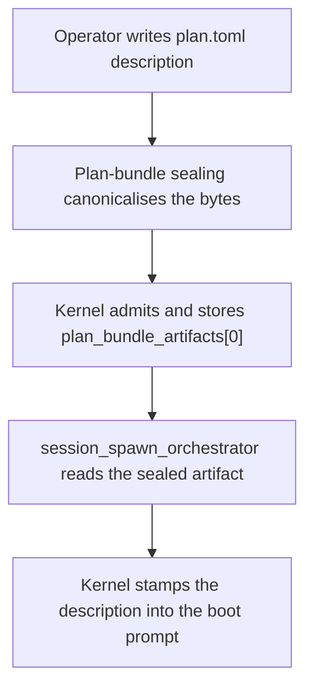

# `[plan.initiative]` — initiative seed prompt

> **Topic:** Plan reference | **Time to read:** ~2 min | **Complexity:** ⭐ Beginner

The `[plan.initiative]` block carries the natural-language
description of the initiative. The Orchestrator and any planner
agent (Executor / Reviewer) reads this verbatim as part of its boot
prompt, so it should be a sharp, complete description of the work
the plan represents — not a TODO or a milestone marker.

---

## Field reference

| Field | Type | Required | Effect |
|---|---|---|---|
| `description` | `String` (multi-line OK) | yes | Verbatim text injected into every agent's system prompt as the "what we're trying to accomplish" section. |

That's the entire block today. Future versions may add fields
(e.g. `[plan.initiative.tags]`, `[plan.initiative.metadata]`); for
now, just `description`.

---

## Example

```toml
[plan.initiative]
description = """
Add IP-based rate limiting to POST /auth/login. Max 10 requests per
minute per IP using a sliding-window algorithm. Return 429 Too Many
Requests with a Retry-After header when the limit is exceeded.
Store rate-limit state in Redis (the client is already initialised
in src/auth/redis.rs).
"""
```

---

## What "good description" looks like

Sharp prompts produce sharp agents. A description should answer:

1. **What's the deliverable?** ("Add rate limiting to POST /auth/login")
2. **What are the parameters?** ("10 req / min / IP, sliding window")
3. **What's the contract?** ("429 + Retry-After header on exceed")
4. **What's the non-goal?** ("Don't change the existing auth flow")
5. **Where do dependencies live?** ("Redis client is in src/auth/redis.rs")

Each `[[tasks]]` block then narrows further with its own
`description`; the initiative-level prompt is the **shared
context** every agent inherits.

### Bad examples (avoid)

```toml
description = """Fix bug."""                                    # Too vague.
description = """See ticket RAXIS-1234."""                      # Agents can't follow links.
description = """TODO: implement rate limiting; see Slack."""   # No concrete acceptance criteria.
```

### Better

```toml
description = """
Implement IP-based rate limiting for POST /auth/login.

Constraints:
- 10 requests per minute per source IP, sliding window.
- Use the Redis client already initialised at src/auth/redis.rs.
- Block the request with HTTP 429 + Retry-After: <seconds> header.
- Existing auth flow MUST remain unchanged for under-quota requests.
- Add unit tests under src/auth/rate_limit_test.rs.
"""
```

---

## How the description reaches the agent



The agent never sees `plan.toml` raw; the kernel composes a
structured system prompt that includes (a) the initiative
description, (b) the per-task description, (c) the path allowlist,
(d) the credential proxy info, etc.

---

## Common failure modes

| Symptom | Fix |
|---|---|
| Agent goes off the rails | Description is too vague. Tighten the constraints + acceptance criteria. |
| Agent writes outside the path allowlist | Description doesn't mention the path constraint. The kernel still rejects the write — but a sharper prompt prevents the agent from *trying*. |
| Agent skips tests | Description doesn't list tests as acceptance criteria. Always state "add tests in <path>" explicitly. |
| Agent reimplements an existing utility | Description doesn't point at existing code. List "use X.Y already at <path>" explicitly. |

---

## Reference

| Surface | Purpose |
|---|---|
| `plan_bundle_artifacts` (kernel.db) | Stores the canonicalised plan.toml bytes — `description` lives here. |
| `raxis initiative show <id> --bundle --to <dir>` | Extract the canonicalised plan to inspect what the agent saw. |
| `kernel/src/initiatives/lifecycle.rs::parse_plan_initiative` | The parser that surfaces this field on the kernel side. |

---

## Variations

- **Multi-paragraph descriptions.** Use TOML triple-quote `"""`
  strings; preserve newlines for readability.
- **Embedded code references.** Quote function names with backticks
  inside the description; agents pick them up as identifiers to
  search for in the worktree.
- **Empty / placeholder description.** Forbidden — the parser
  rejects an empty `description` at admission with
  `FAIL_PLAN_INITIATIVE_DESCRIPTION_REQUIRED`.
