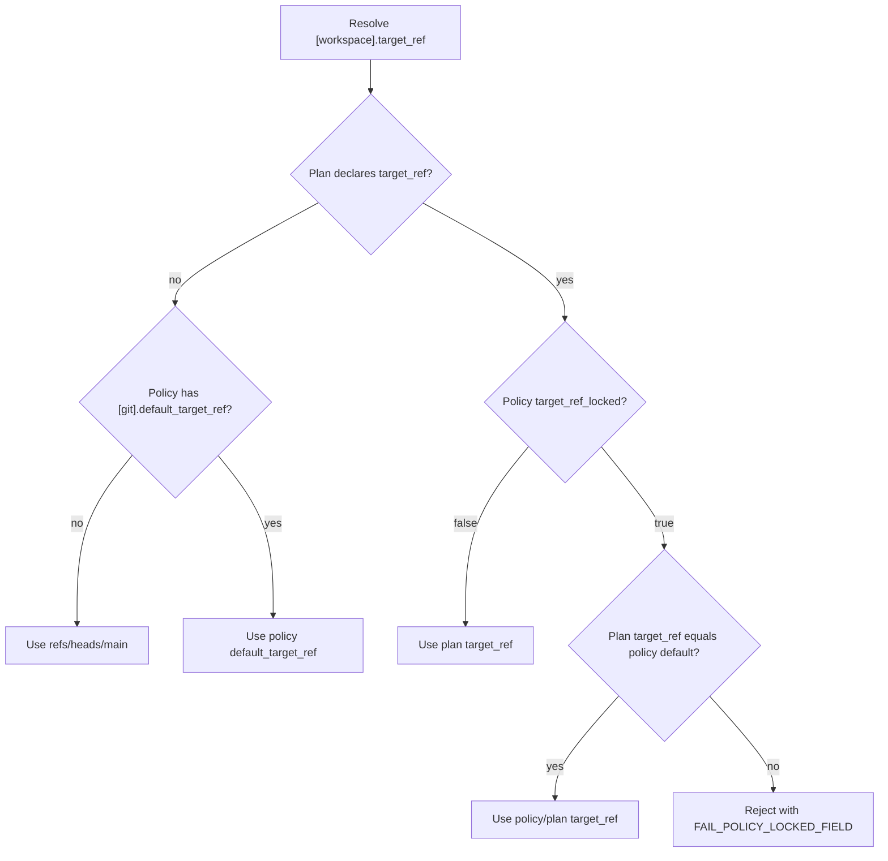

# `[workspace]` — name, lane, and target ref

> **Topic:** Plan reference | **Time to read:** ~3 min | **Complexity:** ⭐ Beginner

The `[workspace]` block declares the initiative's identity:
human-readable name, the lane it pins to, and the git ref the
final IntegrationMerge advances. Everything in this block is
declared **once per plan**; per-task overrides are rejected at
admission.

---

## Field reference

| Field | Type | Required | Default | Effect |
|---|---|---|---|---|
| `name` | `String` | yes | — | Human-readable initiative label. Surfaces in `raxis initiative list`, dashboards, and audit pivots. Single-line, max 64 characters. |
| `lane_id` | `String` | yes | — | The lane the initiative pins to. Must match a `[[lanes]] lane_id` in policy. Per-task `lane_id` overrides are rejected (`single_lane_propagation` rule). |
| `description` | `String` | optional | `""` | One-paragraph operator note. Distinct from `[plan.initiative].description` — agents do **not** see this. Surfaces in `raxis initiative show`. |
| `target_ref` | `String` | optional | (policy default; ultimately `refs/heads/main`) | The git ref the kernel fast-forwards on a successful IntegrationMerge. Must be fully-qualified (`refs/heads/...`). |

---

## How `target_ref` resolves



So:

- If the operator has locked the ref in policy, plans cannot
  override — the only way to merge to a different branch is to
  unlock policy first.
- Otherwise, the plan-level `target_ref` wins; if absent, the
  kernel uses the policy default; if that's absent too,
  `refs/heads/main`.

---

## Example — minimal

```toml
[workspace]
name    = "Add rate limiting to /auth/login"
lane_id = "auth-work"
```

## Example — explicit target ref + description

```toml
[workspace]
name        = "Auth migration sprint 14"
lane_id     = "auth-work"
description = "Sprint 14 — feature-gated, gradual roll-forward from /v1 to /v2."
target_ref  = "refs/heads/auth-v2"
```

## Example — feature-flag work

```toml
[workspace]
name       = "Feature flag for new dashboard"
lane_id    = "frontend-work"
target_ref = "refs/heads/main"   # explicit even though it's the default — readable
```

---

## Common errors

| Symptom | Fix |
|---|---|
| `FAIL_UNKNOWN_LANE` | `lane_id` doesn't match any `[[lanes]] lane_id` in policy. Add the lane (and re-sign), or fix the plan. |
| `FAIL_TARGET_REF_INVALID` | `target_ref` is not fully-qualified or doesn't pass `git-check-ref-format`. Use `refs/heads/<branch>` form. |
| `FAIL_POLICY_LOCKED_FIELD` | Policy has `[git] target_ref_locked = true` and the plan tries to override. Either match the policy default or unlock policy. |
| `single_lane_propagation: per-task lane_id` | A `[[tasks]]` block declared its own `lane_id`. Remove it; the workspace lane is the single source of truth. |
| Initiative listed without name | The `name` field is missing. The parser rejects this; if you see it, your install is at a pre-V2 schema. |

---

## Reference: relevant policy + CLI

| Surface | Purpose |
|---|---|
| `[[lanes]] lane_id` | Declares the universe of valid lane_ids. |
| `[git] default_target_ref` | Per-install default ref. |
| `[git] target_ref_locked` | If true, plans cannot override `target_ref`. |
| `raxis plan validate <plan.toml>` | Pre-flight: catches lane mismatch, ref format, and locked-field collisions. |
| `raxis initiative show <id>` | Shows the resolved (lane_id, target_ref) the kernel admitted. |

---

## Variations

- **Per-feature-branch plans.** Set `target_ref = "refs/heads/feature-X"`
  to merge into a specific branch instead of `main`. Useful for
  plans that cherry-pick into release branches.
- **Single-lane install.** Most demos use one lane, `"default"`.
  Multi-lane is for separating CI traffic from operator workflows.
- **Locked target_ref.** Set `[git] target_ref_locked = true` in
  policy when you want to *force* every plan to merge into one
  branch (e.g., `main` only — no feature-branch detours).
