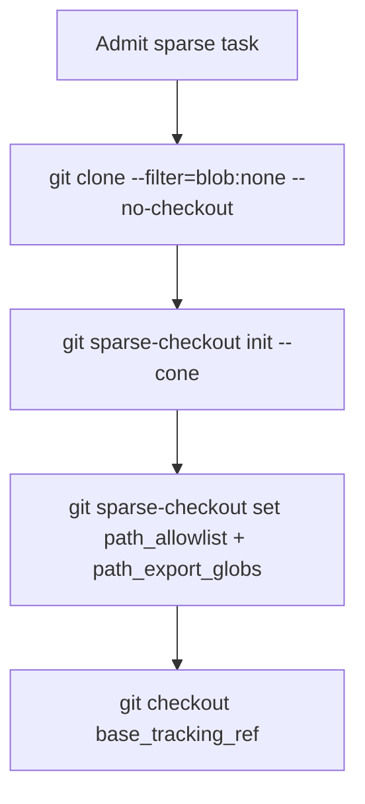
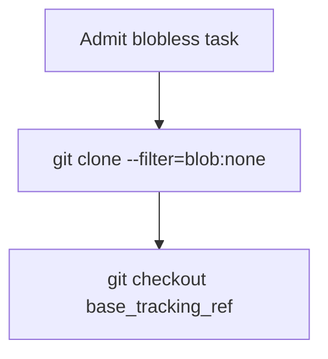
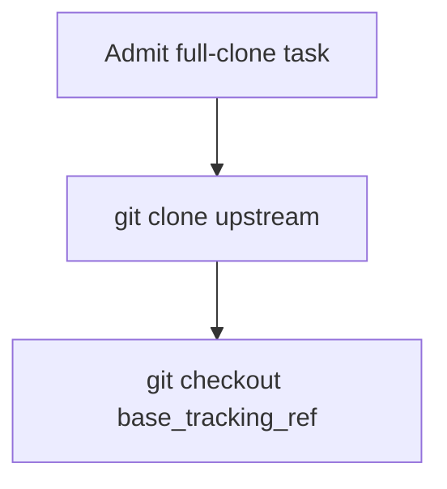

# `clone_strategy` — full / blobless / sparse

> **Topic:** Plan reference | **Time to read:** ~3 min | **Complexity:** ⭐⭐ Intermediate

`clone_strategy` controls **how much of the repo** the kernel
provisions into the agent's worktree. The right choice is a
trade-off between worktree size, clone latency, and read access.
It is required on every `[[tasks]]` block; the kernel does not
silently choose one for you.

---

## The three strategies (V2 §27)

| Strategy | What's downloaded | Read access | Use when |
|---|---|---|---|
| `full` | Everything: tree + every blob + history | Anything in the repo | Small repos. **Orchestrators always.** |
| `blobless` | Tree structure + blobs on demand | Anything (lazy) | Recommended for large repos and agents needing broad read access. |
| `sparse` | Only paths matching `path_allowlist` + `path_export_globs` | Only the cone | Narrow-scope Executors in large monorepos. |

`blobless` is the recommended common choice — it keeps clone latency low
without restricting read access. `sparse` is for the cases where
you need to *enforce* read narrowness (e.g. a security-sensitive
Reviewer).

---

## The Orchestrator-must-be-full-or-blobless rule

```text
session_agent_type = "Orchestrator" + clone_strategy = "sparse"
   → REJECTED at admission with FAIL_ORCHESTRATOR_SPARSE_CLONE
```

Because the Orchestrator does git's 3-way merge, it needs the full
tree object graph. Sparse clones omit objects outside the cone, and
the merge can fail with "object missing" mid-flight.

Practically: the Orchestrator is auto-created and uses `full`. You
don't pick this for Orchestrators directly.

---

## Examples

### Sparse Executor in a large monorepo

```toml
[[tasks]]
task_id            = "implementer"
session_agent_type = "Executor"
clone_strategy     = "sparse"
path_allowlist     = ["src/auth/"]
path_export_globs  = ["src/types/auth/*.rs"]   # read-only paths to include
predecessors       = []
description        = """Implement the auth handler."""
prompt             = """Implement the auth handler, commit the change, and submit CompleteTask."""
```

The kernel provisions a worktree that contains:

- `src/auth/` (allowlist — read + write).
- `src/types/auth/*.rs` (export globs — read-only, expanded by the
  kernel into the actual file list at clone time).
- Nothing else.

A monorepo with millions of files clones in seconds.

### Blobless Reviewer

```toml
[[tasks]]
task_id            = "reviewer"
session_agent_type = "Reviewer"
clone_strategy     = "blobless"
path_allowlist     = ["src/auth/"]
predecessors       = ["implementer"]
description        = """Review the auth handler."""
prompt             = """Review the auth handler and approve only if it is correct and safe."""
```

The Reviewer needs to read across the codebase to verify the change
fits, but doesn't write anywhere outside the predecessor's universe.
`blobless` is the right balance: tree visible everywhere, blobs
fetched on demand (kernel's git proxy caches them).

### Full clone (small repo)

```toml
[[tasks]]
task_id            = "executor"
session_agent_type = "Executor"
clone_strategy     = "full"
path_allowlist     = ["src/"]
predecessors       = []
description        = """Refactor the entire src/ tree."""
prompt             = """Refactor the entire src/ tree, commit the change, and submit CompleteTask."""
```

For small repos (< 100 MB) `full` is fine. The clone latency is
negligible and there's no on-demand blob fetch round-trip.

---

## When to use which

| Repo size | Read scope | Write scope | Strategy |
|---|---|---|---|
| Small (< 100 MB) | Anything | Anything | `full` |
| Medium / Large | Broad reads | Narrow writes | `blobless` |
| Monorepo (GB+) | Narrow reads | Narrow writes | `sparse` + `path_export_globs` |
| Any | Read-only audit | None / minimal | `blobless` (Reviewer) |

`sparse` requires both `path_allowlist` and (typically)
`path_export_globs` — the latter for read-only paths the agent
needs but won't write to.

---

## How the kernel provisions



For `blobless`:



For `full`:



The `<upstream>` and `<base_tracking_ref>` come from the kernel's
configuration — the agent never sees an externally-pointing remote
URL. All git traffic transits the kernel's git proxy.

---

## Common failure modes

| Symptom | Fix |
|---|---|
| `FAIL_ORCHESTRATOR_SPARSE_CLONE` | An Orchestrator task declared `sparse`. The Orchestrator is auto-created with `full`; remove the override. |
| `FAIL_INVALID_CLONE_STRATEGY` | Spelling — must be exactly one of `full`, `blobless`, `sparse`. |
| Agent's `read_file` returns "blob not in cache" | `blobless` strategy + the kernel git proxy can't reach upstream. Check `raxis log --kind GitProxyFetchFailed`. |
| Sparse Executor cannot read a path it needs | Add the path to `path_export_globs`. |
| Slow clones | Probably `full` on a large repo. Switch to `blobless`. |

---

## Reference

| Surface | Purpose |
|---|---|
| `path_allowlist` | Write-scope (and the cone for `sparse`). |
| `path_export_globs` | Additional read-only paths for `sparse` clones. |
| `raxis inspect <task> --reveal-paths` | Shows resolved cones at runtime. |
| `raxis log --kind GitProxyFetchFailed` | Audit blob fetches that failed. |

---

## Variations

- **Prefer blobless first.** It is usually the best starting point;
  switch to `sparse` only when you measurably benefit.
- **Reviewer = blobless.** Reviewers want broad read access but
  don't write much; `blobless` is almost always right.
- **CI integration.** `path_export_globs` lets sparse Executors
  read the test infrastructure (`tests/`, `Cargo.toml`, build
  scripts) without expanding their write scope.
