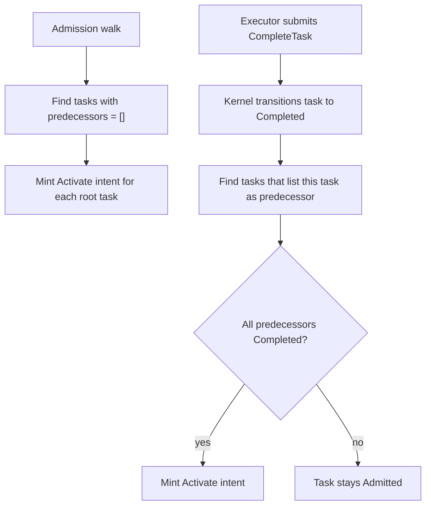

# `predecessors` — DAG dependencies

> **Topic:** Plan reference | **Time to read:** ~3 min | **Complexity:** ⭐⭐ Intermediate

`predecessors` declares the task-level DAG. A task with
`predecessors = []` activates immediately when the initiative
starts; a task with `predecessors = ["task_a"]` activates only
after `task_a` reaches `Completed`. The kernel enforces the order;
agents cannot bypass it via IPC.

---

## Field reference

| Field | Type | Required | Effect |
|---|---|---|---|
| `predecessors` | `Vec<String>` | yes (may be empty) | List of `task_name`s that MUST be satisfied before this task activates. Executors produce artifacts; Reviewers are gates over those artifacts; `workspace_merge` tasks materialize multi-predecessor fan-in. |

The plan-side field is named **`predecessors`** (verified against
`kernel/src/initiatives/lifecycle.rs::parse_plan_tasks`). Some
spec prose uses `depends_on` as an informal synonym; the kernel
parser only reads `predecessors`.

---

## What the kernel rejects at admission

| Pattern | Reason |
|---|---|
| `predecessors = ["self"]` (where `task_name = "self"`) | Self-loop. |
| `predecessors = ["a"]` and `predecessors of a includes self` | Cycle. |
| `predecessors = ["nonexistent"]` | Dangling reference. |
| `predecessors = ["dup", "dup"]` | Duplicate entries inside the list. |
| Reviewer with `predecessors = []` | Reviewers must review someone. |
| Reviewer's predecessor is a Reviewer (not an Executor) | Reviewers don't review Reviewers. |
| Executor with multiple predecessors and no `workspace_merge` task | RAXIS refuses to silently choose or synthesize a merged workspace. Add an explicit `task_kind = "workspace_merge"` fan-in task. |

`raxis plan validate` catches every one of these locally.

---

## Examples

### Linear chain

```toml
[[tasks]]
task_name      = "design"
session_agent_type = "Executor"
clone_strategy     = "blobless"
description        = "Design"
prompt             = """Complete Design according to this plan's acceptance criteria."""
predecessors = []

[[tasks]]
task_name      = "implement"
session_agent_type = "Executor"
clone_strategy     = "blobless"
description        = "Implement"
prompt             = """Complete Implement according to this plan's acceptance criteria."""
predecessors = ["design"]

[[tasks]]
task_name      = "test"
session_agent_type = "Executor"
clone_strategy     = "blobless"
description        = "Test"
prompt             = """Complete Test according to this plan's acceptance criteria."""
predecessors = ["implement"]
```

`design` runs first; `implement` activates after `design.Completed`;
`test` activates after `implement.Completed`.

### Fan-out + fan-in

```toml
[[tasks]]
task_name      = "shared_setup"
session_agent_type = "Executor"
clone_strategy     = "blobless"
description        = "Shared Setup"
prompt             = """Complete Shared Setup according to this plan's acceptance criteria."""
predecessors = []

[[tasks]]
task_name      = "frontend"
session_agent_type = "Executor"
clone_strategy     = "blobless"
description        = "Frontend"
prompt             = """Complete Frontend according to this plan's acceptance criteria."""
predecessors = ["shared_setup"]

[[tasks]]
task_name      = "backend"
session_agent_type = "Executor"
clone_strategy     = "blobless"
description        = "Backend"
prompt             = """Complete Backend according to this plan's acceptance criteria."""
predecessors = ["shared_setup"]

[[tasks]]
task_name      = "merge_frontend_backend"
task_kind      = "workspace_merge"
description    = "Merge Frontend and Backend"
predecessors   = ["frontend", "backend"]
on_conflict    = "orchestrator_then_operator"

[[tasks]]
task_name      = "integration_test"
session_agent_type = "Executor"
clone_strategy     = "blobless"
description        = "Integration Test"
prompt             = """Complete Integration Test against the merged frontend/backend workspace."""
predecessors = ["merge_frontend_backend"]
```

`merge_frontend_backend` activates only after BOTH `frontend` and
`backend` reach `Completed`. The kernel attempts to merge their
evaluation SHAs into one concrete workspace. If Git reports conflicts,
RAXIS preserves the conflicted worktree, opens a `MergeConflict`
escalation, and shows the operator commands:

```bash
raxis workspace-merge status <attempt_id>
cd <preserved-worktree>
git status
# resolve files, then git add ...
raxis workspace-merge submit <attempt_id>
```

`integration_test` sees the merged worktree result, not an arbitrary
single predecessor. This keeps fan-in deterministic and auditable.

For the first production slice, `orchestrator_then_operator` and
`operator_manual` both preserve conflicts for authenticated operator
resolution. The distinction remains in the signed plan so RAXIS can add
the bounded orchestrator-resolution attempt without changing the plan
shape. Use `on_conflict = "fail_closed"` only when a Git conflict should
terminate the merge task with no manual repair path.

### Panel review

```toml
[[tasks]]
task_name      = "implementer"
session_agent_type = "Executor"
clone_strategy     = "blobless"
description        = "Implementer"
prompt             = """Complete Implementer according to this plan's acceptance criteria."""
predecessors = []

[[tasks]]
task_name      = "reviewer_correctness"
session_agent_type = "Reviewer"
clone_strategy     = "blobless"
description        = "Reviewer Correctness"
prompt             = """Complete Reviewer Correctness according to this plan's acceptance criteria."""
predecessors = ["implementer"]

[[tasks]]
task_name      = "reviewer_style"
session_agent_type = "Reviewer"
clone_strategy     = "blobless"
description        = "Reviewer Style"
prompt             = """Complete Reviewer Style according to this plan's acceptance criteria."""
predecessors = ["implementer"]

[[tasks]]
task_name      = "reviewer_security"
session_agent_type = "Reviewer"
clone_strategy     = "blobless"
description        = "Reviewer Security"
prompt             = """Complete Reviewer Security according to this plan's acceptance criteria."""
predecessors = ["implementer"]
```

All three Reviewers activate in parallel after the Executor
completes. The kernel waits for all three before deciding the merge
verdict (logical-AND across `verdict`).

---

## How activation propagates



The same logic applies for Reviewer dependencies, except a Reviewer
"completes" only on `verdict = Approve`. A `Reject` keeps the
downstream tasks blocked; the kernel waits for the Executor to
re-submit (rejection retry loop) and the Reviewer to re-evaluate.

---

## Common failure modes

| Symptom | Fix |
|---|---|
| `FAIL_DAG_CYCLE` | Self-loops or cycles between two+ tasks. Inspect with `raxis plan validate`; the validator names the offending edge. |
| `FAIL_DAG_DANGLING_PREDECESSOR` | A predecessor task name doesn't exist in the plan. Spelling check. |
| `FAIL_DAG_DUPLICATE_PREDECESSOR` | List contains the same task name twice. Deduplicate. |
| Task never activates | Some predecessor is stuck (Failed, Aborted, BlockedRecoveryPending, or a workspace merge conflict). `raxis explain <task>` shows which predecessor is unsatisfied. |
| Reviewer activates and immediately rejects "no commit" | The predecessor Executor's `CompleteTask` was for a no-op (no diff). The Reviewer has nothing to review. |
| Workspace merge is waiting on conflicts | Run `raxis workspace-merge list`, inspect the attempt, resolve with Git, then `raxis workspace-merge submit <attempt_id>`. |

---

## Reference: relevant CLI

| Command | Purpose |
|---|---|
| `raxis plan validate <plan.toml>` | Catches every DAG constraint above. |
| `raxis explain <task_id>` | Decision tree explaining why a runtime task is in its current state, including unsatisfied predecessors. The dashboard shows the plan `task_name` next to the generated UUID. |
| `raxis queue` | DAG scheduler view: READY (Admitted+GatesPending) and BLOCKED (BlockedRecoveryPending). |
| `raxis workspace-merge list` | Lists open kernel-owned fan-in merge attempts. |
| `raxis workspace-merge status <attempt_id>` | Shows conflict paths and copyable Git/submit/reset commands. |
| `raxis log --kind PredecessorCompleted --since 1h` | Audit trail of dependency satisfaction. |

---

## Variations

- **Implicit serialisation.** A single chain
  (`A → B → C → D`) — each step inherits the previous step's
  worktree state via the Orchestrator's bundle hand-off.
- **Maximum parallelism.** Many tasks with `predecessors = []`
  activate at once, bounded by the lane's
  `max_concurrent_tasks`.
- **Conditional fan-in (V3).** Today, multi-predecessor is logical-AND
  only and must flow through `task_kind = "workspace_merge"` when a
  downstream Executor needs the combined workspace. "OR-style"
  predecessors (any one satisfies) and conditional predecessors (run
  only if X passed) are out of scope for V2.
