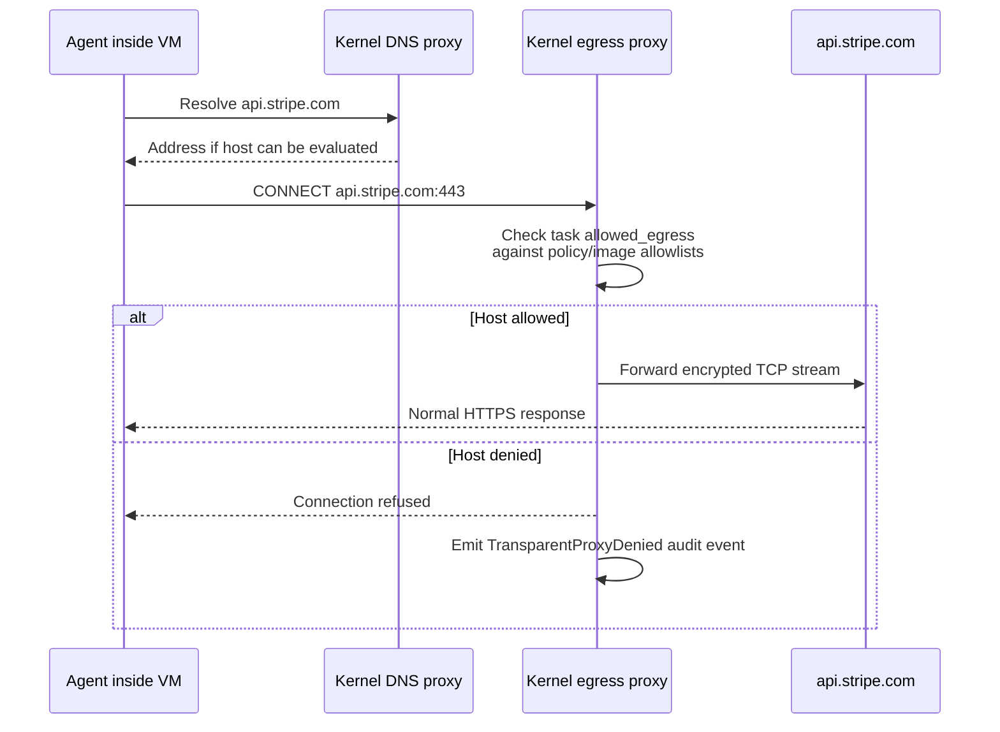

# `vm_image` + `allowed_egress` — per-task isolation knobs

> **Topic:** Plan reference | **Time to read:** ~3 min | **Complexity:** ⭐⭐ Intermediate

`vm_image` and `allowed_egress` are the two per-task knobs that
shape the VM the kernel boots. The first picks **which OCI image**
the VM runs from; the second **which hostnames** the egress proxy
will forward outbound traffic to.

---

## `vm_image` — pick a VM image alias

| Field | Type | Required | Effect |
|---|---|---|---|
| `vm_image` | `String` | optional | Alias matching a `[[vm_images]] name` in policy. Omit to fall back to `[default_executor_image] alias` (when set), or the kernel-canonical `raxis-executor-starter` image. |

### Constraints

- **Reviewers cannot declare `vm_image`.** The Reviewer image is
  kernel-canonical — `INV-PLANNER-HARNESS-02`. Setting it on a
  Reviewer task triggers `FAIL_REVIEWER_VM_IMAGE_NOT_ALLOWED` at
  admission.
- The alias must resolve to a `[[vm_images]]` entry whose
  `role_restriction` includes `"Executor"` (for an Executor task)
  or `"Verifier"` (for a verifier task).
- The image's `oci_digest` is re-resolved at every spawn — the
  kernel rejects a digest mismatch with `image_cache: digest mismatch`.

### Example — pin to a Rust toolchain image

```toml
[[tasks]]
task_id            = "rust-build"
session_agent_type = "Executor"
clone_strategy     = "blobless"
path_allowlist     = ["src/"]
vm_image           = "rust-toolchain-2026-05"
```

### Example — fall back to the default

```toml
[[tasks]]
task_id            = "node-build"
session_agent_type = "Executor"
clone_strategy     = "blobless"
path_allowlist     = ["src/"]
# vm_image OMITTED → uses [default_executor_image].alias
```

---

## `allowed_egress` — outbound network allowlist

| Field | Type | Required | Effect |
|---|---|---|---|
| `allowed_egress` | `Vec<String>` | optional | Per-task hostname allowlist. Each entry is an exact hostname or a host suffix (`api.example.com` matches that exact host; `.example.com` matches any subdomain). |

### Constraints

- The egress proxy denies any host not in the allowlist with
  `TransparentProxyDenied`.
- The allowlist must be a subset of:
  1. The image's `[[vm_images]] egress_allowlist` (if declared).
  2. The policy `[egress] domains` and `[egress] patterns`.
- **Reviewer VMs have no network device** (`INV-NETISO-01`); declaring
  `allowed_egress` on a Reviewer is a no-op and the kernel emits a
  warning at admission.

### Example — narrow allowlist for a build task

```toml
[[tasks]]
task_id            = "fetch-deps-and-build"
session_agent_type = "Executor"
clone_strategy     = "blobless"
path_allowlist     = ["src/", "Cargo.lock"]
allowed_egress     = [
  "static.crates.io",        # exact host
  "index.crates.io",
  ".docs.rs",                # any subdomain of docs.rs
]
```

### Example — egress-free (offline-only)

```toml
[[tasks]]
task_id            = "lint-only"
session_agent_type = "Executor"
clone_strategy     = "blobless"
path_allowlist     = ["src/"]
# allowed_egress OMITTED → no outbound network
```

The agent boots into a VM with the egress proxy denying every
hostname. Useful for cargo-clippy, eslint, formatters, and other
tools that work fully offline.

### Example — broad development allowlist

```toml
allowed_egress = [
  "registry.npmjs.org",
  ".npmjs.org",
  "static.crates.io",
  "index.crates.io",
  "pypi.org",
  ".pypi.org",
  "files.pythonhosted.org",
  "api.github.com",                # for GitHub-hosted actions
]
```

Use this shape for tasks that pull dependencies from public
registries.

---

## How egress is mediated



The kernel does NOT do TLS interception by default — it forwards
the encrypted stream after host validation. For credential
injection, declare a `[[tasks.credentials]]` proxy of `kind = "http"`
in the same task; the credential proxy sits *between* the agent and
the egress proxy and rewrites the request body / headers.

---

## Common failure modes

| Symptom | Fix |
|---|---|
| `FAIL_REVIEWER_VM_IMAGE_NOT_ALLOWED` | Remove `vm_image` from Reviewer tasks. |
| `FAIL_VM_IMAGE_NOT_DECLARED` | The alias doesn't match any `[[vm_images]]` entry. Spelling check; ensure the policy is signed and the kernel has advanced to that signed bundle. |
| `FAIL_VM_IMAGE_ROLE_NOT_PERMITTED` | The alias's `role_restriction` doesn't include `Executor` (or whatever role this task is). |
| `TransparentProxyDenied` audit events | Agent tried an egress not in the allowlist. Either add it (and bump the policy / image allowlists if needed) or fix the agent prompt. |
| `image_cache: digest mismatch` at spawn | The OCI registry served bytes whose SHA-256 doesn't match the pinned digest. Investigate — don't auto-update. |

---

## Reference

| Surface | Purpose |
|---|---|
| `[[vm_images]]` (policy) | Operator-published image registry. |
| `[default_executor_image] alias` (policy) | Per-install default for Executors. |
| `[egress] domains` + `[egress] patterns` (policy) | Per-install upper bound on egress allowlists. |
| `raxis log --kind TransparentProxyDenied --since 1h` | Audit denied egress. |
| `raxis log --kind ImagePulled` | Audit per-spawn image pulls (first activation only; cached thereafter). |

---

## Variations

- **Per-task image override.** Even with a default set in policy,
  `vm_image` per task wins. Useful when most tasks share a toolchain
  but one needs a special image.
- **Egress-tight Reviewers.** Don't declare `allowed_egress` on
  Reviewers — they have no network device anyway. Documenting it
  is fine; the kernel warns but admits.
- **Test infra hosts.** Add internal CI / artifact-server hosts to
  every Executor's `allowed_egress`. The narrower the better;
  prefer exact hostnames over `.example.com` suffixes.
