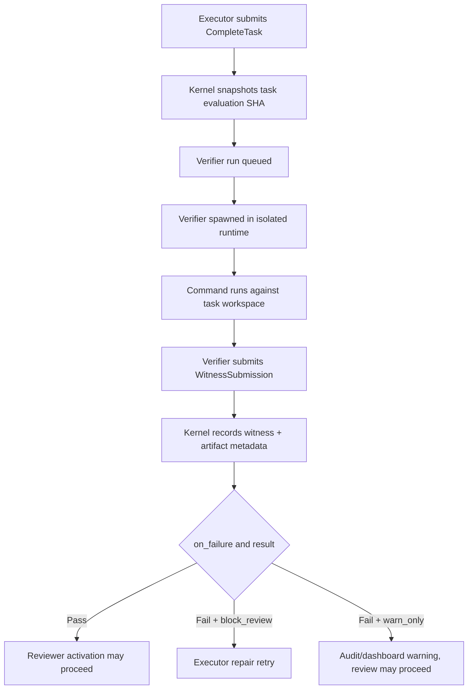

# `[[tasks.verifiers]]` — per-task verifier declarations

> **Topic:** Plan reference | **Time to read:** ~3 min | **Complexity:** Advanced

`[[tasks.verifiers]]` declares mechanical checks for one executor
task's output. The kernel runs these checks after the executor
submits `CompleteTask` and before downstream reviewer activation.

This is different from:

| Surface | Scope | Runs against | Typical use |
|---|---|---|---|
| `[[tasks.verifiers]]` | One task in `plan.toml` | That task's evaluation commit | Lint, unit tests, generated artifact checks |
| `[[plan.integration_merge_verifiers]]` | One initiative in `plan.toml` | Candidate merged tree | End-to-end tests for this plan |
| `[[integration_merge_verifiers]]` | Active `policy.toml` | Candidate merged tree | Operator-mandated global pre-merge checks |
| `[[gates]]` | Active `policy.toml` with selectors | Matching task/path/hook context | Policy invariants such as no secrets |

The block is optional. Tasks without verifiers can proceed from
executor completion into reviewer activation according to the DAG.

---

## Field Reference

Each `[[tasks.verifiers]]` block declares one verifier.

| Field | Type | Required | Effect |
|---|---|---|---|
| `name` | `String` | yes | Stable verifier id. Use lower snake case, e.g. `cargo_test` or `no_secret_strings`. If it corresponds to a policy gate, use the policy gate's `gate_type`. |
| `image` | `String` | yes | Verifier VM image alias, usually `raxis-verifier-starter` or a policy-published verifier image. |
| `command` | `String` | yes | Shell command run inside the verifier workspace. |
| `timeout` | `String` | yes | Wall-clock cap such as `"30s"`, `"10m"`, or `"1h"`. |
| `on_failure` | `String` | optional, default `"block_review"` | `block_review` prevents reviewer activation until repaired. `warn_only` records an audit/dashboard warning but does not block review. |
| `artifact` | `String` | optional | Verifier-produced artifact path. Must be under `/raxis/...`. |
| `artifact_max_bytes` | `u64` | optional | Maximum accepted artifact size. |
| `allowed_egress` | `Array<String>` | optional | Domains the verifier may reach when network is explicitly enabled by the verifier runtime. |
| `[tasks.verifiers.env]` | table | optional | Non-secret verifier environment. Keys starting with `RAXIS_` are reserved for kernel-injected values. |
| `[tasks.verifiers.hints]` | table | optional | Operator hints echoed into verifier/audit metadata. |

Legacy fields such as `gate_type`, `gate_on`, `timeout_ms`, and
`max_wall_seconds` are intentionally not part of the canonical
schema. Use `name`, `timeout`, and `on_failure`.

---

## Example — Cargo Test Before Review

```toml
[[tasks]]
task_name            = "implementer"
prompt             = """Complete Implementer according to this plan's acceptance criteria."""
session_agent_type = "Executor"
clone_strategy     = "blobless"
path_allowlist     = ["src/", "tests/"]
description        = "Add the new feature."

[[tasks.verifiers]]
name       = "cargo_test"
image      = "raxis-verifier-rust-starter"
command    = "cargo test --workspace --all-features --locked"
timeout    = "10m"
on_failure = "block_review"
artifact   = "/raxis/cargo-test.json"
```

If the verifier fails, the reviewer does not spawn. The kernel keeps
the task in `GatesPending`, records the non-pass witness, resolves an
operator-safe `agent_hint` from the verifier body or gate defaults, and
uses the existing gate-fixup retry path to hand concise repair feedback
back to the executor. The retry remains bounded by the task's retry
ceilings and the witness is visible in the dashboard before another
executor attempt starts.

## Example — Audit-Only Warning

```toml
[[tasks.verifiers]]
name       = "coverage_delta"
image      = "raxis-verifier-rust-starter"
command    = "raxis-verify-coverage --baseline-ref refs/heads/main"
timeout    = "20m"
on_failure = "warn_only"
artifact   = "/raxis/coverage.json"
```

`warn_only` is useful when the check should be visible in the audit
chain and dashboard but should not block reviewer activation.

## Example — Policy Gate Reference

If the active `policy.toml` declares:

```toml
[[gates]]
gate_type        = "NoSecretStrings"
verifier_command = "/opt/homebrew/bin/raxis-verifier-no-secrets"
satisfies        = ["NoSecretStrings"]
```

then the task verifier should use the same `name` when the plan wants
the task-level check to line up with the policy invariant:

```toml
[[tasks.verifiers]]
name       = "NoSecretStrings"
image      = "raxis-verifier-starter"
command    = "raxis-verifier-no-secrets"
timeout    = "30s"
on_failure = "block_review"
```

The dashboard Plan Builder surfaces active and draft policy gates as
selectable verifier names so this connection is visible while
authoring.

---

## Lifecycle



Every witness carries `initiative_id`, `task_id`, `evaluation_sha`,
verifier name, verifier run id, verifier identity, result class, and a
clear failure reason when the verifier provides one. The dashboard starts
from `verifier_run_tokens`, so it also shows no-witness terminal states:
`Pending -> Pass/Fail/Inconclusive`, or `SpawnFailed`, `ProcessFailed`,
`Timeout`, `ConfigInvalid`, `BudgetExhausted`, and `CapExceeded`. This
matters operationally: `Pending` means "still waiting"; the other states
mean the verifier lifecycle itself failed and the operator can debug the
spawn/runtime path directly.

The same source and hook labels are attached everywhere:

| Source | Hook | Meaning |
|---|---|---|
| `task_verifier` | `complete_task` | `[[tasks.verifiers]]` for one executor commit |
| `plan_integration_verifier` | `integration_merge` | `[[plan.integration_merge_verifiers]]` for this plan's candidate merged tree |
| `policy_integration_verifier` | `integration_merge` | `[[integration_merge_verifiers]]` from active `policy.toml` |
| `policy_gate` | `intent` or the gate hook | Operator policy gate verifier |

---

## Common Failure Modes

| Symptom | Fix |
|---|---|
| Verifier name does not appear connected to policy | Use the `gate_type` from `[[gates]]` as `[[tasks.verifiers]].name`, or keep it plan-local if it is not a policy invariant. |
| `timeout` rejected | Use duration strings such as `"30s"` or `"10m"`, not `timeout_ms`. |
| Artifact rejected | Keep artifacts under `/raxis/...` and set `artifact_max_bytes` when the output can be large. |
| Verifier cannot spawn | Check image alias, command availability, host capacity, and verifier runtime limits. The dashboard should show the spawn failure reason directly. |
| Verifier needs network | Prefer no network. If unavoidable, declare egress explicitly and ensure the runtime enforces it fail-closed. |
