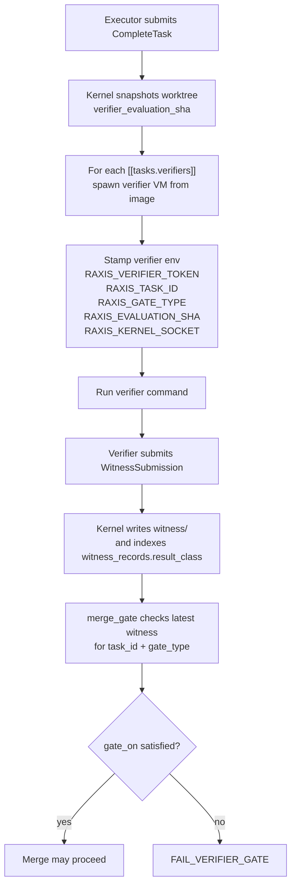

# `[[tasks.verifiers]]` — per-task verifier declarations

> **Topic:** Plan reference | **Time to read:** ~3 min | **Complexity:** ⭐⭐⭐ Advanced

`[[tasks.verifiers]]` declares mechanical verifiers the kernel runs
on a task's output. A verifier is a small image (e.g.,
`raxis-verifier-rust-starter`) that the kernel boots, runs against
the worktree, and listens for a `WitnessSubmission` over the
verifier socket. The witness is a content-addressed result the
merge can be gated on.

The block is **optional**. Tasks without verifiers complete based
on the agent's `CompleteTask` alone; tasks with verifiers wait for
each declared verifier to emit a witness before transitioning.

---

## Field reference

Each `[[tasks.verifiers]]` block declares one verifier.

| Field | Type | Required | Effect |
|---|---|---|---|
| `name` | `String` | yes | Verifier alias, must match a `[[gates]] gate_type` in policy or a kernel-canonical verifier (e.g. `raxis-verifier-symbol-index`). |
| `gate_type` | `String` | yes | Class label for the witness (`TestPass`, `LintClean`, `BuildOK`, `Coverage`, custom labels). The merge gate consults this. |
| `image` | `String` | optional | OCI image alias for the verifier VM. Falls back to the kernel-canonical starter for the language family. |
| `command` | `String` | optional | Command the verifier runs. Defaults to the image's entrypoint. |
| `max_wall_seconds` | `u32` | optional | Per-run wall-clock cap. Beyond this the kernel kills the verifier and emits an `Inconclusive` witness. |
| `gate_on` | `String` | optional, default `"Pass"` | Verdict the merge requires. One of `"Pass"` (verifier emitted Pass), `"PassOrInconclusive"` (Pass or Inconclusive — Fail still blocks), `"Always"` (the witness must exist regardless of verdict). |

---

## Example — cargo test gate

```toml
[[tasks]]
task_id            = "implementer"
session_agent_type = "Executor"
clone_strategy     = "blobless"
path_allowlist     = ["src/"]
description        = """Add the new feature."""

[[tasks.verifiers]]
name             = "cargo-test"
gate_type        = "TestPass"
image            = "raxis-verifier-rust-starter"
command          = "cargo test --workspace --all-features"
max_wall_seconds = 600
gate_on          = "Pass"
```

The kernel boots the rust-starter image, runs `cargo test` in the
worktree, and waits for a `WitnessSubmission`. The verifier
reports `Pass` if the test command exits 0, `Fail` otherwise.
`gate_on = "Pass"` means the merge waits for a Pass.

## Example — lint gate

```toml
[[tasks.verifiers]]
name      = "cargo-clippy"
gate_type = "LintClean"
image     = "raxis-verifier-rust-starter"
command   = "cargo clippy --workspace --all-features --all-targets -- -Dwarnings"
gate_on   = "Pass"
```

Lint failures block the merge; lint successes allow it.

## Example — coverage gate

```toml
[[tasks.verifiers]]
name             = "coverage-delta"
gate_type        = "Coverage"
image            = "raxis-verifier-rust-starter"
command          = "raxis-verify-coverage --baseline-ref refs/heads/main"
max_wall_seconds = 1800
gate_on          = "Pass"
```

The verifier emits a witness whose body includes the coverage
delta. The merge gate parses it; the operator's policy decides
what threshold counts as Pass.

## Example — symbol-index (kernel-canonical, auto-injected)

```toml
# Note: V2 auto-injects this verifier across the touched-set whenever
# a plan changes >1 file under any /src or /lib path. Operators
# rarely declare it explicitly. To DISABLE auto-injection (NOT
# recommended), declare a stub verifier with the same name and a
# no-op command.
```

---

## How a witness flows



---

## Witness verdicts

| `result_class` | Meaning |
|---|---|
| `Pass` | The check succeeded. |
| `Fail` | The check failed; merge blocked. |
| `Inconclusive` | The check could not run cleanly (verifier crashed, OOM, timeout). The kernel emits the witness with this class so the audit chain has the evidence; the gate's `gate_on` decides if Inconclusive blocks the merge. |

---

## Common failure modes

| Symptom | Fix |
|---|---|
| `FAIL_VERIFIER_NOT_DECLARED` | The `name` doesn't match any policy `[[gates]]` entry. Add the gate; re-sign policy. |
| `FAIL_VERIFIER_IMAGE_NOT_DECLARED` | `image` references a `[[vm_images]]` alias that doesn't exist. |
| Verifier runs but no witness submitted | The verifier crashed before connecting to `RAXIS_KERNEL_SOCKET`. Inspect `<data-dir>/runtime/verifier-<task>-<name>.log`. |
| `FAIL_VERIFIER_GATE` blocks merge | A verifier emitted `Fail`. Look at the witness body via `raxis witnesses <task> --gate <name>` to understand why. |
| Verifier hits `max_wall_seconds` | The `Inconclusive` class is emitted; merge depends on `gate_on`. Either raise the cap or fix the verifier's runtime. |

---

## Reference: relevant CLI + env (verifier-side)

| Surface | Purpose |
|---|---|
| `raxis witnesses <task_id> [--gate <name>] [--result Pass\|Fail\|Inconclusive]` | Inspect witnesses for one task. |
| `raxis verifiers` | List currently-running verifier subprocess tokens. |
| `RAXIS_VERIFIER_TOKEN` | Single-use token the verifier sends back in WitnessSubmission. |
| `RAXIS_TASK_ID` | Echoes into the witness for attribution. |
| `RAXIS_GATE_TYPE` | Echoes into the witness for gate matching. |
| `RAXIS_EVALUATION_SHA` | The kernel-snapshotted commit-ish the verifier ran against. |
| `RAXIS_KERNEL_SOCKET` | UDS the verifier connects to. |
| `RAXIS_WORKTREE_ROOT` | Worktree path provisioned for the verifier. |

---

## Variations

- **No verifiers.** Drop the block entirely; the task completes on
  agent `CompleteTask` alone.
- **Multiple verifiers per task.** List several
  `[[tasks.verifiers]]` blocks; all run in parallel; the merge
  waits for all of them.
- **Inconclusive-tolerant.** `gate_on = "PassOrInconclusive"` —
  useful for flaky verifiers (network-bound, slow infra) where
  occasional inconclusivity shouldn't block.
- **Always-on audit.** `gate_on = "Always"` — the merge requires
  the witness exists but doesn't care about verdict. Useful for
  pure-evidence gates (e.g., "record the SBOM" without blocking on
  it).
