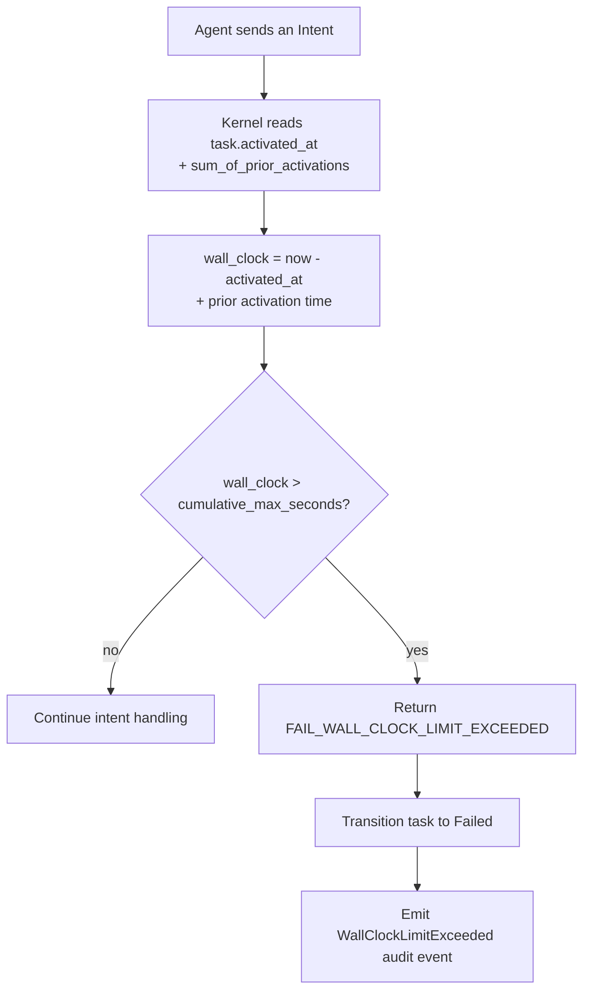

# `cumulative_max_seconds` — wall-clock cap

> **Topic:** Plan reference | **Time to read:** ~2 min | **Complexity:** ⭐ Beginner

`cumulative_max_seconds` caps the total wall-clock a task may run
before the kernel forcibly transitions it to `Failed` with
`FAIL_WALL_CLOCK_LIMIT_EXCEEDED`. It's a defence-in-depth knob:
runaway agents that loop or spin on a tool call eventually hit
this floor regardless of token caps or budget caps.

---

## Field reference

| Field | Type | Required | Default-ish | Effect |
|---|---|---|---|---|
| `cumulative_max_seconds` | `u32` | optional | (no cap) | Total wall-clock for the task across all activations / retries. The kernel checks at every IPC; once exceeded, the next IPC fails with `FAIL_WALL_CLOCK_LIMIT_EXCEEDED` and the task transitions to `Failed`. |

When omitted, the task has no wall-clock cap of its own. Other
caps (lane budget, token caps, host capacity) still apply, but
nothing kills the task on time alone.

---

## Examples

### Tight cap for trivial fixes

```toml
[[tasks]]
task_id                = "fix-typo"
prompt             = """Complete Fix Typo according to this plan's acceptance criteria."""
session_agent_type     = "Executor"
clone_strategy         = "blobless"
path_allowlist         = ["README.md"]
cumulative_max_seconds = 120        # 2 min
description            = """Fix the typo on line 14 of README.md."""
```

A typo fix shouldn't take longer than two minutes. If it does,
the agent is doing something wrong; the cap forces a fail-loud.

### Generous cap for long builds

```toml
[[tasks]]
task_id                = "rebuild-from-scratch"
description        = "Rebuild From Scratch"
prompt             = """Complete Rebuild From Scratch according to this plan's acceptance criteria."""
session_agent_type     = "Executor"
clone_strategy         = "full"
path_allowlist         = ["target/", "Cargo.lock"]
cumulative_max_seconds = 7200       # 2h
```

Building from scratch on a large repo can legitimately take an
hour; budget for it.

### Short cap for Reviewers

```toml
[[tasks]]
task_id                = "code-reviewer"
prompt             = """Complete Code Reviewer according to this plan's acceptance criteria."""
session_agent_type     = "Reviewer"
clone_strategy         = "blobless"
path_allowlist         = ["src/auth/"]
predecessors           = ["implementer"]
cumulative_max_seconds = 600        # 10 min
description            = """Review the auth handler."""
```

Reviewers don't need long; 10 minutes is plenty for most reviews,
and a short cap surfaces stuck Reviewers fast.

---

## How the cap is enforced



Notes:

- The cap is **cumulative**: a task that re-spawns after a crash
  still counts the previous activation's wall-clock against the
  total. (V2.5+ — once `RetrySubTask` re-spawn lands, the cap
  rolls forward correctly.)
- A task killed by this cap is `Failed`, not `Aborted` — the
  audit event distinguishes the two.
- The cap fires only at IPC boundaries; an agent that hangs
  silently inside the VM without IPC eventually hits the
  per-Intent timeout (separate, kernel-internal default 30s).

---

## Common failure modes

| Symptom | Fix |
|---|---|
| `FAIL_WALL_CLOCK_LIMIT_EXCEEDED` mid-task | The cap is too tight for legitimate work. Raise it. |
| Agent never finishes; cap never fires | The agent isn't sending IPCs (probably hung or stuck mid-tool-call). The per-Intent timeout will fire; if not, manual abort with `raxis task abort <id>`. |
| Cap fires but the task disappears immediately | `Failed` tasks are still inspectable via `raxis explain <task>` and `raxis log --task <id>`. Use them for forensics. |

---

## Reference: relevant CLI

| Command | Purpose |
|---|---|
| `raxis task abort <id>` | Manual abort — independent of `cumulative_max_seconds`. |
| `raxis explain <task_id>` | Decision-tree explanation including current wall-clock. |
| `raxis log --task <id> --kind WallClockLimitExceeded` | Audit the cap firing. |

---

## Variations

- **No cap.** Omit the field. Other caps still apply (lane budget,
  token caps). Useful when you genuinely don't know how long the
  task should take.
- **Aggressive cap.** Pair with high-quality verifiers and sharp
  descriptions; the agent has tight feedback loops and either
  finishes fast or gets killed.
- **Per-task differential.** Tight caps on Reviewers and trivial
  Executors; loose caps on long-running builds and migrations.
- **Combined with retry budgets (V2.6+).** Once
  `max_crash_retries` is parsed, a task that hits the wall-clock
  cap on one activation could be re-tried up to N times before
  Failed-permanent. Today the cap is single-shot.
