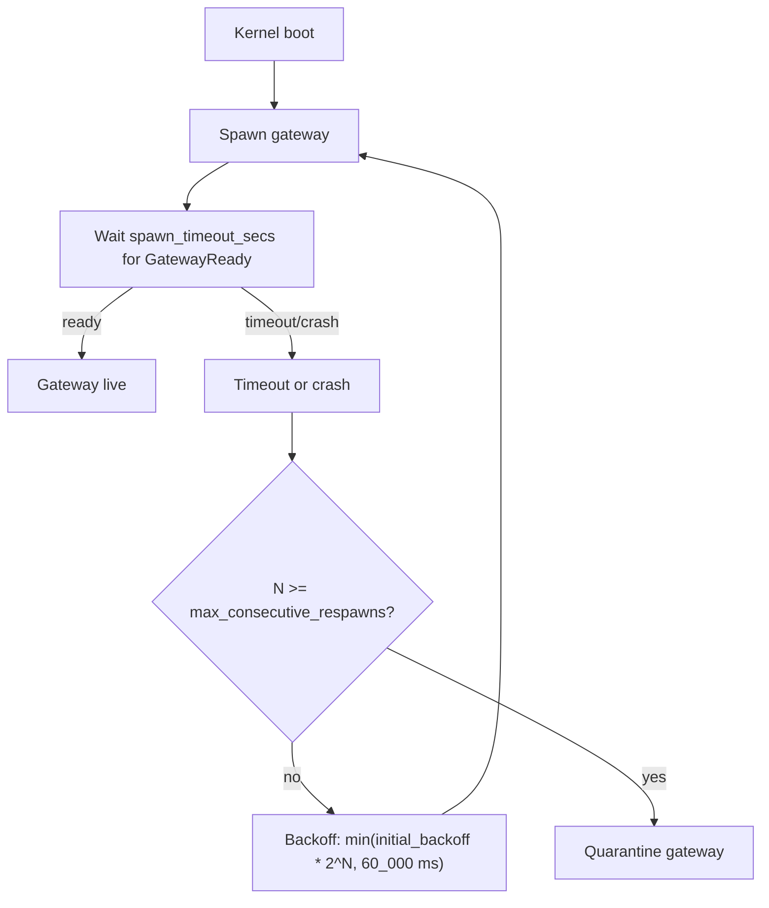

# `[gateway]` — gateway sidecar configuration

> **Topic:** Policy reference | **Time to read:** ~3 min | **Complexity:** ⭐⭐ Intermediate

The kernel auto-spawns a `raxis-gateway` subprocess to handle
inference and HTTP `fetch` requests. Direct VM-to-LLM-API traffic
is forbidden by `INV-NETISO-01`; everything goes through the gateway,
which the kernel supervises with a respawn loop. This block tells
the kernel **where the gateway binary lives** and how to handle
crashes.

The block is **optional**. Omitting it is legitimate for kernels
that never run inference (e.g., a verifier-only install). If
omitted, every `FetchRequest` returns
`error: "GatewayUnavailable"` and any `[[providers]]` entry that
needs the gateway is structurally invalid.

---

## Field reference

| Field | Type | Required | Default | Effect |
|---|---|---|---|---|
| `binary_path` | `String` | yes | — | Absolute path to the `raxis-gateway` binary. The kernel `Command::new(binary_path)` at boot. **Must be absolute** (validated at load) so PATH-based hijacks are impossible. |
| `spawn_timeout_secs` | `u64` | no | 5 | Maximum seconds to wait for `GatewayMessage::GatewayReady` after spawn. Beyond this the kernel terminates the child and treats it as a crash for the respawn loop. |
| `respawn_backoff_ms` | `u64` | no | 1000 | Initial back-off between respawn attempts. Doubles each consecutive crash up to a hard cap of 60 seconds. |
| `max_consecutive_respawns` | `u32` | no | 5 | After this many consecutive respawns within the back-off window, the kernel quarantines the gateway slot. No further respawns until kernel restart. |
| `planner_max_turns_default` | `u32` (optional) | no | unset (compiled fallback `100`) | V2.7 — org-wide default for `RAXIS_PLANNER_MAX_TURNS`. Per-task `[[tasks]] max_turns` always wins if set. See `INV-PLANNER-MAX-TURNS-PRECEDENCE-01` and `guides/recipes/env/11-planner-env-vars.md` "Resolving `RAXIS_PLANNER_MAX_TURNS`". |
| `planner_max_turns_step_default` | `u32` (optional) | no | unset (derived `max(round_up_to_5(base/2), 10)`) | V3 — org-wide default for the progressive-scaling step (`INV-PLANNER-MAX-TURNS-PROGRESSIVE-ON-RETRY-01`). Per-task `[[tasks]].max_turns_step` always wins if set. `0` is rejected by the resolver (a zero step degenerates progressive scaling to a constant budget). See `guides/recipes/env/11-planner-env-vars.md` "Progressive scaling on crash retry". |

---

## Example

```toml
[gateway]
binary_path                = "/usr/local/bin/raxis-gateway"
spawn_timeout_secs         = 5
respawn_backoff_ms         = 1000
max_consecutive_respawns   = 5
# planner_max_turns_default = 50    # optional V2.7 — org-wide cap; per-task overrides still win
# planner_max_turns_step_default = 25  # optional V3 — org-wide progressive-scaling step
```

Defaults are usually fine. Tighten only if you have specific
gateway behaviour you want to detect quickly:

```toml
[gateway]
binary_path              = "/opt/raxis/bin/raxis-gateway"
spawn_timeout_secs       = 2          # fail fast on startup hang
respawn_backoff_ms       = 500
max_consecutive_respawns = 3          # quarantine after 3 — restart kernel to recover
```

---

## Step-by-step — wiring up the gateway

```bash
# 1. Confirm the gateway binary is on disk + executable.
which raxis-gateway
ls -l "$(which raxis-gateway)"

# 2. Add the [gateway] block to policy.toml.
$EDITOR "$RAXIS_DATA_DIR/policy/policy.toml"

# 3. Re-sign.
raxis policy sign \
  "$RAXIS_DATA_DIR/policy/policy.toml" \
  --key "$RAXIS_OPERATOR_KEY"

# 4. Restart the kernel — the gateway supervisor wiring is boot-time
#    state, not an epoch-advance-only change. Ctrl-C the running
#    kernel, then:
raxis-kernel
# Watch for:
#   {"event":"GatewaySpawned","pid":N}
#   {"event":"GatewayReady","model":"…"}
```

---

## What the supervisor does



While the gateway is quarantined, every `FetchRequest` from
sessions returns:

```json
{"error": "GatewayUnavailable", "reason": "respawn cap exceeded"}
```

To recover, **restart the kernel** (the respawn counter resets at
boot). Investigate the gateway logs in
`<data-dir>/runtime/gateway.log` to find the underlying crash
cause.

---

## Common failure modes

| Symptom | Fix |
|---|---|
| `Validation: gateway.binary_path must be absolute` | Use `/full/path/to/raxis-gateway`, not `raxis-gateway` or `./raxis-gateway`. |
| `GatewaySpawnFailed: ENOENT` | The path doesn't exist. `which raxis-gateway` to find the real path. |
| Gateway respawn-loops endlessly | Configuration in `[[providers]]` is wrong (e.g. invalid pricing block) and the gateway crashes on startup. Inspect `<data-dir>/runtime/gateway.log`. Fix providers; restart kernel. |
| `GatewayUnavailable` after recent crash | Quarantine kicked in. Restart the kernel. |
| Hot-reload of `[gateway]` doesn't take effect | The supervisor is wired at boot. Restart the kernel after editing `[gateway]`. |

---

## Reference

| Surface | Purpose |
|---|---|
| `<data-dir>/runtime/gateway.log` | Gateway subprocess stdout/stderr. |
| `raxis providers status` | Per-provider circuit-breaker state — useful when the gateway is *up* but a specific provider is failing. |
| `raxis log --kind GatewayQuarantined` | Audit when the respawn cap was hit. |
| `raxis log --kind GatewayReady` | Audit every successful boot. |

---

## Variations

- **No gateway.** Omit the block. The kernel boots without
  inference; every `FetchRequest` errors. This is the right shape
  for a verifier-only install.
- **Patient mode.** `respawn_backoff_ms = 5000`,
  `max_consecutive_respawns = 100` — useful for environments where
  a gateway crash is expected (e.g. provider rate-limiting causes
  init-time errors that only resolve over time).
- **Dev tightness.** `respawn_backoff_ms = 100`,
  `max_consecutive_respawns = 2` — surfaces config bugs quickly
  during local development.
