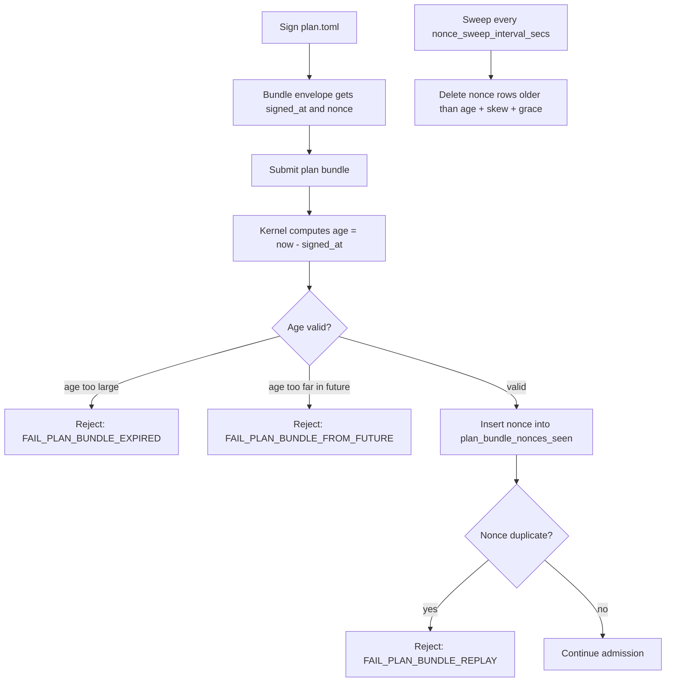

# `[plan_signing]` — plan-bundle freshness + nonce sweep

> **Topic:** Policy reference | **Time to read:** ~3 min | **Complexity:** ⭐⭐⭐ Advanced

`[plan_signing]` controls how the kernel evaluates the freshness
and replay-protection envelope on V2.1 plan bundles. Every signed
bundle carries a `signed_at_unix_secs` and a 256-bit nonce; the
kernel rejects bundles outside the freshness window
(`FAIL_PLAN_BUNDLE_EXPIRED` / `FAIL_PLAN_BUNDLE_FROM_FUTURE`) and
records observed nonces to detect replays. This block tunes the
sliding window and the nonce-table sweep cadence.

The block is **optional**. Omitting it falls through to spec
defaults (24h freshness, 5min skew tolerance, 1h grace, 1h sweep).

---

## Field reference

| Field | Type | Default | Effect |
|---|---|---|---|
| `max_plan_bundle_age_secs` | `u64` | 86400 (24h) | Hard ceiling: 30d. A bundle whose `now() - signed_at_unix_secs > this` is rejected with `FAIL_PLAN_BUNDLE_EXPIRED`. |
| `max_clock_skew_secs` | `u64` | 300 (5min) | A bundle whose `signed_at_unix_secs - now() > this` is rejected with `FAIL_PLAN_BUNDLE_FROM_FUTURE`. **Must be ≤ `max_plan_bundle_age_secs / 4`** (validated at policy load) to keep the freshness window from inverting. |
| `nonce_retention_grace_secs` | `u64` | 3600 (1h) | Sweep grace beyond `age + skew`. A nonce row is reaped once `now() - first_seen_at_unix_secs > age + skew + grace`. **Must be ≤ `max_plan_bundle_age_secs`** (a longer grace just stores dead rows). |
| `nonce_sweep_interval_secs` | `u64` | 3600 (1h) | Cadence on which the kernel runs the §8.4 sweep DELETE query. Hard floor: 1s. Hard ceiling: 24h. |
| `accept_unfresh_v2_0_bundles` | `bool` | `false` | Transitional knob: when `true`, accept legacy V2.0 schema-1 bundles that have no freshness envelope. **Operator-acknowledged legacy bypass.** |

---

## Why these defaults are good

- `max_plan_bundle_age_secs = 24h` covers most operator workflows
  (review-and-approve in a single working day).
- `max_clock_skew_secs = 5min` tolerates typical NTP drift without
  letting a clock-misset peer flood the nonce table with
  far-future bundles.
- `nonce_retention_grace_secs = 1h` ensures a slow operator path
  (e.g., bundle minted, then escalation back-and-forth, then
  approved) has slack before the nonce row could be reaped.
- `nonce_sweep_interval_secs = 1h` keeps the table size bounded
  without making the DELETE expensive.

---

## Example — tighter posture for high-trust deployments

```toml
[plan_signing]
max_plan_bundle_age_secs    = 3600       # 1 h freshness — sign and submit fast
max_clock_skew_secs         = 60         # 1 min skew tolerance
nonce_retention_grace_secs  = 600        # 10 min grace
nonce_sweep_interval_secs   = 600        # sweep every 10 min
accept_unfresh_v2_0_bundles = false
```

## Example — looser posture for batch / overnight work

```toml
[plan_signing]
max_plan_bundle_age_secs    = 604800     # 7 days
max_clock_skew_secs         = 600        # 10 min skew tolerance
nonce_retention_grace_secs  = 86400      # 1 day grace
nonce_sweep_interval_secs   = 14400      # sweep every 4 h
```

---

## What the lifecycle looks like



The sweep cutoff is the sum of the three knobs. Lowering any of
them shortens the row's life; the safest is to never go below
spec defaults.

---

## Common failure modes

| Symptom | Fix |
|---|---|
| `FAIL_PLAN_BUNDLE_EXPIRED` on every submit | The host clock is wrong, OR you signed too long ago. `date -u` to verify; re-sign and resubmit. |
| `FAIL_PLAN_BUNDLE_FROM_FUTURE` on every submit | The signing host's clock is ahead of the kernel host's. Fix NTP. |
| `FAIL_PLAN_BUNDLE_REPLAY` | The same bundle was already submitted; mint a new bundle. |
| `Validation: max_clock_skew_secs > max_plan_bundle_age_secs / 4` | The freshness window inverts under your skew tolerance. Lower skew or raise age. |
| `Validation: nonce_retention_grace_secs > max_plan_bundle_age_secs` | A grace longer than the window is meaningless. Lower grace. |
| Sweep never fires | `nonce_sweep_interval_secs` is too long; the table grows. Lower it; values down to 60s are safe. |

---

## Reference: relevant CLI + state

| Surface | Purpose |
|---|---|
| `raxis log --kind PlanBundleExpired --since 1h` | Audit rejected-too-old submissions. |
| `raxis log --kind PlanBundleReplay` | Audit replay attempts. |
| `raxis log --kind PlanBundleNoncesSwept` | Audit each sweep, including row counts removed. |
| `plan_bundle_nonces_seen` (kernel.db) | Internal table; use `raxis-cli` read-only commands instead of touching directly. |

---

## Variations

- **Disable replay protection (NOT recommended).** No way to do this
  cleanly — even raising `max_plan_bundle_age_secs` to 30d still
  enforces the nonce check. Don't try to disable it.
- **Pin to legacy clients (transitional).** If you have older
  clients that mint V2.0 schema-1 bundles, set
  `accept_unfresh_v2_0_bundles = true`. The kernel emits a
  `LegacyPlanBundleAccepted` audit event for every such admission.
  Migrate the clients; flip the flag back to `false`.
- **Aggressive sweep.** `nonce_sweep_interval_secs = 60` keeps the
  table at minimum size; cost is negligible (one SQL DELETE per
  minute).
