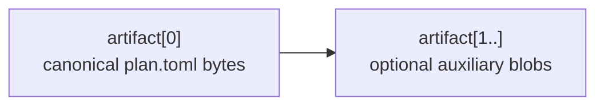

# `[plan_bundle_limits]` — plan-bundle size discipline

> **Topic:** Policy reference | **Time to read:** ~2 min | **Complexity:** ⭐⭐ Intermediate

`[plan_bundle_limits]` caps plan bundle sizes at admission time.
Both the CLI (`raxis submit plan`, locally) and the kernel
(`admission §7.3`) enforce these limits — a malformed monster
bundle is rejected without ever entering the `plan_bundle_artifacts`
table. The block is **optional**; omitting it falls through to
sensible defaults (1 MiB / 10 MiB / 200 artifacts).

---

## Field reference

| Field | Type | Default | Hard ceiling | Effect |
|---|---|---|---|---|
| `max_artifact_bytes` | `u64` | 1048576 (1 MiB) | 64 MiB | Cap on any single artifact. Includes `plan.toml` itself. |
| `max_bundle_bytes` | `u64` | 10485760 (10 MiB) | 128 MiB | Cap on the total bundle size summed over all artifacts. Canonical-encoding overhead (a few hundred bytes per artifact) is excluded. |
| `max_artifact_count` | `u32` | 200 | 1024 | Cap on `bundle.artifacts.len()`. `plan.toml` counts as one. |

### Coherence invariants (validated at policy load):

- `max_artifact_bytes ≤ max_bundle_bytes` (a single artifact can't
  exceed the bundle cap).
- `max_bundle_bytes ≥ 1` and `max_artifact_count ≥ 1`.

Failures map to `FAIL_POLICY_PLAN_BUNDLE_LIMIT_ABOVE_CEILING` at
policy load.

---

## Example — production tightness

```toml
[plan_bundle_limits]
max_artifact_bytes = 524288       # 512 KiB per artifact
max_bundle_bytes   = 2097152      # 2 MiB total
max_artifact_count = 50
```

Tight caps prevent operators from submitting megabyte plan files
that bloat `plan_bundle_artifacts` and slow admission.

## Example — relaxed caps (large generated bundles)

```toml
[plan_bundle_limits]
max_artifact_bytes = 16777216     # 16 MiB per artifact
max_bundle_bytes   = 67108864     # 64 MiB total
max_artifact_count = 500
```

Useful for plans that ship generated assets (e.g. seed corpora) as
auxiliary artifacts.

---

## What "an artifact" actually is

A V2.1 plan bundle has a structured shape:



The 200-artifact cap is generous because realistic V2 plans use 1–3
artifacts. Bumping it past 1024 is rejected at policy load to bound
the per-row cost in `plan_bundle_artifacts` (one INSERT per artifact
inside the admission tx).

---

## Inspecting a bundle before submission

```bash
# CLI-side preflight (no kernel needed):
raxis submit plan ./plan.toml --dry-run | jq '.bundle_size'
# {
#   "artifact_count":      1,
#   "max_artifact_bytes":  4321,
#   "total_bundle_bytes":  4537,
# }

# Compare against the limits:
raxis policy show \
  | sed -n '/^\[plan_bundle_limits\]$/,/^\[/p'
```

If your bundle is over a cap, the CLI exits non-zero before the
round-trip.

---

## Common failure modes

| Symptom | Fix |
|---|---|
| `FAIL_PLAN_BUNDLE_LIMIT_ARTIFACT_TOO_LARGE` | One artifact exceeds `max_artifact_bytes`. Either raise the cap (and re-sign policy) or shrink the artifact (move large blobs out-of-bundle). |
| `FAIL_PLAN_BUNDLE_LIMIT_BUNDLE_TOO_LARGE` | Total exceeds `max_bundle_bytes`. Same options. |
| `FAIL_PLAN_BUNDLE_LIMIT_TOO_MANY_ARTIFACTS` | `bundle.artifacts.len()` over `max_artifact_count`. Consolidate or raise the cap. |
| `FAIL_POLICY_PLAN_BUNDLE_LIMIT_ABOVE_CEILING` at policy load | A field exceeds its hard ceiling (64 MiB / 128 MiB / 1024). Don't try to raise above the hard ceilings; move data out-of-bundle. |
| Operators trying to commit binary blobs | Don't ship binaries in a plan bundle. Use a side-channel (object store, git LFS) and reference the SHA-256 from `plan.toml`. |

---

## Reference: relevant CLI

| Command | Purpose |
|---|---|
| `raxis submit plan <plan.toml> --dry-run` | CLI preflight: builds the bundle, checks limits, never sends to kernel. |
| `raxis initiative show <id> --bundle` | Lists every artifact in an admitted bundle, with byte sizes. |
| `raxis initiative show <id> --bundle --to <dir>` | Extracts every artifact under `<dir>` for forensic inspection. |
| `raxis log --kind PlanBundleLimitExceeded` | Audit every rejected-too-large submission. |

---

## Variations

- **Tight production policy.** Cap at 512 KiB per artifact, 2 MiB
  total, 50 artifacts. Anything bigger is almost certainly an
  operator mistake.
- **Generative pipelines.** If your plans legitimately ship large
  generated artifacts (corpora, fixtures), bump caps but stay
  under the hard ceiling. Otherwise consider moving bytes to a
  side-channel store and shipping a SHA-256 reference instead.
- **Don't disable.** There's no `0` / `unlimited` value; the
  caps always apply. The minimum sensible setting is the spec
  defaults.
