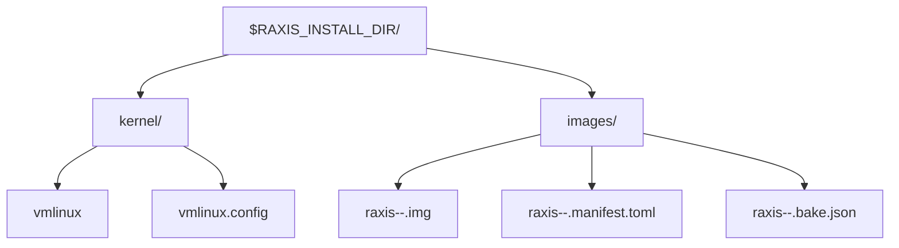

# RAXIS Images

This directory holds the source trees for the guest images that RAXIS
can bake locally:

| Role | Source dir |
| --- | --- |
| Orchestrator | `orchestrator-core/` |
| Reviewer | `reviewer-core/` |
| Executor starter | `executor-starter/` |
| Verifier starter | `verifier-starter/` |
| Symbol-index verifier | `verifier-symbol-index/` |

## Build

Use one command:

```bash
export RAXIS_INSTALL_DIR="$HOME/.raxis-install"
cargo xtask images bake --kernel-from-file /path/to/vmlinux --kernel-config /path/to/vmlinux.config
```

Common variants:

```bash
cargo xtask images bake --role reviewer
cargo xtask images bake --no-cache
cargo xtask images bake --builder podman
cargo xtask images bake --target x86_64-unknown-linux-musl
```

`bake` does the full flow: host preflight, guest-kernel staging and
config validation, rootfs build for roles that need OS tooling,
cross-compile, initramfs packing, manifest signing, and cache manifest
writing.

Outputs land under:



For release bundles, bake once per guest architecture. Apple Silicon
macOS and arm64 Linux consume the `aarch64-unknown-linux-musl` guest
bundle; Intel macOS and x86_64 Linux consume the
`x86_64-unknown-linux-musl` bundle.

## Cache Safety

The bake cache is intentionally conservative. A role is skipped only
when the previous `*.bake.json` matches:

- role source/build-tool fingerprint
- Containerfile and `manifest.toml`
- staged guest binary
- signing-key fingerprint
- guest `vmlinux`
- output image and signed manifest bytes

Use `--no-cache` when you want to prove the full pipeline still
reproduces from scratch.

## Signing Key

On first run, `bake` creates a per-clone dev keypair at:

```text
<workspace>/.git/info/raxis-signing-key/{sk.hex,pk.hex}
```

The private half signs image manifests. The public half is injected
into Cargo subprocesses spawned by the bake and is also readable by a
later host `raxis-kernel` build through the per-clone `pk.hex` file.

For release-profile local runs, pin the public key explicitly while
building the host daemon, then verify it:

```bash
RAXIS_KERNEL_SIGNING_KEY_HEX="$(cat .git/info/raxis-signing-key/pk.hex)" \
  cargo build --release -p raxis-kernel
cargo xtask images verify-trust-anchor --kernel target/release/raxis-kernel
```

## Troubleshooting

| Symptom | Fix |
| --- | --- |
| `no Linux guest-kernel binary` | Pass `--kernel-from-file <vmlinux>` or run `cargo xtask images dev-kernel --from-file <vmlinux> --config <.config> --force`. |
| guest-kernel config rejected | Rebuild the guest kernel with the fragment in `images/kernel/raxis-guest-a3-netfilter.config`. |
| stale output after source edits | Re-run `cargo xtask images bake --no-cache`; the normal cache also fingerprints source inputs and should invalidate automatically. |
| trust-anchor verification fails | Rebuild `raxis-kernel` from the same workspace with `RAXIS_KERNEL_SIGNING_KEY_HEX="$(cat .git/info/raxis-signing-key/pk.hex)"`, then rerun `images verify-trust-anchor`. |
