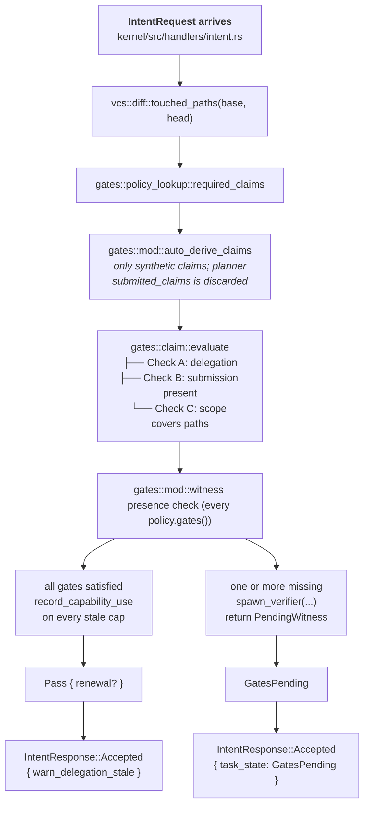

# RAXIS Claims & Gates — End-to-End Explained

> **Audience.** Operators wiring policy verifiers, contributors changing
> `kernel/src/gates/`, and reviewers auditing why the kernel accepted (or
> rejected) an intent. This guide is the operational complement to
> `specs/v1/kernel-core.md §gates`, `specs/v1/kernel-store.md §2.5.6`
> (`witness_records` DDL) and `specs/v1/kernel-store.md §2.5.7` (the
> **INV-08** opaque-rejection contract).
>
> **Authority.** Every behavioural claim in this doc is grounded in a
> citation to the actual implementation. When this doc disagrees with
> the code, the code wins and this doc is the bug.

---

## Why claims and gates exist

The agent is untrusted. Its prose is untrusted. Its file diff is
untrusted. The **only** thing the kernel trusts is what a
kernel-spawned verifier subprocess wrote into `witness_records` while
holding a kernel-issued single-use token.

A *claim* in RAXIS is shorthand for "for this `(task_id,
evaluation_sha, claim_type)` triple, a passing witness record exists."
A *gate* is the policy rule that says "for these touched paths, this
list of claim types must all be satisfied before any side effect is
admitted."

The kernel computes both halves of that equation independently of the
agent:

| Half | Who controls it | Where it lives |
|---|---|---|
| **Which claims are required** | Operator (`policy.toml`) + the kernel's git diff | `crates/policy/src/bundle.rs::PolicyBundle::claim_requirements`, `kernel/src/gates/policy_lookup.rs::required_claims`, `kernel/src/vcs/diff.rs` |
| **Whether a claim is satisfied** | Kernel + verifier subprocess | `kernel/src/gates/witness.rs::lookup`, `kernel/src/witness_index.rs` (write side) |

Neither half can be influenced by the agent. The agent's
`IntentRequest` carries a `submitted_claims` array on the wire but,
per the gap fix described below, the kernel **discards it entirely**
before evaluating the gate.

---

## Step 1 — Operator configures policy

Two TOML sections do the work:

```toml
# "Which paths require which proof types?" (canonical home: kernel-store.md §2.5.6)
[claim_requirements]
default_action = "deny"            # any path with no rule → kernel rejects with PolicyMisconfigured

[[claim_requirements.rules]]
path_glob   = "migrations/**"      # globbing per `crates/policy/src/bundle.rs::path_match`
claim_types = ["TestSuite"]

[[claim_requirements.rules]]
path_glob   = "src/**"
claim_types = ["WriteCode"]

# "How is each proof type produced?" (canonical home: kernel-store.md §2.5.6)
[[gates]]
gate_type        = "TestSuite"
verifier_command = "/usr/local/bin/run-tests.sh"
max_wall_seconds = 120
max_memory_bytes = 536870912        # 512 MiB
network_allowed  = false
```

The legal `claim_requirements.default_action` values are `permit` and
`deny`. The legal `claim_types` strings are user-defined — the only
constraint is that every name appearing in `claim_requirements` must
also appear as a `[[gates]].gate_type` (the spec linter
`xtask::spec_graph::check_audit_kind_classification` cross-checks
this).

After every edit, re-sign and bump the epoch:

```bash
raxis policy sign  "$RAXIS_DATA_DIR/policy/policy.toml" --key operator_private.pem
raxis epoch advance --policy "$RAXIS_DATA_DIR/policy/policy.toml" \
                    --sig    "$RAXIS_DATA_DIR/policy/policy.sig"
```

`epoch advance` runs `policy_manager::advance_epoch` (Phase 1 SQL +
Phase 2 in-memory `ArcSwap` + Phase 3 best-effort gateway signal —
**INV-POLICY-01** atomicity contract).

---

## Step 2 — Agent commits a change

The agent edits `migrations/0042_add_users.sql` and submits an
`IntentRequest { intent_kind: SingleCommit, base_sha, head_sha, … }`
to `planner.sock`. The connection arrives at
`kernel/src/handlers/intent.rs::handle` (the V1 spec named this file
`kernel/src/ipc/handlers/intent.rs`; in the current source tree the
`ipc/` prefix has been collapsed away — the `ipc::` module owns
*transport* and the `handlers::` module owns *intent semantics*).

---

## Step 3 — Kernel derives `touched_paths` independently

The diff is computed by the kernel, not asserted by the agent
(**INV-07**, **INV-TASK-PATH-01**, **INV-TASK-PATH-02** — see
`specs/invariants.md §7`):

```text
git -C "$worktree_root" diff --name-status --no-renames <base_sha>..<head_sha>
```

`kernel/src/vcs/diff.rs::touched_paths` parses the stdout into a
sorted, deduplicated list. The agent's `submitted_claims` field
(`crates/types/src/intent.rs` lines 248-251) is on the wire but plays
no role in this step. For `SingleCommit` an additional topology check
(`kernel/src/vcs/diff.rs::topology_check`) rejects merge commits in
the range — **INV-TASK-PATH-02** trailing-segment check applies the
same rule at `CompleteTask` time.

> **Why diff, not the agent's manifest?** A planner that lies about
> its scope can sneak `secrets/aws_creds.json` into a commit and
> declare `touched_paths = ["src/foo.rs"]`. Without VCS-derived
> paths, the gate set would be a function of the lie, not the
> commit. Per **INV-07** the agent's manifest is structurally
> ignored.

---

## Step 4 — Kernel maps paths → required claim types

```rust
// kernel/src/gates/policy_lookup.rs
pub fn required_claims(
    touched_paths: &[PathBuf],
    policy: &PolicyBundle,
) -> Result<Vec<ClaimType>, GateError>
```

Implementation: for each touched path, find the longest-matching
rule in `policy.claim_requirements.rules`; collect the union of
`claim_types`. If a path matches **no** rule and `default_action ==
"deny"`, return `Err(GateError::PolicyMisconfigured)` rather than a
silent `StrictDefault` claim. The
`StrictDefault` sentinel only ever appears for paths the operator
declared *but did not give a real claim to* — see Edge Case 4.

---

## Step 5 — Auto-derive claims from witness records

This is the **gap fix** described in `kernel/src/gates/mod.rs` lines
125-150. The original V1 design assumed the planner would actively
populate `submitted_claims` referencing witness blobs. In practice the
planner driver hardcodes `submitted_claims: vec![]` and has no
mechanism to discover which witnesses have landed. Rather than wire
planner-side claim awareness (which would ask the *untrusted* agent to
self-report), the kernel auto-synthesises claims from its own witness
records:

```rust
// kernel/src/gates/mod.rs Step 2.5 — verbatim
let mut effective_claims: Vec<SubmittedClaim> = Vec::new();

for req in &required_claims {
    let claim_type_str = req.as_str();
    if claim_type_str == "StrictDefault" {
        continue; // No witness can satisfy StrictDefault — handled by claim::evaluate
    }

    let witness = witness::lookup(evaluation_sha, task_id, claim_type_str, None, store)?;
    if let Some(ref rec) = witness {
        if rec.result_class == ResultClass::Pass {
            effective_claims.push(SubmittedClaim {
                claim_type: claim_type_str.to_owned(),
                evidence_ref: Some(rec.blob_sha256.clone()),
            });
        }
    }
}
```

> **Important.** Planner-submitted claims are **intentionally
> discarded.** The kernel is the sole claim source — the agent has
> zero influence on the claim pipeline. Earlier drafts of this doc
> said "auto-derived **and** planner-submitted claims become
> effective_claims." That is wrong; only the auto-derived synthetic
> claims are passed to `claim::evaluate`. The wire field exists for
> back-compat and is silently ignored. Pin: `kernel/src/gates/mod.rs`
> test `planner_submitted_claims_are_discarded` (line 462).

This is strictly more secure than planner-submitted claims:

- The witness is kernel-verified (single-use `verifier_run_token` +
  blob SHA-256 — `kernel/src/authority/verifier_token.rs`).
- The planner cannot fabricate a passing witness — it cannot write to
  `witness_records` because it has no path to the kernel's writer
  (only `kernel/src/handlers/witness.rs::handle` does, and that path
  consumes the verifier's single-use token before accepting the
  blob).
- Asking the planner is redundant — the kernel already has the data.

---

## Step 6 — Claim evaluation

```rust
// kernel/src/gates/claim.rs
pub fn evaluate(
    session_id:       &SessionId,
    required:         &[ClaimType],
    submitted:        &[SubmittedClaim],
    touched_paths:    &[PathBuf],
    policy:           &PolicyBundle,
    store:            &Store,
) -> Result<ClaimCheckResult, GateError>
```

For each `required` claim type, the function performs three checks:

### Check A — Delegation

```rust
authority::delegation::check_capability(session_id, &capability, store)
    -> DelegationStatus
```

`DelegationStatus` is one of:

| Variant | Meaning | Effect |
|---|---|---|
| `Active` | Operator granted; TTL not expired | Proceed |
| `StaleOnNextUse` | Policy epoch advanced; one grace use remaining | Proceed but mark `delegate_renewal_required = true`; the planner sees `warn_delegation_stale = true` on its `IntentResponse::Accepted` |
| `Expired` | TTL elapsed | **Reject** with `ClaimCheckResult::DelegationInsufficient { claim_type }` |
| `RenewalRequired` | Already used the grace under `StaleOnNextUse` | **Reject** |
| `NotGranted` | No row exists | **Reject** |

A delegation is the operator's signed permission slip — see
`raxis-concepts/04-delegations-and-authority.md`. The agent cannot
mint one because it does not hold the operator's Ed25519 signing key
(**INV-CERT-03**).

### Check B — Submission

The claim type must appear in `submitted` (which, per Step 5, only
contains kernel-auto-derived synthetic claims). If the type is
required but not in `submitted`, the kernel returns
`ClaimCheckResult::Insufficient { failing_claims }`. The planner-API
mapping (`crates/types/src/error.rs::PlannerErrorCode`) collapses this
to `FAIL_MISSING_WITNESS` — **INV-08** opacity is preserved.

### Check C — Scope

For each submitted claim, the kernel computes whether
`evidence_ref` covers every path in `touched_paths`. For
auto-derived claims `evidence_ref` is the witness blob SHA-256, which
covers all paths the verifier was asked about. For
operator-supplied delegations the check uses the delegation's
`scope_json.paths`. Mismatches return
`ClaimCheckResult::ScopeInsufficient { claim_type, uncovered_paths }`.

If all three checks pass for every required claim,
`ClaimCheckResult::Sufficient` (or `SufficientStale` if any
delegation was on its grace use) is returned.

---

## Step 7 — Witness presence check

Even after Steps 5/6 pass, the kernel double-checks that **every**
gate type configured in policy (not just those auto-derived) has a
satisfying witness for this `(evaluation_sha, task_id)`:

```rust
// kernel/src/gates/mod.rs lines 214-235 — verbatim
let gate_types: Vec<String> = policy.gates().iter().map(|g| g.gate_type.clone()).collect();
let mut missing_gates: Vec<String> = Vec::new();

for gate_type in &gate_types {
    let record = witness::lookup(evaluation_sha, task_id, gate_type, None, store)?;
    let satisfied = matches!(record, Some(r) if r.result_class == ResultClass::Pass);
    if !satisfied {
        missing_gates.push(gate_type.clone());
    }
}
```

When `missing_gates` is non-empty, the kernel **spawns a verifier
subprocess for each missing gate**:

```rust
verifier_runner::spawn_verifier(
    task_id, gate_type, evaluation_sha, worktree_root, &vconfig, store
)
```

The verifier:

1. Reads `RAXIS_VERIFIER_RUN_TOKEN`, `RAXIS_HEAD_COMMIT_SHA`, etc.
   from its environment (`crates/types/src/planner_env.rs`,
   `kernel/src/gates/verifier_runner.rs`).
2. Runs the operator-supplied `verifier_command` against the
   worktree at `evaluation_sha`.
3. Writes `WitnessSubmission` back to `planner.sock` (re-using the
   planner socket — there is no separate `witness.sock` in V1; the
   dispatcher routes by message variant, per
   `kernel-store.md §2.5.5`).
4. The kernel's `kernel/src/handlers/witness.rs::handle` consumes
   the `verifier_run_token` (single-use,
   `kernel/src/authority/verifier_token.rs::consume_verifier_token_in_tx`),
   inserts a row into `witness_records`, and replies
   `WitnessAck::Accepted { verifier_run_id, remaining_gates }`.

The original intent stays in `GatesPending` until the witness arrives
or the verifier-token TTL elapses (whereupon the task transitions to
`Aborted { reason: WitnessTimeout }` — chaos drill in
`philosophy.md §1.3`).

---

## The full pipeline (visual)



---

## Edge cases

### 1. Agent claims `submitted_claims: [{ claim_type: "TestSuite" }]` without a witness

Whatever the agent submits is discarded at Step 5. The kernel checks
its own `witness_records`; if nothing is there, no synthetic claim is
auto-derived; Check B fails with `Insufficient`; the planner sees
`FAIL_MISSING_WITNESS`. Spawn-verifier fires (Step 7) and the task
sits in `GatesPending` until the verifier reports back. The agent
cannot bypass the verifier by lying.

### 2. Agent submits a claim type that doesn't exist in policy

`policy_lookup::required_claims` is computed from `touched_paths`
alone; the agent's claim list cannot widen (or narrow) it. Extra,
unrequested claims in the wire field are ignored.

### 3. No `claim_requirements` rules + `default_action = "permit"`

`required_claims` returns `Vec::new()`. If `policy.gates()` is also
empty the fast path at `gates/mod.rs` line 121 returns `Pass`
immediately. No verifier is spawned. **This is the only way to admit
without a witness.** Use sparingly — it defeats the entire gate
system.

### 4. `default_action = "deny"` + a path matches no rule

`required_claims` injects the sentinel `StrictDefault` claim type for
that path. Step 5 *skips* `StrictDefault` (no witness can satisfy it
— pin: `gates/mod.rs::strict_default_never_auto_derived` test, line
530). Check B at Step 6 then fails with `Insufficient`. The intent is
rejected. Operator must add a matching `[[claim_requirements.rules]]`
entry, re-sign, advance the epoch.

### 5. Verifier binary crashes / times out

The kernel's `verifier_runner.rs` enforces `max_wall_seconds` and
`max_memory_bytes` via `RLIMIT_*` plus a tokio timeout. On timeout
the subprocess is `SIGKILL`'d; no witness is written; the task stays
`GatesPending` until the **verifier-token TTL** (separate, longer)
expires. At that point `recovery::expire_orphan_verifier_tokens`
sweeps the token and the task transitions to
`Aborted { reason: WitnessTimeout }` per the chaos drill spec.

### 6. Verifier returns `Fail`

A row is written with `result_class = Fail`; auto-derivation at Step
5 *requires* `Pass` (see `gates/mod.rs::failing_witness_does_not_auto_derive`
test). The synthetic claim is never injected; the gate stays missing;
the agent must fix the code, submit a new `SingleCommit` (which
changes `evaluation_sha`), and the kernel spawns a fresh verifier
run. Old `Fail` records are kept for forensic replay (**INV-05**)
but never re-considered.

### 7. Break-glass

`kernel/src/gates/mod.rs` Step 1 checks for an active break-glass
record. **As of HEAD this branch is hardcoded to `false`**:

```rust
// kernel/src/gates/mod.rs:111-115 — verbatim
// v1 Tier 4 not yet implemented — breakglass always Inactive.
let breakglass_active = false;
if breakglass_active {
    return Ok(GateEvalResult::BreakglassPass { activation_id: String::new() });
}
```

The dual-operator break-glass ceremony described in older drafts of
this doc (`raxis breakglass activate --justification "production
down"`) is **not yet wired**. The CLI scaffolding exists but the
kernel-side activation table is V2.6+ scope. Operators needing an
emergency widening today must use `raxis epoch advance` with a
loosened policy or `raxis escalation approve`.

---

## Wire-up checklist for a new gate

1. Pick a gate type name (`SecScan`, `LicenseCheck`, …).
2. Pick a verifier binary that exits 0 on pass, non-zero on fail, and
   that writes `WitnessSubmission` to the path named by
   `RAXIS_KERNEL_SOCKET` (V1 — see `crates/verifier-stub/` for a
   reference implementation).
3. Add `[[gates]]` and matching `[[claim_requirements.rules]]` to
   `policy.toml`.
4. `raxis policy sign && raxis epoch advance`.
5. Watch the audit chain: every verifier run emits `VerifierSpawned`
   and `WitnessAccepted` (or `WitnessRejected`). Tail with `raxis log
   --kind WitnessAccepted`.

---

## Key source files (verified against current HEAD)

| File | Role |
|---|---|
| `kernel/src/gates/mod.rs` | Entry point: `evaluate_claims()` + Step 2.5 auto-derivation |
| `kernel/src/gates/claim.rs` | `evaluate()` — delegation + submission + scope (returns `ClaimCheckResult`) |
| `kernel/src/gates/policy_lookup.rs` | `required_claims()` — paths → claim types via glob match |
| `kernel/src/gates/witness.rs` | Read-side `lookup()` over `witness_records` |
| `kernel/src/gates/verifier_runner.rs` | `spawn_verifier()` + run-token issuance + rlimit setup |
| `kernel/src/witness_index.rs` | Write-side: blob FS + SQL index facade (`ipc/handlers/witness.rs` is the only writer) |
| `kernel/src/handlers/witness.rs` | Verifier-side `WitnessSubmission` ingestion (consumes single-use token) |
| `kernel/src/authority/verifier_token.rs` | `issue_verifier_token` / `consume_verifier_token` |
| `kernel/src/authority/delegation.rs` | `check_capability`, `record_capability_use`, `mark_stale_on_epoch_advance` |
| `crates/policy/src/bundle.rs` | `PolicyBundle::claim_requirements`, `PolicyBundle::gates`, `PolicyBundle::path_match` |
| `crates/types/src/intent.rs` | `SubmittedClaim`, `IntentRequest` (note: `submitted_claims` is on the wire but discarded by the kernel) |

> **Path drift watch.** Older drafts of this doc cited
> `kernel/src/ipc/handlers/intent.rs` and `kernel/src/ipc/handlers/witness.rs`.
> The current source tree has the `ipc/` prefix collapsed away — the
> dispatcher (`kernel/src/ipc/server.rs::accept_planner_loop`) lives
> under `ipc/`, but the per-message handlers
> (`kernel/src/handlers/{intent,witness,escalation}.rs`) are at the
> top level of `kernel/src/`. If you find yourself reading a doc that
> still cites `kernel/src/ipc/handlers/...`, it's stale; treat the
> path here as authoritative.
