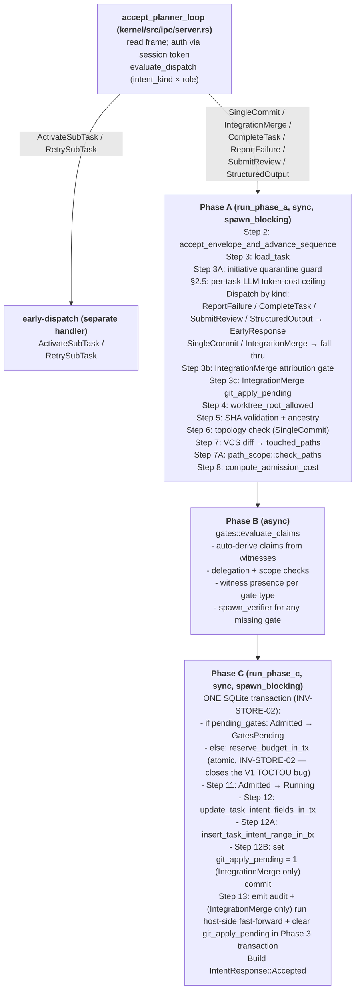

# RAXIS Intent Admission — End-to-End Explained

> **Audience.** Anyone reading or modifying `kernel/src/handlers/intent.rs`,
> writing planners that submit `IntentRequest`s, or auditing why the
> kernel admitted (or rejected) a particular request.
>
> **Authority.** The pipeline described here is what the code does
> today (see `kernel/src/handlers/intent.rs` — ~4,700 lines). When the
> code and this doc disagree, the code wins and this doc is the bug.
> File-line citations below are pinned to lines in the current source
> tree.

---

## What is an intent?

An intent is the **only way an AI agent can act**. There is no side
channel — no shared filesystem write to a "command" directory, no
HTTP callback, no `kill -USR1`. Every agent action — committing
code, completing a task, reporting failure, asking the orchestrator
for a sub-task — is an `IntentRequest` over the planner UDS socket
(V1) or VSock (V2 microVM mode). The kernel either admits the
request, in which case the side effect proceeds, or rejects it with
an opaque coarse code (**INV-08**).

The intent admission pipeline is the kernel's authority chokepoint.
Every invariant in `specs/invariants.md` is enforced by exactly one
pass through this pipeline, or it is not enforced at all.

---

## The eight `IntentKind` variants

Defined in `crates/types/src/intent.rs` lines 26-93.

| Intent Kind | Allowed agents | Purpose | SHA range required |
|---|---|---|---|
| `SingleCommit` | Executor | One non-merge commit on top of `base_sha` | yes |
| `IntegrationMerge` | Orchestrator | Merge commit that integrates Executors' branches into `target_ref` | yes |
| `CompleteTask` | Executor / Reviewer | Assert task is done — triggers gate-closure check | yes |
| `ReportFailure` | Any role | Self-report inability to complete (with `justification`) | no |
| `ActivateSubTask` | Orchestrator only | Spawn a sub-task (Executor or Reviewer) | no |
| `RetrySubTask` | Orchestrator only | Re-activate a previously failed sub-task | no |
| `SubmitReview` | Reviewer only | Approve or reject a peer Executor's commits | yes |
| `StructuredOutput` | Executor / Orchestrator | Mid-session typed output (non-terminal — task stays `Running`) | no |

**Role enforcement.** The `(intent_kind, session_agent_type)` pair
must be admitted by the static dispatch matrix before Phase A even
runs. The matrix lives in `kernel/src/authority/dispatch_matrix.rs`
and is enumerated in `v2-deep-spec.md §Step 20`. The matrix is hard-
coded — no policy edit can widen it.

---

## Pipeline overview

The handler is split into three phases bracketing the gate
evaluation. Phases A and C are sync and run inside
`tokio::task::spawn_blocking` so the SQLite mutex
(`raxis_store::Store::lock_sync`) does not block the tokio runtime.
Phase B is async (it spawns verifier subprocesses).



The detailed step numbers and their canonical homes:

| Step | What | Code path | Canonical spec |
|---|---|---|---|
| 1 | Auth (session token + sequence + nonce) | `kernel/src/ipc/auth.rs` + `authority::session::accept_envelope_and_advance_sequence` | `kernel-store.md §2.5.1 Table 16` (INV-01 atomicity) |
| 2 | INV-01: atomic seq+nonce check | `authority::session::accept_envelope_and_advance_sequence` | INV-01 |
| 3 | Load task row | `intent::load_task` | `kernel-core.md §intent` |
| 3A | Initiative quarantine guard | `views::initiative_quarantines::is_quarantined_rw` | `kernel-store.md §2.5.10` |
| 3b | IntegrationMerge attribution gate | `handlers::integration_merge_attribution::verify_merge_conflict_resolution` | `integration-merge.md §7` (V2 Step 30) |
| 3c | IntegrationMerge `git_apply_pending` pre-flight | reads `initiatives.git_apply_pending` | `integration-merge.md §11.1` (V2.5) |
| 4 | `worktree_root_allowed` | `policy.worktree_root_allowed` | `kernel-store.md §2.5.5` |
| 5 | SHA range + ancestry | `domain.is_ancestor` | `kernel-store.md §2.5.8 step 1` |
| 6 | Topology check (SingleCommit) | `domain.topology_check` | `kernel-store.md §2.5.8 step 2A` (INV-TASK-PATH-02) |
| 7 | VCS diff → `touched_paths` | `domain.compute_touched_paths` | `kernel-core.md §vcs/diff.rs` (INV-07) |
| 7A | Path-scope coverage check | `path_scope::check_paths` / `check_paths_hybrid` | INV-TASK-PATH-01 |
| 8 | Compute admission cost | `scheduler::budget::compute_admission_cost` | INV-02A |
| 9 | Gate evaluation (Phase B) | `gates::evaluate_claims` | `01-claims-and-gates.md` |
| 10 | Atomic budget reservation | `scheduler::budget::reserve_budget_in_tx` | INV-STORE-02 (TOCTOU fix) |
| 11 | FSM transition | `task_transitions::transition_task_in_tx` | INV-INIT-04 |
| 12 | Update intent fields | `update_task_intent_fields_in_tx` | INV-TASK-PATH-02 substrate |
| 12A | Record intent range | `insert_task_intent_range_in_tx` | INV-TASK-PATH-02 substrate |
| 12B | Set `git_apply_pending = 1` | `views::initiatives::set_git_apply_pending` | `integration-merge.md §11.1` |
| 13 | Audit emit + (IntegrationMerge) host-side fast-forward + clear pending | `commit_merge_to_target_ref` + post-commit emit | `integration-merge.md §11.1` |

That is fourteen ordered checks (Steps 2-12B, plus 13 in two
sub-steps), not 13. Earlier drafts of this doc claimed "13 steps" and
listed only 9 — both numbers were wrong; this doc supersedes them.

---

## Phase A in detail

### Step 2 — Atomic envelope acceptance

**INV-01 enforcement.** Sequence-number monotonicity and nonce dedup
are checked **inside the same SQLite transaction** that advances
`sessions.last_accepted_sequence` and inserts into `nonce_cache`.
Either both happen or neither. The kernel never advances the sequence
without writing the nonce row, and never writes a nonce without
advancing the sequence.

```rust
// kernel/src/handlers/intent.rs:379-400 — verbatim
if let Err(reason) = authority::session::accept_envelope_and_advance_sequence(
    &session_id, presented_seq_i64, &req.envelope_nonce, store,
) {
    let _ = ctx.audit.emit(
        AuditEventKind::ReplayRejected { session_id: …, sequence_num: seq, reason: … },
        Some(session_id.as_str()), None, None,
    );
    return PreGateOutcome::Reject(PlannerErrorCode::Unauthorized, TaskState::Admitted);
}
```

Every replay reason (`SequenceMismatch`, `NonceCollision`,
`SessionNotFound`, `ExpiredOrRevoked`) maps to
`PlannerErrorCode::Unauthorized` on the wire — **INV-08** opacity.
The structured reason lands in `AuditEventKind::ReplayRejected` for
operator-side forensic analysis only.

### Step 3 — Load task row

Reads `task_id`, `state`, `lane_id`, `initiative_id`,
`session_id`, `cumulative_token_cost_micros`, etc. from the `tasks`
table. Only `Admitted` and `Running` tasks accept new intents
(line 411-417). Anything else (`GatesPending`, `Completed`, `Failed`,
`Aborted`, `Cancelled`, `BlockedRecoveryPending`) returns
`FailTaskNotRunning` carrying the actual current state — the planner
uses that to decide retry vs give-up.

### Step 3A — Initiative quarantine

Reads `initiative_quarantines` (Table 21). If a row exists,
**every** intent against tasks under that initiative is rejected with
`FailInitiativeQuarantined`. In-flight tasks are NOT aborted by
quarantine — quarantine is a curtain, not a guillotine
(**INV-INIT-10**). Read errors fail closed (treat as quarantined).

### V2 §2.5 — Per-task LLM token-cost ceiling

The agent's `IntentRequest::tokens_used` carries the cumulative
`(input, output, cache_read, cache_creation)` token counts since the
session started. The kernel:

1. Computes the dollar cost via the policy's worst-of-N LLM pricing
   (`scheduler::budget::cost_micros_for_tokens`).
2. Compares to `policy.max_cost_per_task` (USD cents → micros).
3. **Rejects** with `FailPolicyViolation` if over.
4. Persists the new running total on the task row (fire-and-forget
   — the next intent re-checks).

This gate is per-**task**; the per-**lane** limit is enforced at
Step 10. See `raxis-concepts/05-lanes-and-budgets.md`.

### Early-dispatch branches

Four intent kinds short-circuit Phase A and never reach Phase B/C:

- **`ReportFailure`** — `handle_report_failure` transitions the task
  to `Failed` with the planner-supplied `justification` (max 2048
  chars).
- **`CompleteTask`** — `handle_complete_task` runs the
  **INV-TASK-PATH-02** trailing-segment check, the
  `evaluate_terminal_criteria` initiative-state evaluator, and the
  `finalize_task` writeback.
- **`SubmitReview`** — `handle_submit_review` writes the verdict on
  the Reviewer's `subtask_activations` row, runs the reverse-DAG
  query to decide whether all peer reviewers have approved, and (if
  so) marks the parent Executor's `subtask_activations` row
  `Completed`.
- **`StructuredOutput`** — `handle_structured_output` validates the
  payload against the operator-declared schema, persists, and
  returns. The task stays in its current state — this intent is
  non-terminal.

### Step 3b/3c — IntegrationMerge gates

`IntegrationMerge` is the orchestrator's commit-shaped intent. It has
two extra gates before path derivation:

- **3b** (V2 Step 30): if `resolved_via_escalation = Some(escalation_id)`,
  verify that the linked `escalations` row has
  `class = MergeConflict`, `status = Consumed`, and
  `session_id = submitting orchestrator`. Without this, an
  Orchestrator could forge operator attribution by quoting an
  arbitrary escalation ID. `crate::handlers::integration_merge_attribution::verify_merge_conflict_resolution`.
- **3c** (V2.5 §11.1): read-only check that
  `initiatives.git_apply_pending != 1`. The flag is set in Phase C
  Step 12B and cleared in Phase 3 after the host-side fast-forward
  succeeds. While set, every IntegrationMerge for that initiative
  must back off with `FailGitApplyPending` until boot-time recovery
  completes.

### Steps 4-7 — Worktree + SHA + diff

- **Step 4**: `policy.worktree_root_allowed(session.worktree_root)`
  rejects a session bound to a worktree the operator did not
  allowlist in `[sessions] allowed_worktree_roots`.
- **Step 5**: `head_sha` and `base_sha` parse as 40-char hex via
  `CommitSha::new`; `domain.is_ancestor(base, head)` confirms the
  range is well-formed.
- **Step 6** (SingleCommit only): `domain.topology_check(base, head)`
  rejects merge commits in the range — **INV-TASK-PATH-02**'s topology
  invariant.
- **Step 7**: `domain.compute_touched_paths(base, head, worktree)`
  invokes the `DomainAdapter` (default impl =
  `crates/domain-git/src/lib.rs::compute_touched_paths`, which shells
  out to `git diff --name-status --no-renames`) and returns
  `TouchedResources` with `path:///`-prefixed URIs. The kernel strips
  the prefix to recover relative paths.

### Step 7A — Path-scope coverage

The big one. **INV-TASK-PATH-01**: every path in `touched_paths` must
be a member of `effective_allow(task_id)` recomputed at admission
time.

- For **SingleCommit / CompleteTask / SubmitReview**:
  `path_scope::check_paths` looks up the task's `path_allowlist`
  from the in-memory `PlanRegistry` (built at `approve_plan` time).
- For **IntegrationMerge**: `path_scope::check_paths_hybrid` uses the
  *hybrid* allowlist — UNION of all sub-task `path_allowlist`s ∪
  the Orchestrator's `cross_cutting_artifacts` (V2 §Step 11).

A miss is **non-terminal** — the task stays in its current state, the
planner reverts and resubmits. Path lists are NEVER returned on the
wire (**INV-08**); `FAIL_PATH_POLICY_VIOLATION` is the only signal.

A missing `PlanRegistry` entry (corrupted state, boot-time repopulate
failure, plan never approved) collapses to the same path-policy
rejection — fail-closed posture.

### Step 8 — Admission cost

```rust
budget::compute_admission_cost(&touched_paths, intent_kind, policy)
    -> Result<u64, BudgetError>
```

The cost is **kernel-computed** — the agent has no field on the wire
that reaches this function (**INV-02A**). Inputs are:

- `touched_paths.len()` (more files = bigger cost)
- `intent_kind` (e.g. `IntegrationMerge` is heavier than `StructuredOutput`)
- `policy.budget.base_cost_per_intent_kind` table

`UnknownIntentKindCost` returns `FailPolicyViolation` immediately —
no admission happens for an intent kind the policy never priced.

---

## Phase B — Gate evaluation

See `raxis-concepts/01-claims-and-gates.md` for the full pipeline. In
short: `gates::evaluate_claims` runs Steps 1-5 and returns one of:

- `GateEvalResult::Pass { delegate_renewal_required }` — proceed to
  Phase C.
- `GateEvalResult::PendingWitness { missing_gates }` — Phase C
  transitions the task to `GatesPending` instead of `Running`.
- `GateEvalResult::ClaimInsufficient { reason }` — handler returns
  `Rejected { FAIL_MISSING_WITNESS }` (or `FAIL_INSUFFICIENT_WITNESS`
  for scope failures).

---

## Phase C — Atomic state transition

Phase C is wrapped in a single `conn.transaction()` held under one
`store.lock_sync()` acquisition. **INV-STORE-02** says this is
mandatory: a partial Phase C write would leave the lane with a
phantom budget reservation against an Aborted task.

The transaction does (in order):

1. `transition_task_in_tx` to `GatesPending` if witnesses are pending
   (Step 9 / GatesPending branch).
2. `reserve_budget_in_tx` if no pending gates — atomic
   SELECT-aggregate + `INSERT OR IGNORE` against
   `lane_budget_reservations`. Pre-fix, two concurrent intents could
   both pass `check_budget` before either ran `consume_budget`,
   over-committing the lane (TOCTOU). The single-shot
   `reserve_budget_in_tx` closes that window.
3. `transition_task_in_tx` to `Running` if no pending gates (Step
   11).
4. `update_task_intent_fields_in_tx` writes `evaluation_sha`,
   `base_sha`, and the binding `session_id` onto the task row (Step
   12).
5. `insert_task_intent_range_in_tx` records the `(base, head)` pair
   in `task_intent_ranges` — INV-TASK-PATH-02 substrate (Step 12A).
6. (IntegrationMerge only) `set_git_apply_pending = 1` on the
   initiative (Step 12B).
7. `tx.commit()`.

After commit, the audit emit runs (Step 13). If the commit failed,
nothing was written; the planner sees the failure and the lane is
not stranded.

For `IntegrationMerge` only, Step 13 also runs the host-side
fast-forward of the operator-configured `target_ref` (default:
`refs/heads/main`) via
`raxis_domain_git::commit_merge_to_target_ref`. This is idempotent —
boot-time recovery (`handlers::git_apply_recovery`) re-runs it on the
next start if the kernel crashed between commit and Phase 3.

---

## What the agent receives back

`IntentResponse` is defined in `crates/types/src/intent.rs` and has
exactly two variants — see `specs/v1/philosophy.md §1.6 raxis-types`.

### Accepted

```text
IntentResponse::Accepted {
    task_id,                 // not on the wire — wire correlation is via envelope sequence_number
    task_state,              // current state after this intent applied
    remaining_budget: BudgetSnapshot { admission_units: u64 },
    warn_delegation_stale,   // true iff a delegation grace use was consumed
}
```

`task_state` is `Running` on a happy path, `GatesPending` if Phase B
returned `PendingWitness`. The planner uses it to decide whether to
submit the next intent (Running) or wait (GatesPending).

### Rejected

```text
IntentResponse::Rejected {
    reason: PlannerErrorCode,        // coarse code, INV-08
    error_detail: Option<PlannerErrorTemplate>,  // Some only for FailPolicyViolation
    task_state,                      // current state observed at rejection time
}
```

`error_detail` is structurally `None` for every code except
`FailPolicyViolation` — the dispatcher
(`kernel/src/ipc/dispatcher.rs::map_error`) enforces this at the type
level. `task_state` is **always present** so the planner can pick a
retry strategy: `FailTaskNotRunning` with
`task_state: GatesPending` means "wait for witnesses;"
`task_state: BlockedRecoveryPending` means "wait for the operator."

Closed enumeration of `PlannerErrorCode` lives in
`crates/types/src/error.rs` and is reproduced verbatim into the
agent system prompt by `crates/prompts/src/lib.rs`.

---

## Edge cases

### 1. Agent submits to a task it doesn't own

Phase A loads the task row by `task_id` and reads `task.session_id`.
The dispatcher already verified `session_id` matches the IPC
envelope; if `task.session_id` was set to a different session at
admission time, Step 12 (`update_task_intent_fields_in_tx`) would
clobber the binding — but the task FSM gate at Step 3 already
requires `Admitted` or `Running`, and only the first intent on an
`Admitted` task may bind a new `session_id`.

For sub-tasks, `subtask_activations` carries its own
`session_id`/`role` pin; cross-session intent submissions reject with
`FAIL_POLICY_VIOLATION`.

### 2. Agent submits with a stale sequence number

`accept_envelope_and_advance_sequence` returns
`SequenceMismatch` or `NonceCollision`. Wire response:
`Unauthorized`. Audit: `ReplayRejected` with the structured reason
for forensics.

### 3. DAG predecessors not met

For `ActivateSubTask`: the `next_ready_tasks` query (which the
Orchestrator calls before submitting) only returns tasks whose DAG
predecessors are all `Completed`. If the Orchestrator submits anyway,
the handler returns `FAIL_DEPENDENCY_NOT_MET`.

For `SingleCommit`: predecessors are not checked at admission — the
task FSM does not allow a non-`Admitted`/`Running` task to accept
intents at all, and the predecessor check at `release_successors`
happens elsewhere (`kernel/src/scheduler/dag.rs`).

### 4. Policy epoch advances mid-intent

`run_phase_a` and `run_phase_c` each pin a single `Arc<PolicyBundle>`
via `ctx.policy.load_full()` — `arc_swap`'s `Arc<T>` clone is
wait-free. A concurrent `policy_manager::advance_epoch` swaps the
ArcSwap pointer; in-flight handlers continue under the old epoch.
The next intent picks up the new epoch. **INV-POLICY-01** atomicity.

If the epoch advance also marks the session's delegations
`StaleOnNextUse`, the *next* intent's `evaluate_claims` returns
`SufficientStale` with `delegate_renewal_required = true`, and the
agent sees `warn_delegation_stale: true` on its accepted response.
That signals "renew the delegation before the next gated action."

### 5. SQLite "database is locked"

Phase A and Phase C both block on `store.lock_sync()`. SQLite WAL
serialises writes; the tokio mutex serialises tokio tasks. Mixed
contention can cause a `lock_sync()` to wait. Recovery is automatic;
no spec-level effect.

### 6. Verifier subprocess crashes during gate evaluation

Phase B notices the missing witness (the spawn returned `Ok(_)` but
no `WitnessSubmission` arrived), takes the `PendingWitness` branch,
returns. Phase C transitions the task to `GatesPending`. The
planner sees `task_state: GatesPending` and waits. After the
verifier-token TTL, `recovery::expire_orphan_verifier_tokens` sweeps
the dangling token; the next intent on the same task either finds a
fresh witness (re-run) or transitions to
`Aborted { reason: WitnessTimeout }`.

---

## Key source files (verified against current HEAD)

| File | Role |
|---|---|
| `kernel/src/handlers/intent.rs` | The full Phase A / B / C pipeline (~4,700 LOC) |
| `kernel/src/ipc/server.rs` | `accept_planner_loop` — UDS dispatch entry point |
| `kernel/src/ipc/auth.rs` | Session token validation, challenge / response |
| `kernel/src/authority/session.rs` | `accept_envelope_and_advance_sequence` (atomic) |
| `kernel/src/authority/dispatch_matrix.rs` | Static `(intent_kind × role)` admission |
| `kernel/src/handlers/integration_merge_attribution.rs` | Step 3b |
| `kernel/src/path_scope.rs` | Step 7A path coverage |
| `kernel/src/gates/mod.rs` | Phase B entry point |
| `kernel/src/scheduler/budget.rs` | Step 8 + Step 10 atomic reservation |
| `kernel/src/initiatives/task_transitions.rs` | `transition_task_in_tx` |
| `crates/types/src/intent.rs` | `IntentKind`, `IntentRequest`, `IntentResponse`, `SubmittedClaim` |
| `crates/types/src/error.rs` | `PlannerErrorCode` closed enum (INV-08 wire surface) |
| `crates/policy/src/bundle.rs` | `PolicyBundle::worktree_root_allowed`, `claim_requirements`, gates |
| `crates/domain-git/src/lib.rs` | Default `DomainAdapter`: `is_ancestor`, `topology_check`, `compute_touched_paths` |

> **Path drift watch.** Older drafts of this doc cited
> `kernel/src/ipc/handlers/intent.rs`. The current source tree has
> the `ipc/` prefix collapsed away — the IPC dispatcher
> (`kernel/src/ipc/server.rs::accept_planner_loop`) lives under
> `ipc/`, but the per-message handlers (`intent.rs`,
> `witness.rs`, `escalation.rs`) are at the top of `kernel/src/`. If
> a citation still says `kernel/src/ipc/handlers/...`, it is stale.
