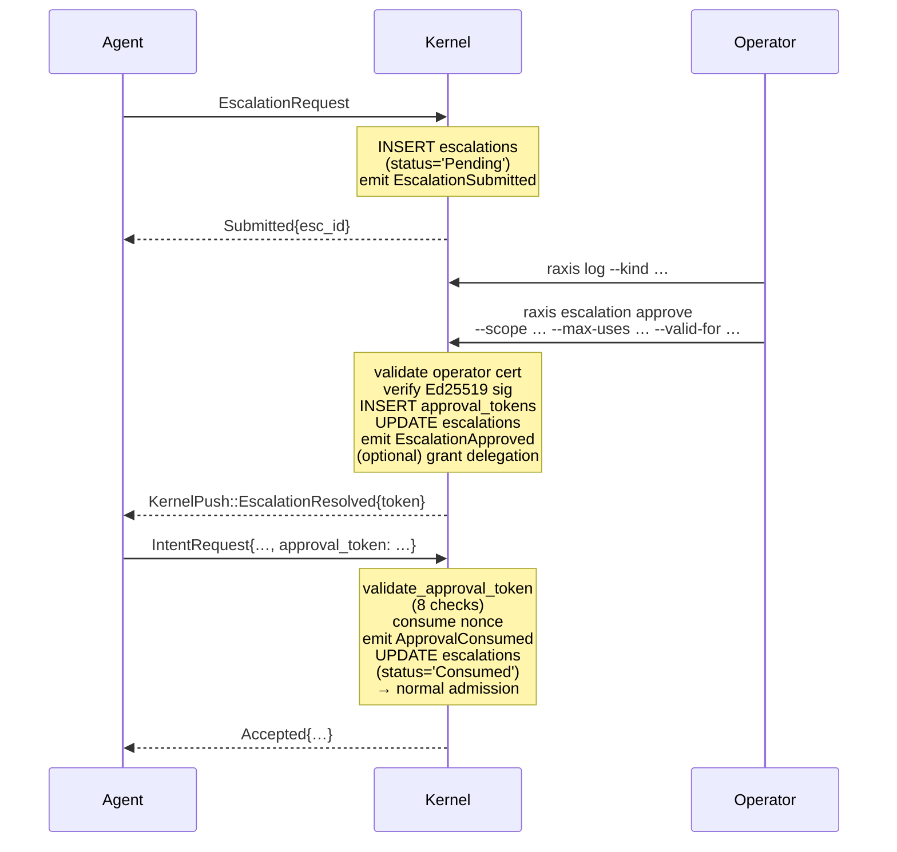

# RAXIS Escalations — End-to-End Explained

> **Audience.** Operators answering "the agent is asking me to do
> something — what does that mean?", contributors changing
> `kernel/src/handlers/escalation.rs`, and reviewers auditing why an
> escalation was admitted or denied. The companion docs are
> [`04-delegations-and-authority.md`](04-delegations-and-authority.md) (the typical happy-path payoff
> of an escalation — a fresh, scoped, time-bounded delegation) and
> [`01-claims-and-gates.md`](01-claims-and-gates.md) (the most common reason an agent has to
> ask).
>
> **Authority.** Wire shapes, FSM, audit events, and CLI flags below
> are pinned to the current source tree. Where this doc disagrees
> with the code, the code wins.

---

## What is an escalation?

An escalation is the kernel's **out-of-band human approval channel**
(**R-12** in the paradigm; **INV-06** in this implementation). When
an agent encounters work that exceeds its current authority, it has
exactly four options:

1. Stop and emit `ReportFailure` (the work cannot be done).
2. Find a different way that is within scope (preferred).
3. Submit `EscalationRequest` (this doc).
4. Cause undefined behaviour (impossible — it has no other channel).

The agent **cannot self-approve**. The kernel's reply path
(`KernelPush::EscalationResolved`) goes through the same VSock /
UDS the agent reads, but the *signed approval token* is produced
exclusively by the operator's offline Ed25519 key, which the agent
does not hold (**INV-CERT-03**).

---

## The six escalation classes

Defined in `crates/types/src/escalation.rs::EscalationClass`. Every
escalation is exactly one class, and the class must match the
discriminant of the `requested_scope` field.

| Class | When to use it | `requested_scope` shape |
|---|---|---|
| `CapabilityUpgrade` | A gate failed because the session lacks a `CapabilityClass`. | `CapabilityUpgrade { capability: CapabilityClass }` |
| `DelegationRenewal` | A delegation is `Expired` or `RenewalRequired`. | `DelegationRenewal { delegation_id }` |
| `BudgetException` | Budget was exhausted but the task is genuinely incomplete. | `BudgetException { additional_units: u64 }` |
| `QualityGateException` | A specific quality gate cannot be satisfied for a justifiable reason. Distinct from pre-authorised `override_rules`. | `QualityGateException { gate_type, task_id }` |
| `MergeConflict` | **V2, Orchestrator only.** Non-trivial git merge conflict the Orchestrator's NNSP prescribes punting to a human. Resolution path is operator-manual commit + `IntegrationMerge { resolved_via_escalation: Some(id) }`. | `MergeConflict { conflicts: Vec<String> }` (≤ 64 paths × 1 KiB each) |
| `LogicalDeadlock` | **V2.5b, kernel-initiated only.** Auto-created when an initiative's `orchestrator_no_progress_respawn_count` exceeds `MAX_ORCH_NO_PROGRESS_RESPAWNS` (default 3): the orchestrator is in a structural loop, exiting cleanly on a kernel-rejected intent without any task FSM transition. Paired with the `OrchestratorRespawnCeilingExceeded` audit event per `INV-ESCALATION-AUTO-LOGICAL-DEADLOCK-01`. Approve resets the counter + transitions the initiative back from `Failed` to `Executing` + schedules a fresh orchestrator respawn; deny preserves the `Failed` terminal state. The planner-side admission path MUST reject any `EscalationRequest { class: LogicalDeadlock }` (defense-in-depth: the kernel-side approve handler additionally rejects rows whose `initiator` is not `'Kernel'`). | `LogicalDeadlock { initiative_id, attempts, window_secs, last_intent_kind, last_rejection_reason }` (text fields ≤ 1 KiB each) |

The `(class, requested_scope)` pair is checked at admission — a
mismatch is treated as a malformed request (rejected at Step 2 of the
escalation submission pipeline below). The
`LogicalDeadlock` class additionally carries an `initiator = 'Kernel'`
column on the `escalations` row (Migration 20) so the operator-side
approve/deny handler can distinguish kernel-initiated rows from
planner submissions and route them to the counter-reset path
exclusively.

---

## Step 1 — Agent submits `EscalationRequest`

Wire shape (`crates/types/src/escalation.rs`):

```rust
EscalationRequest {
    session_token:    String,                  // kernel-issued; on every frame
    task_id:          TaskId,                  // the task whose work is blocked
    class:            EscalationClass,         // one of the five above
    requested_scope:  RequestedEscalationScope,// must match `class.discriminant`
    justification:    String,                  // 1..=4096 chars, opaque to kernel
    idempotency_key:  Uuid,                    // fresh per submission
}
```

Wire encoding is bincode 2.0.1 standard() inside a 4-byte LE length
prefix (the canonical RAXIS framing — see
`peripherals.md §3.1`).

**The agent does not pick its own `escalation_id`.** The kernel
assigns it on the response. Idempotency is key-driven, not ID-driven:
re-submitting the same `(session_id, idempotency_key)` returns
`AlreadyPending { escalation_id }` with the original ID rather than
opening a duplicate row.

---

## Step 2 — Kernel admits or rejects (7-step pipeline)

The handler is `kernel/src/handlers/escalation.rs::handle_inner`.
The 7-step contract documented at the top of that file (lines 13-38)
is reproduced here verbatim:

| Step | What happens | Failure mode |
|---|---|---|
| 1 | Resolve `session_token` → `SessionRow`. | `RateLimitExceeded` (note: every internal failure on this path collapses to one of the two on-wire reasons). |
| 2 | Validate the wire payload (`justification` non-empty + ≤ 4096 chars; `class` matches `requested_scope.kind`; `idempotency_key` non-nil). | `RateLimitExceeded`. |
| 3 | Look up the task → recover `initiative_id`; verify the task's owning session has the same `lineage_id` as the submitting session (no cross-lineage escalations). | `RateLimitExceeded`. |
| 4 | Idempotency: if a row with `(session_id, idempotency_key)` already exists, return `AlreadyPending { escalation_id }` immediately. **No rate-limit slot is consumed.** | — |
| 5 | Lineage rate-limit + quarantine (see below). | `LineageQuarantined` or `RateLimitExceeded`. |
| 6 | INSERT the `escalations` row (`status='Pending'`) + UPDATE `lineage_rate_limits.escalation_count` in the same SQL transaction. | Rolled back; `RateLimitExceeded`. |
| 7 | Commit. After commit: emit `EscalationSubmitted` audit event. Return `Submitted { escalation_id, timeout_at }`. | — |

> **INV-08 note.** The on-wire `EscalationRejectionReason` enum has
> exactly two variants (`RateLimitExceeded`, `LineageQuarantined`) —
> see `crates/types/src/escalation.rs:233-240`. The richer internal
> failure modes (cross-lineage rejection, missing task, malformed
> payload) all collapse to `RateLimitExceeded` so the planner cannot
> probe the kernel's structural state. The full failure reason is
> recorded in the audit chain for operator-side forensic analysis.

### Step 5 — Lineage rate-limit + quarantine

The DDL is `kernel-store.md §2.5.5 Table 15 lineage_rate_limits`:

```sql
CREATE TABLE lineage_rate_limits (
    lineage_id              TEXT    NOT NULL PRIMARY KEY,
    window_start            INTEGER NOT NULL,
    escalation_count        INTEGER NOT NULL DEFAULT 0,
    quarantined             INTEGER NOT NULL DEFAULT 0
        CHECK (quarantined IN (0, 1)),
    quarantine_trigger_count INTEGER NOT NULL DEFAULT 0,
    quarantined_at          INTEGER
);
```

Three policy knobs control the rate-limit:

| Policy field | Meaning | Default |
|---|---|---|
| `escalation_max_per_window` | Max successful submissions per `window_secs`. | from policy |
| `escalation_window` | Window duration in seconds. | from policy |
| `escalation_quarantine_threshold` | Number of rate-limit hits that trip a permanent quarantine. | from policy |

Algorithm (`handle_inner` lines 261-360):

1. If `quarantined = 1` → return `LineageQuarantined`. **No further
   counter changes; no fresh audit emit** (the original
   `LineageQuarantined` event was emitted on the trigger
   transition).
2. If `now >= window_start + window_secs` → reset window
   (`window_start = now`, `escalation_count = 0`).
3. If `escalation_count + 1 > max_per_window`:
   - `quarantine_trigger_count += 1`.
   - If `quarantine_trigger_count >= escalation_quarantine_threshold`:
     - Set `quarantined = 1`, `quarantined_at = now`.
     - Emit `AuditEventKind::LineageQuarantined`.
     - Return `LineageQuarantined`.
   - Otherwise:
     - Persist `quarantine_trigger_count`.
     - Emit `AuditEventKind::EscalationRateLimitExceeded`.
     - Return `RateLimitExceeded`.
4. Otherwise: `escalation_count += 1`, INSERT escalation row, commit.

**The rejected attempt does NOT consume an `escalation_count` slot.**
A planner that hits the rate-limit can still submit valid escalations
once the window rolls over (provided it does not also trip
quarantine).

> **Note on terminology.** There is no per-session "cooldown timer"
> column (`cooldown_until_at`) in this schema; the actual mechanism
> is a per-lineage rate-limit window plus a quarantine threshold,
> implemented in `handlers/escalation.rs::submit_escalation_blocking`
> (test: `cargo test -p raxis-kernel --test
> escalation_rate_limit`). What's still pending is operator-facing
> ergonomics around quarantine *lift* (currently impossible in V1 —
> a quarantined lineage cannot escalate again until a fresh
> initiative is created with a new `lineage_id`), which is V3 scope.

### What the task does while the escalation is pending

**The task does not transition.** There is no `EscalationPending`
state — the `TaskState` enum (`crates/types/src/initiative.rs`) is
`Admitted | GatesPending | Running | Completed | Failed | Aborted |
Cancelled | BlockedRecoveryPending`. The task stays in whatever
state it was in when the escalation was submitted.

What happens instead:

- The agent is expected to back off from gated actions until the
  escalation resolves.
- `KernelPush::EscalationResolved` will arrive on the same channel
  the agent listens on (planner UDS / VSock).
- The agent can submit `StructuredOutput` or `ReportFailure` while
  pending — those are not gated by the escalation.

If the agent submits an intent whose admission would have failed for
the very reason the escalation was raised — e.g. a `SingleCommit`
into a path it lacks a `WriteCode` delegation for — it gets the same
`FAIL_PATH_POLICY_VIOLATION` rejection as before. The escalation
does not pre-authorise; only the operator's signed `ApprovalToken`
does.

---

## Step 3 — Operator inspects pending escalations

Read-only CLI primitives (`raxis log`, `raxis status`):

```bash
raxis log --kind EscalationSubmitted --since 1h
raxis status --task <task_id>          # shows pending escalations on that task
```

The dashboard's `dashboard-fe/src/pages/Escalations.tsx` reads from
the same audit/SQLite views used by the read-only CLI; it does **not**
issue mutating IPC. Read-only and mutating paths are split — see
`specs/v1/cli-readonly.md §1.4`.

---

## Step 4 — Operator decides

### Approve

```bash
raxis escalation approve <escalation_id> \
  --scope     <capability_class>            # e.g. WriteCode
  --max-uses  <n>                           # required; e.g. 5
  --valid-for <seconds>                     # required; e.g. 3600
```

Verbatim from `cli/src/commands/escalation.rs::run_approve` (lines
26-69). No `--ttl` or `--reason` flag exists on this subcommand. The
CLI:

1. Loads the operator's private Ed25519 key (`-k <path>` or
   `RAXIS_OPERATOR_KEY`).
2. Builds a canonical `ApprovalScope` and signs it.
3. Submits `OperatorRequest::ApproveEscalation` over `operator.sock`.
4. Prints the `approval_token` (or `--reveal` to print bytes) for the
   planner to consume.

Server-side (`kernel/src/authority/escalation.rs::approve_escalation`):

1. Validate the operator certificate (`CertEnforcer` four-zone gate
   — **INV-CERT-01**, **INV-INIT-11**).
2. Verify the operator's Ed25519 signature on the approval scope.
3. Insert into `approval_tokens`.
4. Update `escalations.status` from `Pending` → `Approved`.
5. (If the class is `CapabilityUpgrade` or `DelegationRenewal`) grant
   a new delegation row; **important:** the approval token is the
   one-shot; the new delegation is the durable grant. The agent
   consumes the token *once* by presenting it on its next intent;
   the delegation lives until its TTL or the next epoch's
   `mark_stale_on_epoch_advance`.
6. Emit `EscalationApproved` audit event.
7. Send `KernelPush::EscalationResolved { escalation_id, outcome:
   Approved, approval_token }` to the agent.

### Deny

```bash
raxis escalation deny <escalation_id> --reason "<text>"
```

(Note: the actual subcommand is `deny`, not `reject`. The audit
event is `EscalationDenied`. Operator's reason is logged but never
returned to the agent — **INV-08**.)

Server-side: `escalations.status: Pending → Denied`; emit
`EscalationDenied`; push `KernelPush::EscalationResolved {
escalation_id, outcome: Denied }` to the agent. The task stays in
its pre-escalation state; the agent must adapt or
`ReportFailure`.

### Timeout

If the operator does nothing before
`escalations.timeout_at` (set at submission time from
`policy.escalation_timeout`), a kernel sweep transitions the row to
`TimedOut` and emits `EscalationTimedOut`. The agent receives
`KernelPush::EscalationResolved { outcome: TimedOut }`. **The task
stays in its pre-escalation state** (no forced
`BlockedRecoveryPending` transition — chaos drill in
`philosophy.md §1.3`).

---

## Step 5 — Agent presents the approval token

```rust
IntentRequest {
    …
    approval_token: Some(ApprovalToken {
        approval_id:   Uuid,             // PK in approval_tokens
        escalation_id: EscalationId,     // must match the original escalation
        operator_sig:  String,           // hex-encoded Ed25519 signature
    }),
    …
}
```

The kernel's `validate_approval_token` runs eight ordered checks
(documented at `kernel/src/authority/approval.rs::validate_approval_token`):

| # | Check | On failure |
|---|---|---|
| 0 | `approval_id` exists in `approval_tokens` | `NotFound` → `Unauthorized` |
| 1 | Token is not revoked | `Revoked` → `Unauthorized` |
| 2 | `policy_epoch == current_epoch` (INV-ESC-02) | `EpochMismatch` → `Unauthorized` |
| 3 | `now < expires_at` | `Expired` → `Unauthorized` |
| 4 | Nonce not in `approval_token_nonces` (INV-ESC-04 single-use) | `NonceConsumed` → `Unauthorized` |
| 5 | `token.session_id == ctx.session_id` (INV-ESC-03) | `SessionMismatch` → `Unauthorized` |
| 6 | `check_scope(token.scope, action)` (INV-ESC-05) | `ScopeMismatch` → `Unauthorized` |
| 7 | Use count < `max_uses` | `UseCountExceeded` → `Unauthorized` |

On `Ok(ApprovalStatus::Valid)`, the kernel:

1. INSERT `approval_token_nonces` row (consumes the nonce — INV-ESC-04).
2. INCR `approval_tokens.use_count`.
3. INSERT `approval_proofs` row (audit substrate per **INV-06**).
4. Update `escalations.status: Approved → Consumed`.
5. The intent proceeds through the normal admission pipeline.

The approval token is **the one-shot release valve**, not a long-
lived credential. Long-lived authority is what the *delegation*
provides — see [`04-delegations-and-authority.md`](04-delegations-and-authority.md).

---

## Visual: the full lifecycle



---

## Edge cases

### 1. Token expired

The agent's next intent presents an expired token: check 3 returns
`Expired` → wire `Unauthorized`. The kernel's pre-existing sweep
transitions the escalation to `TokenExpired` (distinct from
`TimedOut` — the latter fires before approval, the former after).
The agent sees no escalation outcome via push (the approval-side
push was already delivered); it must re-escalate.

### 2. Cross-escalation mismatch

The wire `approval_token` carries `escalation_id`. If the agent
quotes `escalation_id = esc_X` but the `approval_id` in the same
token corresponds to `esc_Y`, the kernel's join in
`validate_approval_token` step 0 catches the mismatch and rejects
with `NotFound`. (Note: the token's `escalation_id` field is signed
by the operator alongside the scope, so an attacker cannot tamper
with one without invalidating the signature.)

### 3. Multiple pending escalations on one task

There is no kernel-side cap on this. Idempotency is `(session_id,
idempotency_key)` — distinct keys produce distinct rows. The rate-
limit window may bound the practical max; in pathological cases
operators should `raxis session revoke` the offending session.

### 4. Operator approves with narrower scope than requested

Common case for `CapabilityUpgrade` — the agent asks for
`migrations/**` but the operator approves
`migrations/v2/**` only:

```bash
raxis escalation approve esc-abc --scope WriteCode \
  --paths "migrations/v2/**" --max-uses 5 --valid-for 3600
```

The `ApprovalScope` records the narrower scope; the
`check_scope` step (#6 above) rejects any subsequent intent that
touches `migrations/v1/...`. The agent must re-escalate or work
within the narrower bounds.

### 5. Operator advances policy epoch between approve and use

`validate_approval_token` step 2 fires `EpochMismatch`. The
escalation row stays `Approved` (the operator's intent is still
recorded), but the token is dead. The operator must re-issue a fresh
`ApprovalToken` under the new epoch. **INV-ESC-02**.

### 6. Lineage permanently quarantined

Once `quarantined = 1`, every future `EscalationRequest` from any
session in that lineage rejects with `LineageQuarantined` regardless
of `idempotency_key`, `class`, or rate-limit window. **The only
recovery is a fresh initiative with a new `lineage_id`** — V1 has no
operator-side quarantine lift command, by design (matches **INV-INIT-10**'s
quarantine-is-not-reversible posture). V3 scope adds a
`raxis lineage unquarantine` command gated on multi-operator
co-signing.

---

## Key source files

| File | Role |
|---|---|
| `kernel/src/handlers/escalation.rs` | Submission pipeline (Steps 1-7) |
| `kernel/src/authority/escalation.rs` | `approve_escalation`, `deny_escalation`, scope signing canonicalization |
| `kernel/src/authority/approval.rs` | `ApprovalToken`, `validate_approval_token` (8-check pipeline), `check_scope` |
| `crates/types/src/escalation.rs` | `EscalationRequest`, `EscalationResponse`, `EscalationClass`, `EscalationStatus`, `EscalationRejectionReason`, `RequestedEscalationScope` |
| `crates/types/src/intent.rs` | `ApprovalToken` wire shape (lines 195-210) |
| `cli/src/commands/escalation.rs` | `raxis escalation approve` / `deny` |
| `cli/src/commands/escalations.rs` | (helper module — operator-side wire shaping) |
| `crates/store/src/migration.rs` | DDL for `escalations` (Table 9), `approval_tokens` (Table 10), `approval_token_nonces`, `approval_proofs`, `lineage_rate_limits` (Table 15) |
| `dashboard-fe/src/pages/Escalations.tsx` | Operator-facing read-only UI |

> **Path note.** The handler is at
> `kernel/src/handlers/escalation.rs`, and the approval/deny logic
> is in `kernel/src/authority/escalation.rs`. The scheduler does not
> own escalation state — escalations never block scheduler decisions
> in V1.
