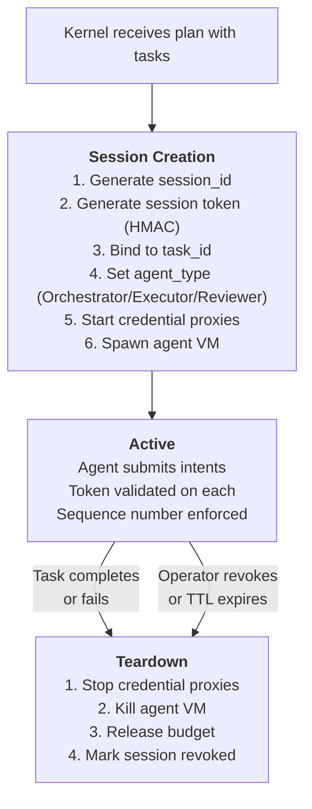

# RAXIS Sessions & Isolation — End-to-End Explained

> **Audience.** Operators understanding "who is this session
> talking to my kernel?", contributors changing
> `kernel/src/authority/session.rs`, and reviewers debugging
> `SessionRevoked` / `Replay` rejections.
>
> **Authority.** Session row schema:
> `crates/store/src/migration.rs` Table 4 (`sessions`). Session
> creation: `kernel/src/authority/session.rs::create_session`.
> Wire-level auth: `kernel/src/handlers/intent.rs::handle_intent`
> (Step 1) and `accept_envelope_and_advance_sequence`. Isolation:
> `crates/session-spawn/`.
>
> **Paradigm anchor.** Sessions implement **R-1 — Identity is
> kernel-issued**: an agent receives an opaque token at spawn and
> can never mint a new one. Every privileged decision is bound to
> a kernel-created session row that an operator can revoke
> instantaneously.

---

## What is a session?

A session is the kernel's **identity binding** for an agent. Every agent runs inside one session. The session determines:
- What task the agent is working on (`task.session_id` foreign key)
- What capabilities the agent has (via delegations rows keyed on `session_id`)
- What credentials the agent can access (via credential proxies started for that session)
- What its security boundaries are (via the isolation backend)

An agent cannot act without a session. A session cannot be created by the agent.

---

## Session Lifecycle



---

## Session authentication

Every `IntentRequest` is authenticated through a three-step gate
(verified against `kernel/src/handlers/intent.rs::handle_intent`
and `kernel/src/authority/session.rs::accept_envelope_and_advance_sequence`):

1. **Token check.** The wire-level `session_token` (64-char hex,
   256-bit CSPRNG random — see `raxis_crypto::token::generate_session_token`)
   is looked up directly in `sessions.session_token` via
   `authority::session::get_session_by_token`. The lookup is exact
   match on the column (UNIQUE constraint, single index hit). The
   token is **not** HMAC-derived from `session_id` — earlier drafts
   of this doc said it was; that was wrong. The token is opaque
   random bytes.
2. **Envelope nonce + sequence check.**
   `accept_envelope_and_advance_sequence` verifies in one
   transaction:
   * `envelope_nonce` has not been seen before (`nonce_cache` PK
     INSERT — duplicate → `ReplayRejected`)
   * `sequence_number == sessions.sequence_number + 1` exactly
     (no gaps, no rewinds — INV-01). Mismatch with cryptographic
     evidence of malice (e.g. equal-or-lower seq with a brand-new
     nonce) emits `SecurityViolation { violation_class: Replay }`
     and force-revokes the session; benign retries instead route
     to `ReplayRejected`.
3. **Revocation/expiry check.** `sessions.revoked_at IS NULL` and
   `sessions.expires_at > now()`. A revoked or expired session's
   intents are permanently rejected with `SessionRevoked` /
   `SessionExpired`.

The agent receives its session token at spawn time via the
`session.env` mounted in its sandbox. It cannot generate new
tokens — `generate_session_token` is kernel-private; the agent
binary doesn't link `raxis-crypto`.

---

## Isolation Backends

The session specifies how the agent is isolated. The kernel supports multiple isolation backends:

| Backend | How it works | Boundary strength |
|---|---|---|
| **MicroVM (AVF/Firecracker)** | Dedicated VM per agent. Separate kernel, memory, network namespace | Hardware-level isolation |
| **Container (Docker/OCI)** | Isolated process namespace. Shared kernel | OS-level isolation |
| **Process (dev mode)** | Direct subprocess on the host | Minimal isolation |

### MicroVM isolation provides:
- **Separate memory space** — agent cannot read kernel memory
- **Separate filesystem** — agent sees only its worktree (mounted via VirtioFS)
- **Separate network namespace** — agent can only reach `localhost` (where credential proxies are bound)
- **Resource limits** — max CPU, max memory, max disk I/O

### What the agent can see:

```text
/ (read-only root filesystem)
├── /work/            ← VirtioFS mount of the git worktree (read-write)
├── /raxis/session.env ← Session metadata (session_id, task_id, ports)
└── localhost:PORT    ← Credential proxy endpoints
```

The agent cannot:
- See the kernel's database
- See other agents' worktrees
- Make outbound network requests (unless egress is allowed in policy)
- Read credential values (only localhost proxy ports)

---

## System Prompt Assembly

The agent's system prompt is dynamically assembled at session start by the kernel:

```rust
// From planner-core/src/driver.rs
let prompt = render_system_prompt_for_role(
    role,
    task_description,
    policy_context,
    available_tools,
    credential_ports,
    ...
);
```

The system prompt tells the agent:
- What task it's working on
- What tools are available
- Where credentials are (as `localhost:PORT`)
- Its role-specific instructions (Orchestrator, Executor, Reviewer)

The system prompt does **not** tell the agent:
- What claim types it needs (the kernel handles this)
- Raw credential values
- Other sessions' information
- Kernel internals

---

## V2 Agent Types

V2 introduces three agent types per session:

| Type | Can do | Cannot do |
|---|---|---|
| **Orchestrator** | `ActivateSubTask`, `RetrySubTask`, `StructuredOutput` | Direct code commits |
| **Executor** | `SingleCommit`, `IntegrationMerge`, `CompleteTask`, `ReportFailure`, `StructuredOutput` | Spawn sub-tasks |
| **Reviewer** | `SubmitReview` (approve/reject executor's code) | Code commits, StructuredOutput |

This is enforced by the **static dispatch matrix** — the kernel has a compile-time table mapping `(IntentKind, AgentType) → Permitted/Denied`. Adding a new `IntentKind` breaks compilation until a row is added.

---

## Edge Cases

### 1. Agent tries to act on someone else's task

The kernel checks `task.session_id == request.session_id`. One session = one task. Mismatch → rejected.

### 2. Two agents share the same VM

Not possible. Each session gets its own isolation unit. The kernel enforces this at spawn time.

### 3. Session TTL expires mid-work

The kernel detects the expiry on the next intent submission. The task transitions to `Failed` with `reason = SessionExpired`. The agent's VM is torn down.

### 4. Agent crashes and the VM dies

The kernel detects the VM exit. The task enters a `Failed` state. In V2, the Orchestrator can issue `RetrySubTask` to re-spawn the executor (subject to retry limits).

### 5. Operator revokes a session while the agent is running

The session row gets `revoked_at = now`. The agent's next intent is rejected with `SessionRevoked`. The VM continues running but can't submit any work. On the next liveness check, the kernel terminates the VM.

---

## Gap Found: Session Liveness Check

> [!WARNING]
> **Proactive session liveness monitoring is spec'd but minimal.**
>
> The kernel detects session death reactively (when the next intent fails
> or the VM process exits). The spec envisions a periodic heartbeat from
> the agent to the kernel, with a timeout that triggers proactive cleanup.
>
> Currently, if an agent hangs (no crash, no exit, just infinite loop),
> the session stays active until its TTL expires. The wall-clock session
> TTL is the only safety net.
>
> **Impact:** A hung agent consumes its lane budget reservation for the
> full TTL duration, potentially blocking other tasks from running.

---

## Key source files

| File | Role |
|---|---|
| `kernel/src/authority/session.rs` | `create_session`, `revoke_session`, `get_session_by_token`, `accept_envelope_and_advance_sequence` (INV-01 monotonic seq + nonce dedup) |
| `kernel/src/handlers/intent.rs` | Step 1 of admission: token resolution + envelope acceptance + `task.session_id` cross-check |
| `kernel/src/ipc/auth.rs` | Operator-only Ed25519 challenge/response (NOT session-token validation — that lives in `authority/session.rs`) |
| `kernel/src/ipc/server.rs` | Wire-frame redaction (`session_token_fp` not raw token); per-frame log line shape |
| `kernel/src/authority/dispatch_matrix.rs` | V2 static matrix `(IntentKind × SessionAgentType) → Permitted/Denied`; compile-time exhaustiveness |
| `kernel/src/session_spawn_orchestrator.rs` | V2 orchestrator-driven session spawn for sub-tasks |
| `crates/session-spawn/` | Isolation backends (microVM/container/process); session.env shape |
| `crates/runtime/` | `heartbeat.json` schema (kernel-side liveness only — see "Gap Found" above) |
| `crates/planner-core/src/driver.rs` | Planner main loop (sees only the rendered system prompt + injected tool descriptors) |
| `kernel/src/prompt/assembler.rs` | System prompt assembly (kernel-side; planner never sees the assembler) |
| `crates/types/src/lib.rs` | `SessionId`, `LineageId`, `SessionAgentType` |
| `crates/credential-proxy-manager/src/lib.rs` | Proxy lifecycle tied to session (start at `create_session`, stop at revoke/expiry) |
| `crates/store/src/migration.rs` Table 4 | `sessions` DDL + INV-01 sequence column |
| `specs/v1/kernel-store.md` §2.5.1 Table 4 | Normative schema, sequence semantics |
| `specs/v1/kernel-core.md` §2.3 | `authority::session` function contracts |
