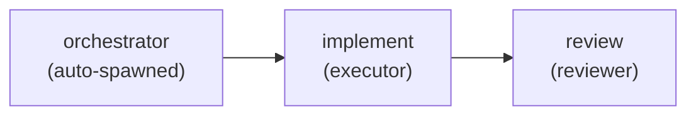
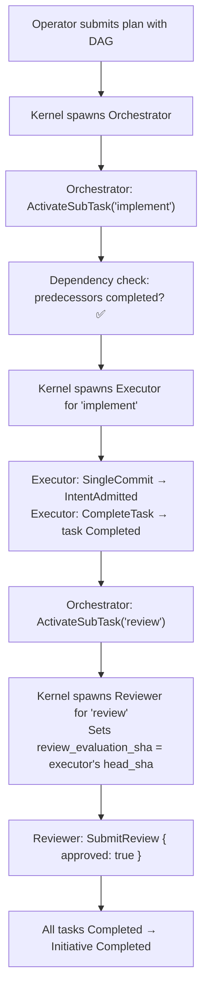

# RAXIS V2 Orchestration — End-to-End Explained

> **Audience.** Operators authoring V2 plans, contributors
> changing `kernel/src/handlers/intent.rs` (the dispatch matrix
> ingress), and reviewers debugging "why did my Orchestrator
> intent get `AuthorityProbe` rejected?".
>
> **Authority.** Spec is `specs/v2/v2-deep-spec.md` (the deep
> spec) and `specs/v2/intent-admission.md` for the wire details.
> Runtime: `kernel/src/handlers/intent.rs`,
> `kernel/src/authority/dispatch_matrix.rs`,
> `kernel/src/scheduler/dag.rs`,
> `kernel/src/initiatives/lifecycle.rs`. Retry FSM lives in
> Table 22 (`subtask_activations`).
>
> **Paradigm anchor.** V2 is the structural manifestation of
> **R-6 — Roles separate intelligence from authority**: the
> Orchestrator chooses *what* to do; the Executor and Reviewer
> have separate, narrower powers; the kernel keeps them strictly
> apart through a compile-checked dispatch matrix. No single
> agent can both write code and approve it.

---

## What is V2 orchestration?

V2 introduces **hierarchical multi-agent coordination**. Instead of one agent doing everything, the operator defines a DAG of tasks:
- An **Orchestrator** coordinates the work
- **Executors** write the code
- **Reviewers** review the code

The kernel enforces the DAG ordering, the role boundaries, and the retry limits.

---

## Step 1: Operator Defines the Task DAG

```toml
# NOTE: The Orchestrator is auto-created by the kernel and MUST NOT
# appear in [[tasks]]. The plan declares only Executor + Reviewer
# tasks; the kernel synthesises the Orchestrator session at
# `approve_plan`. Verified against
# `kernel/src/initiatives/lifecycle.rs` (PlanCloneStrategyInvalid
# rule = "unknown_agent_type" rejects "Orchestrator" in [[tasks]]).

[[tasks]]
task_id            = "implement"
session_agent_type = "Executor"
lane_id            = "feature-work"
predecessors       = []

[[tasks]]
task_id            = "review"
session_agent_type = "Reviewer"
lane_id            = "feature-work"
predecessors       = ["implement"]
```

**In plain English:** "The executor writes the code, and the reviewer checks it. The reviewer waits for the executor to complete." The `predecessors` field is the wire-correct name (`depends_on` is spec-prose only — `kernel/src/initiatives/lifecycle.rs::parse_plan_tasks` reads only `predecessors`).

---

## Step 2: Kernel Enforces DAG Dependencies

When the Orchestrator submits `ActivateSubTask { task_id: "review" }`:

1. The kernel checks: are all declared `predecessors` (here, `"implement"`) in the `Completed` state?
2. If not → `DEPENDENCY_NOT_MET` → the Orchestrator must wait
3. If yes → the kernel spawns a session for the Reviewer



---

## Step 3: Static Dispatch Matrix

The kernel has a compile-time table:

| Intent Kind | Orchestrator | Executor | Reviewer |
|---|---|---|---|
| `SingleCommit` | ❌ | ✅ | ❌ |
| `IntegrationMerge` | ❌ | ✅ | ❌ |
| `CompleteTask` | ❌ | ✅ | ❌ |
| `ReportFailure` | ❌ | ✅ | ❌ |
| `ActivateSubTask` | ✅ | ❌ | ❌ |
| `RetrySubTask` | ✅ | ❌ | ❌ |
| `SubmitReview` | ❌ | ❌ | ✅ |
| `StructuredOutput` | ✅ | ✅ | ❌ |

Adding a new `IntentKind` variant **breaks compilation** until a row is added to this matrix. This guarantees exhaustive role checking.

---

## Step 4: Review Loop

After the Executor completes its code:

1. Orchestrator submits `ActivateSubTask { task_id: "review" }`
2. Kernel spawns a Reviewer session with the Executor's `evaluation_sha`
3. Reviewer inspects the code diff
4. Reviewer submits `SubmitReview { approved: true/false, critique: "..." }`

### On approval:
- Task transitions to `Completed`
- Orchestrator is notified via `KernelPush::SubTaskCompleted`

### On rejection:
- Executor's task transitions to `Failed`
- Orchestrator receives `KernelPush::SubTaskFailed`
- Orchestrator can issue `RetrySubTask` (subject to retry counters)

---

## Step 5: Retry Counters

Each sub-task has two retry counters:

| Counter | What it counts | Default max |
|---|---|---|
| `crash_retry_count` | VM crashes / process exits | 3 |
| `review_reject_count` | Reviewer rejections | 2 |

When either counter exceeds its ceiling → `FAIL_INVALID_REQUEST`. The Orchestrator must report the failure to the operator.

Each retry creates a **new** `subtask_activations` row with a fresh `PendingActivation` state and incremented counter.

---

## The Full V2 Flow (Visual)



---

## Edge Cases

### 1. Executor crashes mid-work

The kernel detects the VM exit. The task transitions to `Failed`. The Orchestrator sees `SubTaskFailed { reason: "VmCrash" }` and can issue `RetrySubTask`. `crash_retry_count` increments.

### 2. Reviewer rejects the code

The Executor's task goes back to `Failed`. The Reviewer's `critique` is stored. The Orchestrator can `RetrySubTask`, and the new Executor session has the Reviewer's critique injected into its system prompt so it can fix the specific issues.

### 3. DAG has a cycle

The plan validator detects cycles at load time → `PlanError::CyclicDependency`. The plan is rejected.

### 4. Orchestrator tries to spawn a task that doesn't exist in the plan

`ActivateSubTask { task_id: "nonexistent" }` → `FAIL_INVALID_REQUEST`. Task IDs are validated against the plan at admission time.

### 5. All retry counters exhausted

The Orchestrator's `RetrySubTask` is rejected with `FAIL_INVALID_REQUEST`. The Orchestrator must issue `ReportFailure` or escalate to the operator.

---

## Key source files

| File | Role |
|---|---|
| `crates/types/src/intent.rs`              | `IntentKind` (8 variants), `SessionAgentType` |
| `kernel/src/handlers/intent.rs`           | Phase A Step 1 invokes `evaluate_dispatch` before any handler logic — see concept 02 |
| `kernel/src/authority/dispatch_matrix.rs` | The compile-checked `(IntentKind × SessionAgentType) → Permitted/Denied` table; exhaustive match enforces drift-prevention |
| `kernel/src/scheduler/dag.rs`             | `release_successors` (predecessor-satisfied bookkeeping); cycle detection at plan admission |
| `kernel/src/initiatives/lifecycle.rs`     | DAG admission, sub-task spawn, completion fan-out |
| `kernel/src/initiatives/review_aggregation.rs` | `compute_aggregate_review_outcome` (logical-AND across reviewers) |
| `kernel/src/session_spawn_orchestrator.rs` | V2 orchestrator-driven sub-task session spawning |
| `kernel/src/push/mod.rs`                  | `KernelPushDispatcher` — V2.3 in-memory broadcast + audit mirror (V3 transport deferred) |
| `crates/store/src/migration.rs` Table 22  | `subtask_activations` DDL — `crash_retry_count`, `review_reject_count`, FSM states |
| `crates/planner-core/src/driver.rs`       | Role-specific prompt assembly + planner main loop |
| `specs/v2/v2-deep-spec.md`                | V2 formal specification (Steps 1-30+) |
| `specs/v2/intent-admission.md`            | V2 admission pipeline reference |
| | Implementation status by tier |
