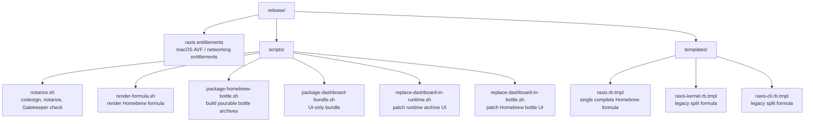
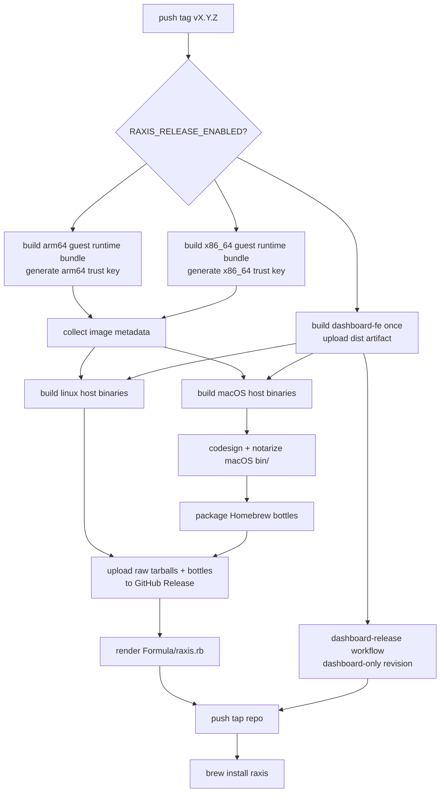

# `raxis/release/` — Release Assets

This directory holds the release templates and signing helpers used by
the tag-driven GitHub Actions pipeline. Normative reference:
[`raxis/specs/v2/release-and-distribution.md`](../specs/v2/release-and-distribution.md).



## Public Install Target

The intended operator path is:

```bash
brew tap chika5105/raxis
brew install raxis
brew services start raxis
```

The tap name above maps to the GitHub repository
`chika5105/homebrew-raxis`. If you choose a different tap repository,
set the release workflow repository variable `HOMEBREW_TAP_REPOSITORY`.

The rendered `raxis` formula installs a complete runtime bundle:

- host binaries: `raxis`, `raxis-cli`, `raxis-kernel`,
  `raxis-gateway`, `raxis-otel-pusher`, `raxis-supervisor`, role
  binaries, and `raxis-tproxy`
- signed canonical guest images under `#{pkgshare}/images`
- guest Linux kernel and validated config under `#{pkgshare}/kernel`
- Vite-built operator dashboard frontend under `#{pkgshare}/dashboard`
- a Homebrew service that launches
  `/bin/sh -c "ulimit -n 4096 && exec #{opt_bin}/raxis-supervisor start"`
  with `PATH=std_service_path_env`,
  `RAXIS_INSTALL_DIR=#{opt_pkgshare}`, `RAXIS_DATA_DIR`,
  `RAXIS_SUPERVISOR_AUTO_RESTART=1`, and
  `RAXIS_SUPERVISOR_KERNEL_BINARY=#{opt_bin}/raxis-kernel`

To serve the browser UI from a Homebrew install, set
`[dashboard].static_dir` in policy to `#{opt_pkgshare}/dashboard`.
The release workflow builds that dashboard bundle once and fans it into
each platform archive.

The service source of truth is `release/templates/raxis.rb.tmpl`, not
an already-poured Cellar plist. Homebrew uses the active tap formula to
generate the installed service file during install, and the bottle also
carries a `.brew/raxis.rb` rendered from the same template so later keg
formula reloads see the same service definition. For that reason, a
broken installed version must be replaced by a new release or reinstall
from a corrected formula/bottle; editing the tap alone does not rewrite
an existing generated service file.

During `brew upgrade raxis`, the formula restarts an active RAXIS
Homebrew service after post-install verification succeeds. This keeps
launchd/systemd from continuing to run an older Cellar binary such as
`/opt/homebrew/Cellar/raxis/<old>/bin/raxis-kernel`. Stopped services
are not started. Operators can skip one automatic refresh with:

```bash
RAXIS_BREW_AUTO_RESTART=0 brew upgrade raxis
```

For a persistent maintenance-window opt-out, create:

```bash
touch "$(brew --prefix)/etc/raxis/disable-brew-auto-restart"
```

The tap formula uses Homebrew bottles for the clean user path. The
workflow still publishes raw complete runtime archives, then publishes
bottle-shaped archives for `arm64_tahoe`, `tahoe`,
`arm64_sequoia`, `sequoia`, `arm64_sonoma`, `sonoma`,
`arm64_linux`, and `x86_64_linux`.

That complete-bundle rule is intentional. A host-binary-only bottle can
install cleanly and then fail later when the kernel tries to spawn a VM.

## Homebrew Revision Release Paths

RAXIS has two patch lanes so a small dashboard, formula, or service
packaging fix does not force a full native-binary, guest-kernel, and
image rebuild.

### Middle ground: Homebrew formula revision

Use the `dashboard-release` GitHub Actions workflow when the fix should
reach `brew upgrade raxis` users but the host binaries and canonical
guest images from a prior full release are still correct. Despite the
workflow name, this is the supported Homebrew revision lane for
dashboard-only fixes, formula/service fixes, or both.

Inputs:

- `base_version`: the full release tag to patch, for example `v0.2.4`
- `revision`: the Homebrew formula revision, for example `1`

The workflow:

1. Builds `dashboard-fe` only.
2. Packages `dashboard-fe/dist` as `raxis-dashboard-fe-<version>-r<N>.tar.gz`.
3. Downloads the runtime archives and bottles from `base_version`.
4. Replaces `share/raxis/dashboard` inside those archives.
5. Refreshes the bottled `.brew/raxis.rb` from the current
   `release/templates/raxis.rb.tmpl`, with the requested formula
   `revision`.
6. Renames patched bottle archives with Homebrew's revision suffix,
   for example `raxis-0.2.6_2.arm64_tahoe.bottle.tar.gz` for
   `revision 2`.
7. Uploads patched archives to `dashboard-<base_version>-r<N>`.
8. Renders the tap formula with the same core `version`, a Homebrew
   `revision <N>`, base-release source tarball URLs, and patched-bottle
   URLs.

This preserves the important release boundary: host binaries, VM images,
and guest kernel stay byte-for-byte from the full release, while the
operator dashboard and Homebrew formula/service packaging can move on a
faster cadence.

### Fastest path: local verified bundle install

Use this for a single operator machine or urgent validation before a
tap update:

```bash
npm ci --prefix dashboard-fe
npm run --prefix dashboard-fe build
release/scripts/package-dashboard-bundle.sh dashboard-fe/dist local-test /tmp
SHA=$(shasum -a 256 /tmp/raxis-dashboard-fe-local-test.tar.gz | awk '{print $1}')
raxis dashboard install-bundle \
  --from-file /tmp/raxis-dashboard-fe-local-test.tar.gz \
  --sha256 "$SHA"
raxis-supervisor stop
raxis-supervisor start
```

The CLI verifies the tarball SHA-256, rejects unsafe archive entries,
installs the bundle under
`<data_dir>/dashboard/releases/<sha256>/dist`, and points
`<data_dir>/dashboard/current` at it. New kernel starts prefer that
data-dir bundle over the packaged Homebrew bundle. The explicit hash is
intentional: the dashboard is an admin surface, so fast patches still
need an operator-visible integrity pin.

## Required GitHub Setup

Repository secrets:

| Secret | Purpose |
| --- | --- |
| `APPLE_DEVELOPER_ID_APPLICATION_P12` | Base64-encoded Developer ID Application `.p12`. |
| `APPLE_DEVELOPER_ID_APPLICATION_PASSWORD` | Password for the `.p12`. |
| `APPLE_NOTARIZATION_API_KEY_ID` | App Store Connect API key id. |
| `APPLE_NOTARIZATION_API_KEY_ISSUER_ID` | App Store Connect issuer UUID. |
| `APPLE_NOTARIZATION_API_KEY_P8` | Base64-encoded App Store Connect `.p8` key. |
| `HOMEBREW_TAP_DEPLOY_KEY` | SSH private deploy key with write access to the tap repo. |

Raw Raxis macOS binaries are command-line Mach-O files, not `.app`
bundles. The release job notarizes a zip containing the signed
`bin/` directory, then runs a retrying Gatekeeper assessment against
each binary. It does not try to staple individual binaries because
Apple's `stapler` does not support that file type.
`APPLE_NOTARIZATION_TIMEOUT` may be set to override the default
30-minute `notarytool submit --wait` timeout.

Repository variables:

| Variable | Purpose |
| --- | --- |
| `RAXIS_RELEASE_ENABLED` | Safety gate; defaults disabled. Set to `1` or `true` only when publishing should run. |
| `HOMEBREW_TAP_REPOSITORY` | Optional; defaults to `chika5105/homebrew-raxis`. |
| `APPLE_NOTARIZATION_TIMEOUT` | Optional; defaults to `30m`. Increase if Apple is slow to finish a submission. |

The release workflow generates one image-signing keypair per guest
architecture inside that architecture's guest-runtime build job. The
private half signs image manifests and never leaves that job. A metadata
collector exposes only the public halves and per-role digests to the
host build jobs, which compile the matching architecture's public key
into `raxis-kernel`.

Each guest-runtime job also builds the Linux guest kernel that ships
with its runtime bundle. It fetches the pinned Cloud Hypervisor Linux commit,
starts from `ch_defconfig`, merges
`images/kernel/raxis-guest-a3-netfilter.config`, and passes the
resulting kernel plus its exact `.config` through `cargo xtask images
bake`. Do not swap this for a stock Firecracker reference kernel: those
configs do not satisfy the Path A3 nftables requirement and do not match
the AVF virtio device shape.

Guest runtime bundle shape, produced once per guest architecture:

```text
images/
  raxis-orchestrator-core-<version>.img
  raxis-orchestrator-core-<version>.manifest.toml
  raxis-reviewer-core-<version>.img
  raxis-reviewer-core-<version>.manifest.toml
  raxis-executor-starter-<version>.img
  raxis-executor-starter-<version>.manifest.toml
  raxis-verifier-starter-<version>.img
  raxis-verifier-starter-<version>.manifest.toml
  raxis-verifier-symbol-index-<version>.img
  raxis-verifier-symbol-index-<version>.manifest.toml
kernel/
  vmlinux
  vmlinux.config
```

Build one locally with:

```bash
./release/scripts/build-guest-kernel.sh \
  --arch arm64 \
  --kernel-out /tmp/raxis-vmlinux-arm64 \
  --config-out /tmp/raxis-vmlinux-arm64.config

RAXIS_INSTALL_DIR=/tmp/raxis-guest-arm64 \
cargo xtask images bake \
  --target aarch64-unknown-linux-musl \
  --kernel-from-file /tmp/raxis-vmlinux-arm64 \
  --kernel-config /tmp/raxis-vmlinux-arm64.config \
  --no-cache

tar -C /tmp/raxis-guest-arm64 -czf raxis-guest-arm64.tar.gz images kernel
shasum -a 256 raxis-guest-arm64.tar.gz
```

Repeat with `--target x86_64-unknown-linux-musl` and an x86_64 guest
kernel for Intel Linux/macOS users.

## Local Formula Dry-Run

```bash
ZERO=$(printf '%64s' 0 | tr ' ' '0')
RAXIS_VERSION=0.1.0-dev \
RAXIS_BOTTLE_ROOT_URL=https://example \
RAXIS_BOTTLE_DARWIN_ARM64_TAHOE_SHA256=$ZERO \
RAXIS_BOTTLE_DARWIN_X86_64_TAHOE_SHA256=$ZERO \
RAXIS_BOTTLE_DARWIN_ARM64_SEQUOIA_SHA256=$ZERO \
RAXIS_BOTTLE_DARWIN_X86_64_SEQUOIA_SHA256=$ZERO \
RAXIS_BOTTLE_DARWIN_ARM64_SONOMA_SHA256=$ZERO \
RAXIS_BOTTLE_DARWIN_X86_64_SONOMA_SHA256=$ZERO \
RAXIS_BOTTLE_LINUX_ARM64_SHA256=$ZERO \
RAXIS_BOTTLE_LINUX_X86_64_SHA256=$ZERO \
RAXIS_DARWIN_ARM64_URL=https://example/raxis-darwin-arm64.tar.gz \
RAXIS_DARWIN_ARM64_SHA256=$ZERO \
RAXIS_DARWIN_X86_64_URL=https://example/raxis-darwin-x86_64.tar.gz \
RAXIS_DARWIN_X86_64_SHA256=$ZERO \
RAXIS_LINUX_ARM64_URL=https://example/raxis-linux-arm64.tar.gz \
RAXIS_LINUX_ARM64_SHA256=$ZERO \
RAXIS_LINUX_X86_64_URL=https://example/raxis-linux-x86_64.tar.gz \
RAXIS_LINUX_X86_64_SHA256=$ZERO \
release/scripts/render-formula.sh raxis
```

## Release Flow



The release workflow fails before publishing if a guest runtime bundle
cannot be built or if it does not contain both `images/` and
`kernel/vmlinux`. That failure mode is deliberate: it is better to stop
a release than publish a Homebrew formula that cannot boot planner VMs.
The packaging steps also force every `bin/raxis*` file to mode `0755`
after artifact download and again while laying out bottles; GitHub's
artifact service may otherwise restore executable binaries as `0644`.
The formula renderer and bottle packager also fail the release if the
tap formula or bottled `.brew/raxis.rb` is missing the daemon `ulimit`
wrapper, `std_service_path_env`, service data dir, or explicit
`raxis-kernel` supervisor override.
