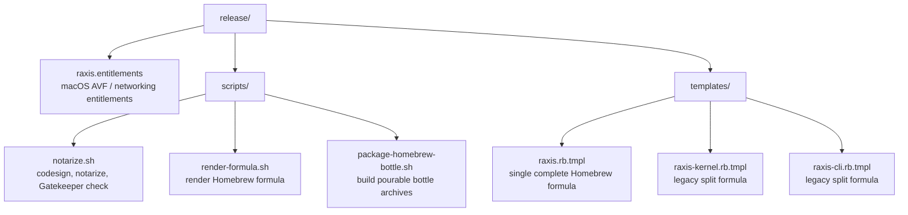
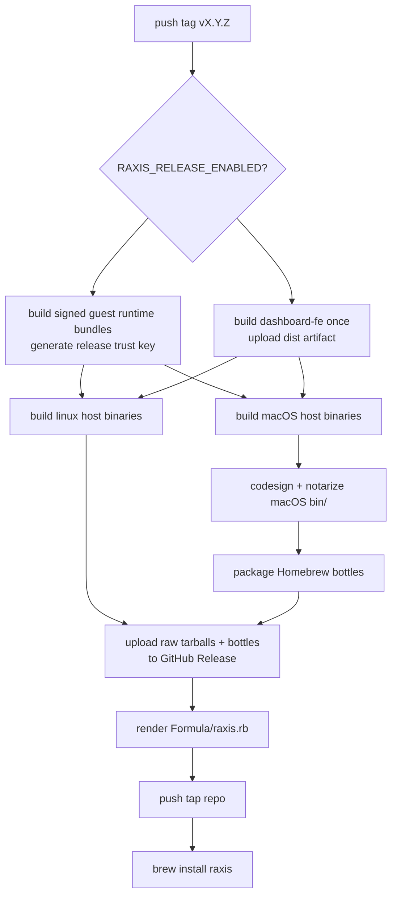

# `raxis/release/` — Release Assets

This directory holds the release templates and signing helpers used by
the tag-driven GitHub Actions pipeline. Normative reference:
[`raxis/specs/v2/release-and-distribution.md`](../specs/v2/release-and-distribution.md).



## Public Install Target

The intended operator path is:

```bash
brew tap chika5105/raxis
brew install raxis
brew services start raxis
```

The tap name above maps to the GitHub repository
`chika5105/homebrew-raxis`. If you choose a different tap repository,
set the release workflow repository variable `HOMEBREW_TAP_REPOSITORY`.

The rendered `raxis` formula installs a complete runtime bundle:

- host binaries: `raxis`, `raxis-cli`, `raxis-kernel`,
  `raxis-gateway`, `raxis-otel-pusher`, `raxis-supervisor`, role
  binaries, and `raxis-tproxy`
- signed canonical guest images under `#{pkgshare}/images`
- guest Linux kernel and validated config under `#{pkgshare}/kernel`
- Vite-built operator dashboard frontend under `#{pkgshare}/dashboard`
- a Homebrew service that runs `raxis-supervisor start` with
  `RAXIS_INSTALL_DIR=#{opt_pkgshare}`, `RAXIS_DATA_DIR`, and
  `RAXIS_SUPERVISOR_AUTO_RESTART=1`

To serve the browser UI from a Homebrew install, set
`[dashboard].static_dir` in policy to `#{opt_pkgshare}/dashboard`.
The release workflow builds that dashboard bundle once and fans it into
each platform archive.

The tap formula uses Homebrew bottles for the clean user path. The
workflow still publishes raw complete runtime archives, then publishes
bottle-shaped archives for `arm64_tahoe`, `tahoe`,
`arm64_sequoia`, `sequoia`, `arm64_sonoma`, `sonoma`,
`arm64_linux`, and `x86_64_linux`.

That complete-bundle rule is intentional. A host-binary-only bottle can
install cleanly and then fail later when the kernel tries to spawn a VM.

## Required GitHub Setup

Repository secrets:

| Secret | Purpose |
| --- | --- |
| `APPLE_DEVELOPER_ID_APPLICATION_P12` | Base64-encoded Developer ID Application `.p12`. |
| `APPLE_DEVELOPER_ID_APPLICATION_PASSWORD` | Password for the `.p12`. |
| `APPLE_NOTARIZATION_API_KEY_ID` | App Store Connect API key id. |
| `APPLE_NOTARIZATION_API_KEY_ISSUER_ID` | App Store Connect issuer UUID. |
| `APPLE_NOTARIZATION_API_KEY_P8` | Base64-encoded App Store Connect `.p8` key. |
| `HOMEBREW_TAP_DEPLOY_KEY` | SSH private deploy key with write access to the tap repo. |

Raw Raxis macOS binaries are command-line Mach-O files, not `.app`
bundles. The release job notarizes a zip containing the signed
`bin/` directory, then runs a retrying Gatekeeper assessment against
each binary. It does not try to staple individual binaries because
Apple's `stapler` does not support that file type.
`APPLE_NOTARIZATION_TIMEOUT` may be set to override the default
30-minute `notarytool submit --wait` timeout.

Repository variables:

| Variable | Purpose |
| --- | --- |
| `RAXIS_RELEASE_ENABLED` | Safety gate; defaults disabled. Set to `1` or `true` only when publishing should run. |
| `HOMEBREW_TAP_REPOSITORY` | Optional; defaults to `chika5105/homebrew-raxis`. |
| `APPLE_NOTARIZATION_TIMEOUT` | Optional; defaults to `30m`. Increase if Apple is slow to finish a submission. |

The release workflow generates the image-signing keypair inside the
guest-runtime build job. The private half signs image manifests and
never leaves that job. The public half is passed as a job output into
the host build jobs and compiled into `raxis-kernel`.

Guest runtime bundle shape, produced once per guest architecture:

```text
images/
  raxis-orchestrator-core-<version>.img
  raxis-orchestrator-core-<version>.manifest.toml
  raxis-reviewer-core-<version>.img
  raxis-reviewer-core-<version>.manifest.toml
  raxis-executor-starter-<version>.img
  raxis-executor-starter-<version>.manifest.toml
  raxis-verifier-starter-<version>.img
  raxis-verifier-starter-<version>.manifest.toml
  raxis-verifier-symbol-index-<version>.img
  raxis-verifier-symbol-index-<version>.manifest.toml
kernel/
  vmlinux
  vmlinux.config
```

Build one locally with:

```bash
RAXIS_INSTALL_DIR=/tmp/raxis-guest-arm64 \
cargo xtask images bake \
  --target aarch64-unknown-linux-musl \
  --kernel-from-file /path/to/vmlinux-aarch64 \
  --kernel-config /path/to/vmlinux-aarch64.config \
  --no-cache

tar -C /tmp/raxis-guest-arm64 -czf raxis-guest-arm64.tar.gz images kernel
shasum -a 256 raxis-guest-arm64.tar.gz
```

Repeat with `--target x86_64-unknown-linux-musl` and an x86_64 guest
kernel for Intel Linux/macOS users.

## Local Formula Dry-Run

```bash
ZERO=$(printf '%64s' 0 | tr ' ' '0')
RAXIS_VERSION=0.1.0-dev \
RAXIS_BOTTLE_ROOT_URL=https://example \
RAXIS_BOTTLE_DARWIN_ARM64_TAHOE_SHA256=$ZERO \
RAXIS_BOTTLE_DARWIN_X86_64_TAHOE_SHA256=$ZERO \
RAXIS_BOTTLE_DARWIN_ARM64_SEQUOIA_SHA256=$ZERO \
RAXIS_BOTTLE_DARWIN_X86_64_SEQUOIA_SHA256=$ZERO \
RAXIS_BOTTLE_DARWIN_ARM64_SONOMA_SHA256=$ZERO \
RAXIS_BOTTLE_DARWIN_X86_64_SONOMA_SHA256=$ZERO \
RAXIS_BOTTLE_LINUX_ARM64_SHA256=$ZERO \
RAXIS_BOTTLE_LINUX_X86_64_SHA256=$ZERO \
RAXIS_DARWIN_ARM64_URL=https://example/raxis-darwin-arm64.tar.gz \
RAXIS_DARWIN_ARM64_SHA256=$ZERO \
RAXIS_DARWIN_X86_64_URL=https://example/raxis-darwin-x86_64.tar.gz \
RAXIS_DARWIN_X86_64_SHA256=$ZERO \
RAXIS_LINUX_ARM64_URL=https://example/raxis-linux-arm64.tar.gz \
RAXIS_LINUX_ARM64_SHA256=$ZERO \
RAXIS_LINUX_X86_64_URL=https://example/raxis-linux-x86_64.tar.gz \
RAXIS_LINUX_X86_64_SHA256=$ZERO \
release/scripts/render-formula.sh raxis
```

## Release Flow



The release workflow fails before publishing if a guest runtime bundle
cannot be built or if it does not contain both `images/` and
`kernel/vmlinux`. That failure mode is deliberate: it is better to stop
a release than publish a Homebrew formula that cannot boot planner VMs.
