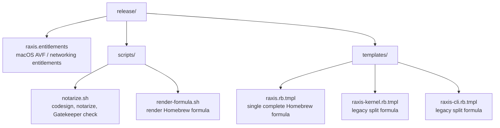
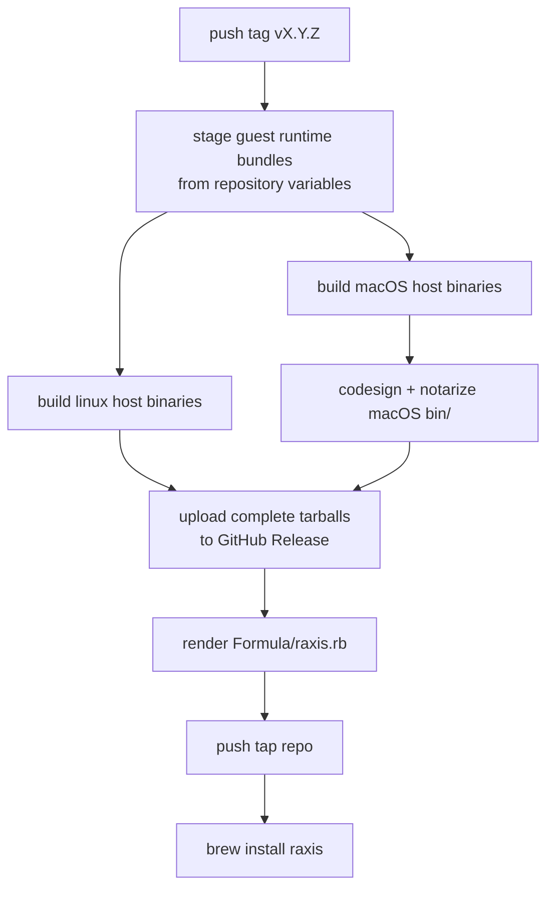

# `raxis/release/` — Release Assets

This directory holds the release templates and signing helpers used by
the tag-driven GitHub Actions pipeline. Normative reference:
[`raxis/specs/v2/release-and-distribution.md`](../specs/v2/release-and-distribution.md).



## Public Install Target

The intended operator path is:

```bash
brew tap chika5105/raxis
brew install raxis
brew services start raxis
```

The tap name above maps to the GitHub repository
`chika5105/homebrew-raxis`. If you choose a different tap repository,
set the release workflow repository variable `HOMEBREW_TAP_REPOSITORY`.

The rendered `raxis` formula installs a complete runtime bundle:

- host binaries: `raxis`, `raxis-cli`, `raxis-kernel`, role binaries, and
  `raxis-tproxy`
- signed canonical guest images under `#{pkgshare}/images`
- guest Linux kernel and validated config under `#{pkgshare}/kernel`
- a Homebrew service with `RAXIS_INSTALL_DIR=#{opt_pkgshare}`

That complete-bundle rule is intentional. A host-binary-only bottle can
install cleanly and then fail later when the kernel tries to spawn a VM.

## Required GitHub Setup

Repository secrets:

| Secret | Purpose |
| --- | --- |
| `RAXIS_KERNEL_SIGNING_KEY_HEX` | Public Ed25519 image-manifest trust anchor compiled into `raxis-kernel`. |
| `RAXIS_KERNEL_SIGNING_KEY_PRIV_HEX` | Private Ed25519 key used only to sign guest image manifests. |
| `APPLE_DEVELOPER_ID_APPLICATION_P12` | Base64-encoded Developer ID Application `.p12`. |
| `APPLE_DEVELOPER_ID_APPLICATION_PASSWORD` | Password for the `.p12`. |
| `APPLE_NOTARIZATION_API_KEY_ID` | App Store Connect API key id. |
| `APPLE_NOTARIZATION_API_KEY_ISSUER_ID` | App Store Connect issuer UUID. |
| `APPLE_NOTARIZATION_API_KEY_P8` | Base64-encoded App Store Connect `.p8` key. |
| `HOMEBREW_TAP_DEPLOY_KEY` | SSH private deploy key with write access to the tap repo. |

Repository variables:

| Variable | Purpose |
| --- | --- |
| `RAXIS_GUEST_BUNDLE_ARM64_URL` | URL to a tarball containing `images/` and `kernel/` for arm64 guests. |
| `RAXIS_GUEST_BUNDLE_ARM64_SHA256` | SHA-256 of the arm64 guest runtime bundle. |
| `RAXIS_GUEST_BUNDLE_X86_64_URL` | URL to a tarball containing `images/` and `kernel/` for x86_64 guests. |
| `RAXIS_GUEST_BUNDLE_X86_64_SHA256` | SHA-256 of the x86_64 guest runtime bundle. |
| `HOMEBREW_TAP_REPOSITORY` | Optional; defaults to `chika5105/homebrew-raxis`. |

Guest runtime bundle shape:

```text
images/
  raxis-orchestrator-core-<version>.img
  raxis-orchestrator-core-<version>.manifest.toml
  raxis-reviewer-core-<version>.img
  raxis-reviewer-core-<version>.manifest.toml
  raxis-executor-starter-<version>.img
  raxis-executor-starter-<version>.manifest.toml
  raxis-verifier-starter-<version>.img
  raxis-verifier-starter-<version>.manifest.toml
  raxis-verifier-symbol-index-<version>.img
  raxis-verifier-symbol-index-<version>.manifest.toml
kernel/
  vmlinux
  vmlinux.config
```

Build one locally with:

```bash
RAXIS_INSTALL_DIR=/tmp/raxis-guest-arm64 \
cargo xtask images bake \
  --target aarch64-unknown-linux-musl \
  --kernel-from-file /path/to/vmlinux-aarch64 \
  --kernel-config /path/to/vmlinux-aarch64.config \
  --no-cache

tar -C /tmp/raxis-guest-arm64 -czf raxis-guest-arm64.tar.gz images kernel
shasum -a 256 raxis-guest-arm64.tar.gz
```

Repeat with `--target x86_64-unknown-linux-musl` and an x86_64 guest
kernel for Intel Linux/macOS users.

## Local Formula Dry-Run

```bash
ZERO=$(printf '%64s' 0 | tr ' ' '0')
RAXIS_VERSION=0.1.0-dev \
RAXIS_DARWIN_ARM64_URL=https://example/raxis-darwin-arm64.tar.gz \
RAXIS_DARWIN_ARM64_SHA256=$ZERO \
RAXIS_DARWIN_X86_64_URL=https://example/raxis-darwin-x86_64.tar.gz \
RAXIS_DARWIN_X86_64_SHA256=$ZERO \
RAXIS_LINUX_ARM64_URL=https://example/raxis-linux-arm64.tar.gz \
RAXIS_LINUX_ARM64_SHA256=$ZERO \
RAXIS_LINUX_X86_64_URL=https://example/raxis-linux-x86_64.tar.gz \
RAXIS_LINUX_X86_64_SHA256=$ZERO \
release/scripts/render-formula.sh raxis
```

## Release Flow



The release workflow fails before publishing if the guest runtime bundle
variables are missing or if the downloaded bundle does not contain both
`images/` and `kernel/vmlinux`. That failure mode is deliberate: it is
better to stop a release than publish a Homebrew formula that cannot boot
planner VMs.
