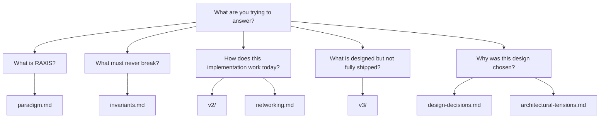

# RAXIS Specs

This directory is the normative side of the repository. Use the
guides when you want to operate RAXIS; use these specs when you need
to understand or change an invariant, state transition, storage
contract, or security boundary.

## Reading Order

| Need | Start Here |
|---|---|
| Product/paradigm definition | [`paradigm.md`](paradigm.md) |
| Production invariants | [`invariants.md`](invariants.md) |
| Current implementation contracts | [`v2/v2-deep-spec.md`](v2/v2-deep-spec.md), then the focused `v2/` specs and implemented `v3/` slices |
| Networking, gateways, DNS, egress | [`networking.md`](networking.md), [`v2/kernel-mediated-egress.md`](v2/kernel-mediated-egress.md), [`v2/vm-network-isolation.md`](v2/vm-network-isolation.md) |
| Historical v1 contracts | [`v1/`](v1/) |
| Forward-looking design slices | `v3/` specs whose header says `Specified`, `Deferred`, or `Exploratory` without companion code |
| Rationale and rejected alternatives | [`design-decisions.md`](design-decisions.md), [`architectural-tensions.md`](architectural-tensions.md) |

## Status Notes

`v2/` is the main implementation baseline for this repository now.
`v1/` remains useful for historical section anchors and original
contracts, but do not copy old CLI examples from it into operator
docs without checking the current code. `v3/` is mixed: some slices
are implemented or active production hardening work, while others
remain design input. Treat a `v3/` spec as current when its header
says `Implemented` or `Active`, or when it names the companion code
and invariant/test surface that ships today.

| V3 Slice | Current Reading |
|---|---|
| [`session-capture.md`](v3/session-capture.md) | Implemented dashboard/kernel post-mortem capture surface. |
| [`task-llm-capture.md`](v3/task-llm-capture.md) | Implemented per-task raw LLM turn capture surface. |
| [`worktree-snapshots.md`](v3/worktree-snapshots.md) | Active: kernel/GC storage landed; dashboard surface is called out in the spec status. |
| [`prompt-caching.md`](v3/prompt-caching.md) | Active provider dispatch behavior. |
| [`canonical-image-trust-anchor.md`](v3/canonical-image-trust-anchor.md) | Active fail-loud image trust-anchor contract. |
| [`otel-observability.md`](v3/otel-observability.md) and [`observability-prometheus.md`](v3/observability-prometheus.md) | Active observability pipeline: kernel ring exporter, `raxis-otel-pusher`, and dev/perf Prometheus + Grafana stack. |
| [`live-e2e-keep-alive.md`](v3/live-e2e-keep-alive.md) | Implemented dev/test post-mortem keep-alive control. |
| [`audit-retention.md`](v3/audit-retention.md), [`gdpr-audit-erasure.md`](v3/gdpr-audit-erasure.md), and other non-active V3 docs | Design/deferred unless the header says otherwise. |

Some older design specs use `policy push` as shorthand for a future
single-command policy deployment surface. The current operator flow is
explicit: sign or stage the policy artifact, then run
`raxis epoch advance --policy <path> --sig <path>`.
