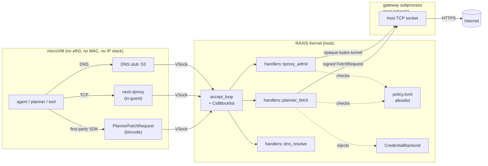

# RAXIS Networking — Operator's Summary

> **Audience.** Operators, security reviewers, and engineers who want
> an accurate ten-minute mental model of how a RAXIS microVM reaches
> (and is prevented from reaching) the outside world. This is a
> SUMMARY: every section ends with a deep-link to the canonical
> normative spec.
>
> **Companion specs.** This document points into the V2 spec corpus.
> The canonical normative homes are
> [`v2/airgap-architecture.md`](v2/airgap-architecture.md) (the
> universal-airgap egress model) and
> [`v2/v2-deep-spec.md`](v2/v2-deep-spec.md) §1.3 / Step 15 / Step 16
> (the VM-isolation and CID-allowlist decisions). Invariants live in
> [`invariants.md`](invariants.md) §11.8a.

---

## 1. TL;DR

Five bullets an operator can quote:

1. **No NICs, ever.** Every RAXIS microVM (Orchestrator, Executor,
   Reviewer) boots without any virtio-net device. The guest kernel
   has no `eth0`, no MAC, no IP stack reachable to the outside world,
   no DNS resolver of its own. There is no firewall — the network
   device is structurally absent.
2. **One wire out, and it's not a network.** The single channel
   leaving any VM is `AF_VSOCK` over the hypervisor's virtio memory
   bus. VSock is a `SOCK_STREAM` of raw bytes between guest and host
   — it knows nothing about TCP, IP, or HTTP.
3. **Two egress paths, both kernel-mediated.** First-party planner
   code uses the **Bincode IPC path** (`PlannerFetchRequest` →
   kernel → gateway → internet). In-VM tools that only speak TCP use
   the **transparent proxy path** (`raxis-tproxy` + iptables redirect
   → `TproxyAdmissionRequest` → kernel → opaque-bytes tunnel).
4. **Identity is a per-session bearer token, the CID is the
   transport.** The kernel mints a `SessionToken` at spawn time and
   stamps it into the guest; every IPC frame carries it and the
   kernel re-validates against the `sessions` table. The
   hypervisor-assigned VSock CID is what the kernel's `accept()` loop
   admits or blocklists, and it is persisted so VMs can reconnect
   across kernel hot-restart.
5. **Policy + paired audit are the gate.** Every admission decision
   matches the request against the operator's signed `policy.toml`
   allowlist, strips planner-supplied auth headers, injects the
   kernel-held credentials, and emits an audit row **before** the
   response goes back to the guest. A compromised planner cannot scan
   networks, leak via DNS, or exfiltrate through unobserved channels
   because there is no second path.

---

## 2. Why no NICs?

The threat model treats the planner as adversarial — prompt
injection, alignment failure, supply-chain compromise of an Executor
tool. A VM with a NIC and an "egress firewall" is vacuous against
that adversary: DNS query names are unbounded data, even an empty
firewall ruleset leaks reachability via scanning, ICMP/NTP/IPv6 are
covert channels, and a planner that crafts its own HTTP can smuggle
`Authorization` headers or bypass URL allowlists via redirects.

RAXIS picks the structurally-stronger guarantee: **remove the
network device entirely**. With no `eth0`, no resolver, and no IP
stack, the agent has nothing to scan, nothing to query, and nothing
to smuggle. The single byte path off the VM is a non-routable
hypervisor memory bus arbitrated entirely by the host kernel.
Decision narrative: [`v2/v2-deep-spec.md`](v2/v2-deep-spec.md) §1.3
("Network isolation INV-NETISO-01 family"). Formal invariants:
[`invariants.md`](invariants.md) §11.8a.

---

## 3. The VSock chokepoint

`AF_VSOCK` is a Linux socket family designed for hypervisor-to-guest
communication. At the OS level it is functionally a Unix domain
socket: a reliable `SOCK_STREAM` of raw bytes between two endpoints
identified by a `(CID, port)` pair. It does not know what an IP
address, TCP handshake, or HTTP header is. The transport rides
directly on the hypervisor's virtio memory bus — no NIC, no virtual
switch, no TUN/TAP.

**Hypervisor backings.** RAXIS supports two microVM substrates:

| Host  | VMM                                    | VSock backing                       | Code                                          |
|-------|----------------------------------------|-------------------------------------|-----------------------------------------------|
| macOS | Apple Virtualization Framework (AVF)   | `VZVirtioSocketDevice`              | `raxis/crates/isolation-apple-vz/`            |
| Linux | Firecracker (rust-vmm, KVM-backed)     | `vhost-vsock` over a UDS multiplexer | `raxis/crates/isolation-firecracker/`         |

Both substrates produce a NIC-less guest for *any* `EgressTier` —
the macOS path returns no `network` field at all, and the Linux path
omits the Firecracker `PUT /network-interfaces` call entirely. Parity
is verified by
[`v2/isolation-platform-parity.md`](v2/isolation-platform-parity.md);
the Linux substrate is specified in
[`v2/isolation-linux-microvm.md`](v2/isolation-linux-microvm.md).

The host CID is always `2` (`VMADDR_CID_HOST`); per-session guest
CIDs start at `3` and are assigned by the substrate at spawn time.
See `raxis/crates/isolation/src/lib.rs` for the `EgressTier` enum
and `VmSpec.vsock_cid` field.

**End-to-end picture.**



The diagram captures the structural property that makes the rest of
the model defensible: **every guest-originated byte funnels into a
kernel-side handler that authenticates the session token and audits
before responding**.

Canonical home: [`v2/airgap-architecture.md`](v2/airgap-architecture.md) §2.

---

## 4. The two egress paths

V2 ships exactly two guest-originated egress shapes. Both ride the
same VSock chokepoint; they differ in how the request is framed.

### 4.1 Bincode IPC path (`EgressTier::None`)

The canonical, default path for first-party RAXIS code (the planner
SDK's `ModelClient`, the planner's WebFetch / WebSearch tools). The
wire shape is **strict Bincode IPC** — no raw HTTP ever crosses the
VSock boundary.

1. The agent's SDK intercepts the would-be HTTP call, extracts URL +
   method + headers + body, and packages them into a
   `PlannerFetchRequest` (`raxis/crates/types/src/planner_fetch.rs`).
2. The struct is bincode-serialized and written as a length-prefixed
   frame to the per-session VSock channel.
3. The kernel's accept loop (`raxis/kernel/src/ipc/server.rs`)
   bincode-decodes the frame. **A frame that fails to decode causes
   the kernel to drop the connection** — an attacker who wrote a raw
   `GET / HTTP/1.1` over the VSock fd would never reach any handler.
4. `handlers::planner_fetch::handle`
   (`raxis/kernel/src/handlers/planner_fetch.rs`) resolves the
   `session_token`, runs the `(role, fetch_kind)` matrix (Reviewer +
   DataFetch is denied; everything else is admitted), clamps the
   timeout, and forwards a `GatewayMessage::FetchRequest` to the
   gateway subprocess over the kernel-private UDS at
   `<data_dir>/sockets/gateway.sock` (mode `0600`, owned by the
   kernel UID).
5. The gateway re-validates the URL against the operator-signed
   `policy.toml` allowlist (`is_url_allowed`), opens a real
   TCP/HTTPS connection from the host's actual network interface,
   and returns the response back up the same chain.

The kernel substitutes its own `gateway_token` for the planner's
`session_token` (the planner has no gateway authority — see
`raxis/crates/types/src/planner_fetch.rs:13`).

Code home: `raxis/kernel/src/gateway/` (in-process supervisor + embedded
mode + REST client). The historical narrative for why this path
exists when the in-VM tproxy can also do TCP lives in the
(now-deprecated)
[`v2/kernel-mediated-egress.md`](v2/kernel-mediated-egress.md); use
it for context only. The normative model is
[`v2/airgap-architecture.md`](v2/airgap-architecture.md) and
[`v2/v2-deep-spec.md`](v2/v2-deep-spec.md) §Part 7 (the *Unified
Egress* decision).

### 4.2 Transparent proxy path (`EgressTier::Mediated`)

For tools that only speak standard TCP/IP (`curl`, `npm`, `git`,
`pip`, custom binaries), RAXIS uses an in-VM transparent proxy:

1. The agent runs `curl https://api.github.com`.
2. The VM's OS generates standard TCP packets for the resolved IP.
3. `iptables -t nat -A OUTPUT -p tcp ! -d 127.0.0.1/32 -j REDIRECT
   --to-port 3129` (installed at PID 1 by
   `raxis/crates/planner-core/src/guest_init.rs`) silently
   intercepts those packets and redirects them to the local
   `raxis-tproxy` listener.
4. `raxis-tproxy` (`raxis/tproxy/src/linux.rs`) peeks the SNI for
   TLS or the `Host:` header for plaintext HTTP, captures the
   original destination via `SO_ORIGINAL_DST`, and sends a
   `TproxyAdmissionRequest { session_token, sni, host_header,
   destination, protocol }` over a separate VSock channel.
5. `handlers::tproxy_admit::handle`
   (`raxis/kernel/src/handlers/tproxy_admit.rs`) authenticates the
   `session_token`, matches `(SNI ∨ Host)` against the active
   policy bundle's `effective_egress_domains` /
   `effective_egress_patterns`, **emits a paired
   `TproxyAdmissionGranted` or `TproxyAdmissionDenied` audit row
   *before* responding** (per `INV-AUDIT-TPROXY-ADMIT-01`), and on
   Admit mints a single-use `(tunnel_id, tunnel_token)` registered
   in the in-memory `TunnelRegistry`.
6. `raxis-tproxy` opens a *second* VSock connection to the kernel's
   tunnel listener, presents `(tunnel_id, tunnel_token)`, and then
   blindly streams raw TCP bytes through. The kernel
   `copy_bidirectional`s those bytes against the upstream TCP socket
   it opened on the guest's behalf.

DNS gets the same treatment: `/etc/resolv.conf` is rewritten to
`nameserver 127.0.0.1`, an in-guest stub forwards every query as a
`DnsResolveRequest`, and the kernel emits a `DnsResolveRequested`
audit event for every name asked about (`INV-NETISO-A3-DNS-MEDIATED-01`,
`INV-AUDIT-DNS-RESOLVE-01`).

### 4.3 What about `EgressTier::Tier1Tproxy`?

The legacy `Tier1Tproxy` variant (virtio-net + NAT + in-guest
iptables REDIRECT) is **already gone**. The current `EgressTier` enum
at `raxis/crates/isolation/src/lib.rs:237` ships three values —
`None`, `Mediated`, and the V3-placeholder `Tier2CredProxy`:

> *"After the Tier1Tproxy deletion (parent-tracked TODO
> `tier1-deletion-fold-into-cleanup-sweep`)... Mediated is no longer
> opt-in."* — `crates/isolation/src/lib.rs:222–245`

Audit chains written before the deletion still carry the string
`"Tier1Tproxy"` in the stringly-typed `SessionVmSpawned.egress_tier`
field; back-compat is via the audit-tools verifier reading the field
as `String`, not by re-introducing the enum variant. Historical
admission contract: [`v2/vm-network-isolation.md`](v2/vm-network-isolation.md).
Deletion narrative: [`v2/airgap-architecture.md`](v2/airgap-architecture.md)
§1 and §6.

---

## 5. Identity & spoofing prevention

There are two layers of identity at the VSock boundary, and they do
different jobs:

### 5.1 The CID admission layer (transport)

VSock connections are identified by a `(CID, port)` pair. The host
CID is reserved as `2`; each guest gets a unique `vsock_cid`
assigned by the substrate at spawn time and persisted into the
`sessions` table (`ALTER TABLE sessions ADD COLUMN vsock_cid
INTEGER` — Step 16 of
[`v2/v2-deep-spec.md`](v2/v2-deep-spec.md)). On every hot-restart
the kernel re-hydrates the CID allowlist from durable state *before*
it opens its VSock listener, so legitimate VMs reconnect seamlessly
while rogue host processes are dropped at `accept()`.

The kernel also keeps a defensive `CidBlocklist`
(`raxis/kernel/src/ipc/cid_blocklist.rs`): any CID that sends a
malformed pre-auth frame is added, and subsequent connection
attempts from that CID are dropped before any bytes are
deserialized. CIDs `1` (`VMADDR_CID_LOCAL`), `2` (`VMADDR_CID_HOST`),
and `0xFFFFFFFF` (`VMADDR_CID_ANY`) are defensively rejected by
`insert` so the operator cannot accidentally lock the host out of
its own kernel. Decision narrative: Step 15 of
[`v2/v2-deep-spec.md`](v2/v2-deep-spec.md).

### 5.2 The session-token authority layer (per-frame)

Once a VSock connection is accepted, the per-message authority
binding is the **`session_token`** — a kernel-minted opaque bearer
secret stamped into the guest at spawn time (`SessionToken` in
`raxis/crates/isolation/src/lib.rs:269`). Every IPC frame the
planner sends carries this token; the kernel calls
`get_session_by_token` per frame and a mismatch returns
`FAIL_SESSION_TOKEN_MISMATCH`.

> **Honest divergence note.** An earlier framing of this doc
> described identity as being verified "using the
> hypervisor-assigned `vsock_cid`". The actual implementation uses
> *both* layers: the CID is the transport admission identifier and
> the blocklist key (Step 15 / Step 16); the `session_token` is the
> per-frame authority binding `handlers::planner_fetch` and
> `handlers::tproxy_admit` re-validate (see
> `raxis/kernel/src/handlers/planner_fetch.rs:128–141` and
> `raxis/kernel/src/handlers/tproxy_admit.rs:203–228`). A
> compromised guest cannot spoof another session's CID (it is
> hypervisor-assigned, not guest-controlled) and cannot spoof
> another session's token (it never sees one).

---

## 6. Policy enforcement

Both admission handlers run the same conceptual checklist:

1. **Authenticate.** Resolve `session_token` against the active
   `sessions` row; reject mismatches with `FAIL_SESSION_TOKEN_MISMATCH`.
2. **Authorize.** Match the request against the policy bundle's
   *effective* allowlist: URL host vs `policy.[egress] domains` /
   `[egress] patterns` (exact / suffix / prefix glob — see
   `host_allowed_against_lists` in
   `raxis/kernel/src/handlers/tproxy_admit.rs:456`); method against
   the per-host `allowed_methods` list (Bincode IPC) or protocol
   surface (Mediated). The "effective" allowlist is the *union* of
   operator-declared entries plus implicit `[[providers]]` grants —
   declaring an Anthropic provider auto-grants `*.anthropic.com`
   ([`v2/reviewer-egress-defaults-decision.md`](v2/reviewer-egress-defaults-decision.md),
   `INV-EGRESS-DEFAULT-01..03`).
3. **Strip.** The Bincode IPC path discards any `Authorization` /
   provider-specific auth headers the planner attached — the planner
   never had a real provider credential, so any such header is
   adversarial.
4. **Inject.** The kernel resolves the operator-stored credential via
   `Arc<dyn CredentialBackend>::resolve(...)` from kernel address
   space and injects it into the gateway-bound request. Credential
   bytes never enter the VM
   ([`v2/credential-proxy.md`](v2/credential-proxy.md) §1,
   `INV-SECRET-02 / INV-SECRET-04`).
5. **Audit.** Both paths emit a paired audit row *before* the
   response is written (`INV-AUDIT-TPROXY-ADMIT-01`,
   `INV-AUDIT-DNS-RESOLVE-01`). An audit-emit failure on the tproxy
   path returns `Deny { reason: "FAIL_AUDIT_EMIT" }` so a guest
   never observes an unobserved admission.
6. **Dispatch.** Only on Admit does the kernel forward: the gateway
   subprocess opens the upstream HTTPS connection (Bincode IPC), or
   the kernel opens a raw TCP socket and registers a single-use
   32-byte `tunnel_token` for the guest's subsequent VSock dial
   (Mediated).

`TproxyAdmissionGranted` records `(session_id, host_or_sni,
original_dst_ip, original_dst_port, protocol, tunnel_id)`; the
Bincode IPC path records `(session_id, request_id, url,
status_code, latency_ms)`. Both anchor into the hash-chained audit
log (`INV-04`) and are replayable (`INV-05`).

### 6.1 Per-protocol credential-proxy substrate (at a glance)

The "Inject" step above never lets the credential bytes enter the VM.
The proxies speak each upstream's wire on the host (see
[`v2/credential-proxy.md`](v2/credential-proxy.md) for the normative
spec and [`v2/proxy-table-allowlists.md`](v2/proxy-table-allowlists.md)
for the SQL/BSON-walking allowlist model). Below is the shipped
substrate as of V2.5:

| `proxy_type` | Wire shape the proxy speaks                                                                 | What the proxy enforces (beyond "agent never sees the secret")                                                                                                            | V2 status                                                          |
|--------------|---------------------------------------------------------------------------------------------|---------------------------------------------------------------------------------------------------------------------------------------------------------------------------|--------------------------------------------------------------------|
| `postgres`   | `StartupMessage` → `AuthenticationOk` → simple-/extended-query                              | SQL parser walks every query; rejects statements touching tables outside `[tasks.credentials.restrictions] allowed_tables` ([`v2/proxy-table-allowlists.md`](v2/proxy-table-allowlists.md)).              | Real upstream forwarding shipped (V2.4 `T1-2`).                    |
| `mysql`      | `HandshakeV10` → `HandshakeResponse41` (discarded) → `OK_Packet`; loops `COM_QUERY/STMT_*`  | Same SQL allowlist enforcement on every `COM_QUERY` / prepared-statement payload; rejects with a MySQL `ERR_Packet`.                                                      | Real upstream forwarding shipped (V2.4).                           |
| `mssql`      | TDS `PRELOGIN` → `LOGIN7` (discarded) → `LOGINACK`; loops `SQLBatch` (UTF-16 LE)            | Per-batch SQL classification + table allowlist; rejects with a TDS `ERROR` token.                                                                                         | Real upstream forwarding shipped (V2.4).                           |
| `mongodb`    | `OP_MSG` (op code 2013); SCRAM-SHA-256 to upstream                                          | `restriction::Restrictions::is_blocked` walks each command document; blocked ops return `{ok:0, code:13, codeName:"Unauthorized"}` — drivers see a clean `MongoServerError`. | Real upstream forwarding shipped (V2.5 `§2.2`).                    |
| `redis`      | RESP2 (RESP3 / `HELLO` accepted, downgraded to RESP2)                                       | Per-command allow/deny against a configured command-allowlist; proxy issues `AUTH <kernel-creds>` against the upstream when it dials.                                     | Real upstream forwarding shipped (audit upgrade in `0cf013e`).     |
| `smtp`       | RFC 5321 line-buffered: `EHLO`/`HELO` / `MAIL FROM` / `RCPT TO` / `DATA` / `.` / `QUIT`     | `RCPT TO` domain allowlist; `MAIL FROM` validation; proxy issues `AUTH PLAIN`/`LOGIN` to the upstream relay. Inbound listener does NOT advertise STARTTLS (proxy owns both ends). | Real upstream forwarding shipped (V2.4).                           |
| `http`       | HTTP/1.1 to a single policy-pinned upstream URL                                             | Method + path allowlist against the pinned upstream; injects `Authorization: Bearer <kernel-resolved>` (or Basic / SigV4 / IMDS via `AuthMode`); rewrites `Host`.         | Generic Bearer ships; per-cloud `AuthMode` variants for k8s + cloud SDKs. |
| `aws`        | IMDS HTTP/1.1 — agent SDK reads `AWS_CONTAINER_CREDENTIALS_FULL_URI` and dials the proxy   | Returns kernel-resolved STS-shaped JSON (`{AccessKeyId, SecretAccessKey, Token, Expiration, RoleArn}`); the SDK's signed AWS calls then leave through the `http` proxy with method/host enforcement. | Shipped.                                                          |
| `azure`      | IMDS HTTP/1.1 with mandatory `Metadata: true` header (169.254.169.254 → 127.0.0.1)         | Returns kernel-resolved AAD token JSON; downstream Azure SDK calls likewise leave via `http` proxy.                                                                       | Shipped.                                                          |
| `gcp`        | `metadata.google.internal` HTTP/1.1 with mandatory `Metadata-Flavor: Google` header         | Returns kernel-resolved access token; downstream Google API calls likewise leave via `http` proxy.                                                                       | Shipped.                                                          |

Two structural notes that apply across the table:

1. **No upstream credential ever transits the VM.** The agent only ever
   sees a localhost socket. Even `aws` / `azure` / `gcp` — where the
   "credential" the SDK reads IS a token — return a *short-lived
   kernel-issued* token shape; the long-lived signing key never leaves
   the host. The `http` proxy then re-injects `Authorization` on each
   downstream call, scoped to the per-task policy
   (`INV-SECRET-02 / INV-SECRET-04`).
2. **All ten proxies share one observability surface.** Every accepted
   command emits a `CredentialProxyCommandAdmitted` audit row with
   `(session_id, proxy_type, command_summary, latency_ms)`; every
   rejected command emits `CredentialProxyCommandDenied` with the
   structured reason (e.g. `table_not_in_allowlist`). The same audit
   row drives the dashboard's per-session "Credentials" tab and the
   `EgressStallTracker` (repeated denies trip
   `INV-EGRESS-STALL-01`).

---

## 7. What an attacker inside the VM cannot do

| Attack                                                       | Why it's structurally impossible                                                                                       |
|--------------------------------------------------------------|------------------------------------------------------------------------------------------------------------------------|
| Open a raw socket to `8.8.8.8:53` for DNS exfil              | No virtio-net device — the guest kernel has no interface that routes IPv4 packets off the VM (`INV-NETISO-A3-UNIVERSAL-NO-NIC-01`). |
| Port-scan a private subnet                                   | Same: no NIC, no IP stack reachable to the outside world. Loopback is the only interface that exists.                 |
| DNS-tunnel data via a query name                             | `resolv.conf` is pinned to `127.0.0.1`; the in-guest stub forwards every query to the kernel as a `DnsResolveRequest`; every name is audited; the resolved IP still has to clear `tproxy_admit` (`INV-NETISO-A3-DNS-MEDIATED-01`, `INV-AUDIT-DNS-RESOLVE-01`). |
| Reach loopback IPv6 to bypass an IPv4-only iptables rule     | PID 1 writes `1` to `disable_ipv6` for `all`/`default`/`lo` at boot (`INV-NETISO-A3-IPV6-DISABLED-01`).               |
| Write raw HTTP `GET ...\r\n` to the VSock fd                 | The kernel's frame reader is a bincode parser; a non-bincode frame fails to decode and the connection is dropped — no handler ever sees the bytes. |
| Forge a `PlannerFetchRequest` for another session            | Every frame carries `session_token`, re-validated against the `sessions` table; wrong/expired/revoked → `FAIL_SESSION_TOKEN_MISMATCH`. Per-spawn, never re-used. |
| Spoof another guest's CID                                    | The CID is hypervisor-assigned at spawn and persisted in `sessions.vsock_cid`; the guest cannot rewrite it. The `CidBlocklist` drops misbehaving CIDs (Step 15). |
| Smuggle an `Authorization:` header past credential injection | The kernel's gateway client builds the upstream request from the validated `(method, url, body)` tuple and injects the operator-signed credential server-side; planner-supplied auth headers are not propagated (`INV-SECRET-04`). |
| Bypass the proxy and dial the real upstream `host:port`      | There is no NIC. The agent's TCP socket has nowhere to go except into the iptables REDIRECT pointing at the in-guest tproxy, which MUST get an Admit from the kernel. Bypass attempts surface as `TransparentProxyDenied { reason: "proxy_target_bypass" }` ([`v2/transparent-proxy-validation.md`](v2/transparent-proxy-validation.md)). |
| Race the kernel hot-restart window to slip in a rogue CID    | The kernel rebuilds the CID allowlist from `sessions.vsock_cid` *before* opening its VSock listener (Step 16).         |
| Stall on a denied host without the operator noticing         | Repeated `DomainNotAllowed` rejections feed the `EgressStallTracker`; threshold trip emits `SessionEgressStallDetected` (`INV-EGRESS-STALL-01`). |
| Read a database column the operator never authorized         | Credential proxies walk SQL/BSON and reject queries touching tables outside `[tasks.credentials.restrictions] allowed_tables` ([`v2/proxy-table-allowlists.md`](v2/proxy-table-allowlists.md)). |

---

## 8. Operator's-eye view

A minimal `policy.toml`. The provider block auto-grants the provider
FQDN under `[egress]`; the `[egress]` block adds a tproxy host the
Executor needs (a package registry); the per-task block mounts a
credential proxy that never lets the bytes into the VM.

```toml
# ─── Provider (auto-grants api.anthropic.com under [egress]) ──
[[providers]]
kind             = "Anthropic"
credential_name  = "anthropic-prod"
default_model    = "claude-3-5-sonnet-20241022"

# ─── Transparent-proxy / kernel-admission allowlist ───────────
[egress]
domains  = ["registry.npmjs.org", "files.pythonhosted.org"]
patterns = ["*.githubusercontent.com"]

# ─── Per-task credential-proxy mount (no bytes ever in VM) ────
[[tasks]]
task_name            = "service-round-trip"
session_agent_type = "Executor"

  [[tasks.credentials]]
  credential_name = "db-prod"
  mount_as        = "DATABASE_URL"
  proxy_type      = "postgres"

    [tasks.credentials.restrictions]
    allow_only_select  = true
    allowed_tables     = ["public.events", "public.users_metadata"]
    max_rows_per_query = 10_000
```

The full operator recipe (cargo / npm / pip / git host lists, the
live-e2e harness that tests it) lives at
[`raxis/guides/operator/21-airgap-a3-egress-allowlist.md`](../guides/operator/21-airgap-a3-egress-allowlist.md). What
`credential_name` resolves to, where the bytes live
(`~/.config/raxis/credentials/<name>.env`, `0600` by default), and
how to swap in Vault / AWS Secrets Manager / HSM behind the
`CredentialBackend` trait is [`v2/credential-proxy.md`](v2/credential-proxy.md)
§1 and §11; the broader doctrine is
[`v2/secrets-model.md`](v2/secrets-model.md).

---

## 9. Where to read deeper

Specs:

- [`v2/airgap-architecture.md`](v2/airgap-architecture.md) — **canonical
  normative home** for the universal-airgap model; Path A3 wire
  protocols, in-guest enforcement, substrate config.
- [`v2/v2-deep-spec.md`](v2/v2-deep-spec.md) §1.3 / Step 15 / Step
  16 — VM-isolation / no-NIC decision, pre-auth CID blocklist,
  CID persistence across kernel hot-restart.
- [`v2/kernel-mediated-egress.md`](v2/kernel-mediated-egress.md) —
  **deprecated**; historical context for why the Bincode IPC path
  exists and why `IntentKind::EgressRequest` was rejected.
- [`v2/transparent-proxy-validation.md`](v2/transparent-proxy-validation.md) —
  the contract proving stock client libraries work against
  credential proxies AND that there is no bypass path.
- [`v2/proxy-table-allowlists.md`](v2/proxy-table-allowlists.md) —
  per-credential `allowed_tables` / `allowed_collections` /
  `max_rows_per_query` at the SQL/BSON walker.
- [`v2/credential-proxy.md`](v2/credential-proxy.md) — the Tier-2
  authenticated-egress proxy substrate (postgres, mysql, mssql,
  mongodb, redis, smtp, http, k8s, aws, gcp, azure) and the
  `CredentialBackend` trait boundary.
- [`v2/secrets-model.md`](v2/secrets-model.md) — five-rule
  doctrine on what RAXIS treats as secret material.
- [`v2/isolation-linux-microvm.md`](v2/isolation-linux-microvm.md) —
  Linux Firecracker substrate (VMM choice, boot path, KVM,
  `vhost_vsock`, no `PUT /network-interfaces`).
- [`v2/isolation-platform-parity.md`](v2/isolation-platform-parity.md) —
  AVF vs Firecracker parity matrix.
- [`v2/reviewer-egress-defaults-decision.md`](v2/reviewer-egress-defaults-decision.md) —
  implicit `[[providers]]` egress grants and the
  `EgressStallTracker`.
- [`v2/vm-network-isolation.md`](v2/vm-network-isolation.md) —
  historical Tier-1 admission contract the A3 model generalised.
- [`invariants.md`](invariants.md) §11.8a — formal A3 invariants
  (`INV-NETISO-A3-UNIVERSAL-NO-NIC-01`,
  `INV-NETISO-A3-VSOCK-CHOKEPOINT-01`,
  `INV-NETISO-A3-DNS-MEDIATED-01`,
  `INV-NETISO-A3-IPV6-DISABLED-01`,
  `INV-AUDIT-TPROXY-ADMIT-01`,
  `INV-AUDIT-DNS-RESOLVE-01`); §1 for the v1 ancestors `INV-02A`
  / `INV-02B`; §11.X for `INV-SECRET-01..05`.

Code:

- `raxis/kernel/src/handlers/planner_fetch.rs` — Bincode IPC egress
  admission.
- `raxis/kernel/src/handlers/tproxy_admit.rs` — transparent-proxy
  admission + `TunnelRegistry`.
- `raxis/kernel/src/ipc/cid_blocklist.rs` — pre-auth CID blocklist.
- `raxis/kernel/src/ipc/server.rs` — `accept_planner_loop` and the
  bincode frame reader that drops malformed frames.
- `raxis/kernel/src/gateway/` — kernel-side gateway client / supervisor
  / embedded mode (the host process that opens upstream HTTPS).
- `raxis/crates/isolation/src/lib.rs` — `EgressTier`, `VmSpec`,
  `SessionToken`.
- `raxis/crates/isolation-apple-vz/`,
  `raxis/crates/isolation-firecracker/` — substrates that produce a
  NIC-less guest for every tier.
- `raxis/crates/credential-proxy-*` — per-upstream credential
  proxies (postgres, mysql, mssql, mongodb, redis, smtp, http, k8s,
  aws, gcp, azure).
- `raxis/crates/types/src/planner_fetch.rs`,
  `raxis/crates/types/src/tproxy.rs` — wire-shape definitions.
- `raxis/tproxy/src/linux.rs` — in-guest `raxis-tproxy`.
