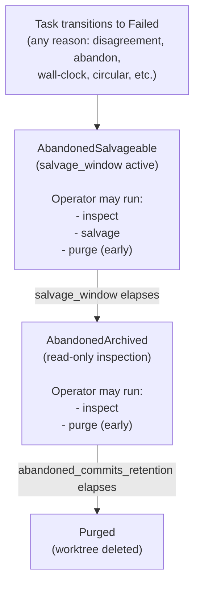

# RAXIS V2 — Agent Disagreement and Non-Convergence Bounds

> **Status:** V2 Specified
> **Audience:** Operators configuring `plan.toml` for multi-agent initiatives, implementers of the kernel's task lifecycle and escalation routing, contributors adding new escalation classes.
> **Cross-references:**
> - [`specs/v2/v2-deep-spec.md`](v2-deep-spec.md) — hierarchical orchestration model (Orchestrator / Executor / Reviewer roles)
> - [`specs/v2/integration-merge.md`](integration-merge.md) — `IntegrationMerge` is unchanged by this spec; sub-task `CompleteTask` admission (a different handler) gains `FAIL_CIRCULAR_REVISION` and gates whether sub-tasks ever reach the merge pipeline
> - [`specs/v2/kernel-push-protocol.md`](kernel-push-protocol.md) — push delivery for the new `SubEscalationResolutionRequired` variant routed to the Orchestrator session
> - [`specs/v2/host-capacity.md`](host-capacity.md) — disk and worktree quota interaction with abandoned-worktree retention
> - [`specs/v2/provider-failure-handling.md`](provider-failure-handling.md) — distinct failure mode (provider unavailable vs. agent disagreement); this spec does not change provider handling
> - [`specs/paradigm.md`](../paradigm.md) — `R-5` (Bounded Capabilities), `R-6` (Fail-Closed Default), `R-12` (Out-of-Band Escalation) — the paradigm invariants this spec enforces

---

## 1. The Problem

Multi-agent initiatives in V2 introduce a failure mode V1 did not have: agents that disagree without converging. The two canonical loops:

**Loop A — Reviewer-rejection loop.** Executor produces commit `A`; Reviewer rejects with critique; Executor revises to commit `B`; Reviewer rejects; Executor revises to commit `C`; etc. Each round consumes one Executor `InferenceRequest` (typically large — full task context plus rejection critique), one Reviewer `InferenceRequest` (critique generation), and zero or more verifier runs (gates re-execute on each new commit). Disk space accumulates in the worktree; budget consumes silently.

**Loop B — Orchestrator/Executor task-interpretation disagreement.** Orchestrator delegates a sub-task; Executor escalates "interpretation unclear"; Orchestrator amends; Executor escalates again. Less common because escalation has stronger gating, but possible.

**Loop C — Pathological self-loop.** Single-Executor task where the Executor produces the same diff repeatedly, expecting different acceptance behavior, with no Reviewer involved (e.g., a `CompleteTask` that fails path-allowlist checks; the Executor "fixes" by rewriting unchanged code).

Without explicit bounds, these loops consume resources until something hard fires — typically the per-task `total_tokens` ceiling, the per-session `total_tokens` ceiling, or the host disk quota. By the time a hard ceiling fires, the operator has paid for many rounds of unproductive work and the audit log is bloated with repeated content.

This spec defines five mechanisms that bound non-convergence earlier and more explicitly than budget exhaustion alone. Together they ensure that argument loops terminate within operator-configured limits and that abandoned work is preserved for forensic review and selective salvage.

### 1.1 What this spec does NOT do

- **It does not arbitrate disagreements.** The kernel does not decide who is "right." The paradigm view (`paradigm.md` R-12) is that disagreement at the intelligence layer is a coordination failure; the authority layer's job is to bound the resource consumption and surface the failure to a principal authorized to resolve it.
- **It does not replace budget enforcement.** The existing limit cascade (per-request token caps, per-task `total_tokens`, per-session `total_tokens`, budget lanes, `INV-04` financial ceiling) remains the structural ground truth. This spec adds finer-grained limits that fire before budget exhaustion in the common loop patterns.
- **It does not address provider-side failures.** Provider unavailability, rate limiting, and circuit breakers are covered by [`provider-failure-handling.md`](provider-failure-handling.md). A loop caused by a flaky provider is a different failure shape than a loop caused by agent disagreement.
- **It does not introduce semantic disagreement-resolution.** No "third reviewer breaks the tie" mechanism is specified. Operators wanting tie-breaking add reviewers in `plan.toml`; the kernel only counts.

---

## 2. The Existing Limit Cascade (Recap)

For grounding, this is the V2 limit hierarchy already established by other specs. New mechanisms in §3–§7 fire earlier than these.

| Order | Limit | Granularity | Configured in | Behavior on hit | Reference |
|---|---|---|---|---|---|
| L1 | Per-request `max_input` / `max_output` | Single inference call | `plan.toml [plan.tasks.X.token_limit]` | `FAIL_TOKEN_LIMIT_EXCEEDED`; specific request fails | v2-deep-spec |
| L2 | Per-task `total_tokens` | Task | `plan.toml [plan.tasks.X.token_limit]` | Configured `limit_behavior`: `fail_request` / `escalate` / `fail_session` | v2-deep-spec |
| L3 | Per-session `total_tokens` | Session | `plan.toml [plan.token_limit]` | Session-scope `limit_behavior` | v2-deep-spec |
| L4 | Budget lane admission units | Lane (shared across tasks/sessions) | `policy.toml × plan.toml [budget_lane]` | `FAIL_BUDGET_EXHAUSTED`; lane frozen until operator extends | v2-deep-spec |
| L5 | `INV-04` financial ceiling | Operator | `policy.toml` | Hard halt across all initiatives for that operator | invariants |
| L6 | Escalation TTL (default 7d) | Escalation | `policy.toml [escalations]` | Session fails as `FAIL_ESCALATION_TIMEOUT` | v2-deep-spec |
| L7 | Host capacity caps (disk, FD, worktree quota) | Host | `policy.toml [host_capacity]` | `halt_admit` per [`host-capacity.md`](host-capacity.md) | host-capacity |

The mechanisms below insert at order L1.5 to L1.8 — between per-request and per-task budget. They give operators visibility and intervention windows before money is spent on stuck loops.

| Order | New mechanism | Granularity | Reference |
|---|---|---|---|
| L1.5 | Circular revision detection | Per task | §4 |
| L1.6 | Per-task `max_review_rounds` | Per task | §3 |
| L1.7 | Per-task `wall_clock_limit` | Per task | §5 |
| L1.8 | Two-tier escalation routing (Orchestrator-first) | Per escalation | §6 |
| L0 (orthogonal) | Abandoned-worktree retention and salvage | Per failed task | §7 |

---

## 3. Per-Task `max_review_rounds`

The most common pathological loop is reviewer-rejection cycles. Bounding the round count gives operators a hard ceiling that fires regardless of token cost per round.

### 3.1 Schema

```toml
[plan.tasks.implement-feature.review]
required_reviewers = 2
max_rounds = 5
on_max_rounds = "escalate"     # one of: "escalate" | "fail_task" | "force_admit"
```

Defaults inheritable from `[plan.defaults.review]`:

```toml
[plan.defaults.review]
max_rounds = 5
on_max_rounds = "escalate"
```

If neither task-scope nor `[plan.defaults.review]` provides a value, the kernel default is `max_rounds = 10` and `on_max_rounds = "escalate"`. The kernel default is intentionally high so behavior is unsurprising for plans that don't configure review bounds explicitly; operators are expected to tune downward.

### 3.2 Definition of a "review round"

A review round is a single `(executor produces commit → reviewer evaluates)` cycle. Concretely:

- Round 1 begins when the Executor first submits `IntentKind::CompleteTask` for the task.
- A round ends with either an admitted `SubmitReview { result: Accept }` (task progresses) or an admitted `SubmitReview { result: Reject }` (round counter increments, Executor must revise).
- Round 2 begins when the Executor submits the next `CompleteTask` after a rejection.

The kernel tracks `task.review_rounds_consumed` in `kernel.db` (new column on the `tasks` table). Increments are atomic with the `SubmitReview` admission.

**Multiple parallel reviewers:** the round counter increments on the FIRST `SubmitReview { result: Reject }` per round (consistent with the "first reject wins" semantics established in V2). Subsequent late rejects in the same round are audited but do not double-increment.

**Mixed accept/reject in the same round:** if some reviewers accept and at least one rejects, the round counts as a rejection round (the task does not progress, the counter increments).

**Reviewer changes mid-task:** if `plan.toml` is amended to add or remove reviewers between rounds, the counter persists. The bound is per-task, not per-reviewer-pair.

### 3.3 Behavior when `max_rounds` reached

When `review_rounds_consumed == max_rounds` and the next intent is a `SubmitReview { result: Reject }`, the kernel:

1. Admits the rejection (the audit record is preserved — operators need to see the final critique).
2. Increments `review_rounds_consumed` to `max_rounds + 1`.
3. Does NOT admit any further `CompleteTask` from the Executor for this task. The task transitions to `Blocked(ReviewLoopExceeded)`.
4. Fires the configured `on_max_rounds` behavior:

| `on_max_rounds` | Effect |
|---|---|
| `escalate` (default) | Kernel auto-creates a `ReviewLoopExceeded` escalation. Both Executor and Reviewer sessions block. Routes per `[plan.escalation.routing.ReviewLoopExceeded]` (default: see §6). |
| `fail_task` | Task moves to `Failed` with `reason = "review_max_rounds_exceeded"`. Downstream tasks unblock or skip per their dependency configuration. Worktree enters abandoned-commits lifecycle (§7). No escalation; no operator notification beyond the standard task-failure event. |
| `force_admit` | The Executor's last submitted `head_sha` is admitted as `CompleteTask` despite outstanding rejection. Heavily audited (`ForceAdmittedDespiteRejection` audit event). Available for low-stakes tasks where the operator accepts that occasional bad merges are cheaper than blocking on review. NOT recommended for production code paths. |

### 3.4 Operator visibility

The kernel emits a `ReviewRoundIncremented` audit event on every round increment with payload `{ task_id, round_number, executor_session_id, reviewer_session_id, reject_reason_code, executor_head_sha }`. The full reviewer critique is in the corresponding `SubmitReview` event; this event is the cheap-to-query summary.

`raxis log --task <task_id> --filter ReviewRound*` surfaces the round history without paging through every inference event. `raxis status` shows tasks approaching `max_rounds` (within 1 round of the limit) so operators see brewing problems before they hit.

### 3.5 Worked example

Plan:

```toml
[plan.tasks.refactor-auth.review]
required_reviewers = 1
max_rounds = 3
on_max_rounds = "escalate"
```

Sequence:

| Step | Action | `review_rounds_consumed` | State |
|---|---|---|---|
| 1 | Executor `CompleteTask(head=A)` | 0 | Reviewer notified |
| 2 | Reviewer `SubmitReview(A, Reject)` | 1 | Executor notified to revise |
| 3 | Executor `CompleteTask(head=B)` | 1 | Reviewer notified |
| 4 | Reviewer `SubmitReview(B, Reject)` | 2 | Executor notified |
| 5 | Executor `CompleteTask(head=C)` | 2 | Reviewer notified |
| 6 | Reviewer `SubmitReview(C, Reject)` | 3 | Task `Blocked(ReviewLoopExceeded)`; escalation auto-created |
| 7 | Operator/Orchestrator resolves escalation | — | Per resolution: extend rounds / abandon / override |

If `on_max_rounds = "fail_task"`, step 6 instead transitions the task directly to `Failed`.

### 3.6 Orchestrator NNSP responsibility (`INV-PLANNER-ORCH-RETRY-ON-REJECT-01`)

> **Authority boundary (paradigm-`R-2` / `R-5` / `R-11` / `INV-KERNEL-DAG-AUTHORITY-01`).**
> The kernel — NOT the Orchestrator — owns every DAG-release decision. The Orchestrator is an
> untrusted LLM agent confined to its own VM (`paradigm.md §3.4`) and has *no* "release this
> task" capability. Its only DAG-driving primitive is to *emit advisory intents*
> (`activate_subtask`, `retry_subtask`, `integration_merge`) over the kernel's IPC surface;
> every such intent is adjudicated by the kernel against (a) the static
> `(intent_kind × session_agent_type)` dispatch matrix
> (`kernel/src/authority/dispatch_matrix.rs`), (b) the parsed plan-registry DAG and the
> per-task FSM admit predicates (`crates/types/src/intent_admit.rs::admit_retry_subtask_check`,
> `kernel/src/handlers/intent.rs::handle_activate_sub_task` predecessor-completion gate), and
> (c) the operator-signed bounded-capability counters
> (`subtask_activations.crash_retry_count` / `review_reject_count`, `lane_reservations`,
> `host_capacity.max_concurrent_vms`, `INV-04` financial ceiling) BEFORE any task FSM
> transition or VM spawn. A rejected intent never advances state; an admitted intent is
> mutated by the kernel atomically (paired-write per [`audit-paired-writes.md §4`](audit-paired-writes.md)); only after
> admission does the kernel call `ctx.session_spawn.spawn_session()` to provision the VM.
> The Orchestrator therefore cannot (i) skip a review gate by activating a downstream
> Executor before its predecessors complete (`handle_activate_sub_task` rejects with
> `FAIL_DEPENDENCY_NOT_MET` per `INV-KERNEL-DAG-AUTHORITY-01`), (ii) provision extra VMs
> beyond what the plan authorizes (`subtask_activations` rows are inserted at `approve_plan`
> time exclusively, one per plan-declared task — `lifecycle::insert_subtask_activation_in_tx`),
> or (iii) reorder tasks to circumvent dependency constraints (the dispatch matrix forbids
> any non-Orchestrator session from `ActivateSubTask`, and the predecessor-completion gate
> forbids the Orchestrator from activating out-of-order). "DAG-driving" in the rest of this
> section is shorthand for "emit the advisory intent that triggers the kernel-side admission
> pipeline" — never for "make the structural decision to advance the DAG."

The kernel mechanisms in §3.1–§3.5 enforce the *ceiling* on reviewer-rejection rounds, but the actual `RetrySubTask` intent that triggers the kernel's admit pipeline must originate from the Orchestrator agent in-band. The kernel does not auto-issue `RetrySubTask` on `AtLeastOneRejected` aggregator outcomes — the Orchestrator emits the advisory intent (the kernel adjudicates whether to admit it via `admit_retry_subtask_check`), and the Executor task remains in `Completed` state from the kernel FSM's perspective regardless of reviewer verdict (per `kernel-store.md §2.5.1` the executor's task-FSM is independent of downstream review verdicts; the verdict is captured in `subtask_activations.review_reject_count` and the cross-Reviewer aggregator's `ReviewAggregationCompleted` audit row).

The Orchestrator's KSB renders the kernel's cross-Reviewer state in **two** distinct surfaces (see `crates/ksb/src/lib.rs::render_ksb`):

1. **Per-Executor terminal verdict** — the `dag=` block's per-row `aggregate=<verdict>` field, where `<verdict>` is one of `Pending` / `AllPassed` / `AtLeastOneRejected` / `NoSuccessors`. This is the kernel's TERMINAL cross-Reviewer aggregator output (per [`v2-deep-spec.md §Step 25`](v2-deep-spec.md)), surfaced by `kernel/src/initiatives/ksb_assembly.rs::read_dag_rows_for_initiative` calling `review_aggregation::compute_aggregate_review_outcome_with_conn` per `INV-KSB-AGGREGATE-VERDICT-PROJECTION-01`. Reviewer / Orchestrator rows omit the field.
2. **Per-Reviewer critique feed** — the `reviewer_verdicts=` block, with rows of the shape `reviewer=<task_id> sha=<40-hex> approved=<bool> "<critique>"`. Forensic source for per-Reviewer rationale text. Populated by `read_reviewer_verdicts_for_initiative`.

The Orchestrator NNSP — shipped at `crates/planner-core/src/driver.rs::render_system_prompt_for_role(Role::Orchestrator, …)` — MUST:

1. Tell the model to read the per-Executor `aggregate=` field on each `dag=` row before deciding the next terminal tool to call. (The `reviewer_verdicts=` block is for the rejection-critique TEXT, not for the retry trigger.)
2. If any Executor row reads `aggregate=AtLeastOneRejected`, the model MUST call `retry_subtask { subtask_task_id: "<executor_task_id>" }` on that executor — NOT `integration_merge`. At that point the kernel has already bumped `subtask_activations.review_reject_count` and the retry is admission-eligible per `INV-RETRY-FROM-COMPLETED-REVIEW-REJECTED-01`.
3. NEVER call `retry_subtask` while an Executor row reads `aggregate=Pending`. At least one sibling Reviewer still owes a verdict; the kernel's aggregator has NOT fired; `review_reject_count` is still 0; the kernel will reject the retry with `FAIL_INVALID_REQUEST` per `INV-RETRY-FROM-COMPLETED-REVIEW-REJECTED-01`. Activate the missing reviewer via the rule-2 `activate_subtask` path instead. This is the **regression gate** — the earlier formulation of this rule pivoted on `reviewer_verdicts[*].approved=false` and fired retry immediately after the FIRST sibling Reviewer voted Reject, before the aggregator had run; the kernel correctly rejected, the orchestrator respawned, and the loop ran indefinitely.
4. ONLY proceed to `integration_merge` when every Executor row reads `aggregate=AllPassed` (or `aggregate=NoSuccessors` for the rare review-less executor) AND every reviewer row is `complete`. Submitting `integration_merge` with an outstanding rejection silently merges defective code despite the reviewer's objection — a paradigm-`R-6` (Fail-Closed Default) violation.
5. Acknowledge that the kernel-side `max_rounds` ceiling (per §3.1) caps the retry loop. If a `retry_subtask` would breach the ceiling, the kernel rejects with `FAIL_MAX_REVIEW_ROUNDS_EXCEEDED` and §3.4 / §6 escalation routing fires. The Orchestrator therefore MUST NOT itself enforce a separate retry ceiling — the kernel is the single source of truth.

**Kernel-side fail-closed backstop on `IntegrationMerge` (paradigm-`R-6`).** The orchestrator NNSP rule 4 above is the canonical "no merge with outstanding rejection" gate — but a regression reproduction exhibited the failure mode in which the orchestrator session that submitted the next decision-cycle's terminal tool was a fresh respawn whose KSB carried `aggregate=AtLeastOneRejected retry_admissible=true` for the rejected executor and the LLM still chose `integration_merge` over `retry_subtask{<executor>}`, silently shipping the defective commit that the Reviewer panel had unanimously rejected. The `ReviewerSubstantiveDisagreementWitness` failed with `saw_executor_respawn=false saw_aggregation_pass=false`. To make the gate structural (not LLM-dependent), `kernel/src/handlers/intent.rs::run_phase_a` Step 3d iterates every Executor task in the initiative (per the plan registry's `session_agent_type == Executor` filter) and rejects the merge with `FAIL_REVIEW_OUTSTANDING` on the first executor whose latest verdict-fold is `AtLeastOneRejected`. The structured `eprintln` carries the offending executor task id (`IntegrationMergeBlockedByOutstandingReview`) so the operator can read it from the kernel log without joining SQLite. Aggregate verdicts of `AllPassed`, `Pending`, and `NoSuccessors` all pass the gate — `Pending` is the partial-vote race window (sibling Reviewer still owes a verdict; aggregator hasn't fired) and the orchestrator's own NNSP rule 4 already gates the merge on every reviewer being `complete`, so a `Pending` verdict at this point implies the orchestrator went rogue against rule 4 and the failure should surface as a `FailMissingWitness` / `FailPolicyViolation` from a downstream gate, not here. Note that this is NOT auto-retry — the kernel does NOT issue a `RetrySubTask` on the orchestrator's behalf (auto-retry would violate §1.1 — see "Why this rule lives in the NNSP" below); it only refuses to silently fast-forward `target_ref` over an outstanding objection. The orchestrator's next decision-cycle still sees the kernel's rejection and must itself decide between `retry_subtask` and escalation per §3.

**The aggregator's terminal verdict is the hand-off contract.** The kernel computes the verdict the same way for two purposes: (a) the post-commit aggregator branch in `handle_submit_review` that bumps `review_reject_count` and emits `ReviewAggregationCompleted{verdict=AtLeastOneRejected}`, and (b) the KSB projection that stamps `DagRow::aggregate_verdict` for the orchestrator agent. Both paths call `review_aggregation::compute_aggregate_review_outcome_with_conn` (the `&Connection`-borrowing variant the KSB projection uses without re-acquiring the store mutex). The wire-stable strings `Pending` / `AllPassed` / `AtLeastOneRejected` / `NoSuccessors` come from `AggregateReviewVerdict::wire_str()` and are pinned by `wire_str_returns_stable_variant_names`. This equivalence pins the contract that the orchestrator's prompt rule and the kernel's admission gate cannot silently disagree.

#### Why the *trigger* lives in the NNSP, not in kernel logic

> Note carefully: "trigger" here means *who emits the advisory `RetrySubTask` intent*. Per the
> Authority boundary above, the *admission* of that intent — the structural decision to
> advance the DAG — always lives in the kernel (`admit_retry_subtask_check` +
> `INV-KERNEL-DAG-AUTHORITY-01`). The question this subsection settles is solely whether the
> kernel should *itself synthesize* the `RetrySubTask` intent on behalf of the Orchestrator
> when the cross-Reviewer aggregator concludes `AtLeastOneRejected`. The answer is no — the
> intent must originate from the Orchestrator agent reading the critique.

A natural alternative is "kernel auto-issues `RetrySubTask` on `AtLeastOneRejected`." That alternative is rejected for three reasons grounded in this spec:

- **§1.1 — "It does not arbitrate disagreements."** Auto-synthesizing the intent would be a kernel-side judgment that the rejection is recoverable. The kernel cannot know that — only the agent sees the critique. An auto-retry of a structurally unrecoverable rejection (e.g., "the requested feature is incompatible with the codebase") wastes budget on a doomed loop until `max_rounds` fires; the Orchestrator's read of the critique is the only way to short-circuit. (Note: this is about *intent synthesis*, NOT about admission authority — the kernel still adjudicates every retry intent the Orchestrator submits via the same `admit_retry_subtask_check` gate.)
- **paradigm.md `R-12` — Out-of-Band Escalation.** Disagreement is a coordination failure to be resolved by an authorized principal. The Orchestrator IS that principal in the V2 hierarchical model; routing the *intent-synthesis* decision through the agent layer is on-paradigm. The kernel-side adjudication of the resulting intent is unchanged.
- **[`integration-merge.md §8`](integration-merge.md) — IntegrationMerge predicate.** The merge predicate (kernel-side) does NOT include "no outstanding rejections" *as a positive admission criterion* because the executor task is `Completed` regardless of verdict; coupling the merge handler to the cross-Reviewer aggregator as a positive predicate would tangle the dispatch matrix. The cleaner factoring is to keep the merge handler simple and let the Orchestrator gate via the prompt — but added a *negative* fail-closed backstop (Step 3d above) that REJECTS the merge when an Executor row reads `aggregate=AtLeastOneRejected`. The backstop is paradigm-`R-6` enforcement, not arbitration: the kernel does NOT synthesize a retry intent on the orchestrator's behalf; it only refuses to silently fast-forward `target_ref` over an outstanding reviewer objection. The orchestrator's next decision-cycle still owns the retry-vs-escalate intent-emission decision per §3, and the kernel still adjudicates the resulting intent via the dispatch matrix + admit predicates.

#### Kernel-side projection contract (the verdict feed)

The NNSP rule above is dead-letter unless the kernel's KSB projection actually populates **both** the per-Executor `aggregate=` field AND the per-Reviewer `reviewer_verdicts=` block from the live store.

**Per-Executor terminal verdict (the retry trigger).** `kernel/src/initiatives/ksb_assembly.rs::read_dag_rows_for_initiative` calls `review_aggregation::compute_aggregate_review_outcome_with_conn(&task_id, conn, None)` for each row whose `PlanRegistry` `session_agent_type == Executor` and stamps the result's `wire_str()` value into `DagRow::aggregate_verdict`. Reviewer / Orchestrator rows leave it empty (the renderer omits `aggregate=` from the wire). The same function backs the kernel's own admission gate in `handle_submit_review`'s post-commit aggregator branch — closing the contract per `INV-KSB-AGGREGATE-VERDICT-PROJECTION-01`.

**Per-Reviewer critique feed (the rationale source).** Two sources back the per-Reviewer block:

1. **Per-Reviewer verdict.** `tasks.review_verdict` (`Approved` / `Rejected`) is stamped on the Reviewer's own task row by the cross-Reviewer aggregator in `kernel/src/initiatives/review_aggregation.rs::write_aggregate_review_verdict_in_tx`. NULL until the reviewer votes; non-NULL rows feed one `ReviewerVerdict` row each.
2. **Per-Reviewer critique text.** Reviewer rejections concatenate `[Reviewer <reviewer_task_id>]: <critique>\n\n` onto the **executor predecessor's** `tasks.last_critique` per `handle_submit_review` Step 22. The KSB projection parses out the matching Reviewer's segment for the `critique` field; multi-round critiques are de-duplicated to the most recent matching segment.

The per-Reviewer projection lives at `kernel/src/initiatives/ksb_assembly.rs::read_reviewer_verdicts_for_initiative`. It joins `tasks` (filtered to the initiative + non-NULL `review_verdict`) against `task_dag_edges` (reviewer → executor predecessor) so each rendered row carries the executor's `evaluation_sha` (the SHA the reviewer voted against). Executor sessions get an empty list — the executor's KSB has no DAG visibility per `KsbRole::Executor`, and surfacing a peer Reviewer's critique to a sibling Executor would expose review state across DAG nodes the executor was not permitted to read.

`DagRow::reviewers` (the per-executor reviewer multiplicity rendered as `reviewers=N` in the `dag=` block) is sourced symmetrically — `read_reviewer_counts_per_executor` joins `task_dag_edges` against the plan registry's `session_agent_type` so only `Reviewer`-typed successors are counted (a downstream executor that depends on this executor does NOT inflate the count).

#### Witness coverage

The realistic-scenario E2E test (`kernel/tests/extended_e2e_realistic_scenario.rs`) wires `ReviewerSubstantiveDisagreementWitness` (`kernel/tests/extended_e2e_support/reviewer_substantive_disagreement.rs`) which fails the test if the Orchestrator does not respawn the `lint-defect` executor after the substantive `approved=false` verdict from `review-lint-defect-B`. A regression in either the Orchestrator NNSP, the per-Executor `aggregate=` projection, or the per-Reviewer `reviewer_verdicts=` projection surfaces as `saw_executor_respawn = false` + `saw_aggregation_pass = false` in the witness report — observed failure modes include (NNSP missing the rule), (NNSP correct but per-Reviewer projection hard-coded to `Vec::new()`), and (per-Reviewer projection correct but NNSP pivoting on the per-Reviewer block instead of the aggregator-terminal `aggregate=` field — the partial-reviewer race).

The corresponding regressions are pinned by:

- `crates/planner-core/src/driver.rs::tests::render_system_prompt_for_orchestrator_includes_review_rejection_retry_rule` (NNSP unit test — asserts `aggregate=AtLeastOneRejected`, `aggregate=Pending`, `aggregate=AllPassed`).
- `crates/planner-core/src/driver.rs::tests::render_system_prompt_for_orchestrator_forbids_retry_while_aggregate_pending` (second regression — asserts the explicit "NEVER call `retry_subtask` while `aggregate=Pending`" clause).
- `kernel/src/initiatives/review_aggregation.rs::tests::wire_str_returns_stable_variant_names` + `with_conn_variant_matches_store_variant_*` (aggregator wire contract + conn-borrowing parity).
- `crates/ksb/src/lib.rs::tests::render_emits_aggregate_when_set` + `render_omits_aggregate_when_unset` + `render_rejects_close_delimiter_in_aggregate_verdict` (KSB renderer wire contract for `aggregate=`).
- `kernel/src/initiatives/ksb_assembly.rs::tests::assemble_orchestrator_snapshot_populates_reviewer_verdicts_from_store` (kernel-side per-Reviewer projection unit test — extended to assert per-Executor `aggregate=AtLeastOneRejected` when both Reviewers have voted).
- `kernel/src/initiatives/ksb_assembly.rs::tests::dag_row_aggregate_is_pending_when_only_one_of_two_reviewers_voted` (second regression — asserts `aggregate=Pending` while one sibling Reviewer is still unvoted).

#### Kernel-side retry admission contract (`INV-RETRY-FROM-COMPLETED-REVIEW-REJECTED-01`)

The NNSP rule above is the orchestrator-side trigger; the kernel-side admission contract is the matching receiver. When the Orchestrator's `RetrySubTask` arrives at `kernel/src/handlers/intent.rs::handle_retry_sub_task`, the kernel observes that the executor's most-recent activation is in `Completed` (per `kernel-store.md §2.5.1` the task-FSM is independent of reviewer verdicts — the cascade in `transition_task_in_tx` stamped `activation_state = 'Completed'` + `terminated_at = now` when `CompleteTask` fired, BEFORE any reviewer ever voted).

A naive `prior_state != "Failed"` rejection would loop forever here — the Orchestrator would issue `RetrySubTask`, the kernel would reject with `INVALID_REQUEST`, the Orchestrator would retry, etc. The kernel therefore implements Option A: admit the retry when the activation is `Completed` AND `review_reject_count > 0`. The retry-eligibility classes (with their decision-rationale anchors) are:

| Class | Prior activation state | `review_reject_count` | Anchor audit event |
|---|---|---|---|
| Crash-retry | `Failed` | (any) | preceding `TaskStateChanged { state: Failed }` |
| Reviewer-rejection retry (Option A) | `Completed` | `> 0` | `ExecutorRespawnFromReviewRejection` |
| Reviewer-rejection retry — orchestrator-died extension | `PendingActivation` | `> 0` | `ExecutorRespawnFromReviewRejection` (same event reused) |

A `Completed + review_reject_count = 0` activation is REJECTED with `FAIL_INVALID_REQUEST` — that combination represents a clean completion the orchestrator MUST NOT be allowed to redo (paradigm-`R-6` Fail-Closed Default). A `PendingActivation + review_reject_count = 0` activation is also REJECTED — that is a brand-new round-1 admission and the orchestrator MUST issue `ActivateSubTask` (not `RetrySubTask`); admitting would race the pending spawn against the retry handler's revoke + insert. An `Active` activation is REJECTED regardless of `review_reject_count` — the executor VM is still running and admitting would race the executor's eventual `CompleteTask` cascade. The `review_reject_count` counter is the canonical witness — bumped in `increment_executor_review_reject_count` at the post-`SubmitReview` aggregator's terminal-`AtLeastOneRejected` branch (paired in the same SQLite transaction with the `ReviewAggregationCompleted` audit emission per [`audit-paired-writes.md §4`](audit-paired-writes.md)), so any `Completed` or `PendingActivation` activation with a positive counter is provably "rejected somewhere in the cumulative trajectory, not clean".

**The `PendingActivation` extension** covers the orchestrator-died-between-RetrySubTask-and-ActivateSubTask case. After Option A admits a `Completed + review_reject_count > 0` retry, the kernel inserts a `PendingActivation` row carrying the counter forward. If the orchestrator session that submitted that retry exits cleanly BEFORE issuing the follow-up `ActivateSubTask` (decision-cycle sessions exit after each terminal tool call per [`v2-deep-spec.md §Step 12 V2.5b`](v2-deep-spec.md)), the post-exit hook respawns a fresh orchestrator. The fresh orchestrator reads the cumulative-trajectory witness (`review_reject_count = 1`, still `aggregate=AtLeastOneRejected`) and re-issues `RetrySubTask`. The NNSP fix steers the LLM toward `ActivateSubTask` when `retry_admissible=false reason="prior state PendingActivation; …"`, but the kernel admit predicate is the structural backstop: the same `> 0` witness gates both branches, and the handler's revoke step is a no-op on the PendingActivation branch (no session was bound) so re-inserting a fresh `PendingActivation` row is structurally safe. The regression reproduction trace is documented in `specs/invariants.md INV-RETRY-FROM-COMPLETED-REVIEW-REJECTED-01`.

The retry inserts a NEW `PendingActivation` row carrying both counters forward verbatim. The prior `Completed` row is NOT mutated — the FSM is forward-only, and both rows coexist for the same `task_id`. Subsequent counter bumps target the LATEST row by `created_at` (per-round counter semantics).

**Why Option A (relax precondition) and not Option B (`Completed → Failed` backward transition):**

| Criterion | Option A (chosen) | Option B (rejected) |
|---|---|---|
| FSM contract | Preserved — forward-only | Violated — backward `Completed → Failed` transition |
| Spec alignment | `paradigm.md §3.6` — executor task-FSM independent of review verdicts | Conflicts with `paradigm.md §3.6` |
| `Failed` semantic | Preserved — "executor reported failure" | Overloaded — "executor failed" OR "reviewers rejected" |
| Dashboard counters | Monotonic | Flap on every rejection round |
| Audit chain | Forward-only history (`Completed`, then `ExecutorRespawnFromReviewRejection`, then `Completed` again) | Audit chain reads as zig-zag |
| Crash-recovery surface | Unchanged | New transient inconsistent window between cascade and reopen |
| Information preserved | Activation A (`Completed`) + Activation B (round-2) coexist | Activation A's `Completed` history is overwritten |
| Kernel diff size | ~5 LOC + counter column (column already shipped in migration 0005) | ~50 LOC + new audit variant + pairing logic + cascade-undo |

The reviewer-rejection retry emits the new audit event `ExecutorRespawnFromReviewRejection { task_id, prior_activation_id, new_activation_id, review_reject_count }` (defined in `crates/audit/src/event.rs`). This event is the canonical chain-side anchor for the realistic-scenario `ReviewerSubstantiveDisagreementWitness` — it disambiguates retry-after-review from retry-after-crash (which has no such anchor) and from round-1 first-spawn (which fires only `SessionVmSpawned`). Without a dedicated event, witnesses would have to join `subtask_activations` to count prior rows for the same `task_id`, violating `INV-AUDIT-04` (audit chain MUST be self-describing — forensic reconstruction MUST NOT depend on live SQLite state).

The corresponding regressions are pinned by:

- `kernel/src/handlers/intent.rs::tests::retry_from_completed_with_review_rejection_admits_and_emits_audit` (positive admission + audit emit).
- `kernel/src/handlers/intent.rs::tests::retry_from_completed_without_review_rejection_is_rejected` (negative regression guard against accidentally widening the retry surface).
- `kernel/src/handlers/intent.rs::tests::retry_from_pending_activation_with_review_rejection_is_rejected_per_iter54` (later reversal of the prior admission — the kernel now rejects `PendingActivation + review_reject_count > 0` with `FAIL_INVALID_REQUEST` per `INV-ORCH-RETRY-SUBTASK-PENDING-ACTIVATION-NOT-RETRYABLE-01`, the KSB stamps `retry_admissible=false`, and the orchestrator NNSP rule 3a steers the LLM to `activate_subtask`).
- `kernel/src/handlers/intent.rs::tests::retry_from_pending_activation_without_review_rejection_is_rejected` (negative regression guard against admitting brand-new round-1 PendingActivation rows).
- `kernel/src/handlers/intent.rs::tests::increment_review_reject_count_bumps_most_recent_terminated_row` (counter-no-op fix — pre-fix `terminated_at IS NULL` filter would have matched zero rows).
- `kernel/src/handlers/intent.rs::tests::increment_review_reject_count_targets_latest_when_multiple_rows` (per-round counter semantics).
- `kernel/tests/ksb_capabilities_parity.rs::predicate_and_ksb_view_agree_across_admission_matrix` (extended with `pending-activation-with-rejection-iter48` admissible row + `active-with-rejection-still-not-retryable` inadmissible row).

---

## 4. Circular Revision Detection

A subset of reviewer-rejection loops are pathologically circular: the Executor submits a diff, gets rejected, "revises" by producing a structurally identical diff, gets rejected again, etc. Each round costs a full Executor inference call but produces zero progress. Round-count limits (§3) eventually catch this, but circular detection catches it on the second occurrence rather than after `max_rounds` rounds.

### 4.1 Schema

```toml
[plan.tasks.X.revision]
detect_circular = true            # default: true
on_circular = "escalate"          # one of: "escalate" | "fail_task"
```

Inheritable from `[plan.defaults.revision]`. Kernel defaults: `detect_circular = true`, `on_circular = "escalate"`.

### 4.2 Mechanism

On every `IntentKind::CompleteTask` admission attempt, the kernel:

1. Computes the diff: `git diff <task.base_sha> <intent.head_sha> --no-renames` (the same diff computation already used for `INV-TASK-PATH-01` enforcement).
2. Hashes the diff bytes: `diff_hash = sha256(diff_bytes)`.
3. Looks up `(task_id, diff_hash)` in the `task_completed_diffs` table.
4. If a row exists with `outcome = 'Rejected'` (the diff was previously submitted and rejected), the kernel rejects the new `CompleteTask` with `FAIL_CIRCULAR_REVISION` and fires the configured `on_circular` behavior.
5. Otherwise, the kernel admits the `CompleteTask` per the existing pipeline. After admission, a row is inserted with `outcome = 'PendingReview'`. After the eventual `SubmitReview`, the row is updated to `Accepted` or `Rejected`.

The diff hash is canonicalized in one specific way: line endings are normalized to `\n` and trailing whitespace per line is preserved (whitespace differences are semantically meaningful in many languages and are NOT stripped). All other bytes are hashed verbatim.

### 4.3 What circular detection catches and misses

**Catches:**
- Identical re-submission of a previously rejected diff (most common pathological pattern)
- "I'll just resubmit and hope" loops (the Executor not actually revising)
- Diffs that differ only in commit metadata (commit message, timestamp, committer) — the diff hash is patch bytes only, not metadata

**Misses (acknowledged limitations):**
- Semantically equivalent but textually different diffs (different variable names, reformatted whitespace, equivalent expressions). This is the limit of byte-level hashing. Detecting semantic equivalence requires AST analysis or formal verification, both V3+ scope.
- Diffs with cosmetic noise added to defeat hashing (e.g., a no-op comment). The Executor would have to deliberately add noise per round; not impossible but a higher bar than naive resubmission.
- Diffs that touch different files but produce equivalent program behavior. Out of scope for V2.

The V2 mechanism is byte-level. Operators wanting stronger detection set lower `max_review_rounds` and rely on the round-count bound (§3) as the structural backstop.

### 4.4 Behavior when circular revision detected

| `on_circular` | Effect |
|---|---|
| `escalate` (default) | Kernel rejects the `CompleteTask` with `FAIL_CIRCULAR_REVISION`. Executor session blocks. Kernel auto-creates a `CircularRevision` escalation with payload `{ task_id, executor_session_id, repeated_diff_hash, prior_rejection_round, prior_rejection_critique_ref }`. Routes per `[plan.escalation.routing.CircularRevision]`. |
| `fail_task` | Same rejection, but instead of escalation, task transitions to `Failed` with `reason = "circular_revision"`. Worktree enters abandoned-commits lifecycle. |

The rejection is returned to the Executor with the opaque code `FAIL_CIRCULAR_REVISION` per `R-10` — no information about which prior submission matched is leaked to the agent.

### 4.5 Storage

New SQLite table:

```sql
CREATE TABLE task_completed_diffs (
    task_id           TEXT NOT NULL,
    diff_hash         TEXT NOT NULL,                          -- sha256 hex
    submitted_at      INTEGER NOT NULL,                       -- unix epoch seconds
    submitted_by      TEXT NOT NULL,                          -- session_id
    head_sha          TEXT NOT NULL,                          -- the commit submitted
    base_sha          TEXT NOT NULL,                          -- task base at time of submission
    outcome           TEXT NOT NULL CHECK (outcome IN ('PendingReview', 'Accepted', 'Rejected')),
    rejection_critique_ref TEXT,                              -- audit event id of the rejection if outcome='Rejected'
    PRIMARY KEY (task_id, diff_hash, submitted_at)
);
CREATE INDEX idx_task_completed_diffs_lookup ON task_completed_diffs (task_id, diff_hash, outcome);
```

Storage cost is small: one row per `CompleteTask` admission, typically <100 rows per task. Rows are retained for the lifetime of the task plus `abandoned_commits_retention` (§7).

---

## 5. Per-Task Wall-Clock Budget

Token budgets bound spend; they do not bound elapsed time. A task that consumes tokens slowly — small frequent revisions, long human-pause escalations, intermittent infrastructure failures — could run for days without tripping per-task `total_tokens`. Operators currently cannot say "this task must complete within 4 hours of admission."

### 5.1 Schema

```toml
[plan.tasks.X]
wall_clock_limit = "4h"             # ISO 8601 duration or shorthand: Xh / Xm / Xs / XdXhYmZs
wall_clock_behavior = "escalate"    # one of: "escalate" | "fail_task"
```

Inheritable from `[plan.defaults]`:

```toml
[plan.defaults]
wall_clock_limit = "24h"
wall_clock_behavior = "escalate"
```

There is NO kernel default. If neither task-scope nor `[plan.defaults]` sets a value, the task has no wall-clock bound. This is a deliberate choice (§9.3) — wall-clock requirements vary too widely across domains for a sensible kernel default.

Recommended `[plan.defaults] wall_clock_limit`: set to your organization's "if it's been running this long, something is wrong" threshold. For most software-engineering initiatives, 24h to 48h is reasonable.

### 5.2 Timer semantics

The kernel tracks `task.unblocked_elapsed_ms` in `kernel.db`. The timer:

- **Starts** when the task is first picked up (`IntentKind::PickUpTask` admitted).
- **Pauses** when the task enters any `Blocked(*)` state — pending escalation, pending host-capacity, pending review of upstream task, etc.
- **Resumes** when the task transitions back to a runnable state (`Admitted` or `Running`).
- **Stops** when the task transitions to a terminal state. RAXIS's terminal task states are exactly `Completed`, `Failed`, `Aborted`, `Cancelled` (the v1 task FSM in `kernel-store.md §2.5.1`; V2 adds no new task-terminal states — `CancelPending` is the new V2 *initiative*-terminal state per `cli-ceremony.md initiative cancel`, and the bulk task-cancellation it triggers transitions individual tasks to `Cancelled`). There is no `Skipped` task state — a task whose predecessor failed and whose initiative criteria mark it permanently non-schedulable remains in `Admitted` indefinitely (`kernel-core.md §4.5 DAG failure propagation`); the wall-clock timer for those tasks stops at the same point the schedule-eligibility predicate flips to false (no further `Running` transitions can happen, so the timer's "running" condition is never met again — the timer stays paused at its last-paused value).

Pausing during escalation is essential: an escalation that legitimately takes 6 days to resolve must not eat the entire wall-clock budget while the agent is doing nothing.

### 5.3 Enforcement granularity

The kernel does NOT use real-time timers. Instead, on every intent admission for the task, the kernel computes:

```text
unblocked_elapsed_ms = (now() - task.last_resumed_at) + task.accumulated_unblocked_ms
```

If `unblocked_elapsed_ms >= wall_clock_limit_ms`, the configured `wall_clock_behavior` fires before admission proceeds.

This means enforcement granularity = "next intent attempt after the limit elapsed." For any practical use case (tasks submitting intents at minimum every few minutes during active execution), this is fine. A task that goes completely silent for hours past the limit will trip on its next intent submission; a task that goes silent forever will eventually trip the host capacity disk-watchdog or the operator notices it via `raxis status`.

### 5.4 Behavior when wall-clock limit reached

| `wall_clock_behavior` | Effect |
|---|---|
| `escalate` (default) | Kernel rejects the next intent with `FAIL_WALL_CLOCK_LIMIT_EXCEEDED`. Task transitions to `Blocked(WallClockLimitExceeded)`. All sessions associated with the task block. Kernel auto-creates a `WallClockLimitExceeded` escalation. Routes per `[plan.escalation.routing.WallClockLimitExceeded]`. |
| `fail_task` | Task transitions to `Failed` with `reason = "wall_clock_limit_exceeded"`. Worktree enters abandoned-commits lifecycle. |

### 5.5 Audit visibility

`WallClockLimitReached` audit event with payload `{ task_id, configured_limit_ms, unblocked_elapsed_ms, total_elapsed_ms, blocked_durations_ms_breakdown }`. The breakdown lets operators see WHY a task ran long — was it actively burning compute, or stuck in escalation review?

---

## 6. Two-Tier Escalation Routing

Currently every escalation routes directly to the human operator. But the Orchestrator role is designed to manage sub-tasks; many disagreements are within the Orchestrator's delegated authority to resolve. Routing every escalation to the operator wastes human attention on decisions the Orchestrator is empowered to make.

### 6.1 The two routing modes

**`operator_only`** (current V2 behavior): kernel routes the escalation to the human operator. No intermediate step.

**`orchestrator_first`** (new): kernel routes the escalation to the Orchestrator session that owns the relevant sub-task. The Orchestrator has a configurable timeout to resolve. If the Orchestrator resolves within timeout, the resolution is applied. If the Orchestrator escalates upward or the timeout elapses, the escalation is forwarded to the operator with full context including the Orchestrator's notes.

Operator-first routing remains available because some escalation classes are inherently operator-only — e.g., security-sensitive decisions like `ProtectedPathMerge` or `KeyCompromised` should never be Orchestrator-resolvable regardless of operator preference.

### 6.2 Schema

```toml
[plan.escalation]
default_routing = "orchestrator_first"     # default for escalation classes not otherwise specified
orchestrator_timeout = "1h"                # how long Orchestrator has before fallback to operator

[plan.escalation.routing]
TokenLimitExceeded     = "orchestrator_first"
ReviewLoopExceeded     = "operator_only"      # disagreements always go to humans
CircularRevision       = "orchestrator_first"
WallClockLimitExceeded = "orchestrator_first"
ProtectedPathMerge     = "operator_only"      # security: never Orchestrator-resolvable
PolicyViolation        = "operator_only"
KeyCompromised         = "operator_only"
EgressDenied           = "operator_only"      # security
```

Per-class overrides are checked first; falls back to `default_routing` if not specified.

If an initiative has no Orchestrator role declared (single-Executor initiative), `orchestrator_first` is silently downgraded to `operator_only` — there is no Orchestrator to route to. This is audited (`OrchestratorAbsentFallback`) so the operator can see why their declared routing was overridden.

### 6.3 The Orchestrator-resolution intents

Two new `IntentKind` variants, restricted to Orchestrator sessions per `R-DISPATCH`:

**`IntentKind::ResolveSubEscalation`**:
```yaml
{
    escalation_id: Uuid,
    resolution: {
        ExtendBudget { additional_tokens: u64 } |
        ExtendWallClock { additional_seconds: u64 } |
        ExtendReviewRounds { additional_rounds: u32 } |
        AbandonTask { reason: String } |
        ReplaceAgent { agent_role: AgentRole, new_session_config: SessionConfig } |
        // Note: OverrideReviewer is NOT in this list; reviewer override is operator-only
    }
}
```

The kernel admits this intent if and only if:

1. The Orchestrator session has authority over the escalation (i.e., the escalation's task is one the Orchestrator delegated).
2. The resolution stays within the Orchestrator's own delegated capabilities. Examples:
   - `ExtendBudget { additional_tokens: 50_000 }` is admitted iff the Orchestrator's own remaining budget covers the extension. The Orchestrator cannot grant more than it has.
   - `ExtendWallClock` is admitted up to the Orchestrator's `wall_clock_limit` minus its own elapsed time.
   - `ReplaceAgent` is admitted iff the Orchestrator's plan grants `can_replace_agents = true` for that role.
3. The resolution does not violate any policy invariant (e.g., cannot extend a budget that would exceed `INV-04` or push past a `policy.toml`-declared max).

This preserves `R-4` (Authority Hierarchy): Orchestrator-issued resolutions are bounded by the Orchestrator's own delegated authority, which is itself bounded by the operator-signed plan, which is bounded by the operator-signed policy.

**`IntentKind::EscalateUpward`**:
```yaml
{
    escalation_id: Uuid,
    orchestrator_notes: String,             // bounded length; operator-readable
    suggested_resolution: Option<...>       // optional; the Orchestrator's recommendation
}
```

This explicitly punts the escalation to the operator. The kernel:

1. Marks the escalation `routed_to_operator` with `routing_history = [orchestrator, operator]`.
2. Sends the operator notification including the Orchestrator's notes and suggested resolution.
3. Audits `EscalationEscalatedUpward { escalation_id, orchestrator_session_id, orchestrator_notes }`.

The Orchestrator cannot prevent its own escalations from reaching the operator; it can only delay (within `orchestrator_timeout`) by neither resolving nor punting.

### 6.4 The Orchestrator-timeout fallback

If `orchestrator_timeout` elapses with no `ResolveSubEscalation` or `EscalateUpward` from the Orchestrator, the kernel:

1. Audits `EscalationOrchestratorTimedOut { escalation_id, orchestrator_session_id, timeout_duration_ms }`.
2. Auto-routes the escalation to the operator (same as `EscalateUpward` but without Orchestrator notes).
3. The Orchestrator session does NOT fail — the timeout is on the escalation, not the Orchestrator. The Orchestrator may continue with other work.

Default `orchestrator_timeout`: 1 hour. Operators can tune per-plan.

### 6.5 Routing-state DDL changes

New columns on the `escalations` table:

```sql
ALTER TABLE escalations ADD COLUMN routing_level TEXT NOT NULL DEFAULT 'operator'
    CHECK (routing_level IN ('orchestrator', 'operator'));
ALTER TABLE escalations ADD COLUMN orchestrator_session_id TEXT;
ALTER TABLE escalations ADD COLUMN orchestrator_routed_at INTEGER;
ALTER TABLE escalations ADD COLUMN orchestrator_resolution_deadline INTEGER;
ALTER TABLE escalations ADD COLUMN routing_history TEXT NOT NULL DEFAULT '[]';  -- JSON array
```

`routing_history` records every transition, e.g., `["orchestrator", "operator"]` for an escalation that was routed to the Orchestrator first and forwarded to the operator. Useful for forensic queries ("how often does the Orchestrator successfully resolve vs. punt?").

### 6.6 Why the Orchestrator's own escalations always go to the operator

When an Orchestrator itself encounters an escalation-worthy condition (its own `TokenLimitExceeded`, its own `WallClockLimitExceeded`), routing is `operator_only` regardless of `[plan.escalation.routing]`. Reason: there is no super-Orchestrator above it in the V2 model. Routing the Orchestrator's escalation to itself for resolution would create a circular authority loop. The kernel detects "escalation source session is the Orchestrator" and forces operator routing, audited as `OrchestratorEscalationDirectToOperator`.

V3 may introduce multi-level orchestration hierarchies (Orchestrator-of-Orchestrators) that would change this. Out of V2 scope.

### 6.7 Audit events

| Event | When fired | Payload |
|---|---|---|
| `EscalationRoutedToOrchestrator` | Auto-escalation routed to Orchestrator per config | `{ escalation_id, escalation_kind, orchestrator_session_id, deadline }` |
| `EscalationResolvedByOrchestrator` | Orchestrator submitted `ResolveSubEscalation` admitted | `{ escalation_id, orchestrator_session_id, resolution_kind, resolution_payload }` |
| `EscalationEscalatedUpward` | Orchestrator submitted `EscalateUpward` | `{ escalation_id, orchestrator_session_id, notes_excerpt }` |
| `EscalationOrchestratorTimedOut` | `orchestrator_timeout` elapsed without resolution | `{ escalation_id, orchestrator_session_id, timeout_duration_ms }` |
| `OrchestratorAbsentFallback` | `orchestrator_first` requested but no Orchestrator in initiative | `{ escalation_id, initiative_id, configured_routing }` |
| `OrchestratorEscalationDirectToOperator` | Escalation source IS the Orchestrator; routing forced to operator | `{ escalation_id, orchestrator_session_id }` |

---

## 7. Abandoned Commits Lifecycle

When a task fails after disagreement, the Executor's accumulated commits sit in the worktree. There is no current spec for what happens to them. This section defines a lifecycle: retain for forensic review, allow operator salvage during a window, archive read-only, eventually purge.

> **DomainAdapter integration ([`extensibility-traits.md §2.2.C`](extensibility-traits.md)).** This entire lifecycle is the SE-domain instantiation of the trait's two cleanup primitives:
>
> - `DomainAdapter::teardown_workspace(handle)` is called the moment a task transitions to `Failed` (the `AbandonedSalvageable` entry transition below). It releases VirtioFS mounts and closes the per-session `gix::Repository`, but does **NOT** delete the underlying state — the audit-retention window requires it for forensic replay.
> - `DomainAdapter::purge_workspace(handle)` is called by the daily kernel sweep when `abandoned_commits_retention` elapses (the `Purged` transition below). It permanently deletes the underlying state.
>
> The CLI surface (`raxis worktree salvage`, `raxis worktree purge --force`), the audit events, and the lifecycle states themselves are paradigm-layer mechanisms that stay in the kernel. The git-specific cherry-pick in §7.4 step 2 and the `rm -rf` in §7.6 `AbandonedWorktreePurged` are implementation-layer and live in `crates/raxis-domain-git/src/cleanup.rs`. Other domains substitute their own (Trading: shred staging dir + detach cold-storage snapshot; Healthcare: revoke patient-bundle export + zeroise PHI staging) without touching the kernel handler.

### 7.1 Schema

`policy.toml`:

```toml
[worktree_lifecycle]
abandoned_commits_retention = "30d"   # total time worktree is retained after task failure
salvage_window              = "7d"    # within this window, operator can salvage commits
```

Both are kernel-globals, not per-plan. Operators with tight disk budgets shorten them; operators with strong forensic requirements lengthen them.

Defaults: `abandoned_commits_retention = "30d"`, `salvage_window = "7d"`. These align with typical incident-response timelines (initial triage in days, full forensic investigation in weeks).

### 7.2 The lifecycle states



Transitions are time-driven by a daily kernel sweep (similar to the disk watchdog in [`host-capacity.md`](host-capacity.md)). Audited at every transition.

### 7.3 CLI surface

```bash
# List all abandoned worktrees with their lifecycle state
raxis worktree abandoned

# Show the commit history of a specific abandoned worktree
raxis worktree inspect <task_id>
# Output: list of commits with diffs, rejection reasons from review history,
# tokens consumed, total wall-clock elapsed

# Salvage selected commits to a named branch in the main repo
# (only available during salvage_window; AbandonedArchived state rejects)
raxis worktree salvage <task_id> \
    --commits <sha1>,<sha2>,<sha3> \
    --target-branch agents/salvaged/<task_id>

# Force early purge of an abandoned worktree (releases disk immediately)
raxis worktree purge <task_id> --force
# Without --force: aborts if salvage_window not yet elapsed (operator
# might still want to salvage). With --force: bypasses the window.
```

### 7.4 Salvage semantics

`raxis worktree salvage` performs:

1. Validates the task is in `AbandonedSalvageable` state and the requested SHAs exist in the worktree.
2. For each requested commit SHA, the kernel calls `ctx.domain.commit(snapshot, &cred_proxy, &CommitContext { mode: SalvageToBranch { target: "agents/salvaged/<task_id>" }, .. })?` — the SE adapter (`crates/raxis-domain-git`) implements this branch by running `git cherry-pick --no-commit <sha>` against the main repo on the named target branch. Other adapters define their own salvage semantics (Trading: re-stage the order in a frozen staging account; Healthcare: revoke + re-author the proposed clinical-action set on a salvage workspace) or return `DomainError::PreconditionFailed("salvage_unsupported")` if the domain has no meaningful salvage notion.
3. The commit step is performed under the kernel's commit-credential lease (`INV-CRED-KERNEL-01`); the abandoned-worktree Executor session is not resurrected.
4. If any cherry-pick conflicts (or the adapter returns `DomainError::PreconditionFailed`), the salvage fails with `FAIL_SALVAGE_CONFLICT`; the new branch is rolled back to its pre-salvage state. Operator must resolve the conflict manually or salvage a different subset.
5. On success, audits `AbandonedWorktreeSalvaged { task_id, salvaged_commits, target_branch, operator_id }`.
6. The salvaged branch is now a normal git branch; the operator pushes/merges it through their normal process.

**Important:** salvage does NOT re-open the failed task. The task remains `Failed`. Salvage is an operator-driven mechanism for extracting useful work from a failed run, not for restarting the run.

### 7.5 Interaction with host-capacity

Abandoned worktrees still count against the `worktree_quota_mb` per-initiative limit and against the global disk minimum. The disk watchdog ([`host-capacity.md`](host-capacity.md) §7) does NOT auto-purge abandoned worktrees even when disk is low — the retention guarantee is a hard contract per `INV-CONVERGENCE-05` (§8). On disk pressure with abandoned worktrees consuming space, the watchdog instead transitions to `halt_admit` and surfaces the situation to the operator via `DiskPressureWithAbandonedRetention { abandoned_count, abandoned_total_mb, retention_remaining_breakdown }`. The operator's options are:

- Manually `raxis worktree purge --force` on selected abandoned tasks
- Lower `[worktree_lifecycle] abandoned_commits_retention` in policy
- Add disk

This explicit decision is preferred over auto-purge because the forensic value of abandoned work often exceeds the disk savings; auto-purge during a security incident could destroy the evidence the operator most needs.

### 7.6 Audit events

| Event | When fired | Payload |
|---|---|---|
| `WorktreeAbandonedSalvageWindowOpened` | Task transitions to Failed; worktree enters AbandonedSalvageable | `{ task_id, executor_session_id, commit_count, total_size_mb, salvage_window_seconds }` |
| `AbandonedWorktreeSalvaged` | Operator runs `raxis worktree salvage` | `{ task_id, salvaged_commits, target_branch, operator_id }` |
| `AbandonedWorktreeArchived` | `salvage_window` elapsed | `{ task_id, retention_remaining_seconds }` |
| `AbandonedWorktreePurged` | `abandoned_commits_retention` elapsed (or operator forced purge) | `{ task_id, was_force_purged, freed_mb }` |
| `DiskPressureWithAbandonedRetention` | Disk watchdog observes pressure with abandoned worktrees consuming space | `{ abandoned_count, abandoned_total_mb, free_mb }` |

---

## 7b. Per-Session Escalation Rate Limiting (V2 addition)

V1 ships with a per-**lineage** escalation rate limiter
(`v1/kernel-store.md` §`lineage_rate_limits` table) that prevents
a misbehaving agent instance from overwhelming the operator
review queue across many short-lived sessions. That limiter is
the right level for cross-session abuse.

But V1 has no defense against the within-session burst pattern:
a single misbehaving session that emits 100 distinct
`EscalationRequest` intents within a few seconds (e.g., a
malformed planner stuck in a tight retry loop, or a prompt
injection that elicits repeated escalations). The
per-lineage limiter eventually triggers the lineage quarantine,
but only after the burst has filled the operator's escalation
queue with junk and consumed cgroup budget on serializing the
intents. V2 adds a complementary per-session limiter in front of
the per-lineage limiter:

```sql
-- Migration N+1: per-session escalation rate-limit state.
CREATE TABLE session_escalation_rate_limits (
    session_id              TEXT    NOT NULL PRIMARY KEY
        REFERENCES sessions(id) ON DELETE CASCADE,
    window_start_ms         INTEGER NOT NULL,
    escalation_count        INTEGER NOT NULL DEFAULT 0,
    last_burst_warned_at_ms INTEGER             -- set after WARN_SESSION_ESCALATION_BURST
);
```

The `policy.toml [escalation_rate_limit]` section gains two
optional fields:

```toml
[escalation_rate_limit]
# Per-lineage limits (V1; unchanged).
window_seconds            = 3600       # 1 hour
max_per_window            = 12
quarantine_threshold      = 24

# Per-session limits (V2 addition).
session_window_seconds    = 60         # default 60 s
session_max_per_window    = 3          # max distinct EscalationRequests per session per window
session_burst_action      = "reject"   # "reject" | "fail_session"
```

`session_window_seconds` and `session_max_per_window` together
define a sliding-window cap. The check is the same shape as the
per-lineage check but uses millisecond resolution so short
windows (e.g., 5 s) work correctly.

#### Check flow

`handlers/escalation.rs` runs the per-session check FIRST (before
the per-lineage check) inside the same `BEGIN IMMEDIATE`
transaction:

1. INSERT-OR-IGNORE into `session_escalation_rate_limits`.
2. SELECT the row.
3. If `now_ms() >= window_start_ms + session_window_seconds *
   1000`: reset `(window_start_ms, escalation_count) = (now_ms,
   0)`.
4. If `escalation_count + 1 > session_max_per_window`: reject
   per `session_burst_action`:
   - `"reject"` (default): return
     `FAIL_SESSION_ESCALATION_RATE_LIMIT_EXCEEDED { current,
     max, window_seconds, retry_after_ms }`. The session
     remains `Active`. The agent receives the failure on its
     `IntentResponse` and must back off. The session row is
     unaffected; the per-lineage counter is NOT incremented
     (the request never reached that layer).
   - `"fail_session"`: transition the session to `Failed`
     with `failure_reason = SessionEscalationBurst { count,
     limit, window_seconds }`; emit `SessionTerminated` with
     the same reason; cascade-cancel any in-flight verifier or
     gateway invocations the session owns. Use this for high-
     trust deployments where a within-session escalation
     burst is treated as a strong signal of compromise.
5. Otherwise: increment `escalation_count`; proceed to the
   per-lineage check.
6. On the FIRST rejection in any window, also emit
   `WARN_SESSION_ESCALATION_BURST { session_id, count, limit,
   first_burst_at_ms }` to the audit chain (idempotent within a
   window via `last_burst_warned_at_ms`). Subsequent rejections
   in the same window are recorded as
   `EscalationRateLimitRejected` audits but do not re-emit the
   warning.

#### Garbage collection

Rows in `session_escalation_rate_limits` are deleted by the
session-cascade on session terminal state (foreign-key `ON
DELETE CASCADE`). No standalone sweep is needed.

#### Composition with per-lineage limit

The per-session limit is **strictly additive**: it can only
*reject* requests that the per-lineage limit would otherwise
have accepted. A request that fails the per-session limit
never reaches the per-lineage counter, so a session burst does
NOT advance the per-lineage `escalation_count` toward the
quarantine threshold. This is intentional: the per-session
limit is a fast tripwire that fires before the per-lineage
counter accumulates "evidence" of cross-session abuse. If the
burst behavior persists across multiple sessions in the same
lineage, the per-lineage counter accumulates from the survivors
of the per-session limit and quarantines as before.

#### Why per-session and per-lineage cannot be merged

Different threat models:

- **Per-lineage** defends against many-short-sessions abuse:
  an attacker who controls one signing key opens a fresh
  session for every escalation to evade per-session limits.
  The lineage_id ties them together; per-lineage catches
  this.
- **Per-session** defends against tight-loop abuse: a single
  session in a buggy or compromised state emits many
  escalations before the per-lineage counter has time to
  accumulate. Per-session catches this in a single window.

A merged limiter would have to pick one threat model or the
other, or fall back to a coarse "per-operator" cap that
penalizes every legitimate user when one is misbehaving.
Two layers, one mechanism each, no per-operator collateral.

#### Defaults rationale

`session_max_per_window = 3` per `session_window_seconds = 60`
is chosen so that legitimate sessions almost never trip:

- A typical Executor session emits zero or one escalations per
  task lifetime; `3 / 60s` is a 60× safety margin.
- Sessions that legitimately escalate frequently (e.g., a long-
  running Orchestrator coordinating many sub-tasks) should be
  authoring with `[orchestrator] expected_escalation_burst =
  N` overrides per-plan, parallel to the existing
  `expected_push_burst` mechanism (`kernel-push-protocol.md
  §10.1`). V2 ships `expected_escalation_burst = 1` as the
  default; operators raise it explicitly per plan if needed.

The hard ceiling on `expected_escalation_burst` is `100`
(plan-cannot-exceed-policy floor `INV-POLICY-01`).

---

## 8. Invariants

The mechanisms in §3–§7 are governed by the following invariants. These are added to `specs/invariants.md`.

**`INV-CONVERGENCE-01` — Review Round Cap Enforcement.** A task whose `review_rounds_consumed` equals or exceeds its configured `max_review_rounds` MUST NOT admit further `CompleteTask` intents from any Executor session for that task until the resulting escalation is resolved (by extending rounds, abandoning the task, or force-admitting the latest commit), the task fails (per `on_max_rounds = "fail_task"`), or the operator reopens the task with a fresh round count via `raxis task reopen`.

**`INV-CONVERGENCE-02` — Circular Revision Rejection.** A `CompleteTask` whose computed `diff_hash` matches a row in `task_completed_diffs` for the same `task_id` with `outcome = 'Rejected'` MUST be rejected with `FAIL_CIRCULAR_REVISION` regardless of remaining budget, remaining review rounds, or other authority state. The rejection is non-negotiable; even an Orchestrator's `ResolveSubEscalation` cannot grant authority to bypass it. (To bypass, the operator must explicitly remove the rejected diff hash via `raxis task clear-circular-history <task_id>`, which is itself audited.)

**`INV-CONVERGENCE-03` — Wall-Clock Enforcement.** A task whose `unblocked_elapsed_ms` equals or exceeds its configured `wall_clock_limit_ms` MUST trigger the configured `wall_clock_behavior` on the next intent admission attempt for that task. The kernel does NOT use real-time alarms; enforcement is on the next admission attempt, with granularity bounded by intent submission frequency.

**`INV-CONVERGENCE-04` — Orchestrator Resolution Bounded by Authority.** An Orchestrator's `ResolveSubEscalation` intent MUST be admitted only if the proposed resolution falls within the Orchestrator's own delegated authority at admission time. The Orchestrator MUST NOT grant any authority it does not itself hold. Specifically: budget extensions cannot exceed the Orchestrator's remaining budget; wall-clock extensions cannot exceed the Orchestrator's remaining wall-clock budget; agent replacements require `can_replace_agents = true` in the Orchestrator's plan-declared scope.

**`INV-CONVERGENCE-05` — Abandoned Worktree Retention.** A task's worktree, after the task transitions to `Failed`, MUST be retained for at least `salvage_window` (allowing operator salvage) and SHOULD be retained for `abandoned_commits_retention` total (allowing forensic inspection). The disk watchdog MUST NOT auto-purge abandoned worktrees during the salvage window; operators must explicitly force purge if disk pressure requires it.

**`INV-CONVERGENCE-06` — Routing Authority Preservation.** An escalation's effective resolution authority MUST trace through every routing level recorded in `routing_history`. An Orchestrator that resolves an escalation cannot grant authority that the operator's signed policy does not allow; an operator that resolves an escalation cannot grant authority exceeding their own role per `policy.toml`. The kernel re-validates the resolution authority at the moment of resolution admission, not at routing time.

**`INV-CONVERGENCE-07` — Session escalation burst is bounded structurally (V2).** A single session MUST NOT submit more than `policy.escalation_rate_limit.session_max_per_window` distinct `EscalationRequest` intents within a single `session_window_seconds` window. The per-session check executes BEFORE the per-lineage check (`v1/kernel-store.md` `lineage_rate_limits`) inside the same `BEGIN IMMEDIATE` transaction; rejected requests do NOT advance the per-lineage counter. The configured `session_burst_action` determines whether the rejected session continues (`"reject"`) or is failed-closed (`"fail_session"`). Plans MAY raise the per-session cap via `[orchestrator] expected_escalation_burst = N` up to the policy floor (default `100`). See §7b for the full mechanism, including `WARN_SESSION_ESCALATION_BURST` emission idempotency and the GC story for `session_escalation_rate_limits` rows.

---

## 9. Foundational Design Decisions

Following the [`host-capacity.md §15`](host-capacity.md) pattern, this section documents the rationale for key choices and the alternatives considered and rejected. Future contributors reading this should not re-litigate these decisions without surfacing new considerations.

### 9.1 Why round-count caps in addition to token budgets

**Decision:** Add per-task `max_review_rounds` as a separate bound from per-task `total_tokens`.

**Rationale:** Token budgets and round counts measure different failure modes. A loop with small revisions per round can run 50 rounds before exhausting a generous token budget — by which time the operator has paid for 50 rounds of unproductive work and the audit log is bloated. A round-count cap fires earlier in the loop's lifetime regardless of per-round cost. Both bounds together give operators one knob for "expected total work" (tokens) and another for "expected iteration depth" (rounds).

**Alternative rejected — token budget alone:** insufficient because the per-round cost varies wildly (a 50-token critique vs. a 20K-token full-rewrite are both "one round"). Operators cannot tune token budgets to bound rounds without knowing per-round cost in advance.

**Alternative rejected — adaptive caps that adjust based on per-round cost:** rejected as too clever for V2. Adaptive behavior is hard to predict and harder to audit. Static caps with operator-tunable defaults are preferred.

### 9.2 Why circular detection by exact diff hash, not semantic similarity

**Decision:** V2 detects circular revisions by exact byte-equal diff hash. Semantic similarity (different variable names, refactored equivalent code) is NOT detected.

**Rationale:** Exact-hash detection is cheap (sha256 of bytes already computed for path-allowlist enforcement), unambiguous (no false positives), and auditable (the matching prior submission is identifiable). Semantic similarity requires AST analysis or formal verification, neither of which the kernel currently does for any other purpose. Adding semantic analysis to the kernel for one feature would massively expand the kernel's parsing surface and introduce per-language tooling dependencies that violate the kernel's "speak only intent metadata" stance per `INV-08`.

**Alternative rejected — semantic similarity in V2:** would require AST parsers per language, semantic-equivalence heuristics, and a much larger kernel attack surface. Deferred to V3 if customer demand emerges.

**Alternative rejected — fuzzy hash (e.g., ssdeep, TLSH):** trades false-positive risk (incorrectly blocking legitimate revisions) for marginal additional detection. Operators cannot cleanly reason about what "similar enough" means. Round-count caps (§3) are the structural backstop for revisions that defeat byte-level hashing.

### 9.3 Why no kernel default for `wall_clock_limit`

**Decision:** Wall-clock budgets default to "unbounded" if neither task-scope nor `[plan.defaults]` sets one. No kernel default.

**Rationale:** Reasonable wall-clock bounds vary wildly across domains. A "fix typo" task should never exceed 10 minutes; a "migrate large database" task may legitimately take days. Picking any kernel default would be wrong for half of operators.

**Mitigation:** Strongly recommend a `[plan.defaults] wall_clock_limit` of 24h–48h in the example plans bundled with the reference implementation. Operators who never set defaults effectively opt out of wall-clock enforcement, which is a defensible choice if their token budgets are tight.

**Alternative rejected — kernel default of 24h:** would silently terminate legitimate long-running tasks for operators who didn't anticipate the bound existing. Surprising defaults are a footgun.

### 9.4 Why timer pauses during escalation

**Decision:** `wall_clock_limit` does not count time spent in `Blocked(*)` states.

**Rationale:** Escalation resolution latency is dominated by human response time (per the 7-day default escalation TTL). If wall-clock counted blocked time, every task that escalated would auto-fail on the wall-clock side before the operator had a chance to respond. The combination would be operationally confusing ("I responded to the escalation but the task already failed?").

**Alternative rejected — wall-clock counts blocked time, but with longer default:** would require the wall-clock budget to be larger than the escalation TTL, which inverts the budget hierarchy (the coarse cap should be larger than the fine cap, not the other way around).

**Alternative rejected — separate "escalation-pending TTL" and "active-execution TTL":** more accurate but more complex configuration. The pause-on-block model is conceptually simpler and operationally indistinguishable for the common case.

### 9.5 Why two-tier escalation routing is opt-in (with `operator_only` available)

**Decision:** `default_routing` is operator-configurable per plan; `operator_only` is always available per escalation class regardless of `default_routing`.

**Rationale:** Some escalation classes are inherently operator-only — security violations, key compromise, protected-path merges, policy violations. The Orchestrator is an LLM agent and is not trusted to make security decisions. Hard-coding these as `operator_only` in the kernel (not just as a default) prevents operators from accidentally configuring weak routing for security-sensitive cases.

The kernel ships with `operator_only` baked in for: `KeyCompromised`, `ProtectedPathMerge`, `PolicyViolation`, `EgressDenied`, `OperatorIntervention`. Operators cannot override these to `orchestrator_first`. Attempts to do so in `plan.toml` are rejected at `approve_plan` time with `FAIL_FORBIDDEN_ROUTING_OVERRIDE`.

**Alternative rejected — all classes operator-configurable:** would let an aggressive operator route security escalations to an LLM Orchestrator, defeating the security model.

**Alternative rejected — all classes Orchestrator-first:** would route security decisions to LLM agents by default, which is the wrong default safety posture.

### 9.6 Why Orchestrator resolution is bounded by Orchestrator authority

**Decision:** Per `INV-CONVERGENCE-04`, Orchestrator resolutions cannot grant authority the Orchestrator does not itself hold.

**Rationale:** This preserves `R-4` (Authority Hierarchy) from the paradigm. If the Orchestrator could grant unbounded budget extensions, the Orchestrator would effectively become a privilege-escalation vector — a compromised or hallucinating Orchestrator could authorize arbitrary spend by "resolving" sub-escalations. Bounding by the Orchestrator's own authority means the operator's plan-signed bounds on the Orchestrator are also the bounds on what the Orchestrator can grant downstream.

**Alternative rejected — Orchestrator can grant up to operator-policy maximum:** would let a compromised Orchestrator drain the entire operator budget across many sub-escalations. Per-Orchestrator bounding is the structural fence.

### 9.7 Why abandoned worktrees are retained by default

**Decision:** Abandoned worktrees are retained for `abandoned_commits_retention` (default 30d) with `salvage_window` (default 7d) for active operator salvage.

**Rationale:** Abandoned work has frequent forensic value — the operator wants to understand WHY the task failed, what the agent was attempting, whether any of the work is salvageable for a manual completion. Auto-purging abandoned worktrees on task failure destroys this value precisely when it's most needed.

The disk-pressure path explicitly does NOT auto-purge abandoned retention (`INV-CONVERGENCE-05`). Operators with tight disk budgets shorten the retention window in policy or use `raxis worktree purge --force` selectively.

**Alternative rejected — auto-purge on task failure:** destroys forensic evidence; operators who don't care can manually purge anyway. Default-purge is a footgun for the cases where retention matters most.

**Alternative rejected — only retain on operator-flagged "interesting" failures:** requires the operator to predict in advance which failures will be interesting. Operators don't know in advance.

### 9.8 Why salvage does not re-open the failed task

**Decision:** `raxis worktree salvage` cherry-picks selected commits to a named branch in the main repo. The original task remains `Failed`.

**Rationale:** Salvage is an operator-driven extraction of useful artifacts from a failed run. It is not a task-restart mechanism. Restarting a task with selectively retained commits would reset the loop counters, the round counts, and potentially mask the original failure mode — making it likely that the same loop recurs. If the operator wants to retry the task with different parameters, they create a new task in a new initiative (or amend the existing initiative with a new task definition).

**Alternative rejected — salvage-and-restart in one command:** combines two semantically distinct operations; the salvaged commits might or might not represent a useful starting point for retry. Keeping these separate forces the operator to make the explicit decision.

### 9.9 Why `force_admit` exists for `on_max_rounds`

**Decision:** `on_max_rounds` supports `force_admit` as a configurable behavior, despite the obvious tension with reviewer authority.

**Rationale:** For low-stakes tasks (lint fixes, comment updates, formatting changes), the cost of indefinitely blocking on reviewer disagreement exceeds the cost of occasionally accepting an imperfect outcome. Operators who configure `force_admit` are making the explicit trade-off ("I value progress over correctness for this task class") and the audit trail makes the trade-off visible (`ForceAdmittedDespiteRejection` event).

**Mitigation:** `force_admit` is heavily audited and is NOT the default. It is also NOT available for tasks touching paths in `policy.toml`'s `[protected_paths]` — those are kernel-locked to `escalate` regardless of plan configuration.

**Alternative rejected — no `force_admit`, only escalate or fail:** would force operators to handle every low-stakes review-loop manually, generating notification fatigue and incentivizing operators to remove review requirements entirely (a worse outcome than configurable force-admit).

---

## 10. Cross-Spec Impacts

This spec interacts with several other V2 specs. Each of those specs SHOULD be updated to reference this spec at the relevant integration points. Tracking list (work to be done in follow-up):

| Spec | Integration point | Action needed |
|---|---|---|
| `specs/v2/v2-deep-spec.md` | Related Specifications index | Add row pointing to this spec so it appears alongside the other V2 deliverables |
| `specs/v2/integration-merge.md` | `CompleteTask` admission cross-reference | `IntegrationMerge` itself does not change. Add a forward-pointer noting that sub-task `CompleteTask` admission gains `FAIL_CIRCULAR_REVISION` (which fires before sub-tasks reach the merge pipeline) |
| `specs/v2/kernel-push-protocol.md` | `KernelPush` payload kinds (§9) | Add the variant `SubEscalationResolutionRequired { escalation_id, escalation_kind, source_task_id, source_session_id, resolution_deadline_at }` for routing sub-escalations to the Orchestrator session. Resolution outcomes reuse the existing `EscalationResolved` / `EscalationRejected` / `EscalationTimedOut` variants for the source Executor |
| `specs/v2/host-capacity.md` | Disk quota subsystems and watchdog recovery | Add abandoned-worktree quota interaction (§6) and reference `INV-CONVERGENCE-05` in the watchdog GC discussion (§7) — no auto-purge during `salvage_window` |
| `specs/invariants.md` | Invariant consolidation | Add a new `§9 — Convergence (INV-CONVERGENCE-*)` section with `INV-CONVERGENCE-01` through `INV-CONVERGENCE-06`; renumber subsequent sections |
| `specs/v1/planner-api.md` | Error code enumeration | Add the four planner-facing codes: `FAIL_CIRCULAR_REVISION`, `FAIL_WALL_CLOCK_LIMIT_EXCEEDED`, `FAIL_REVIEW_LOOP_EXCEEDED`, `FAIL_FORBIDDEN_ROUTING_OVERRIDE`. (`FAIL_SALVAGE_CONFLICT` is returned by the operator-facing `raxis worktree salvage` CLI and does not appear on the planner IPC surface — see `cli-readonly.md` / future `cli-worktree.md` instead.) |
| `crates/audit/src/event.rs` | `AuditEventKind` enum | (Implementation, deferred) Add new event kinds enumerated in §3.4, §4.5, §5.5, §6.7, §7.6 when implementing this spec |
| `specs/v2/extensibility-traits.md` | `DomainAdapter::teardown_workspace` / `purge_workspace` | The §7 abandoned-worktree lifecycle is the canonical SE-domain consumer of the trait's two cleanup primitives. Cross-reference is two-way: that spec's §11 cross-spec-impacts table already lists this row |

These updates are not part of this spec; they are tracked for the follow-up commit cycle.

---

## 11. Configuration Recipes

Three reference configurations operators can adapt directly. These appear in fixture plans bundled with the reference implementation.

### 11.1 High-stakes (security-critical code, infrastructure changes)

```toml
[plan.defaults]
wall_clock_limit = "8h"              # bounded but generous

[plan.defaults.review]
max_rounds = 3                       # tight; security work should converge quickly or escalate
on_max_rounds = "escalate"

[plan.defaults.revision]
detect_circular = true
on_circular = "escalate"             # any circular revision is suspicious

[plan.escalation]
default_routing = "operator_only"    # high-stakes: humans decide everything
orchestrator_timeout = "30m"         # if Orchestrator-first is used, short timeout

[plan.escalation.routing]
TokenLimitExceeded = "operator_only" # even budget extensions need human approval
ReviewLoopExceeded = "operator_only"
CircularRevision = "operator_only"

[plan.tasks.modify-auth.token_limit]
total_tokens = 200_000               # generous, but not unbounded
limit_behavior = "escalate"
```

Behavior: the operator is in the loop for almost everything. Tasks fail loudly and quickly if they don't converge. Disk usage is moderate (8h max wall-clock means small worktree footprint per task).

### 11.2 Standard (most application work)

```toml
[plan.defaults]
wall_clock_limit = "24h"

[plan.defaults.review]
max_rounds = 5
on_max_rounds = "escalate"

[plan.defaults.revision]
detect_circular = true
on_circular = "escalate"

[plan.escalation]
default_routing = "orchestrator_first"   # let the Orchestrator handle routine cases
orchestrator_timeout = "1h"

[plan.escalation.routing]
ReviewLoopExceeded = "operator_only"     # disagreements escalate to humans
ProtectedPathMerge = "operator_only"     # security: always operator
KeyCompromised = "operator_only"
# All other classes: orchestrator_first via default

[plan.tasks.implement-feature.token_limit]
total_tokens = 500_000
limit_behavior = "escalate"
```

Behavior: routine token extensions and wall-clock issues handled by Orchestrator without operator involvement. Disagreements (review loops, security-sensitive merges) escalate to humans. Bounds are generous enough that the typical task finishes without hitting them.

### 11.3 Low-stakes (lint fixes, doc updates, mechanical refactors)

```toml
[plan.defaults]
wall_clock_limit = "1h"              # short

[plan.defaults.review]
max_rounds = 2
on_max_rounds = "fail_task"          # don't bother humans for trivia

[plan.defaults.revision]
detect_circular = true
on_circular = "fail_task"

[plan.escalation]
default_routing = "orchestrator_first"
orchestrator_timeout = "15m"

[plan.tasks.fix-typos.token_limit]
total_tokens = 10_000                # small; bounded blast radius
limit_behavior = "fail_session"

[plan.tasks.fix-typos.review]
max_rounds = 1                       # one shot; if reviewer rejects, just give up
on_max_rounds = "fail_task"
```

Behavior: tasks fail fast and silently if they don't converge. Operator sees aggregated failure summaries in `raxis status` rather than individual notifications. Cheap to retry the task with a fresh plan if the failure is interesting.

---

## 12. Out of V2 Scope

Documented here to prevent re-proposal as V2 work.

- **Semantic similarity in circular detection.** Requires AST analysis per language. V3+ if customer demand justifies the kernel-side parsing surface.
- **Multi-level orchestration (Orchestrator-of-Orchestrators).** V2 has a flat Orchestrator-Executor-Reviewer model. Hierarchical orchestration would require recursive routing logic and broader paradigm work. V3+.
- **Adaptive bounds.** Token budgets and round counts are static. Adaptive caps that adjust based on per-round cost trends would be useful but are hard to predict and harder to audit. V3+.
- **Cross-task disagreement detection.** This spec bounds intra-task loops. Loops that span tasks (Task A always rejects work from Task B's outputs) are not detected. V3+.
- **Reviewer-quality scoring.** A Reviewer that always rejects everything could be surfaced via signal-to-noise metrics. Out of V2 scope; operators currently identify problematic Reviewers manually via audit log inspection.
- **Auto-restart on salvage.** `raxis worktree salvage` deliberately does not restart the failed task. A "salvage-and-retry-with-cherry-picked-context" workflow would be useful but has subtle correctness implications (loop counters, round counts). Out of V2 scope.

---

## 13. Document Maintenance

Changes to this spec affect how operators reason about agent behavior in failure modes. Coordination required:

- Adding a new `IntentKind` for Orchestrator-resolution requires updates to `crates/types/src/operator_wire.rs`, `kernel/src/handlers/intent.rs`, and the planner-API specification.
- Adding a new escalation class requires both a `[plan.escalation.routing]` default and consideration of whether the class should be operator-only-locked (security-sensitive) or operator-configurable.
- Tightening the kernel defaults for `max_review_rounds` or `wall_clock_limit` is a breaking change for existing plans that don't set explicit values; coordinate with the version-bump policy.

This spec is the canonical source for non-convergence handling. When other V2 specs introduce mechanisms that interact with task termination (new failure modes, new escalation classes, new resource bounds), they MUST update either this spec or its cross-spec impacts table (§10).
---

## 14. Implementation Plan

This section enumerates every file, schema migration, audit event, CLI command, and test surface required to ship the convergence-bound mechanisms in §3–§7. An implementer reading §14 plus the spec body (§3–§7) MUST have enough information to land V2 in their first pass.

> **Trait-boundary preconditions.** §7's abandoned-worktree lifecycle drives `DomainAdapter::teardown_workspace` and `DomainAdapter::purge_workspace` ([`extensibility-traits.md §2.2.C`](extensibility-traits.md)); the salvage path of §7.4 routes through `DomainAdapter::commit` with `CommitContext { mode: SalvageToBranch { target } }`. §14 therefore assumes the V2 trait extraction in [`extensibility-traits.md §10`](extensibility-traits.md) Phase A+B has landed.

### 14.1 Crate layout

No new crates. The mechanisms are kernel-internal and live in:

- `kernel/src/handlers/intent.rs` — admission gates for `CompleteTask` (rounds, circular, wall-clock).
- `kernel/src/handlers/escalation.rs` — two-tier routing (orchestrator-first vs operator-only).
- `kernel/src/initiatives/abandoned.rs` (NEW file) — abandoned-worktree state machine, daily sweep timer, salvage flow.
- `kernel/src/scheduler/wall_clock.rs` (NEW file) — per-task wall-clock budget tracker, pause-during-escalation logic (§5.2).
- `cli/src/commands/worktree.rs` (NEW file) — `raxis worktree abandoned|inspect|salvage|purge` subcommands.
- `crates/store/migrations/0011_convergence_bounds.sql` (NEW migration) — schema additions for all four mechanisms.

### 14.2 Files to create

`kernel/src/initiatives/abandoned.rs` (NEW):

- `pub struct AbandonedTask { task_id, executor_session_id, transitioned_at, state: AbandonedState, retention_deadline, salvage_window_deadline }`.
- `pub enum AbandonedState { AbandonedSalvageable, AbandonedArchived, Purged }`.
- `pub async fn record_abandonment(store: &Store, audit: &dyn AuditSink, task_id: TaskId, reason: AbandonmentReason) -> Result<(), AbandonError>` — called from the four entry points (max-rounds reached, circular detected, wall-clock exceeded, operator abandon). Writes a row to `abandoned_tasks`, emits `WorktreeAbandonedSalvageWindowOpened`, calls `ctx.domain.teardown_workspace(handle)?`.
- `pub async fn daily_sweep(ctx: &HandlerContext) -> Result<DailySweepReport, SweepError>` — scheduled by `kernel/src/runtime/heartbeat.rs::spawn_periodic_jobs` with a 24h ticker. Iterates `abandoned_tasks WHERE state IN ('AbandonedSalvageable','AbandonedArchived')`, transitions states whose deadlines have elapsed, and on `AbandonedArchived → Purged` calls `ctx.domain.purge_workspace(handle)?`.
- `pub async fn salvage(ctx: &HandlerContext, task_id: TaskId, commits: Vec<ContentHash>, target_branch: String, operator_id: OperatorId) -> Result<SalvageReceipt, SalvageError>` — implements §7.4 step 2 by calling `ctx.domain.commit(snapshot, &cred_proxy, &CommitContext { mode: SalvageToBranch { target: target_branch }, .. })?` for each requested commit.
- `pub async fn force_purge(ctx: &HandlerContext, task_id: TaskId, operator_id: OperatorId) -> Result<(), PurgeError>` — operator-driven early purge (`raxis worktree purge --force`); requires the audit-retention bypass which records `AbandonedWorktreePurged { was_force_purged: true, .. }`.

`kernel/src/scheduler/wall_clock.rs` (NEW):

- `pub struct WallClockTracker { task_id: TaskId, deadline_at: Instant, paused_at: Option<Instant>, accumulated_pause: Duration }`.
- `pub fn start(...)`, `pub fn pause_for_escalation(...)`, `pub fn resume_after_escalation(...)`, `pub fn check_expired(...) -> Option<DeadlineExpired>`. Pause/resume implements §5.2 — the timer ticks while the agent is working, freezes during escalation, and resumes on resolution.
- `pub async fn supervise(tracker: Arc<WallClockTracker>, store: Arc<Store>, audit: Arc<dyn AuditSink>)` — async task spawned per active session that wakes on the deadline and triggers `record_abandonment(... reason: AbandonmentReason::WallClockExceeded)`.

`cli/src/commands/worktree.rs` (NEW):

- `pub fn cmd_abandoned(args: &Args) -> Result<()>` — `raxis worktree abandoned`, lists `abandoned_tasks` rows with state + remaining-retention; uses the V2 read-only operator socket per `cli-readonly.md`.
- `pub fn cmd_inspect(task_id: TaskId, args: &Args) -> Result<()>` — `raxis worktree inspect <task_id>`, dumps commit history with diffs + rejection reasons + tokens consumed + wall-clock elapsed.
- `pub fn cmd_salvage(task_id: TaskId, commits: Vec<String>, target_branch: String, args: &Args) -> Result<()>` — `raxis worktree salvage`; sends an `OperatorIntent::SalvageAbandoned` envelope to the kernel (new operator-wire variant).
- `pub fn cmd_purge(task_id: TaskId, force: bool, args: &Args) -> Result<()>` — `raxis worktree purge`; refuses without `--force` if `salvage_window_deadline` has not elapsed.

`crates/store/migrations/0011_convergence_bounds.sql` (NEW migration):

```sql
-- §3 max_review_rounds + §4 circular detection
ALTER TABLE subtask_activations ADD COLUMN review_rounds_consumed INTEGER NOT NULL DEFAULT 0;
ALTER TABLE subtask_activations ADD COLUMN max_review_rounds INTEGER;  -- NULL = inherit from policy default

CREATE TABLE recent_diffs (
    task_id        TEXT NOT NULL,
    revision_n     INTEGER NOT NULL,
    diff_sha256    BLOB NOT NULL,
    submitted_at   TEXT NOT NULL,
    PRIMARY KEY (task_id, revision_n)
);
CREATE INDEX idx_recent_diffs_task ON recent_diffs(task_id);

-- §5 wall-clock budget
ALTER TABLE subtask_activations ADD COLUMN wall_clock_started_at TEXT;
ALTER TABLE subtask_activations ADD COLUMN wall_clock_limit_seconds INTEGER;  -- NULL = no limit
ALTER TABLE subtask_activations ADD COLUMN wall_clock_paused_at TEXT;
ALTER TABLE subtask_activations ADD COLUMN wall_clock_accumulated_pause_ms INTEGER NOT NULL DEFAULT 0;

-- §6 escalation routing
ALTER TABLE escalations ADD COLUMN routing_mode TEXT NOT NULL DEFAULT 'operator_only'
    CHECK (routing_mode IN ('orchestrator_first','operator_only'));
ALTER TABLE escalations ADD COLUMN orchestrator_resolution_deadline TEXT;
ALTER TABLE escalations ADD COLUMN orchestrator_resolution_outcome TEXT
    CHECK (orchestrator_resolution_outcome IN ('resolved','rejected','timed_out') OR orchestrator_resolution_outcome IS NULL);

-- §7 abandoned worktree lifecycle
CREATE TABLE abandoned_tasks (
    task_id                       TEXT PRIMARY KEY,
    executor_session_id           TEXT NOT NULL,
    transitioned_at               TEXT NOT NULL,
    reason                        TEXT NOT NULL CHECK (reason IN ('max_rounds','circular','wall_clock','disagreement','operator_abandon')),
    state                         TEXT NOT NULL CHECK (state IN ('AbandonedSalvageable','AbandonedArchived','Purged')),
    salvage_window_deadline       TEXT NOT NULL,
    retention_deadline            TEXT NOT NULL,
    workspace_handle_id           INTEGER REFERENCES workspace_handles(rowid),
    purged_at                     TEXT,
    last_inspected_at             TEXT,
    last_inspected_by             TEXT
);
CREATE INDEX idx_abandoned_tasks_state ON abandoned_tasks(state);
CREATE INDEX idx_abandoned_tasks_retention ON abandoned_tasks(retention_deadline) WHERE state != 'Purged';
```

The `workspace_handles` table referenced in `workspace_handle_id` is already created by `0008_domain_handles.sql` (per [`extensibility-traits.md §2.6`](extensibility-traits.md)); this migration depends on its having landed.

### 14.3 Files to change

`raxis/kernel/src/handlers/intent.rs`:

- `handle_complete_task()` picks up four new admission gates, in this order, BEFORE the existing path-allowlist check:
  1. **Round-cap gate (§3).** Read `subtask_activations.review_rounds_consumed` + `max_review_rounds` (with policy fallback). If consumed ≥ limit, the handler returns `FAIL_REVIEW_LOOP_EXCEEDED { task_id, consumed, limit, on_max_rounds_action }`. If `on_max_rounds = "fail_task"`, also calls `record_abandonment(... reason: MaxRounds)`. If `on_max_rounds = "escalate"`, opens an escalation per §6 with class `review_loop_exceeded`. If `on_max_rounds = "force_admit"`, increments a counter and admits with audit-event `ReviewLoopForceAdmitted`.
  2. **Circular-detection gate (§4).** Compute the diff between `previous_evaluation_sha` and the new `commit_sha`, sha256 the diff bytes, and check against `recent_diffs WHERE task_id = ? ORDER BY revision_n DESC LIMIT N` (default N = 4 per §4.1). On match, return `FAIL_CIRCULAR_REVISION { task_id, matched_revision_n }` and call `record_abandonment(... reason: Circular)`. On miss, write the new `(task_id, revision_n, diff_sha256, now)` row.
  3. **Wall-clock gate (§5).** Read the per-task `WallClockTracker` from `kernel/src/scheduler/wall_clock.rs`. If `tracker.is_expired()`, return `FAIL_WALL_CLOCK_LIMIT_EXCEEDED { task_id, elapsed_seconds, limit_seconds }` and call `record_abandonment(... reason: WallClock)`.
  4. **Effect on existing path-allowlist check.** Existing code path is unchanged; the four new gates fire BEFORE it so the more expensive operations (diff computation against the main tree) only run on tasks that pass the cheap convergence gates first.

`raxis/kernel/src/handlers/escalation.rs`:

- `handle_escalation_request()` learns the §6 two-tier routing:
  - Look up `policy.toml [plan.escalation.routing.<class>]` (or `policy.toml [escalation.routing.<class>]` if the plan didn't set one). The default for any class not listed is `operator_only`.
  - If `routing_mode = "operator_only"`, the existing flow (operator notification + Resolved/Rejected/TimedOut FSM) runs unchanged.
  - If `routing_mode = "orchestrator_first"`, the kernel sends a new `KernelPush::SubEscalationResolutionRequired` payload (variant added per §10's [`kernel-push-protocol.md`](kernel-push-protocol.md) cross-spec impact) to the Orchestrator session and awaits resolution within `orchestrator_resolution_deadline_seconds` (default 600s).
  - The Orchestrator may submit one of the two §6.3 `IntentKind`s (`ResolveSubEscalation` or `EscalateUpward`); `ResolveSubEscalation` closes the escalation iff its payload stays within the Orchestrator's own delegated authority (`INV-CONVERGENCE-04`), `EscalateUpward` bumps it to `operator_only` per §6.4 with the Orchestrator's notes attached.
  - If the Orchestrator times out (`orchestrator_timeout` elapses without either intent), the escalation auto-bumps to `operator_only` per §6.4 and audit-event `EscalationOrchestratorTimedOut` is emitted.
- `handle_orchestrator_resolution()` (NEW handler function): validates the resolving Orchestrator owns the source task's initiative, applies the resolution outcome, and writes `escalations.orchestrator_resolution_outcome`.
- The §6.6 invariant (Orchestrator's own escalations always go to operator) is enforced here: if the source-session's `planner_role = 'Orchestrator'`, the routing-mode lookup is short-circuited to `operator_only` regardless of policy.

`raxis/kernel/src/handlers/intent.rs::handle_witness_submission` (Reviewer path):

- A Reviewer that returns `Rejected` increments `subtask_activations.review_rounds_consumed += 1` (the round-counter increment lives here, not in `handle_complete_task`, so a re-submission that doesn't lead to a Reviewer cycle doesn't wrongly increment). The rationale is documented in §3.2.

`raxis/kernel/src/runtime/heartbeat.rs`:

- `spawn_periodic_jobs()` gains a new 24h ticker that calls `kernel::initiatives::abandoned::daily_sweep(&ctx)`.
- `Snapshot` struct gains `abandoned_count: u64`, `abandoned_total_mb: u64`, `abandoned_oldest_age_hours: u64` fields populated from the `abandoned_tasks` table (used by [`host-capacity.md §7`](host-capacity.md) `DiskPressureWithAbandonedRetention` event).

`raxis/kernel/src/handlers/session.rs::end_session`:

- Already calls `ctx.domain.teardown_workspace(...)` per the recent DomainAdapter wiring. After §7 lands, `end_session` for tasks transitioning to `Failed` ALSO writes the corresponding `abandoned_tasks` row (driven through `kernel::initiatives::abandoned::record_abandonment`).

`raxis/crates/types/src/intent.rs` (the canonical home of `IntentKind`):

- `enum IntentKind` — two new Orchestrator-resolution variants per §6.3 (the canonical names; do NOT introduce new aliases):
  - `ResolveSubEscalation { escalation_id, resolution: ResolveSubEscalationPayload }` where `ResolveSubEscalationPayload = ExtendBudget | ExtendWallClock | ExtendReviewRounds | AbandonTask | ReplaceAgent` per §6.3 admission constraints.
  - `EscalateUpward { escalation_id, orchestrator_notes, suggested_resolution: Option<...> }`.

`raxis/crates/types/src/operator_wire.rs` (the operator-UDS wire schema):

- `enum OperatorIntent` — `SalvageAbandoned { task_id, commits, target_branch }` and `PurgeAbandoned { task_id, force }`.
- `enum FailResponse` — `FAIL_CIRCULAR_REVISION { task_id, matched_revision_n }`, `FAIL_REVIEW_LOOP_EXCEEDED { task_id, consumed, limit, on_max_rounds_action }`, `FAIL_WALL_CLOCK_LIMIT_EXCEEDED { task_id, elapsed_seconds, limit_seconds }`, `FAIL_FORBIDDEN_ROUTING_OVERRIDE { class, reason }`, `FAIL_SALVAGE_CONFLICT { task_id, conflicting_commit }`.
- `enum OkResponse` — `OK_TASK_ABANDONED { task_id, reason, salvage_window_seconds }`.

`raxis/crates/audit/src/event.rs`:

- Per §3.4 / §4.5 / §5.5 / §6.7 / §7.6, add eleven new variants:
  - `ReviewLoopExceeded { task_id, consumed, limit, action }`.
  - `ReviewLoopForceAdmitted { task_id, consumed }`.
  - `CircularRevisionDetected { task_id, matched_revision_n, diff_sha256 }`.
  - `WallClockLimitExceeded { task_id, elapsed_seconds, limit_seconds }`.
  - `OrchestratorEscalationOpened { escalation_id, source_task_id, deadline_at }`.
  - `EscalationResolvedByOrchestrator { escalation_id, orchestrator_session_id, resolution_kind, resolution_payload }` (per §6.7).
  - `EscalationEscalatedUpward { escalation_id, orchestrator_session_id, orchestrator_notes }` (per §6.7).
  - `EscalationOrchestratorTimedOut { escalation_id, orchestrator_session_id, timeout_duration_ms }` (per §6.4).
  - `OrchestratorAbsentFallback { initiative_id, escalation_id, reason: "no_orchestrator_role_declared" }` (per §6.2 — fired when an `orchestrator_first` plan setting is silently downgraded to `operator_only` because the initiative declared no Orchestrator role).
  - `WorktreeAbandonedSalvageWindowOpened { task_id, executor_session_id, commit_count, total_size_mb, salvage_window_seconds }`.
  - `AbandonedWorktreeSalvaged { task_id, salvaged_commits, target_branch, operator_id }`.
  - `AbandonedWorktreeArchived { task_id, retention_remaining_seconds }`.
  - `AbandonedWorktreePurged { task_id, was_force_purged, freed_mb }`.
  - `DiskPressureWithAbandonedRetention { abandoned_count, abandoned_total_mb, free_mb }`.

`raxis/crates/runtime/src/heartbeat.rs`:

- Snapshot serialisation picks up the three new abandoned-tasks fields above.

`raxis/cli/src/main.rs`:

- Wire the four new `worktree` subcommands.

[`raxis/specs/v1/planner-api.md`](../v1/planner-api.md):

- Add the four new `FAIL_*` codes to the §3 error-code table footnote (same edit pattern as [`planner-harness.md §14.3`](planner-harness.md) adds for that spec's V2 codes).

### 14.4 Test fixtures and helpers

`crates/test-support/src/convergence/` (NEW module):

- `mod.rs` — re-exports.
- `recorded_review_loops.rs` — `pub fn make_review_loop(rounds: u32, identical_diffs: bool) -> Vec<RecordedSession>` produces deterministic sequences of Executor `CompleteTask` + Reviewer `Rejected` pairs for tests that exercise the round-cap and circular gates.
- `mock_clock.rs` — re-exports the existing `crates/test-support/src/clock.rs::MockClock` plus a helper `pub fn advance_until_wall_clock_expiry(clock: &MockClock, tracker: &WallClockTracker)`.
- `escalation_routing.rs` — table of `(class, plan_setting, policy_setting, expected_routing_mode)` tuples used by the routing-priority test below.
- `salvage_fixtures.rs` — fixtures of multi-commit abandoned worktrees that include cherry-pick conflicts and clean cherry-picks.

### 14.5 Integration tests

Per the v1 level-of-detail benchmark, every behavioural commitment in §3–§7 has a named test file:

| Test file (NEW)                                                    | Asserts                                                                                                                                                                                       | Spec section |
| ------------------------------------------------------------------ | --------------------------------------------------------------------------------------------------------------------------------------------------------------------------------------------- | ------------ |
| `kernel/tests/convergence/round_cap_fail_task.rs`                  | `on_max_rounds = "fail_task"`: round consumption N+1 returns `FAIL_REVIEW_LOOP_EXCEEDED`; the task transitions to `Failed`; `record_abandonment` writes an `abandoned_tasks` row with `reason = "max_rounds"`. | §3.3, §7      |
| `kernel/tests/convergence/round_cap_escalate.rs`                   | `on_max_rounds = "escalate"`: an escalation is opened with class `review_loop_exceeded`; routing follows §6.                                                                                  | §3.3, §6      |
| `kernel/tests/convergence/round_cap_force_admit.rs`                | `on_max_rounds = "force_admit"`: the N+1 submission admits despite limit; `ReviewLoopForceAdmitted` audit event fires. The test also asserts `[protected_paths]` paths are NOT eligible for force_admit (kernel rejects with `FAIL_FORBIDDEN_FORCE_ADMIT_PROTECTED_PATH`).                                                       | §3.3, §9.9    |
| `kernel/tests/convergence/circular_detection_basic.rs`             | Submit two `CompleteTask`s with identical diffs separated by one Reviewer rejection; second one returns `FAIL_CIRCULAR_REVISION`.                                                            | §4.2          |
| `kernel/tests/convergence/circular_detection_window_size.rs`       | `recent_diffs_window_size = 6`; submit six unique diffs followed by a re-submission of the first; assert detection.                                                                          | §4.1          |
| `kernel/tests/convergence/circular_detection_does_not_block_progress.rs` | A genuinely-progressing Executor that occasionally produces small touchups whose diffs sha256-collide does NOT trigger circular detection (the diffs differ structurally). Uses a property test with 1000 random progressions.                                                                                          | §4.3          |
| `kernel/tests/convergence/wall_clock_basic.rs`                     | `wall_clock_limit_seconds = 600`; `MockClock` advances 601s while the agent works; the next intent admission returns `FAIL_WALL_CLOCK_LIMIT_EXCEEDED`.                                       | §5.4          |
| `kernel/tests/convergence/wall_clock_pause_during_escalation.rs`   | The wall-clock timer is paused when the agent is in escalation per §5.2; an escalation that takes 700s while a 600s budget runs does NOT cause expiry; resumption ticks correctly.            | §5.2          |
| `kernel/tests/convergence/escalation_routing_priority.rs`          | The routing precedence (operator-only-locked classes > plan setting > policy setting > kernel default) holds for all combinations in `crates/test-support/src/convergence/escalation_routing.rs`. Operator-only-locked classes (`force_admit_protected_path`, etc.) reject any plan/policy override with `FAIL_FORBIDDEN_ROUTING_OVERRIDE`.                                                                                          | §6.2, §6.6    |
| `kernel/tests/convergence/orchestrator_resolution_resolved.rs`     | Class `review_loop_exceeded` with `routing_mode = "orchestrator_first"`: kernel sends `KernelPush::SubEscalationResolutionRequired`; Orchestrator submits `ResolveSubEscalation { resolution: ExtendBudget {..} }` whose payload stays within the Orchestrator's own remaining budget; the source Executor receives `EscalationResolved` and continues. A second test in the same file submits a `ResolveSubEscalation` whose payload exceeds the Orchestrator's authority and asserts the kernel rejects with `FAIL_RESOLUTION_EXCEEDS_AUTHORITY` per `INV-CONVERGENCE-04`.                                                       | §6.3          |
| `kernel/tests/convergence/orchestrator_escalate_upward.rs`         | Class `review_loop_exceeded` with `routing_mode = "orchestrator_first"`: Orchestrator submits `EscalateUpward { orchestrator_notes, .. }`; the kernel marks the escalation `routed_to_operator`, the operator notification carries the notes verbatim, audit emits `EscalationEscalatedUpward`.                                                                                                                                                                                              | §6.3, §6.7    |
| `kernel/tests/convergence/orchestrator_resolution_timeout.rs`      | Class `review_loop_exceeded` with `routing_mode = "orchestrator_first"`: the Orchestrator does not respond within `orchestrator_timeout`; the kernel auto-bumps to `operator_only` and emits `EscalationOrchestratorTimedOut`.                                                                                                                                                                                                                                                                | §6.4          |
| `kernel/tests/convergence/orchestrator_self_escalation_to_operator.rs` | The Orchestrator session itself opens an escalation; routing-mode lookup is short-circuited to `operator_only` regardless of `[plan.escalation.routing.<class>]` per §6.6.                                                                                                                                                                                                                                  | §6.6          |
| `kernel/tests/convergence/abandoned_lifecycle_state_transitions.rs` | A task transitions Failed → AbandonedSalvageable; `MockClock` advances past `salvage_window`; daily sweep transitions to `AbandonedArchived`; advances past `retention`; sweep transitions to `Purged` and `ctx.domain.purge_workspace` is called once.                                                                                                                                                                  | §7.2          |
| `kernel/tests/convergence/abandoned_salvage_clean.rs`               | `raxis worktree salvage` on a clean cherry-pick succeeds; the kernel calls `ctx.domain.commit(... mode: SalvageToBranch ..)` once per requested commit; new branch `agents/salvaged/<task_id>` exists with the salvaged commits; `AbandonedWorktreeSalvaged` audit event written. Task remains `Failed` (salvage does not re-open).                                                                                                                                                                                                  | §7.4          |
| `kernel/tests/convergence/abandoned_salvage_conflict.rs`           | A cherry-pick conflict during salvage causes `FAIL_SALVAGE_CONFLICT`; the new branch is rolled back; original `abandoned_tasks` row state is unchanged.                                       | §7.4          |
| `kernel/tests/convergence/abandoned_force_purge_audit.rs`          | `raxis worktree purge --force` before `salvage_window` elapses transitions to `Purged` immediately; `AbandonedWorktreePurged { was_force_purged: true, .. }` is recorded; `ctx.domain.purge_workspace` is called once.                                                                                                                                                                                              | §7.3          |
| `kernel/tests/convergence/disk_pressure_no_auto_purge.rs`          | Disk watchdog fires `DiskPressure` while abandoned worktrees are within retention; the watchdog DOES NOT auto-purge; instead emits `DiskPressureWithAbandonedRetention` and transitions kernel to `halt_admit`. Asserts `INV-CONVERGENCE-05` end-to-end.                                                                                                                                                                              | §7.5         |
| `kernel/tests/convergence/host_capacity_quota_with_abandoned.rs`   | A new initiative is rejected at admission because `worktree_quota_mb` is consumed by abandoned worktrees; the rejection message lists the offending task IDs so the operator can decide what to purge.                                                                                                                                                                                                                                | §7.5          |

All tests use the `MockClock` fixture so the daily-sweep timer can be advanced deterministically; none require real wall-clock waits.

### 14.6 `raxis doctor` checks

Two new entries:

- `[CHECK] convergence.daily-sweep` — the heartbeat snapshot exposes the timestamp of the last successful `daily_sweep`. `[FAIL]` if more than 36h have elapsed (suggests the kernel restarted with the periodic-job spawner mis-wired).
- `[CHECK] convergence.abandoned-disk` — reports `abandoned_count`, `abandoned_total_mb`, `abandoned_oldest_age_hours`. `[WARN]` if `abandoned_total_mb > 0.5 * worktree_quota_mb` (operator should consider salvage-or-purge before disk pressure).

### 14.7 Cross-references picked up automatically by the §10 follow-up cycle

The §10 cross-spec impacts table already enumerates the six adjacent specs that pick up references to this spec when the V2 commit cycle lands. §14 above does NOT duplicate that list; it specifies the *implementation* of the mechanisms §10 describes externally.

### 14.8 Phased migration

Four sequential PRs:

- **Phase 1 — Schema + audit events.** Land migration `0011_convergence_bounds.sql`, the eleven new audit-event variants, and the seven new wire variants. No handler changes yet. ~2 days.
- **Phase 2 — Round cap + circular detection.** Land the two §3/§4 admission gates in `kernel/src/handlers/intent.rs` and the corresponding tests. ~2 days.
- **Phase 3 — Wall-clock budget.** Land `kernel/src/scheduler/wall_clock.rs`, the supervise-task spawn in session start, and the pause/resume hook in escalation. ~2 days.
- **Phase 4 — Two-tier routing + abandoned lifecycle + CLI.** Land `kernel/src/initiatives/abandoned.rs`, the §6 routing in `kernel/src/handlers/escalation.rs`, the daily-sweep ticker in heartbeat, and `cli/src/commands/worktree.rs`. ~3 days.

Total budget: ~9 engineer-days. Each phase ships independently and the kernel binary remains usable through every intermediate state.

