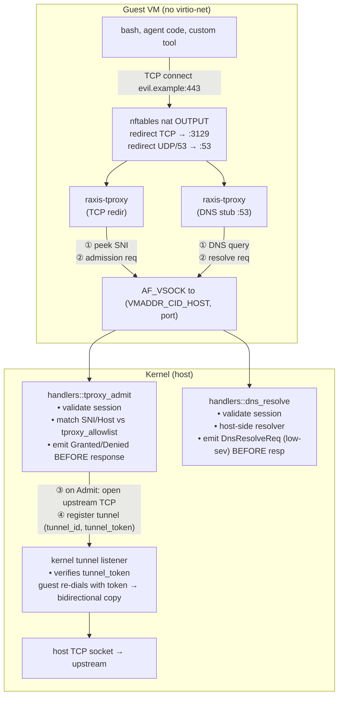

# RAXIS V2 — Path A3 Universal Airgap Architecture

> **Status:** V2 Specified — **Mediated is the only supported
> egress tier shipped in V2.** The legacy `Tier1Tproxy` variant
> (virtio-net + NAT + in-guest iptables REDIRECT) was removed in
> the Tier1Tproxy deletion sweep (TODO
> `tier1-deletion-fold-into-cleanup-sweep`). The `runtime-airgap-a3`
> cargo feature and the `RAXIS_AIRGAP_A3` runtime env-var gate were
> removed in the same sweep; A3 is no longer opt-in.
>
> **Role in the V2 unified egress story.** This spec is the canonical
> home for the *universal* airgap model: every role's VM
> (Orchestrator, Executor, Reviewer) ships with **no** virtio-net
> device. The kernel is the sole arbiter of every byte that leaves
> the guest — HTTP, raw TCP, DNS, credential-proxy loopback — and it
> arbitrates over vsock, not over a NAT tap.
>
> **Cross-references.**
> - [`vm-network-isolation.md`](vm-network-isolation.md) — admission contract (SNI / Host
>   header allowlist) inherited from the deleted Tier-1 design.
>   Path A3 keeps the admission contract but uses AF_VSOCK +
>   kernel-side tunnel as the only transport; the historical
>   "virtio-net + iptables redirect to kernel" transport described
>   alongside it is no longer compiled.
> - [`credential-proxy.md §12a`](credential-proxy.md) — vsock-loopback bridge for
>   credential-proxy URLs. Path A3 reuses the same per-VM vsock
>   device for its admission channel, its byte-tunnel channel, and
>   its DNS-over-vsock channel; the credential-proxy bridge is the
>   architectural precedent.
> - [`extensibility-traits.md §3`](extensibility-traits.md) — `EgressTier::Mediated` is the
>   only non-`None` egress tier; it produces **no**
>   `AvfNetworkDevice` and omits Firecracker's `network-interfaces`
>   PUT.
> - [`kernel-mediated-egress.md`](kernel-mediated-egress.md) — deprecated; the A3 model
>   *generalises* kernel-mediated egress from "HTTP only" to "every
>   byte the guest sends outbound".
> - `INV-NETISO-A3-*` family in `invariants.md §6` — universal
>   no-NIC, vsock chokepoint, DNS mediation, IPv6 disabled, paired
>   audit for admission and DNS.

## 1. Why A3 exists — the gap the original Tier-1 left open

The pre-deletion V2 baseline had the **Reviewer** at
`EgressTier::None` (no NIC) and the **Executor / Orchestrator** at
the legacy `EgressTier::Tier1Tproxy` (virtio-net + NAT + an
in-guest `raxis-tproxy` binary that *should* have redirected
outbound TCP to itself and *should* have enforced an allowlist
before opening upstream sockets). In practice that shipment was
asymmetric:

1. The canonical Executor rootfs did **not** ship the
   `raxis-tproxy` binary at `/usr/local/bin/raxis-tproxy`. It
   linked the credential-proxy vsock-loopback forwarder as a
   library and relied on the lack of in-VM enforcement plus the
   **gateway** URL allowlist as the only line of defence.
2. The Executor VM's iptables REDIRECT chain was never installed
   at PID 1 boot — the historical "Tier-1 §3.1 rules" were
   normative but not wired into `crates/planner-core::guest_init`.
3. The kernel-side admission accept loop only handled the
   *dev-fallback* TCP transport (`KernelChannel::Tcp`). The real
   vsock-based admission channel was unimplemented at the time.
   Both the dev TCP fallback and the `KernelChannel` enum were
   deleted alongside `EgressTier::Tier1Tproxy`; the only
   surviving path is `accept_loop_a3` over AF_VSOCK.

The combined effect: an Executor that ran a `bash`-invoked
`curl https://evil.example` reached **the NAT** directly because
the in-guest iptables chain was empty and the tproxy binary was
absent. The gateway allowlist caught LLM provider calls (which
went through the kernel-mediated `PlannerFetchRequest` path) but
did not catch raw TCP from agent-spawned tools.

Path A3 closes this gap by **eliminating the virtio-net device
entirely** from every role's VM. The agent's TCP socket has nowhere
to go *except* into the in-guest tproxy listener, and the in-guest
tproxy MUST route every byte through the kernel's vsock admission
channel. The Tier1Tproxy deletion finished the job by making A3
the only egress path — operators can no longer accidentally boot
into the unfixed Tier-1 posture.

## 2. The unified A3 model end-to-end



The kernel sees every flow. Every flow is audited (admission
granted/denied is paired-write; DNS is low-severity single-class).
The agent has no path around any of this because **there is no NIC
in the VM**.

## 3. Wire protocols

Three IPC envelopes live on the kernel's `tproxy_vsock_port` (per
session, per VM). All three use the same length-prefixed bincode
framing as the planner socket (`peripherals.md §3`).

### 3.1 `IpcMessage::TproxyAdmissionRequest` (guest → kernel)

```rust
pub struct TproxyAdmissionRequest {
    pub request_id:    Uuid,
    pub session_token: String,
    pub sni:           Option<String>,
    pub host_header:   Option<String>,
    pub destination:   SocketAddr,      // post-DNS resolved
    pub protocol:      TproxyProtocol,  // Tcp | Tls | Http
}
```

Kernel matches `sni.or(host_header)` against the session's
`policy.tproxy_allowlist`. The destination IP+port is recorded
for forensics. The protocol guess is used to pick which audit
field carries the hostname (SNI vs Host header). The kernel emits
`TproxyAdmissionGranted` (paired) on Admit and
`TproxyAdmissionDenied` (paired) on Deny, in both cases BEFORE
returning the response (audit-after-decision contract).

### 3.2 `IpcMessage::KernelTproxyAdmissionResponse` (kernel → guest)

```rust
pub enum TproxyAdmissionResponse {
    Admit { tunnel_id: Uuid, tunnel_token: [u8; 32] },
    Deny  { reason: String, hint: Option<String> },
}
```

On Admit the guest opens a **second** vsock connection to
`(VMADDR_CID_HOST, kernel_tunnel_port)`, sends
`tunnel_id || tunnel_token` as the first frame, then byte-copies
between the agent's TCP socket and the vsock stream. The kernel
verifies the token matches the registered tunnel, pairs the vsock
stream with the upstream TCP it opened, and `copy_bidirectional`s
the two streams.

`tunnel_token` is 32 random bytes minted per admission. It is
single-use: the kernel removes the tunnel registration on first
successful handshake, so a leaked token cannot be replayed.

### 3.3 `IpcMessage::DnsResolveRequest` (guest → kernel)

```rust
pub struct DnsResolveRequest {
    pub request_id:    Uuid,
    pub session_token: String,
    pub hostname:      String,
    pub query_type:    DnsQueryType,  // A | AAAA
}

pub struct DnsResolveResponse {
    pub addresses: Vec<IpAddr>,   // empty = NXDOMAIN
    pub ttl_secs:  u32,
}
```

The kernel resolves via the host's standard resolver
(`tokio::net::lookup_host` is sufficient for V2). DNS resolution
itself does NOT grant egress — the subsequent
`TproxyAdmissionRequest` against the resolved address is the gate.
The kernel emits `DnsResolveRequested { hostname, resolved_count,
ttl_secs }` as a single-class low-severity audit event so an
operator can trace which hostnames a session is asking about
even when admission later denies them.

## 4. In-guest enforcement (`crates/planner-core::guest_init`)

PID 1 inside every Linux executor guest unconditionally installs
the egress chokepoint at boot — there is no `RAXIS_AIRGAP_A3` gate
and no cargo feature flag any more. The chokepoint consists of:

```nft
table inet raxis_a3 {
  chain output {
    type nat hook output priority -100; policy accept;
    oifname "lo" return
    ip daddr 127.0.0.0/8 return
    ip protocol tcp redirect to :3129
    udp dport 53 redirect to :53
  }
}
```

```bash
# Disable IPv6 — kernel admission is IPv4-only in V2; IPv6 would be a covert channel
echo 1 > /proc/sys/net/ipv6/conf/all/disable_ipv6
echo 1 > /proc/sys/net/ipv6/conf/default/disable_ipv6
echo 1 > /proc/sys/net/ipv6/conf/lo/disable_ipv6

# Point libc resolver at the in-guest DNS stub
echo "nameserver 127.0.0.1" > /etc/resolv.conf
```

The credential-proxy loopback ports stay on `127.0.0.1` and so
are NOT redirected (the `! -d 127.0.0.1/32` exception). The
credential proxies bind on `127.0.0.1:<guest_loopback_port>` which
the existing `raxis-tproxy::loopback_forwarder` already splices
to host loopback via vsock.

## 5. Substrate config — no NIC, ever

`EgressTier::Mediated` is the only non-`None` egress tier shipped
in V2. It produces:

- `crates/isolation-apple-vz`: no `network` field at all (the
  legacy `AvfNetworkDevice` / `AvfNetworkMode` types were removed
  alongside Tier1Tproxy).
- `crates/isolation-firecracker`: no `PUT /network-interfaces`
  call, guest kernel boots without `eth0`.

The `EgressTier::Tier1Tproxy` enum variant was removed in the
deletion sweep. Old audit chains that recorded
`egress_tier = "Tier1Tproxy"` continue to deserialize byte-for-byte
because `SessionVmSpawned.egress_tier` is a `String`, not the
`EgressTier` enum; the audit-tools verify path does not round-trip
that string through the enum.

## 6. Feature gating — removed

The previous double gate (`runtime-airgap-a3` cargo feature +
`RAXIS_AIRGAP_A3=1` env var) was removed in the Tier1Tproxy
deletion. The kernel always compiles in `handlers::tproxy_admit`
and `handlers::dns_resolve`, the session-spawn path always emits
`EgressTier::Mediated` for Executor (`EgressTier::None` for
Orchestrator and Reviewer), and PID 1 inside the guest
unconditionally installs the nftables REDIRECT, the
`disable_ipv6` sysctls, and the `/etc/resolv.conf →
127.0.0.1` pin.

The fallback per-port env vars `RAXIS_AIRGAP_A3_HOST_CID` /
`_ADMISSION_PORT` survive — they are discovery overrides for
substrates that expose a non-default vsock CID, not a feature
toggle.

## 7. Operator workflow

See `guides/operator/21-airgap-a3-egress-allowlist.md` for the
end-to-end recipe (authoring `[[tproxy_allowlist]]`, common
destinations for cargo / npm / pip / git, and the canonical
`live-e2e/docker-compose.extended.e2e.yml` test harness). The
previous `docker-compose.airgap-a3.yml` opt-in harness was deleted
alongside the cargo feature.

## 8. Invariants (canonical home)

This file is the canonical home for:

- `INV-NETISO-A3-UNIVERSAL-NO-NIC-01` — no role-image's VM gets
  a virtio-net device (true unconditionally since the Tier1Tproxy
  deletion).
- `INV-NETISO-A3-VSOCK-CHOKEPOINT-01` — the kernel's tproxy
  admission gate is the SOLE arbiter of guest egress.
- `INV-NETISO-A3-DNS-MEDIATED-01` — DNS queries flow through the
  kernel; guest cannot reach external DNS servers.
- `INV-NETISO-A3-IPV6-DISABLED-01` — IPv6 is disabled at PID 1.
- `INV-AUDIT-TPROXY-ADMIT-01` — every `TproxyAdmissionRequest`
  emits a paired audit event (granted or denied) BEFORE the
  response is sent.
- `INV-AUDIT-DNS-RESOLVE-01` — every DNS resolution emits an
  audit event (low-severity, single-class).

Each invariant has a witness test in `kernel/tests/airgap_a3_*.rs`.

## 9. Cross-reference: executor offline-first deps surface

The egress posture above relies on the canonical
`executor-starter` image carrying every per-language tool the
realistic-scenario plan exercises WITHOUT runtime third-party
network fetches. That contract is codified by four sibling
invariants whose canonical home is [`planner-harness.md §10.6`](planner-harness.md)
(mirrored in `invariants.md`):

- `INV-EXECUTOR-IMAGE-LINT-TOOLCHAIN-PYTHON-01` — `ruff`
  pip-installed at bake time, not runtime-fetched.
- `INV-EXECUTOR-IMAGE-LINT-TOOLCHAIN-JS-01` — `eslint`,
  `prettier`, `typescript` (`tsc`), `tsx`, `@types/node`
  globally installed at bake time so `npx --no-install`'s
  resolution-fallback to `$PATH` finds them before the
  `--no-install` branch fires.
- `INV-EXECUTOR-IMAGE-RUST-OFFLINE-01` — the Executor
  planner-core sets `CARGO_NET_OFFLINE=true` in its process
  env at PID-1 boot so cargo never probes `crates.io`
  against the canonical empty allowlist.
- `INV-EXECUTOR-EGRESS-OFFLINE-FIRST-01` — the umbrella
  invariant: the realistic-scenario plan MUST be runnable
  with the executor's per-session egress allowlist
  restricted to the inference gateway. New per-language
  tools added to the plan MUST extend the bake-time
  prebundle BEFORE the task lands; opening the allowlist
  for `registry.npmjs.org` / `pypi.org` / `crates.io` is
  a documented last resort, never the default.

The structural rationale: the kernel's egress allowlist is
the operator's mechanism for controlling which third-party
networks the executor can reach. Forcing the canonical plan
to add `registry.npmjs.org` to every operator's
`policy.toml` would silently grant the executor's LLM the
ability to fetch arbitrary npm packages (including
post-install scripts) — a far broader capability than "lint
a TypeScript file". Pre-bundling makes the offline-first
default viable.

When pre-bundling IS infeasible (e.g. an operator-supplied
custom tool needs a transitive PyPI package the canonical
image cannot ship for license reasons), the operator opens
the allowlist via `policy.toml [egress] domains` AND
declares the rationale alongside the plan; the audit chain's
`tproxy_admit` events for the executor session then carry
the matching domain entries as witnesses of the
operator-blessed exception.
