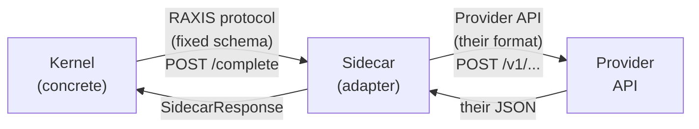

# RAXIS V2 — Extensibility Traits (Six Pluggable Boundaries)

> **Status:** V2 Specified.
> **Audience:** Implementers extending the reference implementation to a new domain (trading, healthcare, robotics) or a new deployment topology (RAXIS Cloud, enterprise on-prem, air-gapped). Reviewers verifying that no admission-pipeline logic leaks into a trait. Auditors reasoning about which decisions are paradigm-level (concrete kernel) and which are deployment-level (pluggable).
> **Cross-references:**
> - [`paradigm.md`](../paradigm.md) — twelve `R-*` invariants this surface MUST NOT weaken
> - [`invariants.md`](../invariants.md) — reference-implementation `INV-*` enforcement points
> - [`v2/credential-proxy.md`](credential-proxy.md) — canonical `CredentialBackend` consumer
> - [`v2/provider-failure-handling.md`](provider-failure-handling.md) — canonical `InferenceRouter` consumer
> - [`v2/provider-model-selection.md`](provider-model-selection.md) — `InferenceRouter` resolution rules
> - [`v2/system-requirements.md`](system-requirements.md) — `IsolationBackend` per-platform tiers
> - [`v2/vm-network-isolation.md`](vm-network-isolation.md) — `IsolationBackend` Tier-1 networking surface
> - [`v2/kernel-lifecycle.md`](kernel-lifecycle.md) — `OperatorTransport` listener lifecycle
> - [`v1/kernel-store.md`](../v1/kernel-store.md) §2.5.2 — `AuditSink` ordering invariant (already in source)

---

## §1 — Why Trait Boundaries (And Why Seven)

The RAXIS reference implementation in this repository targets **autonomous software engineering on a single host** with a specific stack: Firecracker on Linux + Apple Virtualization on macOS, plaintext credential files under `<data_dir>/credentials/`, append-only JSONL audit segments, a Unix Domain Socket for the operator CLI, and a kernel-owned HTTPS gateway routing to public LLM providers.

Every one of those choices is correct for the reference deployment and wrong for some other deployment a future operator may need:

- A **trading firm** needs HSM-backed signing keys (no plaintext on disk), models running on local GPUs (no public-internet exfiltration of order intent), and an immutable transparency log (Sigstore/Rekor) for non-repudiation.
- A **healthcare deployment** under HIPAA needs cloud-secrets-manager integration with per-access audit trails, on-premise inference (no PHI egress), and a centralized control plane managing multiple kernel instances.
- **RAXIS Cloud** needs the operator CLI to reach the kernel over mTLS gRPC across the network, and audit events to land in an immutable cloud ledger (S3 + Athena, or a dedicated append-only store).
- An **air-gapped government** install needs every credential, every audit byte, and every inference call to stay on the host, with periodic USB-mediated audit export.

Hard-coding the reference choices into the kernel makes the kernel non-portable. Pulling every choice out into a trait makes the kernel hollow. The right answer is to identify the **smallest set of seams** along which alternative deployments diverge — and to make exactly those seams `trait` boundaries.

### §1.1 The rule that decides what gets a trait

> **A subsystem gets a `trait` boundary if and only if substituting it does NOT weaken any `R-*` paradigm invariant from `paradigm.md`.**

Equivalently: a subsystem stays concrete if and only if it **enforces** an `R-*` invariant (substituting it would let an implementation claim RAXIS conformance while violating the paradigm).

Applying this rule yields seven trait boundaries and a fixed concrete kernel:

| Subsystem | Trait? | Justification |
|---|---|---|
| Domain-specific intent kinds, file shapes, merge semantics | ✅ `DomainAdapter` | Domain-agnostic per `paradigm.md §5`; SE-specific concepts (git worktrees, `IntegrationMerge`, commits) are not paradigm-level. |
| Isolation primitive (microVM / enclave / Wasm / mock) | ✅ `IsolationBackend` | `paradigm.md §3 R-1` permits "at least equivalent to a hardware-virtualized microVM, hardware enclave, or formally verified microkernel partition." |
| Credential storage (file / Vault / AWS SM / Azure KV / HSM) | ✅ `CredentialBackend` | `R-2` requires mediation, not a specific store; the gateway-only-reads property is preserved across all backends. |
| Sealed-event persistence (SQLite / PostgreSQL / S3 / Rekor) | ✅ `AuditSink` | `R-7` requires tamper-evidence verifiable with public keys; chain math stays kernel-side, persistence is a deployment choice. |
| Operator CLI transport (UDS / mTLS gRPC / HTTPS) | ✅ `OperatorTransport` | `R-9` and `R-12` require the channel to be unforgeable by intelligence and authenticated to a human principal; the wire is replaceable. |
| Inference provider routing (HTTPS / gRPC / local vLLM / TGI) | ✅ `InferenceRouter` | `R-2` mediation is satisfied by *any* router that strips planner authority over destination + meters tokens; specific providers are deployment choices. |
| Operator notification transport (Shell / File / Email / Webhook / Slack / PagerDuty) | ✅ `OperatorNotificationChannel` | The dispatcher (idempotency, post-commit ordering, audit emission, drain-on-shutdown) enforces every `R-*`-bearing property; the wire to the operator is a transport choice. See [`email-and-notification-channels.md`](email-and-notification-channels.md) for the full spec. |
| Intent admission pipeline (the 13-step gate check) | ❌ Concrete | This **is** the kernel. Abstracting it would hollow out the product and make `R-3`/`R-4`/`R-5`/`R-6` unverifiable. |
| Policy parser (`policy.toml`/`plan.toml`) | ❌ Concrete | The signed-TOML schema is the RAXIS protocol; conformance test suites verify it. New domains add new fields, not new parsers. |
| Escalation FSM | ❌ Concrete | The `Pending → Approved → Consumed` transitions are paradigm-level (`R-12`). Domain-specific escalation classes are enum variants, not trait swaps. |
| Hash chain / Merkle logic | ❌ Concrete | This **is** `R-7`. The algorithm is non-negotiable. The sink is replaceable; the chain is not. |
| `KernelPush` / `IntentRequest` framing | ❌ Concrete | The wire contract binds every planner ever written. Changing it breaks all clients. |

### §1.2 What this spec ships in V2

V2 ships:

1. The **trait definitions** in their canonical Rust crates (one trait per file, co-located with the existing concrete impl where possible).
2. The **default impls** the reference implementation already uses (`FileAuditSink`, `FirecrackerBackend`, `UnixSocketTransport`, etc.), refactored to *implement* the trait instead of being free-standing types.
3. Wiring at the kernel boot site (`kernel/src/main.rs` + `bootstrap.rs`) so each subsystem is held as `Arc<dyn Trait>` — not as a concrete type — anywhere admission code reads it.
4. A **conformance test fixture** per trait that exercises the trait's contract against any alternative impl in any future workspace member.

For `OperatorNotificationChannel`, V2 ships **four** default impls (`ShellChannel`, `FileChannel` — refactored from v1 — plus `EmailChannel` and `WebhookChannel` — new). The full surface is specified in [`email-and-notification-channels.md`](email-and-notification-channels.md); the trait definition itself is in §6.5 of this document.

V2 does **not** ship alternative impls in the other six trait families (Vault, HSM, gRPC, vLLM). Those are V3+ or out-of-tree. V2 only proves the seams exist and are testable.

---

## §2 — `DomainAdapter` — The Domain-Agnostic Authority Boundary

### §2.0 The paradigm-vs-implementation distinction

The twelve `R-*` invariants — `R-1` (domain separation), `R-4` (authority derivation), `R-7` (cryptographic audit chain), `R-9` (attributable intent), `R-11` (mediated coordination), and the rest — never mention git, commits, branches, or worktrees. The reference implementation in this repository uses git because its target *domain* is autonomous software engineering. A different deployment of RAXIS — autonomous trading, clinical-decision support, robotics, claims adjudication — needs the same paradigm primitives but very different state-management primitives.

```text
Paradigm        (R-11)      "State must be transferred via authority mediation."
Implementation  (V2-SE)     "We use git bundles, transferred by the Kernel via VirtioFS."
```

The `DomainAdapter` trait is the single seam at which the implementation-layer choice (git, FHIR, FIX, ROS-Bag) plugs into the paradigm-layer Kernel. The Kernel binary is *compiled against the trait*; the concrete adapter is wired in at process boot. Switching domains is a re-link, not a fork.

### §2.1 What Git does, structurally

Inspecting the V1+V2 reference implementation (`kernel/src/vcs/`, `crates/store/`, `kernel/src/handlers/intent.rs`, [`raxis/specs/v2/integration-merge.md`](integration-merge.md)), git plays exactly four structural roles. Each one is a domain-agnostic primitive:

| Git primitive (SE)                       | Structural role                                                   | Trading equivalent                                          | Healthcare equivalent                                                  |
| ---------------------------------------- | ----------------------------------------------------------------- | ----------------------------------------------------------- | ---------------------------------------------------------------------- |
| Worktree (VirtioFS-mounted ephemeral clone)        | Mutable state surface the agent operates on                       | Portfolio snapshot + order-staging directory                | Patient record (FHIR bundle) + proposed-action staging                 |
| `git commit` (signed, content-addressed) | Content-addressed snapshot of the agent's proposed work           | Signed proposed-order manifest (instrument, side, qty, TIF) | Signed proposed-clinical-action (order set, codes, dose, justification) |
| `git bundle create` (kernel-mediated)    | State transfer between two isolated agent VMs                     | Order-context bundle handed strategy → execution agent      | Diagnostic bundle handed triage → treatment agent                      |
| `IntegrationMerge` (kernel-authorised cherry-pick into main worktree) | Authorised commit of approved work to canonical external state | Order execution against the exchange API                    | EHR write of approved clinical action                                  |

Everything else in the reference implementation — the operator-socket handshake (`cli/src/conn.rs`), the SQLite session/task/escalation/audit state machine (`crates/store/`), the audit chain and Merkle tree (`crates/crypto/`), the 13-step intent admission pipeline (`kernel/src/scheduler/admit.rs`, `kernel/src/handlers/intent.rs`), the Credential Proxy invariant (`INV-VM-CAP-04`, `crates/raxis-cred-proxy/`), the escalation FSM (`kernel/src/escalation/`), the policy parser, the operator's challenge-response — is *paradigm-layer* and stays concrete. A `ProposedTrade` intent passes through identical admission gates as a `CompleteTask` intent.

### §2.2 Trait definition

**Canonical home:** `crates/raxis-domain/src/lib.rs` (NEW).

The trait is split into three coherent surface areas:

1. **State-lifecycle methods** (the four primitives the user enumerated above): `provision_workspace`, `snapshot`, `transfer`, `commit`.
2. **Admission-pipeline hooks** the kernel's gate-check uses on every intent: `touched_resources`, `escalation_classes`, plus the two associated types (`IntentKind`, `TerminalArtefact`) that bind a domain to its own intent vocabulary and terminal-task artefact shape.
3. **Cleanup hooks** that drive the abandoned-state retention/purge loop the kernel runs at session-end (the canonical SE consumer is [`agent-disagreement.md §7`](agent-disagreement.md), the `AbandonedSalvageable → AbandonedArchived → Purged` lifecycle): `teardown_workspace`, `purge_workspace`.

```rust
//! crates/raxis-domain/src/lib.rs
//!
//! The single seam between RAXIS's domain-agnostic Kernel core and the
//! implementation-specific state primitives that vary per problem domain.
//! The Kernel binary is compiled against this trait; concrete impls (e.g.
//! `GitAdapter` for SE, `TradingAdapter`, `HealthcareAdapter`) are wired
//! at process boot via `Arc<dyn DomainAdapter<...>>`.

use raxis_types::{SessionId, IntentRequestId, AuditEventId, ContentHash};
use std::path::PathBuf;

/// The boundary between the domain-agnostic Kernel and domain-specific
/// state management. Every method is invoked *only* from inside the
/// Kernel after the relevant `R-*` admission gate has fired; the impl
/// is not responsible for re-checking authority.
pub trait DomainAdapter: Send + Sync + 'static {
    // ── associated types ────────────────────────────────────────────

    /// Closed enumeration of the authority operations this domain
    /// admits. The kernel deserialises these out of the typed
    /// `IntentRequest` envelope (domain-agnostic fields — `session_id`,
    /// `seq`, `nonce`, `signature` — stay in the envelope, in
    /// `raxis-types`). Examples:
    ///   - SE:        CompleteTask | IntegrationMerge | SubmitReview | EscalationRequest | InferenceRequest | EgressRequest | FetchRequest
    ///   - Trading:   ProposeOrder | CancelOrder | RebalancePortfolio | RequestQuote | EscalationRequest | InferenceRequest
    ///   - Robotics:  PlanMotion  | ExecuteMotion | SampleSensors | EscalationRequest | InferenceRequest
    type IntentKind:       serde::Serialize + serde::de::DeserializeOwned + Clone + Send + Sync;

    /// The artefact a successful terminal-task `CompleteTask`-equivalent
    /// witness binds to. Examples:
    ///   - SE:        (CommitSha, head_tree_sha256)
    ///   - Trading:   (OrderId,   FillReceipt)
    ///   - Robotics:  (MotionId,  ExecutionTrace)
    type TerminalArtefact: Clone + Send + Sync;

    // ── §2.2.A state-lifecycle primitives ───────────────────────────

    /// Prepare the mutable state surface the agent will operate on
    /// inside its isolated VM. The kernel calls this exactly once per
    /// session, after the planner VM has been spawned but before
    /// `KernelPush` is allowed to deliver any intent.
    ///
    /// SE impl:        `git clone --no-hardlinks` of main_repo into
    ///                 `/var/raxis/sessions/<session_id>/work`,
    ///                 returned as a VirtioFS host-path; mounted
    ///                 read-write into the VM at `/work`.
    /// Trading impl:   snapshot the current portfolio + open-order book
    ///                 into a session-scoped staging directory; mount
    ///                 read-write into the VM at `/portfolio`.
    /// Healthcare:     export the patient's FHIR bundle into a
    ///                 session-scoped staging dir; mount read-only at
    ///                 `/patient`, read-write at `/proposed`.
    ///
    /// MUST be deterministic given `(session.id, session.parent_state_ref)`:
    /// re-invocation MUST yield byte-identical contents at the returned
    /// path (modulo timestamps that the impl SHOULD canonicalise).
    fn provision_workspace(
        &self,
        session: &SessionContext<'_>,
    ) -> Result<WorkspaceHandle, DomainError>;

    /// Create a content-addressed snapshot of whatever the agent has
    /// produced inside its workspace. Called when the planner submits
    /// a `CompleteTask`-equivalent intent, *before* admission gates run
    /// (because the touched-set has to be derived from the snapshot,
    /// per `R-9`).
    ///
    /// SE impl:        `git add -A && git commit -m "<task_id>"` into
    ///                 the session worktree, returning the commit SHA
    ///                 and the head-tree sha256 (so the kernel can
    ///                 verify Merkle-style equality on retry).
    /// Trading impl:   canonicalise the proposed-order JSON, sha256 it,
    ///                 and write `(snapshot_id, manifest_bytes,
    ///                 manifest_signature)` into the staging dir.
    /// Healthcare:     canonicalise the proposed clinical-action set,
    ///                 sha256 it, sign with session-bound key.
    ///
    /// MUST be **idempotent**: calling twice on a workspace that has
    /// not changed MUST return the same `Snapshot` (same `content_hash`).
    fn snapshot(
        &self,
        session: &SessionContext<'_>,
        workspace: &WorkspaceHandle,
    ) -> Result<Snapshot, DomainError>;

    /// Hand a snapshot from one isolated agent VM to another (the
    /// multi-agent coordination primitive of `R-11`). The kernel
    /// always mediates: the source VM cannot write directly into the
    /// destination's workspace, and the destination cannot pull
    /// directly from the source. This call materialises a transferable
    /// `Bundle` in a kernel-controlled staging directory; the kernel
    /// then mounts that directory read-only into the destination VM.
    ///
    /// SE impl:        `git bundle create` of the snapshot commit +
    ///                 its base, dropped at
    ///                 `/var/raxis/transfer/<bundle_id>.bundle`.
    /// Trading impl:   serialise the order-context (manifest +
    ///                 supporting market-data snapshot) into a
    ///                 sealed JSON envelope.
    /// Healthcare:     serialise the diagnostic bundle (FHIR
    ///                 DiagnosticReport + supporting Observations).
    ///
    /// MUST be idempotent on `(snapshot.content_hash, dst.session_id)`.
    fn transfer(
        &self,
        snapshot: &Snapshot,
        src: &SessionContext<'_>,
        dst: &SessionContext<'_>,
    ) -> Result<Bundle, DomainError>;

    /// Commit approved work to the canonical external system of
    /// record. This is the *only* method that contacts the outside
    /// world; it MUST go through the Credential Proxy (`INV-VM-CAP-04`)
    /// when external credentials are required.
    ///
    /// SE impl:        cherry-pick `snapshot.commit_sha` into the
    ///                 main worktree (the IntegrationMerge ceremony
    ///                 of `integration-merge.md`); on protected paths
    ///                 the kernel will have already routed through the
    ///                 escalation FSM and this is the post-approval call.
    /// Trading impl:   submit the order via the credential-proxy ↔
    ///                 broker FIX connection.
    /// Healthcare:     POST the approved clinical-action set to the
    ///                 EHR's FHIR endpoint via the credential proxy.
    ///
    /// MUST be idempotent on `snapshot.content_hash`: a re-invocation
    /// after a successful commit MUST return `Err(DomainError::AlreadyApplied
    /// { receipt })` carrying the original receipt — the kernel relies
    /// on this for crash recovery (`kernel-lifecycle.md §7`).
    fn commit(
        &self,
        snapshot: &Snapshot,
        cred_proxy: &dyn CredentialProxyHandle,
        ctx: &CommitContext<'_>,
    ) -> Result<DomainCommitReceipt, DomainError>;

    // ── §2.2.B kernel admission-pipeline hooks ──────────────────────

    /// Compute the deterministic touched-set of domain resources that
    /// `intent` would mutate, derived **only** from authoritative state
    /// (the workspace + the snapshot), never from planner-supplied
    /// manifests. This is the domain-specific generalisation of
    /// `kernel::vcs::diff(base, head)`; the kernel runs this *before*
    /// the path-allowlist gate (`INV-TASK-PATH-01`, `R-9`).
    ///
    /// SE impl:        `gix::diff` on `base..head` → list of paths.
    /// Trading impl:   list of `(account_id, instrument)` pairs the
    ///                 order would touch.
    /// Healthcare:     list of `(patient_id, FHIR-resource-type)` pairs.
    fn touched_resources(
        &self,
        intent: &Self::IntentKind,
        ctx: &AdmissionContext<'_>,
    ) -> Result<TouchedResources, DomainError>;

    /// Stable, sorted, deduplicated list of escalation class names the
    /// kernel's escalation FSM should accept for this domain (e.g. SE:
    /// `protected_path_merge`, `review_loop_exceeded`; Trading:
    /// `position_limit_exceeded`, `market_halt_detected`). The kernel
    /// rejects any escalation request whose `class` is not in this
    /// list with `Err(EscalationError::UnknownClass)`.
    fn escalation_classes(&self) -> &'static [&'static str];

    // ── §2.2.C cleanup primitives ───────────────────────────────────

    /// Called when a session ends (terminal `CompleteTask`, abandoned
    /// after agent-disagreement, or operator-killed). Releases
    /// VM-mounted resources but does NOT delete the underlying state
    /// — the audit-retention window of `agent-disagreement.md §7` may
    /// require it for forensic replay.
    fn teardown_workspace(
        &self,
        workspace: &WorkspaceHandle,
    ) -> Result<(), DomainError>;

    /// Called when the audit retention window closes (default 30 d,
    /// configurable in `policy.toml`). Permanently purges the
    /// underlying state. SE impl: `rm -rf` the ephemeral clone.
    /// Trading impl: shred the staging dir, detach from cold-storage
    /// snapshot. The kernel still retains the audit-chain entry; only
    /// the bulk state goes.
    fn purge_workspace(
        &self,
        workspace: &WorkspaceHandle,
    ) -> Result<(), DomainError>;
}
```

Supporting types (also `crates/raxis-domain/src/lib.rs`):

```rust
/// Opaque domain-allocated handle to a provisioned workspace.
/// SE: wraps a host-path + a `gix::Repository`. The kernel only
/// stores the `host_path` (for VirtioFS mount) and the
/// `content_hash` (for crash-recovery binding).
pub struct WorkspaceHandle {
    pub host_path:     PathBuf,
    pub content_hash:  ContentHash,
    pub adapter_state: Box<dyn std::any::Any + Send + Sync>,
}

/// Content-addressed snapshot of the agent's proposed work.
pub struct Snapshot {
    pub content_hash:  ContentHash,
    pub parent_hash:   Option<ContentHash>,
    pub adapter_state: Box<dyn std::any::Any + Send + Sync>,
}

/// Kernel-mediated transfer artefact. The host-path is the only field
/// the kernel touches; the kernel mounts that path read-only into the
/// destination VM.
pub struct Bundle {
    pub host_path:     PathBuf,
    pub content_hash:  ContentHash,
    pub byte_len:      u64,
}

/// Receipt of a successful `commit`. Hashed into the audit chain
/// under the `IntegrationMerge`-equivalent event type.
pub struct DomainCommitReceipt {
    pub receipt_id:     String,        // adapter-defined unique id
    pub external_ref:   Option<String>,// e.g. SE: main commit sha;
                                       //      Trading: broker order id;
                                       //      Healthcare: FHIR resource id
    pub committed_at:   chrono::DateTime<chrono::Utc>,
    pub adapter_state:  Box<dyn std::any::Any + Send + Sync>,
}

/// Domain-agnostic, structurally typed touched-set the kernel feeds
/// into the path-allowlist / scope-allowlist gate.
pub struct TouchedResources {
    /// Each resource is a string of the form
    /// `<scheme>://<authority>/<path>` (e.g. SE: `path:///src/foo.rs`;
    /// Trading: `account://acct-42/AAPL`; Healthcare: `fhir://patient-12/Observation`).
    pub resources: Vec<TouchedResource>,
}

pub struct TouchedResource {
    pub uri:  String,
    pub op:   ResourceOp,        // Create | Modify | Delete
    pub size: Option<u64>,       // optional bytes-affected metric for budget gates
}

pub enum DomainError {
    NotFound,
    AlreadyApplied { receipt: DomainCommitReceipt },
    PreconditionFailed(String),
    CredentialProxyDenied(String),
    Transient(String),
    Permanent(String),
}
```

`CredentialProxyHandle` is the existing trait from `crates/raxis-cred-proxy/` (see [`extensibility-traits.md §4`](extensibility-traits.md)); the kernel passes the per-session handle in unchanged.

`SessionContext`, `AdmissionContext`, `CommitContext` are read-only views the kernel constructs; they expose the session id, parent state ref, policy epoch, and a scoped audit-event emitter, but no kernel internals.

### §2.3 Reference implementation: `GitAdapter`

**Home:** `crates/raxis-domain-git/src/lib.rs` (NEW; carved out of the existing `kernel/src/vcs/` module and the `IntegrationMerge` ceremony in `kernel/src/handlers/intent.rs`).

| Trait method            | `GitAdapter` implementation                                                                                                                                                     |
| ----------------------- | ------------------------------------------------------------------------------------------------------------------------------------------------------------------------------- |
| `provision_workspace`   | `git clone --no-hardlinks --no-checkout` main_repo → `/var/raxis/sessions/<sid>/work`; `git checkout -b session-<sid> <parent_state_ref>`; return host-path + tree sha256. |
| `snapshot`              | `git add -A`; `git commit -m "session-<sid>:<intent_id>" --author="raxis-planner <planner@local>"`; capture `(commit_sha, head_tree_sha256)`.                              |
| `transfer`              | `git bundle create /var/raxis/transfer/<bundle_id>.bundle <base>..<head>`; sha256 the bundle; return `Bundle { host_path, content_hash, byte_len }`.                            |
| `commit`                | The full `IntegrationMerge` ceremony of [`integration-merge.md §4`](integration-merge.md): lock main worktree → `git cherry-pick --no-commit <commit_sha>` → re-run touched-set diff → emit `IntegrationMergeApplied` event → push to upstream remote via credential proxy. |
| `touched_resources`     | `gix::diff_tree_to_tree(parent_tree, head_tree)` → flatten to `path:///`-prefixed URIs. Identical algorithm to today's `kernel/src/vcs/diff.rs`, just relocated.                |
| `escalation_classes`    | `&["protected_path_merge", "review_loop_exceeded", "merge_conflict_unresolvable", "policy_epoch_drift", "credential_proxy_denied"]`                                                             |
| `teardown_workspace`    | Unmount VirtioFS; close `gix::Repository`; touch `.raxis-retain-until` with the audit-retention deadline.                                                                       |
| `purge_workspace`       | `rm -rf` the session worktree; do NOT touch `main_repo` or the audit chain.                                                                                                   |

`GitAdapter::IntentKind` is the existing `raxis-types::IntentKind`. `TerminalArtefact` is `(CommitSha, head_tree_sha256)`. The credential proxy parameter to `commit` is the existing `CredentialProxyHandle` for the per-session upstream-push credential leased under `INV-VM-CAP-04`.

### §2.4 Hypothetical alternative implementations

Documented here so reviewers can sanity-check that the seam is wide enough to admit them without growing more methods. **Not shipped in V2.**

- **`TradingAdapter`**: `provision_workspace` snapshots the portfolio; `snapshot` canonicalises a `ProposedOrder` JSON manifest; `transfer` ships the order-context bundle to an execution agent; `commit` submits via FIX through the credential proxy (`INV-VM-CAP-04`). `IntentKind = ProposeOrder | CancelOrder | RebalancePortfolio | RequestQuote | EscalationRequest | InferenceRequest`. `TerminalArtefact = (OrderId, FillReceipt)`.
- **`HealthcareAdapter`**: workspace = patient FHIR bundle + proposed-action staging; `snapshot` produces a signed `ClinicalActionSet`; `commit` POSTs to the EHR FHIR endpoint via cred-proxy.
- **`RoboticsAdapter`**: workspace = sensor-snapshot + motion-plan staging; `snapshot` is `(motion_plan_id, plan_hash)`; `commit` is "release the motion to the motor controller through the safety interlock proxy".

### §2.5 Files to create

- `crates/raxis-domain/Cargo.toml` (NEW) — `[lib] name = "raxis-domain"`. Depends only on `raxis-types`, `serde`, `chrono`. No git, no DB, no network.
- `crates/raxis-domain/src/lib.rs` — the trait, `WorkspaceHandle`, `Snapshot`, `Bundle`, `DomainCommitReceipt`, `TouchedResources`, `TouchedResource`, `ResourceOp`, `DomainError`, `SessionContext`, `AdmissionContext`, `CommitContext`, `CredentialProxyHandle` (re-exported from `raxis-cred-proxy`).
- `crates/raxis-domain/tests/conformance_kit.rs` — generic property-based tests (idempotency, determinism, cleanup ordering) any adapter can plug its impl into via `pub fn run_conformance_suite<A: DomainAdapter>(adapter: A, fixtures: &Fixtures)`.
- `crates/raxis-domain/tests/fixtures/` — domain-agnostic recorded `(intent, expected-touched, expected-snapshot-hash)` fixtures.
- `crates/raxis-domain-git/Cargo.toml` (NEW) — depends on `raxis-domain`, `raxis-types`, `gix`, `git2` (for cherry-pick), `tokio`.
- `crates/raxis-domain-git/src/lib.rs` — `pub struct GitAdapter { main_repo_path: PathBuf, sessions_root: PathBuf, transfer_root: PathBuf, audit_retention: Duration }` + `impl DomainAdapter for GitAdapter`.
- `crates/raxis-domain-git/src/provision.rs` — `git clone --no-hardlinks` + checkout logic moved out of `kernel/src/handlers/session.rs`.
- `crates/raxis-domain-git/src/snapshot.rs` — `git add -A && git commit` logic.
- `crates/raxis-domain-git/src/transfer.rs` — `git bundle create` logic moved out of `kernel/src/handlers/intent.rs::handle_proposed_handoff`.
- `crates/raxis-domain-git/src/commit.rs` — the full `IntegrationMerge` cherry-pick ceremony + main-worktree lock acquisition + upstream push.
- `crates/raxis-domain-git/src/touched.rs` — `gix::diff_tree_to_tree` wrapper that returns `TouchedResources`. Functions: `pub fn diff_to_touched(parent_sha: &Oid, head_sha: &Oid, repo: &gix::Repository) -> Result<TouchedResources, DomainError>`.
- `crates/raxis-domain-git/src/cleanup.rs` — `teardown_workspace` / `purge_workspace`.
- `crates/raxis-domain-git/tests/conformance.rs` — runs `raxis_domain::tests::run_conformance_suite(GitAdapter::new(...), git_fixtures())`.
- `crates/raxis-domain-git/tests/integration_merge.rs` — full V2 IntegrationMerge end-to-end test moved out of `kernel/tests/integration_merge_test.rs`.

### §2.6 Files to change

- `kernel/Cargo.toml` — add `raxis-domain = { path = "../crates/raxis-domain" }`, `raxis-domain-git = { path = "../crates/raxis-domain-git" }`. Remove `gix` and `git2` direct deps from `kernel/` (they move to `raxis-domain-git`).
- `kernel/src/main.rs` — at boot, after policy load and before listener bind, construct:
  ```rust
  let domain: Arc<dyn DomainAdapter<
      IntentKind = raxis_types::IntentKind,
      TerminalArtefact = (CommitSha, String),
  >> = Arc::new(GitAdapter::new(&policy.domain_git)?);
  ```
  Thread `domain` through `HandlerContext`. Boot-order: `audit_sink` → `credential_backend` → `isolation_backend` → **`domain`** → `inference_router` → `operator_transport` → admission scheduler.
- `kernel/src/handlers/mod.rs` — `HandlerContext` gains `pub domain: Arc<dyn DomainAdapter<IntentKind=raxis_types::IntentKind, TerminalArtefact=(CommitSha, String)>>`.
- `kernel/src/handlers/session.rs` — `start_session()` calls `ctx.domain.provision_workspace(&session_ctx)?` instead of running `git clone` directly. Persist the returned `WorkspaceHandle.host_path` + `content_hash` in the `sessions` table; the rest stays in-memory in the handler-local `WorkspaceCache`.
- `kernel/src/handlers/intent.rs` — replace direct `vcs::diff` calls with `ctx.domain.touched_resources(intent, &admission_ctx)`; replace direct `IntegrationMerge` cherry-pick with `ctx.domain.commit(snapshot, &cred_proxy, &commit_ctx)`. The 13-step gate sequence stays identical; only the implementation of two of the steps moves behind the trait.
- `kernel/src/handlers/handoff.rs` (split out of `intent.rs` if not already) — `submit_handoff` calls `ctx.domain.snapshot(...)` then `ctx.domain.transfer(...)`; the kernel takes ownership of the returned `Bundle.host_path` and mounts it into the destination VM.
- `kernel/src/scheduler/admit.rs` — gate-13 (touched-paths ⊆ allowlist) consumes `TouchedResources` rather than `Vec<PathBuf>`. The allowlist comparison becomes `policy.allowlist.matches(&resource.uri)` so SE keeps `path://`-prefix matching while non-SE domains use their own URI scheme.
- `kernel/src/vcs/` — DELETED. All callers now go through `ctx.domain`. Audit chain emits `domain.commit_receipt` + `domain.snapshot.content_hash` instead of `commit_sha` + `tree_sha`.
- `crates/store/migrations/0008_domain_handles.sql` (NEW) — adds `workspace_handles` table:
  ```text
  workspace_handles(
      session_id TEXT PRIMARY KEY,
      host_path  TEXT NOT NULL,
      content_hash BLOB NOT NULL,
      provisioned_at TEXT NOT NULL,
      torn_down_at TEXT,
      purged_at TEXT
  );
  ```
- `crates/raxis-types/src/intent.rs` — no schema change for V2; `IntentKind` stays the canonical SE enum but is now re-exported from `raxis-domain-git`. (Future domains will add their own `IntentKind`s; the wire envelope stays unchanged because the typed payload is serialised as `serde_json::Value`.)
- `policy.toml` — operator declares the active domain. New stanza:
  ```toml
  [domain]
  adapter = "git"               # one of: "git" (V2 only)
  main_repo = "/var/raxis/main"
  sessions_root = "/var/raxis/sessions"
  transfer_root = "/var/raxis/transfer"
  audit_retention = "30d"
  ```
- [`raxis/specs/v2/integration-merge.md`](integration-merge.md) — the IntegrationMerge ceremony stays the same end-to-end, but the **implementation step** that today reads "the kernel runs `git cherry-pick --no-commit ...`" is rewritten to "the kernel calls `ctx.domain.commit(snapshot, &cred_proxy, &commit_ctx)?`; the SE adapter MUST internally execute the cherry-pick + push sequence under the main-worktree lock". The gate sequence and audit-chain emissions are unchanged.
- [`raxis/specs/v2/agent-disagreement.md §7`](agent-disagreement.md) — the abandoned-worktree lifecycle's `AbandonedSalvageable` entry transition calls `ctx.domain.teardown_workspace(...)`; the daily kernel sweep at `abandoned_commits_retention` elapse calls `ctx.domain.purge_workspace(...)` instead of direct `rm -rf`. The same two hooks fire on a clean (non-abandoned) session-end path: `teardown_workspace` runs immediately on the terminal `CompleteTask` admission; `purge_workspace` runs once the configured audit-retention window has lapsed.

### §2.7 Conformance contract

A `DomainAdapter` impl is conformant iff it satisfies these properties (all mechanically verified by `crates/raxis-domain/tests/conformance_kit.rs::run_conformance_suite`):

1. **`provision_workspace` is deterministic** for a fixed `(session.id, session.parent_state_ref)`. Tested by provisioning twice and asserting `WorkspaceHandle.content_hash` is byte-equal both times.
2. **`snapshot` is idempotent on an unchanged workspace**. Tested by `snapshot()`, mutate-nothing, `snapshot()` again, assert equal `content_hash`.
3. **`snapshot.content_hash` covers the full workspace contents**, not a planner-influenced subset. Tested by mutating a single byte and asserting the hash changes.
4. **`transfer` is idempotent on `(snapshot.content_hash, dst.session_id)`**. Tested by transferring twice and asserting same `Bundle.content_hash`.
5. **`commit` is idempotent**: a re-invocation after success returns `Err(DomainError::AlreadyApplied { receipt })` carrying the original receipt. Tested by `commit()`, then `commit()` again on the same `snapshot`.
6. **`touched_resources` is pure** for a fixed `(intent, ctx)` pair. Tested by replaying recorded intents and asserting deep equality.
7. **`touched_resources` ignores planner-supplied manifest fields**. Tested via property-based fuzzing: for any planner-supplied field of `IntentKind`, mutating it MUST NOT change the returned `TouchedResources`. (This is the mechanical enforcement of `R-9`/`INV-07` at the trait boundary.)
8. **`escalation_classes()` is stable, sorted, deduplicated**. Tested by parsing the slice and `assert!(slice.is_sorted() && slice.iter().tuple_windows().all(|(a,b)| a != b))`.
9. **`teardown_workspace` is idempotent** and never blocks. Tested by calling twice; second call returns `Ok(())`.
10. **`purge_workspace` requires prior `teardown_workspace`**. Calling `purge` on a not-yet-torn-down handle returns `Err(DomainError::PreconditionFailed)`. Tested by direct invocation.

### §2.8 Migration plan (extracting Git from the kernel)

V2 is the migration. Phases (each a separate commit, each compiling):

- **Phase A** — Land `crates/raxis-domain` with the trait and supporting types. No callers yet. (~1 day; all type signatures stabilise here so reviewers can lock the API.)
- **Phase B** — Land `crates/raxis-domain-git` with the trait impl, **delegating to copy-pasted code from `kernel/src/vcs/`** + handler files. Kernel still uses the old paths. The new crate gets its own conformance test green. (~2 days.)
- **Phase C** — Switch the kernel to `Arc<dyn DomainAdapter<...>>` for `provision_workspace` + `touched_resources` only (the read-side of the trait). Adapter still copy-pasted, but the kernel now goes through it. End-to-end SE tests stay green. (~1 day.)
- **Phase D** — Switch the kernel to `Arc<dyn DomainAdapter>` for `snapshot` + `transfer` + `commit` (the write-side). The `IntegrationMerge` ceremony in `kernel/src/handlers/intent.rs` shrinks to ≤ 30 lines (lock acquire → call `commit` → emit audit event → release lock). (~2 days.)
- **Phase E** — Delete `kernel/src/vcs/` and the now-dead handler code. The kernel binary no longer compiles `gix` or `git2`. (~½ day.)

Phase E is the green-flag for "the V2 paradigm-vs-implementation seam is honoured": after this commit, `cargo tree -p raxis-kernel` MUST contain neither `gix` nor `git2`.

---
## §3 — `IsolationBackend` & `IsolatedSession` — How Subprocesses Are Isolated

### §3.0 Why isolation needs a trait boundary

`R-1 Domain Separation` (paradigm.md §3) defines the isolation guarantee as:

> "at least equivalent to a hardware-virtualized microVM, a hardware enclave, or a formally verified microkernel partition"

Three different isolation primitives, in a single invariant. The paradigm itself anticipates that microVMs are not the only conformant choice. And practically, the V2 reference implementation already has two hypervisor backends (Firecracker on Linux, Apple Virtualization.framework on macOS) plus a non-conformant fallback (`NamespaceIsolation`) — so an implicit abstraction boundary already exists. V2 makes it explicit.

The trait seam buys us four concrete things:

1. **Domain-appropriate isolation.** Trading wants `SgxEnclaveIsolation` for IP-protection attestation; healthcare wants `SevSnpIsolation` for HIPAA in-use encryption; edge/IoT wants `WasmIsolation` to fit on a resource-constrained device; integration tests want `MockIsolation` to run without KVM. Hard-coding Firecracker breaks all four.
2. **Test ergonomics.** Today, `kernel/tests/handlers/*.rs` either spin up real Firecracker microVMs (slow, flaky in CI without `/dev/kvm`) or mock at a higher level (less faithful). A `#[cfg(test)] MockIsolation` behind the same trait gives the kernel test suite a fast, faithful spawn surface that exercises real handler code without a hypervisor.
3. **Mechanical R-1 conformance check.** A trait with an explicit `verify_isolation_guarantee` method that returns a typed `IsolationLevel` lets `raxis doctor` ([`system-requirements.md §11`](system-requirements.md)) refuse to start the kernel against a backend whose `IsolationLevel < R1Conformant`, except via a single, audited `--unsafe-fallback-isolation` flag. Today the equivalent check is scattered across `kernel/src/main.rs`, the Firecracker boot probe, and the operator's manual reading of `raxis doctor` output.
4. **Future-proofing the IPC layer.** The current IPC is `AF_VSOCK` + `bincode` framing. SGX uses a shared-memory ring buffer; Wasm uses host-function imports (no socket); a mock backend wants an in-process channel. Splitting the trait into `IsolationBackend` (the spawner) + `IsolatedSession` (the running handle) hides the transport behind `push(&KernelPush)` / `recv_intent() -> IntentFrame` so the kernel intent admission pipeline never observes which transport carried the bytes.

### §3.1 What the isolation layer actually does (the five jobs)

Read the V2 implementation of `kernel/src/handlers/session.rs::spawn_planner_vm` and the existing Firecracker driver in `kernel/src/spawner/firecracker.rs` (or its Apple-VZ counterpart). The isolation layer is responsible for **exactly five** things and nothing else:

| # | Job | What "abstraction" means here                                                                                |
| - | --- | ------------------------------------------------------------------------------------------------------------ |
| 1 | **Boot** an isolated execution environment from a verified image with a workspace mounted. | The trait does not expose Firecracker JSON, kernel-cmdline, or `vhost-vsock` knobs — it takes a typed `VmSpec`. |
| 2 | **Send** a `KernelPush` message to the running guest.                                              | Hides transport (VSock vs. ring buffer vs. host call).                                                       |
| 3 | **Receive** the next `IntentFrame` from the guest (blocking).                                       | Same; the kernel deserialises the same wire shape regardless of transport.                                   |
| 4 | **Terminate** (security kill — immediate) the running guest.                                       | One-shot, idempotent, no SIGTERM dance.                                                                       |
| 5 | **Shutdown** (graceful — SIGTERM + grace period → forced kill on timeout) the running guest.       | Returns a typed `ExitStatus` the kernel records to the audit chain.                                           |

Anything else — capability probing for `raxis doctor`, attestation verification, isolation-level reporting — sits next to those five jobs in the trait but is not a *new* job; it's metadata exposed to the kernel for boot-time admission of the backend itself.

### §3.2 Why each domain might want a different backend

| Domain                       | Preferred isolation                  | Reason                                                                                                                                                                       |
| ---------------------------- | ------------------------------------ | ---------------------------------------------------------------------------------------------------------------------------------------------------------------------------- |
| Software engineering (V2)    | MicroVM (Firecracker / Apple-VZ)     | Agents need full POSIX toolchains (`rustc`, `npm`, `git`, `bash`). Only a full VM provides that without surrendering kernel-level isolation.                                 |
| Trading                      | Hardware enclave (Intel SGX / TDX)   | The agent's strategy is proprietary IP. Enclave attestation proves even the operator-host's kernel cannot read agent memory; regulators (SEC, FCA) accept this as evidence. |
| Healthcare                   | Confidential VM (AMD SEV-SNP / TDX)  | HIPAA + GDPR require data-at-rest *and* data-in-use protection. SEV-SNP encrypts guest RAM so a compromised host kernel cannot exfiltrate PHI.                              |
| Edge / IoT                   | WebAssembly (Wasm + WASI)             | On a 256 MiB Cortex-A device, a full microVM is unaffordable; a Wasm sandbox satisfies `R-1`'s "address space distinct from authority's" requirement at a tiny RAM cost.   |
| Integration testing          | Mock / process-level                 | The kernel's handler test suite must run on dev laptops without `/dev/kvm` and in CI containers; an in-process or child-process mock is sufficient and ~100× faster.        |

The trait seam is what makes all five of these `cargo build --features <backend>` choices instead of forks.

### §3.3 Trait definitions

**Canonical home:** `crates/raxis-isolation/src/lib.rs` (NEW; consolidates the `SpawnBackend` design described in [`system-requirements.md §5`](system-requirements.md) and [`vm-network-isolation.md §3`](vm-network-isolation.md) into a pair of cooperating traits).

The trait is split into two:

- `IsolationBackend` — the **factory** that spawns an isolated execution environment from a verified image. Stateless or near-stateless (config + handles to host-side resources). Implements jobs **1** + boot-time metadata.
- `IsolatedSession` — the **handle** to a running isolated guest. Stateful (owns the live VSock connection or ring buffer or pipe). Implements jobs **2–5**.

This split mirrors the lifecycle. The kernel calls `IsolationBackend::spawn` once per session, holds the returned `Box<dyn IsolatedSession>` for the duration, and drops it on session-end. Mixing spawn and per-session state into a single trait would force every method to receive a `&VmHandle` parameter and would let an impl that mis-tracks handles silently mis-route messages to the wrong VM.

```rust
//! crates/raxis-isolation/src/lib.rs
//!
//! The single seam for `R-1 Domain Separation`'s implementation choice.
//! The kernel binary is compiled against these two traits; concrete
//! backends (Firecracker, Apple-VZ, SGX, SEV-SNP, Wasm, Mock) are
//! wired at process boot via `Arc<dyn IsolationBackend>`.

use raxis_types::{IpcMessage, KernelPush, IntentFrame};
use std::time::Duration;

/// The factory that boots an isolated execution environment.
///
/// `R-1` requires distinct address spaces, no shared memory, and
/// authority-mediated I/O only. An impl is conformant iff
/// `verify_isolation_guarantee()` returns
/// `Ok(IsolationLevel::R1Conformant)` AND the conformance kit
/// (`§3.9`) passes.
pub trait IsolationBackend: Send + Sync + 'static {
    /// Boot an isolated execution environment with the given verified
    /// image and workspace mount. Returns a live session handle.
    ///
    /// MUST NOT return until the guest is reachable on its primary
    /// IPC transport (VSock CID, ring buffer, host-call channel,
    /// pipe — whichever the impl uses).
    ///
    /// MUST refuse a spawn if `image.verify_signature()` is not
    /// already `Ok` — the image-verification responsibility lives in
    /// the kernel's image-resolver, but the backend re-checks at
    /// spawn time as defence-in-depth.
    fn spawn(
        &self,
        image: &VerifiedImage,
        workspace: &WorkspaceMount,
        config: &VmSpec,
    ) -> Result<Box<dyn IsolatedSession>, IsolationError>;

    /// Verify that this backend satisfies `R-1` at the host-hardware
    /// level. Called once at kernel startup by `raxis doctor`
    /// (`system-requirements.md §11`).
    ///
    /// Returns:
    ///   - `IsolationLevel::R1Conformant`         — full hw isolation
    ///   - `IsolationLevel::R1Conformant_Strong`  — enclave/SEV-SNP +
    ///                                              attestation
    ///   - `IsolationLevel::FallbackOnly`         — namespace/seccomp;
    ///                                              kernel refuses to
    ///                                              admit unless
    ///                                              `--unsafe-fallback-
    ///                                              isolation` flag set
    ///   - `IsolationLevel::TestOnly`             — `MockIsolation`
    ///                                              gated to `#[cfg(test)]`
    fn verify_isolation_guarantee(&self) -> Result<IsolationLevel, IsolationError>;

    /// Probe a backend property at runtime (used by `raxis doctor`):
    /// e.g. boot-latency tier, KVM availability, attestation support.
    /// Stable enum; new variants are additive.
    fn capability(&self, kind: CapabilityKind) -> CapabilityValue;

    /// Stable identifier for this backend impl. Logged into the
    /// kernel boot audit event, surfaced in `raxis doctor`. Examples:
    /// "firecracker-1.7", "apple-vz-14.5", "sgx-2.21", "wasm-wasi-0.2".
    fn backend_id(&self) -> &'static str;
}

/// A live isolated guest. The kernel holds exactly one of these per
/// active session; dropping the handle MUST tear down the guest
/// (Drop impls of every concrete IsolatedSession run `terminate()`).
pub trait IsolatedSession: Send + 'static {
    /// Send a `KernelPush` message to the agent. The wire encoding
    /// is the impl's responsibility (VSock + bincode for microVMs;
    /// shared-memory enqueue for SGX; host-import call for Wasm).
    /// MUST be cancel-safe: a dropped future MUST NOT leave a
    /// half-written frame in the transport.
    fn push(&self, msg: &KernelPush) -> Result<(), IsolationError>;

    /// Block until the next `IntentFrame` arrives from the guest.
    /// Returns `Err(IsolationError::PeerClosed)` when the guest exits.
    /// MUST be cancel-safe.
    fn recv_intent(&mut self) -> Result<IntentFrame, IsolationError>;

    /// Immediate termination (security kill). MUST NOT signal SIGTERM
    /// or wait for graceful shutdown. Used when the kernel detects an
    /// invariant violation (`R-6` fail-closed default).
    /// MUST be idempotent.
    fn terminate(&mut self) -> Result<(), IsolationError>;

    /// Graceful shutdown: signal the guest to exit, wait at most
    /// `grace`, then forcibly kill on timeout. Returns the typed
    /// `ExitStatus` the kernel records to the audit chain
    /// (`SessionVmExited { backend_id, exit_status, elapsed_ms }`).
    /// MUST be idempotent.
    fn shutdown(&mut self, grace: Duration) -> Result<ExitStatus, IsolationError>;

    /// Transport-level identity of this session for diagnostic logs:
    ///   - microVM:   `SessionTransportId::Vsock { cid: u32 }`
    ///   - SGX:       `SessionTransportId::EnclaveId([u8; 64])`
    ///   - Wasm:      `SessionTransportId::WasmInstance(u64)`
    ///   - Mock:      `SessionTransportId::Process { pid: u32 }`
    /// MUST be stable for the lifetime of the session.
    fn session_identity(&self) -> SessionTransportId;

    /// Register a per-VM AF_VSOCK listener that splices accepted
    /// vsock connections to host `127.0.0.1:<host_loopback_port>`.
    /// Called once per credential proxy by `raxis-session-spawn`
    /// after [`IsolationBackend::spawn`] returns and before the
    /// in-guest forwarder reads its env-stamped plan
    /// (`RAXIS_VSOCK_LOOPBACK_PLAN`). The kernel-side composer is
    /// the only call-site; planners cannot reach this method.
    ///
    /// Implements the substrate half of
    /// `INV-CRED-PROXY-VM-REACHABILITY-01` (`invariants.md`) and
    /// `credential-proxy.md §12a.3`. Per-VM device boundary IS the
    /// per-session isolation boundary: the listener is bound on
    /// **this VM's** vsock device, not on a shared host CID, so a
    /// guest in a different session that dials
    /// `(VMADDR_CID_HOST, vsock_port)` reaches its own VM's
    /// listener (or none), never another session's.
    ///
    /// **Default impl returns `Err(IsolationError::BackendInternal)`**.
    /// Substrates that don't run the agent in a VM (`SubprocessIsolation`,
    /// `MockIsolation`) cannot satisfy the invariant; the kernel must
    /// pick a substrate that overrides this method for any session
    /// that declared credentials. The fail-closed default is what makes
    /// `INV-CRED-PROXY-VM-REACHABILITY-01` mechanical: a substrate
    /// silently lacking the implementation cannot ship a session
    /// whose agent would not be able to reach its credentials.
    ///
    /// **Conformance test (`R-cred-proxy-reachability`).** Spawn a
    /// VM with one credential proxy, register a listener, and dial
    /// `(VMADDR_CID_HOST, vsock_port)` from inside the guest. The
    /// host-side accepter MUST splice to `127.0.0.1:<host_loopback_port>`.
    /// A failed override MUST return `Err(IsolationError::*)` and
    /// the kernel-side composer MUST tear the VM down.
    fn register_loopback_listener(
        &mut self,
        _vsock_port:         u32,
        _host_loopback_port: u16,
    ) -> Result<(), IsolationError> {
        Err(IsolationError::BackendInternal(
            "session: register_loopback_listener is not supported by this substrate \
             — credential proxies require an in-VM substrate (Apple-VZ / Firecracker)"
                .to_owned(),
        ))
    }
}
```

Supporting types (also `crates/raxis-isolation/src/lib.rs`):

```rust
/// The image to boot. Verified upstream by the kernel's image
/// resolver; the backend re-checks the signature at spawn.
pub struct VerifiedImage {
    pub kind:           ImageKind,         // RootfsErofs | EnclaveSigStruct | WasmModule | MockProcess
    pub bytes_or_path:  ImageBody,         // inline bytes or a file path the host can mmap
    pub signature:      raxis_crypto::Sig, // ed25519 over (kind || sha256(bytes))
}

/// Workspace the kernel wants mounted into the guest. The backend
/// translates this into the impl-appropriate mount mechanism
/// (VirtioFS for microVMs, shared-page for SGX, Wasm preopen-dir,
/// bind-mount for the test mock).
pub struct WorkspaceMount {
    pub host_path:     PathBuf,
    pub guest_path:    String,             // e.g. "/work" for SE
    pub mode:          MountMode,          // ReadOnly | ReadWrite
    pub content_hash:  raxis_crypto::ContentHash,
}

/// Resource envelope the impl is asked to enforce. Fields the kernel
/// must NOT let a planner control (vCPUs, MEM, network tier).
pub struct VmSpec {
    pub vcpu_count:        u32,
    pub mem_mib:           u32,
    pub egress_tier:       EgressTier,     // None | Mediated | Tier2CredProxy
    pub cgroup_quota:      Option<CgroupQuota>,
    pub boot_args:         Vec<String>,
    pub entrypoint_argv:   Vec<String>,
    pub session_token:     SessionToken,   // injected by kernel; the only secret in flight
    pub vsock_cid:         Option<u32>,    // microVM-only; backends ignore if not relevant
    pub virtio_fs_mounts:  Vec<WorkspaceMount>, // microVM-only; SGX/Wasm map elsewhere
    pub linux_kernel_path: PathBuf,        // host path of the guest Linux kernel binary
                                              // (vmlinux / Image). The microVM substrates
                                              // (Firecracker, AppleVZ) hand this to their
                                              // boot loader (`PUT /boot-source` /
                                              // `VZLinuxBootLoader.kernelURL`). NOT
                                              // covered by an Ed25519 manifest in V2 — the
                                              // trust comes from the host install root
                                              // being operator-protected. V3 will fold the
                                              // kernel binary into a fourth canonical
                                              // image with its own manifest. See
                                              // `system-requirements.md §11.2` and
                                              // `kernel/src/canonical_images_preflight.rs::linux_kernel_path`.
    pub env:               BTreeMap<String, String>, // per-spawn env block — the kernel
                                              // SessionSpawnService stamps credential-
                                              // proxy loopback URLs, the egress-
                                              // admission service address, and the
                                              // vsock-loopback fan-out plan
                                              // (`RAXIS_VSOCK_LOOPBACK_PLAN`,
                                              // comma-separated
                                              // `<vsock_port>:<guest_loopback_port>`
                                              // pairs — wire format owned by
                                              // `crates/vsock-loopback`) here at
                                              // session-spawn time. See
                                              // `credential-proxy.md §1`, §12a.1,
                                              // and `vm-network-isolation.md §3-§5`.
}
```

#### §3.4.1 Architectural decision — rootfs lives on `VerifiedImage.body`, not `VmSpec.root_disk_path`

A natural-looking V2 design would mirror `VmSpec.linux_kernel_path` with a `VmSpec.root_disk_path: PathBuf`, treating both as host paths the substrate hands to its boot loader. We deliberately did NOT do this.

**Rule.** The per-role rootfs blob is referenced by `VerifiedImage.body` (one of `ImageBody::Path` or `ImageBody::Inline`), and `VerifiedImage.kind` declares its on-disk shape (`RootfsErofs` virtio-blk vs. `RootfsInitramfsCpio` initramfs). The substrate dispatches on `image.kind` to decide whether to attach the bytes as a virtio-blk device or hand them to the boot loader as the initial ramdisk.

**Rationale.**

1. **Trust path.** `VerifiedImage` carries the Ed25519 signature over the rootfs bytes. Moving the rootfs path onto `VmSpec` would orphan the bytes from their signature, weakening the V2 manifest-trust model ([`planner-harness.md §14.4`](planner-harness.md) — the kernel's signed manifest binds `image_artefact_sha256` to `image_format`, both of which the substrate must trust). Keeping the rootfs on `VerifiedImage` keeps "what we hand the substrate" structurally the same as "what the manifest signed".
2. **Asymmetry of the kernel binary.** Unlike the per-role rootfs, the host Linux kernel binary is rotated independently of any role and is shared across every spawn. It is NOT manifest-signed in V2 (see field doc above for the V3 plan). A single host path on `VmSpec` matches its lifecycle; a path on every `VerifiedImage` would imply a per-image kernel binding the kernel-version-stable layout does not have.
3. **Substrate dispatch is on the format, not the path.** AVF needs to either build a `VZDiskImageStorageDeviceAttachment` (EROFS) or set `VZLinuxBootLoader.initialRamdiskURL` (initramfs); Firecracker needs either `PUT /drives` or `PUT /boot-source { initrd_path }`. The format that drives this decision is signed; the host path is purely configuration. Hosting the path on `VerifiedImage` puts both the bytes and the discriminator (kind) in the same struct.

**Implementation reference.** `crates/isolation-apple-vz/src/config.rs::translate` reads `VmSpec.linux_kernel_path` for the kernel binary, `image.body` for the rootfs path, and `image.kind` for the dispatch. The kernel-side `kernel/src/canonical_images_preflight.rs::resolve_image_kind_for_role` loads + verifies the signed manifest at every spawn, returning the manifest-pinned `ImageKind` (so a tampered manifest claiming the wrong shape is caught before the substrate sees the field).

**Graceful-degradation hint when the trust anchor is unpopulated.** On a kernel built without `RAXIS_KERNEL_SIGNING_KEY_HEX` (i.e. dev/V2-cutover builds where `EXPECTED_KERNEL_SIGNING_KEY_BYTES` is the all-zero placeholder), `read_verified_image_format` short-circuits with `CanonicalImageError::SigningKeyFpNotPopulated` and the manifest signature can never be checked. In that branch `resolve_image_kind_for_role` falls back to `raxis_canonical_images::read_unverified_image_format_hint`, which loads + parses the manifest TOML and returns its declared `image_format` field as an **unverified hint** (with `is_trusted = false`). The substrate dispatches on the hint, but the cryptographic gate against a tampered or adversarial image stays the manifest's `image_artefact_sha256`, which the substrate re-verifies at every spawn — a hint that lies about the format only causes a spawn-time mount failure (no guest code runs). Hardcoding `RootfsErofs` as the fallback (the prior behaviour) bricked every spawn on a dev kernel that ships `RootfsInitramfsCpio` images: AVF rejected the cpio.gz with `Invalid disk image. The disk image format is not recognized.` before any productive work could happen. A `canonical_image_kind_fallback` warning event with `fallback_source = "manifest_image_format_field"` is emitted at the seam so `raxis doctor` and the dashboard can render the un-signed boot in the run record. Only when the manifest itself fails to parse (or is missing entirely) does the seam fall back to the documented production canonical default, `RootfsErofs`, with `fallback_source = "rootfs_erofs_default"` (resp. `reason = "manifest_missing"` for the missing-file branch).

```rust

#[derive(Clone, Copy, Debug, PartialEq, Eq, Hash)]
pub enum IsolationLevel {
    /// Strong attestable isolation (SGX, TDX, SEV-SNP +
    /// remote-attestation). May satisfy regulatory requirements
    /// stricter than R-1.
    R1Conformant_Strong,
    /// Hardware-virtualised microVM (Firecracker, Apple-VZ).
    /// Satisfies R-1.
    R1Conformant,
    /// Wasm-sandboxed (WASI capability-restricted). Satisfies R-1
    /// for capability-based authority isolation; weaker than microVM
    /// for confidentiality. Acceptable for low-stakes verifiers.
    WasmSandbox,
    /// Linux namespaces + seccomp. Does NOT satisfy R-1
    /// (kernel-shared address space). Disallowed in production
    /// without `--unsafe-fallback-isolation`.
    FallbackOnly,
    /// `#[cfg(test)]` mock — runs guest as in-process thread.
    /// Knowingly violates R-1; never compiled into release.
    TestOnly,
}

pub enum SessionTransportId {
    Vsock        { cid: u32 },
    EnclaveId    ([u8; 64]),
    WasmInstance (u64),
    Process      { pid: u32 },
}

pub enum CapabilityKind {
    KvmAvailable,
    AttestationSupported,
    BootLatencyMs,
    MaxConcurrentVms,
    MemoryEncryption,
}

pub enum CapabilityValue {
    Bool(bool),
    Int(u64),
    Str(&'static str),
    Tier(IsolationLevel),
}

pub enum ExitStatus {
    GracefulExit { code: i32 },
    SignalKilled { signum: i32 },
    Timeout,
    BackendError(String),
}

pub enum IsolationError {
    SpawnFailed(String),
    PeerClosed,
    TransportFault(String),
    SignatureMismatch,
    ResourceLimit(String),
    BackendInternal(String),
}
```

### §3.4 IPC abstraction (the transport mapping)

The kernel sends `KernelPush` and receives `IntentFrame`; it does not observe the transport. Each backend maps those two operations onto its native IPC primitive:

| Backend                  | Wire transport                                       | `push(&KernelPush)` impl                                | `recv_intent()` impl                                    |
| ------------------------ | ---------------------------------------------------- | ------------------------------------------------------- | ------------------------------------------------------- |
| `FirecrackerIsolation`   | `AF_VSOCK` (vhost-vsock, CID-based)                  | `bincode::serialize_into(socket, msg)`                  | `bincode::deserialize_from(socket)`                     |
| `AppleVirtualizationIsolation` | `VZVirtioSocketDevice` (VSock equivalent)      | same                                                    | same                                                    |
| `SgxEnclaveIsolation`    | Shared-memory ring buffer + ECall/OCall              | enqueue serialised bytes + `OCall::wake()`              | dequeue + `bincode::deserialize`                        |
| `SevSnpIsolation`        | `vhost-vsock` over the encrypted VM (same as Firecracker, but the pages between host and guest are CPU-encrypted) | same as Firecracker                                     | same as Firecracker                                     |
| `WasmIsolation`          | Host-function imports (synchronous call boundary)    | `instance.exports.kernel_push(serialized_ptr, len)`     | `instance.exports.recv_intent_blocking()` poll-loop     |
| `NamespaceIsolation`     | Unix domain socket through bind-mount (no R-1)       | `bincode::serialize_into(uds, msg)`                     | `bincode::deserialize_from(uds)`                        |
| `MockIsolation` (test)   | `tokio::sync::mpsc` channel pair                     | `tx.try_send(msg.clone()).map_err(...)`                 | `rx.recv().ok_or(PeerClosed)`                           |

The framing is **identical** in every row above (bincode-encoded `IpcMessage` per [`kernel-mechanics-prompt.md §4`](kernel-mechanics-prompt.md)). What changes is the byte conduit. The conformance kit (`§3.9`) records a recorded planner session against `MockIsolation` and replays it byte-identically against every other backend; any divergence is a contract violation.

### §3.5 Reference implementations

| Impl                              | Crate                                          | Status in V2                            | `IsolationLevel`              |
| --------------------------------- | ---------------------------------------------- | --------------------------------------- | ----------------------------- |
| `FirecrackerIsolation`            | `crates/raxis-isolation-firecracker/`          | Default on Linux                        | `R1Conformant`                |
| `AppleVirtualizationIsolation`    | `crates/raxis-isolation-apple-vz/`             | Default on macOS                        | `R1Conformant`                |
| `NamespaceIsolation`              | `crates/raxis-isolation-namespace/`            | Fallback only; refused in production    | `FallbackOnly`                |
| `MockIsolation`                   | `crates/raxis-isolation/src/mock.rs` (cfg-test) | Test-only; never released               | `TestOnly`                    |
| `SgxEnclaveIsolation`             | (V3+, out-of-tree)                              | Documented in §3.0; not shipped         | `R1Conformant_Strong`         |
| `SevSnpIsolation`                 | (V3+, out-of-tree)                              | Documented in §3.0; not shipped         | `R1Conformant_Strong`         |
| `WasmIsolation`                   | (V3+, out-of-tree)                              | Documented in §3.0; not shipped         | `WasmSandbox`                 |

`FirecrackerIsolation` (`crates/raxis-isolation-firecracker/`):
- Talks directly to the Firecracker VMM API over its UDS; uses `KVM_RUN` ioctls.
- ~125 ms boot, ~5 MiB RAM overhead per VM.
- Network and Tier-1 tproxy wiring per [`vm-network-isolation.md §3`](vm-network-isolation.md).
- `IsolatedSession` impl owns the `vhost-vsock` connection + the cleanup `Drop` impl that issues `terminate()` on unexpected drop.

`AppleVirtualizationIsolation` (`crates/raxis-isolation-apple-vz/`):
- Links against `Virtualization.framework` via `objc2-virtualization`.
- ~200 ms boot, native Apple Silicon.
- `VZVirtioSocketDevice` for IPC (semantically identical to `vhost-vsock`).

`NamespaceIsolation` (`crates/raxis-isolation-namespace/`):
- `unshare(2)` + `seccomp-bpf` filters + bind-mount-only filesystem.
- Documented as **weaker than `R-1`**: usable for evaluators without KVM.
- Disallowed in production by `raxis doctor` (emits `[FAIL]` unless `--unsafe-fallback-isolation` is passed at startup, which records `IsolationFallbackBypass { reason, operator_id }` to the audit chain).

`MockIsolation` (test-only, `crates/raxis-isolation/src/mock.rs`):
- Gated `#[cfg(test)]`; runs the "guest" as a `tokio` task inside the kernel address space (knowingly violates `R-1`).
- Used by `kernel/tests/handlers/*.rs` to exercise admission logic without spawning real VMs.
- The test process MUST set `RAXIS_TEST_HARNESS=1`; otherwise the constructor returns `IsolationError::BackendInternal("MockIsolation requires RAXIS_TEST_HARNESS=1")`. This prevents accidental release-build linkage.

### §3.6 Orthogonality with `DomainAdapter`

`DomainAdapter` (§2) and `IsolationBackend` (§3) are **orthogonal axes**. The kernel composes them at boot independently:

| Isolation \ Domain | `GitAdapter` | `TradingAdapter` | `HealthcareAdapter` |
| --- | --- | --- | --- |
| **`FirecrackerIso`** | V2 default | (custom) | (custom) |
| **`Apple-VZ`** | V2 default | (custom) | (custom) |
| **`SgxEnclave`** | (custom) | attested IP | (custom) |
| **`SevSnp`** | (custom) | (custom) | HIPAA-grade |
| **`Wasm`** | (lightweight) | edge agents | (rare) |
| **`Mock`** | kernel tests | test fixtures | test fixtures |

Any cell in this matrix is a valid V2-or-future deployment. The kernel binary does not change between cells; only the two `Arc<dyn Trait>` injections at boot do. A trading firm running on AWS Nitro might pick `TradingAdapter + SgxEnclaveIsolation`; a hospital might pick `HealthcareAdapter + SevSnpIsolation`; the V2 reference target picks `GitAdapter + FirecrackerIsolation` (Linux) or `GitAdapter + AppleVirtualizationIsolation` (macOS).

### §3.7 Files to create

- `crates/raxis-isolation/Cargo.toml` (NEW)
- `crates/raxis-isolation/src/lib.rs` — `IsolationBackend`, `IsolatedSession`, supporting types listed in §3.3.
- `crates/raxis-isolation/src/mock.rs` (cfg-test only) — `MockIsolation` + `MockSession`.
- `crates/raxis-isolation/src/conformance.rs` — reusable `pub fn run_isolation_conformance_suite<B: IsolationBackend>(backend: &B, fixtures: &Fixtures)`.
- `crates/raxis-isolation/tests/conformance.rs` — runs the suite against `MockIsolation` (always) and `FirecrackerIsolation` / `AppleVirtualizationIsolation` (when the host advertises the matching capability).
- `crates/raxis-isolation/tests/fixtures/` — recorded `(KernelPush stream, expected IntentFrame stream)` pair, byte-identical regardless of backend.
- `crates/raxis-isolation-firecracker/Cargo.toml` (NEW)
- `crates/raxis-isolation-firecracker/src/lib.rs` — `pub struct FirecrackerIsolation { vmm_uds: PathBuf, kernel_image_id: ImageId, ... }` + `impl IsolationBackend`.
- `crates/raxis-isolation-firecracker/src/api.rs` — Firecracker UDS client.
- `crates/raxis-isolation-firecracker/src/vsock.rs` — `vhost-vsock` wiring; the `FirecrackerSession` `IsolatedSession` impl lives here.
- `crates/raxis-isolation-firecracker/src/network.rs` — Tier-1 tproxy + tap-device setup per [`vm-network-isolation.md §3`](vm-network-isolation.md).
- `crates/raxis-isolation-apple-vz/Cargo.toml` (NEW)
- `crates/raxis-isolation-apple-vz/src/lib.rs` — `VZVirtualMachine` driver.
- `crates/raxis-isolation-apple-vz/src/vsock.rs` — `VZVirtioSocketDevice`-based `AppleVzSession`.
- `crates/raxis-isolation-apple-vz/build.rs` — links `Virtualization.framework`; `#[cfg(target_os = "macos")]` only.
- `crates/raxis-isolation-namespace/Cargo.toml` (NEW)
- `crates/raxis-isolation-namespace/src/lib.rs` — `unshare`/`pivot_root`/`seccomp-bpf` + UDS-based `IsolatedSession`.

> **🔮 V3 — Windows `IsolationBackend` impls.** Windows support requires a
> Hyper-V-backed isolation backend. Two candidates are identified for V3
> design; neither is in scope for V2:
>
> - **`HcsIsolation` (Host Compute Service via `hcsshim`)** — The production
>   Windows path. HCS is the API underpinning WSL2, Docker Desktop, and
>   containerd-on-Windows; it creates Linux "utility VMs" under Hyper-V and
>   exposes Hyper-V sockets (`vmbus`) as the VSock equivalent. This is the
>   pragmatic choice: it has a large production track record and can run RAXIS
>   Linux guest images unchanged. Crate: `crates/raxis-isolation-hcs/`.
>   Transport layer: `vmbus` replaces `AF_VSOCK` inside `HcsSession`; the
>   bincode framing above it is unchanged.
>
> - **`CloudHypervisorWinIsolation` (Cloud Hypervisor on WHP)** — Cloud
>   Hypervisor is a Rust-native, minimal-device-model VMM (architecturally
>   closer to Firecracker than HCS). Its Windows Hypervisor Platform (WHP)
>   backend is experimental as of V2 spec date but is the better long-term
>   fit for RAXIS's minimal-attack-surface posture. Crate:
>   `crates/raxis-isolation-cloud-hypervisor-win/`. Tracks upstream Cloud
>   Hypervisor WHP maturity before committing.
>
> **Design note.** Neither option is as lean as Firecracker. Firecracker's
> device model was purpose-built for minimal attack surface (no BIOS, no PCI,
> minimal virtio). Both Windows options carry more Hyper-V overhead. `R-1`
> domain isolation is still structurally satisfied — hardware VM boundaries
> hold — but the hypervisor attack surface is larger. This trade-off is
> acceptable for V3; a hardened Windows microVM path (comparable to
> Firecracker's device model reduction) is a post-V3 concern.
>
> **Files (V3, not created in V2):**
> - `crates/raxis-isolation-hcs/Cargo.toml`
> - `crates/raxis-isolation-hcs/src/lib.rs` — `HcsIsolation` + `HcsSession`.
> - `crates/raxis-isolation-hcs/src/vmbus.rs` — Hyper-V socket transport.
> - `crates/raxis-isolation-cloud-hypervisor-win/Cargo.toml`
> - `crates/raxis-isolation-cloud-hypervisor-win/src/lib.rs`
> - `kernel/Cargo.toml` gains `raxis-isolation-hcs` behind
>   `#[cfg(target_os = "windows")]` (mirrors the Linux/macOS pattern in §3.8).

### §3.8 Files to change

- `kernel/Cargo.toml` — add `raxis-isolation = { path = "../crates/raxis-isolation" }`. Pull in `raxis-isolation-firecracker` behind `#[cfg(target_os = "linux")]` and `raxis-isolation-apple-vz` behind `#[cfg(target_os = "macos")]`. Remove direct `firecracker-rs` and `objc2-virtualization` deps from `kernel/`.
- `kernel/src/main.rs` — at boot, after policy load and **before** the operator listener bind:
  ```rust
  let isolation: Arc<dyn IsolationBackend> = select_isolation_backend(&policy)?;
  let level = isolation.verify_isolation_guarantee()?;
  match level {
      IsolationLevel::R1Conformant | IsolationLevel::R1Conformant_Strong => {}
      IsolationLevel::WasmSandbox => {
          if !policy.isolation.allow_wasm_for_low_stakes_verifiers {
              return Err(BootError::IsolationLevelInsufficient(level));
          }
      }
      IsolationLevel::FallbackOnly => {
          if !cli_args.unsafe_fallback_isolation {
              return Err(BootError::FallbackIsolationRefused);
          }
          audit_sink.append(IsolationFallbackBypass { reason: cli_args.unsafe_fallback_isolation_reason.clone(), operator_id: ... })?;
      }
      IsolationLevel::TestOnly => return Err(BootError::TestOnlyIsolationInRelease),
  }
  ```
  Thread `isolation` through `HandlerContext`. Boot-order: `audit_sink` → `credential_backend` → **`isolation`** (with R-1 admission check) → `domain` → `inference_router` → `operator_transport` → admission scheduler.
- `kernel/src/handlers/mod.rs` — `HandlerContext` gains `pub isolation: Arc<dyn IsolationBackend>`.
- `kernel/src/handlers/session.rs` — `start_session()` calls `ctx.isolation.spawn(&image, &workspace, &spec)?` and stores the returned `Box<dyn IsolatedSession>` in the per-session `SessionRuntime`. Replaces ~600 lines of Firecracker-specific code with ~12 lines of trait dispatch.
- `kernel/src/handlers/intent.rs` (and any other handler that pushes a `KernelPush`) — replaces direct VSock writes with `session.push(&msg)?`.
- `kernel/src/runtime/recv_loop.rs` — replaces direct VSock reads with `session.recv_intent()?`.
- `kernel/src/spawner/firecracker.rs` and `kernel/src/spawner/apple_vz.rs` — DELETED. All callers go through `ctx.isolation`.
- `kernel/src/runtime/heartbeat.rs` — collects `isolation.capability(BootLatencyMs)` and `isolation.backend_id()` for the `raxis doctor` snapshot.
- `cli/src/commands/doctor.rs` — adds `[CHECK] isolation.tier` reporting per-host whether the active backend is `R1Conformant`/`R1Conformant_Strong`/`WasmSandbox`/`FallbackOnly`. References [`extensibility-traits.md §3.5`](extensibility-traits.md) in the `--explain` output.
- `policy.toml` — operator declares the active backend. New stanza:
  ```toml
  [isolation]
  backend = "auto"          # one of: "auto" | "firecracker" | "apple-vz" | "namespace"
  allow_wasm_for_low_stakes_verifiers = false
  default_vcpu = 1
  default_mem_mib = 256
  ```
  `auto` selects `firecracker` on Linux + KVM, `apple-vz` on macOS, returns an error otherwise.
- `crates/raxis-types/src/operator_wire.rs` — the operator's `KernelStatus` payload gains `isolation: { backend_id, tier }`.

### §3.9 Conformance contract

A backend is conformant iff it satisfies these properties (mechanically verified by `crates/raxis-isolation/tests/conformance.rs::run_isolation_conformance_suite`):

1. **Spawn isolation.** Spawning two sessions concurrently and writing distinct messages into each MUST yield disjoint `recv_intent()` streams. Tested with N=64 concurrent spawns and a fixture that emits a session-stamped echo. CIDs (or session-identity-equivalent) MUST form a set of size 64.
2. **Wire-byte parity.** The byte sequence emitted by `push(&msg)` and consumed by `recv_intent()` MUST be the same `bincode`-framed `IpcMessage` regardless of backend. Tested by replaying a recorded session against `MockIsolation` and against the candidate backend, then asserting the kernel-level deserialised stream is byte-identical.
3. **Cancel safety.** Dropping the future returned by `push()` mid-write MUST NOT leave a half-written frame. Tested by injecting a deterministic abort point during serialisation and asserting the next `recv_intent()` either returns the previous complete frame or `Err(PeerClosed)`.
4. **Idempotent terminate / shutdown.** Calling `terminate()` twice on the same session returns `Ok(())` both times. Calling `shutdown(grace)` after `terminate()` returns `Ok(ExitStatus::SignalKilled)` immediately, without waiting for `grace`.
5. **Grace honoured.** `shutdown(grace)` with a guest that ignores SIGTERM MUST forcibly kill the guest at most `grace + 100ms` after the call. Tested with a fixture guest that traps SIGTERM and sleeps.
6. **`Drop` cleans up.** Dropping an `IsolatedSession` without calling `shutdown` or `terminate` MUST call `terminate()` from the `Drop` impl. Tested by spawning + dropping + asserting the OS view shows the guest gone within 100 ms.
7. **`verify_isolation_guarantee` matches host hardware.** Returning `R1Conformant` MUST imply the spawn path uses an actual hypervisor capable of trapping privileged instructions. Tested by attempting a known-privileged instruction inside the guest (`hlt` on x86) and asserting the host kernel does not crash.
8. **No host filesystem leak.** `terminate()` MUST NOT leave the workspace mount visible from any other guest of the same backend. Tested by spawning two sessions, having session A drop a sentinel file under its workspace, terminating session A, then asserting session B cannot read the sentinel.
9. **`Send + Sync + 'static`.** The impl satisfies the trait bounds (compile-time check in the conformance crate).

### §3.10 What stays in the kernel (NOT abstracted behind this trait)

- Image verification (the kernel resolves and signature-checks the image *before* calling `spawn`; `R-3` Signed Capability Declaration).
- Workspace-mount path computation (the `WorkspaceMount` argument is filled by `DomainAdapter::provision_workspace`, NOT by the isolation backend).
- Resource budget enforcement (`vcpu_count`, `mem_mib` are kernel-controlled in `VmSpec`; the backend is not allowed to up-rev them).
- The kernel-side network policy (Tier-0 / Tier-1 tproxy / Tier-2 cred-proxy routing decisions live in [`kernel-mediated-egress.md`](kernel-mediated-egress.md); the backend just instantiates the network namespace the kernel hands it).
- Audit-chain emission of `SessionVmSpawned` / `SessionVmExited` events (kernel-side, after the backend returns).
- The `R-1` admission check itself (the kernel refuses to start against a non-conformant backend; the backend just truthfully reports its level).

---
## §4 — `CredentialBackend` — Where Secrets Live

The reference implementation reads operator credentials from plaintext files at `<data_dir>/credentials/<name>.env` (chmod 0600, kernel-OS-user) and provider credentials from `<data_dir>/providers/<provider>.toml` (chmod 0600, kernel-OS-user). This is correct for solo developers and small teams. It is wrong for any deployment under HIPAA, SOC 2, PCI-DSS, or finance compliance, where credentials must live in a managed secret store with per-access auditing and (often) hardware backing.

The intent admission pipeline does not care **where** a credential lives — it cares that:

1. The kernel can resolve a name to a value at the point of injection (per [`credential-proxy.md`](credential-proxy.md) for in-VM injection, per `gateway/src/policy_view.rs` for provider keys).
2. The planner never sees the value (per `paradigm.md §5.1` two-credential-system architecture).
3. Every resolution is recorded in the audit chain.

That triplet is preserved across every conformant backend.

### §4.1 Trait definition

**Canonical home:** `crates/raxis-credentials/src/lib.rs` (NEW).

```rust
/// Pluggable seam for credential storage and resolution.
///
/// `R-2 Mediated I/O` requires intelligence to never see credential
/// material directly. This trait does not weaken that — every impl
/// returns the value into the kernel's address space, never into a
/// VM-readable surface. The credential-proxy and the gateway are the
/// only two consumers (per the two-credential-system architecture in
/// `paradigm.md §5.1`).
///
/// Implementations:
/// - [`FileCredentialBackend`] — plaintext files under `<data_dir>/`
///   (V2 default).
/// - Future: `VaultCredentialBackend` (HashiCorp Vault),
///   `AwsSecretsManagerBackend`, `AzureKeyVaultBackend`,
///   `Pkcs11HsmBackend` (hardware-backed signing without ever
///   exporting the raw key).
pub trait CredentialBackend: Send + Sync + 'static {
    /// Resolve a credential by its policy-declared name. The
    /// caller must already have authorisation to read it (the
    /// kernel's admission pipeline checked the policy declaration).
    /// MUST emit `CredentialAccessed` to the audit chain via the
    /// `AuditSink` injected at construction time.
    fn resolve(
        &self,
        name: &CredentialName,
        consumer: ConsumerIdentity<'_>,
    ) -> Result<CredentialValue, CredentialError>;

    /// Rotate a credential. Called only by `raxis credential rotate`,
    /// which itself is a privileged operator op gated by `INV-CERT-01`.
    /// File backend: writes the new value, fsyncs, atomic-renames.
    /// Vault backend: KV v2 versioned write.
    /// HSM backend: returns `CredentialError::RotationRequiresOutOfBand`.
    fn rotate(
        &self,
        name: &CredentialName,
        new: &CredentialValue,
        actor: OperatorId,
    ) -> Result<(), CredentialError>;

    /// Probe whether a credential exists without reading its value.
    /// Used by `raxis doctor` and policy-load-time validation.
    fn exists(&self, name: &CredentialName) -> bool;

    /// Lifetime hint: when does the value's lease expire? File backend
    /// returns `Forever`. Vault backend returns the lease TTL. The
    /// kernel uses this to schedule re-resolution before injection
    /// into a long-lived VM.
    fn lease(&self, name: &CredentialName) -> Lease;
}
```

`CredentialValue` is a `secrecy::Secret<Vec<u8>>` and MUST NOT implement `Debug` or `Display` outputs that include the bytes. `Drop` zeroes the buffer (`zeroize` crate).

### §4.2 Reference implementation: `FileCredentialBackend`

**Home:** `crates/raxis-credentials-file/src/lib.rs` (NEW; consolidates the existing reader logic from `gateway/src/policy_view.rs::load_credentials` and the planned reader for [`credential-proxy.md`](credential-proxy.md)).

- `resolve` opens `<data_dir>/credentials/<name>.env` (or `providers/<name>.toml` for provider creds), validates `mode == 0600`, validates `uid == kernel_uid`, reads the body, returns `Secret<Vec<u8>>`.
- `rotate` writes `<data_dir>/credentials/<name>.env.tmp`, fsyncs, `rename`s atomically over the existing file, fsyncs the directory, audits `CredentialRotated`.
- `exists` is `Path::exists` plus mode/uid validation.
- `lease` is always `Lease::Forever` (file lifetime equals deployment lifetime).

### §4.3 Files to create

- `crates/raxis-credentials/Cargo.toml`
- `crates/raxis-credentials/src/lib.rs` — trait, `CredentialName`, `CredentialValue` (newtyped `Secret<Vec<u8>>`), `CredentialError`, `Lease`, `ConsumerIdentity`
- `crates/raxis-credentials/src/audit.rs` — wraps any inner backend with the `CredentialAccessed` audit emission so individual impls don't all repeat the audit step
- `crates/raxis-credentials/tests/conformance.rs` — `resolve`/`rotate`/`exists` parity, audit-emission verification, `Drop`-zeroes-bytes test
- `crates/raxis-credentials-file/Cargo.toml`
- `crates/raxis-credentials-file/src/lib.rs` — `FileCredentialBackend`
- `crates/raxis-credentials-file/src/path.rs` — canonical path resolver, mode/uid validators
- `crates/raxis-credentials-file/tests/integration.rs` — end-to-end: write a credential file, resolve, rotate, verify atomicity, verify audit event

### §4.4 Files to change

- `gateway/src/policy_view.rs` — replace direct `std::fs::read_to_string("<data_dir>/providers/...")` with `Arc<dyn CredentialBackend>::resolve("providers.<id>")`
- `kernel/src/handlers/session.rs` — at session boot, fetch in-VM credentials by name via `ctx.credentials.resolve(...)` (per [`credential-proxy.md`](credential-proxy.md) §4.2)
- `kernel/src/main.rs` — boot `Arc<dyn CredentialBackend>` from `policy.toml [credential_backend]` setting; default to `FileCredentialBackend`
- `crates/policy/src/bundle.rs` — `PolicyBundle` gains `credential_backend: CredentialBackendKind` field with default `File`; future variants `Vault`, `AwsSecretsManager`, etc.
- `cli/src/commands/credential.rs` (NEW) — `raxis credential rotate <name>` and `raxis credential list` operator ops
- `cli/src/commands/doctor.rs` — `[CHECK] credentials.backend` validates the active backend reports healthy

### §4.5 Conformance contract

A `CredentialBackend` is conformant iff:

1. `resolve(name)` returns `Err(CredentialNotFound)` for any name not previously created. Tested by attempting unknown names.
2. `rotate(name, v1)` then `resolve(name)` returns `v1`. Tested via round-trip.
3. `rotate` is atomic — concurrent `resolve`s during rotation observe either the pre-state or the post-state, never a torn read. Tested with N=8 reader threads + 1 rotator.
4. Every `resolve` emits exactly one `CredentialAccessed` audit event with `{name, consumer_kind, consumer_id, success}`. Tested by intercepting the injected `Arc<dyn AuditSink>` with `FakeAuditSink`.
5. `CredentialValue` zeroes its memory on `Drop`. Tested by leaking the bytes via a `Vec<u8>` raw pointer captured before drop, observing the bytes are zeroed after the value goes out of scope (uses `zeroize::Zeroize` semantics).

---
## §5 — `AuditSink` — Where Sealed Events Land

`R-7 Cryptographic Audit Chain` says the modification of any audit event must be detectable by an independent verifier holding only the public keys of recorded signers. The chain math is invariant: every event holds `prev_sha256`, the kernel computes it from the previous event's canonical bytes, the verifier walks the chain forward.

Where the resulting bytes are **persisted** is a deployment choice. The reference implementation appends to local JSONL segments under `<data_dir>/audit/`. RAXIS Cloud will write to S3 with object-lock. Regulated finance will mirror to a Sigstore/Rekor transparency log. Air-gapped government will keep local files plus periodic USB exports. None of those changes the chain semantics — only the byte persistence.

The `AuditSink` trait already exists in `crates/audit/src/sink.rs` (today: `FileAuditSink`, `FakeAuditSink`). V2 promotes it from "internal abstraction for testability" to "first-class extensibility point" and broadens the interface so alternate sinks can be implemented.

### §5.1 Trait definition (revised)

**Canonical home:** `crates/audit/src/sink.rs` (EXISTS; broaden the contract).

```rust
/// Pluggable seam for sealed-audit-event persistence.
///
/// `R-7 Cryptographic Audit Chain` requires audit-log modifications
/// to be detectable by an independent verifier with public keys only.
/// The HASH CHAIN is computed by the kernel (`crates/audit/src/writer.rs`)
/// — it is paradigm-load-bearing and stays in concrete kernel code.
/// This trait is **only** the storage backend underneath the writer.
///
/// Implementations:
/// - [`FileAuditSink`] — JSONL segments under `<data_dir>/audit/`
///   (V2 default).
/// - [`FakeAuditSink`] — in-memory capture for tests.
/// - Future: `PostgresAuditSink`, `S3AuditSink`,
///   `RekorTransparencyLogSink`, `UsbExportingFileSink`.
pub trait AuditSink: Send + Sync + 'static {
    /// Append one already-sealed event. The sink MUST persist
    /// durably (fsync semantics or equivalent) before returning Ok.
    /// Returns the assigned `seq` and `event_id` so downstream
    /// fanouts can cross-reference.
    fn emit(
        &self,
        kind: AuditEventKind,
        session_id: Option<&str>,
        task_id: Option<&str>,
        initiative_id: Option<&str>,
    ) -> Result<AuditEvent, AuditWriterError>;

    /// V2 ADDITION: read events in chain order for offline
    /// verification and recovery. The sink MUST return events in
    /// strict `seq` ascending order. Used by `raxis verify-chain`
    /// and `raxis audit replay` (per `v3/audit-retention.md`).
    fn read_range(
        &self,
        from_seq: u64,
        to_seq: u64,
    ) -> Result<Vec<AuditEvent>, AuditWriterError>;

    /// V2 ADDITION: explicit sync barrier. Called by the kernel
    /// after every store-transaction commit to ensure the audit
    /// pointer's "this commit was durable" promise holds. File
    /// backend: fsync segment + parent dir. S3 backend: complete
    /// the multipart upload + verify ETag.
    fn sync(&self) -> Result<(), AuditWriterError>;

    /// V2 ADDITION: the highest `seq` durably persisted. Used by
    /// recovery to detect mid-emit crashes (`crates/audit/reader.rs`).
    fn highest_durable_seq(&self) -> Result<Option<u64>, AuditWriterError>;

    // === V2.1 paired-write extensions ===
    //
    // The methods below extend the trait with the three-event paired
    // protocol defined in `audit-paired-writes.md §2`. Phase B0 calls
    // `emit_pending`; Phase B2 calls `emit_confirmed_for` (or
    // `emit_rolled_back_for` on deliberate rollback). Recovery
    // (`reconcile_advisory`) calls `emit_recovered_confirmed` /
    // `emit_recovered_rollback` to make the chain self-resolving for
    // future verifications. The conformance kit in
    // `crates/audit/tests/conformance.rs` enforces the orderings and
    // fsync semantics (per `audit-paired-writes.md §15`).
    //
    // Default-impl note. The trait provides default implementations
    // for the V2.1 methods that route through `emit` so legacy sinks
    // (`FakeAuditSink` in V1 tests, `FileAuditSink` for pre-V2.1
    // chains) keep compiling. Production implementations override the
    // defaults with backend-native semantics (e.g. an S3 sink may use
    // a single multipart upload to land both pending and confirmed
    // atomically against the same SQLite WAL frame).

    /// Phase B0 — emit a `StateChangePending` event before
    /// `BEGIN IMMEDIATE`. The sink MUST persist durably (fsync or
    /// equivalent) before returning `Ok`. The kernel guarantees that
    /// the returned `pending_seq` (== `event.seq`) will be referenced
    /// by exactly one of `emit_confirmed_for` or
    /// `emit_rolled_back_for` (or, in the crash case, by neither —
    /// the offline verifier resolves crash-orphans via SQLite per
    /// `INV-AUDIT-PAIRED-04`).
    fn emit_pending(
        &self,
        operation: StateChangeOperation,
        session_id: Option<&str>,
        initiative_id: Option<&str>,
        task_id: Option<&str>,
        idempotency_key: Option<[u8; 32]>,
        pre_state_digest: [u8; 32],
        intended_writes: Vec<RowMutationDescriptor>,
        intended_post_state_digest: [u8; 32],
        pre_tx_claims: KernelClaims,
    ) -> Result<AuditEvent, AuditWriterError>;

    /// Phase B2 — emit the existing-kind event augmented with the
    /// three confirmation fields (`confirms_pending_seq`,
    /// `sqlite_commit_id`, `actual_post_state_digest`). The sink
    /// MUST persist durably before returning. Failure to fsync after
    /// 3 retries with 100 ms backoff is `FAIL_AUDIT_CONFIRMED_FSYNC_
    /// EXHAUSTED` (per `policy-plan-authority.md` paired-audit
    /// failure-code catalog) and the kernel exits 137; recovery on
    /// next start synthesises the missing confirmed via
    /// `emit_recovered_confirmed` against the SQLite snapshot.
    fn emit_confirmed_for(
        &self,
        confirms_pending_seq: u64,
        kind: AuditEventKind,
        sqlite_commit_id: u64,
        actual_post_state_digest: [u8; 32],
        session_id: Option<&str>,
        initiative_id: Option<&str>,
        task_id: Option<&str>,
    ) -> Result<AuditEvent, AuditWriterError>;

    /// Phase B2 (alternate path) — emit `StateChangeRolledBack` on
    /// deliberate kernel rollback (constraint violation, lock
    /// timeout, kernel-initiated abort). Sink MUST fsync before
    /// returning so the planner-facing rejection is durable.
    fn emit_rolled_back_for(
        &self,
        rolls_back_pending_seq: u64,
        reason: RollbackReason,
        reason_detail: String,
    ) -> Result<AuditEvent, AuditWriterError>;

    /// Recovery-only — `reconcile_advisory` calls this when the
    /// offline verifier finds an orphan whose row in SQLite shows
    /// `last_committing_event_seq == pending_seq` (the orphan
    /// committed). Synthesises the missing confirmed event so future
    /// verifications don't need to consult SQLite for this orphan.
    /// The synthesised event MUST tag `_recovery_synthesised: true`
    /// in its JSON for forensic clarity.
    fn emit_recovered_confirmed(
        &self,
        confirms_pending_seq: u64,
        sqlite_commit_id: u64,
        actual_post_state_digest: [u8; 32],
    ) -> Result<AuditEvent, AuditWriterError>;

    /// Recovery-only — counterpart to `emit_recovered_confirmed`
    /// for orphans whose SQLite rows show no committing seq match
    /// (the orphan was crash-rolled-back). Synthesises
    /// `StateChangeRolledBack { reason: CrashInferred }`.
    fn emit_recovered_rollback(
        &self,
        rolls_back_pending_seq: u64,
        reason_detail: String,
    ) -> Result<AuditEvent, AuditWriterError>;
}
```

The existing `FileAuditSink` and `FakeAuditSink` impls in `crates/audit/src/sink.rs` are extended with `read_range`, `sync`, `highest_durable_seq`, and the five V2.1 paired-write methods.

### §5.2 Why the chain stays kernel-side

The kernel's `AuditWriter` (`crates/audit/src/writer.rs`) computes `event.prev_sha256 = sha256(canonicalise(prev))` before calling `sink.emit(...)`. The sink only stores; it does NOT compute the hash, choose `seq`, or pick `event_id`. Substituting a sink CANNOT weaken `R-7` because the chain is verifiable on bytes the sink merely persists, not on bytes the sink generates.

This split is what lets RAXIS Cloud have an immutable cloud ledger while still satisfying `R-7`: the cloud ledger is just bytes; the bytes verify against the chain anchored in genesis.

### §5.3 Files to create

- `crates/audit/tests/conformance.rs` (NEW) — exercises any backend's `emit`/`read_range`/`sync`/`highest_durable_seq` contract plus the V2.1 paired-write contract (`emit_pending`/`emit_confirmed_for`/`emit_rolled_back_for`/`emit_recovered_*`); current `FileAuditSink` and `FakeAuditSink` MUST pass
- `crates/audit-verify/` **(NEW leaf crate — per [`audit-paired-writes.md §5.4`](audit-paired-writes.md))** — independence-bearing verifier crate with strict dep boundary (`sha2`, `ed25519-dalek`, `serde`, `serde_json`, `hex`, `clap`, `glob` only; **NO** kernel crates). Hosts the `verify()` algorithm, the `Finding` enum, the `StateSnapshot` trait, and the `raxis-audit-verify` standalone binary. The kernel-side `crates/audit/` and `kernel/src/recovery.rs` import this crate one-way; the leaf crate never depends on kernel code. This dep boundary IS the operational substantiation of `INV-AUDIT-PAIRED-05` and is enforced by the `xtask audit-verify-deps` CI lint
- `crates/audit-verify/src/digest.rs` (NEW — per [`audit-paired-writes.md §13.1`](audit-paired-writes.md)) — canonical row-encoding helpers (`hash_row`, `RowDigest`) used by both the standalone binary and the kernel's `PairedAuditWriter`, so producer and verifier agree on byte representation
- `xtask/src/audit_verify_deps.rs` (NEW — per [`audit-paired-writes.md §13.3`](audit-paired-writes.md)) — the dep-boundary CI lint that enforces the leaf-crate's strict closure

### §5.4 Files to change

- `crates/audit/src/sink.rs` — extend the `AuditSink` trait with `read_range`, `sync`, `highest_durable_seq` (existing trait keeps `emit` unchanged); add the five V2.1 paired-write methods (`emit_pending`, `emit_confirmed_for`, `emit_rolled_back_for`, `emit_recovered_confirmed`, `emit_recovered_rollback`)
- `crates/audit/src/sink.rs` — extend `FileAuditSink` with the new methods (reads back from segment files; `sync` fsyncs the segment writer; `highest_durable_seq` reads the audit pointer; paired-write methods append a single JSONL line per call with their distinguishing payload)
- `crates/audit/src/sink.rs` — extend `FakeAuditSink` symmetrically (returns from in-memory vec; the paired-write methods are first-class so test fixtures can drive every crash window in §15 of [`audit-paired-writes.md`](audit-paired-writes.md))
- `crates/audit/src/event.rs` — add `StateChangePending`, `StateChangeRolledBack`, `RollbackReason`, `RowMutationDescriptor`, `KernelClaims`, `StateChangeOperation` (per [`audit-paired-writes.md §2.1`](audit-paired-writes.md)); augment every paired-class variant with `confirms_pending_seq`, `sqlite_commit_id`, `actual_post_state_digest` (per [`audit-paired-writes.md §2.2`](audit-paired-writes.md)). Imports `crates/audit-verify::digest` for canonical encoding helpers so kernel-emitted bytes and standalone-binary-verified bytes are identical
- `crates/audit/src/reader.rs` — `verify_chain_*` functions accept `&dyn AuditSink` instead of `&Path`, so RAXIS Cloud / Postgres backends can be verified without exporting to disk first; `verify_chain_strict` is now a thin shim over `raxis_audit_verify::verify` per [`audit-paired-writes.md §5.7`](audit-paired-writes.md) ("one algorithm, three call sites"). The independence-bearing call site is the standalone `raxis-audit-verify` binary; the kernel-linked `verify_chain_*` is the convenience wrapper
- `kernel/src/main.rs` — boot site reads `policy.toml [audit_sink]` and constructs the corresponding sink; default is `FileAuditSink`. Boot also runs the V2.1 first-time migration ceremony ([`audit-paired-writes.md §10`](audit-paired-writes.md)) the first time a V2.1 binary opens a pre-V2.1 chain. On critical findings from `reconcile_advisory`, the kernel refuses to start and instructs the operator to first run the standalone `raxis-audit-verify` (independence-bearing verdict), then clear with `raxis verify-chain --acknowledge-critical` (signed override embedding the standalone binary's verdict hash)
- `kernel/src/recovery.rs` — `reconcile` → `reconcile_advisory`. Imports `raxis_audit_verify::verify` with a kernel-local `LiveSqliteSnapshot` impl of `audit-verify::StateSnapshot` (per [`audit-paired-writes.md §6.2`](audit-paired-writes.md)). One algorithm, two snapshot sources (live SQLite for the kernel; JSON state-export for the standalone binary)
- `kernel/src/audit/paired.rs` (NEW — per [`audit-paired-writes.md §13.1`](audit-paired-writes.md)) — `PairedAuditWriter` helper used by every paired-class handler: wraps `sink.emit_pending` + `sink.emit_confirmed_for`/`sink.emit_rolled_back_for` with the digest-computation, fsync-retry, and panic-on-exhaustion semantics from [`audit-paired-writes.md §7.8`](audit-paired-writes.md) and §7.9
- `cli/src/commands/audit.rs` — adds `raxis verify-chain` as a **subprocess wrapper**: spawns the standalone `raxis-audit-verify` binary via `std::process::Command`, propagates its exit code unchanged, and formats its stdout/stderr for the operator. Does NOT import `raxis_audit_verify::verify` directly — the verification result MUST come from the dep-bounded subprocess so even operators who use the convenience CLI get an R-7-bearing verdict (per [`audit-paired-writes.md §5.7`](audit-paired-writes.md)). Adds `raxis audit export-state-for-verifier` (writes JSON consumable by `raxis-audit-verify --state-export`). Adds `--acknowledge-critical` on `raxis verify-chain`: the CLI runs the binary, captures its `--json-output` verdict, builds an `AcknowledgeCriticalPayload` (verdict_hash + chain_head_digest + verifier_version + reason + operator_signature, per [`audit-paired-writes.md §6.2`](audit-paired-writes.md)), signs it with the operator key, writes it to `<data_dir>/audit/critical_ack.signed`, and instructs the operator to restart the kernel. The kernel's `reconcile_advisory` re-verifies and clears the boot block iff the ack's `chain_head_digest` matches what the kernel observes right now (binds the ack to a specific chain byte-state)
- `cli/src/commands/doctor.rs` — `[CHECK] audit.sink_health` calls `sink.sync()` and `highest_durable_seq()` and reports; also exercises a single paired-write round-trip (`emit_pending` + `emit_confirmed_for`) to confirm the V2.1 fsync semantics against the configured sink. New `[CHECK] audit.standalone_verify_present` confirms `raxis-audit-verify` is on `$PATH` and reports its version (the standalone binary is the R-7 artefact; doctor warns if it is missing or version-mismatched)

Future (V3+):
- `crates/audit-postgres/` — `PostgresAuditSink` for enterprise (paired-write methods MAY use a single transaction to land pending + confirmed atomically against a Postgres LSN, satisfying paired-class conformance via single-store atomicity instead of two fsyncs)
- `crates/audit-s3/` — `S3AuditSink` with object-lock (paired-write methods serialise pending + confirmed into adjacent object-lock keys; fsync semantics map to "completed multipart upload + verified ETag")
- `crates/audit-rekor/` — `RekorTransparencyLogSink` mirror (paired writes mirror to Rekor; durability comes from transparency log inclusion proofs)

### §5.5 Conformance contract (V2 baseline)

An `AuditSink` is conformant iff:

1. After `emit(e1)` returns `Ok`, then `emit(e2)` returns `Ok`, `read_range(0, 2)` returns `[e1, e2]` in that exact order. Tested by round-trip with two events and asserting the sequence.
2. `sync()` is a hard barrier: any `emit` that returned `Ok` BEFORE a successful `sync()` MUST be retrievable from `read_range` after a process restart (or, in `FakeAuditSink`, after re-reading the in-memory vector). Tested by emitting → sync → killing the process → restarting → reading.
3. `highest_durable_seq()` increments monotonically across the lifetime of the deployment. Tested by emitting 100 events and asserting `highest_durable_seq() == 99` after each batch of 10.
4. The sink MUST NOT mutate event bytes — the `prev_sha256` field of event N+1 MUST hash-validate against the canonical bytes of event N as returned by `read_range`. Tested by reading back a chain and running `verify_chain_strict`.
5. `INV-STORE-02` ordering: the kernel's contract that `audit.emit(...)` is called only AFTER the matching `tx.commit()` returned `Ok` is preserved (the trait does not enforce this; the conformance kit calls out that the contract lives in the kernel review process per `kernel-store.md §2.5.2`).

### §5.6 Conformance contract (V2.1 paired-write addendum)

An `AuditSink` is **paired-write conformant** iff, in addition to §5.5:

6. **Pending durability.** `emit_pending(...)` MUST not return `Ok` until the event's bytes are durably persisted (fsync semantics or backend-equivalent — multipart upload completed, transparency-log inclusion proof received, etc.). The conformance kit asserts this by killing the test process between `emit_pending` and `emit_confirmed_for`, restarting, and verifying the pending is in `read_range`. Per `INV-AUDIT-PAIRED-01`.

7. **Confirmation chaining.** When `emit_confirmed_for(confirms_pending_seq: P, ...)` returns `Ok`, the resulting event MUST hash-link to the chain (its `prev_sha256` matches the predecessor's bytes, i.e., the sink does NOT permit out-of-order writes that break chain integrity). The conformance kit asserts via `raxis_audit_verify::verify` after the call. Per `INV-AUDIT-PAIRED-02`.

8. **Rollback semantics.** `emit_rolled_back_for(rolls_back_pending_seq: P, ...)` for a `pending_seq` that has no prior `emit_confirmed_for` MUST succeed and emit a single `StateChangeRolledBack` event. Calling it for a pending that already has a confirmed MUST fail with `AuditWriterError::PairAlreadyClosed { confirms_pending_seq: P }`. Tested via the conformance kit's `dangling_rollback_rejected` case.

9. **Recovery emission.** `emit_recovered_confirmed` / `emit_recovered_rollback` MUST tag the resulting event with a `_recovery_synthesised: true` field in the canonical JSON encoding so forensic queries can filter recovery-derived from runtime-derived events. The conformance kit asserts this via JSON inspection.

10. **Verifier compatibility (subprocess-asserted).** A chain produced by any combination of `emit_pending` / `emit_confirmed_for` / `emit_rolled_back_for` calls — including arbitrary interleaving with non-paired `emit(...)` calls — MUST be acceptable input to the **standalone** `raxis-audit-verify` binary (per [`audit-paired-writes.md §5.4`](audit-paired-writes.md)) running in chain-only mode (no `--state-export`): no parse errors, no chain breaks, no critical findings on signature/pairing/digest. The conformance kit invokes the binary as a subprocess (NOT as a library import) and asserts exit code `0`. The same property holds for the CLI convenience wrapper: the kit also invokes `raxis verify-chain` and asserts the CLI's exit code matches the standalone binary's — the CLI is a subprocess wrapper, so a divergence indicates the CLI is masking a finding. Per `INV-AUDIT-PAIRED-05`. **This is the load-bearing conformance check**: if a sink's output cannot be verified by the dep-bounded standalone binary running in its own process, the sink does not satisfy R-7 even if every kernel-internal test passes.

11. **Atomicity is opt-in.** Backends that can land pending + confirmed atomically (single transaction, single multipart upload) MAY do so as a performance optimisation; backends that can't (V2.1 `FileAuditSink` writing JSONL line-by-line) MUST fsync each independently. Both shapes MUST satisfy the paired-write conformance kit. Per [`audit-paired-writes.md §8.3`](audit-paired-writes.md).

12. **Standalone-binary export contract.** Any sink whose backing store is not a flat JSONL file (`PostgresAuditSink`, `S3AuditSink`, `RekorTransparencyLogSink`) MUST provide a paired-export tool that writes the chain in the canonical JSONL format `raxis-audit-verify` consumes. The export tool MAY itself link the kernel stack (it is operational, not R-7-bearing); its output MUST be verifiable by the standalone binary against the same operator pubkey that signed the events at emission time. Without this property, the sink ships a chain that only its own kernel can verify — defeating R-7 independence. Tested by `crates/audit/tests/conformance.rs::sink_export_round_trips_through_standalone_verifier`.

A sink that satisfies §5.5 but not §5.6 MAY still be used in V2.0 deployments. From V2.1 forward, the kernel boot path refuses to start with a sink that fails the paired-write conformance kit (`raxis doctor` reports `BOOT_ERR_AUDIT_SINK_NON_PAIRED`).

The kernel boot also reports `BOOT_WARN_AUDIT_VERIFY_BINARY_MISSING` if `raxis-audit-verify` is not present on `$PATH` (warning, not fatal — the kernel can still run; but operator-side R-7 verification capability is degraded until the binary is installed).

---
## §6 — `OperatorTransport` — How the Operator CLI Reaches the Kernel

The reference implementation listens on a Unix Domain Socket at `<data_dir>/operator.sock` and authenticates the operator via Ed25519 challenge-response (`cli/src/conn.rs`). The CLI runs on the same host as the kernel; the UDS is `0700`-permissioned to the kernel user; the OS enforces the trust boundary.

This is correct for self-hosted deployments. It is wrong for:

- **RAXIS Cloud (managed)** — the operator's CLI runs on a laptop; the kernel runs in a managed datacenter. The transport must be mTLS-authenticated TCP/gRPC across the network.
- **Enterprise fleet** — a centralised control plane manages hundreds of kernel instances; each kernel exposes a transport reachable by the control plane (mTLS gRPC into a private subnet).
- **Air-gapped + relay** — the operator submits commands via a separate physical relay machine that bridges to the air-gapped kernel; the transport must work over an out-of-band serial or USB channel.

The challenge-response auth ceremony (`cli/src/conn.rs::handshake`) is **identical** across all four scenarios. Only the wire is different. That's exactly the shape that calls for a trait.

### §6.1 Trait definition

**Canonical home:** `crates/raxis-operator-transport/src/lib.rs` (NEW; consolidates the listener-binding logic from `kernel/src/ipc/server.rs::accept_operator_loop` and the connect-side from `cli/src/conn.rs`).

```rust
/// Pluggable seam for the operator CLI ↔ kernel wire.
///
/// `R-9 Attributable Intent` and `R-12 Out-of-Band Escalation`
/// require this channel to (a) be unforgeable by intelligence and
/// (b) authenticate to a human principal. The Ed25519
/// challenge-response handshake stays the same across every wire.
/// Only the byte transport changes.
///
/// Implementations:
/// - [`UnixSocketTransport`] — `<data_dir>/operator.sock` (V2 default).
/// - Future: `MtlsGrpcTransport`, `WebsocketOverHttpsTransport`,
///   `SerialUsbRelayTransport`.
pub trait OperatorTransport: Send + Sync + 'static {
    /// The listener type, capable of accepting connections.
    type Listener: Send + Sync;
    /// The per-operator-call connection, framed by raxis-ipc::json_frame.
    type Connection: tokio::io::AsyncRead + tokio::io::AsyncWrite + Send + Unpin;

    /// Bind the listener at startup. UDS impl: bind+chmod 0700+chown.
    /// gRPC impl: bind a TLS-terminated listener with the kernel's
    /// server cert + mandatory client-cert verification.
    /// MUST emit `OperatorTransportListening { kind, endpoint }` to
    /// the audit chain on success.
    fn bind(
        &self,
        config: &TransportConfig,
    ) -> Result<Self::Listener, TransportError>;

    /// Accept one operator connection. The handshake (Ed25519
    /// challenge-response) runs after `accept` returns and is NOT
    /// the trait's job — the kernel runs it on the returned
    /// `Connection` regardless of transport.
    async fn accept(
        &self,
        listener: &Self::Listener,
    ) -> Result<(Self::Connection, PeerMeta), TransportError>;

    /// CLI side: dial the kernel given a transport-appropriate
    /// endpoint string. UDS: a path. gRPC: a URL. The CLI then runs
    /// the same challenge-response loop on the returned conn.
    async fn dial(
        &self,
        endpoint: &str,
    ) -> Result<Self::Connection, TransportError>;
}
```

`PeerMeta` carries transport-level peer identity hints (UDS uid, mTLS subject DN, etc.). The kernel does NOT trust `PeerMeta` for authority — the Ed25519 signature is the trust root. `PeerMeta` is logged for forensics and can be used to enforce defence-in-depth (e.g., reject a connection whose UDS uid doesn't match `kernel_uid` even if the signature would pass).

### §6.2 Reference implementation: `UnixSocketTransport`

**Home:** `crates/raxis-operator-transport-unix/src/lib.rs` (NEW; carved out of `kernel/src/ipc/server.rs::accept_operator_loop` and `cli/src/conn.rs::open_operator_connection`).

`bind`: opens `<data_dir>/operator.sock`, `chmod 0700`, `chown` to kernel uid; drops the socket on graceful shutdown.

`accept`: `tokio::net::UnixListener::accept` returning `(UnixStream, PeerMeta { uid, gid, pid })`.

`dial`: `tokio::net::UnixStream::connect`.

### §6.3 Files to create

- `crates/raxis-operator-transport/Cargo.toml`
- `crates/raxis-operator-transport/src/lib.rs` — trait, `TransportConfig`, `PeerMeta`, `TransportError`
- `crates/raxis-operator-transport/src/handshake.rs` — the transport-agnostic Ed25519 challenge-response (currently duplicated in `kernel/src/ipc/operator.rs::challenge` and `cli/src/conn.rs::handshake`; consolidated here)
- `crates/raxis-operator-transport/tests/conformance.rs`
- `crates/raxis-operator-transport-unix/Cargo.toml`
- `crates/raxis-operator-transport-unix/src/lib.rs` — `UnixSocketTransport`
- `crates/raxis-operator-transport-unix/tests/integration.rs` — bind, dial, full handshake, JSON-frame round-trip

### §6.4 Files to change

- `kernel/src/ipc/server.rs` — `accept_operator_loop` becomes generic over `Arc<dyn OperatorTransport>`; replace direct `UnixListener::bind` with `transport.bind(...)`
- `kernel/src/ipc/operator.rs` — extract `challenge`/`verify_signature` into `crates/raxis-operator-transport/src/handshake.rs` and re-export
- `cli/src/conn.rs` — replace direct `UnixStream::connect` with `transport.dial(...)`; transport selected from CLI config (`--transport unix:<path>` default; future: `--transport grpc:<url>`)
- `kernel/src/main.rs` — boot site reads `policy.toml [operator_transport]` and constructs the transport; default is `UnixSocketTransport`
- `crates/policy/src/bundle.rs` — `PolicyBundle` gains `operator_transport: OperatorTransportKind` field
- `cli/src/commands/doctor.rs` — `[CHECK] transport.reachability` dials the configured transport and runs a no-op handshake

Future (V3+):
- `crates/raxis-operator-transport-grpc/` — `MtlsGrpcTransport`
- `crates/raxis-operator-transport-relay/` — `SerialUsbRelayTransport` for air-gapped relay use

### §6.5 Conformance contract

An `OperatorTransport` is conformant iff:

1. `bind` then `dial` then `accept` returns a paired `(Connection, Connection)` whose JSON-framed bytes round-trip identically. Tested by sending an `OperatorRequest::Status` and asserting the `OperatorResponse` decodes correctly.
2. `accept`'s returned `PeerMeta` is non-spoofable from the dialer side. Tested by attempting to dial with a fabricated `PeerMeta` and asserting the kernel-side observation reflects the OS truth, not the dialer's claim.
3. The transport carries the Ed25519 challenge-response **unchanged** — the same handshake bytes that worked over UDS work over the new transport. Tested via the shared `handshake` conformance kit.
4. `bind` is idempotent in the sense that re-running on a clean shutdown succeeds; on dirty shutdown (stale UDS file, lingering TLS port) the impl MUST detect and clean up OR return `TransportError::EndpointBusy`. Tested by SIGKILL → restart.
5. The transport MUST NOT introduce a path by which a planner VM can dial the operator endpoint. UDS impl is fine because the planner has no host filesystem path; gRPC impl MUST live on a network namespace the planner VM cannot reach. Tested by attempting `transport.dial(...)` from inside a `MockIsolation` VM and asserting failure.

---
## §6A — `OperatorNotificationChannel` — How the Kernel Reaches the Operator (Outbound)

### §6A.0 Why notification needs a trait boundary

The reference implementation v1 ships two notification channels (`Shell` writing to `<data_dir>/notifications/inbox.jsonl`, `File` writing to an operator-supplied path). The v1 spec (`cli-readonly.md §5.6.6`) explicitly defers `Email` and `Webhook` handlers to v2 with the schema reserved.

This is correct for the SE reference deployment but wrong for:

- **Production operations teams** — operators want escalations in their email or PagerDuty queue, not a tail-watcher on a JSONL file.
- **Distributed operator teams** — notifications need to reach a Slack channel or Microsoft Teams room.
- **Compliance-driven deployments** — every audit-relevant event must be mirrored to a SIEM via webhook.
- **Edge deployments without persistent operator humans** — notifications go to a webhook that triggers automated remediation.

What is unchanged across these scenarios (and what therefore stays kernel-side per the §1.1 rule):

- **Idempotency on `(event_seq, channel_id)`** — the dispatcher writes to `notification_dispatch` SQLite table before calling the channel; retry semantics are kernel-enforced.
- **Post-commit ordering** — notifications fire AFTER the parent SQLite transaction commits, NEVER inside it (`kernel-store.md §2.5.2`).
- **Audit emission** — `NotificationDelivered` / `NotificationDeliveryFailed` chain into the audit log uniformly regardless of channel kind.
- **Bounded concurrency** — `Slow` channels share a 4-worker pool per channel-id; `Fast` channels run unbounded.
- **Drain-on-shutdown** — `SIGTERM` waits up to 30 s for in-flight `Slow` deliveries before forced exit.

What changes: the bytes that leave the kernel for the operator's destination. That's the trait surface.

### §6A.1 Trait definition

**Canonical home:** `crates/raxis-notification/src/lib.rs` (NEW).

The trait, error types, payload struct, and conformance kit are defined in detail in [`email-and-notification-channels.md §2.2`](email-and-notification-channels.md). Reproduced here in summary:

```rust
#[async_trait::async_trait]
pub trait OperatorNotificationChannel: Send + Sync + 'static {
    fn id(&self) -> &str;
    fn kind(&self) -> ChannelKind;
    async fn deliver(&self, payload: &NotificationPayload)
        -> Result<DeliveryReceipt, ChannelError>;
    async fn probe(&self) -> Result<ProbeOutcome, ChannelError>;
    fn dispatch_class(&self) -> DispatchClass;
    fn max_payload_bytes(&self) -> usize;
}
```

`ChannelKind` is a closed enumeration: `Shell | File | Email | Webhook | Slack | PagerDuty | Teams`. Adding a kind requires a kernel change (per `INV-NOTIFY-05`), preventing operators from injecting ad-hoc transports via policy.

### §6A.2 Reference implementations (V2)

| Crate | Impl | Wire | Cred source |
| --- | --- | --- | --- |
| `crates/raxis-notification-shell/` | `ShellChannel` | File append (`O_APPEND \| O_CREAT`, `0644`) | None |
| `crates/raxis-notification-file/` | `FileChannel` | File append, operator-chosen path | None |
| `crates/raxis-notification-email/` | `EmailChannel` | SMTP (STARTTLS or implicit TLS), session-AUTH | `Arc<dyn CredentialBackend>` resolves SMTP cred |
| `crates/raxis-notification-webhook/` | `WebhookChannel` | HTTPS POST with `X-RAXIS-Signature: t=ts,v1=hex(HMAC-SHA256(ts:body))` | `Arc<dyn CredentialBackend>` resolves HMAC secret |

V3+ candidates (out of V2 scope, listed for design clarity):

| Future crate | Impl |
| --- | --- |
| `crates/raxis-notification-slack/` | Slack incoming webhook + chat.postMessage API |
| `crates/raxis-notification-pagerduty/` | PagerDuty Events API v2 |
| `crates/raxis-notification-teams/` | Microsoft Teams incoming webhook |
| `crates/raxis-notification-opsgenie/` | OpsGenie alerts API |

### §6A.3 Files to create

Per [`email-and-notification-channels.md §8`](email-and-notification-channels.md). Summary list:

- `crates/raxis-notification/src/lib.rs` — trait + error types + `NotificationPayload`
- `crates/raxis-notification/src/conformance.rs` — generic conformance kit
- `crates/raxis-notification-{shell,file,email,webhook}/src/lib.rs` — four impls
- `crates/raxis-smtp-client/` — shared SMTP client (used by `EmailChannel` AND the agent-side SMTP credential proxy in [`credential-proxy.md §3.6`](credential-proxy.md))

### §6A.4 Files to change

- `kernel/src/notifications/dispatch.rs` — replace v1 channel-kind switch with a `HashMap<String, Arc<dyn OperatorNotificationChannel>>` lookup
- `kernel/src/handlers/mod.rs` — add `notifications: Arc<NotificationDispatcher>` field to `HandlerContext`
- `kernel/src/main.rs` — boot step 9 of §9.1 (NEW): build the channel set from `[[notifications.channels]]`, register with the dispatcher, run probes
- `kernel/src/policy_manager.rs` — on policy reload, call `dispatcher.reconcile_with_policy()` to rebuild the channel set + routes
- `crates/policy/src/notifications.rs` (NEW) — deserialiser + validator for `[[notifications.channels.email]]`, `[[notifications.channels.webhook]]`, `[[notifications.credentials]]`

### §6A.5 Conformance contract

An `OperatorNotificationChannel` impl is conformant iff:

1. `id()` returns the same value across calls; matches the `[[notifications.channels]].id` it was constructed with. Tested by `make_channel(); make_channel().id() == "..."`.
2. `kind()` is consistent with `id()` per the policy bundle and never varies during the impl's lifetime.
3. `probe()` succeeds against the conformance fixture (e.g., `letterbox` SMTP for Email, `httpbin.org/post` for Webhook). Failure does NOT panic — it returns `Err(ChannelError::Unreachable)`.
4. `deliver()` is idempotent on `(payload.event_seq, channel_id)` — calling twice with the same payload returns `DeliveryReceipt::Delivered` once and `DeliveryReceipt::AlreadyDelivered` thereafter; the upstream sees exactly one message.
5. `deliver()` returns `Err(ChannelError::PayloadTooLarge)` when payload exceeds `max_payload_bytes()`.
6. `deliver()` honours the dispatcher's `tokio::time::timeout` cancellation; the impl MUST NOT spawn detached background tasks that outlive the cancelled future.
7. The impl MUST NOT depend on any `R-*`-bearing kernel primitive being mutable from inside `deliver()`. (Channels never write to `audit_sink` or `store` directly — those happen in the dispatcher.)
8. For impls that hold a network connection: a TCP RST mid-`deliver()` returns `Err(ChannelError::Unreachable)` within `max_latency` (60 s) and does NOT deadlock.

The conformance kit `crates/raxis-notification/src/conformance.rs::run_conformance_kit` runs all eight tests against any user-supplied factory `F: Fn() -> Box<dyn OperatorNotificationChannel>`.

---

## §7 — `InferenceRouter` — How LLM Inference Is Routed and Metered

The reference implementation ships a `raxis-gateway` worker pool that forwards `InferenceRequest` IPC messages over HTTPS to public LLM providers (Anthropic, OpenAI, Google Gemini), with the kernel computing token cost and consuming budget before forwarding ([`provider-failure-handling.md`](provider-failure-handling.md) §4, [`provider-model-selection.md`](provider-model-selection.md) §6).

This is correct for the SE reference deployment. It is wrong for:

- **Trading** — the model must run on local GPUs (vLLM, TGI). Sending order-decision context over the public internet to OpenAI is unacceptable.
- **Healthcare under HIPAA** — the model must be on-premise. No PHI may leave the network.
- **Regulated finance with on-prem fine-tuned models** — the gateway must route to a colocated GPU cluster, not to a SaaS provider.
- **Air-gapped** — there is no public internet at all; inference must run in-cluster.

What is unchanged across these scenarios:

- The kernel computes admission cost (`crates/policy::compute_admission_cost`) and reserves budget (`kernel/src/scheduler/budget.rs::reserve_budget_in_tx`) **before** the request leaves the kernel.
- The planner has no provider credentials and no DNS exit (`INV-02A`, `INV-02B`).
- The audit chain records `InferenceRequested` and `InferenceCompleted` with the resolved provider, model, and observed token usage.

What changes: the bytes between the gateway worker and the actual LLM endpoint. That's the trait surface.

### §7.1 Trait definition

**Canonical home:** `crates/raxis-inference-router/src/lib.rs` (NEW; consolidates the dispatch logic from `gateway/src/dispatch.rs::handle_fetch_request` extended for inference).

```rust
/// Pluggable seam for LLM inference routing.
///
/// `R-2 Mediated I/O` requires the planner to never see provider
/// credentials, never have direct egress, and never decide which
/// model is called (per `provider-model-selection.md`). Those
/// invariants are preserved by the kernel — the router only
/// consumes a *resolved* `(provider_id, model_id)` and dispatches
/// the call. Where the dispatched call goes is the trait's job.
///
/// Implementations:
/// - [`HttpsGatewayRouter`] — kernel-spawned `raxis-gateway` worker
///   pool calling Anthropic / OpenAI / Gemini over HTTPS (V2 default).
/// - Future: `LocalVllmRouter` (on-host GPU vLLM endpoint),
///   `LocalTgiRouter` (Hugging Face TGI), `KubernetesInferenceRouter`
///   (in-cluster gRPC inference service), `MockRouter` (tests).
pub trait InferenceRouter: Send + Sync + 'static {
    /// Dispatch a resolved inference request. The kernel has already:
    ///   - admitted the request (path/budget/policy checks),
    ///   - computed `compute_admission_cost(touched_paths, kind, policy)`,
    ///   - consumed the lane budget (worst-case-reservation per
    ///     `INV-PROVIDER-05`),
    ///   - emitted `InferenceRequested` to the audit chain.
    /// On return Ok, the kernel:
    ///   - reconciles actual vs. reserved tokens,
    ///   - emits `InferenceCompleted`,
    ///   - returns the response to the planner.
    /// On return Err with a retriable kind, the kernel may retry
    /// per `provider-failure-handling.md` §3.
    async fn complete(
        &self,
        req: ResolvedInferenceRequest<'_>,
    ) -> Result<InferenceResponse, InferenceError>;

    /// Streaming variant (for long completions where the planner
    /// wants partial results). Returns a stream the kernel forwards
    /// frame-by-frame to the planner via `KernelPush` per
    /// `kernel-push-protocol.md`. Atomicity is the kernel's
    /// responsibility — the router is allowed to fail mid-stream
    /// and the kernel will resolve to a consistent outcome.
    fn complete_streaming(
        &self,
        req: ResolvedInferenceRequest<'_>,
    ) -> Result<InferenceStream, InferenceError>;

    /// Probe the configured providers for liveness. Used by
    /// `raxis doctor` and the circuit breaker
    /// (`provider-failure-handling.md` §5).
    async fn provider_health(
        &self,
        provider_id: &ProviderId,
    ) -> Result<ProviderHealth, InferenceError>;
}
```

`ResolvedInferenceRequest` carries: `provider_id`, `model_id`, `system_prompt_bytes`, `user_prompt_bytes`, `tool_manifest`, `max_tokens`, `request_id`, `session_id`. The kernel populates every field; the planner influences only the user prompt content (already sandboxed by the kernel-prepended NNSP per [`kernel-mechanics-prompt.md`](kernel-mechanics-prompt.md) §3).

`InferenceResponse` carries: `provider_observed_token_in`, `provider_observed_token_out`, `model_id_actual` (provider may auto-route within a family), `response_bytes`, `provider_request_id` (for cross-referencing with provider's own logs), `wallclock_ms`.

### §7.2 Reference implementation: `HttpsGatewayRouter`

**Home:** `crates/raxis-inference-router-https/src/lib.rs` (NEW; carved out of the existing `gateway/src/dispatch.rs` and `gateway/src/backend.rs`).

- `complete`: sends `GatewayMessage::InferenceRequest { resolved_req }` over the kernel↔gateway UDS to a worker; the worker reads provider credentials from its in-process `PolicyView::providers` and POSTs to the provider; returns the response.
- `complete_streaming`: same dispatch, returns a stream the kernel multiplexes into `KernelPush::InferenceStreamFrame`.
- `provider_health`: a worker hits the provider's `GET /v1/models` (or equivalent) and returns latency + last-seen-error.

The existing `Backend` trait in `gateway/src/backend.rs` is **internal** to the gateway crate (it abstracts mock vs. real HTTP for testing the gateway in isolation). `InferenceRouter` is a different abstraction layer — it's how the kernel talks to *any* router, of which the gateway-worker-pool router is one impl.

### §7.3 Files to create

- `crates/raxis-inference-router/Cargo.toml`
- `crates/raxis-inference-router/src/lib.rs` — trait, `ResolvedInferenceRequest`, `InferenceResponse`, `InferenceStream`, `InferenceError`, `ProviderHealth`
- `crates/raxis-inference-router/tests/conformance.rs` — exercises `complete`/`complete_streaming` parity, retriability classification, mock-router test fixture
- `crates/raxis-inference-router-https/Cargo.toml`
- `crates/raxis-inference-router-https/src/lib.rs` — `HttpsGatewayRouter`
- `crates/raxis-inference-router-https/src/dispatch.rs` — wraps the existing kernel↔gateway UDS protocol; depends on `raxis-ipc`

### §7.4 Files to change

- `gateway/src/lib.rs` — exposes the `Backend` trait as **internal** (gateway-only); the `Backend` is unchanged
- `gateway/src/runtime.rs` — `run_gateway` is exposed as the in-process body that `HttpsGatewayRouter` invokes when running the kernel-spawned-gateway topology; future routers may bypass it entirely
- `kernel/src/handlers/inference.rs` (NEW) — the kernel's inference admission handler now calls `ctx.inference_router.complete(...)` after admission/budget/audit instead of speaking directly to the gateway socket
- `kernel/src/main.rs` — boot site reads `policy.toml [inference_router]` and constructs the router; default is `HttpsGatewayRouter`
- `kernel/src/scheduler/budget.rs` — `reconcile_after_completion` is unchanged but now consumes `InferenceResponse::provider_observed_token_*` from the trait return value
- `crates/policy/src/bundle.rs` — `PolicyBundle` gains `inference_router: InferenceRouterKind` (`HttpsGateway` default; `LocalVllm`, `LocalTgi`, `KubernetesService` future)
- `cli/src/commands/doctor.rs` — `[CHECK] inference.providers` calls `provider_health` on every configured `[provider_aliases]`

### §7.5 Conformance contract

An `InferenceRouter` is conformant iff:

1. `complete(req)` does NOT mutate `req.system_prompt_bytes` or `req.user_prompt_bytes` before dispatch. Tested by intercepting bytes mid-dispatch (mock router) and diffing against the input.
2. `complete` MUST NOT pass through any planner-supplied field other than what the kernel resolved into `ResolvedInferenceRequest`. Tested by submitting a planner request with extra fields and asserting they don't reach the router.
3. `complete`'s `InferenceResponse::provider_observed_token_*` MUST be the **provider-reported** token usage, not a router-side estimate. Tested by comparing the field against the provider's HTTP response body's `usage.prompt_tokens` / `usage.completion_tokens` (for OpenAI-shaped APIs).
4. `complete_streaming`'s aggregated frames MUST equal `complete`'s response when both are run with identical input. Tested by replaying a fixture and diffing.
5. `provider_health` is non-blocking with a hard timeout (default 5s). Tested with a mock that hangs forever; the call MUST return `ProviderHealth::Timeout` within the bound.
6. The router MUST NOT call out to a provider not present in `policy.toml [providers]`. Tested by submitting a request with `provider_id = "unknown"` and asserting `Err(InferenceError::ProviderNotConfigured)`.

---
## §8 — What Stays Concrete (And Why)

The five sections above name the seams. Equally important is what does NOT get a trait. The kernel's value proposition is the admission pipeline; abstracting it would hollow out the product. The list:

| Subsystem | Canonical home | Why concrete |
|---|---|---|
| Intent admission pipeline (the 13-step gate check) | `kernel/src/handlers/intent.rs` | This **is** the kernel. Every `R-3`/`R-4`/`R-5`/`R-6` enforcement happens here. Substituting it would let an impl claim RAXIS while violating those invariants. |
| Policy parser | `crates/policy/src/loader.rs`, `crates/policy/src/bundle.rs` | The signed-TOML schema is the RAXIS protocol. New domains add new fields (`[trading]`, `[healthcare]`); they do NOT swap the parser. The parser is verifiable by the conformance test suite. |
| Plan parser | `crates/policy/src/bundle.rs` (`Plan*` types) | Same reasoning. `plan.toml` is part of the RAXIS protocol. |
| Escalation FSM | `kernel/src/handlers/escalation.rs`, `crates/types/src/escalation.rs` | The `Pending → Approved → Consumed` transitions and the eight `validate_approval_token` checks are paradigm-level (`R-12`). New escalation classes are enum variants on `IntentKind::EscalationRequest::class`, NOT trait swaps. |
| Hash chain / Merkle logic | `crates/audit/src/writer.rs`, V3 `crates/audit/src/merkle.rs` | This **is** `R-7`. The verifier (`crates/audit/src/reader.rs`) and the writer have to agree on the algorithm; substituting either one breaks tamper-evidence. |
| `IntentRequest` / `KernelPush` framing | `crates/ipc/src/frame.rs`, `crates/ipc/src/message.rs` | The wire contract binds every planner ever written. Changing it breaks all clients. |
| Session token model | `kernel/src/authority/session.rs`, `crates/types/src/id.rs::SessionId` | `R-9 Attributable Intent` is enforced here. Per-session 256-bit CSPRNG token bound to a session row is paradigm-level. |
| Policy epoch advance | `kernel/src/policy_manager.rs` | `INV-POLICY-01` (Phase 1 atomicity, Phase 2 ArcSwap, Phase 3 best-effort gateway signal) is a paradigm-load-bearing transaction shape. |
| Policy → Plan → Delegation hierarchy narrowing | `kernel/src/initiatives/lifecycle.rs::approve_plan`, `kernel/src/authority/delegation.rs` | `R-4 Authority Derivation Hierarchy`. The narrowing check is an algorithmic property of the schema, not a deployment choice. |
| Worst-case-budget reservation | `kernel/src/scheduler/budget.rs` | `INV-PROVIDER-05`. The pre-reserve-then-reconcile pattern is what prevents budget bypass via "tokens-came-back-cheaper-than-expected" races. |
| The `vcs::diff`-derived touched-paths computation | `kernel/src/vcs/diff.rs` (will move to `crates/raxis-domain-se/src/touched.rs` per §2.4) | `INV-07`. Paths are derived from authoritative VCS state, not planner manifests; for non-SE domains, `DomainAdapter::touched_resources` is the analogue, also derived from authoritative state. |

The **shape** of the rule: if substituting the subsystem could let an impl satisfy the literal `R-*` invariants while not really enforcing them, the subsystem is concrete. If substituting the subsystem changes only the persistence/transport/credential-store/inference-destination — leaving the `R-*` enforcement undisturbed — it's a trait.

---

## §9 — Wiring at Boot: How the Seven Traits Compose

The kernel has exactly **one** boot site that constructs every trait impl: `kernel/src/main.rs::main`. Per §1.2, V2 ships only the default impl of each trait (with four ship-impls of `OperatorNotificationChannel`), but the wiring is structured so future impls can plug in without touching admission code.

### §9.1 Construction order (matters)

```text
1. Load policy.toml + verify operator signature (concrete)
2. Open store (kernel.db) (concrete)
3. Construct AuditSink (§5)                              ← needed by every later step
4. Construct CredentialBackend (§4)                      ← uses AuditSink for emit
5. Construct InferenceRouter (§7)                        ← uses CredentialBackend for provider keys
6. Construct IsolationBackend (§3)                       ← uses CredentialBackend for VM kernel signing
6a. isolation.verify_isolation_guarantee()? → admit only if R1Conformant /
    R1Conformant_Strong, OR WasmSandbox + policy.allow_wasm_for_low_stakes_verifiers,
    OR FallbackOnly + cli --unsafe-fallback-isolation (then audit
    IsolationFallbackBypass), OR fail boot. (See §3.8 main.rs sketch.)
7. Construct DomainAdapter (§2)                          ← uses IsolationBackend to spawn verifier VMs
8. Construct OperatorTransport (§6)                      ← bound; once accepting, kernel is "open" to operator IPC
9. Construct OperatorNotificationChannel set (§6A)       ← uses CredentialBackend (SMTP/HMAC) + AuditSink (delivery records)
9a. dispatcher.reconcile_with_policy()? → build channel map from
    [[notifications.channels]], register routes, spawn per-channel-id
    worker pools per dispatch_class.
9b. dispatcher.probe_all() → run probe() on every channel in parallel,
    timeout-bound 10 s each. Probe failure ⇒ NotificationChannelDegraded
    audit; channel still receives deliveries (best-effort).
10. Run intent admission loop (concrete; depends on every trait above via HandlerContext)
```

Order is load-bearing: step 5 needs step 4 to fetch provider creds; step 6 needs step 4 because Apple Virtualization wants signed kernel images; step 6a is a boot-time admission gate that refuses to start a release kernel against a non-conformant isolation backend; step 9 needs steps 3 and 4 (channels resolve creds at deliver-time, audit emits delivery outcome); step 9 happens AFTER step 8 so any escalation submitted in the first second of operation has a working dispatcher; step 10's `HandlerContext` carries `Arc<dyn Trait>` references to all seven seams plus `Arc<NotificationDispatcher>`.

### §9.2 `HandlerContext` shape

`kernel/src/handlers/mod.rs` defines:

```rust
pub struct HandlerContext {
    // Existing concrete fields:
    pub store: Arc<Store>,
    pub policy: Arc<ArcSwap<PolicyBundle>>,
    pub clock: Arc<dyn Clock>,
    // New / promoted trait fields (V2):
    pub audit_sink: Arc<dyn AuditSink>,
    pub credentials: Arc<dyn CredentialBackend>,
    pub inference_router: Arc<dyn InferenceRouter>,
    pub isolation: Arc<dyn IsolationBackend>,
    pub domain: Arc<dyn DomainAdapter<IntentKind = IntentKind, TerminalArtefact = (CommitSha, String)>>,
    pub operator_transport: Arc<dyn OperatorTransport>,
    // Concrete dispatcher (the trait set is held inside the dispatcher).
    // Wraps Vec<Arc<dyn OperatorNotificationChannel>>; handlers call
    // ctx.notifications.dispatch(payload) AFTER the parent SQLite commit.
    pub notifications: Arc<NotificationDispatcher>,
}
```

Every handler in `kernel/src/handlers/*.rs` reaches concrete behavior via `ctx.<trait>.*`. There is no path by which a handler instantiates a concrete impl — the rule is enforced by a `clippy::disallowed_types` lint set in `kernel/Cargo.toml`'s lint config that bans `FileAuditSink::new`, `FirecrackerIsolation::new`, etc., from being constructed in `kernel/src/handlers/`.

### §9.3 Files to change at the wiring layer

- `kernel/Cargo.toml` — add the six trait crates plus their default-impl crates as dependencies
- `kernel/src/main.rs` — replace the existing concrete construction (e.g., direct `FileAuditSink::new`, direct `UnixListener::bind`) with `select_*_from_policy(&policy)` calls per §9.1
- `kernel/src/handlers/mod.rs` — extend `HandlerContext` with the six new fields
- `kernel/src/handlers/*.rs` — replace direct concrete calls with `ctx.<trait>` calls (one PR per handler so review surface stays bounded)
- Linting: a new file `kernel/clippy.toml` declaring `disallowed-types` for direct concrete construction inside handlers
- `kernel/tests/wiring/*.rs` (NEW) — for each trait, a test that swaps in the `Mock*` / `Fake*` impl via `HandlerContext::test_with(...)` and exercises the admission pipeline

### §9.4 Test-time composability

`crates/raxis-test-support/src/lib.rs` is extended with:

```rust
pub struct TestKernelContext {
    pub store: Store,
    pub audit: Arc<FakeAuditSink>,
    pub credentials: Arc<MockCredentialBackend>,
    pub inference: Arc<MockInferenceRouter>,
    pub isolation: Arc<MockIsolation>,
    pub domain: Arc<GitAdapter>,
    pub transport: Arc<UnixSocketTransport>,
    // ...
}
```

Existing kernel tests (`kernel/tests/mock_planner_end_to_end.rs`, `kernel/tests/kernel_full_lifecycle_e2e.rs`) are migrated to this shape. The migration is mechanical — replace `let kernel = build_kernel(...);` with `let ctx = TestKernelContext::new();` and re-route handler invocations through `ctx`.

---

## §9A — Third-Party Provider Integration Without Kernel Code Changes

### §9A.1 Problem statement

The seven traits (§2–§7, §6A) define open boundaries — anyone can
implement them. But the boot-site wiring in `kernel/src/main.rs`
(§9) uses a closed enum to select which impl to construct. Adding
a new LLM provider (Kombai, Cohere, a private vLLM cluster)
requires adding an enum variant — a kernel code change.

### §9A.2 Rejected approach: shared-library plugins

Loading `.so`/`.dylib` files into the kernel process was considered
and **rejected**. A native plugin runs in the kernel's address
space with full memory access. No conformance check can prevent a
malicious or buggy plugin from corrupting kernel state, bypassing
audit, or exfiltrating credentials. This violates RAXIS's security
posture: the kernel binary is the trust root, and injecting foreign
code into it undermines every R-* guarantee.

### §9A.3 Design: process-isolated HTTP sidecar

Instead, the kernel ships a built-in `HttpSidecarRouter` impl of
`InferenceRouter` (§7). The sidecar is a **separate process** the
operator runs alongside the kernel. The kernel communicates with
it over localhost HTTP using a fixed, RAXIS-defined JSON schema.



**Security properties:**

- Plugin cannot corrupt kernel memory (process isolation)
- Plugin crash does not take down the kernel
- Kernel controls what data crosses the boundary
- Kernel validates every response (fail-closed on malformed)
- No `unsafe`, no ABI, no `libloading`
- All R-* invariants hold trivially (§9A.6)

### §9A.4 Policy configuration

```toml
# policy.toml — built-in Anthropic/OpenAI/Gemini (no sidecar)
[inference_router]
kind = "https_gateway"

# policy.toml — third-party provider via sidecar
[inference_router]
kind = "http_sidecar"
endpoint = "http://127.0.0.1:9100"
timeout_ms = 120000
health_check_path = "/health"
```

The operator starts the sidecar independently:

```bash
# Operator runs (any language, any container, any process manager)
kombai-raxis-sidecar --port 9100 --api-key "$KOMBAI_KEY"
```

### §9A.5 RAXIS Sidecar Protocol (fixed schema)

The kernel sends and receives exactly these JSON shapes. The
sidecar translates between RAXIS's schema and the provider's
native API. The kernel never parses provider-specific formats.

**Request (kernel → sidecar):**

```json
{
  "request_id": "uuid",
  "provider_id": "kombai",
  "model_id": "kombai-ui-v3",
  "system_prompt": "You are a RAXIS executor agent...",
  "messages": [
    { "role": "user", "content": "Execute your assigned task." }
  ],
  "tools": [
    {
      "name": "edit_file",
      "description": "Create or edit a file.",
      "input_schema": { "type": "object", "properties": { "path": {}, "content": {} } }
    }
  ],
  "max_tokens": 4096
}
```

**Response (sidecar → kernel):**

```json
{
  "response_text": "I'll create the file now.",
  "tool_calls": [
    {
      "id": "call_01",
      "name": "edit_file",
      "input": { "path": "hello.txt", "content": "Hello!\n" }
    }
  ],
  "tokens_in": 150,
  "tokens_out": 42,
  "model_id_actual": "kombai-ui-v3",
  "provider_request_id": "req_abc123",
  "stop_reason": "tool_use"
}
```

**Kernel-side deserialisation (Rust):**

```rust
#[derive(Deserialize)]
pub struct SidecarResponse {
    pub response_text: Option<String>,
    #[serde(default)]
    pub tool_calls: Vec<SidecarToolCall>,
    pub tokens_in: u32,
    pub tokens_out: u32,
    pub model_id_actual: String,
    pub provider_request_id: Option<String>,
    pub stop_reason: String,
}

#[derive(Deserialize)]
pub struct SidecarToolCall {
    pub id: String,
    pub name: String,
    pub input: serde_json::Value,
}
```

If the response does not match this schema →
`serde_json::from_slice` fails → `InferenceError::MalformedResponse`
→ fail-closed (R-3). The planner sees a coarse error code per
INV-08, never the malformed bytes.

### §9A.5A RAXIS Sidecar Streaming Protocol (V2.5, optional)
*(Closes [`v2_extended_gaps.md §2.6`](v2_extended_gaps.md) — sidecar streaming + heartbeat
+ mid-stream budget abort.)*

A sidecar that wants to stream tokens incrementally exposes a
second endpoint, `POST <endpoint>/v1/stream`, in addition to (and
not in place of) `POST /v1/complete`.  Sidecars that do not
implement streaming surface HTTP `404 Not Found` on `/v1/stream`;
the planner-side
[`SidecarModelClient::create_message_stream`](`crates/planner-core/src/sidecar_client.rs`)
falls back to the buffered path through the `ModelClient` trait's
default impl — no operator-visible behaviour change.

**Request.** Identical wire shape and HMAC headers as
`/v1/complete`: `Content-Type: application/json`, body =
`SidecarRequest`, plus the
`X-Raxis-Request-Id` / `X-Raxis-Timestamp` /
`X-Raxis-HMAC` triple.  Adds `Accept: text/event-stream`.

**Response.** `Content-Type: text/event-stream` (HTTP 200) with
chunked transfer encoding.  The sidecar emits SSE frames in this
order (`event: <name>` + `data: <JSON>`, separated by `\n\n`):

| event                 | data shape                                                                  |
|-----------------------|-----------------------------------------------------------------------------|
| `message_start`       | `{ "id": "...", "model": "..." }`                                           |
| `content_block_start` | `{ "index": 0, "block_kind": "text" \| "tool_use" }`                       |
| `content_block_delta` | `{ "index": 0, "delta": { "type": "text_delta", "text": "..." } }`         |
| `content_block_delta` | `{ "index": 0, "delta": { "type": "input_json_delta", "partial_json": "..." } }` |
| `content_block_stop`  | `{ "index": 0 }`                                                             |
| `usage`               | `{ "input_tokens": N, "output_tokens": N, "cache_creation_input_tokens": 0, "cache_read_input_tokens": 0 }` |
| `stop`                | `{ "stop_reason": "end_turn" \| "tool_use" \| "max_tokens" \| "stop_sequence" }` |
| `complete` (terminal) | `{ "request_id": "...", "timestamp_ms": N, "response": <SidecarResponse>, "signature_hex": "<hex>" }` |

**Heartbeats.** During silences > 15 seconds, the sidecar SHOULD
emit SSE comment lines (`: heartbeat\n\n`) to (a) keep proxies
from closing the idle connection and (b) reset the planner's
per-chunk idle deadline.  Heartbeats are W3C SSE comments and are
skipped by the planner's
[`SseParser`](`crates/planner-core/src/streaming.rs`) without
producing any `StreamEvent`.

**Per-chunk idle deadline.** The planner times every chunk read
against
[`DEFAULT_STREAM_IDLE_TIMEOUT`](`crates/planner-core/src/streaming.rs`)
(30 seconds, V2 default).  Silences beyond that surface a
synthesised terminal
`StreamEvent::Stop { stop_reason: "stream_idle_timeout_after_30_s" }`
on the receiver and the underlying TCP connection is dropped.
Same code path as
`AnthropicClient::create_message_stream` so `INV-PROVIDER-04`
("atomic per-turn delivery") holds identically across providers.

**End-of-stream HMAC binding.** The terminal `complete` event's
`data` is signed with HMAC-SHA256 over

```text
<request_id> ":" <timestamp_ms> ":" <serde_json::to_vec(response)>
```

using the same operator-shared secret as `/v1/complete`.  The
`request_id` and `timestamp_ms` MUST equal those the planner sent
on the request — a spliced `complete` from a different
conversation fails the bind check and the planner surfaces a
terminal `Stop { stop_reason: "stream_aggregator_error: ..." }`
without yielding `StreamEvent::Complete`.

> **Why one terminal signature, not per-event signatures?**  Per-event
> signing forces the sidecar to either (a) buffer the entire response
> before it can sign each chunk (defeating streaming) or (b) sign each
> chunk independently with a chunk index, which the planner would have
> to reassemble in order.  Option (b) doubles the wire-protocol
> surface and the verification logic for no integrity gain — the
> *only* thing the planner ever feeds into the dispatch loop's
> `INV-PROVIDER-04` boundary is the aggregated `MessageResponse`
> in `StreamEvent::Complete`.  Signing the canonical encoding of
> the terminal `SidecarResponse` therefore covers exactly the
> bytes that flow into the kernel's audit chain, with the request
> id + timestamp binding making each signature single-use.

**Reconnect / retry.** None inside `create_message_stream`.  A
mid-stream transport error or per-chunk idle timeout surfaces as a
terminal `Stop` and the receiver closes; the existing
[`RetryingModelClient`](`crates/planner-core/src/retry.rs`) wrapping
re-issues the entire request from scratch (per
[`provider-failure-handling.md §7.5`](provider-failure-handling.md) "no resumable streams").

**Mid-stream budget abort.** The dispatch loop's
[`run_streaming`](`crates/planner-core/src/dispatch.rs`) watches
`StreamEvent::Usage` events and drops the receiver when a
configured ceiling is hit.  The reader task observes
`tx.send(...).is_err()`, bails, and the underlying TCP connection
is severed — so the upstream sidecar (and the upstream LLM
provider) stop generating tokens promptly rather than running to
completion before the planner discards the result.

### §9A.6 Invariant analysis

| Invariant | Why the sidecar cannot weaken it |
|---|---|
| **R-1** (Domain separation) | Sidecar is a separate process; not in the agent VM |
| **R-2** (Mediated I/O) | Kernel calls sidecar AFTER admission; `ResolvedInferenceRequest` is post-admission data |
| **R-3** (Fail-closed) | Malformed response → `MalformedResponse` error → kernel rejects |
| **R-5** (Bounded capabilities) | Budget reserved BEFORE the HTTP call; reconciled AFTER via `tokens_in`/`tokens_out` |
| **R-7** (Audit chain) | Audit is kernel-side; sidecar has no audit API |
| **R-9** (Attributable intent) | Session tokens are kernel-side; sidecar never sees them |
| **R-10** (Opaque rejection) | Error codes emitted by kernel, not sidecar |

**No invariant weakened.** The sidecar occupies the same logical
position as `HttpsGatewayRouter` — downstream of admission,
upstream of audit — but in a separate process with zero access
to kernel internals.

### §9A.7 Health checking and circuit breaking

The `HttpSidecarRouter` participates in the same provider health
and circuit-breaker framework as built-in routers
([`provider-failure-handling.md §4`](provider-failure-handling.md)):

- **Boot probe:** kernel sends `GET /health` at boot; non-200 →
  `BootError::SidecarUnreachable` (fail-closed).
- **Runtime health:** `provider_health()` trait method sends
  `GET /health`; timeout or non-200 → circuit opens.
- **Retry:** on `InferenceError::Retriable`, kernel retries per
  the policy's retry budget, same as built-in routers.
### §9A.7A Sidecar authentication (kernel ↔ sidecar trust)

A sidecar running on `127.0.0.1:9100` is indistinguishable from
any other localhost process unless the kernel authenticates it.
Without authentication, a malicious process on the host could
bind the same port before the legitimate sidecar boots and
intercept all inference traffic — receiving prompts, injecting
tool calls, and exfiltrating context.

The kernel authenticates the sidecar using the **same trust chain
as the gateway** ([`planner-harness.md §14.4`](planner-harness.md)): operator-signed
policy carries the shared secret; the kernel validates it at boot
and stamps every request.

**Mechanism: HMAC-SHA256 shared secret.**

```toml
# policy.toml (operator-signed)
[inference_router]
kind = "http_sidecar"
endpoint = "http://127.0.0.1:9100"
timeout_ms = 120000
health_check_path = "/health"

# Operator-generated, 32-byte hex-encoded shared secret.
# The same value must be configured in the sidecar's env.
# Because policy.toml is operator-signed (Ed25519), the planner
# cannot read or modify this field.
sidecar_hmac_secret = "a3f1...64-hex-chars..."
```

**Boot-time handshake (challenge-response):**

```text
1. Kernel generates a random 32-byte nonce.
2. Kernel sends POST /auth/challenge { nonce: "<hex>" }
   with header X-Raxis-HMAC: HMAC-SHA256(secret, nonce)
3. Sidecar verifies the HMAC, proving the kernel knows the secret.
4. Sidecar responds 200 { server_nonce: "<hex>" }
   with header X-Raxis-HMAC: HMAC-SHA256(secret, server_nonce)
5. Kernel verifies the response HMAC, proving the sidecar knows
   the secret.
6. Both sides now trust each other.
```

If step 3 or 5 fails → `BootError::SidecarAuthFailed` (fail-closed).

**Per-request authentication:**

Every `POST /v1/complete` request carries:

```yaml
X-Raxis-Request-Id: <uuid>
X-Raxis-Timestamp: <unix-epoch-ms>
X-Raxis-HMAC: HMAC-SHA256(secret, request_id || timestamp || body)
```

The sidecar MUST reject any request where:
- The HMAC does not verify against the shared secret
- The timestamp is more than 30 seconds stale (replay window)

The sidecar's response carries the same triple:

```yaml
X-Raxis-Request-Id: <same uuid>
X-Raxis-Timestamp: <unix-epoch-ms>
X-Raxis-HMAC: HMAC-SHA256(secret, request_id || timestamp || body)
```

The kernel rejects any response that fails HMAC verification
with `InferenceError::SidecarAuthFailed` → fail-closed.

**Why HMAC, not mTLS:**

- mTLS requires a CA, certificate rotation, and TLS termination
  on localhost — unnecessary complexity for a loopback connection.
- HMAC-SHA256 is sufficient for mutual authentication on localhost
  where network-level MITM is not a concern (the attacker would
  need host-level access, at which point they could also extract
  the shared secret from process memory — equivalent threat model
  to the gateway's UDS file-permission model).
- The shared secret is stored in operator-signed `policy.toml`,
  which the planner cannot read (R-2).

**Operator workflow for secret generation:**

```bash
# Generate a cryptographically random shared secret
raxis policy generate-sidecar-secret

# This writes the secret to policy.toml and prints it once
# for the operator to configure in the sidecar's environment.
# The operator then sets it in the sidecar:
export RAXIS_SIDECAR_HMAC_SECRET="a3f1...64-hex-chars..."
kombai-raxis-sidecar --port 9100
```

### §9A.8 Files to create

- `crates/raxis-inference-router-sidecar/Cargo.toml`
- `crates/raxis-inference-router-sidecar/src/lib.rs` — `HttpSidecarRouter` implementing `InferenceRouter` trait
- `crates/raxis-inference-router-sidecar/src/protocol.rs` — `SidecarRequest`, `SidecarResponse`, `SidecarToolCall` types
- `crates/raxis-inference-router-sidecar/tests/integration.rs` — drives a mock HTTP server, asserts schema round-trip

### §9A.9 Files to change

- `kernel/src/main.rs` — boot site gains `"http_sidecar"` arm
- `crates/policy/src/bundle.rs` — `InferenceRouterKind` gains `HttpSidecar { endpoint, timeout_ms, health_check_path }`
- `cli/src/commands/doctor.rs` — `[CHECK] sidecar.health` probes the endpoint

### §9A.10 Scope

`HttpSidecarRouter` ships in **V2.0** as a built-in impl alongside
`HttpsGatewayRouter`. No new trust model, no plugin ABI, no
`unsafe`. The RAXIS Sidecar Protocol JSON schema is published as
an OpenAPI document at `specs/v2/sidecar-protocol.yaml`.

### §9A.11 Example: Kombai sidecar (Python, ~80 lines)

```python
#!/usr/bin/env python3
"""Kombai RAXIS sidecar — translates RAXIS protocol to Kombai API."""
import json, os, requests
from flask import Flask, request, jsonify

app = Flask(__name__)
KOMBAI_KEY = os.environ["KOMBAI_API_KEY"]
KOMBAI_URL = "https://api.kombai.com/v1/generate"

@app.route("/health")
def health():
    return jsonify({"status": "ok"})

@app.route("/v1/complete", methods=["POST"])
def complete():
    raxis_req = request.json

    # 1. Translate RAXIS request → Kombai format
    kombai_payload = {
        "model": raxis_req["model_id"],
        "system_instruction": raxis_req["system_prompt"],
        "messages": raxis_req["messages"],
        "available_tools": [
            {"function": t} for t in raxis_req.get("tools", [])
        ],
        "max_output_tokens": raxis_req["max_tokens"],
    }

    # 2. Call Kombai
    resp = requests.post(
        KOMBAI_URL,
        headers={"Authorization": f"Bearer {KOMBAI_KEY}"},
        json=kombai_payload,
        timeout=120,
    )
    resp.raise_for_status()
    kombai = resp.json()

    # 3. Translate Kombai response → RAXIS schema
    tool_calls = []
    for tc in kombai.get("tool_invocations", []):
        tool_calls.append({
            "id": tc["invocation_id"],
            "name": tc["function_name"],
            "input": tc["arguments"],
        })

    return jsonify({
        "response_text": kombai.get("text_output"),
        "tool_calls": tool_calls,
        "tokens_in": kombai["usage"]["input_tokens"],
        "tokens_out": kombai["usage"]["output_tokens"],
        "model_id_actual": kombai["model_used"],
        "provider_request_id": kombai.get("request_id"),
        "stop_reason": kombai.get("finish_reason", "end_turn"),
    })

if __name__ == "__main__":
    app.run(host="127.0.0.1", port=9100)
```

**Operator workflow:**

```bash
# 1. Start sidecar
KOMBAI_API_KEY=sk-... python3 kombai_sidecar.py &

# 2. Configure RAXIS policy
raxis policy set inference_router.kind http_sidecar
raxis policy set inference_router.endpoint http://127.0.0.1:9100
raxis policy sign

# 3. Restart kernel — picks up new router
raxis restart
```

Zero RAXIS code changes. The kernel sends its fixed JSON, the
sidecar translates, the kernel validates the response.

---

## §10 — V2 Migration Plan (Phased, Mergeable)

The trait extraction touches the kernel boot site and every handler. Doing it as one PR is unreviewable. The migration is structured as five phases, each independently shippable:

**Phase A — Trait crates exist.** Create `crates/raxis-domain`, `crates/raxis-isolation`, `crates/raxis-credentials`, `crates/raxis-operator-transport`, `crates/raxis-inference-router`, `crates/raxis-notification`. Each contains only the trait, error types, and conformance kit. No impls. The kernel does not depend on them yet. Mergeable in one PR per crate.

**Phase B — Default impls in their own crates.** Create `crates/raxis-domain-git` (the V2 reference `GitAdapter` impl of `DomainAdapter`), `crates/raxis-isolation-firecracker`, `crates/raxis-isolation-apple-vz`, `crates/raxis-isolation-namespace` (the documented `FallbackOnly` non-conformant tier), `crates/raxis-credentials-file`, `crates/raxis-operator-transport-unix`, `crates/raxis-inference-router-https`, and the four V2 notification impls `crates/raxis-notification-{shell,file,email,webhook}`. Each is a thin re-export of the existing concrete logic (Shell+File from v1) or a fresh impl (Email, Webhook), refactored to implement the trait. The kernel still uses the old concrete types directly. Mergeable in one PR per impl.

> Note. The `DomainAdapter` migration has its own internal sub-phases (A-E) inside [`extensibility-traits.md §2.8`](extensibility-traits.md) because it deletes `kernel/src/vcs/`, which is the largest single code-motion in V2. The other six trait extractions (`IsolationBackend`, `CredentialBackend`, `AuditSink`, `OperatorTransport`, `InferenceRouter`, `OperatorNotificationChannel`) are smaller and each ship as a single Phase B PR. `OperatorNotificationChannel` has its own implementation phasing in [`email-and-notification-channels.md §7`](email-and-notification-channels.md).

**Phase C — `AuditSink` already in `crates/audit/src/sink.rs` is broadened.** Add `read_range`, `sync`, `highest_durable_seq` to the existing trait; extend `FileAuditSink` and `FakeAuditSink`. The conformance test now runs against both. Single PR.

**Phase D — Kernel wires through traits.** `HandlerContext` extended; `kernel/src/main.rs` boot site updated; one handler at a time switched from concrete to `ctx.<trait>`. One PR per handler (intent, witness, escalation, session, merge, …). After this phase, the kernel only knows about traits.

**Phase E — Conformance-kit gates land in CI.** `cargo test --workspace` runs every trait's conformance kit against every default impl. Future alternative impls (Vault, gRPC, vLLM) will get the same gate for free.

After Phase E, V2 ships. V3+ adds alternative impls (`PostgresAuditSink`, `MtlsGrpcTransport`, `LocalVllmRouter`, `Pkcs11HsmBackend`) without touching the kernel.

---

## §11 — Cross-Spec Impacts

These specs are updated to reference [`extensibility-traits.md`](extensibility-traits.md) at the relevant integration points. The references are added in the same commit cycle as this spec (one commit per affected spec for reviewability):

| Spec | Trait it consumes | Reference to add |
|---|---|---|
| `v2/integration-merge.md` | `DomainAdapter` | §1 reframes IntegrationMerge as the SE-domain instantiation of `DomainAdapter::commit`; §4 (mechanics) replaces the inline `git cherry-pick` step with `ctx.domain.commit(snapshot, &cred_proxy, &commit_ctx)?`; the gate sequence and audit emissions are unchanged |
| `v2/agent-disagreement.md` | `DomainAdapter` | §7 (abandoned-worktree retention) drives `ctx.domain.teardown_workspace` immediately and `ctx.domain.purge_workspace` after the audit-retention deadline, rather than direct `rm -rf` |
| `v2/credential-proxy.md` | `CredentialBackend` | §1 introduction notes "the resolution backend is pluggable per [`extensibility-traits.md`](extensibility-traits.md) §4"; checklist (§10) adds an item to refactor the credential reader to take `Arc<dyn CredentialBackend>` |
| `v2/provider-failure-handling.md` | `InferenceRouter` | §1 introduction notes "the inference dispatch backend is pluggable per [`extensibility-traits.md`](extensibility-traits.md) §7"; the kernel↔gateway protocol becomes the implementation of `HttpsGatewayRouter`, not a kernel-baked concrete |
| `v2/provider-model-selection.md` | `InferenceRouter` | §6 (resolution) clarifies that resolution returns a `ResolvedInferenceRequest` consumed by an `InferenceRouter` impl |
| `v2/system-requirements.md` | `IsolationBackend` | §5 (Hypervisor) reframes Firecracker / Apple-VZ / Namespace as the V2-shipped impls of `IsolationBackend`; raxis doctor §11 adds `[CHECK] isolation.tier` referencing [`extensibility-traits.md`](extensibility-traits.md) §3.5 |
| `v2/vm-network-isolation.md` | `IsolationBackend` | §3 (boot path) clarifies the spec describes the V2 default `FirecrackerIsolation` Tier-1 networking; alternative isolation backends MUST satisfy the same Tier-1 contract per §3.9 conformance |
| `v2/kernel-lifecycle.md` | `OperatorTransport` | §3 (kernel start) and §13 implementation checklist note the operator socket bind delegates to `Arc<dyn OperatorTransport>::bind` |
| `v2/email-and-notification-channels.md` | `OperatorNotificationChannel` | §2.2 (canonical trait definition + four V2 ship impls), §3.6 cross-link to [`credential-proxy.md`](credential-proxy.md) for SMTP `proxy_type` (Goal B is structurally orthogonal — agent SMTP egress is a credential proxy, not a notification channel — but they share `crates/raxis-smtp-client/`) |
| `v1/cli-readonly.md` | `OperatorNotificationChannel` | §5.6.6 "Forward compatibility" updated to reflect that V2 ships Email + Webhook handlers behind the trait; the schema in §5.6.2 (channel kinds, routes, default_channels) is the contract the trait honours |
| `v1/cli-ceremony.md` | `OperatorNotificationChannel` | New `raxis notify channel/route/credential` commands per [`email-and-notification-channels.md §4.1`](email-and-notification-channels.md); commands wrap edits to `policy.toml` and call existing `policy sign` ceremony |
| `v2/policy-plan-authority.md` | `OperatorNotificationChannel` | Schema additions for `[[notifications.credentials]]`, `[[notifications.channels.email]]`, `[[notifications.channels.webhook]]`, and (for Goal B agent SMTP egress) `[[permitted_credentials.smtp]]` per [`email-and-notification-channels.md §3.2`](email-and-notification-channels.md); new failure codes `FAIL_NOTIFY_*` and `FAIL_SMTP_PROXY_*` |
| `v2/v2-deep-spec.md` | All seven | "Related Specifications" appendix gains a row for [`extensibility-traits.md`](extensibility-traits.md) and [`email-and-notification-channels.md`](email-and-notification-channels.md); Part 2 (Authorization) gains a forward-pointer to the trait map; new invariants `INV-NOTIFY-01..06` and `INV-SMTP-PROXY-01..05` registered |
| `v1/kernel-store.md` | `AuditSink` | §2.5.2 footnote adds "the AuditSink trait is V2-extensibility-pluggable per `v2/extensibility-traits.md` §5; the chain math stays in the writer" |
| `paradigm.md` | All seven | §6 (Mapping) gains a sentence noting the reference implementation exposes seven trait boundaries; §5.1 (current reference impl) adds a one-line pointer |
| `invariants.md` | n/a | New `INV-EXT-*` (extensibility) section optional for V2; for now, the conformance kit IS the enforcement. `INV-NOTIFY-*` and `INV-SMTP-PROXY-*` are canonical in [`email-and-notification-channels.md §10`](email-and-notification-channels.md) |

---

## §12 — Conformance Kit Layout

For every trait, the conformance kit is a re-runnable `cargo test`-style suite that asserts the contract regardless of the impl. Layout:

```text
crates/raxis-<trait>/
  src/
    lib.rs           ← trait definition + error types
    conformance.rs   ← reusable test fixture (the "kit")
  tests/
    conformance.rs   ← runs the kit against every default impl in this crate's dev-deps
```

Any future impl in any future crate runs the same kit by depending on `raxis-<trait>` and calling, e.g.:

```rust
#[test]
fn vault_credential_backend_conforms() {
    raxis_credentials::conformance::run_kit(|| Box::new(VaultCredentialBackend::new(...)));
}
```

The kit returns a `ConformanceReport { passed: u32, failed: Vec<Failure> }`. CI gates on `report.failed.is_empty()`.

---

## §13 — Foundational Design Decisions

### §13.1 Why seven, not six, and not eight

**Decision.** Exactly seven traits: `DomainAdapter`, `IsolationBackend`, `CredentialBackend`, `AuditSink`, `OperatorTransport`, `InferenceRouter`, `OperatorNotificationChannel`.

**History.** V2 originally specified six traits; the seventh (`OperatorNotificationChannel`) was added when it became clear that operator notification has the same shape as `OperatorTransport` (replaceable wire to a human principal) but in the inverse direction (kernel → operator instead of operator → kernel). The §1.1 rule resolves the question: substituting the channel preserves every `R-*` because the dispatcher (idempotency, post-commit ordering, audit emission) is kernel-side.

**Considered alternative — six traits (notification kinds as concrete kernel modules).** Rejected: adding Slack, PagerDuty, Teams etc. without a trait means re-touching the kernel for every transport. With the trait, future channels are out-of-tree crates that pass the conformance kit and get registered at boot.

**Considered alternative — six traits (collapse `OperatorTransport` into `IsolationBackend`).** Rejected: the operator transport's auth ceremony (Ed25519 challenge-response) is independent of the agent isolation primitive. RAXIS Cloud runs the kernel on Linux Firecracker hosts AND operates over mTLS gRPC. The two seams are orthogonal.

**Considered alternative — eight traits (split `InferenceRouter` into `Provider` and `Router`).** Rejected: provider integration (auth, retry, parsing) is internal to the router impl. Operators don't swap providers; they swap routers (the entire dispatch path). Adding a provider trait creates a configuration surface (which router uses which providers) that benefits no real deployment.

**Considered alternative — eight traits (collapse Goal A into a single `NotificationTransport` shared with agent SMTP egress).** Rejected: this would erase the `R-9` attribution boundary. An operator-attributed channel triggerable from agent intent would let the agent forge audit-bound operator messages. Agent SMTP egress is a `proxy_type` ([`credential-proxy.md §3.6`](credential-proxy.md)), not an `OperatorNotificationChannel` impl — they share an SMTP client crate but distinct trait surfaces. See [`email-and-notification-channels.md §1.2`](email-and-notification-channels.md).

**Considered alternative — nine traits (add `PolicyParser`, `EscalationFsm`).** Rejected: those are paradigm-level (`R-3`, `R-12`). Substituting them would let an impl claim RAXIS conformance while not enforcing the paradigm.

**Scenario it prevents.** A future PR proposes adding a `BudgetCalculator` trait so different deployments can use different cost models. The §1.1 rule (does substitution weaken any `R-*`?) immediately catches that worst-case-reservation per `INV-PROVIDER-05` is paradigm-load-bearing — substituting the calculator would let a buggy impl undercount and bypass `R-5`. The PR is rejected; a configurable cost *model* (data, not code) inside the existing concrete `compute_admission_cost` is the right answer.

### §13.2 Why default impls live in separate crates

**Decision.** `crates/raxis-credentials/` holds the trait; `crates/raxis-credentials-file/` holds the V2 default; future `crates/raxis-credentials-vault/` holds the Vault impl.

**Rejected alternative** — keep the trait and default impl in the same crate (`raxis-credentials` exports both `CredentialBackend` and `FileCredentialBackend`). Rejected because: (a) the kernel would gain a transitive build dep on the file-system specifics (chmod/uid checks) even when running with a Vault backend; (b) the conformance kit for the trait should not depend on any specific impl. Separating them keeps the trait crate small (~200 lines) and the default-impl crate replaceable.

### §13.3 Why `AuditSink` extends in place rather than getting a new trait

**Decision.** The existing `AuditSink` trait in `crates/audit/src/sink.rs` is broadened (add `read_range`, `sync`, `highest_durable_seq`, plus the V2.1 paired-write methods `emit_pending`, `emit_confirmed_for`, `emit_rolled_back_for`, `emit_recovered_confirmed`, `emit_recovered_rollback`) rather than replaced.

**Rationale.** The trait already exists, ships, and is used throughout the kernel. Replacing it would force a lockstep migration of every `Arc<dyn AuditSink>` field. Adding methods (with default impls returning `Err(NotSupported)` initially, then upgraded to real impls in `FileAuditSink` and `FakeAuditSink`) lets the migration land incrementally.

The V2.1 paired-write methods are a strict superset of `emit` — every backend that already supports `emit` can implement the paired methods by routing to `emit` with appropriate event-kind construction. Backends that can offer atomic pending+confirmed (Postgres, S3 multipart) override the defaults for performance; backends that can't (V2.1 file-system JSONL) inherit the per-call-fsync defaults. This keeps the trait surface coherent across deployment models while letting each model take advantage of its native durability primitives. Per [`audit-paired-writes.md §8.3`](audit-paired-writes.md) and §11.

**Rejected alternative** — introduce `AuditPersistence` as a fresh trait, deprecate the existing `AuditSink`. Rejected: doubles the API surface for no semantic gain.

**Rejected alternative** — split paired-write methods into a separate `PairedAuditSink` trait. Rejected: V2.1+ deployments universally require the paired-write protocol per `INV-AUDIT-PAIRED-01..07`; splitting the trait creates a permanent V1/V2.1 fork in the type system that the boot path would have to disambiguate. Single trait with paired methods + a boot-time conformance check (per §5.6) is simpler and matches the kernel's actual deployment posture.

### §13.4 Why `MockIsolation` knowingly violates `R-1`

**Decision.** `MockIsolation` runs the planner subprocess as an in-process OS thread, sharing the kernel address space — a literal `R-1` violation.

**Rationale.** Kernel handler tests exercise admission logic, not isolation. Forcing every handler test to spawn a real Firecracker microVM would make `cargo test` take an hour and require KVM in CI. The mock is gated `#[cfg(test)]` and never compiles into a release artefact. The `[CHECK] isolation.tier` doctor check ensures production deployments use a `R-1`-conformant impl.

**Rejected alternative** — use a no-op stub VM (real boot, no real isolation). Rejected: still slower than in-process, still needs root, still complicates CI.

### §13.5 Why the kernel boot is the single composition root

**Decision.** Every `Arc<dyn Trait>` is constructed in `kernel/src/main.rs::main`; every consumer reads from `HandlerContext`.

**Rationale.** Single composition root → single review surface. Any change to which impl is selected lands in one file. The `clippy::disallowed_types` lint that bans concrete construction in handlers prevents drift.

**Rejected alternative** — composition via dependency-injection framework (`shaku`, `inversify-style`). Rejected: another layer of magic that obscures startup ordering. Plain `Arc::new(...)` calls in `main.rs` are debuggable with stepping and visible in stack traces.

---

## §14 — Out of V2 Scope (Documented to Prevent Re-Proposal)

- **Pluggable budget calculator.** See §13.1; paradigm-load-bearing.
- **Pluggable policy schema.** Domains add fields under `[[<domain>]]` blocks; they do NOT swap the parser.
- **Pluggable wire framing.** `bincode` over length-prefixed frames is the V2 wire; alternative wires (protobuf, MessagePack) are V3+ if a real deployment needs them, and would be additive (not replace).
- **Hot-swap of trait impls at runtime.** All six traits are constructed once at boot. Switching from `FileCredentialBackend` to `VaultCredentialBackend` requires a kernel restart (with policy edit). Hot swap would require a coordinated lifecycle (drain in-flight resolutions, re-bind, etc.) that pays no operational benefit beyond "convenient demo."
- **Pluggable hash chain algorithm.** This **is** `R-7`. The verifier and writer must agree; substitution defeats tamper-evidence.
- **Multi-tenancy primitives within a single kernel.** A kernel runs for one operator (one signed policy). Multi-tenancy is "run multiple kernels on multiple data-dirs" — already supported.

---

## §15 — Document Maintenance

Changes to this spec affect every kernel boot path and every handler. Coordination required:

- Adding a new trait requires (a) demonstrating the §1.1 rule (substitution preserves all twelve `R-*` invariants), (b) writing the conformance kit, (c) adding the entry to `HandlerContext`, (d) updating the cross-spec impacts table.
- Removing or weakening a trait's contract is a breaking change for every alternative impl built against it. Coordinate with the version-bump policy in `paradigm.md §8`.
- Changing the construction order in §9.1 is allowed only if every affected later step still has its dependencies satisfied; the author MUST update the boot-site code and the §9.1 table in the same commit.

This spec is the canonical source for trait-boundary decisions in V2. When other V2 specs introduce mechanisms that consume or produce values across one of these seams (new providers, new credentials, new escalation classes carried over a transport), they MUST update either this spec's §11 cross-spec impacts table OR add the seam-relevant detail in their own checklist.
