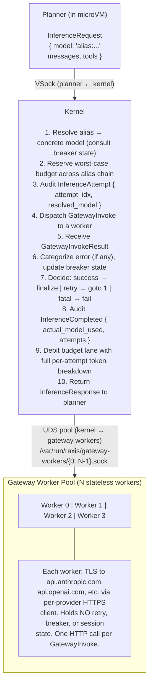
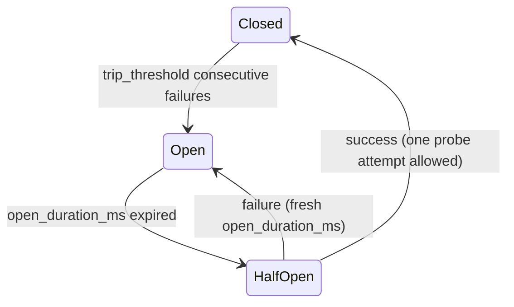
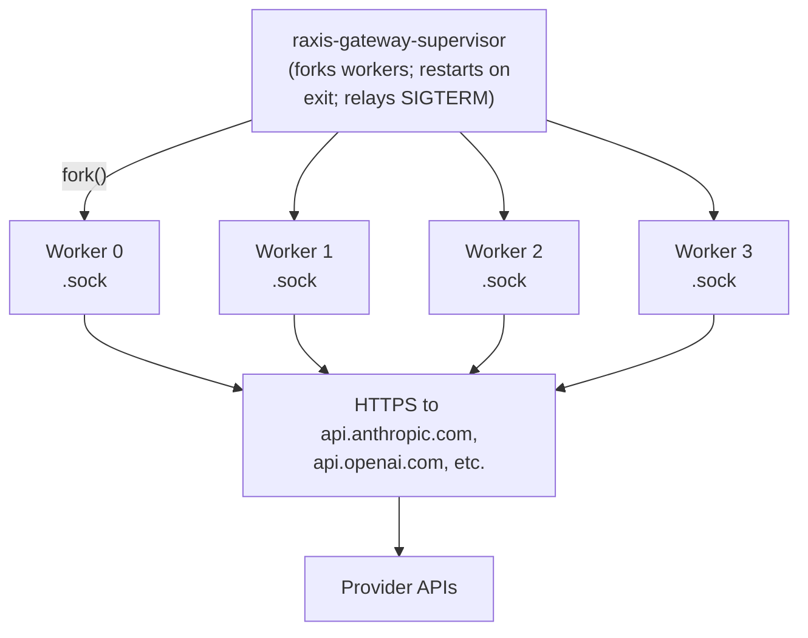

# RAXIS V2 — Provider Failure Handling

> **Status:** V2 Specified
> **Cross-references:**
> - `specs/invariants.md` — INV-04 (financial ceilings), INV-05 (audit chain integrity), INV-08 (synchronous intent/response cycle), INV-09 (runtime classification)
> - `specs/v2/v2-deep-spec.md §raxis-gateway` — Gateway as provider proxy and credential boundary
> - `specs/v2/credential-proxy.md` — INV-VM-CAP-04 (no credential value in VM); how `[[providers.credentials]]` references resolve
> - `specs/v2/key-revocation.md §6` — provider credentials follow the same revocation lifecycle (rotation vs compromise)
> - `specs/v2/host-capacity.md §6.4`, `§7` — Gateway disk usage (response buffering); `INV-CAPACITY-04` audit-write priority
> - `specs/v2/kernel-push-protocol.md` — `KernelPush::ProviderStatusChanged` push frames (informational only in V2)
> - `specs/v2/policy-plan-authority.md` — `INV-POLICY-01` (policy floor; plans cannot expand provider permissions)
> - `specs/v2/token-limit.md` — budget lanes; per-model pricing; budget reservation arithmetic
> - `specs/v2/extensibility-traits.md §7` — `InferenceRouter` trait, of which the kernel↔gateway HTTPS dispatch described in this spec is the V2 default impl (`HttpsGatewayRouter`); local-vLLM, on-prem TGI, and in-cluster gRPC routers are alternative impls that satisfy the same conformance contract.

> **Trait boundary (V2):** Everything in this spec — circuit breakers, retry policy, attempt audit, budget reconciliation, atomic streaming — is **kernel-side** logic that runs *before* `InferenceRouter::complete(...)` is called and *after* it returns. The router itself is the seam at which the actual inference call leaves the kernel. The V2 default `HttpsGatewayRouter` (`crates/raxis-inference-router-https/`, see [`extensibility-traits.md §7.2`](extensibility-traits.md)) wraps the existing kernel↔gateway UDS dispatch. Future routers — `LocalVllmRouter` for trading deployments running on-host GPUs, `LocalTgiRouter` for HuggingFace TGI, `KubernetesInferenceRouter` for in-cluster gRPC inference — plug in here without changing any provider-failure-handling logic in this spec. The kernel still does worst-case budget reservation, attempt-by-attempt audit, circuit-breaker state, and atomic streaming reassembly; the router only does dispatch.

---

## 1. The Problem

LLM provider availability is the most operationally hostile dependency in the RAXIS stack. Providers fail in many ways: rate limits, transient 5xx, timeouts, partial streams, content-filter trips, model deprecations mid-quarter, region brownouts, credential rotations on the operator's side, and outright outages. Each failure mode demands a different response, and the response cannot be left to the planner because the planner is a non-deterministic LLM that cannot be trusted with budget arithmetic, retry policy, or audit immediacy.

This spec defines how the kernel and gateway cooperate to absorb provider failures without violating any of:

- **INV-04 (financial ceilings):** every token billed by a provider must be debited from the corresponding budget lane, regardless of whether the request ultimately succeeded. Silent retry loops that "lose track" of failed-attempt token costs leak the operator's budget.
- **INV-05 (audit chain integrity):** every provider attempt — successful or failed, retried or final — must be recorded before the next attempt is dispatched. A 60-second silent retry loop is a 60-second audit gap and a forensic disaster if the gateway crashes during it.
- **INV-08 (synchronous intent/response cycle):** the planner submits one `InferenceRequest` and receives one response. The planner does not learn about retries, fallbacks, or circuit breaker state through side channels; it only sees the final response envelope (annotated with `actual_model_used` and `total_attempts` for transparency).
- **Determinism of the agent boundary:** the agent is never silently downgraded. If the operator authorized `[opus, sonnet]` as an alias chain, the planner sees in its response which model was actually used. The agent has no other source of truth.

The user-facing question this spec answers: "what happens when a provider returns an error, fails to respond, or rotates credentials, and how do I configure that behavior?"

---

## 2. Architecture: Where State and Policy Live

V2 splits responsibilities cleanly between the Kernel and the Gateway:

| Component | Owns | Does NOT own |
|---|---|---|
| **Kernel** | Retry policy, circuit breaker state, alias resolution, budget reservation and debiting, audit events, all decisions to attempt-or-fail | HTTP transport, credential injection, response parsing |
| **Gateway** | HTTP transport per attempt, credential injection from immutable artifact store, response parsing, error code translation, stream buffering | Retry policy, circuit breaker state, fallback decisions, audit events (it reports to the Kernel; the Kernel writes) |

The Gateway is **stateless across restarts** (`INV-PROVIDER-07`). All routing, breaker, and accounting state lives in SQLite, owned by the Kernel. A Gateway worker can be killed at any moment and restarted by the supervisor without losing in-flight intent state — at worst, the Kernel observes a UDS disconnect on one attempt and dispatches the next attempt to a different worker.

The Gateway is **single-attempt per invocation** (`INV-PROVIDER-03`). It receives a `GatewayInvoke`, makes one HTTP call, returns a `GatewayInvokeResult`, and is done. No background sleeps, no held connections waiting on retry. The Kernel decides whether to issue another `GatewayInvoke` based on the result, the alias chain, the breaker state, and remaining budget.

This split is the single most important architectural commitment of this spec. See §12.2 and §12.3 for the design rationale and the alternatives rejected.

### 2.1 Component diagram



---

## 3. Configuration

### 3.1 `policy.toml` — operator-controlled

The operator declares which providers and models are permitted, the credentials to use, the retry and circuit breaker tuning, and the gateway worker pool sizing.

```toml
[providers]
permitted_models = [
    "anthropic:claude-opus-4.7",
    "anthropic:claude-sonnet-4.6",
    "openai:gpt-5.5-medium",
]

[providers.retry]
max_attempts_per_model        = 3            # per concrete model in the alias chain
max_total_attempts            = 6            # across the entire alias chain (sum of all models)
total_retry_budget_ms         = 60_000       # wall-clock budget across all attempts of one InferenceRequest
base_backoff_ms               = 500
max_backoff_ms                = 30_000
jitter_fraction               = 0.2          # [0.0, 1.0]; backoff = base × 2^attempt × (1 ± jitter)

[providers.circuit_breaker]
trip_threshold                = 5            # consecutive failures to trip
open_duration_ms              = 300_000      # 5 minutes
half_open_max_inflight        = 1            # exactly one probe permitted at a time during HALF_OPEN

[providers.gateway]
worker_pool_size              = 4
worker_invoke_timeout_ms      = 600_000      # 10-minute hard ceiling per attempt; abort if no end-of-stream by then
worker_heartbeat_interval_ms  = 5_000        # gateway → kernel heartbeat during in-progress invocations
worker_uds_dir                = "/var/run/raxis/gateway-workers/"

[providers.streaming]
max_response_buffer_mb        = 64           # in-memory cap before spilling to gateway disk per host-capacity.md §6.4
spill_disk_root               = "/var/lib/raxis/gateway-spill/"

# Per-provider credential bindings. Each entry references a key stored in the
# immutable artifact store (see immutable-artifact-store.md). The value never
# enters a VM (INV-VM-CAP-04). Gateway workers read it on demand for each
# HTTP call.
[[providers.credentials]]
provider = "anthropic"
key_ref  = "anthropic-prod-2026-q1"          # SHA256 of key blob in artifact store

[[providers.credentials]]
provider = "openai"
key_ref  = "openai-prod-2026-q1"

# Per-provider per-model token pricing for budget lane debits. See token-limit.md.
[[providers.pricing]]
model           = "anthropic:claude-opus-4.7"
input_per_mtok  = 15.00      # USD per 1M input tokens
output_per_mtok = 75.00

[[providers.pricing]]
model           = "anthropic:claude-sonnet-4.6"
input_per_mtok  = 3.00
output_per_mtok = 15.00

[[providers.pricing]]
model           = "openai:gpt-5.5-medium"
input_per_mtok  = 5.00
output_per_mtok = 20.00
```

### 3.2 `plan.toml` — agent-controlled

The plan declares aliases. Each alias names a chain of models the planner can request via `model: "alias:<name>"`. Aliases are validated against `policy.toml`'s `permitted_models` at `approve_plan` (`INV-POLICY-01`); a chain referencing a non-permitted model causes `FAIL_ALIAS_REFERENCES_NONPERMITTED_MODEL`.

```toml
[provider_aliases.architect]
models            = [
    "anthropic:claude-opus-4.7",
    "anthropic:claude-sonnet-4.6",
]
fallback_behavior = "attempt_in_order"      # only valid value in V2; reserved for future strategies
session_affinity  = false                    # default; see §4.1.1 below

[provider_aliases.executor]
models            = [
    "anthropic:claude-sonnet-4.6",
]
fallback_behavior = "attempt_in_order"

[provider_aliases.reviewer]
models            = [
    "openai:gpt-5.5-medium",
    "anthropic:claude-sonnet-4.6",
]
fallback_behavior = "attempt_in_order"
# Reviewer sessions benefit from staying on the same model
# across the review loop so the reasoning style and provider-
# side prompt-prefix cache stay consistent; opt in per §4.1.1.
session_affinity  = true
```

A single-model alias (like `executor` above) is the canonical way to express "no fallback." Direct model references in `InferenceRequest` (e.g., `model: "anthropic:claude-opus-4.7"` without the `alias:` prefix) are syntactic sugar for an implicit length-1 alias and resolve via the same code path; this unifies all inference requests under one resolution algorithm.

---

## 4. Provider Aliases and Resolution

### 4.1 Alias resolution algorithm

When the planner submits `InferenceRequest { model: "alias:architect", ... }`, the kernel resolves the alias to a concrete model by walking the chain in order:

```rust
fn resolve_alias(plan: &Plan, alias: &str, breaker: &CircuitState) -> Resolution {
    let chain = plan.provider_aliases.get(alias)?.models;
    let mut all_open    = true;
    let mut all_revoked = true;
    let mut decisions   = Vec::new();

    for (idx, model) in chain.iter().enumerate() {
        let provider = model.provider();

        // Credential check (Tension #6 from design discussion).
        if !credentials_authorized(provider) {
            decisions.push(SkippedReason::CredentialRevoked);
            continue;                                // try next entry
        }
        all_revoked = false;

        // Circuit breaker check.
        match breaker.state_of(model) {
            Closed | HalfOpen { inflight: 0 } => {
                return Resolution::UseModel { idx, model: *model };
            }
            HalfOpen { inflight: 1 } => {
                // a probe is already running; treat as Open for this concurrent request
                decisions.push(SkippedReason::CircuitBreakerOpenOrProbing);
                continue;
            }
            Open { expires_at } => {
                decisions.push(SkippedReason::CircuitBreakerOpen);
                continue;
            }
        }
    }

    // Walked the entire chain without finding an eligible model.
    if all_revoked {
        Resolution::AllRevoked  // → FAIL_PROVIDER_AUTH_REVOKED
    } else if all_open {
        Resolution::AllDegraded  // → FAIL_PROVIDER_UNAVAILABLE_ALL_DEGRADED
    } else {
        // mix of revoked and degraded
        Resolution::ChainExhausted { decisions }  // → FAIL_PROVIDER_UNAVAILABLE_CHAIN_EXHAUSTED
    }
}
```

The kernel records every alias resolution decision as an audit event:

```rust
AuditEventKind::AliasResolved {
    alias:                  String,
    chain:                  Vec<ProviderModelKey>,
    selected_idx:           Option<u32>,           // None if exhausted
    selected_model:         Option<ProviderModelKey>,
    skipped_entries:        Vec<SkipEntry>,        // (idx, model, reason)
    request_id:             RequestId,
}
```

`SkippedEntry` carries `(idx, model, reason ∈ {CredentialRevoked, CircuitBreakerOpen, CircuitBreakerProbing})`. This makes "why did Sonnet get picked over Opus at 14:32?" a SQL query, not an inference from log timestamps.

### 4.1.1 `session_affinity` — opt-in cross-call stickiness within a session

The §4.1 resolver picks the first eligible chain entry on every
call. That is the right default: it means routing decisions are
deterministic per request (no session-scoped routing state hidden
in process memory) and the §12.1 / Alt L decision — the
`ProviderStatusChanged` push is advisory, not normative — keeps
its bite. But there are two cases where per-call resolution
produces visibly worse outcomes than per-session stickiness:

1. **LLM reasoning-style consistency across a session.** A
   Reviewer session that switches from Opus to Sonnet between
   review round 1 and round 2 sees the reasoning style change
   abruptly. The session's transcript becomes a stitched-together
   conversation between two models. For a long-running review
   loop, this degrades quality more than the brief use of a
   fallback model would have.
2. **Provider-side prompt-prefix cache reuse.** Anthropic and
   OpenAI both cache long input prefixes between sequential calls
   from the same API key against the same model. A session that
   sticks to one model amortizes its system prompt + KSB across
   every call; a session that flutters between models pays the
   full input-token cost on every model switch (and burns
   pricing-tier discounts).

`session_affinity` is an opt-in per-alias toggle that introduces
session-scoped pinning:

```toml
[provider_aliases.<name>]
session_affinity  = false   # default — pure per-call resolution (§4.1)
session_affinity  = true    # pin to first-successful model within a session
```

#### Mechanics when `session_affinity = true`

1. **No pin yet** (or pin invalidated, see below): the resolver
   walks the chain per §4.1 unchanged. On the first
   `Final::Success` for this `(session_id, alias_name)` pair, the
   kernel records the selected model as the **pin**:
   `session_alias_pins[(session_id, alias_name)] = selected_model`.
   This happens AFTER the success is committed (so failed probes
   never establish a pin).
2. **Pin present**: the resolver checks the pinned model's
   eligibility *first*, ahead of the chain. If the pinned model
   is `Closed` or `HalfOpen { inflight: 0 }`, it is selected and
   the chain is not walked. The audit event records
   `selected_via_pin: true` and `pin_origin: PinFromSessionAffinity`
   so forensics can see when the pin influenced selection.
3. **Pin model becomes ineligible** (breaker `Open`, credential
   `Compromised`, or model removed from the chain via plan
   epoch): the pin is treated as absent for this resolution.
   The resolver walks the chain per §4.1 normally. On the next
   `Final::Success` against a different model, the pin is
   **re-stamped** to the new model. The previous pin is NOT
   reverted later if its original model recovers — recovery
   would otherwise make the affinity flap, which is the failure
   mode this feature exists to prevent.
4. **Pin scope.** The pin is a `(session_id, alias_name)` key,
   not a `(session_id)` key. A session that uses both
   `alias:reviewer` and `alias:tools_caller` pins each
   independently. The pin is cleared atomically with session
   terminal state (`Completed`, `Failed`, `Aborted`,
   `Cancelled`) — the eviction is part of the same FSM
   transition that sets `sessions.terminal_at`.

#### Storage and crash semantics

Pins are in-memory only:

```rust
struct AliasPinTable {
    inner: BTreeMap<(SessionId, AliasName), PinnedModel>,
}

struct PinnedModel {
    model:        ProviderModelKey,
    pinned_at_ms: i64,
    pinned_request_id: RequestId,   // the InferenceAttempt that established the pin
}
```

There is no SQLite persistence. If the kernel restarts:

- All pins are lost.
- The first post-restart `InferenceRequest` against a previously-
  pinned alias re-walks the chain per §4.1 and may pick a
  different model. The next success re-establishes a pin.
- This is a *correctness-preserving degradation*: the worst case
  is one extra model-switch in a long-lived session that
  survived a kernel restart. No data is lost; no audit gap is
  introduced (every selection emits `AliasResolved` regardless
  of pin state).

Persisting pins to SQLite was considered and rejected: the
storage cost (one row per `(session, alias)` pair, with churn on
every pin re-stamp) exceeds the benefit (eliminating one
post-restart model switch in a feature that exists for cosmetic
reasoning-consistency reasons). If a deployment needs strong
cross-restart affinity, the right answer is to use a single-model
alias chain in the first place.

#### Audit changes

`AliasResolved` gains two fields when `session_affinity = true`:

```rust
AuditEventKind::AliasResolved {
    // … existing fields …
    selected_via_pin:    bool,                  // true if the pinned model was selected
    pin_origin:          Option<PinOrigin>,     // PinFromSessionAffinity | PinReestablished | None
    pinned_at_ms:        Option<i64>,           // when the pin was established (UTC ms)
}
```

Operators querying `AliasResolved` events can answer "for
session S using alias A, when did the model switch and why?"
purely from the audit chain.

#### Interaction with `KernelPush::ProviderStatusChanged`

The advisory push (§4.3, §12.1 / Alt L) remains advisory. A
`ProviderStatusChanged { new_state: HalfOpen }` does NOT cause
the kernel to invalidate a pin or re-walk the chain. The pin's
correctness is checked at *resolution time* against the breaker
state, not at push time. This preserves the §12.1 invariant that
no routing decision is ever driven by a push.

#### Why per-alias instead of global

A single global `session_affinity` flag would force all aliases
in a deployment to behave the same way. But the right answer
depends on the alias's purpose:

- A Reviewer alias (consistency across rounds) benefits from
  affinity.
- A "fast-fallback" alias used only for non-critical telemetry
  calls does NOT — the operator prefers the cheapest currently-
  available model on every call.
- A custom-tool LLM alias might toggle either way depending on
  whether the tool is conversational or one-shot.

Per-alias keeps the choice local to where it's authored, and
it's a one-line opt-in.

#### Migration

V2.0 shipped without `session_affinity` (equivalent to
`session_affinity = false` everywhere). Existing plans continue
to behave identically. Operators who want stickiness add the
flag explicitly. There is no implicit upgrade.

### 4.2 Credential availability

A model is considered **credentially authorized** when:

1. The model's provider has at least one entry in `policy.toml [[providers.credentials]]`.
2. The referenced `key_ref` resolves to a key in the immutable artifact store.
3. The key's trust state is `Trusted` (per [`key-revocation.md §3 key_trust_state`](key-revocation.md) table).

If a credential is `Revoked` for `rotation`, in-flight sessions continue using stale credentials per [`key-revocation.md §6`](key-revocation.md), but new alias resolutions skip that provider's models. If revoked for `compromise`, the session is immediately terminated per `INV-KEY-08` and never reaches alias resolution.

### 4.3 Failure modes during resolution

When resolution returns a non-`UseModel` result:

| Resolution | Returned to Planner | Audit event |
|---|---|---|
| `AllRevoked` | `FAIL_PROVIDER_AUTH_REVOKED { chain }` | `OperatorAttentionRequired { kind: AllAliasCredentialsRevoked }` |
| `AllDegraded` | `FAIL_PROVIDER_UNAVAILABLE_ALL_DEGRADED { chain, breaker_states }` | `AliasChainAllDegraded` |
| `ChainExhausted` | `FAIL_PROVIDER_UNAVAILABLE_CHAIN_EXHAUSTED { decisions }` | `AliasChainExhausted` |

`FAIL_PROVIDER_AUTH_REVOKED` is fatal to the request but does NOT terminate the session. The planner's response is to escalate (`EscalationRequest { class: OperatorIntervention, reason: ProviderCredentialsRevoked }`) so the operator can rotate keys. The agent does not retry — there is no automatic recovery path for credential revocation; that's an operator action.

`FAIL_PROVIDER_UNAVAILABLE_ALL_DEGRADED` is also fatal-to-request but recoverable: when at least one breaker transitions to `HalfOpen`, the next request from the planner will re-resolve and may succeed. The kernel emits `KernelPush::ProviderStatusChanged { provider, model, previous_state: Open, new_state: HalfOpen, reason: OpenWindowElapsed, observed_at_ms }` informationally to every active planner session that has at least one active alias whose chain references this `(provider, model)`; the planner can choose to retry the request or wait. The full push schema (including `previous_state`, `reason`, and `observed_at_ms`) is normative in [`kernel-push-protocol.md §9`](kernel-push-protocol.md). (Per §12.1 / Alt L, V2 does NOT rely on this push for correctness — it's purely advisory; routing decisions are recomputed deterministically at the next alias-resolution call.)

#### Emission point and recipient set

The push is emitted from the same `BEGIN IMMEDIATE` transaction
that commits the `provider_circuit_state` UPDATE and the
`CircuitBreakerStateChanged` audit event (§6.3 / INV-PROVIDER-08).
Concretely, after the SQL `UPDATE provider_circuit_state ...
RETURNING previous_state, new_state` returns the canonical state
transition, the kernel:

1. Emits the audit event (`AuditEventKind::CircuitBreakerStateChanged`).
2. Computes the recipient set by scanning the
   `[provider_aliases]` table (resolved against the active policy
   epoch) for every alias whose chain includes the affected
   `(provider, model)`.
3. For each currently-active session (`sessions WHERE state IN
   ('Active', 'EscalationPending')`) that has at least one
   delegation referencing one of those aliases, the kernel
   enqueues one `KernelPush::ProviderStatusChanged` row in
   `pending_pushes`.

If the recipient set is empty (no live session uses the affected
alias), no push is enqueued — the audit event still records the
state change. This avoids waking sessions that don't care about
the model.

The push respects `push_queue_cap` per `kernel-push-protocol.md
§10`: enqueue happens after the cap check; on overflow the
recipient session takes the standard overflow path and `→
Failed`. The breaker state UPDATE itself is NEVER reverted by a
recipient overflow — the state transition and the audit event are
authoritative; the push delivery is best-effort advisory.

### 4.4 Wildcard and pattern matching: rejected

The schema does NOT support wildcard models in alias chains (`anthropic:*`, `*:claude-*`). Every model in a chain must be explicitly enumerated. This mirrors the per-operator override rule in [`host-capacity.md §15.5`](host-capacity.md): explicit enumeration forces the operator to reason about every routing decision and prevents a single typo from silently downgrading a workload to a non-preferred model. See §12.1 for the design rationale.

---

## 5. Error Categorization

The Gateway translates HTTP responses (and network-level failures) into a closed set of seven typed error categories. The translation is per-provider because the same HTTP code carries different meaning across providers.

### 5.1 The seven categories

| Category | Retry? | Trips breaker? | Planner-visible code | Description |
|---|---|---|---|---|
| `Success` | — | resets failure counter | (no error; returns response) | Provider returned a complete, parseable response with end-of-stream sentinel. |
| `RateLimited` | yes (with `Retry-After` if present) | no | `FAIL_PROVIDER_RATE_LIMITED` (only after retry budget exhausted) | HTTP 429. Honor `Retry-After` header; otherwise exponential backoff. |
| `Unavailable` | yes | yes | `FAIL_PROVIDER_UNAVAILABLE` (only after retry budget exhausted or circuit trips) | HTTP 5xx, 408, network errors (TCP RST, TLS handshake failure, DNS). |
| `ContextExhausted` | no | no | `FAIL_CONTEXT_EXHAUSTED` | HTTP 400/413 with body indicating prompt or context too large. Planner must summarize or escalate. |
| `ContentFilter` | no | no | `FAIL_CONTENT_FILTER_TRIPPED` | Provider's safety filter rejected the request. Planner must escalate (`EscalationRequest { class: ContentSafetyTripped }`); never auto-retried. |
| `ProviderAuth` | no | no | `FAIL_PROVIDER_AUTH` | HTTP 401/403. Operator's credential is invalid or revoked at the provider. Triggers `OperatorAttentionRequired { kind: ProviderAuthFailure }`. |
| `ModelNotFound` | no | no | `FAIL_MODEL_NOT_FOUND` | HTTP 404 with model reference. Operator's `policy.toml` references a model the provider doesn't (anymore) serve. |
| `Malformed` | no | no | `FAIL_REQUEST_MALFORMED` | HTTP 400 without a context-window indication. Indicates a Gateway-side bug or provider API change; retry would yield the same error. |

`Success`, `RateLimited`, and `Unavailable` are the only categories that consume the retry budget. The four fatal categories return immediately to the planner, no retry, no fallback to next alias entry. (Falling through the alias chain on a fatal would mask configuration bugs and cost real money on every secondary attempt.)

### 5.2 Per-provider translation tables

The Gateway has a translation module per provider: `crates/gateway/src/translate/anthropic.rs`, `translate/openai.rs`, etc. Each module exposes:

```rust
pub fn translate(http_status: u16, body: &[u8], headers: &HeaderMap) -> ErrorCategory
```

Excerpt from `translate/anthropic.rs`:

```rust
match (http_status, parse_body_kind(body)) {
    (200, _)                                        => ErrorCategory::Success,
    (429, _)                                        => ErrorCategory::RateLimited { retry_after: parse_retry_after(headers) },
    (500..=599, _) | (408, _)                       => ErrorCategory::Unavailable,
    (400, BodyKind::PromptTooLong)                  => ErrorCategory::ContextExhausted,
    (413, _)                                        => ErrorCategory::ContextExhausted,
    (400, BodyKind::ContentFilterBlocked)           => ErrorCategory::ContentFilter,
    (401, _) | (403, _)                             => ErrorCategory::ProviderAuth,
    (404, BodyKind::UnknownModel)                   => ErrorCategory::ModelNotFound,
    (400, _)                                        => ErrorCategory::Malformed,
    (_,   _)                                        => ErrorCategory::Malformed,  // unknown response → don't retry
}
```

Network-level failures (TCP, TLS, DNS) are categorized as `Unavailable` regardless of provider — the request never reached the provider's application layer.

The `BodyKind::PromptTooLong` and `BodyKind::ContentFilterBlocked` parsers are per-provider; they look for provider-specific JSON keys (`error.type == "context_length_exceeded"` for Anthropic; `error.code == "context_length_exceeded"` for OpenAI). When the provider changes its error envelope (which they occasionally do without notice), the parser falls back to `BodyKind::Unknown`, which routes to `ErrorCategory::Malformed` — the kernel will not auto-retry, which surfaces the parser bug to the operator quickly rather than burning budget in a loop.

### 5.3 The default-to-Malformed principle

When the Gateway cannot confidently categorize an error, it defaults to `Malformed` (no retry, fatal to request). This is deliberate: the alternative — defaulting to `Unavailable` (retry-eligible) — would burn budget on permanent errors whenever a provider's API drifts. We prefer to break loudly and force a Gateway translation update over silently retrying.

This matches the `halt_admit` philosophy from [`host-capacity.md §15.1`](host-capacity.md): predictability over apparent self-healing.

---

## 6. Retry Loop and Circuit Breaker

### 6.1 The retry loop

Per `INV-PROVIDER-03`, the Kernel owns the retry loop. The full state machine for one `InferenceRequest`:

```sql
state RequestProcessing:
    request_id  ← new UUID
    attempts    ← []
    chain       ← resolve_alias(request.model)        // §4.1
    deadline    ← now() + total_retry_budget_ms

    loop:
        if now() > deadline:
            return Final::TimeoutExhausted

        if attempts.len() >= max_total_attempts:
            return Final::AttemptsExhausted

        # Pick next model. May differ from previous attempt's model if breaker
        # state has changed (e.g., previous attempt's failure tripped its breaker).
        resolution ← resolve_alias_with_skips(request.model, attempts)
        match resolution:
            UseModel { model } → continue with this model
            AllDegraded | AllRevoked | ChainExhausted → return Final::Resolution(failure)

        attempt_idx ← attempts.len() + 1

        # Per-model attempt cap.
        attempts_for_model ← attempts.iter().filter(|a| a.model == model).count()
        if attempts_for_model >= max_attempts_per_model:
            mark this model "exhausted for this request"; goto loop
              # next iteration will skip this model in resolve_alias_with_skips

        # Synchronous credential re-check (INV-PROVIDER-09 — closes the
        # alias-resolution → dispatch TOCTOU window). The breaker check
        # in resolve_alias_with_skips above queries key_trust_state; in
        # the time between that query and this dispatch, an operator
        # could have advanced policy with a compromise revocation against the same
        # credential. We re-query under BEGIN IMMEDIATE so the
        # post-revocation state is observed atomically.
        creds_state ← BEGIN IMMEDIATE
                        SELECT trust_state, revoked_at
                          FROM key_trust_state
                         WHERE policy_epoch = current_policy_epoch
                           AND key_id = model.credential.key_ref;
                      COMMIT
        if creds_state.trust_state == Compromised:
            # Operator advanced policy with a compromise revocation between alias
            # resolution and this point. Treat as fatal-to-request
            # (NOT retriable on a different model — INV-KEY-08 demands
            # immediate session termination, which the
            # session-termination path triggered by the policy epoch advance will
            # have already enqueued).
            attempts.push(AttemptRecord {
                model, outcome: ProviderAuth,
                http_code: None, tokens_billed_estimated: 0,
                ...
            })
            audit InferenceAttempt {
                request_id, attempt_idx, alias, resolved_model: model,
                started_at_ms: now(),
                aborted_pre_dispatch: true,
                abort_reason: ProviderCredentialCompromised {
                    key_ref: model.credential.key_ref,
                    revoked_at: creds_state.revoked_at,
                },
            }
            return Final::Resolution(FAIL_PROVIDER_AUTH_REVOKED)

        # Audit BEFORE dispatch (INV-PROVIDER-08).
        audit InferenceAttempt {
            request_id, attempt_idx, alias, resolved_model: model,
            started_at_ms: now(),
        }

        # Acquire a worker. If the pool is saturated, gateway_pool
        # queues the request for up to
        # min(gateway_dispatch_queue_timeout_ms, deadline - now()) ms
        # per §9.2. Queue-wait time is wall-clock budget — it
        # counts against total_retry_budget_ms.
        let queue_started_at = now()
        let queue_budget_ms  = min(gateway_dispatch_queue_timeout_ms,
                                   max(deadline - now(), 0))
        if queue_budget_ms == 0:
            # No remaining budget to even queue. Fail fast.
            attempts.push(AttemptRecord {
                model,
                outcome: GatewayQueueBudgetExhausted,
                tokens_billed_estimated: 0,
                ...
            })
            return Final::Resolution(FAIL_GATEWAY_QUEUE_BUDGET_EXHAUSTED)

        worker = gateway_pool.acquire(queue_budget_ms)?

        let queue_wait_ms = now() - queue_started_at
        if matches!(worker, Err(QueueTimeout)):
            attempts.push(AttemptRecord {
                model,
                outcome: Unavailable,
                tokens_billed_estimated: 0,
                queue_wait_ms,
                ...
            })
            # Queue saturation → don't trip the provider breaker
            # (the failure was on our side, not the provider's).
            continue loop

        # Re-check deadline after the queue wait. The remainder of
        # the loop iteration assumes deadline has not passed.
        if now() > deadline:
            attempts.push(AttemptRecord {
                model, outcome: TimeoutExhausted,
                tokens_billed_estimated: 0,
                queue_wait_ms,
                ...
            })
            return Final::Resolution(FAIL_PROVIDER_TIMEOUT_BUDGET_EXHAUSTED)

        result  ← worker.invoke(GatewayInvoke {
            attempt_id: new UUID,
            provider:   model.provider,
            model:      model.name,
            body:       request.body,
        })

        # Receive result (or worker UDS disconnect).
        match result:
            Ok(GatewayInvokeResult { Success, response, tokens }) →
                update breaker.record_success(model)
                attempts.push(AttemptRecord {
                    model, outcome: Success, tokens, ...
                })
                audit InferenceCompleted {
                    request_id, attempts: attempts.clone(),
                    actual_model_used: model, total_attempts: attempts.len(),
                }
                debit budget lane with full attempt token breakdown
                return InferenceResponse { response, actual_model_used: model, total_attempts }

            Ok(GatewayInvokeResult { Failure, category, http_code, tokens_billed }) →
                attempts.push(AttemptRecord {
                    model, outcome: category, http_code, tokens_billed, ...
                })

                if category in [ContextExhausted, ContentFilter, ProviderAuth,
                                ModelNotFound, Malformed]:
                    # Fatal — no retry, no fallback.
                    finalize budget debit, audit InferenceFailed, return FAIL_*

                # Transient: update breaker, possibly trip.
                if category == Unavailable:
                    update breaker.record_failure(model)
                # rate-limited does NOT trip breaker; just consume budget

                # Compute backoff before next iteration.
                backoff_ms ← if category == RateLimited && retry_after.is_some():
                                retry_after_ms
                             else:
                                exponential_backoff(attempts_for_model, base, max, jitter)
                sleep backoff_ms
                continue loop

            Err(WorkerUdsDisconnected) →
                # Worker died mid-attempt. Cannot tell if request reached provider.
                # Conservatively assume yes — record estimated input tokens.
                estimated ← estimate_input_tokens(request.body, provider)
                attempts.push(AttemptRecord {
                    model, outcome: GatewayUnreachable,
                    tokens_billed_estimated: estimated,
                    ...
                })
                # Treat as Unavailable for retry purposes; do NOT trip provider breaker
                # (this was a gateway failure, not a provider failure).
                # Continue loop — next iteration acquires a different worker.
                continue loop

            Err(WorkerInvokeTimeout) →
                # Worker hit worker_invoke_timeout_ms (default 10 min) without
                # delivering a complete response. Kernel kills the worker; supervisor
                # restarts. Treated as Unavailable.
                attempts.push(AttemptRecord {
                    model, outcome: Unavailable,
                    tokens_billed_estimated: estimate_input_tokens(...),
                    ...
                })
                update breaker.record_failure(model)
                continue loop

            Ok(GatewayInvokeResult { AbortedByDiskPressure,
                                       bytes_received,
                                       estimated_input_tokens,
                                       spill_bytes_freed }) →
                # Worker aborted because min_free_disk_mb was breached
                # during spilling (§7.4). Audit MUST emit against the
                # audit reserve (§7.4.1) so the abort is forensically
                # visible even under disk-pressure halt.
                audit InferenceAttemptAborted {
                    request_id, attempt_id,
                    attempt_idx,
                    alias, resolved_model: model,
                    abort_reason: DiskPressure {
                        free_mb_at_abort,
                        min_free_disk_mb,
                    },
                    bytes_received,
                    estimated_input_tokens,
                    estimated_output_tokens: None,
                    spill_bytes_freed,
                    aborted_at_ms: now(),
                }
                attempts.push(AttemptRecord {
                    model, outcome: Unavailable,
                    tokens_billed_estimated: estimated_input_tokens,
                    ...
                })
                # Disk pressure is a host condition, not a model
                # condition — do NOT trip the provider breaker.
                continue loop
```

**Properties of this loop:**

- Every attempt is audited before the next is dispatched (`INV-PROVIDER-08`). A kernel crash mid-loop loses no audit visibility for completed attempts.
- Operator session abort (`raxis session abort`) is checked at every loop iteration via the session state lookup that's already part of resolve_alias. Cancellation is observed within at most one in-flight attempt's worker_invoke_timeout_ms.
- Policy epoch advance mid-loop (changes to alias chains, breaker tunables, retry budgets) takes effect on the next iteration. In-flight HTTP calls are not interrupted **except for the credential-compromise case** (§6.1.1): a compromise revocation half-closes the worker UDS for every affected in-flight invocation so the worker drops its upstream HTTPS call within milliseconds.
- All sleep happens in the kernel's tokio runtime, not in the Gateway. Gateway workers do nothing during a backoff.

### 6.1.1 Credential compromise during in-flight invocations (`INV-PROVIDER-09`)

The §6.1 retry loop's synchronous re-check covers the
alias-resolution → dispatch TOCTOU window, but does NOT cover an
invocation that has *already been dispatched* to a worker when the
operator advances policy with a compromise revocation. That worker is mid-handshake
or mid-HTTP-call against the provider, holding the now-compromised
credential bytes in its address space. Without an explicit abort
mechanism, the in-flight call continues until it returns naturally
(potentially minutes for a streaming response) — exposing the
revoked credential to the provider in the meantime.

The fix uses a Unix-domain-socket primitive that's already on the
critical path: `shutdown(fd, SHUT_WR)`.

```yaml
Normal in-flight:
  Kernel ──── GatewayInvoke ────►  Worker ──── HTTP request ────►  Provider
  Kernel ◄─── GatewayInvokeResult  Worker ◄─── HTTP response  ◄── Provider

On compromise revocation observed by the kernel:
  Kernel: shutdown(uds_fd, SHUT_WR)   // closes WRITE side of kernel→worker
                                      //  socket; READ side stays open

  Worker: tokio::io::AsyncReadExt::read returns Ok(0) (EOF on its
          receive side).
  Worker: matches read EOF → Aborted
          {
              category: ProviderAuth,
              reason:   KeyCompromised,
              tokens_billed_estimated: <input_estimate>,
          }
  Worker: drops upstream HTTPS connection (TCP RST to the provider).
  Worker: writes Aborted{...} to its UDS write side. Kernel's read
          side is still open, so this delivery succeeds.
  Worker: closes its UDS connection cleanly.

  Kernel: receives Aborted{KeyCompromised}; records the audit attempt
          row with `outcome = ProviderAuth`,
          `abort_reason = KeyCompromised`,
          `tokens_billed_source = Estimated`. The session-termination
          path triggered by the same revocation push has already
          enqueued teardown for the parent session per
          `INV-KEY-08`/`key-revocation.md §5.2`, so this audit
          attempt is the last gateway-side artifact recorded for that
          session.
```

Why **half**-close (`SHUT_WR`) and not full close (`close(fd)`):

If the kernel `close()`d the FD outright, the worker's outbound write
of `Aborted{...}` would race against `EPIPE`: the kernel's read side
is closed, the worker writes, the kernel returns RST, the worker
either swallows the error or panics depending on its tokio handler.
Either way, the kernel never gets a structured `Aborted` audit
record — it sees a generic `WorkerUdsDisconnected` (which §6.1
already handles, but with a less specific reason). Half-close lets
the worker's audit-bearing response come back cleanly, so the
forensic chain captures the exact reason the call was aborted.

#### Mechanics: which UDS FDs to half-close

The kernel's gateway pool tracks every in-flight `GatewayInvoke` by
`(worker_id, attempt_id, session_id, key_ref)`. When a compromise
revocation is observed:

```rust
// kernel/src/key_revocation/in_flight.rs

pub async fn half_close_invocations_using(
    pool: &GatewayPool,
    compromised_key_ref: &KeyRef,
    revocation_reference: &RevocationReference,
) -> Result<(), HalfCloseError> {
    let affected: Vec<InflightInvocation> = pool
        .inflight()
        .filter(|inv| inv.key_ref == *compromised_key_ref)
        .collect();

    for inv in affected {
        // Half-close the kernel's write end of the UDS. The worker
        // sees EOF on its read side and aborts the HTTPS call.
        // Any error here is logged but never propagated upward —
        // the kernel-side teardown of the parent session
        // (INV-KEY-08) is the strict containment boundary; the
        // half-close is an optimization that collapses the
        // exposure window from "session teardown latency" to
        // "<worker abort latency>".
        if let Err(e) = inv.uds.shutdown(Shutdown::Write).await {
            tracing::warn!(
                worker_id = %inv.worker_id,
                attempt_id = %inv.attempt_id,
                error = %e,
                "uds half-close failed; falling back to session-teardown"
            );
        }
        // The kernel's RequestProcessing task is already awaiting
        // `worker.invoke(...).await` for this attempt. The half-close
        // causes the worker's response stream to terminate (with
        // either Aborted{...} or a clean EOF on the response side
        // depending on whether the worker's audit write got through);
        // the kernel records the result in §6.1 step 4-5 as usual.
    }
    Ok(())
}
```

The function is invoked by [`key-revocation.md §5.2 step 4`](key-revocation.md) (live
compromise) and `§5.3 step 4d` (startup reconciliation) immediately
after the parent `sessions` table is updated. It is best-effort: the
authoritative containment boundary is still the
`SessionTerminated{reason: KeyCompromised}` event and its associated
hypervisor stop. Half-close just makes the in-flight HTTPS call drop
within tens of milliseconds rather than waiting for the kernel's
session teardown to chase down the worker's UDS handle indirectly.

#### Why no `RevocationBroadcast` IPC message

An alternative design would add a new `KernelToGateway` message
type — `RevocationBroadcast { key_ref, ... }` — that every worker
receives and uses to filter its in-flight requests. The
`shutdown(SHUT_WR)` design rejects this for three reasons:

1. **Zero new protocol surface.** The kernel and worker already
   speak `GatewayInvoke` / `GatewayInvokeResult` over the UDS. The
   half-close is a stdlib syscall on the existing FD; no new
   protocol versioning, no new wire frames.
2. **No worker-side state needed.** A broadcast design would require
   each worker to maintain a session-id lookup table for in-flight
   requests so it could match the broadcast against the right TCP
   connection. With half-close, the worker just reacts to its read
   EOF — no table, no session-id awareness in the worker.
3. **1:1 connection semantics make it sufficient.** Per
   [`credential-proxy.md §1b`](credential-proxy.md) and §9.1 above, every `GatewayInvoke`
   gets its own UDS connection. Closing one FD is O(1) and affects
   exactly one in-flight invocation. Multiplexed transports would
   require a broadcast, but RAXIS's gateway pool is intentionally
   not multiplexed.

If a future router transport (e.g., gRPC over a shared HTTP/2
connection per [`extensibility-traits.md §7`](extensibility-traits.md)) DOES multiplex multiple
attempts on one stream, the `IsolatedSession`-style trait method
`abort_invocation(attempt_id, reason)` is the right substitute. The
V2 `HttpsGatewayRouter` keeps half-close as its in-flight-revocation
primitive.

#### Error-categorization extension

[`provider-failure-handling.md §5`](provider-failure-handling.md) (error categories) is extended:

| Category | Provider classification | Retriable? | Cross-provider? | Public failure code | Description |
|---|---|---|---|---|---|
| `ProviderAuth` (existing) | yes | no | no | `FAIL_PROVIDER_AUTH` | HTTP 401/403. Operator's credential is invalid or revoked **at the provider**. (Unchanged.) |
| `ProviderAuth` with `abort_reason = KeyCompromised` (new) | no (no HTTP exchange) | no | no | `FAIL_PROVIDER_AUTH_REVOKED` | Kernel-side abort: a compromise revocation arrived while the invocation was in flight. The worker dropped the HTTPS call before it could complete; the operator's session is already being torn down per `INV-KEY-08`. |

The kernel-internal `AttemptRecord.abort_reason` field captures the
distinction so audit replay can tell "provider returned 401" from
"kernel half-closed because the credential was revoked
mid-invocation."

### 6.2 Backoff math

Standard exponential backoff with jitter:

```text
backoff_ms = clamp(
    base_backoff_ms × 2^(attempts_for_model - 1) × (1 + uniform(-jitter_fraction, jitter_fraction)),
    base_backoff_ms,
    max_backoff_ms
)
```

For default settings (`base=500`, `max=30_000`, `jitter=0.2`):

| Attempt | Approximate backoff range |
|---|---|
| 1 (first retry) | 400–600 ms |
| 2 | 800–1,200 ms |
| 3 | 1,600–2,400 ms |
| 4 | 3,200–4,800 ms |
| 5 | 6,400–9,600 ms |
| 6+ | up to 24,000–30,000 ms (clamped) |

The `total_retry_budget_ms` (default 60s) caps the total wait time across all attempts of one request, regardless of per-attempt backoff. This prevents a request from sitting in a 5-minute backoff loop while the planner waits for a response.

`Retry-After` headers from rate-limit responses override the computed backoff when present and shorter than `max_backoff_ms`. If the provider's `Retry-After` is longer than the remaining `total_retry_budget_ms`, the kernel returns `FAIL_PROVIDER_RATE_LIMITED` immediately rather than sleeping for a budget it doesn't have.

### 6.3 Circuit breaker state machine

State per `(provider, model)` pair, stored in `provider_circuit_state`:



**State transitions in detail:**

- **Closed → Open:** when `consecutive_failures` reaches `trip_threshold` (default 5). The `opened_at_ms` and `open_expires_at_ms` are stamped. All subsequent alias-resolution attempts skip this model until the open window expires.
- **Open → HalfOpen:** lazy transition, observed by the resolver. When `now() >= open_expires_at_ms`, the next alias-resolution call promotes the state to `HalfOpen` atomically (via `UPDATE provider_circuit_state SET state = 'HalfOpen' WHERE state = 'Open' AND open_expires_at_ms <= ?` with `RETURNING`). Only one resolver wins the promotion; the others see the new state immediately.
- **HalfOpen → Closed:** on the first successful attempt during HalfOpen. `consecutive_failures` is reset to 0.
- **HalfOpen → Open:** on the first failed attempt during HalfOpen. `consecutive_failures` is incremented; a fresh `open_expires_at_ms = now() + open_duration_ms` is stamped.
- **HalfOpen concurrency (`half_open_max_inflight = 1`):** the `half_open_inflight` column is atomically CASed from 0 to 1 by the request that takes the probe slot. Other concurrent requests see `inflight = 1` and skip the model in their resolution (treating it as effectively `Open` for their purposes). The probe request CASes back to 0 on completion.

**Atomic write commit (INV-PROVIDER-08).** Every `record_failure`,
`record_success`, lazy `Open → HalfOpen` promotion, and HalfOpen-
slot CAS executes inside a single SQLite `BEGIN IMMEDIATE`
transaction that contains:

1. The `UPDATE provider_circuit_state` (state machine mutation).
2. The matching `INSERT INTO audit_events (kind =
   'CircuitBreakerStateChanged', ...)` — when, and only when, the
   transition is state-class (i.e., `from_state != to_state` OR
   `consecutive_failures` crossed `trip_threshold`).
3. (For attempt-driven transitions) The matching `INSERT INTO
   inference_attempts` row recording the outcome that drove the
   transition.

```sql
BEGIN IMMEDIATE;

-- Read-modify-write the breaker row.
UPDATE provider_circuit_state
   SET consecutive_failures      = consecutive_failures + 1,
       last_failure_at_ms        = :now,
       last_failure_kind         = :kind,
       last_failure_http_code    = :http_code,
       state                     = CASE
           WHEN consecutive_failures + 1 >= :trip_threshold
                AND state = 'Closed'
                THEN 'Open'
           WHEN state = 'HalfOpen'
                THEN 'Open'
           ELSE state
       END,
       opened_at_ms              = CASE
           WHEN consecutive_failures + 1 >= :trip_threshold
                AND state IN ('Closed', 'HalfOpen')
                THEN :now ELSE opened_at_ms
       END,
       open_expires_at_ms        = CASE
           WHEN consecutive_failures + 1 >= :trip_threshold
                AND state IN ('Closed', 'HalfOpen')
                THEN :now + :open_duration_ms ELSE open_expires_at_ms
       END,
       last_state_change_at_ms   = CASE
           WHEN <state changed> THEN :now ELSE last_state_change_at_ms
       END
 WHERE provider = :provider AND model = :model
RETURNING state AS new_state, consecutive_failures, ...;

-- Audit row (only when state-class transition).
INSERT INTO audit_events (kind, ...)
VALUES ('CircuitBreakerStateChanged', ...);

-- Attempt row (one per attempt, regardless of state class).
INSERT INTO inference_attempts (...)
VALUES (...);

COMMIT;
```

The single-transaction commit is the technical enforcement of
`INV-PROVIDER-08` for breaker transitions: a kernel crash between
the breaker UPDATE and the audit INSERT cannot leave the system
with a moved breaker but no recording of the move. Either both
land or neither does.

The `record_success` path is symmetric (single transaction, no
audit when the row is `Closed → Closed`, audit when `HalfOpen →
Closed`). The lazy `Open → HalfOpen` promotion is one transaction
covering the conditional UPDATE and the audit. The HalfOpen-slot
CAS (`half_open_inflight: 0 → 1`) is a single UPDATE plus
audit-on-success-or-failure of the probe at the end of the request
loop.

Test surface MUST include a kernel-crash injection between the
UPDATE and the INSERT that asserts the commit either fully lands
or fully rolls back; a half-committed state is a regression.

### 6.4 `provider_circuit_state` schema

```sql
CREATE TABLE provider_circuit_state (
    provider                  TEXT    NOT NULL,
    model                     TEXT    NOT NULL,
    state                     TEXT    NOT NULL CHECK (state IN ('Closed', 'Open', 'HalfOpen')),
    consecutive_failures      INTEGER NOT NULL DEFAULT 0,
    last_failure_at_ms        INTEGER,
    last_failure_kind         TEXT,                                    -- error category
    last_failure_http_code    INTEGER,
    opened_at_ms              INTEGER,                                 -- when state became Open
    open_expires_at_ms        INTEGER,                                 -- when to transition to HalfOpen
    half_open_inflight        INTEGER NOT NULL DEFAULT 0 CHECK (half_open_inflight IN (0, 1)),
    last_success_at_ms        INTEGER,
    last_state_change_at_ms   INTEGER NOT NULL,
    PRIMARY KEY (provider, model)
);

CREATE INDEX idx_provider_circuit_state_open_expires
    ON provider_circuit_state (open_expires_at_ms)
    WHERE state = 'Open';
```

Every state transition emits an audit event:

```rust
AuditEventKind::CircuitBreakerStateChanged {
    provider:                ProviderKey,
    model:                   ModelKey,
    from_state:              BreakerState,
    to_state:                BreakerState,
    consecutive_failures:    u32,
    last_failure_kind:       Option<ErrorCategory>,
    open_expires_at_ms:      Option<u64>,
}
```

### 6.5 `inference_attempts` schema

One row per attempt, indexed by `request_id` for forensic reconstruction:

```sql
CREATE TABLE inference_attempts (
    attempt_id              BLOB    PRIMARY KEY,            -- UUID
    request_id              BLOB    NOT NULL,               -- ties attempts of one InferenceRequest together
    session_id              BLOB    NOT NULL REFERENCES sessions(id),
    attempt_idx             INTEGER NOT NULL,               -- 1-based, monotonic per request_id
    alias                   TEXT,                            -- null if direct model reference
    resolved_model          TEXT    NOT NULL,
    gateway_worker_id       INTEGER NOT NULL,                -- which worker handled it
    started_at_ms           INTEGER NOT NULL,
    completed_at_ms         INTEGER,
    outcome                 TEXT    NOT NULL CHECK (outcome IN (
                                'Success', 'RateLimited', 'Unavailable',
                                'ProviderAuth', 'ContextExhausted', 'ContentFilter',
                                'ModelNotFound', 'Malformed', 'GatewayUnreachable'
                            )),
    http_code               INTEGER,
    input_tokens            INTEGER,
    output_tokens           INTEGER,
    tokens_billed_source    TEXT NOT NULL CHECK (tokens_billed_source IN ('Provider', 'Estimated', 'None')),
    estimation_method       TEXT,                            -- only set when source = 'Estimated'
    UNIQUE (request_id, attempt_idx)
);

CREATE INDEX idx_inference_attempts_session    ON inference_attempts (session_id, started_at_ms);
CREATE INDEX idx_inference_attempts_request    ON inference_attempts (request_id, attempt_idx);
CREATE INDEX idx_inference_attempts_model      ON inference_attempts (resolved_model, completed_at_ms);
```

### 6.6 Concurrency: many sessions, one breaker

When 10 sessions concurrently submit requests resolving to `anthropic:claude-opus-4.7`, and Opus is failing:

1. Sessions 1–5 attempt sequentially-or-concurrently. Each failure increments `consecutive_failures`. On the 5th failure, the breaker trips to `Open`.
2. Sessions 6–10 see `Open` at resolution time and skip directly to the next alias entry (or fail with `AllDegraded`). Their attempts do NOT contribute to `consecutive_failures` — they never made an HTTP call.
3. The trip threshold is consumed by the first sessions to fail, not by every concurrent session simultaneously. This bounds wasted attempts to roughly `trip_threshold` per breaker trip event regardless of session concurrency.

The `consecutive_failures` counter is updated under SQLite's write lock, so the increment is serialized; spurious double-trips on the boundary are not possible.

> **Implementation note (single-lock-per-operation).** The
> `SqliteCircuitStore` Rust mutex (`Mutex<Connection>`) is **not**
> re-entrant on the same thread. Every public method on the store
> — `load`, `list_all`, `record_failure`, `record_success`,
> `maybe_promote`, `manual_reset`, `try_acquire_probe`,
> `release_probe` — acquires `self.conn` exactly once for the
> full duration of the operation. Mutating sites perform their
> post-commit read-back via the private `load_with_conn` helper
> (which takes a borrowed `&Connection`) so the read reuses the
> already-held guard instead of attempting to re-lock. This is a
> deadlock-correctness contract; violating it parks the calling
> thread in `__psynch_mutexwait` with the outer guard still
> held. (Regression first surfaced in the May-10 `8524f50`
> shape; see `crates/store/src/circuit_store.rs`.)

When `Open` expires and the breaker promotes to `HalfOpen`, exactly one session's request takes the probe slot (via the CAS on `half_open_inflight`). The other 9 sessions see `HalfOpen { inflight: 1 }` and treat the model as still-degraded, falling through to the next alias entry. If the probe succeeds, the breaker closes; the next request from any session resolves normally to the now-recovered model.

This design prevents a "thundering herd" of recovery attempts from re-overwhelming a fragile provider.

### 6.7 Operator-facing visibility

```bash
$ raxis providers status
PROVIDER          MODEL                          STATE      FAILURES  OPENED_AT            EXPIRES_AT
anthropic         claude-opus-4.7                Closed     0         —                    —
anthropic         claude-sonnet-4.6              HalfOpen   5         2026-05-04T14:32Z    —
openai            gpt-5.5-medium                 Open       12        2026-05-04T14:35Z    2026-05-04T14:40Z

$ raxis providers reset --provider anthropic --model claude-sonnet-4.6
Reset breaker for anthropic:claude-sonnet-4.6 → Closed (was: HalfOpen, 5 failures).
Audit: BreakerManuallyReset { operator: "alice", previous_state: HalfOpen }
```

Manual reset is operator-only and audited. Useful when an operator knows the cause of degradation has been fixed externally and wants to skip the natural recovery window.

---

## 7. Streaming Atomicity

### 7.1 The atomicity invariant

`INV-PROVIDER-04 (INV-GATEWAY-STREAM-ATOMICITY)`: the Gateway never delivers a partial response envelope to the Kernel. A response is either:

- **(a) Complete:** the provider's end-of-stream sentinel (Anthropic's `message_stop` event, OpenAI's `data: [DONE]`) was observed AND the parsed envelope is structurally valid (well-formed JSON, all expected fields present, all tool-call arguments parseable).
- **(b) Discarded:** the connection was lost before end-of-stream, or the envelope failed structural validation. The buffer is dropped; the result is reported as `ErrorCategory::Unavailable` with `tokens_billed_estimated` covering the input tokens (since the provider may have started generating).

There is no third case. Partial JSON, partial tool calls, half-streamed tokens — all discarded. The planner sees only complete envelopes.

### 7.2 Buffering protocol

The Gateway worker reads the streaming response into an in-memory buffer:

```text
buffer = Vec<u8>::with_capacity(64 KiB)
loop:
    chunk = read_chunk(http_stream).await?
    if chunk.is_eof():
        break
    buffer.extend(chunk)
    if buffer.len() > max_response_buffer_mb × 1024 × 1024:
        # Spill to disk per host-capacity.md §6.4 gateway disk subsystem.
        spill_file = create_spill_file(spill_disk_root, attempt_id)
        spill_file.write_all(&buffer)?
        # Continue reading directly into spill_file
        ...
```

After reading completes:

1. Parse the buffered (or spilled) bytes as the provider's streaming protocol.
2. Verify end-of-stream sentinel was observed.
3. Verify structural completeness (all tool calls have closed JSON, all message blocks have terminators).
4. If all checks pass, construct the response envelope and return `Success`.
5. If any check fails, drop the buffer/spill file, return `Unavailable` (treated as transient; the Kernel will retry).

### 7.3 Heartbeats during long generations

A 100K-token output can take 5+ minutes to stream. The Gateway worker emits a heartbeat to the Kernel every `worker_heartbeat_interval_ms` (default 5s) over its UDS connection while waiting for chunks:

```rust
GatewayHeartbeat {
    attempt_id:           AttemptId,
    bytes_received_so_far: u64,
    elapsed_ms:           u64,
}
```

The Kernel uses heartbeats only to distinguish "worker is alive but slow" from "worker is dead." If two consecutive heartbeats are missed (i.e., 10s of silence), the Kernel kills the worker via SIGKILL and treats the attempt as `WorkerUdsDisconnected`. Heartbeats are NOT recorded in the audit log (they are operational telemetry, not state changes). They ARE counted toward `worker_invoke_timeout_ms`: a worker reaching the timeout while still receiving bytes is killed regardless of liveness.

### 7.4 Disk spill and host capacity

When buffered bytes exceed `max_response_buffer_mb` (default 64), the Gateway spills to `spill_disk_root` (default `/var/lib/raxis/gateway-spill/`). Spill files are:

- Named by `attempt_id` for traceability.
- Capped at `worker_invoke_timeout_ms × max_response_bytes_per_second` total disk usage per worker (computed by the Kernel and enforced as a quota subdir per [`host-capacity.md §6.4`](host-capacity.md) semantics).
- Deleted when the attempt completes (success or failure).
- Cleaned by the Gateway supervisor at startup (any leftover spill from previous worker crashes is garbage).

If `min_free_disk_mb` is breached during spilling (per
[`host-capacity.md §7`](host-capacity.md)), the Gateway worker aborts the in-flight
read, returns a `GatewayInvokeResult::AbortedByDiskPressure`
variant carrying the bytes-received-so-far counter and the
gateway-side input-token estimate, and the Kernel applies retry
policy. The kernel does NOT auto-spawn a new attempt with a higher
disk budget — the retry uses the same buffer/spill caps.

#### 7.4.1 Mandatory audit emission on disk-pressure abort

The kernel writes an `InferenceAttemptAborted` audit event before
the retry-loop iteration continues. The write goes against the
**audit reserve** ([`host-capacity.md §7.5`](host-capacity.md),
`audit_reserved_mb = 1024` by default), so it succeeds even when
the rest of the system is in `DiskFullHalt`:

```rust
AuditEventKind::InferenceAttemptAborted {
    request_id:                Uuid,
    attempt_id:                Uuid,
    attempt_idx:               u32,
    alias:                     String,
    resolved_model:            ResolvedModel,
    abort_reason:              InferenceAttemptAbortReason,
    bytes_received:            u64,                    // bytes received from upstream before abort
    estimated_input_tokens:    u32,                    // gateway-side per-provider estimator
    estimated_output_tokens:   Option<u32>,            // None if no end-of-stream observed
    spill_bytes_freed:         u64,                    // bytes reclaimed when the spill file was deleted
    aborted_at_ms:             u64,
}

enum InferenceAttemptAbortReason {
    DiskPressure {
        free_mb_at_abort:      u64,
        min_free_disk_mb:      u64,
    },
    KeyCompromised {                                    // §6.1.1 / INV-PROVIDER-10
        key_ref:               KeyRef,
        revocation_reference:  RevocationReference,
    },
    OperatorAbort {                                     // raxis session abort mid-stream
        operator_id:           OperatorId,
    },
}
```

The event is structurally distinct from `InferenceAttempt` (which
records dispatch) and `InferenceCompleted` (which records the
provider's final accounting): both `InferenceAttempt` and
`InferenceAttemptAborted` are written for the same `attempt_id`
when an abort fires, leaving an audit-chain pair that pinpoints
exactly which dispatched attempts were terminated by which abort
class. The retry loop's `attempts.push(AttemptRecord { ... })`
records the same outcome as the audit event for the per-request
audit summary at `InferenceCompleted` / `InferenceFailed` time.

`spill_bytes_freed` is provided so observability dashboards can
graph "audit-recorded disk reclamation under pressure" against
`free_mb` to validate the abort path actually relieves pressure.
A non-zero value confirms the spill file existed and was deleted as
part of the abort; a zero value indicates the abort fired before
spilling began (i.e., during in-memory buffering).

The token-estimate fields use the gateway worker's per-provider
input-token estimator (already present per §8.3) so the operator's
budget reconciliation captures the worst-case spend even on aborted
attempts. The provider's actual billing for the partial call is
unknowable; the estimator overshoots conservatively, which is
correct under `INV-PROVIDER-06` (every attempt that consumed
provider tokens MUST be debited).

The audit-reserve write path is the standard
`AuditSink::emit_within_reserve` per [`host-capacity.md §7.5`](host-capacity.md); if
that path is unable to write (i.e., the audit reserve itself is
exhausted), the kernel transitions to `AuditWriteImpossible` per
§7.6 and halts. The retry-loop continuation never observes a
silently-skipped abort audit.

#### 7.4.2 Why audit-on-abort matters

Without the §7.4.1 emission, a sustained disk-pressure event would
abort streaming responses with no audit-chain trace. Forensic
review of the period would show `InferenceAttempt` rows with no
matching `InferenceCompleted` or `InferenceFailed` row — a
"missing-half" pattern indistinguishable from a kernel crash mid-
attempt or an audit gap. With the emission, every aborted attempt
appears explicitly in the chain alongside its abort reason,
preserving forensic completeness through the entire pressure
window.

### 7.5 V2 does NOT support resumable streams

Some providers (OpenAI's beta stream resumability) allow re-attaching to a partially-streamed response via a continuation token. V2 deliberately does NOT support this. The complexity of correctly resuming a stream while preserving budget accounting (input tokens billed once across both attempts? or twice?), content-safety filtering (does the resumed half need re-filtering?), and audit semantics (one attempt or two?) exceeds V2's scope. V2 always re-issues from scratch on stream failure. See §12.7.

---

## 8. Financial Reconciliation and Budget Accounting

### 8.1 Worst-case budget reservation

When the Kernel admits an `InferenceRequest`, it reserves enough budget to cover the worst-case path through the alias chain. For `alias:architect = [opus, sonnet]` with `max_attempts_per_model = 3` and `max_total_attempts = 6`:

```text
worst_case_attempts = min(
    max_total_attempts,                              // 6
    sum(max_attempts_per_model for each in chain)    // 3 + 3 = 6
)

worst_case_input_cost  = sum over distinct models of:
                           input_tokens(request.body) × max_attempts_per_model × price[model].input

worst_case_output_cost = sum over distinct models of:
                           plan.max_output_tokens × max_attempts_per_model × price[model].output

worst_case_reservation = worst_case_input_cost + worst_case_output_cost
```

For an alias chain `[opus, sonnet]` with a 10K-token input and 4K-token max output, the reservation is approximately:

| Model | Per-attempt input | Per-attempt output | Max attempts | Cost per attempt | Subtotal |
|---|---|---|---|---|---|
| Opus | 10K × $15/Mtok = $0.15 | 4K × $75/Mtok = $0.30 | 3 | $0.45 | $1.35 |
| Sonnet | 10K × $3/Mtok = $0.03 | 4K × $15/Mtok = $0.06 | 3 | $0.09 | $0.27 |
| | | | | **Total reservation** | **$1.62** |

If the budget lane has insufficient capacity to reserve $1.62, the request is rejected at admission with `FAIL_INSUFFICIENT_BUDGET_FOR_ALIAS_CHAIN { reservation_required, lane_remaining, chain }`. The planner can simplify (use a shorter alias) or escalate.

### 8.2 Why worst-case and not incremental

Incremental reservation (reserve attempt 1; on failure, re-reserve attempt 2) admits a request with less held budget but creates a hostile failure mode: the kernel admits attempt 1, debits $0.45 of Opus tokens on its failure, and then cannot admit the Sonnet retry because another concurrent request has consumed the lane in the interim. The agent paid $0.45 for Opus, got nothing back, and now cannot fall back to Sonnet either.

Worst-case is pessimistic — it holds budget that may never be spent — but it is deterministic. Once admitted, an `InferenceRequest` is guaranteed to be able to walk its full alias chain regardless of concurrent budget pressure. See §12.5 for the design rationale.

### 8.3 Token billing on failed attempts

Every attempt — successful or failed — debits the budget lane based on tokens actually billed by the provider. The Gateway returns `tokens_billed` in `GatewayInvokeResult` derived from one of three sources:

| Source | When used | Description |
|---|---|---|
| `Provider` | provider returned `usage` headers/fields in the error response | Exact billed tokens from the provider. |
| `Estimated` | provider returned no usage data, OR the connection failed before headers | Gateway computes input-token estimate from the request body using provider's tokenizer. |
| `None` | request never sent (e.g., DNS failure before any HTTP traffic) | Zero tokens debited; the operator was not billed. |

The `Estimated` case uses provider-specific tokenizers:

- Anthropic: byte-pair encoder (`tiktoken`-compatible variant).
- OpenAI: `tiktoken` `cl100k_base` or `o200k_base` per model.
- Other providers: best-known tokenizer; if none available, the Gateway uses a 4-bytes-per-token approximation (intentionally pessimistic per §8.4 over-debit principle).

Estimation only covers input tokens — if the request never returned a complete response, output tokens are zero from the kernel's perspective regardless of what the provider may have started generating (the provider's billing may differ; operators reconcile against provider invoices).

### 8.4 The over-debit principle

When estimation is involved, the kernel always rounds up. A 9,800-token estimate becomes 10,000 in the lane debit. The reasoning: under-debiting violates `INV-04` (operator's lane runs out later than provider's actual bill); over-debiting only causes the operator's budget to exhaust slightly sooner than necessary, which is a recoverable inconvenience (operator tops up the lane). Operators reconcile actual provider invoices against `inference_attempts.tokens_billed_*` periodically; over-debits are a known small drift.

### 8.5 Final debit at request completion

At `InferenceCompleted` (success or fatal failure), the kernel performs a single transactional debit:

```sql
BEGIN IMMEDIATE;

UPDATE budget_lanes
   SET remaining_units = remaining_units - ?
 WHERE lane_id = ?;

INSERT INTO budget_lane_debits (lane_id, request_id, debit_amount, ...)
VALUES (?, ?, ?, ...);

UPDATE inference_attempts
   SET final_billed_at_ms = ?
 WHERE request_id = ?;

COMMIT;
```

The reserved amount (worst-case) is reconciled against the actually-debited amount: `released = reservation - actual_debit`. The released portion returns to the lane immediately.

Audit event:

<!-- spec-graph:cross-ref -->

```rust
AuditEventKind::InferenceCompleted {
    request_id:                RequestId,
    session_id:                Uuid,
    actual_model_used:         Option<ProviderModelKey>,    // None if all attempts failed
    total_attempts:            u32,
    attempts_summary:          Vec<AttemptSummary>,         // (idx, model, outcome, tokens, http_code)
    total_tokens_billed:       TokenCount,
    total_cost_units:          BudgetUnits,
    reservation_held:          BudgetUnits,
    reservation_released:      BudgetUnits,
    final_outcome:             OverallOutcome,              // Success | Failed { kind }
    duration_ms:               u64,
}
```

### 8.6 What if the request was never admitted?

Reservation failure (insufficient budget) returns `FAIL_INSUFFICIENT_BUDGET_FOR_ALIAS_CHAIN` to the planner without debiting anything. No `inference_attempts` rows are created. The audit event is `InferenceRequestRejected { reason: InsufficientBudget, reservation_required, lane_remaining }`.

This is the only path where an `InferenceRequest` results in zero attempts and zero debit. Every other path produces at least one `inference_attempts` row.

---

## 9. Gateway Worker Pool

### 9.1 Topology

The Gateway is deployed as `worker_pool_size` (default 4) identical worker processes, supervised by `raxis-gateway-supervisor`. Each worker:

- Listens on `/var/run/raxis/gateway-workers/{worker_id}.sock` (one UDS per worker).
- Accepts `GatewayInvoke` requests one at a time per UDS connection (the kernel can hold multiple concurrent connections to the same worker for parallel attempts).
- Maintains a per-provider HTTPS client pool (reqwest with connection keep-alive) for outbound calls.
- Reads credentials from the immutable artifact store on each invocation (cached in-memory per worker, invalidated on key revocation events from the kernel).
- Holds NO retry, breaker, session, alias, or budget state.



### 9.2 Worker selection

The kernel maintains an in-memory `gateway_pool: Vec<WorkerHandle>` indexed by `worker_id`. For each `GatewayInvoke`:

1. Query each handle for `inflight_attempts` count.
2. Pick the worker with the lowest count (least-loaded). Ties broken randomly.
3. Acquire a fresh UDS connection from that worker's connection pool (or reuse an idle one).
4. Send the `GatewayInvoke` over that connection; await `GatewayInvokeResult`.

If all workers are at their per-worker concurrency cap (`max_concurrent_attempts_per_worker`, default 8), the kernel queues the dispatch internally before failing the attempt with `Unavailable`. The wait timeout is the **smaller of**:

1. `gateway_dispatch_queue_timeout_ms` (default 5,000 ms; the
   per-attempt cap so a flapping pool never strands a single
   request on the queue forever).
2. `deadline - now()`, where `deadline` is the request-level
   `total_retry_budget_ms` deadline computed at request entry
   (§6.1). If the queue-wait would consume the remainder of the
   request's retry budget, the kernel returns `FAIL_GATEWAY_QUEUE_BUDGET_EXHAUSTED`
   immediately rather than spending budget on a queue position
   the request cannot afford to wait for.

The kernel attributes queue-wait time to the request's
`total_retry_budget_ms` (it is wall-clock time the request paid
for), NOT to `worker_invoke_timeout_ms` (which fences the
provider-side call latency only). Per-attempt backoff time is
charged against the same budget; queue-wait sits adjacent to
backoff in the budget bookkeeping.

If the queue is sustained at saturation (i.e., at least one request
has been in the queue for `gateway_dispatch_queue_timeout_ms`
without being serviced) for `gateway_pool_pressure_seconds`
(default 30s) of wall-clock time, the kernel emits
`OperatorAttentionRequired { kind: GatewayPoolPressure {
  observed_queue_depth, observed_queue_wait_p95_ms,
  duration_seconds } }`. This pages the operator before the
queue-wait failure pattern silently degrades request success
rates.

### 9.3 Per-worker resource caps

Each worker is constrained:

- `max_concurrent_attempts_per_worker = 8` (default)
- Worker process memory: 512 MiB cgroup cap (enforced by supervisor)
- Worker disk: spill quota under `spill_disk_root` per worker (per [`host-capacity.md §6.4`](host-capacity.md))

If a worker exceeds memory cap, the kernel cgroup OOM-killer terminates it; the supervisor restarts. The kernel observes UDS disconnects on all in-flight attempts on that worker and treats them as `WorkerUdsDisconnected`.

### 9.4 Worker crash handling

When a worker dies (segfault, panic, OOM, supervisor restart, kernel SIGKILL on heartbeat-timeout):

1. The kernel's pending `GatewayInvoke` futures on that worker hit a UDS read error.
2. Each pending attempt is categorized as `WorkerUdsDisconnected`.
3. For each, an `InferenceAttempt` audit event is written with `outcome = GatewayUnreachable` and `tokens_billed_estimated = <input estimate>` (per §8.3).
4. The supervisor restarts the worker (with exponential backoff on rapid crash loops; if a worker crashes more than 3 times in 60s, it is left dead and the operator is paged via `OperatorAttentionRequired { kind: GatewayWorkerCrashLooping }`).
5. The kernel removes the dead worker from `gateway_pool` until the supervisor reports it back online.
6. The retry loop continues, dispatching subsequent attempts to surviving workers.

### 9.5 If all workers are dead

If `gateway_pool.len() == 0` (no workers available), the kernel returns `FAIL_GATEWAY_UNREACHABLE` to the planner immediately, no retry. This is fatal-to-request but does NOT terminate the session — the planner may escalate or wait for the supervisor to restore workers. An `OperatorAttentionRequired { kind: GatewayPoolExhausted }` is emitted.

### 9.6 Stateless guarantee

`INV-PROVIDER-07 (INV-GATEWAY-STATELESS)`: a Gateway worker process can be terminated and replaced at any moment, by any signal, without losing kernel-observable state. Specifically:

- All breaker state lives in `provider_circuit_state`, not in worker memory.
- All retry state lives in the kernel's `RequestProcessing` task, not in worker memory.
- All credential bindings are read from the immutable artifact store on each invocation; worker-level caches are an optimization, not a source of truth.
- Worker UDS disconnects are categorized as `WorkerUdsDisconnected` and handled in the retry loop without consulting the worker.

The single exception: an in-flight HTTP call's TCP state lives in the worker. Killing the worker mid-call drops that TCP connection, which the provider observes as a connection reset. The provider may or may not have already billed for the request — captured by `tokens_billed_source = Estimated` in the audit event.

---

## 10. Invariants

### INV-PROVIDER-01 — Plan aliases respect policy floor

Every model named in any `[provider_aliases.<name>] models` entry in `plan.toml` MUST appear in `policy.toml [providers] permitted_models`. `approve_plan` rejects plans with non-permitted models via `FAIL_ALIAS_REFERENCES_NONPERMITTED_MODEL`. There is no runtime fallthrough that could route a planner request to a non-permitted model.

**Where:** §3.1 policy schema; §3.2 plan schema; `policy-plan-authority.md INV-POLICY-01`.

**Scenario it prevents:** A plan declares `[provider_aliases.cheap] models = ["openai:gpt-3.5-turbo"]` while the operator's policy permits only Anthropic. Without INV-PROVIDER-01, alias resolution would walk the chain, find no breaker state for the unknown model, and dispatch a `GatewayInvoke` against an unauthorized provider. INV-PROVIDER-01 catches this at policy epoch-advance time.

### INV-PROVIDER-02 — Circuit breaker state lives in kernel SQLite

All circuit breaker state is stored in the `provider_circuit_state` table, owned by the kernel. Gateway workers do NOT maintain breaker state in process memory. Gateway restarts (planned or crash) do not reset breaker state.

**Where:** §6.4 schema; §12.2 design rationale.

**Scenario it prevents:** The Gateway is restarted during an Anthropic outage. With breaker state in worker memory, all breakers reset to `Closed` and the Gateway hammers Anthropic with a fresh batch of failing requests until the breakers re-trip — billing the operator for every attempt, generating retry storms against an already-degraded provider, and producing a self-inflicted DDoS pattern. INV-PROVIDER-02 ensures the Gateway restart preserves the operator's accumulated routing knowledge.

### INV-PROVIDER-03 — Kernel owns retry loop; Gateway is single-attempt executor

The Kernel owns the retry loop, backoff timers, and per-attempt policy decisions. Gateway workers receive one `GatewayInvoke`, make one HTTP call, return one `GatewayInvokeResult`. Workers do NOT retry, do NOT sleep between attempts, do NOT make policy decisions about whether to attempt a different model.

**Where:** §2 architecture split; §6.1 retry loop; §12.3 design rationale.

**Scenario it prevents:** The Gateway loops silently for 60 seconds during a retry storm. The kernel cannot observe in-flight retries, cannot apply policy changes mid-flight, cannot honor an operator's session abort during the loop, and cannot audit individual attempts until the loop completes. A Gateway crash at second 59 produces a 59-second forensic gap. INV-PROVIDER-03 makes every attempt a kernel-observable transaction.

### INV-PROVIDER-04 — Stream atomicity (no partial responses)

The Gateway delivers a response envelope to the Kernel only after observing the provider's end-of-stream sentinel AND verifying structural completeness (well-formed JSON, all tool-call arguments parseable, all message blocks terminated). Connection drops, parse failures, and structural validation failures cause the partial buffer to be discarded; the result is reported as `Unavailable` for retry.

**Where:** §7 streaming atomicity; §12.4 design rationale.

**Scenario it prevents:** Anthropic drops the TCP connection mid-stream during a tool call. Without INV-PROVIDER-04, the Gateway returns a partial JSON blob to the planner, the planner's tool-argument parser crashes, the planner submits an error intent with the partial JSON in the message body, and the LLM context becomes contaminated with the partial JSON for the rest of the session. INV-PROVIDER-04 ensures the planner sees only complete envelopes; partial deliveries become retries.

### INV-PROVIDER-05 — Worst-case budget reservation across alias chains

When admitting an `InferenceRequest`, the kernel reserves enough budget to cover the worst-case path through the alias chain (every model attempted up to its per-model attempt cap, with worst-case input × `max_output_tokens` per attempt). Once admitted, the request is guaranteed sufficient budget to walk the full chain.

**Where:** §8.1, §8.2, §12.5 design rationale.

**Scenario it prevents:** The kernel admits an `InferenceRequest` with only enough budget for attempt 1 against Opus. Opus fails after burning 5K input tokens; the lane is now empty (concurrent requests consumed it during attempt 1). The fallback to Sonnet cannot be admitted, and the agent paid for Opus but got nothing back. INV-PROVIDER-05 admits only requests that can complete the full chain regardless of concurrent budget pressure.

### INV-PROVIDER-06 — Token billing on every attempt

Every attempt — successful or failed — records `tokens_billed_source ∈ {Provider, Estimated, None}` in `inference_attempts` and contributes to the budget lane debit at request completion. Failed attempts that consumed provider tokens MUST be debited even if the overall request returns `FAIL_*` to the planner.

**Where:** §8.3, §8.4, §8.5.

**Scenario it prevents:** A flaky provider causes 5 failed attempts of 10K input tokens each, then the request is finally returned as `FAIL_PROVIDER_UNAVAILABLE`. Without INV-PROVIDER-06, the kernel debits zero tokens (no successful attempt). The operator's invoice from Anthropic shows 50K input tokens charged. The operator's RAXIS lane shows zero consumption. INV-04 (financial ceilings) is now broken — subsequent runs could exceed the operator's intended cap because the lane never reflects real spending.

### INV-PROVIDER-07 — Gateway is stateless across restarts

A Gateway worker process can be terminated and replaced at any moment (by any signal: SIGTERM, SIGKILL, OOM, supervisor restart, kernel-issued kill on heartbeat-timeout) without losing kernel-observable state. All routing, breaker, retry, and budget state lives in kernel SQLite. In-flight HTTP calls drop, but the kernel observes UDS disconnect, categorizes as `WorkerUdsDisconnected`, and continues retry loop on a different worker.

**Where:** §9.6 stateless guarantee; §9.4 worker crash handling.

**Scenario it prevents:** A Gateway worker holds 30 concurrent in-flight attempts. The worker is OOM-killed. Without INV-PROVIDER-07, the kernel might lose track of those attempts (the worker held their state in memory), leak budget reservations, or fail to record `inference_attempts` audit events. INV-PROVIDER-07 ensures every in-flight attempt is recoverable from kernel SQLite alone; the worker's death is an `Unavailable` outcome on each, no more.

### INV-PROVIDER-08 — Per-attempt audit immediacy

Every `InferenceAttempt` audit event is durably committed before the corresponding `GatewayInvoke` is dispatched. Every `CircuitBreakerStateChanged` audit event is durably committed before the new state takes effect on subsequent resolutions. There is no audit gap during retry loops.

**Where:** §6.1 retry loop (audit before dispatch); §6.3 breaker state machine.

**Scenario it prevents:** The kernel crashes mid-retry-loop. With INV-PROVIDER-08, every attempt that was dispatched has a durable audit row, and the only loss is the in-flight HTTP call (recoverable on restart by re-issuing). Without INV-PROVIDER-08, retry attempts could be ephemeral and a crash mid-loop produces a forensic gap of "the kernel claimed N attempts but only audit-logged M < N of them."

### INV-PROVIDER-09 — Fatal errors do not fall through alias chain

Errors categorized as `ContextExhausted`, `ContentFilter`, `ProviderAuth`, `ModelNotFound`, or `Malformed` return immediately to the planner. The kernel does NOT try the next model in the alias chain on a fatal. Only `RateLimited` and `Unavailable` (transient) consume the chain.

**Where:** §5.1 error categorization; §6.1 retry loop.

**Scenario it prevents:** A plan declares `alias = [opus, sonnet]`. Opus returns `ContentFilter` (the prompt tripped Anthropic's safety filter). Without INV-PROVIDER-09, the kernel falls through to Sonnet, which is the same provider with the same safety filter, and returns the same `ContentFilter`. The operator paid for two attempts and got the same answer. Worse, with cross-provider chains, fatal errors should never silently switch providers — `ContextExhausted` from one model means the prompt is too large for that model's context window, but it might fit in the next; the planner should make that decision deliberately, not have it made implicitly by alias resolution. INV-PROVIDER-09 keeps fatal errors on the planner's plate.

### INV-PROVIDER-10 — Provider-credential compromise interrupts in-flight invocations

When the kernel observes a compromise revocation against a provider
credential (per [`key-revocation.md §5.2`](key-revocation.md)/`§5.3`), the kernel:

1. Performs a synchronous `key_trust_state` re-check immediately
   before every `GatewayInvoke` dispatch, inside `BEGIN IMMEDIATE`,
   and aborts dispatch with `FAIL_PROVIDER_AUTH_REVOKED` if the
   credential's state is now `Compromised` (§6.1 retry-loop step
   "Synchronous credential re-check"). This closes the
   alias-resolution → dispatch TOCTOU window.
2. For every `GatewayInvoke` already dispatched and still
   in-flight against the compromised credential, half-closes
   (`shutdown(fd, SHUT_WR)`) the kernel's write end of the
   gateway-worker UDS connection (§6.1.1
   `half_close_invocations_using`). The worker reads EOF, drops its
   upstream HTTPS call, and returns `Aborted{KeyCompromised}` over
   the still-open read side; the kernel records this as the
   attempt's terminal `InferenceAttempt` audit row with
   `outcome = ProviderAuth`, `abort_reason = KeyCompromised`.

The two layers compose: the synchronous re-check eliminates the
admit-time race; the half-close eliminates the in-flight exposure
window. Together they bound the post-revocation credential exposure
window to approximately one worker-side EOF-detection latency
(milliseconds), regardless of the in-flight call's natural duration.

**Where:** §6.1 retry-loop synchronous re-check; §6.1.1 half-close
mechanics; [`key-revocation.md §5.2`](key-revocation.md) / `§5.3` (the revocation paths
that invoke `half_close_invocations_using`).

**Scenario it prevents:** Operator advances policy with a compromise revocation on
`anthropic-api-key-q4`. Three workers are mid-streaming responses
that started 30 seconds ago and have an estimated 5 minutes
remaining. Without INV-PROVIDER-10, all three calls run to
completion, exposing the compromised credential to Anthropic for the
full 5 minutes (and producing further audit-chain entries against a
credential the operator has just declared untrustworthy). With
INV-PROVIDER-10, all three workers receive UDS EOF within
milliseconds of the revocation push, drop their HTTPS connections,
and emit `Aborted{KeyCompromised}` audit rows. The
`SessionTerminated{KeyCompromised}` events fire in parallel; the
session's VM is hypervisor-stopped per `INV-KEY-08`. Total exposure
window: well under one second.

---

## 11. Implementation Checklist

### 11.0 Trait-boundary refactor (V2 prerequisite, per [`extensibility-traits.md §7`](extensibility-traits.md))

- [ ] **`crates/raxis-inference-router/`** (NEW) — defines `trait InferenceRouter`, `ResolvedInferenceRequest`, `InferenceResponse`, `InferenceStream`, `InferenceError`, `ProviderHealth`. Plus the conformance kit at `tests/conformance.rs`.
- [ ] **`crates/raxis-inference-router-https/`** (NEW; the V2 default) — `HttpsGatewayRouter` wrapping the existing kernel↔gateway UDS dispatch this spec describes. The retry loop, circuit breaker, attempt audit, and worst-case-reservation logic in §6 / §8 stay in the kernel and run *around* `HttpsGatewayRouter::complete(...)`; the router's job is only the dispatch hop to the gateway worker.
- [ ] **`kernel/src/main.rs`** — boot site reads `policy.toml [inference_router]` and constructs `Arc<dyn InferenceRouter>`; default `HttpsGateway`. Future variants (`LocalVllm`, `LocalTgi`, `KubernetesService`) plug in here without changing anything below.
- [ ] **`kernel/src/handlers/inference.rs`** (NEW; carved from `kernel/src/inference/handler.rs` below) — calls `ctx.inference_router.complete(resolved)` after admission/budget/audit; reconciles `InferenceResponse::provider_observed_token_*` per §8.5.
- [ ] **Conformance kit verifies** the kernel-side worst-case reservation, attempt audit, and circuit-breaker state are unchanged across router impls. The kit's mock router exercises every error category in §5.

After this phase, the rest of this checklist still describes the V2 default `HttpsGatewayRouter` topology — the kernel↔gateway UDS dispatch, the per-provider HTTP→`ErrorCategory` mapping, the gateway worker pool. Alternative routers (e.g., `LocalVllmRouter`) bypass the gateway entirely; they implement `InferenceRouter` directly and never touch the items below 11.7.

### Schema (migration N)

- [ ] Create `provider_circuit_state` table (§6.4) with PK on `(provider, model)` and partial index on `open_expires_at_ms WHERE state = 'Open'`
- [ ] Create `inference_attempts` table (§6.5) with indexes on `session_id`, `request_id`, `resolved_model`
- [ ] Add `worst_case_reservation BIGINT` and `actual_debit BIGINT` columns to existing `budget_lane_debits`
- [ ] Add migration step to seed `provider_circuit_state` with `Closed` state for every model in `policy.toml [providers] permitted_models` at first policy load

### `policy.toml` parser (in `crates/types/src/policy.rs`)

- [ ] Parse `[providers]` with `permitted_models: Vec<ProviderModelKey>`
- [ ] Parse `[providers.retry]`, `[providers.circuit_breaker]`, `[providers.gateway]`, `[providers.streaming]`
- [ ] Parse `[[providers.credentials]]` array entries
- [ ] Parse `[[providers.pricing]]` array entries; cross-validate every priced model is in `permitted_models`
- [ ] Validate `worker_pool_size >= 1`, `max_attempts_per_model >= 1`, `total_retry_budget_ms >= max_backoff_ms`, `trip_threshold >= 1`, `open_duration_ms > 0`, `half_open_max_inflight ∈ {1}`
- [ ] Reject policy if any pricing entry references a non-permitted model (`FAIL_PRICING_REFERENCES_NONPERMITTED_MODEL`)

### `plan.toml` parser (in `crates/types/src/plan.rs`)

- [ ] Parse `[provider_aliases.<name>]` blocks with `models: Vec<ProviderModelKey>` and `fallback_behavior`
- [ ] Parse the optional `session_affinity: bool` field on every `[provider_aliases.<name>]` block (§4.1.1); default `false`; also parsed on `[provider_aliases_defaults.<role>]` so the policy default propagates through `plan prepare`
- [ ] Validate `fallback_behavior == "attempt_in_order"` (only V2 value)
- [ ] Validate every `models` entry is in `policy.permitted_models` at `approve_plan`
- [ ] Reject duplicate alias names in the same plan
- [ ] Reject empty alias chains (`models = []`)
- [ ] Reject `session_affinity = true` on a length-1 alias with `WARN_PROVIDER_ALIAS_SESSION_AFFINITY_NO_OP { alias }` (the affinity flag has no observable effect when the chain has one entry)

### `kernel/src/inference/`

- [ ] `kernel/src/inference/resolve.rs`: alias resolution algorithm per §4.1; consults breaker state; emits `AliasResolved` audit; honors `session_affinity` per §4.1.1 (in-memory `BTreeMap<(SessionId, AliasName), PinnedModel>`; pin established on first `Final::Success`; pin re-stamped on success against a different model after the previous pin became ineligible; pins evicted atomically with session terminal state)
- [ ] `kernel/src/inference/breaker.rs`: state machine per §6.3; SQLite-backed; CAS on `half_open_inflight`
- [ ] `kernel/src/inference/retry.rs`: the retry loop per §6.1; backoff math per §6.2; budget reservation reconciliation
- [ ] `kernel/src/inference/budget.rs`: worst-case reservation arithmetic per §8.1; per-attempt debit accumulation; final transactional debit per §8.5
- [ ] `kernel/src/inference/dispatch.rs`: gateway worker pool management; least-loaded selection; UDS disconnect detection
- [ ] `kernel/src/inference/handler.rs`: `InferenceRequest` intent handler that orchestrates the above

### `crates/gateway/`

- [ ] `crates/gateway/src/worker.rs`: stateless worker accepting `GatewayInvoke` over UDS; emits `GatewayHeartbeat`; returns `GatewayInvokeResult`
- [ ] `crates/gateway/src/translate/anthropic.rs`: HTTP-to-`ErrorCategory` mapping per §5.2
- [ ] `crates/gateway/src/translate/openai.rs`: same for OpenAI
- [ ] `crates/gateway/src/streaming.rs`: stream buffering and end-of-stream verification per §7.2; spill-to-disk when buffer exceeds cap
- [ ] `crates/gateway/src/credentials.rs`: per-invocation credential lookup against immutable artifact store; no persistent state
- [ ] `crates/gateway/src/tokenize/`: per-provider tokenizers for input-token estimation (§8.3)
- [ ] `crates/gateway-supervisor/src/main.rs`: forks `worker_pool_size` workers; restarts on exit; tracks crash-loop and pages on threshold

### Audit events (in `crates/audit/src/event.rs`)

- [ ] `AliasResolved { alias, chain, selected_idx, selected_model, skipped_entries, request_id }`
- [ ] `InferenceAttempt { request_id, attempt_idx, alias, resolved_model, gateway_worker_id, started_at_ms }`
- [ ] `InferenceCompleted { request_id, session_id, actual_model_used, total_attempts, attempts_summary, total_tokens_billed, total_cost_units, reservation_held, reservation_released, final_outcome, duration_ms }`
- [ ] `InferenceFailed { request_id, session_id, error_kind, attempts_summary, total_tokens_billed, duration_ms }`
- [ ] `InferenceRequestRejected { reason, reservation_required, lane_remaining }`
- [ ] `CircuitBreakerStateChanged { provider, model, from_state, to_state, consecutive_failures, last_failure_kind, open_expires_at_ms }`
- [ ] `BreakerManuallyReset { provider, model, operator, previous_state, previous_failures }`
- [ ] `AliasChainAllDegraded { alias, chain, breaker_states }`
- [ ] `AliasChainExhausted { alias, decisions }`
- [ ] `OperatorAttentionRequired { kind ∈ {AllAliasCredentialsRevoked, ProviderAuthFailure, GatewayWorkerCrashLooping, GatewayPoolExhausted, BreakerStuckOpen} }`

### CLI

- [ ] `raxis providers status` — show breaker state per (provider, model)
- [ ] `raxis providers reset --provider <p> --model <m>` — manually close a breaker (operator-only, audited)
- [ ] `raxis providers history --request-id <uuid>` — show all attempts for one InferenceRequest
- [ ] `raxis providers history --session <uuid>` — show all attempts for a session
- [ ] `raxis providers reconcile --since <date>` — export `inference_attempts` for invoice reconciliation against provider bills

### Tests

- [ ] Alias validation: plan with non-permitted model → `approve_plan` returns `FAIL_ALIAS_REFERENCES_NONPERMITTED_MODEL`
- [ ] Alias resolution happy path: `[opus, sonnet]`, both Closed → resolves to opus
- [ ] Alias resolution fallback: opus circuit Open → resolves to sonnet
- [ ] Alias resolution all open: opus + sonnet circuits Open → `FAIL_PROVIDER_UNAVAILABLE_ALL_DEGRADED`
- [ ] Alias resolution all revoked: anthropic credential revoked → `FAIL_PROVIDER_AUTH_REVOKED`
- [ ] Alias resolution mixed: opus revoked, sonnet open → `FAIL_PROVIDER_UNAVAILABLE_CHAIN_EXHAUSTED`
- [ ] Direct model reference: `model: "anthropic:claude-opus-4.7"` resolves identically to a length-1 alias
- [ ] Error categorization Anthropic: stub HTTP responses for each (status, body_kind) pair; verify category
- [ ] Error categorization OpenAI: same
- [ ] Default-to-Malformed: stub Anthropic returning HTTP 418 with unknown body → `Malformed` (not `Unavailable`)
- [ ] Retry on transient: stub provider returning 503 then 200; verify attempt 1 fails (Unavailable), attempt 2 succeeds, planner receives success
- [ ] Retry on rate limit with Retry-After: stub 429 with `Retry-After: 2`, then 200; verify backoff honored
- [ ] No retry on fatal: stub provider returning 401; verify single attempt, return `FAIL_PROVIDER_AUTH`
- [ ] Fatal does not fall through: alias `[opus, sonnet]`, opus returns ContextExhausted → return immediately, do not try sonnet
- [ ] Circuit breaker trip: stub opus to fail 5 times; verify breaker → Open; 6th request resolves to sonnet
- [ ] Circuit breaker half-open: advance time past open_duration_ms; verify next request promotes to HalfOpen and probes
- [ ] Circuit breaker recovery: stub opus succeeding during HalfOpen probe; verify breaker → Closed
- [ ] Circuit breaker re-trip: stub opus failing during HalfOpen probe; verify breaker → Open with fresh open_expires_at_ms
- [ ] Half-open concurrency: 10 concurrent requests during HalfOpen; verify exactly 1 takes the probe slot, 9 see Open
- [ ] Worst-case reservation arithmetic: alias `[opus, sonnet]` with 10K input, 4K output, 3 attempts each; verify reservation matches §8.1 worked example
- [ ] Reservation rejection: lane has $1.00, reservation requires $1.62 → `FAIL_INSUFFICIENT_BUDGET_FOR_ALIAS_CHAIN`; no attempts; no debit
- [ ] Token debit on success: single successful attempt; verify lane debited by `tokens × price`; reservation released
- [ ] Token debit on failed attempts: 3 failed attempts (provider returned usage); verify each debits per-attempt usage; verify reservation released for unused capacity
- [ ] Token debit estimation: stub provider returning 5xx with no usage header; verify gateway estimates input tokens; verify lane debited at estimate; verify `tokens_billed_source = Estimated` in audit
- [ ] Stream atomicity: stub provider streaming 50% of response then disconnecting; verify gateway returns `Unavailable`, planner sees no partial response
- [ ] Stream complete-with-bad-JSON: stub provider sending `[DONE]` after malformed JSON; verify gateway returns `Unavailable` (structural validation failed)
- [ ] Stream spill to disk: stub provider sending 100 MiB response; verify spill file created, response delivered, spill file deleted on completion
- [ ] Stream worker timeout: stub provider sending no bytes for 10+ minutes; verify worker killed at `worker_invoke_timeout_ms`, attempt categorized as `Unavailable`
- [ ] Heartbeat timeout: kill worker mid-stream; verify kernel detects missed heartbeats within 10s; categorizes attempt as `WorkerUdsDisconnected`
- [ ] Worker crash mid-attempt: send SIGKILL to worker holding 5 in-flight attempts; verify all 5 attempts return `WorkerUdsDisconnected` with `tokens_billed_estimated`; verify supervisor restarts worker; verify subsequent requests dispatch to other workers
- [ ] Worker crash loop: kill worker 4 times in 60s; verify supervisor stops restarting after 3 crashes; verify `OperatorAttentionRequired { GatewayWorkerCrashLooping }`
- [ ] All workers dead: kill all workers; verify next request returns `FAIL_GATEWAY_UNREACHABLE` immediately; verify `OperatorAttentionRequired { GatewayPoolExhausted }`
- [ ] Per-attempt audit immediacy: kill kernel mid-retry-loop after attempt 2's audit but before attempt 3's dispatch; restart; verify `inference_attempts` has rows for attempts 1 and 2; verify retry resumes correctly
- [ ] Cross-provider credential revocation (rotation): mid-flight policy epoch advance revokes Anthropic credential for `rotation`; new resolutions skip Anthropic models; in-flight session continues with stale credential per [`key-revocation.md §6`](key-revocation.md)
- [ ] Cross-provider credential revocation (compromise): policy epoch advance revokes Anthropic credential for `compromise`; in-flight session terminated immediately per `INV-KEY-08`
- [ ] Operator manual breaker reset: breaker for opus in Open; `raxis providers reset` → Closed; verify audit `BreakerManuallyReset`; verify next request resolves to opus
- [ ] Policy epoch advance changes alias mid-flight: in-flight session has `alias:architect = [opus, sonnet]`; policy epoch advance changes to `[sonnet]`; next request from session uses new chain
- [ ] Policy epoch advance changes retry budget mid-flight: in-flight retry loop running with `total_retry_budget_ms = 60_000`; policy epoch advance changes to `30_000`; verify next loop iteration honors new budget
- [ ] Operator session abort during retry: kernel mid-loop on attempt 3; operator runs `raxis session abort`; verify retry loop exits cleanly within one attempt's `worker_invoke_timeout_ms`; verify final audit records the partial attempts plus abort

---

## 12. Foundational Design Decisions

This section records the seven foundational commitments the provider-failure-handling architecture is built on. Each entry follows the host-capacity.md §15 structure: **the decision**, **the alternative considered**, **why we rejected it**, and **the scenario the rejection prevents**.

### §12.1 — Plan-declared aliases over Kernel-push availability notifications (Option A over Option B)

**Decision.** Operators declare model fallback chains in `plan.toml [provider_aliases.<name>]`. The kernel/gateway honor the chain statically. The agent never receives availability pushes that influence routing.

**Considered alternative.** "Option B" — keep the gateway dumb and stateless about routing; have the planner request a specific model and, on failure, send `KernelPush::ProviderStatusChanged` to inform the agent that a provider has recovered, leaving the LLM to "choose" when to switch back.

**Rejected because.** Three independent flaws in Option B:

1. **Token waste.** Every availability push is consumed by the LLM as part of its context. A flapping provider (Open/HalfOpen/Closed cycling several times in an hour) generates many pushes; each burns tokens in every active session for the duration of the agent's context window.
2. **LLM compliance is unreliable.** The agent might decide it likes Sonnet now and ignore the "Opus is back" push. Or it might hallucinate that Opus is still down despite the push saying otherwise. Routing is too important to delegate to a non-deterministic decision-maker that can rationalize away the recommendation.
3. **State lives in free-text reasoning.** The agent's preferred model becomes a property of its accumulated chat context, not an introspectable structural property. This makes routing decisions unreplayable across sessions and impossible to audit in a structured way.

**Scenario it prevents.** The operator deploys a CI pipeline that runs 50 initiatives nightly, each using `alias:architect`. With Option B, every push notification ("opus is back / opus is down / opus is back") for the night burns tokens across all 50 sessions, costing thousands of dollars over a month for nothing more than informational notifications. With Option A, the gateway routes deterministically based on the operator-authorized chain, no notifications cross the planner boundary, and routing is reproducible from `inference_attempts` alone.

### §12.2 — Kernel-owned circuit breaker state over Gateway-process memory

**Decision.** Circuit breaker state lives in the `provider_circuit_state` SQLite table, owned by the kernel. The Gateway is fully stateless about routing. Per `INV-PROVIDER-02`, Gateway restarts do not affect breaker state.

**Considered alternative.** Standard process-memory circuit breaker inside each Gateway worker (the original framing in the design discussion). On restart, breakers reset to `Closed`.

**Rejected because.** Three operational pathologies:

1. **DDoS-on-restart.** Gateway workers will restart during deployments and during incidents (when providers are flaky and workers may be OOM'd by oversize responses). Process-memory state is lost; the next batch of requests hammers the failed provider. This compounds the original outage with self-inflicted retry storms.
2. **Not auditable.** "Why did Opus get downgraded to Sonnet at 14:32?" should be a SQL query against the audit log. Gateway-memory state requires attaching gdb to a running worker to inspect.
3. **Not inspectable operationally.** `raxis providers status` should show "anthropic:claude-opus-4.7 — Open, 12 consecutive failures, retrying at 14:40Z." That requires SQLite-backed state.

**Scenario it prevents.** During an Anthropic outage, a Gateway worker is OOM-killed by an oversize response from a different (still-working) request. The supervisor restarts. Without kernel-owned state, the new worker's breakers are all `Closed`, and the next 10 requests against opus all dispatch HTTP calls before the breaker re-trips — billing the operator for 10 wasted attempts and adding load to an already-overloaded provider. With kernel-owned state, the new worker checks `provider_circuit_state`, sees `Open`, and skips the dispatch entirely.

### §12.3 — Kernel owns the retry loop; Gateway is single-attempt executor

**Decision.** The Kernel orchestrates retry loops. The Gateway receives one `GatewayInvoke`, makes one HTTP call, returns one result. Per `INV-PROVIDER-03`.

**Considered alternative.** Gateway holds the connection open during retries, sleeps between attempts, and emits `GatewayRetry` events back to the Kernel for audit immediacy.

**Rejected because.** The Kernel-loop approach is structurally superior on five axes:

1. **Per-attempt policy re-evaluation.** Between attempt 1 and attempt 2, the kernel re-checks budget lane (was it just exhausted by a concurrent request?), session state (did the operator cancel?), policy epoch (did the alias chain just change?), and breaker state (did another concurrent session just trip the breaker?). Gateway-loops would have to poll back to the kernel between sleeps to do any of this, at which point the architecture has reinvented kernel-loop with extra steps.
2. **Operator cancellation is trivial.** Kernel-loop checks session state on every iteration. With Gateway-loop, cancellation requires a side-channel kill signal during an in-flight sleep, which is racy.
3. **No background sleeps in the Gateway.** Each `GatewayInvoke` is a clean request-response transaction. Worker crashes mid-sleep are impossible because workers don't sleep.
4. **Audit immediacy is automatic.** Each `InferenceAttempt` audit row is written before the next dispatch — `INV-PROVIDER-08`. The 60-second silent-loop forensic gap from the original framing simply cannot occur.
5. **Gateway statelessness.** Per §12.2, Gateway-loop forces some retry state into the worker (current attempt count, deadline, accumulated token estimates). Kernel-loop keeps the worker pure.

**Scenario it prevents.** A Gateway worker is in attempt 4 of a 60-second retry loop. The kernel crashes and restarts. With Gateway-loop, the worker continues looping silently; the kernel restart has no awareness of the in-flight retry; the audit log shows nothing about attempts 4–N. With Kernel-loop, the kernel restart sees `inference_attempts` rows for attempts 1–3 (durably committed), no in-flight work to recover, and the planner's `InferenceRequest` is reissued from scratch with a clean state — simpler, auditable, and predictable.

### §12.4 — Stream atomicity over partial-response delivery

**Decision.** The Gateway never delivers a partial response envelope. Per `INV-PROVIDER-04`. Connection drops, parse failures, and structural-validation failures cause the buffer to be discarded; the result is reported as `Unavailable` for kernel-orchestrated retry.

**Considered alternative.** Deliver whatever bytes were received; let the planner deal with partial JSON.

**Rejected because.** A partial JSON tool call delivered to the planner has three terrible consequences:

1. The LLM's tool-argument parser crashes (most provider client libraries assume well-formed JSON).
2. The planner submits an error intent containing the partial JSON in its message body, which is logged into the LLM's chat context.
3. The LLM's chat context is now permanently contaminated with broken JSON. Subsequent turns may try to "complete" the broken JSON, treat it as legitimate prior work, or otherwise misinterpret it.

The cost of one extra retry attempt (typically a few seconds and a few cents) is negligible compared to the cost of a contaminated LLM context that produces hallucinated tool calls for the rest of the session.

**Scenario it prevents.** Anthropic drops the TCP connection after sending `{"name": "edit_file", "arguments": {"path": "/work` (the JSON for a tool call argument is half-streamed). With partial delivery, the planner receives this fragment, tries to parse it as a tool call, fails, retries with the LLM, and the LLM (helpfully) tries to "fix" the partial path — possibly by inferring `/workspace/` and editing a file the user did not intend. With INV-PROVIDER-04, the Gateway discards the fragment, retries the full request, and the LLM never sees the malformed bytes.

### §12.5 — Worst-case budget reservation across alias chains

**Decision.** When admitting an `InferenceRequest`, the kernel reserves enough budget to cover the worst-case path through the alias chain. Per `INV-PROVIDER-05`.

**Considered alternative.** Per-attempt incremental reservation: reserve only attempt 1's worst-case; on failure, re-reserve attempt 2's worst-case from whatever budget is currently available.

**Rejected because.** Incremental reservation creates a hostile mid-flight failure mode. The kernel admits attempt 1 against opus, opus fails after burning 5K input tokens (debited), and the lane has been drained by concurrent requests in the interim such that attempt 2 against sonnet cannot be admitted. The agent paid for opus, got nothing back, and cannot fall back. The worst part: the agent has no way to know in advance whether its alias chain will be admitted in full or only partially. Determinism at admission time is more valuable than budget utilization.

Worst-case reservation is pessimistic — it holds budget that may never be spent — but the lane immediately returns the unspent reservation at request completion (per §8.5). Operator-side, the only effect is that very-large pessimistic reservations may temporarily pause new admissions during high-cost requests; this is the correct behavior (the lane is a safety floor, not a yield-maximization target).

**Scenario it prevents.** A 10K-input request against `[opus, sonnet]` is admitted with $0.45 reserved for one opus attempt. Opus fails at $0.45. Concurrent requests from other sessions consume the lane down to $0.05. The kernel needs $0.09 for sonnet but the lane has $0.05. The request returns `FAIL_BUDGET_EXHAUSTED_MID_REQUEST` having burned $0.45 of operator money for no result. With INV-PROVIDER-05, $1.62 was reserved at admission, all attempts are guaranteed admittable, and the worst case is the request completes successfully or fails for non-budget reasons.

### §12.6 — Default-to-Malformed for unknown errors over default-to-Unavailable

**Decision.** When the Gateway cannot confidently categorize an error response, it defaults to `Malformed` (no retry, fatal to request).

**Considered alternative.** Default to `Unavailable` (retry-eligible). Treats unknown errors as transient.

**Rejected because.** Provider APIs drift. When Anthropic adds a new error type or changes their error JSON envelope, the Gateway's `translate/anthropic.rs` parser may not recognize the new shape and falls back to the default. Defaulting to `Unavailable` means every request hitting the new error type burns retry budget (typically 60 seconds, 6 attempts, all the way through the alias chain) before failing — multiplied by every concurrent session encountering the same drifted error simultaneously. This can cost thousands of dollars in a single hour for an obscure new error type.

Defaulting to `Malformed` makes the error visible immediately. The first request hitting the new shape returns `FAIL_REQUEST_MALFORMED` to the planner; the operator notices via `OperatorAttentionRequired` audit events and updates the Gateway translation table. The cost of the misclassification is one failed request per affected session, not a multi-hour retry storm.

This matches the `halt_admit` philosophy from [`host-capacity.md §15.1`](host-capacity.md): predictability and loud failure beat silent best-effort recovery for unknowable conditions.

**Scenario it prevents.** Anthropic introduces a new error type `quota_per_organization_exceeded` (HTTP 400 with body `{"error": {"type": "quota_per_organization_exceeded"}}`). The Gateway's translator doesn't recognize the new type and falls through to default. With default-to-Unavailable, every active session retries 6 times against opus, then 6 against sonnet, all returning the same error — burning 12 wasted attempts each, all charged by Anthropic for the input tokens. With default-to-Malformed, the first request fails immediately, the operator updates `translate/anthropic.rs` to map `quota_per_organization_exceeded → ProviderRateLimited` with a long backoff, and the cost of the drift is one failed request per session instead of dozens.

### §12.7 — V2 does NOT support resumable streams

**Decision.** When a stream fails before end-of-stream sentinel, the Gateway discards the partial buffer and reports `Unavailable`. The kernel retries from scratch. V2 ignores provider features that would allow re-attaching to a partial stream via a continuation token.

**Considered alternative.** Implement provider-specific stream resumability where supported (currently only OpenAI's beta resumable streams).

**Rejected because.** Three open design questions that V2 cannot answer cleanly:

1. **Budget accounting.** If the input was billed once and the resumed half completes the output, does the budget lane debit the input tokens once (treating it as one logical request) or twice (treating it as two attempts)? If once, the audit log misrepresents the actual provider charges. If twice, the budget lane over-debits — but only when resume is used, creating an inconsistency between resumed and non-resumed accounting.
2. **Content-safety filtering.** Some providers re-run content filters on the full response context when resuming. If the partial response was already past content filters at the time of disconnect but the resumed continuation triggers a filter trip, what is the correct outcome? Does the partial output count as "delivered" for safety purposes?
3. **Audit semantics.** Is a resumed stream one `InferenceAttempt` or two? If one, the timing fields (`started_at_ms`, `completed_at_ms`) lose their per-HTTP-call meaning. If two, the resumption logic is just retry-with-extra-state, defeating the simplicity argument for resumption.

V2 takes the simple path: every stream failure is a clean retry. The cost is occasional duplicate input-token charges from the provider for genuinely failed streams; this is small relative to the operator's overall provider spend and is captured in the per-attempt audit trail. V3 may revisit this with a dedicated design pass once V2 has accumulated operational data on stream-failure frequencies.

**Scenario it prevents.** An operator deploys V2 with a custom `crates/gateway/src/streaming.rs` patch attempting OpenAI stream resume. The first resumed request happens during a content-filter trip on the resumed half. The half-streamed output was delivered but the resumed half was filtered; the budget was debited once but the planner has half a tool call. The operator spends a week debugging a logically impossible state. INV-PROVIDER-04 + V2's no-resumption stance keeps this entire failure mode out of scope.

---

## 13. Alternatives Considered and Rejected

### Alt A — Treat alias resolution as a planner concern (planner picks model per request)

Have the planner submit `InferenceRequest { model: "anthropic:claude-opus-4.7" }` directly and, on failure, submit a new `InferenceRequest { model: "anthropic:claude-sonnet-4.6" }` itself. Rejected: this is a refined version of "Option B" rejected in §12.1. The planner has no efficient way to discover availability — every check is a fresh dispatched request. The operator-authorized fallback chain has nowhere to live except as instructions in the planner's prompt, which the LLM may ignore or reinterpret.

### Alt B — Provider-side fallback configuration (provider routes internally)

Some providers offer "model fallback" features where the provider itself routes between models on failure (e.g., "if opus fails, automatically try sonnet"). Rejected: this would put routing decisions outside the kernel's audit boundary and outside the operator's `policy.toml` floor. We cannot enforce `INV-04` (financial ceilings) or `INV-PROVIDER-01` (policy floor) on routing decisions made inside the provider's API. Even if a provider offered this, RAXIS would disable it and route via its own alias mechanism.

### Alt C — Open-circuit duration as a function of failure pattern

Compute `open_duration_ms` dynamically based on observed failure patterns (e.g., longer opens for repeated trips, shorter for first-time trips). Rejected for V2: introduces non-determinism in operator-visible breaker behavior. A flat `open_duration_ms` from `policy.toml` is predictable and easy to reason about. V3 may explore adaptive strategies if operational data supports it.

### Alt D — Per-session circuit breakers instead of global

Maintain breaker state per (session_id, provider, model) triple, so one session's failures don't affect another's routing. Rejected: per-session breakers defeat the purpose. If opus is down for everyone, every session would have to discover it independently, burning N × `trip_threshold` attempts where N is the number of concurrent sessions. Global breakers correctly amortize discovery cost.

### Alt E — Provider-level breakers (one breaker per provider, not per model)

Trip the entire provider when any of its models fails 5 times. Rejected: model-level granularity is necessary because providers often have model-specific outages (a new model rollout fails while older models work fine). Per-provider tripping would over-trip and unnecessarily route away from working models.

### Alt F — Synchronous breaker probe instead of half-open

Instead of HalfOpen state, hold the breaker `Open` and have the kernel periodically (every `open_duration_ms`) actively probe with a tiny synthetic request. If the probe succeeds, transition to Closed. Rejected: synthetic probes burn budget for no work product. The Half-Open lazy promotion approach probes only when there's real work to do, which is the right operational tradeoff.

### Alt G — Single-process gateway (no worker pool)

Run a single Gateway process. Rejected: a single process is a single point of failure. A panic during response parsing or an OOM during a large response takes down all in-flight inference. The worker pool isolates per-worker failures and allows the kernel to keep dispatching to surviving workers during partial Gateway outages.

### Alt H — Worker-managed credentials (worker reads policy.toml directly)

Have each Gateway worker read `policy.toml` and watch for changes. Rejected: this duplicates policy parsing into the worker, requires the worker to handle policy version mismatches with the kernel, and creates a window where the worker and kernel disagree about which credentials are authorized. The kernel passes the credential reference into each `GatewayInvoke`, and the worker resolves it via the immutable artifact store on demand. There is one source of truth (the kernel's policy view), and the worker is dumb about policy.

### Alt I — `[providers.retry]` per-model overrides

Allow per-model retry tuning (e.g., opus gets 5 attempts, sonnet gets 2). Rejected for V2: adds configuration complexity for no clear use case. Per-model attempt cap (`max_attempts_per_model`) is sufficient to express "this model is more flaky, don't waste as many retries on it." V3 may add full per-model retry config if operators report it as needed.

### Alt J — Audit-the-budget-only-at-completion (don't audit per-attempt token estimates)

Skip emitting per-attempt token billing audit events; just do one final `InferenceCompleted` with the totals. Rejected: per-attempt audit is required for invoice reconciliation. Operators run `raxis providers reconcile --since <date>` to compare RAXIS-recorded billing against provider invoices line-item by line-item; aggregated totals would make discrepancies untraceable. The per-attempt audit cost (tens of bytes per row) is negligible.

### Alt K — Allow planner to disable retry for a specific request

Add `InferenceRequest { ..., retry: false }` so the planner can opt out of retry for fast-fail behavior. Rejected for V2: retry is policy, not per-request. Letting the planner opt out of retry allows it to exfiltrate timing-channel information ("how long did this fail in?") and complicates audit semantics. If the operator wants fast-fail behavior, they can set `total_retry_budget_ms = 100` in `policy.toml` for the deployment. Per-request opt-out is V3 territory if it becomes necessary.

### Alt L — `KernelPush::ProviderStatusChanged` is normative (planner must honor it)

Make the recovery push mandatory: when a provider recovers, the planner is required to re-attempt with the recovered model. Rejected: this re-introduces Option B's flaws (token waste, LLM compliance, free-text state). The push remains purely informational in V2 — the planner may use it to surface the recovery to the user, but routing decisions are already correct without the push (the next alias resolution will pick the recovered model deterministically). See §12.7.
