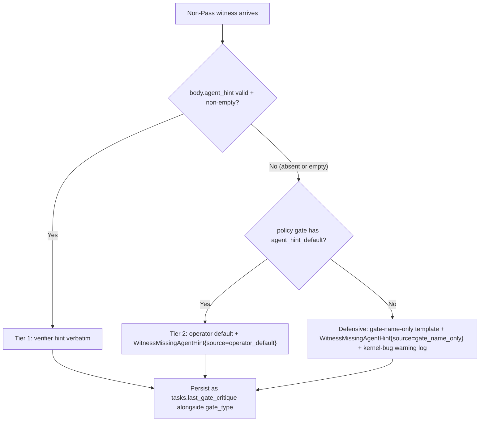
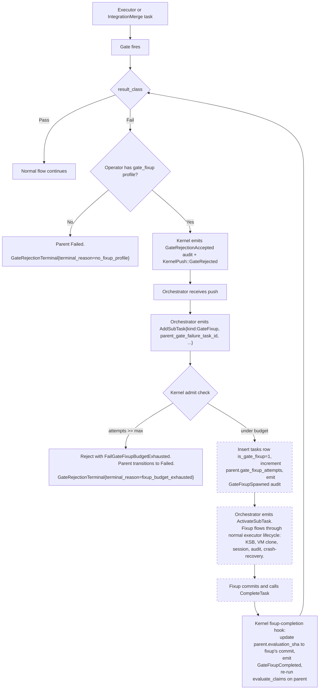

# RAXIS V3 — Gate-Rejection Orchestrator-Spawned Fixup

> **Status (iter72):** **SUPERSEDED — gate-fixup admit is now kernel-authoritative.**
>
> Iter72 retired the orchestrator-mediated fixup admit. The new wire contract:
> - `KernelPush::GateRejected` is **removed**.
> - `IntentKind::AddSubTask` and `SubTaskKind` are **removed** from the wire enums.
> - The kernel's `handlers::witness::process_non_pass_witness` now calls
>   `kernel::gate_fixup::auto_admit_gate_fixup_task` directly. That helper
>   performs the budget check, the parent / fixup-row / DAG-edge insert,
>   and the `gate_fixup_attempts++` in a single SQLite transaction
>   (`INV-GATE-FIXUP-ADMIT-ATOMIC-01`, `INV-GATE-FIXUP-BUDGET-KERNEL-ENFORCED-01`).
> - The orchestrator discovers the newly-admitted fixup task via its next
>   KSB refresh and dispatches it with an ordinary `ActivateSubTask`.
>
> The text below is preserved as design history (rationale, audit-chain
> shape, KSB renderer contract) and remains accurate for those sections.
> Wire-shape references to `KernelPush::GateRejected` and
> `AddSubTask{kind:GateFixup}` are **superseded**; the
> `[gate_fixup]` policy section, the `agent_hint` reserved body key, and
> the per-gate `agent_hint_default` field are **still authoritative**.
>
> **Status (V3, historical):** V3 Specified (kernel-mediated retry budget; orchestrator-spawned fixup task; verifier-script-authored hints; cross-language verifier authoring via `raxis-verifier-submit`).
>
> **Scope.** This spec covers what happens when a kernel-side `[[gates]]` verifier returns a non-`Pass` `result_class`. Today the parent task is stranded in `GatesPending` forever with no audit-visible signal to the orchestrator and no path to recovery; this spec replaces that with a bounded, kernel-budgeted, orchestrator-spawned fixup loop authored against an operator-configured executor profile.
>
> **Cross-references:**
> - [`v1/peripherals.md` §3.3](../v1/peripherals.md) — `WitnessSubmission` wire contract (the canonical live shape; this spec extends it with the `agent_hint` reserved body key, additive).
> - [`v1/kernel-store.md`](../v1/kernel-store.md) — `tasks` / `witness_records` / `verifier_run_tokens` tables.
> - [`v2/agent-disagreement.md`](../v2/agent-disagreement.md) — the reviewer-rejection respawn flow that this spec mirrors structurally.
> - [`v2/integration-merge.md`](../v2/integration-merge.md) — the IntegrationMerge gating point.
> - [`v2/kernel-push-protocol.md`](../v2/kernel-push-protocol.md) — `KernelPush` enum (this spec adds the `GateRejected` variant).
> - [`v2/policy-plan-authority.md`](../v2/policy-plan-authority.md) — `policy.toml` schema (this spec adds the `[gate_fixup]` section + the `agent_hint_default` field on `[[gates]]` rows).
> - [`invariants.md`](../invariants.md) — the four new invariants this spec pins:
>   - `INV-WITNESS-AGENT-HINT-WIRE-VALID-01`
>   - `INV-WITNESS-AGENT-HINT-RESOLUTION-TIERS-01`
>   - `INV-GATE-FIXUP-BUDGET-KERNEL-ENFORCED-01`
>   - `INV-KSB-GATE-FIXUP-CONTEXT-01`

---

## §1 — Why This Spec Exists

The kernel evaluates `[[gates]]` policy rows by spawning a verifier subprocess for each missing-witness `(task_id, evaluation_sha, gate_type)` tuple. The verifier submits exactly one `WitnessSubmission` carrying a `result_class` of `Pass` / `Fail` / `Inconclusive` ([`v1/peripherals.md` §3.3](../v1/peripherals.md)). Today:

- **`Pass`** — the kernel transitions `GatesPending → Admitted` and the parent task continues.
- **`Fail` / `Inconclusive`** — the witness row is committed but the parent task **remains in `GatesPending` forever**. `GatesPending` rejects every subsequent planner intent with `FailTaskNotRunning` (`kernel/src/handlers/intent.rs:741-746`), so the orchestrator cannot send a new `CompleteTask`, cannot escalate, cannot retry — the task is functionally stranded.

In addition, when a verifier emits a non-`Pass` result, the verifier's `body` JSON is opaque to the kernel — the orchestrator has no agent-actionable signal describing what the verifier found. The structured-data fields (`stdout_tail`, etc.) are operator-facing, not agent-facing.

This spec fixes both gaps:

1. **`agent_hint` reserved key.** Verifier scripts populate `body.agent_hint` with a short human-readable repair signal authored statically in their source code, one hint per failure code path. The kernel reads this and propagates it to the orchestrator and downstream executors.
2. **Orchestrator-spawned fixup loop.** On non-`Pass` (under operator-configured budget), the kernel emits `KernelPush::GateRejected` to the orchestrator carrying the resolved hint. The orchestrator responds by emitting `AddSubTask { kind: GateFixup, .. }` + `ActivateSubTask` — existing intents, additive parameter — which spawns a dedicated fixup-executor task against an operator-configured `[gate_fixup]` profile. The fixup edits the worktree, commits, and the kernel re-runs gate evaluation against the new evaluation sha. After `max_attempts` fixup cycles the parent task is `Failed` per existing failure-pipeline rules.

The orchestrator's interaction surface is one new push variant + one new `AddSubTask.kind` value. Every other piece of machinery (DAG, audit chain, KSB, session lifecycle, executor sandbox, FSM transitions) is reused unchanged.

### Design alignment

This spec follows the RAXIS kernel-as-authority pattern:

- **Kernel owns the FSM.** All `tasks.state` transitions go through `transition_task_in_tx` with paired audit writes.
- **Kernel owns the budget.** `[gate_fixup].max_attempts` is enforced at `AddSubTask` admit time; the orchestrator cannot bypass.
- **Kernel owns the audit chain.** Every step of the fixup cycle emits a paired-write audit event.
- **Orchestrator drives the task graph.** `tasks` rows and `subtask_activations` rows always flow from orchestrator-emitted intents — no kernel-direct row creation that would break the "DAG is orchestrator-authored" invariant.
- **Operator owns the policy.** Opt-in via `[gate_fixup]` policy section; opt-out by omitting it (gates remain hard).

---

## §2 — `agent_hint` Reserved Key

### 2.1 Wire location

The `agent_hint` field lives inside `WitnessSubmission.body` as a JSON string under the key `agent_hint`. The `body` field is already gate-type-specific and operator/verifier-author-extensible ([`v1/peripherals.md` §3.3](../v1/peripherals.md)). This spec reserves one key inside that body for the agent-facing repair hint.

```rust
// In kernel/src/handlers/witness.rs:
pub const WITNESS_BODY_AGENT_HINT_KEY: &str = "agent_hint";
pub const WITNESS_AGENT_HINT_MAX_BYTES: usize = 8192;
```

The maximum size matches the reviewer-critique byte ceiling so that orchestrator-side prompt budgets see consistent bounds whether the critique came from a reviewer or a gate.

### 2.2 Distinct from `operator_hints`

The existing `operator_hints` reserved key ([`kernel/src/handlers/witness.rs:158-164`](../../kernel/src/handlers/witness.rs)) is **kernel-owned** — the kernel populates it from policy at commit time and the verifier MUST NOT set it (collision → `INV-WITNESS-OPERATOR-HINT-SPOOFING-REJECTED-01` rejection). The two reserved keys are orthogonal:

| Key | Owner | When written | Visible to |
|---|---|---|---|
| `operator_hints` | Kernel | At witness-commit time, from policy | Operator (audit log, dashboard) |
| `agent_hint` | Verifier script | At verifier-source-code-write time, one branch per detection path | Agent (orchestrator + downstream executors via KSB) |

### 2.3 Script-authored static hints, NOT runtime-generated

The verifier is a deterministic sandboxed binary, NOT an LLM. The hint is authored statically in the verifier's source code, one branch per failure code path, parameterized only by detection facts (file path, line number, match snippet, etc.).

Illustrative pattern in `crates/verifier-no-secrets/src/scan.rs`:

```rust
fn agent_hint_for(kind: PatternKind, file: &Path, line: u32, snippet: &str) -> String {
    match kind {
        PatternKind::AwsAccessKey => format!(
            "AWS access key shape (AKIA[0-9A-Z]{{16}}) detected at {}:{}. \
             RAXIS blocks merges that carry literal AWS keys, including placeholders \
             that match the shape. Remove the literal value and reference an env var \
             or your secret store instead. Match window: {snippet}",
            file.display(), line
        ),
        PatternKind::GitHubPat => format!(
            "GitHub Personal Access Token detected at {}:{}. Move the token to env \
             vars; never commit it. GitHub auto-revokes leaked tokens. Match window: {snippet}",
            file.display(), line
        ),
        // ... one arm per PatternKind ...
    }
}
```

Verifier authors who add a new detection branch MUST add a matching hint constant in the same change — pinned by per-branch unit tests in each verifier crate.

### 2.4 Validity rules

On every `WitnessSubmission` whose `result_class != Pass`:

| `body.agent_hint` state | Kernel action |
|---|---|
| Present, JSON string, non-empty, ≤ `WITNESS_AGENT_HINT_MAX_BYTES` | Use verbatim (Tier 1). |
| Absent, OR present-and-empty-string | Resolve via fallback chain (see §2.5). |
| Present but non-string JSON (e.g. number, object, array) | **Reject submission** with `WitnessRejectionReason::InvalidAgentHint { reason: "non-string" }`. Token NOT consumed. Audit `WitnessMissingAgentHint { reason: "non_string" }`. |
| Present but oversized | **Reject submission** with `WitnessRejectionReason::InvalidAgentHint { reason: "oversized" }`. Token NOT consumed. Audit `WitnessMissingAgentHint { reason: "oversized" }`. |

Pinned by **`INV-WITNESS-AGENT-HINT-WIRE-VALID-01`**.

**`Pass` submissions are exempt** from the validity check — a verifier emitting `Pass` has nothing to repair and need not populate `agent_hint`.

### 2.5 Three-tier resolution chain on non-`Pass`

When the verifier emits a non-`Pass` result and `body.agent_hint` is absent or empty, the kernel resolves the effective critique through a deterministic fallback chain:



- **Tier 1 (preferred).** Verifier-script-emitted, per failure code path. Used verbatim.
- **Tier 2 (mandatory at policy load).** `[[gates]].agent_hint_default` in `policy.toml` carries an operator-authored fallback for that gate type. **Policy load rejects any `[[gates]]` row that omits `agent_hint_default`** (`PolicyValidationError::GateMissingAgentHintDefault`). At runtime this tier is therefore always available.
- **Defensive gate-name-only template.** Last-resort fallback used only when policy validation has been bypassed (e.g. by a future regression). Renders `"Gate '{gate_type}' rejected this change. Review your work against the '{gate_type}' policy and adjust."` — using only the `gate_type` which is always present in `[[gates]]`. Emits a loud kernel-bug warning log along with the `WitnessMissingAgentHint{source="gate_name_only"}` audit so operators see the structural problem.

Tier-2 and the defensive fallback both **commit the witness** (graceful degradation, not refusal) and emit `WitnessMissingAgentHint` audits with a `source` discriminator. Tier-1 commits the witness without the missing-hint audit.

Pinned by **`INV-WITNESS-AGENT-HINT-RESOLUTION-TIERS-01`**.

### 2.6 `gate_type` always paired with the critique

Regardless of which tier produces the text, the kernel persists `(tasks.last_gate_critique, tasks.last_gate_type)` together and pairs them in the `KernelPush::GateRejected` push and the fixup-executor KSB. The agent always sees both the gate-name handle (structural, KSB-visible) and the hint (specific guidance). This means even a generic defensive-fallback hint becomes actionable — the agent can search its KSB for the gate definition in `policy.toml`.

---

## §3 — `[gate_fixup]` Policy Section

### 3.1 Schema

```toml
# policy.toml — OPTIONAL section.
# When absent, gate failures lead directly to task Failed (current behavior).
# When present, the kernel spawns the orchestrator-driven fixup loop.
[gate_fixup]
enabled              = true                                # explicit opt-in
max_attempts         = 3                                   # default 3
executor_image       = "raxis/executor:fixup-v1"           # dedicated image for fixups
max_turns            = 8                                   # focused, smaller than primary executors
max_cost_per_run     = 5000                                # in tokens/cost-units
wall_clock_seconds   = 600                                 # hard timeout
# Optional override (else inherits from [executor]):
# allowed_egress_aliases = ["..."]
```

### 3.2 Opt-in semantics

- **No `[gate_fixup]` section** → gates remain hard. On non-`Pass`, the kernel transitions parent `GatesPending → Failed` with `GateRejectionTerminal { terminal_reason: "no_fixup_profile" }`. No push is emitted.
- **`[gate_fixup].enabled = false`** → equivalent to absent (gates are hard).
- **`[gate_fixup].enabled = true`** → fixup loop active. On non-`Pass`, the kernel emits `KernelPush::GateRejected` and waits in `GatesPending` for the orchestrator's `AddSubTask{kind: GateFixup}`.

### 3.3 Required `agent_hint_default` on every `[[gates]]` row

When `[gate_fixup]` is enabled, the policy parser requires that every `[[gates]]` row also carries `agent_hint_default = "..."`. Rationale: tier-2 of the agent-hint resolution chain (§2.5) must be defined or the loop relies on the defensive fallback, which is meant to be unreachable at runtime. Missing → `PolicyValidationError::GateMissingAgentHintDefault`.

When `[gate_fixup]` is absent, `agent_hint_default` is also optional (no fixup loop will ever read it).

---

## §4 — Orchestrator-Spawned Fixup Flow

### 4.1 Overview



### 4.2 `KernelPush::GateRejected`

```rust
KernelPush::GateRejected {
    parent_task_id:           TaskId,
    gate_type:                String,
    critique:                 String,   // resolved hint (Tier 1 / 2 / defensive)
    evaluation_sha:           String,   // sha that failed the gate
    attempt_index:            u32,      // how many fixup attempts have ALREADY been made
    max_attempts:             u32,      // from [gate_fixup].max_attempts
    parent_worktree_pointer:  String,   // for the orchestrator to reference
}
```

Wire discriminant byte index **`4`** (next free after the existing variants). Wire round-trip pinned in `crates/types/src/push.rs` symmetric with `ReviewRejected`.

The push is emitted **exactly once per gate-rejection event**, not per fixup attempt. If the orchestrator chooses to spawn a fixup, that fixup's eventual completion either re-passes the gate (loop ends) or re-fails the gate (kernel emits another push for the next attempt).

### 4.3 `AddSubTask` extension — `kind: GateFixup`

The `AddSubTask` intent payload gains additive parameters:

```rust
pub enum SubTaskKind {
    Executor,    // default; existing behavior
    Reviewer,    // existing reviewer flow
    GateFixup,   // NEW — kernel-budgeted fixup task
}

pub struct AddSubTaskIntent {
    // ... existing fields ...
    pub kind:                          SubTaskKind,
    pub parent_gate_failure_task_id:   Option<TaskId>,
    pub parent_gate_failure_type:      Option<String>,
}
```

`kind` defaults to `Executor`, so every existing caller is unaffected.

### 4.4 Admit logic in `handle_add_sub_task`

When `kind == GateFixup` the handler:

1. **Validates the fixup context.** `parent_gate_failure_task_id` and `parent_gate_failure_type` are both `Some(_)`. Otherwise → `FailMissingFixupContext`.
2. **Checks the budget.** Loads parent task; if `parent.gate_fixup_attempts >= policy.gate_fixup.max_attempts`:
   - Transitions parent `GatesPending → Failed` (paired write with `TaskStateChanged`).
   - Emits `GateRejectionTerminal { terminal_reason: "fixup_budget_exhausted" }`.
   - Rejects the `AddSubTask` with `FailGateFixupBudgetExhausted`.
3. **Inserts the fixup task.** New `tasks` row with `is_gate_fixup = 1`, `parent_gate_failure_task_id = parent`, `parent_gate_failure_type = gate_type`, `state = Admitted`. Policy fields (`max_turns`, `max_cost`, `wall_clock`, `executor_image`) are overridden from the `[gate_fixup]` profile rather than from orchestrator-supplied values, so the orchestrator cannot inflate the fixup's budget.
4. **Increments parent's `gate_fixup_attempts`** atomically in the same SQLite transaction.
5. **Emits `GateFixupSpawned`** audit event paired with the insert.

Pinned by **`INV-GATE-FIXUP-BUDGET-KERNEL-ENFORCED-01`** (budget enforcement on a single code path).

### 4.5 Fixup-task completion hook

When a task with `is_gate_fixup = 1` calls `CompleteTask` (or crashes / times out), `handle_complete_task` runs a small post-commit hook on the parent task:

- **`completed_with_commit`** (the fixup made a new commit):
  - Emit `GateFixupCompleted { outcome: "completed_with_commit", new_evaluation_sha }`.
  - Update `parent.evaluation_sha` from the fixup's payload.
  - Re-run `evaluate_claims` on the parent against the new sha (existing function, new call site).
  - If gate passes → existing `gate_recheck` path transitions parent `GatesPending → Admitted`. Normal flow resumes.
  - If gate fails again → loops back into the witness handler's `gate_rejection_commit` (which emits another `KernelPush::GateRejected` for the next fixup attempt, until budget exhausted).
- **`completed_no_commit`** (the fixup exited successfully without a new commit): emit `GateFixupCompleted { outcome: "completed_no_commit" }`. Parent's `evaluation_sha` unchanged. Budget already incremented at admit; no re-evaluation. The next gate cycle will re-fire on the same evaluation_sha.
- **`crashed` / `timed_out`**: emit `GateFixupCompleted { outcome: "crashed"|"timed_out" }`. Same treatment as `completed_no_commit`. Budget already incremented at admit; no re-evaluation.

### 4.6 Fixup-executor KSB shape

When a task with `is_gate_fixup = 1` is being assembled into a KSB, the assembler carries a focused fixup-context block:

```
{
  "kind": "gate_fixup",
  "parent_task_id": "...",
  "parent_gate_failure_type": "NoSecretStrings",
  "agent_hint": "AWS access key shape detected at src/auth.rs:42. ...",
  "parent_evaluation_sha": "...",
  "parent_worktree_pointer": "..."
}
```

Non-fixup tasks (`is_gate_fixup = 0`) see their KSB unchanged — no gate-rejection noise leaks into the orchestrator's view or other executors' views.

Pinned by **`INV-KSB-GATE-FIXUP-CONTEXT-01`**.

### 4.7 Dashboard rendering

`is_gate_fixup` flows through the existing `DagNode` plumbing (the same path that already carries `is_active`). The dashboard renders fixup nodes with:

- A **dashed border** distinguishing them from normal-plan nodes.
- A wrench-glyph chip labeled "Gate fixup".
- A **dashed edge** back to the parent task whose gate failed.
- A focus-panel right-rail that surfaces the parent task id + gate_type + critique excerpt.

This makes the auto-recovery loop visible at a glance — operators see fixup nodes appear and dashed-line back to the failed parent as the orchestrator works the loop.

### 4.8 Schema additions

New columns on `tasks` (migration `0030_iter65_v3_tasks_gate_fixup.sql`):

```sql
ALTER TABLE tasks ADD COLUMN gate_reject_count          INTEGER NOT NULL DEFAULT 0;
ALTER TABLE tasks ADD COLUMN gate_fixup_attempts        INTEGER NOT NULL DEFAULT 0;
ALTER TABLE tasks ADD COLUMN last_gate_critique         TEXT;
ALTER TABLE tasks ADD COLUMN last_gate_type             TEXT;
ALTER TABLE tasks ADD COLUMN is_gate_fixup              BOOLEAN NOT NULL DEFAULT 0;
ALTER TABLE tasks ADD COLUMN parent_gate_failure_task_id   TEXT;
ALTER TABLE tasks ADD COLUMN parent_gate_failure_type      TEXT;

CREATE INDEX idx_tasks_parent_gate_failure
    ON tasks(parent_gate_failure_task_id)
    WHERE is_gate_fixup = 1;
```

### 4.9 Audit events

| Event | When emitted | Paired write |
|---|---|---|
| `GateRejectionAccepted` | Non-`Pass` witness committed with `[gate_fixup]` configured | With `witness_records` insert |
| `GateRejectionTerminal { terminal_reason }` | Non-`Pass` ending in parent `Failed` (`terminal_reason` ∈ `"no_fixup_profile"`, `"fixup_budget_exhausted"`, `"fixup_executor_failed"`) | With `TaskStateChanged { GatesPending → Failed }` |
| `GateFixupSpawned` | `AddSubTask{kind: GateFixup}` admitted | With `tasks` insert + parent's `gate_fixup_attempts` increment |
| `GateFixupCompleted { outcome }` | Fixup task reaches terminal state | With fixup task's `TaskStateChanged` |
| `WitnessMissingAgentHint { source, reason }` | Tier-2 or defensive fallback used, OR wire-invalid hint rejected | Standalone (not paired with witness commit when rejected) |

All emitted via the existing audit-chain Pattern C inside the witness handler's or intent handler's SQLite transaction.

---

## §5 — Cross-Language Verifier Authoring

### 5.1 The bincode wall

The live wire transport is bincode-over-Unix-Domain-Socket ([`crates/ipc/src/lib.rs`](../../crates/ipc/src/lib.rs)) — Rust-native, not directly speakable from bash/Python/Go. Cross-language verifier authoring requires a bridge.

### 5.2 `raxis-verifier-submit` bridge binary

New crate `crates/verifier-submit/` producing the binary `raxis-verifier-submit`. Usage:

```bash
raxis-verifier-submit < submission.json > ack.json
```

The binary:

1. Reads a JSON `WitnessSubmission` from stdin.
2. Validates the schema **before sending**, including the `agent_hint` reserved-key contract from §2 — if `result_class != "Pass"` and `body.agent_hint` is missing/empty/invalid, the binary rejects locally with exit code 4 and a structured error on stderr.
3. Connects to the UDS at `$RAXIS_VERIFIER_SOCKET_PATH` (same env var as the Rust-native verifier).
4. Frames the submission as bincode.
5. Reads the bincode `WitnessAck`.
6. Prints the ack as JSON on stdout.
7. Exits with:
   - `0` — `Pass` accepted.
   - `1` — non-`Pass` accepted (witness committed, fixup loop may follow).
   - `2` — rejected.
   - `3` — IO/transport error.
   - `4` — schema-validation error before send.

The JSON schema is derived from the Rust `WitnessSubmission` struct via `schemars` and pinned by a round-trip test so it cannot drift from the struct silently.

### 5.3 Example verifiers

Three reference verifiers ship under `guides/verifiers/`:

- **`rust-example/`** — uses the new `raxis-verifier-sdk` crate directly (no bridge needed; speaks bincode natively). Demonstrates the typestate-enforced builder (see §6).
- **`python-example/`** — pure stdlib Python; builds a JSON `WitnessSubmission` and pipes it to `raxis-verifier-submit`. No third-party deps.
- **`bash-example/`** — POSIX bash; uses `printf` + `cat` + `raxis-verifier-submit`. Shellcheck-clean.

Each example exercises both Tier-1 hint emission and a Pass case, and ships with a README walking through the contract end-to-end. CI runs all three against a fake-kernel UDS fixture to ensure they keep working.

### 5.4 Verifier-author contract (any language)

1. Read inputs from env (`RAXIS_VERIFIER_TOKEN`, `RAXIS_TASK_ID`, `RAXIS_GATE_TYPE`, `RAXIS_EVALUATION_SHA`, `RAXIS_WORKTREE_ROOT`, `RAXIS_KERNEL_SOCKET`, `RAXIS_INITIATIVE_ID`).
2. Run detection logic against the worktree.
3. If non-`Pass`, populate `body.agent_hint` with a non-empty UTF-8 string ≤ 8192 bytes — authored statically per failure code path.
4. Submit the witness (bincode-native for Rust verifiers; via `raxis-verifier-submit` for everyone else).
5. Read the ack.
6. Exit with the appropriate code.

---

## §6 — `raxis-verifier-sdk` (Rust Compile-Time Enforcement)

For Rust verifier authors, a thin `crates/verifier-sdk/` crate provides a typestate builder that makes the `agent_hint` contract compile-time-enforced:

```rust
use raxis_verifier_sdk::{SubmissionBuilder, AgentHint};

// Compile-time enforcement: cannot construct a Fail submission without a hint.
let submission = SubmissionBuilder::new(envelope)
    .fail(AgentHint::new("Detected AWS key shape at src/auth.rs:42")?)
    .body(serde_json::json!({ "findings": [...] }))
    .build();
```

`AgentHint::new` validates non-empty + size at construction. `fail()` and `inconclusive()` take an `AgentHint` positionally; `pass()` takes none. A `trybuild` compile-fail test pins that calling `fail(envelope)` without a hint fails to compile.

Cross-language verifiers (via `raxis-verifier-submit`) rely on runtime validation only — the SDK is additive belt-and-braces for Rust callers.

---

## §7 — Invariants

The four new invariants pinned by this spec, recorded in [`specs/invariants.md`](../invariants.md):

- **`INV-WITNESS-AGENT-HINT-WIRE-VALID-01`** — Wire-invalid `agent_hint` values (non-string / oversized) MUST reject the submission with `InvalidAgentHint` and NOT consume the verifier token.
- **`INV-WITNESS-AGENT-HINT-RESOLUTION-TIERS-01`** — Non-`Pass` witnesses without a valid `agent_hint` MUST resolve via the deterministic three-tier chain (verifier → operator default → defensive gate-name) and persist `(last_gate_critique, last_gate_type)` paired.
- **`INV-GATE-FIXUP-BUDGET-KERNEL-ENFORCED-01`** — Gate-fixup retry budget MUST be enforced at `AddSubTask` admit time, not duplicated across multiple code paths. Past `max_attempts`, `AddSubTask{kind: GateFixup}` MUST reject with `FailGateFixupBudgetExhausted` and the kernel MUST transition the parent to `Failed`.
- **`INV-KSB-GATE-FIXUP-CONTEXT-01`** — Fixup-executor KSBs MUST carry `gate_type`, `agent_hint`, and parent-task linkage; non-fixup KSBs MUST NOT carry gate-rejection state.

---

## §8 — What This Spec Does NOT Cover

- **Kernel-direct fixup spawn.** The kernel does NOT insert `tasks` or `subtask_activations` rows for fixups; the orchestrator handles spawning via existing `AddSubTask` + `ActivateSubTask`. This preserves the "DAG is orchestrator-authored" + "activations are orchestrator-created" invariants.
- **Per-task overrides of `max_attempts`.** Single kernel-level knob in v1. Per-task / per-gate overrides are additive later.
- **Operator manual escalation when budget is exhausted.** `GateRejectionTerminal { terminal_reason }` + `Failed` state are sufficient signals for operator-side UX work; the manual-escalation surface is its own track.
- **Switching the live wire from bincode to JSON.** The bridge binary covers cross-language authoring; a wire-format migration is much larger separate work.
- **Operator-supplied hint suffix.** Strictly additive (`[[gates]].agent_hint_suffix` to append operator org phrasing after the verifier's hint) — future work if real demand surfaces.
