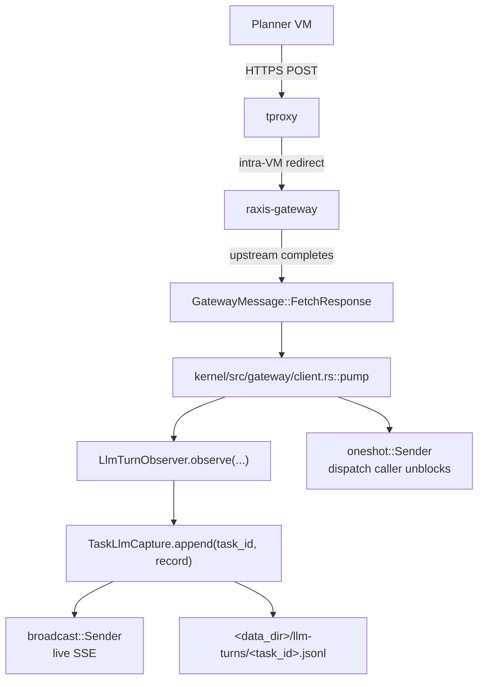

# Per-task LLM-turn capture

**Status.** Implemented. Spec parity with
`raxis/crates/dashboard-kernel/src/task_llm_capture.rs`,
`raxis/kernel/src/gateway/client.rs`,
`raxis/crates/dashboard/src/routes/tasks.rs`. Pinned by
`INV-DASHBOARD-TASK-LLM-CAPTURE-01..03`
([`raxis/specs/invariants.md §11.16`](../invariants.md)).

**Author intent.** Operators debugging a Failed task need to see
what the LLM actually returned on the turn that broke — not just
the post-hoc audit-event timeline. The audit chain captures
state transitions (intent accepted, witness accepted, session VM
exited); it does not — and should not — capture the raw response
JSON. This module owns that gap.

## Why a fresh capture surface (and not `SessionStreamCapture`)

The pre-existing
`raxis-dashboard-kernel::SessionStreamCapture` mirrors **audit
events** to the dashboard, keyed by `session_id`. That surface
serves the "what is this VM doing right now?" view:
`IntentAccepted`, `WitnessAccepted`, `SessionVmExited`, etc.

`TaskLlmCapture` is a parallel surface with a different key
shape (`task_id`) and a different payload (raw upstream LLM
bytes). Sharing the surface would conflate the two views and
force one to win on key shape; keeping them parallel keeps both
operator-actionable:

* `SessionStreamCapture` — "what is happening in **this VM**
  right now?" (audit-event timeline, keyed by `session_id`)
* `TaskLlmCapture` — "what did the LLM actually return for
  **this task** end-to-end?" (raw provider responses, keyed by
  `task_id` so they survive across every session that worked on
  the task)

A canonical task spans **three sessions** (orchestrator →
executor → reviewer) plus retries on premature exit, so
session-keyed capture would force the operator to manually merge
N files to debug one task. Task-keyed capture serves the natural
debug unit directly.

## On-disk shape

```text
<data_dir>/llm-turns/<task_id>.jsonl
```

One line per turn, JSON-serialized `LlmTurnRecord`:

```json
{
  "at_ms": 1715690234567,
  "task_id": "task-cap-1",
  "session_id": "01HXYZA...",
  "fetch_id": "9b7ac2e0-...",
  "status_code": 200,
  "latency_ms": 1842,
  "body": "{\"id\":\"msg_01...\",\"type\":\"message\",...}",
  "body_truncated": false,
  "original_body_bytes": 28471
}
```

Field semantics are documented on `LlmTurnRecord` itself.

## Bounds

| Knob                                | Default   | Rationale |
|-------------------------------------|-----------|-----------|
| `TaskCaptureConfig::max_file_bytes` | 4 MiB     | Roughly 2-3 large Anthropic Sonnet turns or 20-30 small turns; comfortably covers a single Failed-task debug session without filling the data dir. |
| `TaskCaptureConfig::max_body_bytes` | 256 KiB   | Above a typical Sonnet turn (30-150 KiB) but well below the gateway's 16 MiB hard cap; one runaway response cannot blow out the file ring. |
| `TaskCaptureConfig::broadcast_capacity` | 64    | Smooth dashboard scroll without queueing under typical agentic dispatch (one turn every few seconds). |

Compaction triggers at `max_file_bytes`: the file is rewritten
keeping only the most recent ~50 % of records, then the new
record is appended. One compaction per overflow keeps amortised
cost flat.

## Wire path



The observer fires **before** the dispatch caller unblocks, so
the operator-visible record durably lands before any audit emit
or FSM transition the dispatch loop drives in response.

## Dashboard route

```text
GET /api/tasks/:id/llm-turns?limit=N
```

* Auth: requires `Read` (or higher) role.
* Returns: `Vec<TaskLlmTurnView>` — the dashboard projection of
  `LlmTurnRecord` (JSON-friendly field names + `serde(skip)`
  on default-zero fields).
* Touches `data.get_task(id)` first so a typo'd id surfaces as
  `404 NotFound { kind: "task" }` rather than an empty body.
* Cap: `limit ≤ 500` (enforced by the data layer).

## Why "by the axum backend"

The user's request explicitly called out that the buffer should
live "by the axum backend" — i.e. in the same process that
serves the dashboard. The implementation honours that:

* The kernel binary owns BOTH the gateway pump (writer) and the
  axum dashboard server (reader) in the same process address
  space; the file ring lives on disk in `<data_dir>/llm-turns/`
  but the in-memory `Arc<TaskLlmCapture>` is shared between the
  two via `start_dashboard_with_advancer(..., task_llm_capture)`.
* The capture's broadcast sender is also held by the dashboard
  data layer, ready for a future SSE endpoint
  (`GET /api/tasks/:id/llm-turns/stream`) without re-plumbing the
  writer side.

## Future work (deliberately out of scope)

* **SSE / WebSocket live tail.** The broadcast sender is
  already wired; the FE would add a `<LlmTurnStream>` component
  hitting `GET /api/tasks/:id/llm-turns/stream`. The current
  implementation surfaces the persistent tail; adding the live
  stream is additive (no changes to capture / writer).
* **Operator purge endpoint.** A `DELETE /api/tasks/:id/llm-turns`
  surface so an operator can free disk on a known-debugged
  task without waiting for compaction.
* **Per-role TTL.** Reviewer turns are typically short and
  high-signal; orchestrator turns can be long and noisy.
  Per-role retention windows could trim the orchestrator's
  contribution more aggressively.
* **Decoded-body view.** Anthropic streaming responses are
  SSE; OpenAI is `text/event-stream` with `data:` framing;
  Gemini is JSON-Lines. The current capture stores raw bytes;
  a decoded view in the dashboard FE would parse + collapse
  the framing for readability without loss.

## Related invariants

* `INV-DASHBOARD-TASK-LLM-CAPTURE-01` — every gateway response
  with `task_id` MUST flow into the per-task ring before the
  dispatch caller unblocks.
* `INV-DASHBOARD-TASK-LLM-CAPTURE-02` — per-task file ring is
  bounded in disk by `max_file_bytes`; per-record bodies are
  bounded by `max_body_bytes` with a truncation marker.
* `INV-DASHBOARD-TASK-LLM-CAPTURE-03` — capture survives VM
  teardown for the task lifetime (the writer is the kernel, not
  the planner VM).
